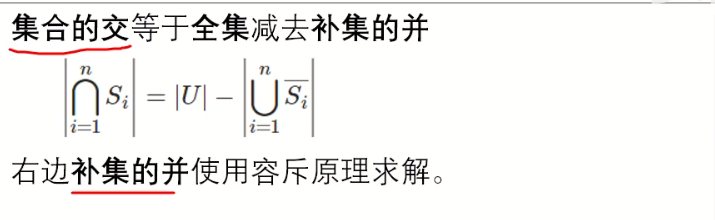

专题 | 数学2（组合计数,高斯消元,容斥原理）


# 目录

- 线性方程组 高斯消元法

- 容斥原理与Möbius函数

- 组合计数

- 康托展开

# 线性方程组 高斯消元法

[533 线性方程组 高斯消元法_哔哩哔哩_bilibili](https://www.bilibili.com/video/BV1Kd4y127vZ/?spm_id_from=333.999.0.0)

[www.luogu.com.cn](https://www.luogu.com.cn/problem/P3389)

## 题目

给定一个线性方程组，对其求解

### 输入格式

第一行，一个正整数 n

第二至 n+1 行，每行 n+1 个整数，为a1​,a2​⋯an​ 和 b，代表一组方程。

### 输出格式

共 n 行，每行一个数，第 i 行为 xi​ （保留 2 位小数）

如果不存在唯一解，在第一行输出 `No Solution`.

## 铺垫


我们对方程组进行以上操作。由方程组特性可以得到以下变换结论：


以上三个操作都不会对方程组的解产生影响

## 高斯消元法


消元，懂吧？

**e.g.**

$\begin{cases}a_1x+b_1y=c_1\\a_2x+b_2y=c_2\end{cases}$

针对以上，根据初等行变换，我们可以把下式中的$a_2x$消去（用$下式-n \times 上式$ 即可）

递推到$n$个方程的方程组，也是一样的。虽然我们可能不能将两个方程消到单项式个数相同，但每个之间相差一个是一定可以做到的。

进一步地，我们还可以将消去后的方程组的每一个方程的第一个单项式（我们把这个单项式里的未知数$x$作为这个方程的主元）的系数化为$1$.然后从下往上，依次求解带入上面一个方程，就完工啦！


概括一下，就是

1. 找

2. 换

3. 主元系数变为1

4. 其他方程的该系数变为0

下面就先举例解释：


图

1. 初始状态

2. 从第i=1行问下，寻找第一个“主元$x_1$（第i=1个单项式）系数不为0的方程”并且将它交换到第i=1行

3. 将主元系化为1

4. 将第i=1行下方的方程（或者是说未**处理过的方程**）如果有$x_1$的系数不为0的，就用**变换3**将其系数变为0

5. i=2，重复以上2~4步操作

6. ...

7. ...所有方程组都处理完毕后，从下往上，逐步计算出$x_3,x_2,x_1$的值（从下往上代入）

### 代码

代码如下

```C++
#define db double

db a[N][N];
bool gauss(){
	for(int i=1;i<=n;i++){
		int r=1;//找 
		for(int k=i;k<=n;k++){
			if(a[k][i]!=0){
				r=k;
				break;
			}
		}
		if(k!=i)swap(a[r],a[i])//换
		if(a[i][i]==0.00)return 0;
		
		for(int j=n+1;j>=i;j++){
			a[i][j]/=a[i][i];//变主元系数为1 
		} 
		for(int j=i+1;j<=n;j++){//此处倒序因为要用到a[j][i],因此循环从n->i,ij为行,k为列,i同时也是第i行主元所在的列 
			if(a[j][i]==0.00)continue;//小小的优化一下 
			for(int k=n=1;j>=i;k--)a[j][k]-=a[j][i]*a[i][k];//变其它数字的系数为0 
		} 
	}
	
	//处理完之后,开始从下往上代回
	for(int i=n-1;i>0;i--){//求x_i 
		for(int j=i+1;j<=n;j++)//将x_i+1~x_n代入
			a[i][n+1]-=a[i][j]*a[j][n+1];//减法是移项的结果,原式为xi+a[i][j]*a[j][n+1]=a[i][n+1],xi=a[i][n+1]-a[i][j]*a[j][n+1]
			//a[j][n+1]就存了x_j的值,并且会在之前处理出来 
	}
	return 1; 
}


```

难点解析

```C++
for(int k=n=1;j>=i;k--)a[j][k]-=a[j][i]*a[i][k];//变其它数字的系数为0 
```

`a[j][k]-=a[j][i]*a[i][k]`什么意思??

考察以下方程组

$\begin{cases}x+b_1y=c_1\\ax+b_2y=c_2\end{cases}$

我们怎么样将方程2的第一个单项式系数化为0呢?

当然是将它减去 $n$$ \times 方程1$ 了

那么这个比$n$是多少?

恰恰是`a[j][i]`,即方程组中的$a$（注意，这是因为此时第i=1个方程组的主元系数已经化为了1）

那么对于**方程2**，我们将$a$减去$1\times a$ ，将$b_2$减去$ b_1 \times a $，将$c_2$减去$c_1 \times a$，就相当于将**方程2**减去了$a \times 方程1$，满足变换3


## 高斯-约旦消元法


模拟一下过程


图

1. 和前面的一样

2. 和前面的一样，但此处我们**不需要**将主元系数化为1了

3. i=2，用**方程2**将其他方程的第i=2个单项式的系数化为0（此处凑巧将第3个单项式也化为了0，纯属巧合）.因为在第2步已经把**方程2**的第一项系数化为0，因此不会对已经处理好的**方程1**的**主元项**造成影响。同样，我们**不需要**将主元系数化为1

4. 同3

5. 将$c_i$除以主元的系数，得到的新$c_i$就是方程组的解$x_i$

### 代码

注释：`fabs()`是对于小数的`abs()`

```C++
//变量
long double a[M][M];
int n,b,c,x[N],y[N],ans,res,tmp,cnt,m;

int gauss_jordan(){
    for(int i=1;i<=n;i++){
		int idx=i;
		for(int j=i;j<=m;j++)if(fabs(a[j][i])>fabs(a[idx][i]))idx=j;
		if(fabs(a[idx][i])>1e-10)for(int k=i;k<=n+1;k++)swap(a[i][k],a[idx][k]);//将当前系数最大的方程交换到第i行
		else continue;//当前主元系数为0
		for(int j=n+1;j>=i;j--)a[i][j]/=a[i][i];
		for(int j=1;j<=m;j++)if(j!=i){//将其他方程的这一元消去,最后只留下对角线的元
			for(int k=n+1;k>0;k--)a[j][k]-=a[j][i]*a[i][k];
		}
		
		 
	}
	for(int i=1;i<=m;i++){
		int flg=0;
		for(int j=1;j<=n;j++)if(fabs(a[i][j])<1e-10&&fabs(a[i][n+1])>1e-10)flg++;//先判无解
		if(flg==n)return -1;
	}
	for(int i=1;i<=n;i++)if(fabs(a[i][i])<1e-10)return 0;//再判多解
	return 1;
}

signed main(){
	scanf("%d%d",&n,&m);
	for(int i=1;i<=m;i++){
		for(int j=1;j<=n+1;j++)cin>>a[i][j];
	}
	
	int flg=gauss_jordan();
	if(flg==-1)cout<<"No solutions";
	if(flg==0)cout<<"Many solutions";
	if(flg==1){
		for(int i=1;i<=n;i++)cout<<(int)(a[i][n+1]+0.5)<<endl;//printf("%.2Lf\n",a[i][n+1]);
	}
	
	
	return 0;
}

```

**关于一组hack**

```Plain Text
3 3
0 0 1 1 
0 1 0 1
0 1 0 1
```

因此，以下写法是错误的！

```C++
for(int i=1;i<=m;i++)if(fabs(a[i][i])<1e-10&&fabs(a[i][n+1])>1e-10)return -1;//先判无解
```


# 容斥原理


## 集合的并


将三个集合内容相加，去重


**注意1**


我们可以注意到以上特点，而不需要使用试除法

**注意2**


**代码**

```C++
    
```


**重点**

重点理解

- `sign`的含义

- `if((LL)t*prim[j]>n)`的含义

- 位运算

复杂度


## 集合的交



**e.g.**


交集为{2,5}

注：绿框不是集合

**例题**

[547 容斥原理 集合的交_哔哩哔哩_bilibili](https://www.bilibili.com/video/BV1ZK41127tu/?spm_id_from=autoNext&vd_source=f45ea4e1e4b3b73d5f07c57b46c43aba)

[https://luogu.com.cn/problem/P1450](https://luogu.com.cn/problem/P1450)

# 组合数

介绍组合数的4种不同的方法。

[董晓算法的个人空间-董晓算法个人主页-哔哩哔哩视频](https://space.bilibili.com/517494241/search/video?keyword=组合)

## 递推法


递推初始值


当$j=0$时$c(i,j)=1$.

每个数由其上方和左上方的数相加得来（**杨辉三角**）

```C++

void init(){
	c[0][0]=1;//从0开始！
	for(int i=1;i<=n;i++){
		c[i][0]=1;
		for(int j=1;j<=n;j++){
			c[i][j]=c[i-1][j]+c[i-1][j-1]%MOD;
		}
	}
//	for(int i=0;i<=10;i++){
//		for(int j=0;j<=i;j++){
//			cerr<<c[i][j]<<' ';
//		}
//		cerr<<endl;
//	}
}
```

## 快速幂


考察题目要求


复习**乘法逆元**相关知识，理解$g[x]$的含义


复习**费马小定理**，得：

在$p$为质数时，$a^{p-2}$即$a$在模$p$下的逆元

因此我们使用快速幂求$a^{p-2}$（也就是求$(x!)^{-1}$，当然，$x!$需要递推求出，因此我们可以把$1!\sim n!$的逆元全部预处理出来）


## Lucas定理


方法：

递推+快速幂（即下方标识的“可以直接求解”）


**证明**


$inv(x)$就是$x$的乘法逆元

易证。


由引理2得，当$i=1\sim p-1$时，都满足引理1，求和时全部约掉，只剩下$i=0$和$i=p$两种特殊情况，分别代入，得到两个单项式为$1$和$x^p$

易证。

**补充**

请学习**二项式定理！**


在(2)中使用了**引理2**

使用的方法为**比较系数法**

```C++
/*////////ACACACACACACAC///////////
       . Code  by  Ntsc .
       . Earn knowledge .
/*////////ACACACACACACAC///////////

#include<bits/stdc++.h>
#define int long long
#define db double
#define rtn return
using namespace std;

const int N=2e5+5;
const int M=1e5;
const int Mod=1e5;
const int INF=1e5;

int n,m,p,q,T,fac[N],ans;

int ksm(int c,int k,int p) {
//	p=p;
	if(!c)return 0;
	int res=1;
	while(k){
		if(k&1)res=(res*c)%p;
		c=(c*c)%p;k>>=1;
	}
	return res;
}

void comb_init(){
	fac[0]=1;
	for (int i=1;i<=p;++i) fac[i]=fac[i-1]*i%p;
}

int inv(int x){
	
    return ksm(x,p-2,p);//请保证p为质数
} 

int C(int n,int m){
	if(n-m<0)return 0;
	//n==m时不能rt 0 
    return fac[n]*inv(fac[m])%p*inv(fac[n-m])%p;
}


int lucas(int n,int m){
	if(n==p)return 0;
	if(m==0)return 1;
	return lucas(n/p,m/p)*C(n%p,m%p)%p;
}

signed main(){
	
	cin>>T;
	while(T--){
		cin>>n>>m>>p;comb_init();
		cout<<lucas(n+m,n)<<endl;
	}
	return 0;
}


```

## 高精度&线性筛

背景


小技巧


原理


我们将$C_n^m$分解质因数，然后逐步累乘进$C_n^m$

乍一看**第2步**可能看不到，这里就介绍一下：

$c[i]$的初始值为$1$，后面将$C_n^m$的质因数逐步求出来（从小到大），即遍历质数表从小到大，求出质数$p_i$的个数$n$，然后指向$n$次将$c[i]*=p_i$

代码

```C++
/*////////ACACACACACACAC///////////
       . Code by Ntsc .
       . Love by Liye .
/*////////ACACACACACACAC///////////

#include<bits/stdc++.h>
#define ll long long
#define db double
#define rtn return
using namespace std;

const int N=1e4;
const int M=1e5;
const int Mod=1e5;
const int INF=1e5;

int n,m,ans,cnt,p,l;
int prim[N],notp[N],b[N];
int get(int n,int p){//计算n!中质数p的个数,根据公式 
	int s=0;
	while(n)s+=n/p,n/=p;//point1 
	return s;
}
int getc(int n,int m,int p){//计算c_n^m中质数p的个数 
	return get(n,p)-get(m,p)-get(n-m,p);//分子中p的个数-分母中p的个数 
}
void mul(int c[],int p,int &l){//高精度×单精度 
	int t=0;
	for(int i=0;i<l;i++){
		t+=c[i]*p;
		c[i]=t%10;
		t/=10;
	}
	while(t){
		l++;
		c[l]=t%10;
		t/=10;
	}
}
void init(){//初始化筛质数表 
	for(int i=2;i<=N;i++){
		if(!notp[i])prim[++cnt]=i;
		for(int j=i;j<N;j+=i)notp[j]=1;
	}
}
signed main(){
	init();
	
	cin>>n>>m; 
	int c[N],l=1;c[0]=1;
	for(int i=1;i<=cnt;i++){//遍历每一个质数 
		int p=prim[i];
		int s=getc(n,m,p);//求出c_n^m中质数p的个数
		while(s--)mul(c,p,l) ;//将c乘上p,乘n次 
	} cout<<"OK"<<endl;
	for(int i=l;i;i--)cout<<c[i];
	return 0;
}

```

```C++
/*////////ACACACACACACAC///////////
       . Code by Ntsc .
       . Love by Liye .
/*////////ACACACACACACAC///////////

#include<bits/stdc++.h>
#define ll long long
#define db double
#define rtn return
using namespace std;

const int N=1e4+5;
const int M=1e5;
const int Mod=1e5;
const int INF=1e5;

int n,m,ans,cnt,p,l;
int prim[M],notp[M],c[M];
int get(int n,int p){//计算n!中质数p的个数,根据公式 
	int s=0;
	while(n)s+=n/p,n/=p;//point1 
	return s;
}
int getc(int n,int m,int p){//计算c_n^m中质数p的个数 
	return get(n,p)-get(m,p)-get(n-m,p);//分子中p的个数-分母中p的个数 
}
void mul(int c[],int p){//高精度×单精度 
	int t=0;
	for(int i=0;i<l;i++){
		t+=c[i]*p;
		c[i]=t%10;
		t/=10;
	}
	while(t){
		l++;
		c[l]=t%10;
		t/=10;
	}
}
void init(){//初始化筛质数表 
	for(int i=2;i<=N;i++){
		if(!notp[i])prim[++cnt]=i;
		for(int j=i;j<=N;j+=i)notp[j]=1;
	}
}
signed main(){
	init();
	
	cin>>n>>m; 
	l=1;c[0]=1;
	for(int i=1;i<=cnt;i++){//遍历每一个质数 
		int p=prim[i];
		int s=getc(n,m,p);//求出c_n^m中质数p的个数
		while(s--)mul(c,p) ;//将c乘上p,乘n次 
	} 
//	cout<<"OK"<<endl;
	for(int i=l-1;i+1;i--)cout<<c[i];
	cout<<endl<<"cnt="<<cnt<<" l="<<l<<endl;
	for(int i=1;i<=cnt;i++)cout<<prim[i]<<' '; 
	return 0;
}

```

point1：

我们要懂得将

$\frac{n}{p^i}$

转化为

$\frac{\frac{n}{p^{i-1}}}{p}$

从而递推，不需要计算$p^i$

## 标准函数

```C++

int C(int u, int v) { return fac[u] * inv[v] % P * inv[u - v] % P; }

signed main() {
    fac[0] = 1;
    for (int i = 1; i <= N - 2; i++) fac[i] = (fac[i - 1] * i) % P;

    inv[1] = 1, inv[0] = 1;  // att!当n=m时特判，组合为1
    for (int i = 2; i <= N - 2; i++) inv[i] = ((P - P / i) * inv[P % i]) % P;
    for (int i = 1; i <= N - 2; i++) inv[i] = (inv[i] * inv[i - 1]) % P;
  //...
}
```

# 组合数学常用模型

## 错排列

圆排列

鸽巢原理

容斥原理

## 卡特兰数

[卡特兰数 - OI Wiki](https://oi-wiki.org/math/combinatorics/catalan/)


```C++
	c[1]=c[0]=1;
	for(int i=1;i<=n;i++)c[i]=c[i-1]*(4*i-2)/(i+1);
```

[www.luogu.com.cn](https://www.luogu.com.cn/problem/P1044)


### 例题

[www.luogu.com.cn](https://www.luogu.com.cn/problem/P2532)


# 康托展开


## 逆康托展开


对于一个给定的$k$ ，求将自然数$1$ ~$k$ 所有的排列按照字典序从小到大排序后位于第$n$ 的排列。排序从$0$ 开始编号。

由于$n$ 有可能很大，所以现在将给你$k$ 个数，分别为$S_1$ ，$S_2$ ，……，$S_k$ ，规定$n$ 的计算方式为

$n=\sum_{i=1}^k S_i \times (k-i)!$

接下来$T$ 组数据，每组数据的第一行包含$1$ 个数$k$ （$1 \leq k \leq 500000$ ），第二行包含$k$ 个整数，第$i$ 个整数表示$S_i$ （$0 \leq S_i \leq k-i$ ）。

对于输入文件的每组数据，输出一行，包含$k$ 个数，为对应的$1$ ~$n$ 的排列。

---

我们考虑给出的信息，对于每一组数据，从前往后考虑每一个S_i，其实就是要我们输出当前还存在的数字中第S_i打的数字。权值线段树。

