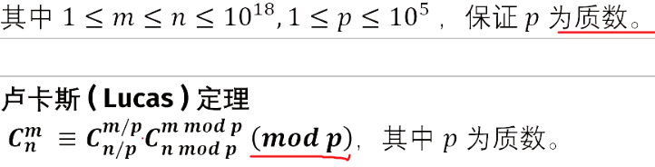
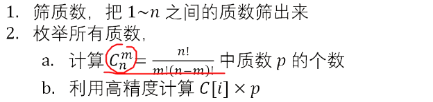

- 组合计数

- 康托展开

# 组合数

介绍组合数的4种不同的方法。

[董晓算法的个人空间-董晓算法个人主页-哔哩哔哩视频](https://space.bilibili.com/517494241/search/video?keyword=组合)

## 递推法


递推初始值


当$j=0$时$c(i,j)=1$.

每个数由其上方和左上方的数相加得来（**杨辉三角**）

```C++

void init(){
	c[0][0]=1;//从0开始！
	for(int i=1;i<=n;i++){
		c[i][0]=1;
		for(int j=1;j<=n;j++){
			c[i][j]=c[i-1][j]+c[i-1][j-1]%MOD;
		}
	}
//	for(int i=0;i<=10;i++){
//		for(int j=0;j<=i;j++){
//			cerr<<c[i][j]<<' ';
//		}
//		cerr<<endl;
//	}
}
```

## 快速幂


考察题目要求


复习**乘法逆元**相关知识，理解$g[x]$的含义


复习**费马小定理**，得：

在$p$为质数时，$a^{p-2}$即$a$在模$p$下的逆元

因此我们使用快速幂求$a^{p-2}$（也就是求$(x!)^{-1}$，当然，$x!$需要递推求出，因此我们可以把$1!\sim n!$的逆元全部预处理出来）


## Lucas定理



方法：

递推+快速幂（即下方标识的“可以直接求解”）


**证明**


$inv(x)$就是$x$的乘法逆元

易证。


由引理2得，当$i=1\sim p-1$时，都满足引理1，求和时全部约掉，只剩下$i=0$和$i=p$两种特殊情况，分别代入，得到两个单项式为$1$和$x^p$

易证。

**补充**

请学习**二项式定理！**


在(2)中使用了**引理2**

使用的方法为**比较系数法**

```C++
/*////////ACACACACACACAC///////////
       . Code  by  Ntsc .
       . Earn knowledge .
/*////////ACACACACACACAC///////////

#include<bits/stdc++.h>
#define int long long
#define db double
#define rtn return
using namespace std;

const int N=2e5+5;
const int M=1e5;
const int Mod=1e5;
const int INF=1e5;

int n,m,p,q,T,fac[N],ans;

int ksm(int c,int k,int p) {
//	p=p;
	if(!c)return 0;
	int res=1;
	while(k){
		if(k&1)res=(res*c)%p;
		c=(c*c)%p;k>>=1;
	}
	return res;
}

void comb_init(){
	fac[0]=1;
	for (int i=1;i<=p;++i) fac[i]=fac[i-1]*i%p;
}

int inv(int x){
	
    return ksm(x,p-2,p);//请保证p为质数
} 

int C(int n,int m){
	if(n-m<0)return 0;
	//n==m时不能rt 0 
    return fac[n]*inv(fac[m])%p*inv(fac[n-m])%p;
}


int lucas(int n,int m){
	if(n==p)return 0;
	if(m==0)return 1;
	return lucas(n/p,m/p)*C(n%p,m%p)%p;
}

signed main(){
	
	cin>>T;
	while(T--){
		cin>>n>>m>>p;comb_init();
		cout<<lucas(n+m,n)<<endl;
	}
	return 0;
}


```

## 高精度&线性筛

背景


小技巧


原理



我们将$C_n^m$分解质因数，然后逐步累乘进$C_n^m$

乍一看**第2步**可能看不到，这里就介绍一下：

$c[i]$的初始值为$1$，后面将$C_n^m$的质因数逐步求出来（从小到大），即遍历质数表从小到大，求出质数$p_i$的个数$n$，然后指向$n$次将$c[i]*=p_i$

代码

```C++
/*////////ACACACACACACAC///////////
       . Code by Ntsc .
       . Love by  .
/*////////ACACACACACACAC///////////

#include<bits/stdc++.h>
#define ll long long
#define db double
#define rtn return
using namespace std;

const int N=1e4;
const int M=1e5;
const int Mod=1e5;
const int INF=1e5;

int n,m,ans,cnt,p,l;
int prim[N],notp[N],b[N];
int get(int n,int p){//计算n!中质数p的个数,根据公式 
	int s=0;
	while(n)s+=n/p,n/=p;//point1 
	return s;
}
int getc(int n,int m,int p){//计算c_n^m中质数p的个数 
	return get(n,p)-get(m,p)-get(n-m,p);//分子中p的个数-分母中p的个数 
}
void mul(int c[],int p,int &l){//高精度×单精度 
	int t=0;
	for(int i=0;i<l;i++){
		t+=c[i]*p;
		c[i]=t%10;
		t/=10;
	}
	while(t){
		l++;
		c[l]=t%10;
		t/=10;
	}
}
void init(){//初始化筛质数表 
	for(int i=2;i<=N;i++){
		if(!notp[i])prim[++cnt]=i;
		for(int j=i;j<N;j+=i)notp[j]=1;
	}
}
signed main(){
	init();
	
	cin>>n>>m; 
	int c[N],l=1;c[0]=1;
	for(int i=1;i<=cnt;i++){//遍历每一个质数 
		int p=prim[i];
		int s=getc(n,m,p);//求出c_n^m中质数p的个数
		while(s--)mul(c,p,l) ;//将c乘上p,乘n次 
	} cout<<"OK"<<endl;
	for(int i=l;i;i--)cout<<c[i];
	return 0;
}

```

```C++
/*////////ACACACACACACAC///////////
       . Code by Ntsc .
       . Love by  .
/*////////ACACACACACACAC///////////

#include<bits/stdc++.h>
#define ll long long
#define db double
#define rtn return
using namespace std;

const int N=1e4+5;
const int M=1e5;
const int Mod=1e5;
const int INF=1e5;

int n,m,ans,cnt,p,l;
int prim[M],notp[M],c[M];
int get(int n,int p){//计算n!中质数p的个数,根据公式 
	int s=0;
	while(n)s+=n/p,n/=p;//point1 
	return s;
}
int getc(int n,int m,int p){//计算c_n^m中质数p的个数 
	return get(n,p)-get(m,p)-get(n-m,p);//分子中p的个数-分母中p的个数 
}
void mul(int c[],int p){//高精度×单精度 
	int t=0;
	for(int i=0;i<l;i++){
		t+=c[i]*p;
		c[i]=t%10;
		t/=10;
	}
	while(t){
		l++;
		c[l]=t%10;
		t/=10;
	}
}
void init(){//初始化筛质数表 
	for(int i=2;i<=N;i++){
		if(!notp[i])prim[++cnt]=i;
		for(int j=i;j<=N;j+=i)notp[j]=1;
	}
}
signed main(){
	init();
	
	cin>>n>>m; 
	l=1;c[0]=1;
	for(int i=1;i<=cnt;i++){//遍历每一个质数 
		int p=prim[i];
		int s=getc(n,m,p);//求出c_n^m中质数p的个数
		while(s--)mul(c,p) ;//将c乘上p,乘n次 
	} 
//	cout<<"OK"<<endl;
	for(int i=l-1;i+1;i--)cout<<c[i];
	cout<<endl<<"cnt="<<cnt<<" l="<<l<<endl;
	for(int i=1;i<=cnt;i++)cout<<prim[i]<<' '; 
	return 0;
}

```

point1：

我们要懂得将

$\frac{n}{p^i}$

转化为

$\frac{\frac{n}{p^{i-1}}}{p}$

从而递推，不需要计算$p^i$

## 标准函数

```C++

int C(int u, int v) { return fac[u] * inv[v] % P * inv[u - v] % P; }

signed main() {
    fac[0] = 1;
    for (int i = 1; i <= N - 2; i++) fac[i] = (fac[i - 1] * i) % P;

    inv[1] = 1, inv[0] = 1;  // att!当n=m时特判，组合为1
    for (int i = 2; i <= N - 2; i++) inv[i] = ((P - P / i) * inv[P % i]) % P;
    for (int i = 1; i <= N - 2; i++) inv[i] = (inv[i] * inv[i - 1]) % P;
  //...
}
```

# 组合数学常用模型

## 错排列

圆排列

鸽巢原理

容斥原理

## 卡特兰数

[卡特兰数 - OI Wiki](https://oi-wiki.org/math/combinatorics/catalan/)


```C++
	c[1]=c[0]=1;
	for(int i=1;i<=n;i++)c[i]=c[i-1]*(4*i-2)/(i+1);
```

[www.luogu.com.cn](https://www.luogu.com.cn/problem/P1044)


### 例题

[www.luogu.com.cn](https://www.luogu.com.cn/problem/P2532)


# 康托展开


## 逆康托展开


对于一个给定的$k$ ，求将自然数$1$ ~$k$ 所有的排列按照字典序从小到大排序后位于第$n$ 的排列。排序从$0$ 开始编号。

由于$n$ 有可能很大，所以现在将给你$k$ 个数，分别为$S_1$ ，$S_2$ ，……，$S_k$ ，规定$n$ 的计算方式为

$n=\sum_{i=1}^k S_i \times (k-i)!$

接下来$T$ 组数据，每组数据的第一行包含$1$ 个数$k$ （$1 \leq k \leq 500000$ ），第二行包含$k$ 个整数，第$i$ 个整数表示$S_i$ （$0 \leq S_i \leq k-i$ ）。

对于输入文件的每组数据，输出一行，包含$k$ 个数，为对应的$1$ ~$n$ 的排列。

---

我们考虑给出的信息，对于每一组数据，从前往后考虑每一个S_i，其实就是要我们输出当前还存在的数字中第S_i打的数字。权值线段树。

