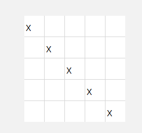

好东西

[组合数学入门—TwelveFold Way - wyxdrqcccc - 博客园](https://www.cnblogs.com/wyxdrqc/p/11696242.html)


介绍组合数的4种不同的方法。

[董晓算法的个人空间-董晓算法个人主页-哔哩哔哩视频](https://space.bilibili.com/517494241/search/video?keyword=组合)

# 组合数

## 下降幂

下降幂（Falling Power）是一种数学中的运算概念，通常表示为 $x^{\underline{k}}$，其中 (x) 是基数，(k) 是下降幂的次数。下降幂的定义是：

$ x^{\underline{k}} = x \times (x-1) \times (x-2) \times \cdots \times (x-k+1) $

也就是说，$x^{\underline{k}}$ 是 (x) 乘以 (x-1)，一直乘到 (x-k+1)。如果 (k = 0)，则 ($x^{\underline{0}} = 1$)，这是下降幂的边界条件。

例如：

$5^{\underline{3}} = 5 \times 4 \times 3 = 60$

$n^{\underline{1}} = n$

$x^{\underline{0}} = 1$

下降幂与通常的幂运算不同，通常的幂运算是 (x^k)，表示 (x) 自身相乘 (k) 次。而下降幂则涉及到一个递减的乘法序列。

下降幂在组合数学中非常有用，特别是在计算排列数（从 (n) 个不同元素中取出 (k) 个元素的排列数）时会经常遇到。它们与阶乘和排列数有直接的关系，例如：

$ x^{\underline{k}} = \frac{x!}{(x-k)!}$ 

其中 (x!) 表示 (x) 的阶乘。

## 组合数的求法

### 递推法求组合数


递推初始值


当$j=0$时$c(i,j)=1$.

每个数由其上方和左上方的数相加得来（**杨辉三角**）

```C++

void init(){
	c[0][0]=1;//从0开始！
	for(int i=1;i<=n;i++){
		c[i][0]=1;
		for(int j=1;j<=n;j++){
			c[i][j]=c[i-1][j]+c[i-1][j-1]%MOD;
		}
	}
//	for(int i=0;i<=10;i++){
//		for(int j=0;j<=i;j++){
//			cerr<<c[i][j]<<' ';
//		}
//		cerr<<endl;
//	}
}
```

### 快速幂+倒推求组合数


求$C_{n}^{m}\mod(10^9+7)$的值。

考察题目要求


考虑用$C_{n}^{m}=\frac{n!}{(n-m)!m!}$直接计算。
开两个数组分别存模意义下的阶乘和阶乘的逆元，
用f[x]存x!(mod p)的值，
用g[x]存$(x!)^{-1}(\bmod~~ p)$的值。


复习乘法逆元相关知识，理解g[x]的含义。
因为p是质数且n,m都小于p，即n,m与p互质，
所以根据费马小定理$a\cdot a^{p-2}=1\pmod p$,
可以用快速幂求逆元。

复习**乘法逆元**相关知识，理解$g[x]$的含义

因为$p$是质数且$n,m$都小于$p$,即$n,m$与$p$互质，所以根据费马小定理$a\cdot a^{n-2}\equiv1\pmod p$，可以用快速幂求逆元。

复习**费马小定理**，得：

在$p$为质数时，$a^{p-2}$即$a$在模$p$下的逆元

因此我们使用快速幂求$a^{p-2}$（也就是求$(x!)^{-1}$，当然，$x!$需要递推求出，因此我们可以把$1!\sim n!$的逆元全部预处理出来）

```C++
void comb_init(){
	fac[0]=1;
	for (int i=1;i<=n;++i) fac[i]=fac[i-1]*i%MOD;
	inv[n]=ksm(fac[n],MOD-2,MOD);
    for(int i=n;i>=1;i--)inv[i-1]=inv[i]*i%MOD;//i!的inv 
}
```

查询

```C++
int C(int n,int m){
  if(n<0||m<0)return 0;
    if(n<m)return 0;
    return fac[n]*inv[m]%MOD*inv[n-m]%MOD;
}
```

注意，这种方法只能预处理[1,p-1]内的组合数。如果越界，则结果均为0，因为出现了p的倍数。

### Lucas定理求组合数

卢卡斯（Lucas）定理
$ C_{ n }^{ m }\equiv C_{ n/p }^{ m/p }.C_{ n\mod p }^{ m\mod p }( mod\  p)$, 其中p为质数。

方法：

递推+快速幂（即下方标识的“可以直接求解”）

n % p 和 m % p 一定是小于 p 的数，可以直接求解，

C(n/p,m/p) 可以继续用 Lucas 定理解求。

边界条件：当 m = 0 时，返回 1。

**证明**


引理1：$C_{p}^{x}\equiv 0\:(mod\: p),\:\: 0<x<p$
因 $ C_{p}^{x}= \frac{p!}{x!(p-x)!}= \frac{p(p-1)!}{x(x-1)!(p-x)!}= \frac{p}{x}C_{p-1}^{x-1}$
故 $C_{p}^{x}\equiv p\cdot inv(x)C_{p-1}^{x-1}\equiv 0\:(mod\: p)$。


$inv(x)$就是$x$的乘法逆元

易证。

引理2：$(1+x)^p≡1+x^p(mod p)$
由二项式定理$(1+x)^p=\sum_{i=0}^{p}C_{p}^{i}x^i$，
由引理1知，只剩i＝0，p两项，得证。

由引理2得，当$i=1\sim p-1$时，都满足引理1，求和时全部约掉，只剩下$i=0$和$i=p$两种特殊情况，分别代入，得到两个单项式为$1$和$x^p$

易证。

**补充**

请学习**二项式定理！**

证明:
令 $n = ap + b, m = cp + d$
$(1+x)^n\equiv \sum_{i=0}^{n} C_n^i x^i \pmod{p}$ ---(1)
$(1+x)^n\equiv (1+x)^{ap+b}$
$\equiv ((1+x)^p)^a \cdot (1+x)^b$
$\equiv (1+x^p)^a \cdot (1+x)^b$
$=\sum_{i=0}^{a}C_a^ix^{ip}\cdot\sum_{j=0}^{b}C_b^jx^j\pmod{p}$---(2)

（1）式中$x^m$ 的系数为 $C_n^m$

（2）式中$x^m=x^{cp}\cdot x^d$ 的系数为 $C_a^cC_b^d$

故$C_n^m\equiv C_a^cC_b^d\pmod{p}$

即$C_n^m\equiv C_{n/p}^{m/p}C_{n\mod p}^{m\mod p}\pmod{p}$ 证毕。

在(2)中使用了**引理2**

使用的方法为**比较系数法**

```C++
/*////////ACACACACACACAC///////////
       . Code  by  Ntsc .
       . Earn knowledge .
/*////////ACACACACACACAC///////////

#include<bits/stdc++.h>
#define int long long
#define db double
#define rtn return
using namespace std;

const int N=2e5+5;
const int M=1e5;
const int Mod=1e5;
const int INF=1e5;

int n,m,p,q,T,fac[N],ans;

int ksm(int c,int k,int p) {
//	p=p;
	if(!c)return 0;
	int res=1;
	while(k){
		if(k&1)res=(res*c)%p;
		c=(c*c)%p;k>>=1;
	}
	return res;
}

void comb_init(){
	fac[0]=1;
	for (int i=1;i<=p;++i) fac[i]=fac[i-1]*i%p;
}

int inv(int x){
	
    return ksm(x,p-2,p);//请保证p为质数
} 

int C(int n,int m){
	if(n-m<0)return 0;
	//n==m时不能rt 0 
    return fac[n]*inv(fac[m])%p*inv(fac[n-m])%p;
}


int lucas(int n,int m){
	if(n==p)return 0;
	if(m==0)return 1;
	return lucas(n/p,m/p)*C(n%p,m%p)%p;
}

signed main(){
	
	cin>>T;
	while(T--){
		cin>>n>>m>>p;comb_init();
		cout<<lucas(n+m,n)<<endl;
	}
	return 0;
}


```

### 高精度&线性筛求组合数

背景

组合数的增长速度是非常快的，必须用高精度存取。$C_{100}^{50}$是30位数，$C_{1000}^{500}$是300位数，$C_{10000}^{5000}$是3009位数。


小技巧

n!中p的个数：$s=\frac{n}{p} +\frac{n}{p^2}+\frac{n}{p^3}+…$

原理

1. 筛质数，把1~n之间的质数筛出来

2. 枚举所有质数
a.计算$C_n^m=\frac{n!}{m!(n-m)!}$中质数p的个数
b.利用高精度计算$C[i]\times p$

我们将$C_n^m$分解质因数，然后逐步累乘进$C_n^m$

乍一看**第2步**可能看不到，这里就介绍一下：

$c[i]$的初始值为$1$，后面将$C_n^m$的质因数逐步求出来（从小到大），即遍历质数表从小到大，求出质数$p_i$的个数$n$，然后指向$n$次将$c[i]*=p_i$

代码

```C++
/*////////ACACACACACACAC///////////
       . Code by Ntsc .
       . Love by  .
/*////////ACACACACACACAC///////////

#include<bits/stdc++.h>
#define ll long long
#define db double
#define rtn return
using namespace std;

const int N=1e4;
const int M=1e5;
const int Mod=1e5;
const int INF=1e5;

int n,m,ans,cnt,p,l;
int prim[N],notp[N],b[N];
int get(int n,int p){//计算n!中质数p的个数,根据公式 
	int s=0;
	while(n)s+=n/p,n/=p;//point1 
	return s;
}
int getc(int n,int m,int p){//计算c_n^m中质数p的个数 
	return get(n,p)-get(m,p)-get(n-m,p);//分子中p的个数-分母中p的个数 
}
void mul(int c[],int p,int &l){//高精度×单精度 
	int t=0;
	for(int i=0;i<l;i++){
		t+=c[i]*p;
		c[i]=t%10;
		t/=10;
	}
	while(t){
		l++;
		c[l]=t%10;
		t/=10;
	}
}
void init(){//初始化筛质数表 
	for(int i=2;i<=N;i++){
		if(!notp[i])prim[++cnt]=i;
		for(int j=i;j<N;j+=i)notp[j]=1;
	}
}
signed main(){
	init();
	
	cin>>n>>m; 
	int c[N],l=1;c[0]=1;
	for(int i=1;i<=cnt;i++){//遍历每一个质数 
		int p=prim[i];
		int s=getc(n,m,p);//求出c_n^m中质数p的个数
		while(s--)mul(c,p,l) ;//将c乘上p,乘n次 
	} cout<<"OK"<<endl;
	for(int i=l;i;i--)cout<<c[i];
	return 0;
}

```

```C++
/*////////ACACACACACACAC///////////
       . Code by Ntsc .
       . Love by  .
/*////////ACACACACACACAC///////////

#include<bits/stdc++.h>
#define ll long long
#define db double
#define rtn return
using namespace std;

const int N=1e4+5;
const int M=1e5;
const int Mod=1e5;
const int INF=1e5;

int n,m,ans,cnt,p,l;
int prim[M],notp[M],c[M];
int get(int n,int p){//计算n!中质数p的个数,根据公式 
	int s=0;
	while(n)s+=n/p,n/=p;//point1 
	return s;
}
int getc(int n,int m,int p){//计算c_n^m中质数p的个数 
	return get(n,p)-get(m,p)-get(n-m,p);//分子中p的个数-分母中p的个数 
}
void mul(int c[],int p){//高精度×单精度 
	int t=0;
	for(int i=0;i<l;i++){
		t+=c[i]*p;
		c[i]=t%10;
		t/=10;
	}
	while(t){
		l++;
		c[l]=t%10;
		t/=10;
	}
}
void init(){//初始化筛质数表 
	for(int i=2;i<=N;i++){
		if(!notp[i])prim[++cnt]=i;
		for(int j=i;j<=N;j+=i)notp[j]=1;
	}
}
signed main(){
	init();
	
	cin>>n>>m; 
	l=1;c[0]=1;
	for(int i=1;i<=cnt;i++){//遍历每一个质数 
		int p=prim[i];
		int s=getc(n,m,p);//求出c_n^m中质数p的个数
		while(s--)mul(c,p) ;//将c乘上p,乘n次 
	} 
//	cout<<"OK"<<endl;
	for(int i=l-1;i+1;i--)cout<<c[i];
	cout<<endl<<"cnt="<<cnt<<" l="<<l<<endl;
	for(int i=1;i<=cnt;i++)cout<<prim[i]<<' '; 
	return 0;
}

```

point1：

我们要懂得将

$\frac{n}{p^i}$

转化为

$\frac{\frac{n}{p^{i-1}}}{p}$

从而递推，不需要计算$p^i$

代码

```C++

int C(int u, int v) { return fac[u] * inv[v] % P * inv[u - v] % P; }

signed main() {
    fac[0] = 1;
    for (int i = 1; i <= N - 2; i++) fac[i] = (fac[i - 1] * i) % P;

    inv[1] = 1, inv[0] = 1;  // att!当n=m时特判，组合为1
    for (int i = 2; i <= N - 2; i++) inv[i] = ((P - P / i) * inv[P % i]) % P;
    for (int i = 1; i <= N - 2; i++) inv[i] = (inv[i] * inv[i - 1]) % P;
  //...
}
```

### 消除法

当n很大，m很小时，数组可能无法存储n的逆元，此时我们回到组合数的公式，将能消除的都消除，剩下的只有2m个项目了。

## 组合数学常用模型

### 错排列

错排列，又称作德利克雷排列，是指一个排列中没有任何一个元素在原来位置上的排列方式。例如，对于3个元素的错排列有2种：[2, 3, 1]和[3, 1, 2]。

那么我们怎么样求出长度为n的错排列的个数呢？我们考虑如下推导：



我们考虑这里有一个n\times n的矩阵，我们要在上面选n个点，其中点(x,y)表示位置x上的数为y。因此主对角线上的点是不可选的。

我们用D_n表示长度为n的错排列的方案数，同时也是n\times n的矩阵的填法的方案数

于是目前我们有(n-1)种填法。


假设我们填在橙色处，那么淡橙色区域后面就都不可填了。问题递归到下一层


那么这个子问题的方案是多少呢？我们继续考虑这里选哪个位置


如果选绿色的呢？我们发现就是D_{n-2}了。如果选其他的（蓝色）呢？我们发现可以视为第一个位置不可选，那么就是D_{n-1}了。

综上所述，有$D_n=(n-1)(D_{n-1}+D_{n-2})$

### 圆排列

圆排列是指在一个圆周上进行的排列，由于圆的旋转对称性，不同的旋转被视为相同的排列。例如，圆周上3个点的圆排列只有2种，因为每种排列可以通过旋转得到另外两种。

### 鸽巢原理

鸽巢原理，又称狄利克雷抽屉原理，简单来说就是如果有n个鸽子和m个鸽巢，且n > m，那么至少有一个鸽巢里有多于一个鸽子。例如，如果有10个苹果放入9个盒子里，至少有一个盒子里有不止一个苹果。

### 容斥原理

容斥原理是一个计数原理，用于计算多个集合的并集的大小。其基本思想是：先加上每个集合的大小，然后减去每对交集的大小，再加上三个集合交集的大小，以此类推。例如，计算三个集合A、B、C的并集大小，公式为：|A∪B∪C| = |A| + |B| + |C| - |A∩B| - |A∩C| - |B∩C| + |A∩B∩C|。

### 卡特兰数

[卡特兰数](%E7%BB%84%E5%90%88%E8%AE%A1%E6%95%B0/%E5%8D%A1%E7%89%B9%E5%85%B0%E6%95%B0%20287f99df-2375-42d5-8856-f26e36768add.md)

## 隔板法

### 例题 #1


思路

注意了，你潜意识里的隔板法是错误的！

看看这道题，我们也许回想把樱花树当成隔板插进去，那我们就有n-m+1个位置可以放置隔板，那么我们就是要在n-m+1个位置中选择m个位置。那么不就是组合数C(n-m+1,m)吗？然后我们在考虑樱花的编号，那么就再乘上一个A(m,m)。这是可行的。

再看看另外一种做法**：**

我们先满足每两个花之间必须要有一个空位，总共n-m个空位，那么我们就使用了m-1个空位，剩下还有n-2m+1个空位，我们把它分配给m+1个位置。隔板法后就是$x_1+\dots+x_{m+1}=n-m+2$。

注意了，这里我们进行隔板法，是m个隔板放入n-m+1个位置！！！！而不是m+1个隔板放入n-m+2个位置。那么现在就可解了。

## 多重集合

### 多重集的排列数

假设你有 $k$ 种不同的球，每个球的个数分别为 $n_1, n_2,..., n_k$ （其中 $\sum_{i=1}^{k}n_i = n$ ）。这 $n$ 个球的全排列数即为多重集合的排列数。多重集合的排列数通常被称为多重组合数。我们可以使用多重组合数的符号来表示上述公式：
$\left(\begin{array}{c}n\\n_{1}, n_{2}, \ldots, n_{k}\end{array}\right)=\frac{n !}{\prod_{i=1}^{k} n_{i} !}$

### 多重集的组合数

设$S=\{n_{1}\cdot a_{1},n_{2}\cdot a_{2},\cdots,n_{k}\cdot a_{k}\}$表示由$n_{1}$个$a_{1}$，$n_{2}$个$a_{2}$，…，$n_{k}$个$a_{k}$组成的多重集。那么对于整数$r(r< n_{i},\forall i\in[1,k])$，从$S$中选择$r$个元素组成一个多重集的方案数就是多重集的组合数。这个问题等价于$x_{1}+x_{2}+\cdots+x_{k}=r$的非负整数解的数目，可以用插板法解决，答案为$\binom{r+k-1}{k-1}$

## 二项式定理

及将$(a+b)^p$拆分后各个项目的系数。第i项形如$ka^{i-1}b^{n-i+1}$。

那么怎么样计算这个k呢？我们发现将$(a+b)^p$展开为p个括号相乘后，我们要在每一个括号中选择a或者b。这里我们要选择i-1个a，所以方案就是在p个不同的球中选i-1个的方案数，就是C(p,i-1)。

