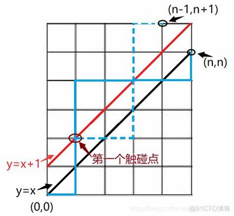
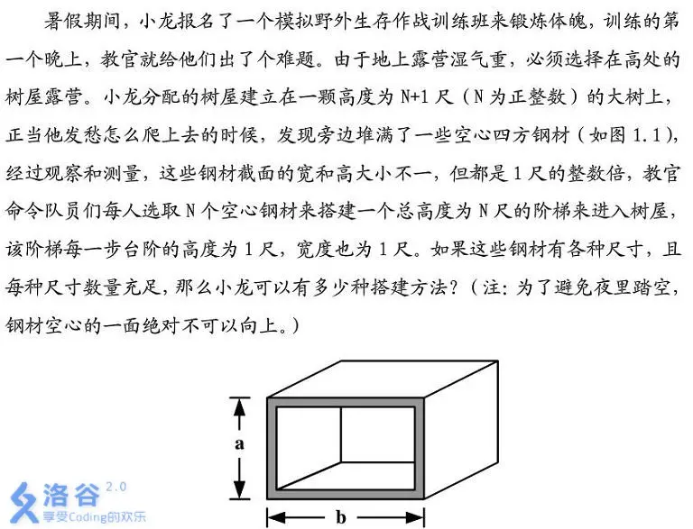
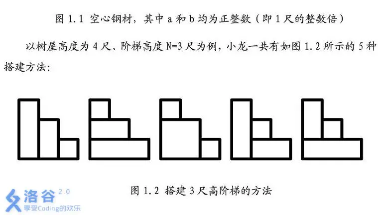
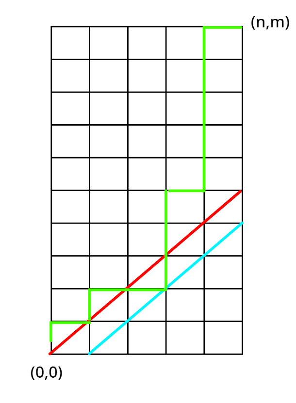

# 卡特兰数

[卡特兰(Catalan)数入门详解 - Morning_Glory - 博客园](https://www.cnblogs.com/Morning-Glory/p/11747744.html)


[卡特兰数 - OI Wiki](https://oi-wiki.org/math/combinatorics/catalan/)


## 公式


卡特兰数的一般形式为：

$C_n = \frac{1}{n+1} \binom{2n}{n} = \frac{(2n)!}{(n+1)!n!} $

对于第 ( n ) 个卡特兰数 ( C_n )，其前几个数值如下：

- ( C_0 = 1 )

- ( C_1 = 1 )

- ( C_2 = 2 )

- ( C_3 = 5 )

- ( C_4 = 14 )

- ( C_5 = 42 )

- ( C_6 = 132 )

- ( C_7 = 429 )

## 推导

$C_n =\binom{2n}{n}-\binom{2n}{n-1}$

其中\binom{2n}{n}表示：我们需要n个向上和n个向右操作，一共2n个，要选择n个向上的方案数。\binom{2n}{n-1}是什么呢？我们看图：



不合法的路径，必然穿过斜率为1的直线，也就是说碰到了y=x+1这条线。那么我们怎么样求出碰到y=x+1且最终到达(n,n)的点呢？我们以这条线g的第一个与l:y=x+1的交点为起始点，将g的后部分关于l对称，我们发现这条线一定以(x-1,x+1)为终点。

反过来，我们发现从(0,0)到(n-1,n+1)的路径在对称回来后都是我们上面定义的非法路径。因此求出路径条目即可。


## 应用

    卡特兰数在许多组合问题中自然出现，以下是一些著名的例子：

1. **括号匹配问题**：( C_n ) 表示用 ( n ) 对括号能够形成的不同括号序列的数量。

2. **二叉树问题**：有 ( n ) 个内部节点（即非叶节点）的二叉树的不同形态数量是 ( C_{n-1} )。

3. **多边形划分问题**：将一个凸多边形用 ( n-3 ) 条对角线划分成 ( n ) 个三角形的方法数是 ( C_{n-2} )。

4. **栈操作问题**：给定 ( n ) 个“进栈”操作和 ( n ) 个“出栈”操作的所有合法序列的数量是 ( C_n )。
卡特兰数在算法、计算机科学、数学证明等多个领域都有着重要的应用。它们通常通过递推关系式来计算：
$ C_{n+1} = \sum_{i=0}^{n} C_i C_{n-i} $
或者通过直接使用上面的公式计算。

```C++
	c[1]=c[0]=1;
	for(int i=1;i<=n;i++)c[i]=c[i-1]*(4*i-2)/(i+1);
```

[www.luogu.com.cn](https://www.luogu.com.cn/problem/P1044)


## 例题 #1 [AHOI2012] 树屋阶梯





输入格式

一个正整数 $N$，表示阶梯的高度。

输出格式

一个正整数，表示搭建方法的个数。**注**：搭建方法的个数可能很大。

- 对于 $100\%$ 的数据，满足 $1\le N\le 500$。

---


## 例题 #2 小L的栈

小L正试图用一个栈来构造一棵树，现在他已经构造了 n 个元素作为树的节点，只要将这 n 个元素依次入栈出栈就可以形成一棵树了。当然，这个问题与树并没有关系，所以它叫做小L的栈。

每次你可以入栈一个新元素或者当栈非空时出栈一个元素，n 个元素必须依次入栈，而小L希望其中第m个元素入栈之后，栈中恰好有 k 个元素，现在他想知道一共有多少种入栈出栈顺序满足这个条件。

注意：n个元素都需要经过一次入栈和出栈，也就是最后栈一定是空的。

输入数据

第一行一个正整数 T，表示数据组数。

对于每组数据包含一行三个正整数 n,m,k。

输出数据

对于每组数据输出一个整数表示答案。

由于答案可能过大，所以只需要输出对 109+7 取模后的答案。

对于100%的数据：1≤n,m,k≤106,T≤10000

---

要求求出经过一个定点的卡特兰路径条数。按定点分成两个部分，发现是卡特兰数的一般形式问题：



考虑从(0,0)到(n,m)，且不经过y=x。那么首先所有方案数为$\binom{n+m}{n}$，不合法的路径条目发现是等于到(m+1,n-1)的路径条目，因此是$\binom{n+m}{n-1}$。

于是一部分的答案就是$\binom{n+m}{n}-\binom{n+m}{n-1}$。

