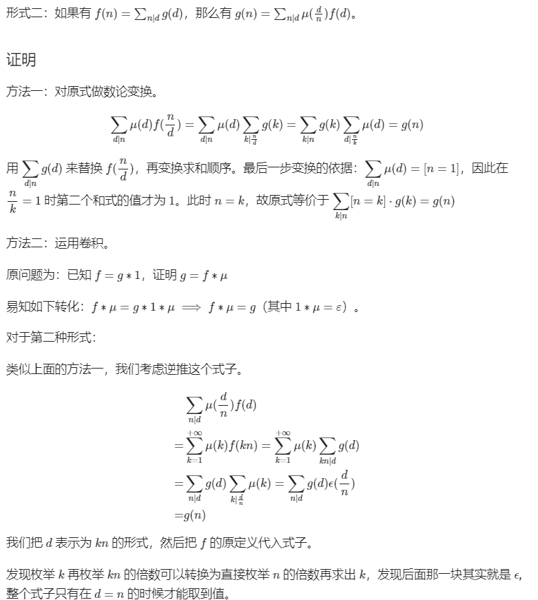
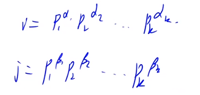
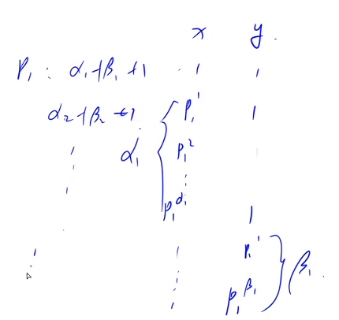

# 莫比乌斯反演

## 例题 #1 [POI2007] ZAP-Queries

密码学家正在尝试破解一种叫 BSA 的密码。

他发现，在破解一条消息的同时，他还需要回答这样一种问题：

给出 $a,b,d$，求满足 $1 \leq x \leq a$，$1 \leq y \leq b$，且 $\gcd(x,y)=d$ 的二元组 $(x,y)$ 的数量。

因为要解决的问题实在太多了，他便过来寻求你的帮助。

输入格式

输入第一行一个整数 $n$，代表要回答的问题个数。

接下来 $n$ 行，每行三个整数 $a,b,d$。

输出格式

对于每组询问，输出一个整数代表答案。

#### 数据规模与约定

对于全部的测试点，保证 $1 \leq n \leq 5 \times 10^4$，$1 \leq d \leq a,b \leq 5 \times 10^4$。

## 莫比乌斯函数 & 反演

摘自[学习笔记 | 莫比乌斯反演](https://flowus.cn/5d0d6514-d352-47dd-b781-0071fecf5502)

**莫比乌斯函数**

$\mu(x)=\begin{cases}0 &\exist d_i\geq 1 \\(-1)^k & \forall d_i=1\end{cases}$

性质：记$s(n)=\sum\limits_{i|n}\mu(i)$

有$s(x)=\begin{cases}0 &n>1\\1 &n=1\end{cases}$

证明：考虑n的约数i。根据定义，将质因数分解后得到质数为$d_i$，我们只需要考虑$d_i$要么是1要么是0的情况。并且如果d中有奇数个1，则$\mu(i)$为-1，否则为1。可以证明s(n)=0。n=1时为特例。

**莫比乌斯反演定理**

定义在正整数域的函数

$F(n)=\sum\limits_{i|n}f(i)$，则$f(n)=\sum\limits_{i|n}\mu(i)F(\frac{n}{i})$。这样说如果对于一道求f(n)的题目，其f(n)难求，但是F(n)好求，则可以使用该方程。

证明：（下文中$g(x)$即$F(x)$）




## 例题 #2 [HAOI2011] Problem b

题目描述

对于给出的 $n$ 个询问，每次求有多少个数对 $(x,y)$，满足 $a \le x \le b$，$c \le y \le d$，且 $\gcd(x,y) = k$，$\gcd(x,y)$ 函数为 $x$ 和 $y$ 的最大公约数。

思路

首先是差分转化，将矩形转化为前缀和

$F(k)=\sum\limits_{x=1}^a\sum\limits_{y=1}^b [k|\gcd(x,y)]$

$f(k)=\sum\limits_{x=1}^a\sum\limits_{y=1}^b [k=\gcd(x,y)]$，即题目要求的内容。

那么$F(n)=\sum\limits_{n|i}f(i)$

$f(n)=\sum\limits_{n|i}\mu(\frac{i}{n})F(i)$

可以知道$k|\gcd(x,y)=k|x,k|y$，故$F(k)=\sum\limits_{x=1}^a\sum\limits_{y=1}^b [k|\gcd(x,y)]=\lfloor \frac{a}{k}\rfloor\times \lfloor \frac{b}{k}\rfloor$

$f(n)=\sum\limits_{n|i}\mu(\frac{i}{n})\lfloor \frac{a}{i}\rfloor\times \lfloor \frac{b}{i}\rfloor$，令$D=\frac{i}{n}$，则$f(n)=\sum\limits_{D}\mu(D)\lfloor \frac{a}{Dn}\rfloor\times \lfloor \frac{b}{Dn}\rfloor$，a,b,n都是定值，只有D是变量。

这里插播一个$g(x)=k/(k/x)$，表示以$\lfloor \frac{k}{x}\rfloor$整数分块，$x$所在的块的最后一个数字。`/`表示c++除法

---

```C++
/*
Code by Ntsc
*/

#include<bits/stdc++.h>
using namespace std;
#define int long long
#define mp make_pair
#define ps second
#define pf first

#define rd read()
inline int read()
{
    int xx=0,ff=1;
    char ch=getchar();
    while(ch<'0'||ch>'9') {if(ch=='-') ff=-1;ch=getchar();}
    while(ch>='0'&&ch<='9') xx=xx*10+(ch-'0'),ch=getchar();
    return xx*ff;
}
inline void write(int out)
{
    if(out<0) putchar('-'),out=-out;
    if(out>9) write(out/10);
    putchar(out%10+'0');
}

const int N = 6e5+5;
int mu[N],st[N];
int n,cnt;
int sum[N];
int prime[N];

void init(){
    mu[1]=1;
    for(int i=2;i<N;i++){
        if(!st[i])prime[++cnt]=i,mu[i]=-1;
        for(int j=1;prime[j]*i<N;j++){
            st[prime[j]*i]=1;
            if(!(i%prime[j]))break;
            mu[prime[j]*i]=-mu[i];//根据定义偶正奇负
        }
    }

    for(int i=1;i<N;i++)sum[i]=sum[i-1]+mu[i];
}

int g(int k,int x){
    return k/(k/x);
}

int f(int a,int b,int k){
    a/=k,b/=k;
    n=min(a,b);
    int mn=min(a,b),res=0;
    for(int l=1,r;l<=n;l=r+1){
        r=min(n,min(g(a,l),g(b,l)));
        res+=(sum[r]-sum[l-1])*(a/l)*(b/l);
    }
    return res;
}

signed main(){
    init();
    int T=rd;
    while(T--){
        
        int a=rd,b=rd,c=rd,d=rd,k=rd;
        cout<<f(b,d,k)-f(a-1,d,k)-f(b,c-1,k)+f(a-1,c-1,k)<<endl;

    }

}
```

对于 $100\%$ 的数据满足：$1 \le n,k \le 5 \times 10^4$，$1 \le a \le b \le 5 \times 10^4$，$1 \le c \le d \le 5 \times 10^4$。

## 例题 #3 [SDOI2015] 约数个数和

题目描述

设 $d(x)$ 为 $x$ 的约数个数，给定 $n,m$，求
$\sum_{i=1}^n\sum_{j=1}^md(ij)$

### 思路

$d(ij)=\sum_{x|i}\sum_{y|j}[\gcd(x,y)=1]$，这个结论很重要

证明：

设i质因数分解后的指数为$a_i$，j质因数分解后的指数为$b_i$，那么首先可以知道ij的质因数个数为$(a_1+b_1+1)(a_2+b_2+1)\dots(a_k+b_k+1)$



我们再取ij的一个因数s=xy来说。对于$p_1$，为了满足x,y互质，则当x取$p_1^i$时，y只能取1。相同地，当y取$p_1^i$时，x只能取1。还有一种情况是两者都取1。那么合起来就有$a_1+b_1+1$种取值。这恰恰和计算质因数个数的式子一样了。



---

则$\sum_{i=1}^n\sum_{j=1}^md(ij)=\sum_{i=1}^n\sum_{j=1}^m\sum_{x|i}\sum_{y|j}[\gcd(x,y)=1]$。

设

$f(q)=\sum_{i=1}^n\sum_{j=1}^m\sum_{x|i}\sum_{y|j}[q=\gcd(x,y)]$

$F(q)=\sum\limits_{q|d}f(d)$，则有$f(q)=\sum\limits_{q|d}\mu(\frac{d}{q})F(d)$

推导：

$F(q)=\sum_{i=1}^n\sum_{j=1}^m\sum_{x|i}\sum_{y|j}[q|\gcd(x,y)]\\=\sum_{x=1}^n\sum_{y=1}^m\sum_{i=kx,k\in\Z}^n\sum_{j=ky,k\in\Z}^m[q|\gcd(x,y)]\\=\sum_{x=1}^n\sum_{y=1}^m\lfloor\frac{n}{x}\rfloor\lfloor\frac{m}{y}\rfloor[q|\gcd(x,y)]$

设 $x'=\frac{x}{q},y'=\frac{y}{q},n'=\frac{n}{q},m'=\frac{m}{q}$

则上式等于

$\sum_{x'=1}^{n'}\sum_{y'=1}^{m'}\lfloor\frac{n'}{x'}\rfloor\lfloor\frac{m'}{y'}\rfloor\\=(\sum_{x'=1}^{n'}\lfloor\frac{n'}{x'}\rfloor)(\sum_{y'=1}^{m'}\lfloor\frac{m'}{y'}\rfloor)$

定义 $h(n')=(\sum_{x'=1}^{n'}\lfloor\frac{n'}{x'}\rfloor)$

则 $F(q)=h(n')h(m')$

$f(q)=\sum\limits_{d=1}^n \mu(d)h(\frac{n}{d})h(\frac{m}{d})$，整数分块优化即可。

---

```C++
/*
Code by Ntsc
*/

#include<bits/stdc++.h>
using namespace std;
#define int long long
#define mp make_pair
#define ps second
#define pf first

#define rd read()
inline int read()
{
    int xx=0,ff=1;
    char ch=getchar();
    while(ch<'0'||ch>'9') {if(ch=='-') ff=-1;ch=getchar();}
    while(ch>='0'&&ch<='9') xx=xx*10+(ch-'0'),ch=getchar();
    return xx*ff;
}
inline void write(int out)
{
    if(out<0) putchar('-'),out=-out;
    if(out>9) write(out/10);
    putchar(out%10+'0');
}

const int N = 5e4+5;
int mu[N],st[N];
int e,cnt;
int sum[N];
int h[N];
int prime[N];

int g(int k,int x){
    return k/(k/x);
}

void init(){
    mu[1]=1;
    for(int i=2;i<N;i++){
        if(!st[i])prime[++cnt]=i,mu[i]=-1;
        for(int j=1;prime[j]*i<N;j++){
            st[prime[j]*i]=1;
            if(!(i%prime[j]))break;
            mu[prime[j]*i]=-mu[i];//根据定义偶正奇负
        }
    }

    for(int i=1;i<N;i++)sum[i]=sum[i-1]+mu[i];
    for(int i=1;i<N;i++){
        for(int l=1,r;l<=i;l=r+1){
            r=min(i,g(i,l));
            h[i]+=(r-l+1)*(i/l);
        }
    }
}

signed main(){
    // ios::sync_with_stdio(0);
    // cin.tie(0);cout.tie(0);
    init();
    int T=rd;
    while(T--){
        int n=rd,m=rd;
        int res=0;
        int k=min(n,m);
        for(int l=1,r;l<=k;l=r+1){
            r=min(min(g(n,l),g(m,l)),k);
            res+=(sum[r]-sum[l-1])*h[n/l]*h[m/l];
        }
        cout<<res<<'\n';
    }

}
```


【数据范围】
对于 $100\%$ 的数据，$1\le T,n,m \le 50000$。

## 例题 #4 公约数的和

题目背景

有一天，TIBBAR 和 LXL 比赛谁先算出 $1 \sim n$ 这 $n$ 个数中每任意两个不同的数的最大公约数的和。LXL 还在敲一个复杂而冗长的程序，争取能在 $100s$ 内出解。而 TIBBAR 则直接想 $1s$ 秒过而获得完胜，请你帮他完成这个任务。

题目描述

给定 $n$，求
$\sum_{i = 1}^n \sum_{j = i + 1}^n \gcd(i, j)$

其中 $\gcd(i, j)$ 表示 $i$ 和 $j$ 的最大公约数。

- 对于 $100\%$ 的数据，保证 $2 \leq n \leq 2 \times 10^6$。


