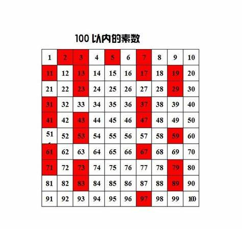
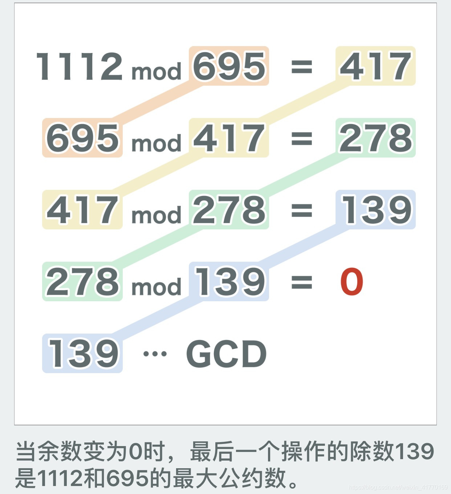
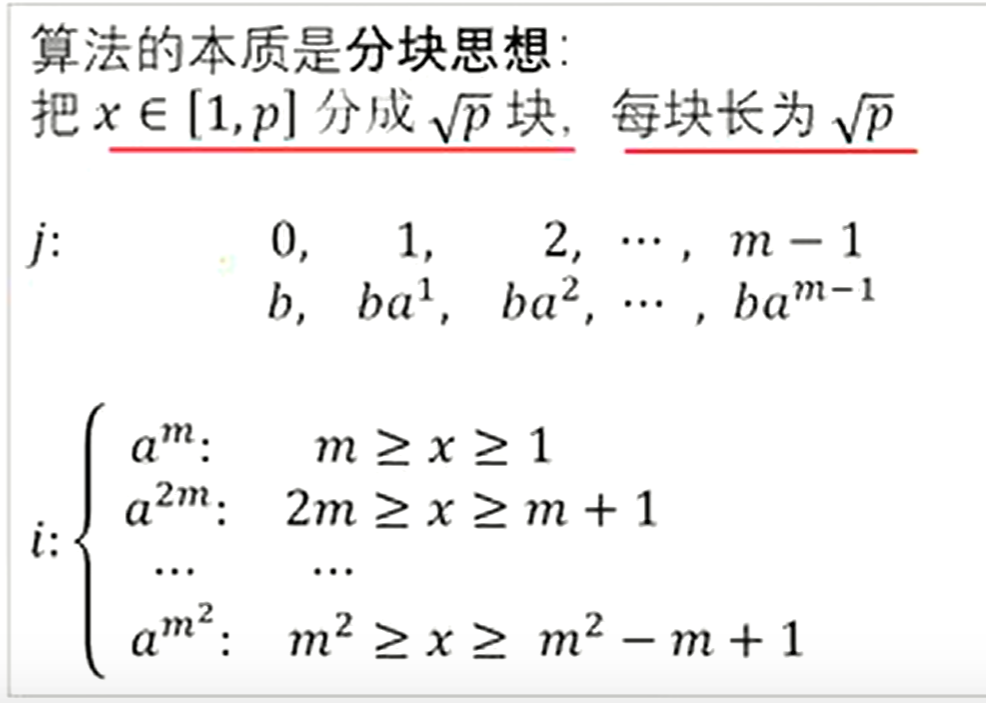

【】专题 | 数学1（逆元&筛&不定方程&扩展欧几里得）

# 目录

- 质数与筛法/质因数分解

- GCD与LCM

- 欧拉函数与相关性质

- 扩展欧几里得exGCD

    -  裴蜀定理

    -  同余方程

- 同余与欧拉定理/乘法逆元

- CRT

- exCRT

# 补充资料

[https://www.cnblogs.com/ailanxier/p/13370753.html](https://www.cnblogs.com/ailanxier/p/13370753.html)

# 质数

### 定义



### 筛法

**一、朴素筛法**

对于每个数，筛掉他的所有倍数

复杂度：2要筛n / 2 次，3要筛n / 3次，所以一共要筛n / 2 + n / 3 + …n / n，也就是 n * (1 / 2 + 1 / 3 + … + 1 / n)次，后面求和是调和级数，当 n 足够大时，等于lnn + c，c是常数,所以复杂度为 logn * n.

**二、埃氏筛法**


复杂度：质数定理：1 - n 中质数的数量是 n / lnn 个，所以埃氏筛法的复杂度为 n * loglog n，很接近线性了。

**代码实现**

```C++
#include<bits/stdc++.h>
using namespace std;
int n,cnt,prime[100001],notprime[100001];

void erat(int n){
	for(int i=2;i<=n;i++)
	if(!notprime[i]){
		prime[++cnt]=i;
		for(int j=2;j<=n/i;j++){
			notprime[j*i]=1;
		}
	}
}
signed main(){
	cin>>n;
	erat(n);
	for(int i=1;i<=cnt;i++)cout<<prime[i]<<' ';
}
```

**三、线性筛**


例如 在埃氏筛中 6 会被 2 和 3 都筛一遍，增加了复杂度

代码中两种情况的解释：

当 i % pj == 0 时，$p_j $一定是 $i $ 的最小质因子，因此 $p_j$ 一定是 $p_j$ * i 的最小质因子。
当 i % pj != 0 时，$p_j$ 一定小于 $ i$ 的最小质因子，因此 $p_j$一定是 $p_j$ * i 的最小质因子。
————————————————

原文链接：[https://blog.csdn.net/magnte/article/details/119805672](https://blog.csdn.net/magnte/article/details/119805672)

**代码实现**

```C++
#include<bits/stdc++.h>
using namespace std;
int n,cnt,prime[100001],notprime[100001];

void oula(int n){
	for(int i=2;i<=n;i++){
	
		if(!notprime[i]){
			prime[++cnt]=i;
			notprime[i]=i;
		}
		for(int j=1;j<=cnt;j++){
			if(prime[j]>notprime[i]||prime[j]>n/i)break;
			notprime[i*prime[j]]=prime[j];
		} 
	}
}
signed main(){
	cin>>n;
	oula(n);
	for(int i=1;i<=cnt;i++)cout<<prime[i]<<' ';
}
```

当`notprime[i] = i`时,说明`i`是质数,反之存`i`的最小质因子.

i从 $2 \to n$ 递增, 每次到达一个 $i$ ,  筛去数 $i \times p$ (即将`notprime[i*p]`赋值为`p`), 其中 $p≤notprime[i]$ 且为质数


**优化算法**

例题

[【模板】线性筛素数 - 洛谷](https://www.luogu.com.cn/problem/P3383)

算法

[【算法/数论】欧拉筛法详解：过程详述、正确性证明、复杂度证明_seh_sjlj的博客-CSDN博客](https://blog.csdn.net/qaqwqaqwq/article/details/123587336)

```C++
#include<bits/stdc++.h>
using namespace std;
const int N=1e8+5;
int notprime[N],q;
bool isprime[N]; // isprime[i]表示i是不是素数
int prime[N]; // 现在已经筛出的素数列表
int n; // 上限，即筛出<=n的素数
int cnt; // 已经筛出的素数个数

void euler()
{
    memset(isprime, true, sizeof(isprime)); // 先全部标记为素数
    isprime[1] = false; // 1不是素数
    for(int i = 2; i <= n; ++i) // i从2循环到n（外层循环）
    {
        if(isprime[i]) prime[++cnt] = i;
        // 如果i没有被前面的数筛掉，则i是素数
        for(int j = 1; j <= cnt && i * prime[j] <= n; ++j)
        // 筛掉i的素数倍，即i的prime[j]倍
        // j循环枚举现在已经筛出的素数（内层循环）
        {
            isprime[i * prime[j]] = false;
            // 倍数标记为合数，也就是i用prime[j]把i * prime[j]筛掉了
            if(i % prime[j] == 0) break;
            // 最神奇的一句话，如果i整除prime[j]，退出循环
            // 这样可以保证线性的时间复杂度
        }
    }
}

signed main(){
	cin>>n>>q;
	euler();
	while(q--){
		int k;
		cin>>k;
		cout<<prime[k]<<endl;
	}
}
```


### 惟一分解定理

$m=\prod p_i^{l_i}$，即质因数分解，有且仅有一种情况。

### 质因数分解

每个合数都可以写成几个质数相乘的形式，其中每个质数都是这个合数的因数，把一个合数用质因数相乘的形式表示出来，叫做分解质因数。如30=2×3×5 。分解质因数只针对合数。

算法实现：

- 筛质数表

- 从小到大遍历质数表，当发现i是n的因数(n%i==0)时不断把n除以i直到不包含因数 $i(n\%i!=0)$，同时记录i的个数cnt[i]++

- 结束条件 $ i^2>n$ （当 $i^2>n$ 时，假设 $i*j=n$，那么 $j$ 一定小于`sqrt(n)`，一定会在之前就被筛掉）

- 中途结束条件：$n=1$

- 结束后特殊判定：如果$n≠1$，那么此时 $n$ 也是原数的一个因数。（请说明为何会出现这种情况）

**算法实现**

```C++
hole
```

## 因数个数

一个正整数数n的所有的约数个数的一个比较实用的上界是$2\sqrt n$。

一个数的质因数个数比较松的上限是$\log_2x$

## 单个素数判定（素性判定）

参考 Miller–Rabin 素性测试

[www.luogu.com.cn](https://www.luogu.com.cn/article/jr27vtto)


# GCD与LCM

### **最大公因数**


### **最小公倍数**

两个或多个整数公有的倍数叫做它们的公倍数，其中除0以外最小的一个公倍数就叫做这几个整数的最小公倍数。整数a，b的最小公倍数记为 $[a,b] $，同样的，a，b，c的最小公倍数记为$[a,b,c]$，多个整数的最小公倍数也有同样的记号。

与最小公倍数相对应的概念是最大公约数，a，b的最大公约数记为 **$(a,b)$** 。关于最小公倍数与最大公约数，我们有这样的定理： **$(a,b)\times[a,b]=ab$** ($a,b$均为整数)。

### **欧拉函数**

即 $\varphi(n)$，表示的是小于等于 n 和 n 互质的数的个数。 比如说 $\varphi(1) = 1$。

若 m 是素数，则$\varphi(m)=m-1$

若m=pq，其中p,q是质数且p≠q，则\varphi(m)=(p-1)(q-1)

若$m=\prod p_i^{l_i}$，即质因数分解，那么$\varphi(m)=m\times \prod (1-\frac{1}{p_i})$

求单点欧拉函数

```C++
int getphi(int x){
    int res=x;
    for(int i=2;i*i<=x;i++){
        if(x%i==0){
            res=res/i*(i-1);
            while(x%i==0)x/=i;
        }
    }
    if(x>1)res=res/x*(x-1);
    return res;
}

```

筛法求欧拉函数

```C++
int prime[N],notprime[N];
int cnt;
int phi[N];


void init(){
  phi[1]=1;
  for(int i=2;i<N;i++){
    if(!notprime[i]){
		prime[++cnt]=i;
		phi[i]=i-1;
    }
	for(int j=1;j<=cnt;j++){
		if(i*prime[j]>=N)break;
		notprime[i*prime[j]]=1;
		if(i%prime[j]==0){
			phi[i*prime[j]]=phi[i]*prime[j];break;
		}
		phi[i*prime[j]]=phi[i]*phi[prime[j]];
	}
  }
}


```

### 欧拉定理

若 $\gcd(a, m) = 1$，则 $a^{\varphi(m)} \equiv 1 \pmod{m}$。

是不是看着非常抽象？

### 辗转相除法

辗转相除法求`gcd(a,b)`算法实现


```C++
int gcd(int a, int b) {
    if (b == 0)
        return a;
    return gcd(b, a % b);
}
```




压行后（不知道对不对）

```C++
int gcd(int a, int b) {return b?gcd(b, a % b):a;}
```

### 更相减损术

gcd(a,b)=gcd(a-b,b)，递归条件你为a-b=0时返回b。

```C++
int gcd(int a,int b){
    if(a<b)swap(a,b);
    if(!b)return a;
    if((a&1)==0||(b&1)==0)return gcd(a>>1,b>>1)<<1;
    if((a&1)==0){a>>=1;return gcd(a,b);}
    if((b&1)==0){b>>=1;return gcd(a,b);}
    return gcd(a-b,b);
}
```


### STL

```C++
__gcd(int a,int b)
```

# 乘法逆元

若**$ax≡1 \pmod f$**, 则称a（关于1）模f的乘法逆元为x。也可表示为**$ax≡1\pmod f$**。

当a与f互素时，a关于模f的乘法逆元有解。如果不互素，则无解。如果f为素数，则从1到f-1的任意数都与f互素，即在1到f-1之间都恰好有一个关于模f的乘法逆元。

其求法可用**欧几里德算法**：
Extended Euclid (d，f) //算法求d关于模f的乘法逆元d-1 ，即 d* d-1 mod f = 1
1 。(X1，X2，X3) := (1，0，f)； (Y1，Y2，Y3) := (0，1，d)
2。 if (Y3=0) then return d-1 = null //无逆元
3。 if (Y3=1) then return d-1 = Y2 //Y2为逆元
4。 Q := X3 div Y3 //整除
5。 (T1，T2，T3) := (X1 - Q*Y1，X2 - Q*Y2，X3 - Q*Y3)
6 。(X1，X2，X3) := (Y1，Y2，Y3)
7。 (Y1，Y2，Y3) := (T1，T2，T3)
8。 goto 2

```C++
int x,p,a,n,y;
void exgcd(int a,int b,int &x,int &y){
	if(!b)x=1,y=0;
	else exgcd(b,a%b,y,x),y-=a/b*x;
}
signed main() {
	scanf("%d%d",&n,&p);
	for(int i=1;i<=n;i++){
		exgcd(i,p,x,y);
		x=(x%p+p)%p;
		printf("%d\n",x);
	}
	return 0;
}
```

## 定理直接求

求此算法还可以使用**费马小定理**
只不过局限性比较大，要求模数是素数
$a^{p-1} =1\pmod p$
p要求是素数
那么$a^{p-2}$就是a的乘法逆元

## 线性递推

$inv[i]=(p−⌊\frac{i}{p}​⌋×inv[p\%i]\%p)\%p$

```C++
inv[1]=1;
for(int i=2;i<=n;i++){
    inv[i]=(p-p/i)*inv[p%i]%p;
```

# exGCD理论

### **裴蜀定理**

在数论中，裴蜀定理是一个关于最大公约数（或最大公约式）的定理，裴蜀定理得名于法国数学家艾蒂安·裴蜀。
裴蜀定理说明了对任何整数 a、b和它们的最大公约数 d ，关于未知数 x以及 y 的线性的丢番图方程（称为裴蜀等式）。

它的一个重要推论是：**a,b互质的充分必要条件是存在整数x,y使ax+by=1.**

### 扩展欧几里得算法

扩展欧几里得算法是欧几里得算法（又叫辗转相除法）的扩展。除了计算a、b两个整数的最大公约数，此算法还能找到整数x、y（其中一个很可能是负数）。通常谈到最大公因子时, 我们都会提到一个非常基本的事实: 给予二整数 a 与 b, 必存在有整数 x 与 y 使得$ax + by = gcd(a,b)$。有两个数a,b，对它们进行辗转相除法，可得它们的最大公约数——这是众所周知的。然后，收集辗转相除法中产生的式子，倒回去，可以得到$ax+by=gcd(a,b)$的整数解。

# exGCD实现

我们先来看一个式子

> $ax+by=c$

没错这是我们目前的一道问题——求解二元一次方程。

**裴蜀定理**

> 对于任意整数a,b，当a，b互质,下面不定方程存在整数解

**扩展欧几里得算法**

> 待解方程：$ax+by=gcd(a,b)$

根据欧几里得算法 $gcd(a,b)=gcd(b,a\%b)$
得到

令$a'=b,b'=a\%b$

=> $x'a'+y'b'=gcd(a',b')=gcd(a,b)$

$gcd(a,b)$不断向下，会出现$a=0$

$ax+by=gcd(a,b)$

=> $x*0+y*b=gcd(0,b)=b$

=> $0*0+1*b=b$

=> 我们就规定$x=0,y=1$

此时我们得到了当前不定方程(a=0)的x,y

我们回到上面

$a'=b$ , $b'=a\%b$

$x'a'+y'b'=gcd(a',b')=gcd(a,b)$

=> $b'=a\%b =a-[a/b]*b,a'=b$   代入

=> $x'b+y'(a-[a/b]*b)=gcd(a,b)$

=> $(x'-y'*[a/b])b+y'a=gcd(a,b)=xa+yb$

因此可以得到递推式：$x=y',y=x'-y'*[a/b]$

回到上面的特解

$0*0+1*b=b$

$x=0,y=1$

此时我们知道了x,y,a,b,就可以将x'=0,y'=1,a=0,b=b代入$x=y',y=(x'-y'*[a/b])$

递归回去，递归到a,b为原始值时x，y就是一组特解了。

```C++
ll exgcd(ll a,ll b,ll &x,ll &y){
	if(b==0){
		x=1,y=0;return a;//辗转相除法结束，a就是gcd(原a,原b)
	}
	int nowgcd=exgcd(b,a%b,x,y)
   int tmpx=x,tmpy=y;	//此时x,y还是x',y',存下来后面要用
	//反代回去，求上一层的x,y
	x=tmpy;
	y=tmpx-(a/b)*tmpy;
	return nowgcd;
}
```

直接看代码吧

```C++

#include<bits/stdc++.h>
using namespace std;
#define ll long long
ll T,a,b,c,d,x,y,k,p,q;

ll exgcd(ll a,ll b,ll &x,ll &y){
	ll tmp=a;
	if(!b)x=1,y=0;
	else {
		tmp=exgcd(b,a%b,y,x);
		y-=a/b*x;
	}
	return tmp;
}
signed main() {
	cin>>T;
	while(T--){
		scanf("%lld%lld%lld",&a,&b,&c);
		x=y=0;
		d=exgcd(a,b,x,y);
        
        ////AC////
		if(c%d)printf("-1\n");
		else{
			x*=c/d,y*=c/d;
			p=b/d,q=a/d;
			if(x<0)k=ceil((1.00-x)/p),x+=p*k,y-=q*k;
			else k=(x-1)/p,x-=p*k,y+=q*k;
			if(y>0){
				printf("%lld %lld %lld %lld %lld\n",(y-1)/q+1,x,(y-1)%q+1,x+(y-1)/q*p,y);
				
			}else{
				printf("%lld %lld\n",x,y+q*(ll)ceil((1.0-y)/q));
			}
		}
		
	}
	

	return 0;
}
```

在上面的代码中，exgcd()的返回值d是gcd(a,b)的值

同时，我们在推算的过程中更改了x，y的值，在函数结束时x，y就是不定方程的一组特解

**e.g.**

输入：

```Plain Text
1
64 36 4
```

当代码运行到////AC/////处时：

```Plain Text
d=4,x=4,y=-7
```

**裴蜀定理应用**

我们回到开始的不等式与题目中的不等式

$ax+by=gcd(a,b)$

$ax+by=c$

如果一个数m满足：ax+by=m，那么这个m一定是gcd(a,b)的倍数

可以发现，只有c%gcd(a,b)=0时，才会有整数解，因此要特判

```C++
	if(c%d)printf("-1\n");
```

**求通解**

那么我们知道了一组特解x',y'后，通解的表达式是什么呢？

```Plain Text

ax'+by'=gcd(a,b)

a(x'+b)+b(y'-a)=gcd(a,b)

a(x'+b/d)+b(y'-a/d)=gcd(a,b)

a(x'+t\*b/d)+b(y'-t\*a/d)=gcd(a,b)  //t为任意整数

```

故$a(x'+t*b/d)+b(y'-t*a/d)=gcd(a,b)$仍然有整数解

所以$a*x + b*y = gcd(a,b)$的通解为

- $x = x' - b/gcd(a,b)*t$

- $y = y' + a/gcd(a,b)*t 
$t为任意整数。

---

### 实际操作

【模板】二元一次不定方程 (exgcd)

## 例题 #1

给定不定方程

$ax+by=c$

若该方程无整数解，输出 $-1$。
若该方程有整数解，且有正整数解，则输出其**正整数**解的数量，所有**正整数**解中 $x$ 的最小值，所有**正整数**解中 $y$ 的最小值，所有**正整数**解中 $x$ 的最大值，以及所有**正整数**解中 $y$ 的最大值。
若方程有整数解，但没有正整数解，你需要输出所有**整数解**中 $x$ 的最小正整数值， $y$ 的最小正整数值。

正整数解即为 $x, y$ 均为正整数的解，$\boldsymbol{0}$ **不是正整数**。
整数解即为 $x,y$ 均为整数的解。
$x$ 的最小正整数值即所有 $x$ 为正整数的整数解中 $x$ 的最小值，$y$ 同理。

**【数据范围】**

对于 $100\%$ 的数据，$1 \le T \le 2 \times {10}^5$，$1 \le a, b, c \le {10}^9$。

## 预备知识

### 计算gcd

**方法**
辗转相除法
**代码**

```C++
int gcd(int a, int b) {
    if (b == 0)
        return a;
    return gcd(b, a % b);
}
```

exgcd

```C++
ll exgcd(ll a,ll b,ll &x,ll &y){
	ll tmp=a;
	if(!b)x=1,y=0;
	else {
		tmp=exgcd(b,a%b,y,x);
		y-=a/b*x;
	}
	return tmp;
}
```

## 解题方法

## soluton

```C++
#include<bits/stdc++.h>
using namespace std;
#define ll long long
ll T,a,b,c,d,x,y,k,p,q;

ll exgcd(ll a,ll b,ll &x,ll &y){	//注意后面2个有取地址符！！！
	ll tmp=a;
	if(!b)x=1,y=0;
	else {
		tmp=exgcd(b,a%b,y,x);
		y-=a/b*x;
	}
	return tmp;
}
signed main() {
	cin>>T;
	while(T--){
		scanf("%lld%lld%lld",&a,&b,&c);
		x=y=0;
		d=exgcd(a,b,x,y);
		if(c%d)printf("-1\n");
		else{
			x*=c/d,y*=c/d;
			p=b/d,q=a/d;
			if(x<0)k=ceil((1.00-x)/p),x+=p*k,y-=q*k;
			else k=(x-1)/p,x-=p*k,y+=q*k;
			if(y>0){
				printf("%lld %lld %lld %lld %lld\n",(y-1)/q+1,x,(y-1)%q+1,x+(y-1)/q*p,y);
				
			}else{
				printf("%lld %lld\n",x,y+q*(ll)ceil((1.0-y)/q));
			}
		}
		
	}
	

	return 0;
}
```

# CRT

孙子定理是中国古代求解一次同余式组（见同余）的方法。是数论中一个重要定理。又称中国余数定理。


# exCRT

ex-CRT，其实就是考虑实际情况中，模数两两不一定互质的情况，不知道谁给它取了一个扩展中国剩余定理的名字。模数不互质，就不能用借助逆元的方法了，需要另一种方法。

---

### **我们先复习一下exgcd**

> $ax+by=c$

**裴蜀定理**

> 对于任意整数a,b，当a，b互质,下面不定方程存在整数解

可以得到递推式：$x=y',y=x'-y'*[a/b]$

此时我们知道了x,y,a,b,就可以将x'=0,y'=1,a=0,b=b代入$x=y',y=(x'-y'*[a/b])$

递归回去，递归到a,b为原始值时x，y就是一组特解了。

```C++
ll exgcd(ll a,ll b,ll &x,ll &y){
	if(b==0){
		x=1,y=0;return a;//辗转相除法结束，a就是gcd(原a,原b)
	}
	int nowgcd=exgcd(b,a%b,x,y)
   int tmpx=x,tmpy=y;	//此时x,y还是x',y',存下来后面要用
	//反代回去，求上一层的x,y
	x=tmpy;
	y=tmpx-(a/b)*tmpy;
	return nowgcd;
}
```

**通解**

$a*x + b*y = gcd(a,b)$的通解为

- $x = x' - b/gcd(a,b)*t$

- $y = y' + a/gcd(a,b)*t 
$t为任意整数。

---

### **接下来我们来实现excrt**


```Plain Text

旧版解释
x=m1p+a1
x=m2q+a2

m1p+a1=m2q+a2
m1p=a2-a1+m2q
m1p==a2-a1(mod m2)

当gcd(m1,m2)|(a2-a1)时有解，可以利用exgcd求解
令gcd(m1,m2)=d,c=a2-a1

m1p/d==c/d(mod m2/d)

p==c/d\*(m/d)^-1 (mod m2/d)

p=c/d\*(m1/d)^-1+ym2/d
x=m1\*c/d\*(m1/d)^-1+ym2m1/d+a1
x==m1\*c/d\*(m1/d)^-1+a1 (mod m2m1/d)
注意，其中的(m1/d)^-1是在mod m2/d意义下的逆元！
```

---

**新版解释：**
[董晓算法 - 扩展中国剩余定理](https://www.bilibili.com/video/BV1Ut4y1F7HG)

对于同余方程组：

- $x≡a1(\mod m_1)$

- $x≡a2(\mod m_2)$

转化为不定方程组

- $x=m_1p+a_1$

- $x=m_2q+a_2$

联立2方程
$m_1p+a_1=m_2q+a_2$
$m_1p-m_2q=a_2-a_1$

我们发现，这正是一个标准的不定方程，我们也许可以用exgcd进行求解

但注意exgcd的条件：

$ax+by=c$,c必须是gcd(a,b)的倍数

因此仅当$gcd(m1,m2)|(a2-a1)$时不定方程有解，负责无解

如果有解，我们就可以很轻松地使用exgcd求出方程的一组特解

- $p=p'*(a_2-a_1)/gcd$

- $q=q'*(a_2-a_1)/gcd$

> 为什么要$*(a2-a1)/gcd$ ？$p'$不就是一组特解吗？

=> 注意！我们这里的  $m_1p-m_2q=a_2-a_1$ ，并不是$ax+by=gcd(a,b)$!!!
在$ax+by=gcd(a,b)$中，a,b互质，相当于$ax+by=1$，即上式中$a2-a1=1$
此时 $p=p'*(a_2-a_1)/gcd=p'*1$

而 $m_1p-m_2q=a_2-a_1$ 中 $a_2-a_1$ 仅满足 $a_2-a_1=k*gcd(a,b)$ ，因此要 $*(a2-a1)/gcd$

---

其通解为

$P=p+k*m2/gcd$
$Q=q-k*m2/gcd$

代回 $x=m_1p+a_1$

$x=m_1(p+k*m_2/gcd)+a_1=m_1p+k*m_1m_2/gcd+a_1=m_1p+k*lcm(m_1,m_2)+a_1$

我们又可以把这个方程转化为一个同余方程

$x≡m_1p+a_1(\mod lcm(m_1,m_2))$

这样我们就成功的把2个同余方程转化为了1个同余方程。如果有n个同余方程，我们可以不断合并下去，直到只剩下一个同余方程，exgcd求解即可。

在合并方程时要根据裴蜀定理判定是否有解！

代码如下

```C++
ll exgcd(ll a,ll b,ll &x,ll &y){
	if(b==0){
		x=1,y=0;return a;//辗转相除法结束，a就是gcd(原a,原b)
	}
	ll nowgcd=exgcd(b,a%b,x,y)
   ll tmpx=x,tmpy=y;	//此时x,y还是x',y',存下来后面要用
	//反代回去，求上一层的x,y
	x=tmpy;
	y=tmpx-(a/b)*tmpy;
	return nowgcd;
}

ll excrt(ll m[],ll a[]){
	ll p,q,m1,m2,a1,a2;
	m1=m[1],a1=a[1];
    //合并思路：不断把式A2...An与式A1合并
	for(int i=1;i<=n;i++){
		m2=m[i],a2=a[i];
		ll d=exgcd(m1,m2,a1,a2);
		if((a2-a1)%d){
			return -1;
		}
		p=p*(a2-a1)/d;
		p=(p%(m2/d)+m2/d)%(m2/d);	//p可能是负数，要处理为最小的正整数（原理是通解公式）
		a1=m1*p+a1;
		m1=m1*m2/d;
	}
	return (a1%m1+m1)%m1;
}
```

```C++
inv[1]=1;printf("%d\n",inv[1]);
 	for(int i=2;i<=n;i++){
 		inv[i]=(p-p/i)*inv[p%i]%p;
```

# BSGS 北上广深算法（bushi

给定一个质数 $p$，以及一个整数 $b$，一个整数 $n$，现在要求你计算一个最小的非负整数 $l$，满足 $b^l \equiv n \pmod p$。

## 扩展欧拉定理

定义 $a^b \equiv \begin{cases} a^{b \bmod \varphi(m)},                &\gcd(a,m) =  1,                   \\ a^b,                                   &\gcd(a,m)\ne 1, b <   \varphi(m), \\ a^{(b \bmod \varphi(m)) + \varphi(m)}, &\gcd(a,m)\ne 1, b \ge \varphi(m). \end{cases} \pmod m$

欧拉定理：若 $\gcd(a, m) = 1$，则 $a^{\varphi(m)} \equiv 1 \pmod{m}$。

我们把ex欧拉的第一个性质拿出来，即$a^b \equiv a^{b \bmod \varphi(m)}   \pmod m,   \gcd(a,m) =  1$，那么我们知道，我们$a^b \pmod m$的循环节就应该是$\varphi(m)$。所以一个方法就是我们暴力枚举$b=0\sim \varphi(m)$即可。复杂度为 O(m)。

## 扩展欧拉定理的应用

给你三个正整数，$a,m,b$，你需要求：$a^b \bmod m$

【数据范围】
对于 $100\%$ 的数据，$1\le a \le 10^9$，$1\le b \le 10^{20000000}，1\le m \le 10^8$。

---

我们首先求出 $\varphi (m)$。对于求一个数字的phi值，我们可以直接根据定义来求解。

然后我们就可以在输入b时顺便对b取模了。注意次数在对phi取模后还要加上一个phi。不是对2\times phi取模！！

```C++
int getphi(int x)
{
	int ans=1,num=1;
	for(int i=2;i*i<=x;i++)
	{
		if(!(x%i))
		{
			num=i-1,x/=i;
			while(!(x%i)) num=num*i,x/=i;
			ans=num*ans;
		}
	}
	if(x!=1) ans=ans*(x-1);
	return ans;
}

int cal(string s,int MOD){
    int res=0,f=0;
    for(auto c:s){
        // dbg(c);
        res=(res*10+c-'0');
        if(res>=MOD)res%=MOD,f=1;
    }
    if(!f)return res;
    return res+MOD;
}
string s;
void solve(){
    a=rd,MOD=rd;
    cin>>s;
    int b=cal(s,getphi(MOD));

    cout<<ksm(a,b)<<endl;
}


signed main() {
    int T=1;
    while(T--){
    	solve();
    }
    return 0;
}
```

## BSGS

我们现在来考虑优化。令$b=ip-j,p=\lceil\sqrt m\rceil,i\in [1,p],j\in[0,p-1]$。这样的话我们b的取值恰好为$b\in[1,m]$，对于b=0我们特判即可。

那么这样的意义何在？

我们将 $b^l \equiv n \pmod m$表示为$b^{ip-j}\equiv n \pmod m$，变形$(b^i)^p\equiv nb^j \pmod m$其中p是定值。

首先，我们枚举i，用map记录二元组$(i,(b^i)^p\mod m)$，然后枚举j（独立），记录二元组$(j,nb^j\mod m)$。当我们第一次发现两个二元组$(i,(b^i)^p\mod m)(j,nb^j\mod m)$中第二元相同时，此时的i,j即答案。

这就相当于$i,j\in [1,n]$，求$f(i)=g(j)$时的i,j，我们不需要n^2枚举，只需要建立映射，看有没有i,j映射到同一个值是即可。

独立分开枚举$i,j$都是$O(\sqrt m)$的复杂度。



```C++
/*
Code bnxt Ntsc_Hodaka
*/

#include <bits/stdc++.h>
using namespace std;
#define int unsigned long long
#define mp make_pair
#define pii pair<int,int>

///----///
#define rd read()
inline int read() {
    int xx = 0, ff = 1;
    char ch = getchar();
    while (ch < '0' || ch > '9') {
        if (ch == '-')
            ff = -1;
        ch = getchar();
    }
    while (ch >= '0' && ch <= '9') xx = xx * 10 + (ch - '0'), ch = getchar();
    return xx * ff;
}
inline void write(int out) {
    if (out < 0)
        putchar('-'), out = -out;
    if (out > 9)
        write(out / 10);
    putchar(out % 10 + '0');
}

///----///
const int N = 2e6 + 5;
const int M = 1e7 + 5;
const int INF = 1e9 + 5;
int MOD=1e9+7;
const double eps=1e-7;

bool f1;
///----///
int n,a[N],b[N],x,ans;
bool f2;

int ksm(int a,int b){
	int res=1;
	while(b){
        if(b&1) (res*=a)%=MOD;
        (a*=a)%=MOD;
        b>>=1;
    }
	return res;
}

int bsgs(int a,int b,int p){
	a%=p;b%=p;
	if(b==1)return 0;
	int m=ceil(sqrt(p)),t=b;
	unordered_map<int,int> mp;
	mp[b]=0;
	for(int i=1;i<m;i++){
		t=t*a%p;
		mp[t]=i;
	}
	int res=ksm(a,m);
	t=1;
	for(int i=1;i<=m;i++){
		t=t*res%p;
		if(mp.count(t))return i*m-mp[t];
	}
	return -1;
}

signed main(){
	int p=rd,a=rd,b=rd;
	MOD=p;
	ans=bsgs(a,b,p);
	if(~ans)cout<<ans;
	else cout<<"no solution";
	return 0;
}


/*

*/
```

