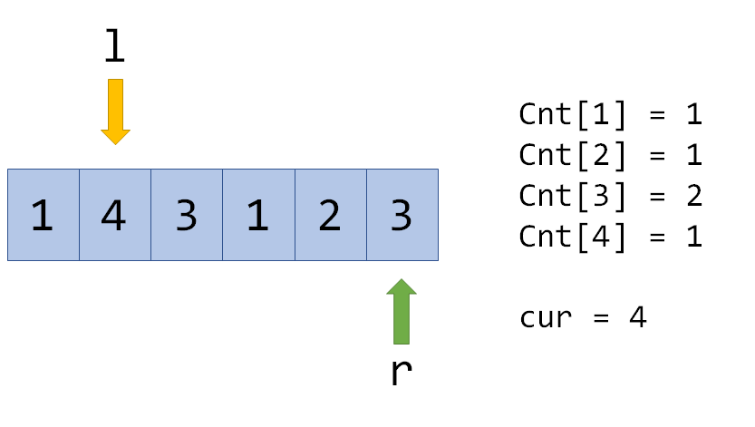

【】专题 | ST表、树状数组、线段树、分块等

# 目录

- ST表

- 树状数组

- 线段树

- 分块

    - 莫队

    - 块状链表

- 跳跃表

[线段树合并/分裂/分治及其他扩展](https://flowus.cn/9af226b7-ae12-4c19-9c89-e5bf91d5864b)

[线段树扩展形式](https://flowus.cn/e6bba820-32e4-4b67-900b-728465fbe751)

[线段树维护的各种信息](%E3%80%90%E3%80%91%E4%B8%93%E9%A2%98+++ST%E8%A1%A8+++%E6%A0%91%E7%8A%B6%E6%95%B0%E7%BB%84+++%E7%BA%BF%E6%AE%B5%E6%A0%91+++%E5%88%86%E5%9D%97+++%E8%8E%AB%E9%98%9F+4419f177-d45a-4b1d-96ea-88ca36e3ecda/%E7%BA%BF%E6%AE%B5%E6%A0%91%E7%BB%B4%E6%8A%A4%E7%9A%84%E5%90%84%E7%A7%8D%E4%BF%A1%E6%81%AF%20e97ee10c-3cdf-4255-9947-21b38a8ca0cc.md)

# ST表

[https://blog.csdn.net/weixin_43914593/article/details/109500135](https://blog.csdn.net/weixin_43914593/article/details/109500135)

## 例题 #1

这是一道 ST 表经典题——静态区间最大值

题目描述

给定一个长度为 $N$ 的数列，和 $M$ 次询问，求出每一次询问的区间内数字的最大值。

对于 $100\%$ 的数据，满足 $1\le N\le {10}^5$，$1\le M\le 2\times{10}^6$，$a_i\in[0,{10}^9]$，$1\le l_i\le r_i\le N$。

## 讲解

### 代码

```C++
#include <bits/stdc++.h>
using namespace std;
const int N = 4e5+5;
int n, st[N][20], lg2[N], m, a, b;

void pre() {
	for (int j = 1; j <= 18; j++)
		for (int i = 1; i + (1 << j) - 1 <= n; i++)
			st[i][j] = max(st[i][j - 1], st[i + (1 << (j - 1))][j - 1]);

}

int main() {

	scanf("%d%d",&n,&m);
	lg2[0] = -1;
	for (int i = 1; i <= n; i++)
		lg2[i] = lg2[i / 2] + 1;

	for (int i = 1; i <= n; i++) {
		scanf("%d",&st[i][0]);
	}
	pre();
	while (m--) {
		scanf("%d%d",&a,&b);
		int k = lg2[b - a + 1];
		printf("%d\n",max(st[a][k], st[b - (1 << k) + 1][k]));
	}

	return 0;
}
```

## 练习

[超级钢琴](https://flowus.cn/29ab2baa-d32f-40d9-8b33-975890c63e56)

# 树状数组

再次强调，树状数组的change是**单点加**！！

[https://blog.csdn.net/weixin_43914593/article/details/107842628](https://blog.csdn.net/weixin_43914593/article/details/107842628)

[https://ntsc-yrx.github.io/2022/07/09/CPP%E8%BF%9B%E9%98%B6-%E6%A0%91%E7%8A%B6%E6%95%B0%E7%BB%84/](https://ntsc-yrx.github.io/2022/07/09/CPP%E8%BF%9B%E9%98%B6-%E6%A0%91%E7%8A%B6%E6%95%B0%E7%BB%84/)

## 例题 #1

如题，已知一个数列，你需要进行下面两种操作：

- 将某一个数加上 $x$

- 求出某区间每一个数的和

对于 $30\%$ 的数据，$1 \le n \le 8$，$1\le m \le 10$；
对于 $70\%$ 的数据，$1\le n,m \le 10^4$；
对于 $100\%$ 的数据，$1\le n,m \le 5\times 10^5$。

样例说明：


故输出结果14、16

## 讲解

### 实现方法


### 关键函数 `lowbit(x)`

```C++
lowbit(x){return x&-x}
```

**作用：** 返回最后一位1的位置

**e.g.** 对`(11010)2`执行`lowbit`返回值为`(10)2`.
`x-lowbit(x)`操作可快速消去最后一位1

### `change(x,v)`

在树状数组意义下对x位置进行单点加v。

### `query(x)`

返回[1,x]的权值和。

### 应用

维护区间加，单点修改

这时我们应该使用change来维护差分数组并且使用query快速求出前缀和。

不可使用change来区间加而query(x)-query(x-1)，因为它根本没这功能！！

### 代码

```C++
#include<bits/stdc++.h>
using namespace std;


const int N=5e5+5;
//typedef long long ll;
int n,m,x,y;
int c[N];
int a;


int lowbit(int x) {
	return x&-x;
}


void add(int i,int x) {//在位置i加上x
	while(i<=N) {
		c[i]+=x;
		i+=lowbit(i);
	}
}


int sum(int x) {
	int res=0;
	while(x) {
		res+=c[x];
		x-=lowbit(x);
	}
	return res;
}
int main() {
	cin>>n>>m;
	for(int i=1; i<=n; i++){
		cin>>a;
		add(i,a);
	}
		//scanf("%d",&a[i]);
	while(m--) {
		int op;
		scanf("%d%d%d",&op,&x,&y);
		if(op==2)
			printf("%d\n",sum(y)-sum(x-1));	//sum(i)求的是a[i]~a[1]的和！！
		else {
			add(x,y);
		}
	}
	return 0;
}
```

# 线段树

*董晓导师的第一堂课！*

[https://blog.csdn.net/weixin_43914593/article/details/108221534](https://blog.csdn.net/weixin_43914593/article/details/108221534)

[https://ntsc-yrx.github.io/2022/07/09/CPP%E8%BF%9B%E9%98%B6-%E7%BA%BF%E6%AE%B5%E6%A0%91/](https://ntsc-yrx.github.io/2022/07/09/CPP%E8%BF%9B%E9%98%B6-%E7%BA%BF%E6%AE%B5%E6%A0%91/)

**线段树**

线段树是一种二叉搜索树，与区间树相似，它将一个区间划分成一些单元区间，每个单元区间对应线段树中的一个叶结点。
使用线段树可以快速的查找某一个节点在若干条线段中出现的次数，时间复杂度为$O(log N)$。而未优化的空间复杂度为$2N$，实际应用时一般还要开$4N$的数组以免越界，因此有时需要离散化让空间压缩。

**实现**

我们看到下图。这是一颗1~8的线段树。


对于最基本的线段树，我们需要支持以下几个操作。

- query 查询

- change 修改

我们先来看第一个问题：如何使用线段树单点修改，区间求和？

举个例子。我们需要将[3,3]增加a，我们要做哪些事情呢？

答案是：我们需要将从[3,3]到根节点的连上的每一个节点都增加a，对不对？

那么我们就可以开始实现了。已知线段树是一颗完全二叉树，i的左儿子就是2i,右儿子就是2i+1.

我们需要写出下面的代码
(我们将线段树存在数组tree[]中，大小应该开到节点数最大值的4倍)

```C++
void change(int now,int l,int r,int goal,int v){
	
}
```

因为修改是递归实现的，我们需要传入下列参数：

- 当前所处在的位置（数组下标）

- 当前节点的l，r（当然我们可以把这两个信息存在当前节点中，开一个结构体。我们也可以类似上面代码一样直接传下去）

- 目标节点

- 要更改的值

好的，接下来我们要做什么呢？
我们的递归起点是

```C++
change(1,1,n,goal,v)
```

往下
我们要不断二分向下查找我们要修改的那个点，当然如果已经找到了就可以return了

```C++
void change(int now,int l,int r,int goal,int v){
	if(now=goal){
    	tree[now]+=v;return;
    }
    int mid=(l+r)/2;
    if(goal<=mid)change(now<<1,l,mid,goal,v);
    else change(now<<1|1,mid+1,r,goal,v);	//now<<1相当于now*2,因为now乘了2，所以二进制下他最后一位一定是0，此时再 |1就等效于+1
    
}
```

找到了目标点，修改了，可是链上的其它点也要修改啊，怎么办呢？
没事，我们从下往上修改，因为儿子都修改了，父亲村的是他儿子的和，只需要更新一边即可。

我们另外写一个`pushup()`函数来实现。因为这个函数要复用，因此写成函数更加简洁

```C++
void pushup(int now){
	tree[now]=tree[now<<1]+tree[now<<1|1];
}
void change(int now,int l,int r,int goal,int v){
	if(now=goal){
    	tree[now]+=v;return;
    }
    int mid=(l+r)/2;
    if(goal<=mid)change(now<<1,l,mid,goal,v);
    else change(now<<1|1,mid+1,r,goal,v);	//now<<1相当于now*2,因为now乘了2，所以二进制下他最后一位一定是0，此时再 |1就等效于+1
    pushup(now);
}
```

这样子我们的单点修改操作就实现了。
查询呢？我们要区间查询和怎么办？

举个例子。我们要查询区间[2,8]的和，朴素算法我们需要把[2,2],[3,3]...[8,8]全部加起来
但我们有线段树呀！
可以发现，我们只需要把[2,2][3,4][5,8]加起来就可以了！！

代码框架

```C++
int query(int now,int l,int r,int goall,int goalr){
	
}


```

我们求区间和时也需要用到递归。我们需要以下参数

- 当前所处在的位置（数组下标）

- 当前节点的l，r（当然我们可以把这两个信息存在当前节点中，开一个结构体。我们也可以类似上面代码一样直接传下去）

- 目标区间goall,goalr

当我们递归到一个节点时，他会出现下面的情况

- l，r在goall,goalr中

- r在mid右侧或左侧

- l在mid右侧或左侧

针对第一种情况，我们直接返回当前节点的值即可，不需要继续向下
针对第二种情况，我们要向他的右儿子递归
针对第3种情况，我们要向他的左儿子递归

```C++
int query(int now,int l,int r,int goall,int goalr){
	if(goall<=l&&goalr>=r)return tree[now];
    else {
    int res=0,mid=(l+r)/2;
    	if(goall<=mid)res+=query(now<<1,l,mid,goall,goalr);
       if(goalr>mid)res+=query(now<<1|1,mid+1,r,goall,goalr);
    }
    return res;
}

```

yeah我们的单点修改，区间查询的线段树就结束了。

---

但是我们需要区间修改，区间查询怎么办呢？
让我们来解决这个问题。 我们需要在修改函数进行处理

```C++
void pushup(int now){
	tree[now]=tree[now<<1]+tree[now<<1|1];
}
void change(int now,int l,int r,int goall,goalr,int v){
	if(l==r){
    	tree[now]+=v;return;
    }
    int mid=(l+r)/2;
    if(goall<=mid)change(now<<1,l,mid,goall,goalr,v);
    if(goalr>mid)change(now<<1|1,mid+1,r,goall,goalr,v);	//now<<1相当于now*2,因为now乘了2，所以二进制下他最后一位一定是0，此时再 |1就等效于+1
    pushup(now);
}
```

此刻我们发现，我们修改一个长度为n的区间，最少要修改2n+1个点。可是我们在查询的时候也许压根用不到这些点，我们没必要进行修改。
因此，我们就使用一个懒标记技术(lazy-tag)。

**懒标记**

在线段树中会遇到区间更新的情况，例如 在区间求和问题中，令[a,b]区间内的值全部加c，若此时再采用单点更新的方法，就会耗费大量时间，这个时候就要用到懒标记来进行区间更新了。

懒标记（lazy-tag），又叫做延迟标记，举例说明。

设 当前结点对应区间[l, r]，待更新区间[a, b]
　当 a ≤ l ≤ r ≤ b，即 [l, r]∈[a,b]时，不再向下更新，仅更新当前结点，并在该结点加上懒标记，当必须得更新/查询该结点的左右子结点时，再利用懒标记的记录向下更新（pushdown)——懒标记也要向下传递，然后移除该结点的懒标记。

这样就不用每次都更新到叶子结点，减少了大量非必要操作，从而优化时间复杂度。

因此，我们要多开一个数组tag[]，tag[i]用来存储i节点的标记。

注意，tag最好满足可合并性。例如我们在tag中存每个点要增加的值t，后来我们又打了第2个标记，每个点增加s。此时它满足可合并性，我们只要把原来的tag加上s就可以了。如果不可以合并，我们就需要先把这个点的tag下传，然后再清零，赋新值。

**实现细节**
当我们要修改[goall,goalr]区间的值，如果在递归中找到一个节点代表的区间被[goall,goalr]包含在内，那么我们修改这个节点的值，打上tag，就不需要向下递归了。（大陆tag的点已经修改过了）

当我们查询一个区间[goall,goalr]时，走到一个点，发现，欸，有tag！我们就把标记下传，按标记修改两儿子的值，然后清零自己的标记。

代码：

```C++

void pushup(int p) {
	val[p] = val[p << 1] + val[p << 1 | 1];
}
void addtag(int p, int l, int r, int t) {
	val[p] += (r-l+1) * t;
	tag[p] += t;
}
void pushdown(int p, int l, int r) {
	if(!tag[p]) return ;
	int t = tag[p], mid = l+r>>1;
	addtag(p<<1, l, mid, t); addtag(p<<1|1, mid+1, r, t);
	tag[p] = 0;
}
void change(int p, int l, int r, int ql, int qr, int k) {
	if(ql <= l && r <= qr) {
		addtag(p, l, r, k);
		return ;
	}
	int mid = l+r >> 1;
	pushdown(p, l, r);
	if(ql <= mid) change(p<<1, l, mid, ql, qr, k);
	if(qr > mid) change(p<<1|1, mid+1, r, ql, qr, k);
	pushup(p);
}
int query(int p, int l, int r, int ql, int qr) {
	if(ql <= l && r <= qr) {
		return val[p];
	}
	pushdown(p, l, r);
	int mid = l+r >> 1, res = 0;
	if(ql <= mid) res += query(p<<1, l, mid, ql, qr);
	if(qr > mid) res += query(p<<1|1, mid+1, r, ql, qr);
	return res;
}

```

（上面代码函数名称和变量名称略有不同。var[]即之前代码的tree[]）

为了实现标记下传操作，我们写了一个函数`pushdown(int p, int l, int r)`
参数分别为

- 当前节点

- 当前节点代表的区间

因为我们要对这个节点的两个儿子打标记，我们就需要知道两个儿子的区间（下面会讲）所以我们要传入这个点代表的区间好推出两个儿子代表的区间。

---

同时，对于在一个点添加标记的操作我们也写了一个函数`addtag(int p, int l, int r, int t)`
参数分别为

- 当前节点

- 当前节点代表的区间

- 标记值。

注意一下，实例代码的目的是求区间和，因此对于一个代表了n个点的区间的点，我们标记这个区间每个点都增加了t，那么这个点，因为他标记的区间是这n个点的总和，因此他要加上n*t才行。

## 例题 #1 单点修改

[练习 | 南外20230712链表、哈希、并查集、分块](https://flowus.cn/6f0fba60-f356-44a6-b89a-8012f66cb0a9)

## 例题 #2 区间修改例题

> 例题（线段树模板，区间求和区间修改）

如题，已知一个数列，你需要进行下面两种操作：

1. 将某区间每一个数加上 $k$。

2. 求出某区间每一个数的和。

输入格式

第一行包含两个整数 $n, m$，分别表示该数列数字的个数和操作的总个数。

第二行包含 $n$ 个用空格分隔的整数，其中第 $i$ 个数字表示数列第 $i$ 项的初始值。

接下来 $m$ 行每行包含 $3$ 或 $4$ 个整数，表示一个操作，具体如下：

1. `1 x y k`：将区间 $[x, y]$ 内每个数加上 $k$。

2. `2 x y`：输出区间 $[x, y]$ 内每个数的和。

对于 $100\%$ 的数据：$1 \le n, m \le {10}^5$。

保证任意时刻数列中所有元素的绝对值之和 $\le {10}^{18}$。

## 讲解

### 实现方法


### 代码

**本地写法**

```C++
/*////////ACACACACACACAC///////////
       . Coding by Ntsc .
       . ToFind Chargcy .
       . Prove Yourself .
       ------------------
        . 模板: 线段树 .
/*////////ACACACACACACAC///////////

#include <bits/stdc++.h>
using namespace std;
#define int long long

const int N = 1e6 + 5;
int tr[N * 4], tag[N * 4];  //线段树相关的都开4倍空间
int a[N], n, ans, m;

//口诀:下去之前pushdown,上来之后pushup
void pushup(int x) { tr[x] = tr[x << 1] + tr[x << 1 | 1]; }
void addtag(int x, int l, int r, int t) {  //有tag表示自己已经被修改,但子节点没有被修改
    tr[x] += (r - l + 1) * t;
    tag[x] += t;
}
void pushdown(int x, int l, int r) {
    if (!tag[x])
        return;
    int t = tag[x], mid = l + r >> 1;
    addtag(x << 1, l, mid, t);
    addtag(x << 1 | 1, mid + 1, r, t);
    tag[x] = 0;
}
void build(int x, int l, int r) {
    if (l == r) {
        tr[x] = a[l];
        return;
    }
    int mid = (l + r) >> 1;
    build(x << 1, l, mid);
    build(x << 1 | 1, mid + 1, r);
    pushup(x);
}
void change(int p, int l, int r, int x, int y, int a) {
    if (l >= x && r <= y) {
        addtag(p, l, r, a);
        return;  // addtag
    }
    pushdown(p, l, r);  // pushdown
    int mid = (l + r) >> 1;
    if (x <= mid)
        change(p << 1, l, mid, x, y, a);
    if (y > mid)
        change(p << 1 | 1, mid + 1, r, x, y, a);  // no else
    pushup(p);
}
int query(int p, int l, int r, int x, int y) {
    int res = 0;
    if (l >= x && r <= y) {
        return tr[p];
    }
    pushdown(p, l, r);  // pushdown
    int mid = (l + r) >> 1;
    if (x <= mid)
        res += query(p << 1, l, mid, x, y);
    if (y > mid)
        res += query(p << 1 | 1, mid + 1, r, x, y);
    return res;
}
signed main() {
    cin >> n >> m;
    for (int i = 1; i <= n; i++) cin >> a[i];
    build(1, 1, n);
    while (m--) {
        char op[N];
        scanf("%s", op);
        int x, y, aa;
        cin >> x >> y;
        if (op[0] == 'A') {
            cin >> aa;
            change(1, 1, n, x, y, aa);
        } else {
            cout << query(1, 1, n, x, y) << endl;
        }
    }
}
```

**他人写法**

下面给出两种码风的代码

1.结构体存点+初始`build()`函数建树

```C++
#include <bits/stdc++.h>
using namespace std;
#define ll long long
const int N = 5e5 + 5;
ll a[N], n, m;

struct node {
	ll r, l;//范围左右
	ll m;//sum
	ll a;//add

} s[N];

void build(int k, int l, int r) {//s[k],建左，建右
	s[k].r = r;
	s[k].l = l;
	if (l == r) {
		s[k].m = a[l];
		return;
	}
	int mid = l + r >> 1;
	build(k * 2, l, mid);
	build(k * 2 + 1, mid + 1, r);
	s[k].m = s[k * 2].m + s[k * 2 + 1].m;

}

void spread(int k, int l, int r) {//标记
	s[l].m += (s[l].r + 1 - s[l].l) * s[k].a, s[l].a += s[k].a;
	s[r].m += (s[r].r + 1 - s[r].l) * s[k].a, s[r].a += s[k].a;
	s[k].a = 0;
}

void change(int k, int l, int r, int d) {//d增量
	if (s[k].r <= r && s[k].l >= l) {//在目标范围内，增加，打标记
		s[k].m += (s[k].r + 1 - s[k].l) * d;
		s[k].a += d;
		return;
	}
	int mid = s[k].l + s[k].r >> 1; //二分
	spread(k, k * 2, k * 2 + 1);
	if (mid >= l)
		change(k * 2, l, r, d);
	if (mid < r)
		change(k * 2 + 1, l, r, d);
	s[k].m = s[k * 2].m + s[k * 2 + 1].m;
}

ll sum(int k, int l, int r) {//求
	if (s[k].r <= r && s[k].l >= l) {//全包含
		return s[k].m;
	}
	int mid = s[k].l + s[k].r >> 1;
	spread(k, k * 2, k * 2 + 1);
	ll tmp = 0;
	if (mid >= l)
		tmp += sum(k * 2, l, r);
	if (mid < r)
		tmp += sum(k * 2 + 1, l, r);
	return tmp;
}

int main() {
	cin >> n >> m;
	for (int i = 1; i <= n; i++) {
		cin >> a[i];
	}
	build(1, 1, n);	//初始建树
	for (int i = 1; i <= m; i++) {
		int op;
		int l, r, d;
		cin >> op;
		if (op == 1) {
			cin >> l >> r >> d;
			change(1, l, r, d);
		} else {
			cin >> l >> r;
			cout << sum(1, l, r) << endl;
		}
	}
	return 0;
}
```

2.直接在函数间传递点的信息（区间信息），不需要结构体，建树过程直接变成修改过程。

```C++
#include<bits/stdc++.h>
#define int long long
using namespace std;
const int _ = 1e6 + 5;
int val[_ << 2], tag[_ << 2];
void pushup(int p) {
	val[p] = val[p << 1] + val[p << 1 | 1];
}
void addtag(int p, int l, int r, int t) {
	val[p] += (r-l+1) * t;
	tag[p] += t;
}
void pushdown(int p, int l, int r) {
	if(!tag[p]) return ;
	int t = tag[p], mid = l+r>>1;
	addtag(p<<1, l, mid, t); addtag(p<<1|1, mid+1, r, t);
	tag[p] = 0;
}
void modify(int p, int l, int r, int ql, int qr, int k) {	//就是上文的change()
	if(ql <= l && r <= qr) {
		addtag(p, l, r, k);
		return ;
	}
	int mid = l+r >> 1;
	pushdown(p, l, r);
	if(ql <= mid) modify(p<<1, l, mid, ql, qr, k);
	if(qr > mid) modify(p<<1|1, mid+1, r, ql, qr, k);
	pushup(p);
}
int query(int p, int l, int r, int ql, int qr) {
	if(ql <= l && r <= qr) {
		return val[p];
	}
	pushdown(p, l, r);
	int mid = l+r >> 1, res = 0;
	if(ql <= mid) res += query(p<<1, l, mid, ql, qr);
	if(qr > mid) res += query(p<<1|1, mid+1, r, ql, qr);
	return res;
}
signed main() {
	ios :: sync_with_stdio(false); cin.tie(0); cout.tie(0);
	int n, m; cin >> n >> m;
	for(int i=1; i<=n; ++i) {
		int x; cin >> x;
		modify(1, 1, n, i, i, x);	//用直接修改代替建树
	}
	for(int i=1; i<=m; ++i) {
		int o, l, r, k;
		cin >> o >> l >> r;
		if(o == 1) {
			cin >> k; modify(1, 1, n, l, r, k);	//解说：目前位于点1，代表区间[1,n] ,目标是将区间[l,r]每个数加上k
		} else {
			cout << query(1, 1, n, l, r) << '\n';	//解说：目前位于点1，代表区间[1,n]，目标是求区间[l,r]之和
		}
	}
}

```

## 线段树上二分

[AtCoder Library Practice Contest 2/12](https://flowus.cn/7bcdb6cd-4419-4d84-855b-952e479d6d2f)J

## 练习

线段树维护等差数列 [练习 | 南外230901](https://flowus.cn/bc34fb37-b791-4387-8ea2-06da9c6ea191) B题

线段树区间和

```C++
/*////////ACACACACACACAC///////////
       . Coding by Ntsc .
       . FancyKnowledge .
       . Prove Yourself .
/*////////ACACACACACACAC///////////

//
#include<bits/stdc++.h>

//
#define int long long
#define ull unsigned long long
#define db double
#define endl '\n'
#define err(fmt, ...) fprintf(stderr, "[%d] : " fmt "\n", __LINE__, ##__VA_ARGS__)

using namespace std;
//
const int N=1e5+5;
const int M=1e3;
 int MOD=1e9+7;
const int MMOD=903250223;
const int INF=1e9;
const int IINF=1e18;
const db eps=1e-9;
//
int n,m,a[N],b,q,s[N],op,idx,len[N],ans,res,tmp,cnt[N],id[N];
int tr[N<<2],tagadd[N<<2],tagmul[N<<2],taglock[N<<2],mxlock[N<<2];
int L;

void pushup(int x){
	tr[x]=(tr[x<<1]+tr[x<<1|1])%MOD;
}
void addtag(int p, int l, int r, int a,int m) {
	tr[p] = ( tr[p] * m + (r-l+1) * a ) % MOD;
	tagmul[p] = tagmul[p] * m % MOD;
	tagadd[p] = (tagadd[p] * m % MOD + a) % MOD;
}
void pushdown(int p, int l, int r) {
	int mid = l+r>>1;
	addtag(p<<1, l, mid, tagadd[p],tagmul[p]);
	addtag(p<<1|1, mid+1, r, tagadd[p],tagmul[p]);
	tagadd[p] = 0;
	tagmul[p]=1;
}

void changeadd(int x,int l,int r,int pl,int pr,int v){
	if(l>=pl&&r<=pr){
		addtag(x, l, r, v,1);
		return ;
	}
	
	pushdown(x,l,r);
	int mid=l+r>>1;
	if(pl<=mid)changeadd(x<<1,l,mid,pl,pr,v);
	if(pr>mid)changeadd(x<<1|1,mid+1,r,pl,pr,v);
	pushup(x);
}

void changemul(int x,int l,int r,int pl,int pr,int v){
	if(l>=pl&&r<=pr){
		addtag(x, l, r, 0,v);
		return ;
	}
	
	pushdown(x,l,r);
	int mid=l+r>>1;
	if(pl<=mid)changemul(x<<1,l,mid,pl,pr,v);
	if(pr>mid)changemul(x<<1|1,mid+1,r,pl,pr,v);
	pushup(x);
}


int query(int x,int l,int r,int pl,int pr){
	if(l>=pl&&r<=pr)return tr[x];
	pushdown(x,l,r);
	int mid=l+r>>1;
	int res=0;
	if(pl<=mid)res=(res+query(x<<1,l,mid,pl,pr))%MOD;
	if(pr>mid)res=(res+query(x<<1|1,mid+1,r,pl,pr))%MOD;
	return res%MOD;
}

void dbg(){
	
//	cout<<"debug=";
//	for(int i=1;i<=n;i++){
//		int c=query(1,1,n,i,i);
////		cout<<c<<' ';
//		
//	}
	
//	cout<<endl;
}

signed main(){

//	freopen(".in","r",stdin);
//	freopen(".out","w",stdout);
//	freopen(".txt","w",stderr);

	cin>>n>>m>>MOD;
	
//	cerr<<"OK";

	for(int i=1;i<=N-2;i++)tagmul[i]=1;
	for(int i=1;i<=n;i++){
		int x;
		cin>>x;
		changeadd(1,1,n,i,i,x);
		
		//这样初始化的复杂度比build略高
	}
	dbg();
	while(m--){
		int op,l,r,x;
		cin>>op>>l>>r;
		if(op==2){
			cin>>x;
			changeadd(1,1,n,l,r,x%MOD);
			dbg();
		}if(op==1){
			cin>>x;
			changemul(1,1,n,l,r,x%MOD);
			dbg();
		}
		
		if(op==3){
			int ans=query(1,1,n,l,r)%MOD;
			cout<<ans<<endl;
		}
	}
	
	
	return 0;
}

//check your long long and the size of memery!!!
```

线段树过多个标记应用

[www.luogu.com.cn](https://www.luogu.com.cn/problem/P4560)


标记传-1表示没用是不可取的。

# 分块

[TJOI2009] 开关

## 例题 #1

现有 $n$ 盏灯排成一排，从左到右依次编号为：$1$，$2$，……，$n$。然后依次执行 $m$ 项操作。

操作分为两种：

1. 指定一个区间 $[a,b]$，然后改变编号在这个区间内的灯的状态（把开着的灯关上，关着的灯打开）；

2. 指定一个区间 $[a,b]$，要求你输出这个区间内有多少盏灯是打开的。

**灯在初始时都是关着的。**

输入格式

第一行有两个整数 $n$ 和 $m$，分别表示灯的数目和操作的数目。

接下来有 $m$ 行，每行有三个整数，依次为：$c$、$a$、$b$。其中 $c$ 表示操作的种类。

- 当 $c$ 的值为 $0$ 时，表示是第一种操作。

- 当 $c$ 的值为 $1$ 时，表示是第二种操作。

$a$ 和 $b$ 则分别表示了操作区间的左右边界。

对于全部的测试点，保证 $2\le n\le 10^5$，$1\le m\le 10^5$，$1\le a,b\le n$，$c\in\{0,1\}$。

## 讲解

我们发现，这道题可以使用线段树完成！但是我们也发现，我们不想写线段树！因为它太长了！于是我们选线段树的替代品——分块！

### 分块！

[549 整除分块（数论分块）_哔哩哔哩_bilibili](https://www.bilibili.com/video/BV1pP4y127tC/?spm_id_from=333.999.0.0)

注意，数论分块与此处的分块不一样！以上链接指向错误。

OI Wiki的分块是正确的

[分块思想 - OI Wiki](https://oi-wiki.org/ds/decompose/)

我们把一段序列$1\sim n$ 分成$ \lfloor\sqrt{n}\rfloor$份，可以真快修改的就一起修改，负责直接朴素修改。这样子在时间复杂度上会有所让步，但是它的代码简洁易懂，扩展性强。

### 代码

以下为错误代码

```C++
//j0, j1 , jn , y1 , y0 , yn不能用：这是个函数（非常的高级）
#include <bits/stdc++.h>
const int N=1e5+5;
int op[N],kuai[N],n,m,sn;
using namespace std;
void change(int a,int b){
	int p=b-b%sn;
	while((a)%sn){
		op[a]=1-op[a];
		if(op[a])kuai[a/sn]++;
		else kuai[a/sn]--;
		a++;
	}
	while(a<p){
		kuai[a/sn]=sn-kuai[a/sn];
		a+=sn;
	}
	while(a<=b){
		op[a]=1-op[a];
		if(op[a])kuai[a/sn]++;
		else kuai[a/sn]--;
		a++;
	}
	
}
void query(int a,int b){
	int ans=0;
	
	int p=b-b%sn;
	while((a)%sn){
		if(op[a])ans++;a++;
	}
	while(a<p){
		ans+=kuai[a/sn];
		a+=sn;
	}
	while(a<=b){
		if(op[a])ans++;
		a++;
	}
	cout<<ans<<endl;
}
int main(){
	//ios::sync_which_stdio(false);
	cin>>n>>m;
	sn=sqrt(n);
	for(int i=1;i<=m;i++){
		int a,b,c;
		cin>>c>>a>>b;
		if(c==0){
			change(a,b);
		}else{
			query(a,b);
		}
	} 
	return 0;
}

```

# 分块变形：莫队

## 例题 #1 引入

给出一个序列和若干查询l, r，问[l, r]中有多少个不同的数。

[算法学习笔记(24): 莫队](https://zhuanlan.zhihu.com/p/115243708)

这道题也可以用[树状数组](https://zhuanlan.zhihu.com/p/93795692)或[块状数组](https://zhuanlan.zhihu.com/p/114268236)来做，但用莫队的话思维难度会比较低。

## 讲解

我们用一个数组`Cnt[]`来记录每个数出现的次数，`cur` 表示当前区间的答案，例如：


现在转移到紧邻的区间就很简单了，例如转移到[l,r+1]：


Cnt[2]=0，说明添加了一个没出现过的数，所以cur变成4，但如果在这里再次向右转移：



这时Cnt[3]不为0，所以虽然Cnt[3]++，但是cur不再增长。

其他的转移都是类似的。容易发现，转移分为两种情况，往区间里**添**数，或者往区间里**删**数，所以可以写成两个函数：

```C++
void add(int p){//p为要添加的下标保证p与当前分块相邻
	if(!cnt[a[p]])cur++;
	cnt[a[p]]++;
}
void del(int p){
	if(cnt[a[p]]==1)cur--;
	cnt[a[p]]--;
}
```

对于区间的移动，若目标区间为[al,ar]，当前区间为[l,r]

```C++
while(l>al)add(--l);//al在l左边,l在当前分块中,l-1不在,所以先移动后添加
while(l<al)del(l++);//al在l右边,l在当前分块中但不在目标区间,所以先删除后移动
while(r>ar)del(r--);
while(r<ar)add(++r);
```

当然，如果知道al与l，ar与r的大小，可以删去一半。

初始化时，要先令l=1，r=0。

现在我们可以从一个区间的答案转移到另一个区间了，但是，如果直接在线查询，很有可能在序列两头“左右横跳”，到头来还不如朴素的$  O(n^2)$算法。但是，我们可以把查询离线下来（记录下来），然后，排个序……

问题来了，怎么排序？我们很容易想到以l为第一关键词，r为第二关键词排下序，但这样做效果并不是很好。莫涛大神给出的方法是，**分块**，然后按照`bel[l]` 为第一关键词，`bel[r]`为第二关键词排序。 这样，每两次询问间l和r指针移动的距离可以被有效地降低，整个算法的时间复杂度可以降到 $O(n \sqrt n)$ ！

（注释： `bel[i]`表示元素i归属哪个块）

莫队算法优化的核心是分块和排序。我们将大小为n的序列分为√n个块，从1到√n编号，然后根据这个对查询区间进行排序。一种方法是把查询区间按照**左端点所在块的序号从小到大**排个序，如果左端点所在块相同，再按**右端点从小到大**排序。排完序后我们再进行左右指针跳来跳去的操作

```C++
 bool operator<(const query &o) const // 重载<运算符，奇偶化排序
    {
        // 这里只需要知道每个元素归属哪个块，而块的大小都是sqrt(n)，所以可以直接用l/sq
        if (l / sq != o.l / sq) 
            return l < o.l;
        if (l / sq & 1)
            return r < o.r;
        return r > o.r;
    }
```

在$l / sq \& 1$中，`&`优先级低于`/`

如果$1/sq$为奇数,则上式为true

**与（&）**

规则：两个操作数对应二进制**位**同样为1 结果**位** 才为1，否则为0；

**分块前后时间复杂度解说**

分块前：

我们按照l进行排序，当l不变时，r可能会在l~n之间反复横跳，复杂度较高

分块后：

我们把所属的块相同的询问放在一起，按r从小到大排序

l可能会在块内反复横跳，但复杂度较小。而r是从小到大的，复杂度最高为$O(n-l)$也较小

较高>较小×较小，结果严谨证明得分块更优秀。


**奇偶性排序**

我们发现，当我们的l从一块跳到后面一块时，r要从偏右端跳回到最靠近l的那个r，然后又要再往右跳一边。这样就会重复走路。如果我们可以让r在“从偏右端跳回到最靠近l的那个r”过程中就把答案处理掉，就会优化一半的复杂度。

因此：如果`bel[l]` 是奇数，则将`r`顺序排序，否则将`r`逆序排序

## 例题 #2 小B的询问

小B 有一个长为 $n$ 的整数序列 $a$，值域为 $[1,k]$。
他一共有 $m$ 个询问，每个询问给定一个区间 $[l,r]$，求：
$\sum\limits_{i=1}^k c_i^2$

其中 $c_i$ 表示数字 $i$ 在 $[l,r]$ 中的出现次数。
小B请你帮助他回答询问。

【数据范围】
对于 $100\%$ 的数据，$1\le n,m,k \le 5\times 10^4$。

[zhuanlan.zhihu.com](https://zhuanlan.zhihu.com/p/115243708)

```C++
/*                                                                                
                      Keyblinds Guide
     				###################
      @Ntsc 2024

      - Ctrl+Alt+G then P : Enter luogu problem details
      - Ctrl+Alt+B : Run all cases in CPH
      - ctrl+D : choose this and dump to the next
      - ctrl+Shift+L : choose all like this
      - ctrl+B then ctrl+W: close all
      - Alt+la/ra : move mouse to pre/nxt pos'
	  
*/
#include <bits/stdc++.h>
#include <queue>
using namespace std;

#define rep(i, l, r) for (int i = l, END##i = r; i <= END##i; ++i)
#define per(i, r, l) for (int i = r, END##i = l; i >= END##i; --i)
#define pb push_back
#define mp make_pair
#define int long long
#define pii pair<int, int>
#define ps second
#define pf first

// #define innt int
// #define inr int
// #define mian main
// #define iont int

#define rd read()
int read(){
    int xx = 0, ff = 1;
    char ch = getchar();
    while (ch < '0' || ch > '9') {
		if (ch == '-')
			ff = -1;
		ch = getchar();
    }
    while (ch >= '0' && ch <= '9')
      xx = xx * 10 + (ch - '0'), ch = getchar();
    return xx * ff;
}
void write(int out) {
	if (out < 0)
		putchar('-'), out = -out;
	if (out > 9)
		write(out / 10);
	putchar(out % 10 + '0');
}

#define ell dbg('\n')
const char el='\n';
const bool enable_dbg = 1;
template <typename T,typename... Args>
void dbg(T s,Args... args) {
	if constexpr (enable_dbg){
    cerr << s << ' ';
		if constexpr (sizeof...(Args))
			dbg(args...);
	}
}

const int N = 3e5 + 5;
const int INF = 1e18;
const int M = 1e7;
const int MOD = 1e9 + 7;

struct node{
    int l,r,id;
}t[N];

int B;
int a[N];

int cnt[N],cnt2[N];


inline int getK(int x){
    return (x-1)/B+1;
}

bool cmp(node a, node b)
{
	if(getK(a.l) ^ getK(b.l)) return a.l < b.l;
	else if(getK(a.l) & 1) return a.r < b.r;
	else return a.r > b.r;
}


int ans;
int K;

void add(int x){
    if(a[x]>K)return ;
    ans-=cnt2[a[x]];
    cnt2[a[x]]+=2*cnt[a[x]]+1;
    cnt[a[x]]++;
    ans+=cnt2[a[x]];
}

void del(int x){
    if(a[x]>K)return ;
    ans-=cnt2[a[x]];
    cnt2[a[x]]+=-2*cnt[a[x]]+1;
    cnt[a[x]]--;
    ans+=cnt2[a[x]];

}

int anss[N];

void solve(){
    int n=rd,m=rd;
    K=rd;
    B=sqrt(n)+1;
    for(int i=1;i<=n;i++){
        a[i]=rd;
    }   
    for(int i=1;i<=m;i++){
        t[i].l=rd,t[i].r=rd;
        t[i].id=i;
    }

    // dbg("OK");
    sort(t+1,t+m+1,cmp);
    int cl=1,cr=0;
    for(int i=1;i<=m;i++){
        int l=t[i].l,r=t[i].r;

        // dbg("--",l,r,el);

        while(cl>l)add(--cl);
        while(cl<l)del(cl),cl++;
        while(cr>r)del(cr),cr--;        
        while(cr<r)cr++,add(cr);

        anss[t[i].id]=ans;
    }

    for(int i=1;i<=m;i++){
        cout<<anss[i]<<endl;
    }
}

signed main() {
    int T=1;
    while(T--){
    	solve();
    }
    return 0;
}
```

## 带修莫队

例题 #1【模板】莫队二次离线（第十四分块(前体)）

珂朵莉给了你一个序列 $a$，每次查询给一个区间 $[l,r]$，查询 $l \leq i< j \leq r$，且 $a_i \oplus a_j$ 的二进制表示下有 $k$ 个 $1$ 的二元组 $(i,j)$ 的个数。$\oplus$ 是指按位异或。

输入格式

第一行三个数表示 $n,m,k$。

第二行 $n$ 个数表示序列 $a$。

之后 $m$ 行，每行两个数 $l,r$ 表示一次查询。

对于100%的数据，$1 \leq n, m \leq 100000$，$0 \leq a_i, k < 16384$。

## 回滚莫队&不删除莫队

### 题目描述

给定一个序列，多次询问一段区间 $[l,r]$，求区间中**相同的数的最远间隔距离**。

序列中两个元素的**间隔距离**指的是**两个元素下标差的绝对值**。

### 应用

众所周知，我们在是实现莫队的时候要实现两个函数，一个是add，一个是del。但是如果我们遇到了难以实现快速del时，我们应该怎么办呢？我们可以试着使用回滚莫队。

回滚莫队就是通过双指针回到某一个历史版本，然后重新开始add操作来实现区间边界的del操作。

### 思路

根据莫队的性质，在一个询问块中，我们的r是单调的，但是l可能不是，所以我们现在只需要考虑一个l的问题就行了。那么为了减少删除，我们就可以让l一直指向L中的最大值（L是块中所有询问的l），并且让指针p,r去分别走到左右端点。并且在每一次需要左端点del时，就人p直接回到l后重新向左边扩散即可。

这个做法仅仅是在移动双指针时需要更多的代码，并不需要在排序上动手脚。

注意，回滚莫队并不代表着我们可以完全做到不删除，只是在减少删除的次数。还是回到上面的思路，我们在来到一个新块时，先设定cl为其中最大的l，此时我们注意到可能会有询问的r<cl，此时我们就需要删除[r+1,cl]之间的数据了。

这里我们发现，r无非只有两种情况——在当前块内和在当前块后面。那么对于第一种情况，我们直接暴力即可。第二种我们就可以使用上面的不删除策略了。

### 代码

注意每次pl回退时res也要回退。

我们的贡献可以分成三个部分

- 跨cl的

- 仅仅由cl左边产生的

- 仅仅由cl右边产生的

回退pl时，我们只能保留仅仅由cl右边产生的贡献，所以我们除了要维护全局贡献最大值res，还要维护仅仅由cl右边产生的贡献的最大值resr

```C++
/*                                                                                
                      Keyblinds Guide
     				###################
      @Ntsc 2024

      - Ctrl+Alt+G then P : Enter luogu problem details
      - Ctrl+Alt+B : Run all cases in CPH
      - ctrl+D : choose this and dump to the next
      - ctrl+Shift+L : choose all like this
      - ctrl+K then ctrl+W: close all
      - Alt+la/ra : move mouse to pre/nxt pos'
	  
*/
#include <bits/stdc++.h>
#include <queue>
using namespace std;

#define rep(i, l, r) for (int i = l, END##i = r; i <= END##i; ++i)
#define per(i, r, l) for (int i = r, END##i = l; i >= END##i; --i)
#define pb push_back
#define mp make_pair
#define int long long
#define pii pair<int, int>
#define ps second
#define pf first

// #define innt int
// #define inr int
// #define mian main
// #define iont int

#define rd read()
int read(){
    int xx = 0, ff = 1;
    char ch = getchar();
    while (ch < '0' || ch > '9') {
		if (ch == '-')
			ff = -1;
		ch = getchar();
    }
    while (ch >= '0' && ch <= '9')
      xx = xx * 10 + (ch - '0'), ch = getchar();
    return xx * ff;
}
void write(int out) {
	if (out < 0)
		putchar('-'), out = -out;
	if (out > 9)
		write(out / 10);
	putchar(out % 10 + '0');
}

#define ell dbg('\n')
const char el='\n';
const bool enable_dbg = 1;
template <typename T,typename... Args>
void dbg(T s,Args... args) {
	if constexpr (enable_dbg){
    cerr << s;
    if(1)cerr<<' ';
		if constexpr (sizeof...(Args))
			dbg(args...);
	}
}

const int N = 3e5 + 5;
const int INF = 1e18;
const int M = 1e7;
const int MOD = 1e9 + 7;
int B;

struct node{
    int l,r,id;
}t[N];
int a[N];
int ans[N];
int mxl[N];

inline int getK(int x){
    return (x-1)/B+1;
}

bool cmp(node a,node b){
    if(getK(a.l)==getK(b.l)){
        return a.r<b.r;
    }
    return getK(a.l)<getK(b.l);
}


int res=0;
int dislmn[N],disrmx[N];
int dislmx[N],disrmn[N];
int cl,cr;
int stk[N],top;
int stk2[N],top2;

int resr;

void update(int x){
    int v=a[x];
    res=max(res,dislmx[v]-dislmn[v]);
    res=max(res,disrmx[v]-disrmn[v]);
    res=max(res,disrmx[v]-dislmn[v]);
    resr=max(resr,disrmx[v]-disrmn[v]);
    
	// dbg(dislmx[v] - dislmn[v], disrmx[v] - disrmn[v], disrmx[v] - dislmn[v], el);

}

void addl(int x){
    dislmx[a[x]]=max(dislmx[a[x]],x);
    dislmn[a[x]]=min(dislmn[a[x]],x);
    stk[++top]=a[x];
    update(x);
}

void addr(int x){
    disrmx[a[x]]=max(disrmx[a[x]],x);
    disrmn[a[x]]=min(disrmn[a[x]],x);
    stk2[++top2]=a[x];
    update(x);
}

int b[N];
int f[N];


int loc[N],but[N],btop;

void solve(){
    for(int i=0;i<N;i++)dislmx[i]=-INF;
    for(int i=0;i<N;i++)disrmx[i]=-INF;
    for(int i=0;i<N;i++)disrmn[i]=INF;
    for(int i=0;i<N;i++)dislmn[i]=INF;
    for(int i=0;i<N;i++)loc[i]=-1;


    int n=rd;
    B=sqrt(n)+1;
    for(int i=1;i<=n;i++){
        b[i]=a[i]=rd;
    }   
    sort(b+1,b+n+1);
    int len=unique(b+1,b+n+1)-b;
    for(int i=1;i<=n;i++){
        a[i]=lower_bound(b+1,b+len+1,a[i])-b;
    }


    int m=rd;
    for(int i=1;i<=m;i++){
        t[i].l=rd,t[i].r=rd;
        mxl[getK(t[i].l)]=max(mxl[getK(t[i].l)],t[i].l);
        t[i].id=i;
    }

    sort(t+1,t+m+1,cmp);

    cl=0,cr=0;
    for(int i=1;i<=m;i++){
        int l=t[i].l,r=t[i].r;
        
        
        while(top){dislmn[stk[top]]=INF;dislmx[stk[top--]]=-INF;}
        
        if(cl!=mxl[getK(l)]){
            cr=cl=mxl[getK(l)];
            while(top2){disrmx[stk2[top2]]=-INF;disrmn[stk2[top2--]]=INF;}
            res=0;resr=0;
            addr(cl);
        }

        if(getK(l)==getK(r)){
            res=0;
            while(btop)loc[but[btop--]]=-1;
            for(int j=l;j<=r;j++){
                int v=a[j];
                if(loc[v]!=-1)res=max(res,j-loc[v]);
                else {loc[v]=j;but[++btop]=v;}
            }
            ans[t[i].id]=res;
            f[t[i].id]=1;

            continue;
        }
        
        int pl=cl;
        res=resr;

        while(pl>l)addl(--pl);
        while(cr<r)addr(++cr);
        ans[t[i].id]=res;
    }

    for(int i=1;i<=m;i++){
        cout<<ans[i]<<endl;
    }
}

signed main() {
    int T=1;
    while(T--){
    	solve();
    }
    return 0;
}
```

### 习题

[www.luogu.com.cn](https://www.luogu.com.cn/problem/AT_joisc2014_c)


# 分块思想应用：块状链表


效率对比


## 基本操作

### 第一种块状链表：

强制维护每个块的大小一定为 $\sqrt{n}$


### 第二种块状链表：

仅维护每个块的大小$<\sqrt{2\times n}$，让每个块的大小保持在$\sqrt{n}$附近

**操作类型**

分裂、插入、查找。 

**什么是分裂？**

分裂就是分裂一个 node，变成两个小的 node，以保证每个 node 的大小都接近 $\sqrt{n}$（否则可能退化成普通数组）。当一个 node 的大小超过 $2\times \sqrt{n}$ 时执行分裂操作。

分裂操作怎么做呢？先新建一个节点，再把被分裂的节点的后 $\sqrt{n}$ 个值 copy 到新节点，然后把被分裂的节点的后 $\sqrt{n} $个值删掉（size--），最后把新节点插入到被分裂节点的后面即可。

**插入**

还有一个要说的。 随着元素的插入（或删除），$n$ 会变，$\sqrt{n}$ 也会变。这样块的大小就会变化，我们难道还要每次维护块的大小？

其实不然，把 $\sqrt{n} $ 设置为一个定值即可。比如题目给的范围是 $10^6$，那么 $\sqrt{n}$ 就设置为大小为 $10^3 $ 的常量，不用更改它。

**查找**

从前往后找每个块即可，直接访问块中存储的当前块的大小。

### **具体实现**

**存储**

我们考察结构体写法的普通链表

```C++
struct node {
    int pre, nxt;
    int v;
}a[N];
```

块状链表实际上和在普通链表里每个节点存一个值差不多，只不过是每个节点里存一个大小约为$\sqrt{n}$的数组

```C++
struct node {
    int sz, nxt;		//节点对应的数组长度,链表中下一个节点
    char s[MAXB*4];		//节点对应的数组实际值(以例题2为例:本题要求为字符)
}a[N];
```

**查询**

```C++
//返回原数组中下标为p的元素所在的块的编号，并将传入的引用(原数组下标)改为块内的下标。
int pos(int &p) {
    int x = 0;
    while(x != -1 && a[x].sz < p) {	//为方便下面的split操作，定义下标在[1,sz]内,但实际数组下标从0开始。
        p -= a[x].sz, x = a[x].nxt;		//一次跳整个节点
    }
    return x;
}

```

**插入（注意这里只是块之间的操作，是底层的，不是表层操作）**

```C++
//在编号为x的节点后插入一个编号为y,长度为len,对应数组为s的节点
void add(int x, int y, int len, char *s) {
    if(y != -1) {		//特判x指向-1(即链表的末尾)
        a[y].sz = len;		//对编号为y的节点赋值
        a[y].nxt = a[x].nxt;
        memcpy(a[y].s, s, len);		//memcpy的第三个参数是复制的字节数,所以这里的len本来应该乘上相应元素类型的size,但本题由于sizeof(char)=1，所以可以不乘。
    }
    a[x].nxt = y;		//x指向y
}

```

 （批注：代码中的y应该传入的是++idx）

**合并**

```C++
//把编号为x和y的两个节点合并
//我们选择把y暴力接在x的后面,然后把y删除
void merge(int x, int y) {
    memcpy(a[x].s+a[x].sz, a[y].s, a[y].sz);	//把y对应的数组接到x后面
    a[x].sz += a[y].sz, a[x].nxt = a[y].nxt;	//用y的信息更新x
    del(y);		//删除y
}

```

（批注：这里使用了memcpy的用法：以下代码可以一步将b插入到a的后面，当然你手写也行，只不过效率低下，更多请参考[专题 | 网络流](https://flowus.cn/db56502e-9cbd-4978-a11c-91bfeee6b4b6)内有关memcpy的解说）

```C++
memcpy(a+len_a, b, len_b);//a,b为数组,len_a,len_b为变量，存的是a,b数组的大小
```

上述代码中的`del()`解说：

```C++
void del(int x) {       //回收节点
    pool[++tot] = x;
}
```

其中pool[]中存到是没有使用的节点。因为在删除中我们会删除某些节点，这些节点就会空出来。如果每次我们在插入时都把新的分块往后分配一个新的节点，那么前面就会有一些空余的节点被浪费了，所以我们所以pool[]来记录空余的节点（或者说是已回收可再次利用的节点）

**分裂**

```C++
//把第x个节点从pos位置分裂成两个节点(即前pos个和后sz-pos个分离)
void split(int x, int pos) {
    if(x == -1 || pos == a[x].sz) return;		//如果节点为空或者根本不需要分裂(分裂位置在块的末尾)
    int t = new_node();		//分裂后多出一个节点
    add(x, t, a[x].sz-pos, a[x].s+pos);		//把分离出来的后半部分接在原节点的后面
    a[x].sz = pos;		//把sz赋值为pos,相当于只保留了前半部分的元素,pos之后的元素还存在,只不过我们把它当成不存在(就像机械硬盘的删除数据的方式)
}

```

其中的`new_node()`操作

```C++
int new_node() {        //从pool中分配一个空余的节点，返回的是节点的下标
    return pool[tot--];
}
```

## 相关操作（视频内摘录）


插入


删除


## 扩展：STL中的块状链表

[块状链表 - OI Wiki](https://oi-wiki.org/ds/block-list/#stl-中的-rope)

可以使用如下方法来引入：

```C++
#include <ext/rope>
using namespace __gnu_cxx;
```

`rope` 目前可以在 OI 中正常使用。

### 基本操作

|操作|作用|
|-|-|
|`rope <int > a`|初始化 `rope`（与 `vector` 等容器很相似）|
|`a.push_back(x)`|在 `a` 的末尾添加元素 `x`|
|`a.insert(pos, x)`|在 `a` 的 `pos` 个位置添加元素 `x`|
|`a.erase(pos, x)`|在 `a` 的 `pos` 个位置删除 `x` 个元素|
|`a.at(x)` 或 `a[x]`|访问 `a` 的第 `x` 个元素|
|`a.length()` 或 `a.size()`|获取 `a` 的大小|

## 例题 #1

[练习 | 南外20230715树状数组&线段树&bitset](https://flowus.cn/6c5fad6f-d48d-4678-aa57-593a12c9281c)

见第H题


[算法竞赛4.6-块状链表_哔哩哔哩_bilibili](https://www.bilibili.com/video/BV1QM4y1C7H3/?spm_id_from=333.337.search-card.all.click)

## 例题 #2 [NOI2003] 文本编辑器

题目描述

很久很久以前，$DOS3.x$ 的程序员们开始对 $EDLIN$ 感到厌倦。于是，人们开始纷纷改用自己写的文本编辑器⋯⋯

多年之后，出于偶然的机会，小明找到了当时的一个编辑软件。进行了一些简单的测试后，小明惊奇地发现：那个软件每秒能够进行上万次编辑操作（当然，你不能手工进行这样的测试） ！于是，小明废寝忘食地想做一个同样的东西出来。你能帮助他吗？

为了明确目标，小明对“文本编辑器”做了一个抽象的定义:

文本：由 $0$ 个或多个 ASCII 码在闭区间 [$32$, $126$] 内的字符构成的序列。

光标：在一段文本中用于指示位置的标记，可以位于文本首部，文本尾部或文本的某两个字符之间。

文本编辑器：由一段文本和该文本中的一个光标组成的，支持如下操作的数据结构。如果这段文本为空，我们就说这个文本编辑器是空的。

|操作名称|输入文件中的格式|功能|
|-|-|-|
|$\text{Move}(k)$|Move k|将光标移动到第 $k$ 个字符之后，如果 $k=0$，将光标移到文本开头|
|$\text{Insert}(n,s)$|Insert n s|在光标处插入长度为 $n$ 的字符串 $s$，光标位置不变$n\geq1$|
|$\text{Delete}(n)$|Delete n|删除光标后的 $n$ 个字符，光标位置不变，$n \geq 1$|
|$\text{Get}(n)$|Get n|输出光标后的 $n$ 个字符，光标位置不变，$n \geq 1$|
|$\text{Prev}()$|Prev|光标前移一个字符|
|$\text{Next}()$|Next|光标后移一个字符|

你的任务是：

- 建立一个空的文本编辑器。

- 从输入文件中读入一些操作并执行。

- 对所有执行过的 `GET` 操作，将指定的内容写入输出文件。

输入格式

输入文件 `editor.in` 的第一行是指令条数 $t$，以下是需要执行的 $t$ 个操作。其中：

为了使输入文件便于阅读， `Insert` 操作的字符串中可能会插入一些回车符， 请忽略掉它们（如果难以理解这句话，可以参照样例） 。

除了回车符之外，输入文件的所有字符的 ASCII 码都在闭区间 [$32$, $126$] 内。且

行尾没有空格。

这里我们有如下假定：

- `MOVE` 操作不超过 $50000$ 个， `INSERT` 和 `DELETE` 操作的总个数不超过 $4000$，`PREV` 和 `NEXT` 操作的总个数不超过 $200000$。

- 所有 `INSERT` 插入的字符数之和不超过 $2M$（$1M=1024\times 1024$ 字节） ，正确的输出文件长度不超过 $3M$ 字节。

- `DELETE` 操作和 `GET` 操作执行时光标后必然有足够的字符。 `MOVE` 、 `PREV` 、 `NEXT` 操作必然不会试图把光标移动到非法位置。

- 输入文件没有错误。

对 C++ 选手的提示：经测试，最大的测试数据使用 `fstream` 进行输入有可能会比使用 `stdio` 慢约 $1$ 秒。

输出格式

输出文件 editor.out 的每行依次对应输入文件中每条 `Get` 指令的输出。

# 跳跃表（跳表）

一个$O(\log n)$查询与修改，空间复杂度$O(2n)$的维护序列的数据结构。

据说可以代替平衡树。且过板子 ~~继vector平衡树后又一神操作~~

# 树分块

原 bzoj2589。洛谷[https://www.luogu.com.cn/problem/P4887](https://www.luogu.com.cn/problem/P4887)

## 例题 #1

给定一个 $n$ 个节点的树，每个节点上有一个整数，$i$ 号点的整数为 $val_i$。

有 $m$ 次询问，每次给出 $u',v$，您需要将其解密得到 $u,v$，并查询 $u$ 到 $v$ 的路径上有多少个不同的整数。

解密方式：$u=u' \operatorname{xor} lastans$。

$lastans$ 为上一次询问的答案，若无询问则为 $0$。

对于 $100\%$ 的数据，$1\le u,v\le n\le 4\times 10^4$，$1\le m\le 10^5$，$0\le u',val_i<2^{31}$。

