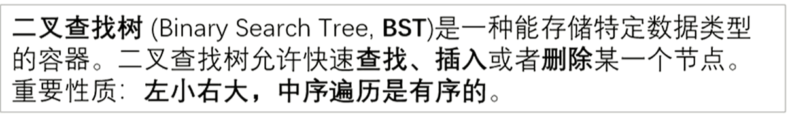
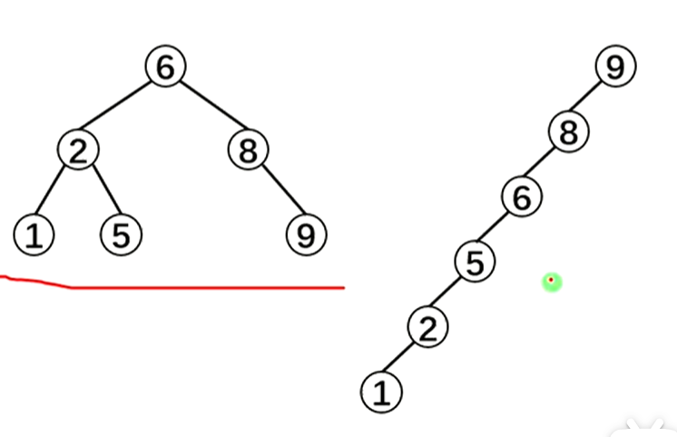

# 二叉查找树

## 典例

每次给出数字i插入在当前序列中的位置op_i的后面，求出最后每个数字的位置。

```C++
/*
CB Ntsc
*/

#include <bits/stdc++.h>
using namespace std;
#define int long long
#define mp make_pair

const int N = 1e6 + 5;
const int M = 16;
const int INF = 1e9 + 5;
const int MOD = 9999973;


#define rd read()
inline int read() {
    int xx = 0, ff = 1;
    char ch = getchar();
    while (ch < '0' || ch > '9') {
        if (ch == '-')
            ff = -1;
        ch = getchar();
    }
    while (ch >= '0' && ch <= '9') xx = xx * 10 + (ch - '0'), ch = getchar();
    return xx * ff;
}
inline void write(int out) {
    if (out < 0)
        putchar('-'), out = -out;
    if (out > 9)
        write(out / 10);
    putchar(out % 10 + '0');
}

bool f1;
int tr[N<<2],op[N],pos[N];
int q, n, m, t[N<<2], ans, T;
bool f2;


void push(int x){
    t[x]=t[x<<1]+t[x<<1|1];
}

void build(int x,int l,int r){
    if(l==r){
        t[x]=1;
        return ;
    }
    int mid=l+r>>1;
    build(x<<1,l,mid);
    build((x<<1)|1,mid+1,r);
    push(x);
}

int find(int x,int l,int r,int p){
    if(l==r){
        t[x]=0;
        return l;
    }
    int res;
    int mid=l+r>>1;
    if(t[x<<1]>=p)res=find(x<<1,l,mid,p);
    else res=find(x<<1|1,mid+1,r,p-t[x<<1]);
    push(x);
    return res;
}

signed main() {
    // freopen("chfran.in", "r", stdin);
    // freopen("chfran.out", "w", stdout);
    // cerr<<1.00*(&f2-&f1)/1024/1024<<endl;
    n=rd;

    build(1,1,n);
    for(int i=1;i<=n;i++){
        op[i]=rd;
    }

    for(int i=n;i;i--){
        pos[i]=find(1,1,n,op[i]+1);
    }
    
    return 0;
}

/*
1
2 5 1 
0 0 1 
0 0 4 

*/
```

## 介绍

1.定义
二叉查找树( Binary Search Tree,BST)是一种特殊的二叉树,又称为排序二叉树、二叉搜索树、二叉排序树。二叉査找树的递归定义如下：

①要么二叉査找树是一棵空树。

②要么二叉查找树由**根结点、左子树、右子树**组成，其中**左子树和右子树都是二叉查找树**，且**左子树上所有结点的数据域均小于或等于根结点的数据域，右子树上所有结点的数据域均大于根结点的数据域。**

从二叉査找树的定义中可以知道，二叉查找树实际上是一棵数据域有序的二叉树，即**对树上的每个结点，都满足其左子树上所有结点的数据域均小于或等于根结点的数据域，右子树上所有结点的数据域均大于根结点的数据域。**

2.基本操作
二叉查找树的基本操作有查找、插入、建树、删除。

二叉树的基本操作请参考：树与二叉树

(1).查找操作

在之前介绍二叉树的查找操作时，由于无法确定二叉树的具体特性，因此只能对左右子树都进行递归遍历。但是二叉查找树的性质决定了读者可以只选择其中一棵子树进行遍历，因此査找将会是从树根到查找结点的一条路径，故最坏复杂度是O(h)，其中h是二叉查找树的高度。

于是可以得到查找操作的基本思路：

①如果当前根结点root为空，说明查找失败，返回。

②如果需要查找的值x等于当前根结点的数据域root->data，说明查找成功，访问之。

③如果需要查找的值x小于当前根结点的数据域root->data，说明应该往左子树查找，因此向root->child递归。

④说明需要査找的值x大于当前根结点的数据域root->data，则应该往右子树查找，因此向root-> rchild递归。

由此可得到代码：

```Plain Text
//search函数查找二叉树中数据域为x的结点
void search(node* root,int x){
if(root == NULL){
//空树，查找失败
printf("search failed\n");
return;
}
if(x == root->data){
//查找成功，访问之
printf("%d\n",root->data);
} else if(x < root->data){
//如果x比根结点的数据域要小，说明x在左子树
search(root->lchild,x);	//往左子树搜索x
} else{
//如果x比根结点的数据域要大，说明x在右子树
search(root->rchild,x);	//往右子树搜索x
}
}
```

可以看到，和普通二叉树的查找函数不同，二叉査找树的査找在于对左右子树的选择递归。在普通二叉树中，无法确定需要査找的值x到底是在左子树还是右子树，但是在二叉查找树中就可以确定，因为二叉査找树中的数据域顺序总是左子树<根结点<右子树。

(2).插入操作

对一棵二叉查找树来说，查找某个数据域的结点一定是沿着确定的路径进行的。因此，当对某个需要查找的值在二叉査找树中査找成功，说明结点已经存在；反之，如果这个需要査找的值在二叉查找树中查找失败，那么说明查找失败的地方一定是结点需要插入的地方。因此可以在上面查找操作的基础上，在root=NULL时新建需要插入的结点。显然插入的时间复杂度也是O(h)，其中h为二叉查找树的高度。

代码如下：

```Plain Text
//insert函数将在二叉树中插入一个数据域为x的新结点（注意参数root要加引用&）
void insert(node* &root,int x){
if(root == NULL){
//空树，说明查找失败，也即插入位置
root = newNode(x);//新结点，权值为x
return;
}
if(x == root->data){
//查找成功，说明结点已经存在，直接返回
return;
} else if(x < root->data){
//如果x比根结点的数据域要小，说明x需要插在左子树
insert(root->lchild,x);	//往左子树插入x
} else{
//如果x比根结点的数据域要大，说明x需要插在右子树
insert(root->rchild,x);	//往右子树插入x
}
}
```

node* newNode(int v) {
node* Node = new node;	//申请一个node型的地址空间
Node->data = v;		//结点权值为v
Node->lchild = Node->rchild = NULL;			//初始化状态下没有左右孩子
return Node; 			//返回新建结点的地址
}

(3).建立

建立一棵二叉査找树，就是先后插入n个结点的过程，这和一般二叉树的建立是完全一样的，因此代码也基本相同：

```Plain Text
//二叉树的建立
node* Create(int data[],int n){
node* root = NULL;	//新建根结点root
for(int i=0;i<n;i++){
//将data[0]到data[n-1]插入到二叉树中
insert(root,data[i]);
}
return root;	//返回根结点
}
需要注意的是，即便是一组相同的数字，如果插入它们的顺序不同，最后生成的二叉查找树也可能不同。例如，先后插入{5,3,7,4,2,8,6}与{7,4,5,8,2,6,3}之后可以得到两棵不同的二又查找树，如下图所示。
```

(4).删除

二叉査找树的删除操作一般有两种常见做法，复杂度都是O(h)，其中h为二叉查找树的高度。此处主要介绍简单易写的一种。图9-20所示是一棵二叉査找树，如果需要删掉根结点5，应该怎么做呢?

为了保证删除操作之后仍然是一棵二叉査找树，一种办法是以树中比5小的最大结点(也就是结点4)覆盖结点5，然后删除原来的结点4；另一种办法是把树中比5大的最小结点(也就是结点6)覆盖结点5，然后删除原来的结点6。这两种做法都能保证删除操作之后仍然是一棵二叉査找树。

把以二叉査找树中比结点权值小的最大结点称为该结点的前驱，而把比结点权值大的最小结点称为该结点的后继。显然，结点的前驱是该结点左子树中的最右结点(也就是从左子树根结点开始不断沿着rchild往下直到rchild为NUL时的结点)，而结点的后继则是该结点右子树中的最左结点(也就是从右子树根结点开始不断沿着lchild往下直到lchild为NULL时的结点)。下面两个函数用来寻找以root为根的树中最大或最小权值的结点，用以辅助寻找结点的前驱和后继：

```Plain Text
//寻找以root为根结点的树中的最大权值结点
node* findMax(node* root){
while(root->rchild != NULL){
root = root->rchild;	//不断往右，直到没有右孩子
}
return root;
}
//寻找以root为根结点的树中的最小权值结点
node* findMin(node* root){
while(root->lchild != NULL){
root = root->lchild;	//不断往左，直到没有左孩子
}
return root;
}
假设决定用结点N的前驱P来替换N，于是就把问题转换为在N的左子树中删除结点P就可以递归下去了，直到递归到一个叶子结点，就可以直接把它删除了。
```

因此删除操作的基本思路如下:

①如果当前结点root为空，说明不存在权值为给定权值x的结点，直接返回。

②如果当前结点root的权值恰为给定的权值x，说明找到了想要删除的结点，此时进入除处理。

a)如果当前结点root不存在左右孩子，说明是叶子结点，直接删除；

b)如果当前结点roo存在左孩子，那么在左子树中寻找结点前驱pre，然后让pre的数据覆盖root，接着在左子树中删除结点pre；

c)如果当前结点root存在右孩子，那么在右子树中寻找结点后继next，然后让next的数据覆盖root，接着在右子树中删除结点 next。

③如果当前结点root的权值大于给定的权值x，则在左子树中递归删除权值为x的结点。

④如果当前结点root的权值小于给定的权值x，则在右子树中递归删除权值为x的结点。

删除操作的代码如下：

```Plain Text
//删除以root为根结点的树中权值为x的结点
void deleteNode(node* &root,int x){
if(root == NULL)	//根结点不存在，直接返回
return;
//找到欲删除结点
if(root->data == x){
//叶子结点直接删除
if(root->lchild == NULL && root->rchild == NULL){
root = NULL;	//把root地址设为NULL，父节点就引用不到它了
} else if(root->lchild != NULL){
//左子树不为空时
node* pre = findMax(root->lchild);	//找root的前驱
root->data = pre->data;	//用前驱覆盖root
deleteNode(root->lchild,pre->data);	//在左子树中删除结点pre
} else{
//右子树不为空
node* next = findMin(root->rchild);	//找root的后继
root->data = next->data;	//用后继覆盖root
deleteNode(root->lchild,next->data);	//在左子树中删除结点next
```

```Plain Text
	}
} else if(root->data > x){
	deleteNode(root->lchild,x);	//往左子树中删除x 
}  else {
	deleteNode(root->rchild,x);	//往右子树中删除x 
}
```

}

当然这段代码可以通过很多手段优化，例如可以在找到欲删除结点root的后继结点n后，不进行递归，而通过这样的手段直接删除该后继：假设结点next的父亲结点是结点S，显然结点next是S的左孩子(想一想为什么?)，那么由于结点next一定没有左子树(想一想为什么?)，便可以直接把结点next的右子树代替结点next成为S的左子树，这样就删去了结点next。前驱同理。例如上图中结点5的后继是结点6，它是父亲结点8的左孩子，那么在用结点6覆盖结点5之后，可以直接把结点6的右子树代替结点6称为结点8的左子树。为了方便操作，这个优化需要在结点定义中额外记录每个结点的父亲结点地址，有兴趣的读者可以自己尝试实现。

但是也要注意，总是优先删除前驱(或者后继)容易导致树的左右子树高度极度不平衡，使得二叉査找树退化成一条链。解决这一问题的办法有两种：一种是每次交替删除前驱或后继；另一种是记录子树高度，总是优先在高度较高的一棵子树里删除结点。

3.性质
二叉查找树一个实用的性质：对二叉查找树进行中序遍历，遍历的结果是有序的。

这是由于二叉査找树本身的定义中就包含了左子树<根结点<右子树的特点，而中序遍历的访问顺序也是左子树一根结点一右子树，因此,所得到的中序遍历序列是有序的。

另外，如果合理调整二叉査找树的形态，使得树上的每个结点都尽量有两个子结点，这样整个二叉査找树的高度就会很低，也即树的高度大概在log(N)的级别，其中N是结点个数能实现这个要求的一种树是平衡二又树(AVL)，参考下一篇文章。

————————————————
版权声明：本文为CSDN博主「李歘歘」的原创文章，遵循CC 4.0 BY-SA版权协议，转载请附上原文出处链接及本声明。
原文链接：[https://blog.csdn.net/qq_42410605/article/details/104156943](https://blog.csdn.net/qq_42410605/article/details/104156943)

## BST 二叉查找树



以下两幅图均是二叉查找树，但是左边的复杂度为O(log n)右边的复杂度则为O(n)



那么有什么办法让BST不退还成一条链呢？这里我们就可以使用平衡树了（下接Splay）

