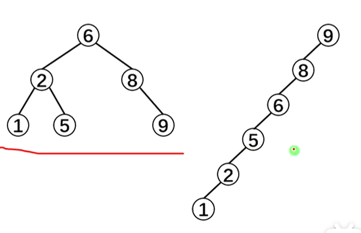
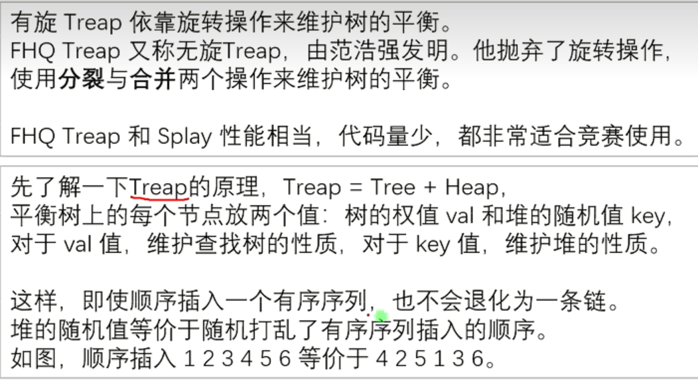
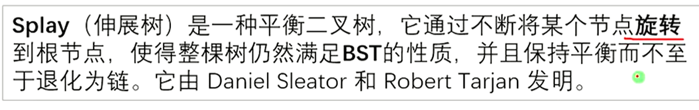
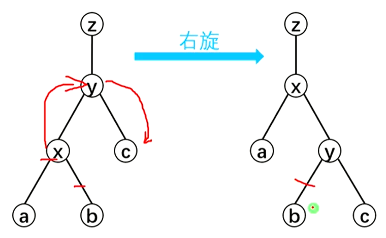
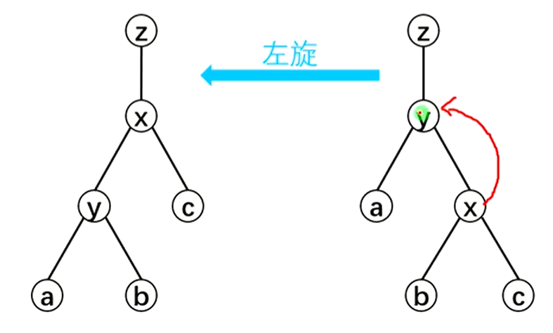
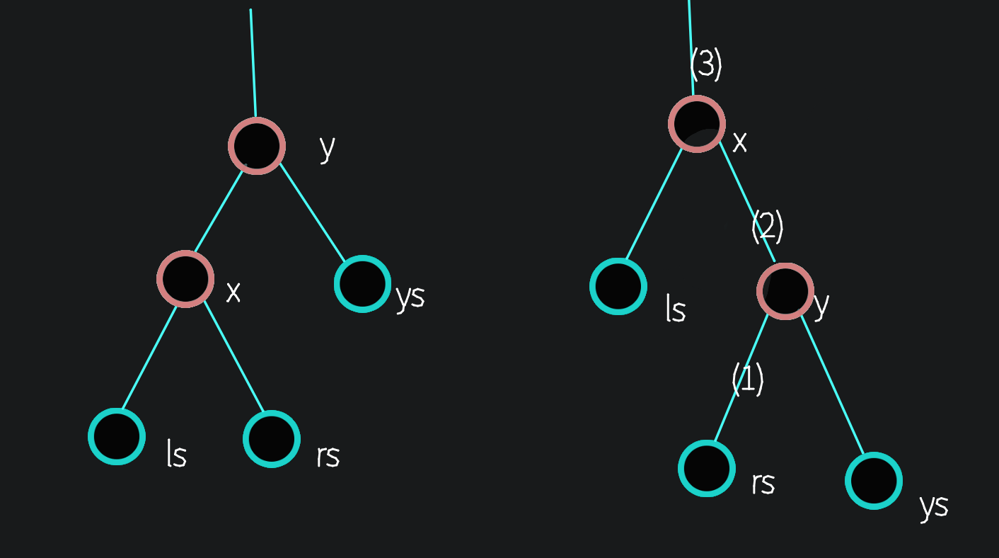
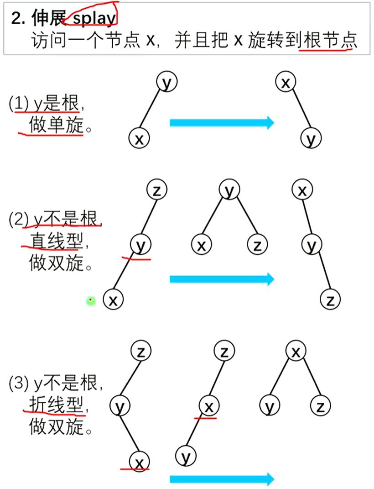
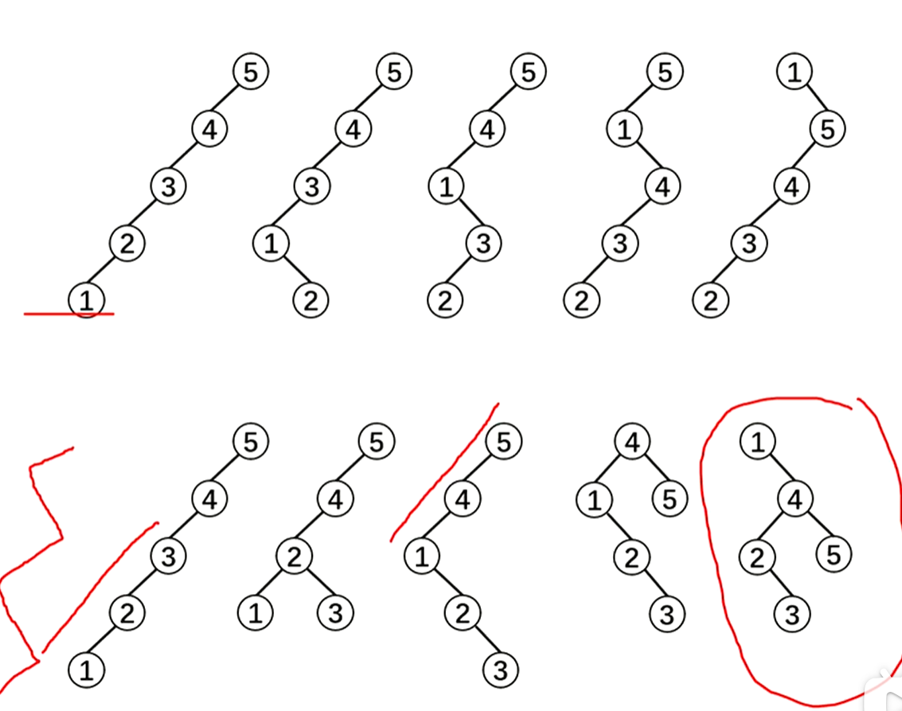
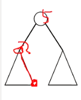
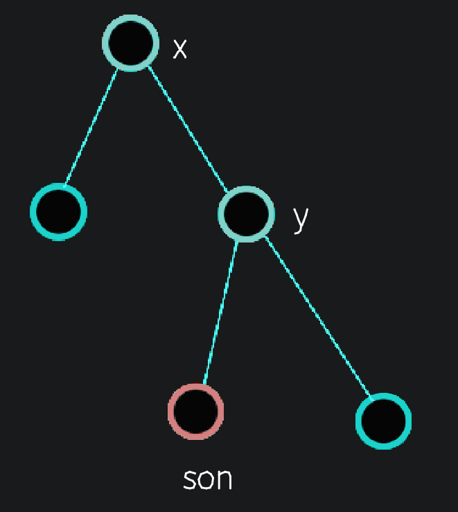

专题 | 二叉查找树与平衡树

平衡树重点：对于FHQ，split函数会随题目要求而改变！！！

# 目录

- 二叉查找树

- 平衡树FHQ Treap

- 平衡树Splay

- pbds中的平衡树

- 平衡树的vector伪做法

- 文艺平衡树

- 二逼平衡树（树套树）

- 后缀平衡树

- 可持久化平衡树

# 二叉查找树

## 典例

每次给出数字i插入在当前序列中的位置op_i的后面，求出最后每个数字的位置。

```C++
/*
CB Ntsc
*/

#include <bits/stdc++.h>
using namespace std;
#define int long long
#define mp make_pair

const int N = 1e6 + 5;
const int M = 16;
const int INF = 1e9 + 5;
const int MOD = 9999973;


#define rd read()
inline int read() {
    int xx = 0, ff = 1;
    char ch = getchar();
    while (ch < '0' || ch > '9') {
        if (ch == '-')
            ff = -1;
        ch = getchar();
    }
    while (ch >= '0' && ch <= '9') xx = xx * 10 + (ch - '0'), ch = getchar();
    return xx * ff;
}
inline void write(int out) {
    if (out < 0)
        putchar('-'), out = -out;
    if (out > 9)
        write(out / 10);
    putchar(out % 10 + '0');
}

bool f1;
int tr[N<<2],op[N],pos[N];
int q, n, m, t[N<<2], ans, T;
bool f2;


void push(int x){
    t[x]=t[x<<1]+t[x<<1|1];
}

void build(int x,int l,int r){
    if(l==r){
        t[x]=1;
        return ;
    }
    int mid=l+r>>1;
    build(x<<1,l,mid);
    build((x<<1)|1,mid+1,r);
    push(x);
}

int find(int x,int l,int r,int p){
    if(l==r){
        t[x]=0;
        return l;
    }
    int res;
    int mid=l+r>>1;
    if(t[x<<1]>=p)res=find(x<<1,l,mid,p);
    else res=find(x<<1|1,mid+1,r,p-t[x<<1]);
    push(x);
    return res;
}

signed main() {
    // freopen("chfran.in", "r", stdin);
    // freopen("chfran.out", "w", stdout);
    // cerr<<1.00*(&f2-&f1)/1024/1024<<endl;
    n=rd;

    build(1,1,n);
    for(int i=1;i<=n;i++){
        op[i]=rd;
    }

    for(int i=n;i;i--){
        pos[i]=find(1,1,n,op[i]+1);
    }
    
    return 0;
}

/*
1
2 5 1 
0 0 1 
0 0 4 

*/
```

## 介绍

1.定义
二叉查找树( Binary Search Tree,BST)是一种特殊的二叉树,又称为排序二叉树、二叉搜索树、二叉排序树。二叉査找树的递归定义如下：

①要么二叉査找树是一棵空树。

②要么二叉查找树由**根结点、左子树、右子树**组成，其中**左子树和右子树都是二叉查找树**，且**左子树上所有结点的数据域均小于或等于根结点的数据域，右子树上所有结点的数据域均大于根结点的数据域。**

从二叉査找树的定义中可以知道，二叉查找树实际上是一棵数据域有序的二叉树，即**对树上的每个结点，都满足其左子树上所有结点的数据域均小于或等于根结点的数据域，右子树上所有结点的数据域均大于根结点的数据域。**

2.基本操作
二叉查找树的基本操作有查找、插入、建树、删除。

二叉树的基本操作请参考：树与二叉树

(1).查找操作

在之前介绍二叉树的查找操作时，由于无法确定二叉树的具体特性，因此只能对左右子树都进行递归遍历。但是二叉查找树的性质决定了读者可以只选择其中一棵子树进行遍历，因此査找将会是从树根到查找结点的一条路径，故最坏复杂度是O(h)，其中h是二叉查找树的高度。

于是可以得到查找操作的基本思路：

①如果当前根结点root为空，说明查找失败，返回。

②如果需要查找的值x等于当前根结点的数据域root->data，说明查找成功，访问之。

③如果需要查找的值x小于当前根结点的数据域root->data，说明应该往左子树查找，因此向root->child递归。

④说明需要査找的值x大于当前根结点的数据域root->data，则应该往右子树查找，因此向root-> rchild递归。

由此可得到代码：

```Plain Text
//search函数查找二叉树中数据域为x的结点
void search(node* root,int x){
if(root == NULL){
//空树，查找失败
printf("search failed\n");
return;
}
if(x == root->data){
//查找成功，访问之
printf("%d\n",root->data);
} else if(x < root->data){
//如果x比根结点的数据域要小，说明x在左子树
search(root->lchild,x);	//往左子树搜索x
} else{
//如果x比根结点的数据域要大，说明x在右子树
search(root->rchild,x);	//往右子树搜索x
}
}
```

可以看到，和普通二叉树的查找函数不同，二叉査找树的査找在于对左右子树的选择递归。在普通二叉树中，无法确定需要査找的值x到底是在左子树还是右子树，但是在二叉查找树中就可以确定，因为二叉査找树中的数据域顺序总是左子树<根结点<右子树。

(2).插入操作

对一棵二叉查找树来说，查找某个数据域的结点一定是沿着确定的路径进行的。因此，当对某个需要查找的值在二叉査找树中査找成功，说明结点已经存在；反之，如果这个需要査找的值在二叉查找树中查找失败，那么说明查找失败的地方一定是结点需要插入的地方。因此可以在上面查找操作的基础上，在root=NULL时新建需要插入的结点。显然插入的时间复杂度也是O(h)，其中h为二叉查找树的高度。

代码如下：

```Plain Text
//insert函数将在二叉树中插入一个数据域为x的新结点（注意参数root要加引用&）
void insert(node* &root,int x){
if(root == NULL){
//空树，说明查找失败，也即插入位置
root = newNode(x);//新结点，权值为x
return;
}
if(x == root->data){
//查找成功，说明结点已经存在，直接返回
return;
} else if(x < root->data){
//如果x比根结点的数据域要小，说明x需要插在左子树
insert(root->lchild,x);	//往左子树插入x
} else{
//如果x比根结点的数据域要大，说明x需要插在右子树
insert(root->rchild,x);	//往右子树插入x
}
}
```

node* newNode(int v) {
node* Node = new node;	//申请一个node型的地址空间
Node->data = v;		//结点权值为v
Node->lchild = Node->rchild = NULL;			//初始化状态下没有左右孩子
return Node; 			//返回新建结点的地址
}

(3).建立

建立一棵二叉査找树，就是先后插入n个结点的过程，这和一般二叉树的建立是完全一样的，因此代码也基本相同：

```Plain Text
//二叉树的建立
node* Create(int data[],int n){
node* root = NULL;	//新建根结点root
for(int i=0;i<n;i++){
//将data[0]到data[n-1]插入到二叉树中
insert(root,data[i]);
}
return root;	//返回根结点
}
需要注意的是，即便是一组相同的数字，如果插入它们的顺序不同，最后生成的二叉查找树也可能不同。例如，先后插入{5,3,7,4,2,8,6}与{7,4,5,8,2,6,3}之后可以得到两棵不同的二又查找树，如下图所示。
```

(4).删除

二叉査找树的删除操作一般有两种常见做法，复杂度都是O(h)，其中h为二叉查找树的高度。此处主要介绍简单易写的一种。图9-20所示是一棵二叉査找树，如果需要删掉根结点5，应该怎么做呢?

为了保证删除操作之后仍然是一棵二叉査找树，一种办法是以树中比5小的最大结点(也就是结点4)覆盖结点5，然后删除原来的结点4；另一种办法是把树中比5大的最小结点(也就是结点6)覆盖结点5，然后删除原来的结点6。这两种做法都能保证删除操作之后仍然是一棵二叉査找树。

把以二叉査找树中比结点权值小的最大结点称为该结点的前驱，而把比结点权值大的最小结点称为该结点的后继。显然，结点的前驱是该结点左子树中的最右结点(也就是从左子树根结点开始不断沿着rchild往下直到rchild为NUL时的结点)，而结点的后继则是该结点右子树中的最左结点(也就是从右子树根结点开始不断沿着lchild往下直到lchild为NULL时的结点)。下面两个函数用来寻找以root为根的树中最大或最小权值的结点，用以辅助寻找结点的前驱和后继：

```Plain Text
//寻找以root为根结点的树中的最大权值结点
node* findMax(node* root){
while(root->rchild != NULL){
root = root->rchild;	//不断往右，直到没有右孩子
}
return root;
}
//寻找以root为根结点的树中的最小权值结点
node* findMin(node* root){
while(root->lchild != NULL){
root = root->lchild;	//不断往左，直到没有左孩子
}
return root;
}
假设决定用结点N的前驱P来替换N，于是就把问题转换为在N的左子树中删除结点P就可以递归下去了，直到递归到一个叶子结点，就可以直接把它删除了。
```

因此删除操作的基本思路如下:

①如果当前结点root为空，说明不存在权值为给定权值x的结点，直接返回。

②如果当前结点root的权值恰为给定的权值x，说明找到了想要删除的结点，此时进入除处理。

a)如果当前结点root不存在左右孩子，说明是叶子结点，直接删除；

b)如果当前结点roo存在左孩子，那么在左子树中寻找结点前驱pre，然后让pre的数据覆盖root，接着在左子树中删除结点pre；

c)如果当前结点root存在右孩子，那么在右子树中寻找结点后继next，然后让next的数据覆盖root，接着在右子树中删除结点 next。

③如果当前结点root的权值大于给定的权值x，则在左子树中递归删除权值为x的结点。

④如果当前结点root的权值小于给定的权值x，则在右子树中递归删除权值为x的结点。

删除操作的代码如下：

```Plain Text
//删除以root为根结点的树中权值为x的结点
void deleteNode(node* &root,int x){
if(root == NULL)	//根结点不存在，直接返回
return;
//找到欲删除结点
if(root->data == x){
//叶子结点直接删除
if(root->lchild == NULL && root->rchild == NULL){
root = NULL;	//把root地址设为NULL，父节点就引用不到它了
} else if(root->lchild != NULL){
//左子树不为空时
node* pre = findMax(root->lchild);	//找root的前驱
root->data = pre->data;	//用前驱覆盖root
deleteNode(root->lchild,pre->data);	//在左子树中删除结点pre
} else{
//右子树不为空
node* next = findMin(root->rchild);	//找root的后继
root->data = next->data;	//用后继覆盖root
deleteNode(root->lchild,next->data);	//在左子树中删除结点next
```

```Plain Text
	}
} else if(root->data > x){
	deleteNode(root->lchild,x);	//往左子树中删除x 
}  else {
	deleteNode(root->rchild,x);	//往右子树中删除x 
}
```

}

当然这段代码可以通过很多手段优化，例如可以在找到欲删除结点root的后继结点n后，不进行递归，而通过这样的手段直接删除该后继：假设结点next的父亲结点是结点S，显然结点next是S的左孩子(想一想为什么?)，那么由于结点next一定没有左子树(想一想为什么?)，便可以直接把结点next的右子树代替结点next成为S的左子树，这样就删去了结点next。前驱同理。例如上图中结点5的后继是结点6，它是父亲结点8的左孩子，那么在用结点6覆盖结点5之后，可以直接把结点6的右子树代替结点6称为结点8的左子树。为了方便操作，这个优化需要在结点定义中额外记录每个结点的父亲结点地址，有兴趣的读者可以自己尝试实现。

但是也要注意，总是优先删除前驱(或者后继)容易导致树的左右子树高度极度不平衡，使得二叉査找树退化成一条链。解决这一问题的办法有两种：一种是每次交替删除前驱或后继；另一种是记录子树高度，总是优先在高度较高的一棵子树里删除结点。

3.性质
二叉查找树一个实用的性质：对二叉查找树进行中序遍历，遍历的结果是有序的。

这是由于二叉査找树本身的定义中就包含了左子树<根结点<右子树的特点，而中序遍历的访问顺序也是左子树一根结点一右子树，因此,所得到的中序遍历序列是有序的。

另外，如果合理调整二叉査找树的形态，使得树上的每个结点都尽量有两个子结点，这样整个二叉査找树的高度就会很低，也即树的高度大概在log(N)的级别，其中N是结点个数能实现这个要求的一种树是平衡二又树(AVL)，参考下一篇文章。

————————————————
版权声明：本文为CSDN博主「李歘歘」的原创文章，遵循CC 4.0 BY-SA版权协议，转载请附上原文出处链接及本声明。
原文链接：[https://blog.csdn.net/qq_42410605/article/details/104156943](https://blog.csdn.net/qq_42410605/article/details/104156943)

# BST 二叉查找树


以下两幅图均是二叉查找树，但是左边的复杂度为O(log n)右边的复杂度则为O(n)




那么有什么办法让BST不退还成一条链呢？这里我们就可以使用平衡树了（下接Splay）


# FHQ Treap

[163 普通平衡树 FHQ Treap_哔哩哔哩_bilibili](https://www.bilibili.com/video/BV1kY4y1j7LC/?spm_id_from=333.337.search-card.all.click&vd_source=f45ea4e1e4b3b73d5f07c57b46c43aba)



## 重要操作 split


```C++
//分裂 根据v将树划分为2个子树 
void split(int i,int v,int &x,int &y){//i当前节点，v划分数值， 返回时x会指向左treap的根，y指向右treap的根
 	if(!i){//到达树叶 
 		x=y=0;return ;
	 }
	 if(tr[i].val<=v){//如果这个点的val<=v,那么它的左子树一定都<=v,但是右子树的root虽然>v,但我们不知道它的儿子们是否都>v,所以需要递归右子树 
	 	x=i;
	 	split(tr[i].r,v,tr[i].r,y);//递归实现 
	 }else{
	 	y=i;
	 	split(tr[i].l,v,x,tr[i].l);
	 }
	pushup(i);
}
```

## 重要操作 merge


```C++
//合并 分裂的逆过程.递归缝合2个分裂的treap 
int merge(int x,int y){// x,y分别是左右treap的根 
	if(!x||!y){
		return x+y;
	} 
	if(tr[x].key<=tr[y].key){//如果x的key<=y的key,那么y就作为x的子树,且是右子树,递归合并x原来的右子树和y
		tr[x].r=merge(tr[x].r,y);
		pushup(x);return x;
	}else{
		tr[y].l=merge(x,tr[y].l);
		pushup(y);return y;
	}
}
```


## 其他操作

### 插入

```C++
int addnode(int v){
	tr[++idx].val=v;
	tr[idx].key=rand();
	tr[idx].size=1;
	return idx;//返回这个点在数组里的序号 
} 
```

注意！上方代码仅仅是加点，没有插入！

```C++
void insert(int v){
	int x,y,z;
	split(root,v,x,y);
	z=addnode(v);
	root=merge(merge(x,z),y);//相当于z是一个1个节点的树,把它先和x合并(因为x的val均<=v,保证了它的大小顺序,至于它会被放在x的根或者其他地方,凭借key来确定),再和y合并 
}
```

插入

### 查询

```C++
int getk(int i,int k){//获取中序排序第k个值的编号 
	if(k<=tr[tr[i].l].size)return getk(tr[i].l,k);//说明要找到点在左子树,那么去左子树找第k个 
	if(k==tr[tr[i].l].size+1)return i;//找到了 
	return getk(tr[i].r,k-tr[tr[i].l].size-1);//否则 说明要找到点在右子树,那么去左子树找第(k-size左子树)个(左子树已经有size个了,那么要找整个的第k个,只要找右子树的第(k-size左子树)个即可) 
}
```

上方代码为插入代码的base

```C++
int getval(int k){//查询排名为k的节点的值
	int p=getk(root,k);
	return tr[p].val;
}
```

查询排名为k的节点的值

```C++
void getpre(int v){//找到v的前驱 (即<v的最大的那个点)
	int x,y;//x,y只是暂时存放一下劈开的2个子树的根,后面还要合并 
	split(root,v-1,x,y);//劈开,变成<v(x)和>=v(y) 2个树 
	int p=getk(x,tr[x].size);//在子树x里面找到最后一个就是 <v(x)的最大的那个点
	cout<<tr[p].val<<endl;
	root=merge(x,y);//别忘了合并 
}	
```

找到v的前驱

```C++
void getsuc(int v){//找到v的后驱 (即>v的最小的那个点)
	int x,y;
	split(root,v,x,y);//劈开,变成<=v(x)和>v(y) 2个树 
	int p=getk(y,1);//在子树y里面找到第一个就是 >v(x)的最小的那个点
	cout<<tr[p].val<<endl;//cout<<"OK";
	root=merge(x,y);//别忘了合并 
}	
```

找到v的后驱

```C++
void getrank(int v){//查询val=v的点的排名(从小到大) 如果有重复的val=v的节点只计第一个,排序不去重 
	int x,y;
	split(root,v-1,x,y);//劈开,变成<v(x)和>=v(y) 2个树 
	cout<<tr[x].size+1<<endl;//子树x的大小就是val=v的点前面有几个点 
	root=merge(x,y);
}
```

查询val=v的点的排名(从小到大)

### 删除

```C++
void del(int v){
	int x,y,z;//将来会分别指向3棵树,他们的节点val分别是<v,=v,>v 
	split(root,v,x,z);//此时分成了2棵树,x指向的树是<=v的,y则是>v的 
	split(x,v-1,x,y);//再把x分成2棵树,把<v(x)的和=v(y)的拎出来 
	y=merge(tr[y].l,tr[y].r);//把y变成y的左右子树合并,相当于把根抛弃了 
	root=merge(merge(x,y),z);//重新合并  
} 
```

# 【模板】普通平衡树

## 题目描述

您需要写一种数据结构（可参考题目标题），来维护一些数，其中需要提供以下操作：

1. 插入 $x$ 数

2. 删除 $x$ 数(若有多个相同的数，应只删除一个)

3. 查询 $x$ 数的排名(排名定义为比当前数小的数的个数 $+1$ )

4. 查询排名为 $x$ 的数

5. 求 $x$ 的前驱(前驱定义为小于 $x$，且最大的数)

6. 求 $x$ 的后继(后继定义为大于 $x$，且最小的数)

## 输入格式

第一行为 $n$，表示操作的个数,下面 $n$ 行每行有两个数 $\text{opt}$ 和 $x$，$\text{opt}$ 表示操作的序号( $1 \leq \text{opt} \leq 6$ )

## 输出格式

对于操作 $3,4,5,6$ 每行输出一个数，表示对应答案

## 样例 #1

### 样例输入 #1

```C++
10
1 106465
4 1
1 317721
1 460929
1 644985
1 84185
1 89851
6 81968
1 492737
5 493598
```

### 样例输出 #1

```C++
106465
84185
492737
```

## 提示

【数据范围】
对于 $100\%$ 的数据，$1\le n \le 10^5$，$|x| \le 10^7$

## 完整代码&注释


    - 注意没有`return`的函数一定要写`void`类型

```C++
/*////////ACACACACACACAC///////////
Code By Ntsc
/*////////ACACACACACACAC///////////
#include<bits/stdc++.h>
using namespace std;
#define ll long long
const int N=1e5+5;

struct node{
	int l,r,val,key,size;
}tr[N];
int n,root,idx;  //root记录根的编号 ，idx是对新的节点进行编号的变量 

int addnode(int v){
	tr[++idx].val=v;
	tr[idx].key=rand();
	tr[idx].size=1;
	return idx;//返回这个点在数组里的序号 
} 
void pushup(int i){//向上更新子树大小 
	tr[i].size=tr[tr[i].l].size+tr[tr[i].r].size+1; 
}
//分裂 根据v将树划分为2个子树 
void split(int i,int v,int &x,int &y){//i当前节点，v划分数值， 返回时x会指向左treap的根，y指向右treap的根
 	if(!i){//到达树叶 
 		x=y=0;return ;
	 }
	 if(tr[i].val<=v){//如果这个点的val<=v,那么它的左子树一定都<=v,但是右子树的root虽然>v,但我们不知道它的儿子们是否都>v,所以需要递归右子树 
	 	x=i;
	 	split(tr[i].r,v,tr[i].r,y);//递归实现 
	 }else{
	 	y=i;
	 	split(tr[i].l,v,x,tr[i].l);
	 }
	pushup(i);
}
//合并 分裂的逆过程.递归缝合2个分裂的treap 
int merge(int x,int y){// x,y分别是左右treap的根 
	if(!x||!y){
		return x+y;
	} 
	if(tr[x].key<=tr[y].key){//如果x的key<=y的key,那么y就作为x的子树,且是右子树,递归合并x原来的右子树和y
		tr[x].r=merge(tr[x].r,y);
		pushup(x);return x;
	}else{
		tr[y].l=merge(x,tr[y].l);
		pushup(y);return y;
	}
}
void insert(int v){
	int x,y,z;
	split(root,v,x,y);
	z=addnode(v);
	root=merge(merge(x,z),y);//相当于z是一个1个节点的树,把它先和x合并(因为x的val均<=v,保证了它的大小顺序,至于它会被放在x的根或者其他地方,凭借key来确定),再和y合并 
}
void del(int v){
	int x,y,z;//将来会分别指向3棵树,他们的节点val分别是<v,=v,>v 
	split(root,v,x,z);//此时分成了2棵树,x指向的树是<=v的,y则是>v的 
	split(x,v-1,x,y);//再把x分成2棵树,把<v(x)的和=v(y)的拎出来 
	y=merge(tr[y].l,tr[y].r);//把y变成y的左右子树合并,相当于把根抛弃了 
	root=merge(merge(x,y),z);//重新合并  
} 
int getk(int i,int k){//获取中序排序第k个值的编号 
	if(k<=tr[tr[i].l].size)return getk(tr[i].l,k);//说明要找到点在左子树,那么去左子树找第k个 
	if(k==tr[tr[i].l].size+1)return i;//找到了 
	return getk(tr[i].r,k-tr[tr[i].l].size-1);//否则 说明要找到点在右子树,那么去左子树找第(k-size左子树)个(左子树已经有size个了,那么要找整个的第k个,只要找右子树的第(k-size左子树)个即可) 
} 
int getpre(int v){//找到v的前驱 (即<v的最大的那个点)
	int x,y;//x,y只是暂时存放一下劈开的2个子树的根,后面还要合并 
	split(root,v-1,x,y);//劈开,变成<v(x)和>=v(y) 2个树 
	int p=getk(x,tr[x].size);//在子树x里面找到最后一个就是 <v(x)的最大的那个点
	cout<<tr[p].val<<endl;
	root=merge(x,y);//别忘了合并 
}	
int getsuc(int v){//找到v的后驱 (即>v的最小的那个点)
	int x,y;
	split(root,v,x,y);//劈开,变成<=v(x)和>v(y) 2个树 
	int p=getk(y,1);//在子树y里面找到第一个就是 >v(x)的最小的那个点
	cout<<tr[p].val<<endl;//cout<<"OK";
	root=merge(x,y);//别忘了合并 
}	
void getrank(int v){//查询val=v的点的排名(从小到大) 如果有重复的val=v的节点只计第一个,排序不去重 
	int x,y;
	split(root,v-1,x,y);//劈开,变成<v(x)和>=v(y) 2个树 
	cout<<tr[x].size+1<<endl;//子树x的大小就是val=v的点前面有几个点 
	root=merge(x,y);
}
void getval(int k){//查询排名为k的节点的值
	int p=getk(root,k);
	cout<<tr[p].val<<endl;
	
}


signed main(){
	cin>>n;
	for(int i=1;i<=n;i++){
		int opt,x;
		cin>>opt>>x;
		if(opt==1){
			insert(x);
		}if(opt==2){
			del(x);
		}if(opt==3){
			getrank(x);
		}if(opt==4){
			getval(x);
		}if(opt==5){
			getpre(x);
		}if(opt==6){
			getsuc(x);
		}
	}
	return 0;
}

```

# Splay

[161 普通平衡树 Splay_哔哩哔哩_bilibili](https://www.bilibili.com/video/BV1wg411Z7Qa/?spm_id_from=333.337.search-card.all.click)

那么有什么办法让BST不退还成一条链呢？这里我们就可以使用平衡树了



接下来我们介绍Splay的各种操作

## 节点信息

```C++
struct node{
	int s[2],fa,v,cnt,size;
	//左右儿子,父亲,节点权值,值的数量,子树大小
	void init(int p1,int v1){
		fa=p1,v=v1;cnt=size=1;
	}
}tr[N];
```

## 重要操作：旋转

要求：保序（保证中序遍历顺序不变），信息正确

**右旋**



将原来x的父亲y作为x的儿子，然后将x的右儿子变成y的左儿子

**左旋**



**Code**

```C++
void rotate(int x){
	int y=t[x].fa,z=t[y].fa;
	int k=(tr[y].s[1]==x);//这里很重要!如果true,说明x为y的左儿子,应该继续左旋
	//以下代码左右旋通用,我们以右旋为例
	tr[y].s[k]=tr[x].s[k^1];//将y的左儿子设置为x的右儿子(1)
	tr[tr[y].s[k]].fa=y;
	tr[x].s[k^1]=y;//将x的右儿子设置为y(2)
	tr[y].fa=x;
	tr[z].s[(tr[z].s[1]==y)]=x;//自动判断原来的y是z的左/右儿子
	tr[x].fa=z;//更新z的儿子,x的新父亲(3)
	pushup(x);pushup(y);//别忘了修改信息
}
```

如图



**Pushup**

```C++
void pushup(int x){//由左右儿子信息更新父亲的信息
	tr[x].size=tr[tr[x].s[0]].size+tr[tr[x].s[1]].size+tr[x].cnt;//儿子的size(子树和)加上自己的大小
	//size存的是以x为根节点的子树的信息
}
```

## 核心操作：splay

目的：访问一个节点并且将其旋转到根节点

我们使用以下三种方法的组合来实现目的



问题：为什么我们不仅仅用单旋呢？

结合实例，我们发现，如果仅仅用单旋，二叉树的状况不会得到改善。



**Code**

```C++
void splay(int x,int k){//将x旋转到k下方
	while(tr[x].fa!=k){
		int y=tr[x].fa,z=tr[y].fa;
		//第一次旋转,要分情况
		if(z!=k)//若z=k,说明只需要做单旋了(说明目标点就为x的父亲)
			if((tr[y].s[0]==x)^(tr[z].s[0]==y)){//若y为z左,x为y左或者y为z右,x为y右,异或和均为0,表示是直线型
				rotate(x);
			}else rotate(y);
		//第二次旋转,都是旋转x 
		rotata(x);
	}
	if(k==0)rt=x;//如果k=0说明x被旋转到了根节点
}
```

## 其他操作

### find查找

目标：查找值v所在的节点并且将其旋转至根节点

```C++
void find(int v){
	int x=rt;
	while(tr[x].s[v>tr[x].v]&&v!=tr[x].v){//如果:找到的点没有符合要求的儿子(即走到了最靠近v的点,但v是不存在的)或者找到了v
		x=tr[x].s[v>tr[x].v];//如果v>tr[x].v,那么就走右儿子
	}
	splay(x,0);//将v或者最靠近v的那个点旋转到根节点
}
```

### getlower求前驱

```C++
int getlower(int v){
	find(v);
	int x=rt;//rt即v
	if(tr[x].v<v)return x;//若true,说明在find中就没有找到v,而是找到了最靠近v的点,若这个点的v<v,那么它就是v的前驱
	x=tr[x].s[0];//先走到v的左子树
	while(tr[x].s[1])x=tr[x].s[1];//然后不断走右儿子
	return x;
}
```

**解说**



我们要找到小于根节点v的最大值，那么根据BST性质，我们就先往v的左儿子走，现在当前点的子树都是<v的了，在其中找最大的，即不断往右儿子走

### getbigger求后继

原理与前驱相同

**Code**

```C++
int getbigger(int v){
	find(v);
	int x=rt;//rt即v
	if(tr[x].v>v)return x;//若true,说明在find中就没有找到v,而是找到了最靠近v的点,若这个点的v>v,那么它就是v的后继
	x=tr[x].s[1];//先走到v的右子树
	while(tr[x].s[0])x=tr[x].s[0];//然后不断走左儿子
	return x;
}
```

### Del删除节点

我们考虑到直接删除节点比较麻烦，但如果这个点是一个叶子节点就简单多了，我们又观察到，在下图这个常见的结构中，son节点既满足son>x又满足son<y。在前面我们已经可以求出son的前驱和后继，那么只要我们把son的前驱和后继向上旋转，就可以把son移到叶子节点的位置，就方便删除了



**Code**

```C++
void del(int v){
	int pre=getlower(v),nxt=getbigger(v);
	splay(pre,0);splay(nxt,pre);//将pre旋转到根节点,将nxt旋转到pre的下方,只要就构造出了如图所示的图像
	int del=tr[nxt].s[0];
	if(tr[del].cnt>1)tr[del].cnt--,splay(del,0);//这里进行splay主要是为了pushup
	else tr[nxt].s[0]=0,splay(nxt,0);//直接清空nxt的左儿子,并且更新它
}
```


注意，因为删除一个节点需要求出它的前驱和后继，我们就在平衡树中插入一个无穷小和一个无穷大，重要就能保证一定能找到任意一个点的前驱和后继

### Getrank查询排名

~~直接将v旋转到根节点，然后返回其左子树的大小即可~~ 会被HAck

```C++
int getrank(int v){
	// find(v);
	// return tr[tr[rt].s[0]].size;//没有加上1的原因是树上还有一个无穷小的节点
    //不能用上面的代码！！会WA一个点
	insert(v);
    int res=tr[tr[rt].s[0]].size;
    del(v);
    return res;
}
```

### Getval查询权值

```C++
int getval(int k){//查询第k小的点的权值
	int x=rt;
	k++;//因为有一个无穷小,所以实际上要查询的点是第k+1小的
	while(1){
		if(tr[tr[x].s[0]].size+tr[x].cnt<k){//走右边
			x=tr[x].s[1];k-=tr[tr[x].s[0]].size+tr[x].cnt;
		}else{
			if(tr[[x].s[0]].size>=k)x=tr[x].s[0];//走左边,若为true说明第k小的在左边,否则说明即不是右边,左边也没有,那就是它自己了
			else break;
		}
		
	}
	splay(x);//splay仅仅是用来整理平衡树的,防止其退化为链
	return tr[x].v;
}
```

### Insert插入一个值

**Code**

```C++
void insert(int v){
	 int x=rt,p=0;
	 while(x&&tr[x].v!=v){
	 	p=x;x=tr[x].s[v>tr[x].v];//走到最靠近v的位置，如果v存在那么x停在v上，否则x走到满足v插入的位置的空节点
	 }
	 if(x)tr[x].cnt++;//x原来就存在了
	 else{//添加一个节点
	 	x=++idx;
	 	tr[p].s[v>tr[p].v]=x;//p是x的父节点1
	 	tr[x].init(p,v);//初始化这个点，父亲为p，权值为v
	 }
	 splay(x,0);//splay防止退化成链
}
```

## 完整代码`AC`

```C++
/*
Code by Ntsc_Hodaka
*/

#include <bits/stdc++.h>
using namespace std;
#define int long long
#define mp make_pair
#define pii pair<int,int>

///----///
#define rd read()
inline int read() {
    int xx = 0, ff = 1;
    char ch = getchar();
    while (ch < '0' || ch > '9') {
        if (ch == '-')
            ff = -1;
        ch = getchar();
    }
    while (ch >= '0' && ch <= '9') xx = xx * 10 + (ch - '0'), ch = getchar();
    return xx * ff;
}
inline void write(int out) {
    if (out < 0)
        putchar('-'), out = -out;
    if (out > 9)
        write(out / 10);
    putchar(out % 10 + '0');
}

///----///
const int N = 1e7 + 5;
const int M = 1e7 + 5;
const int INF = 1e9 + 5;
const double eps=1e-7;

struct node{
	int s[2],fa,v,cnt,size;
	//左右儿子,父亲,节点权值,值的数量,子树大小
	void init(int p1,int v1){
		fa=p1,v=v1;cnt=size=1;
	}
}tr[N];

bool f1;
///----///
int n,rt,idx;
///----///
bool f2;

void pushup(int x){//由左右儿子信息更新父亲的信息
	tr[x].size=tr[tr[x].s[0]].size+tr[tr[x].s[1]].size+tr[x].cnt;//儿子的size(子树和)加上自己的大小
	//size存的是以x为根节点的子树的信息
}


void rotate(int x){
	int y=tr[x].fa,z=tr[y].fa;
	int k=(tr[y].s[1]==x);//这里很重要!如果true,说明x为y的左儿子,应该继续左旋
	tr[y].s[k]=tr[x].s[k^1];//将y的左儿子设置为x的右儿子(1)
	tr[tr[x].s[k^1]].fa=y;
	tr[x].s[k^1]=y;//将x的右儿子设置为y(2)
	tr[y].fa=x;
	tr[z].s[(tr[z].s[1]==y)]=x;//自动判断原来的y是z的左/右儿子
	tr[x].fa=z;//更新z的儿子,x的新父亲(3)
	pushup(y);pushup(x);//别忘了修改信息
}

void splay(int x,int k){//将x旋转到k下方
	while(tr[x].fa!=k){
		int y=tr[x].fa,z=tr[y].fa;
		//第一次旋转,要分情况
		if(z!=k)//若z=k,说明只需要做单旋了(说明目标点就为x的父亲)
			if((tr[y].s[0]==x)^(tr[z].s[0]==y)){//若y为z左,x为y左或者y为z右,x为y右,异或和均为0,表示是直线型
				rotate(x);
			}else rotate(y);
		//第二次旋转,都是旋转x 
		rotate(x);
	}
	if(k==0)rt=x;//如果k=0说明x被旋转到了根节点
}


void find(int v){
	int x=rt;
	while(tr[x].s[v>tr[x].v]&&v!=tr[x].v){//如果:找到的点没有符合要求的儿子(即走到了最靠近v的点,但v是不存在的)或者找到了v
		x=tr[x].s[v>tr[x].v];//如果v>tr[x].v,那么就走右儿子
	}
	splay(x,0);//将v或者最靠近v的那个点旋转到根节点
}

int getlower(int v){//注意返回的是下标！
	find(v);
	int x=rt;//rt即v
	if(tr[x].v<v)return x;//若true,说明在find中就没有找到v,而是找到了最靠近v的点,若这个点的v<v,那么它就是v的前驱
	x=tr[x].s[0];//先走到v的左子树
	while(tr[x].s[1])x=tr[x].s[1];//然后不断走右儿子
    splay(x,0);
	return x;
}


int getbigger(int v){//注意返回的是下标！
	find(v);
	int x=rt;//rt即v
	if(tr[x].v>v)return x;//若true,说明在find中就没有找到v,而是找到了最靠近v的点,若这个点的v>v,那么它就是v的后继
	x=tr[x].s[1];//先走到v的右子树
	while(tr[x].s[0])x=tr[x].s[0];//然后不断走左儿子
    splay(x,0);
	return x;
}

void insert(int v){
	 int x=rt,p=0;
	 while(x&&tr[x].v!=v){
	 	p=x;x=tr[x].s[v>tr[x].v];//走到最靠近v的位置，如果v存在那么x停在v上，否则x走到满足v插入的位置的空节点
	 }
	 if(x)tr[x].cnt++;//x原来就存在了
	 else{//添加一个节点
	 	x=++idx;
	 	if(p)tr[p].s[v>tr[p].v]=x;//p是x的父节点1
	 	tr[x].init(p,v);//初始化这个点，父亲为p，权值为v
	 }
	 splay(x,0);//splay防止退化成链
}

void del(int v){
	int pre=getlower(v),nxt=getbigger(v);
	splay(pre,0);splay(nxt,pre);//将pre旋转到根节点,将nxt旋转到pre的下方,只要就构造出了如图所示的图像
	int del=tr[nxt].s[0];
	if(tr[del].cnt>1)tr[del].cnt--,splay(del,0);//这里进行splay主要是为了pushup
	else tr[nxt].s[0]=0,splay(nxt,0);//直接清空nxt的左儿子,并且更新它
}


int getrank(int v){
	// find(v);
	// return tr[tr[rt].s[0]].size;//没有加上1的原因是树上还有一个无穷小的节点
    //不能用上面的代码！！会WA一个点
	insert(v);
    int res=tr[tr[rt].s[0]].size;
    del(v);
    return res;
}

int getval(int k){//查询第k小的点的权值
	int x=rt;
	k++;//因为有一个无穷小,所以实际上要查询的点是第k+1小的
	while(1){
        if(k<=tr[tr[x].s[0]].size)x=tr[x].s[0];//如果k<=左儿子的size,那么就走左儿子
		else if(tr[tr[x].s[0]].size+tr[x].cnt<k){//走右边
			k-=tr[tr[x].s[0]].size+tr[x].cnt;x=tr[x].s[1];//!!
		}else{
			// if(tr[y].size>=k)x=y;//走左边,若为true说明第k小的在左边,否则说明即不是右边,左边也没有,那就是它自己了
			 break;
		}
		
	}
	splay(x,0);//splay仅仅是用来整理平衡树的,防止其退化为链
	return tr[x].v;
}


signed main() {
    // freopen("P5431_1.in", "r", stdin);
    // freopen("chfran.out", "w", stdout);
    cin>>n;
    insert(-INF);insert(INF);//插入两个无穷小的点
	for(int i=1;i<=n;i++){
		int opt,x;
		cin>>opt>>x;
		if(opt==1){
			insert(x);
		}if(opt==2){
			del(x);
		}if(opt==3){
			cout<<getrank(x)<<endl;
		}if(opt==4){
			cout<<getval(x)<<endl;
		}if(opt==5){
			cout<<tr[getlower(x)].v<<endl;
		}if(opt==6){
			cout<<tr[getbigger(x)].v<<endl;
		}
	}
    
    
    return 0;
}

/*
不要把&&写成&啊！TT
*/
```

# Treap

```C++
struct Treap {//treap模板，有需要可以copy
    int tot, rt;
    struct node {
        int val, ch[2], rd, cnt, sz;
        void Init(int Val) { val = Val, rd = rand() % 233; sz = cnt = 1; ch[1] = ch[0] = 0; }
    }tr[N];
    void pushup(int nod) { tr[nod].sz = tr[tr[nod].ch[0]].sz + tr[tr[nod].ch[1]].sz + tr[nod].cnt; }
    void rotate(int &nod, int d) {
        int k = tr[nod].ch[d]; tr[nod].ch[d] = tr[k].ch[d ^ 1]; tr[k].ch[d ^ 1] = nod;
        pushup(nod); pushup(k); nod = k; 
    }
    void ins(int &nod, int val) {
        if (!nod) { nod = ++ tot; tr[nod].Init(val); }
        else {
            tr[nod].sz ++; 
            if (tr[nod].val == val) { tr[nod].cnt ++; return; }
            int d = val > tr[nod].val; 
            ins(tr[nod].ch[d], val);
            if (tr[nod].rd > tr[tr[nod].ch[d]].rd) rotate(nod, d);
        }
    }
    void del(int &nod, int val) {
    	if (!nod) return;
    	if (tr[nod].val == val) {
    		if (tr[nod].cnt > 1) { tr[nod].cnt --, tr[nod].sz --; return; } 
    		int d = tr[tr[nod].ch[0]].rd > tr[tr[nod].ch[1]].rd;
    		if (!tr[nod].ch[1] || !tr[nod].ch[0]) nod = tr[nod].ch[1] + tr[nod].ch[0];
    		else rotate(nod, d), del(nod, val);
		}
		else tr[nod].sz --, del(tr[nod].ch[tr[nod].val < val], val);
	}
    int pre(int nod, int val) {
        if (!nod) return -inf;
        if (tr[nod].val > val) return pre(tr[nod].ch[0], val);
        else return max(tr[nod].val, pre(tr[nod].ch[1], val));
    }
    int suc(int nod, int val) {
        if (!nod) return inf;
        if (tr[nod].val < val) return suc(tr[nod].ch[1], val);
        else return min(tr[nod].val, suc(tr[nod].ch[0], val));
    }
    int Get_Min(int nod) {
    	if (!nod) return inf;
    	return min(tr[nod].val, Get_Min(tr[nod].ch[0]));
	}
}tp;
```

# pbds中的平衡树

# 平衡树的vector伪做法

#### 1. 插入数值 x。

我们运用刚刚学到的知识，使用 `lower_bound()` 来得到应该插入的位置的迭代器，然后使用 `insert()` 函数来插入，是一个基础的操作。

#### 2. 删除数值 x。

仿照上例易得，使用 `lower_bound()` 来得到应该删除的位置的迭代器，然后使用 `erase()` 函数删除。

#### 3. 查询数值 x 的排名。

由于整个序列都是有序的，所以说我们可以查找 x 的位置，然后看其在数组中的位置。这样既然是查找位置，我们明显可以 `lower_bound()` 一波嘛~ 然后呢，用得到的迭代器减去开头的迭代器，就是得到的排名了。

#### 4. 查询排名为 x 的数值。

输出在第 x 位上的数。没什么好讲的。

#### 5. 求数值 x 的前驱后继。

前驱可以用 `lower_bound()` 来求，然后就是这个迭代器前一个的位置。注意要用星号解引用。

后继直接用 `upper_bound()` 就可以了~

```C++
#include <iostream>
#include <vector>
#include <cstdio>
#include <algorithm>
using namespace std;
vector<int> s;
vector<int>::iterator vit;
int rks;
int main() {
    int t;
    cin >> t;
    while(t --) {
        int cmd, x;
        cin >> cmd >> x;
        if(cmd == 1) {
            vit = lower_bound(s.begin(), s.end(), x);
            s.insert(vit, x);
        } else if(cmd == 2) {
            vit = lower_bound(s.begin(), s.end(), x);
            s.erase(vit);
        } else if(cmd == 3) {
            rks = lower_bound(s.begin(),s.end(),x)-s.begin();
            cout << rks + 1 << endl;
        } else if(cmd == 4) {
            cout << s[x - 1] << endl;
        } else if(cmd == 5) {
            vit = lower_bound(s.begin(), s.end(), x);
            cout << (*(--vit)) << endl;
        } else if(cmd == 6) {
            vit = upper_bound(s.begin(), s.end(), x);
            cout << (*vit) << endl;
        }
    }
}
```

# 平衡树例题

鬼子进村

## 题目背景

小卡正在新家的客厅中看电视。电视里正在播放放了千八百次依旧重播的《亮剑》，剧中李云龙带领的独立团在一个县城遇到了一个鬼子小队，于是独立团与鬼子展开游击战。

## 题目描述

县城里有 $n$ 个用地道相连的房子，第 $i$ 个只与第 $i-1$ 和第 $i+1$ 个相连。这时有 $m$ 个消息依次传来：

1. 若消息为 `D x`：鬼子将 $x$ 号房子摧毁了，地道被堵上。

2. 若消息为 `R` ：村民们将鬼子上一个摧毁的房子修复了。

3. 若消息为 `Q x`：有一名士兵被围堵在 $x$ 号房子中。

李云龙收到信息很紧张，他想知道每一个被围堵的士兵能够到达的房子有几个。

---

```C++
/*
Code by Ntsc_Hodaka
*/

#include <bits/stdc++.h>
using namespace std;
#define int long long
#define mp make_pair
#define pii pair<int,int>

///----///
#define rd read()
inline int read() {
    int xx = 0, ff = 1;
    char ch = getchar();
    while (ch < '0' || ch > '9') {
        if (ch == '-')
            ff = -1;
        ch = getchar();
    }
    while (ch >= '0' && ch <= '9') xx = xx * 10 + (ch - '0'), ch = getchar();
    return xx * ff;
}
inline void write(int out) {
    if (out < 0)
        putchar('-'), out = -out;
    if (out > 9)
        write(out / 10);
    putchar(out % 10 + '0');
}

///----///
const int N = 1e5 + 5;
const int M = 1e7 + 5;
const int INF = 1e9 + 5;
const double eps=1e-7;

struct node{
	int s[2],fa,v,cnt,size;
	//左右儿子,父亲,节点权值,值的数量,子树大小
	void init(int p1,int v1){
		fa=p1,v=v1;cnt=size=1;
	}
}tr[N];

bool f1;
///----///
int n,rt,idx;
int m,stk[N],top;
int vis[N];
///----///
bool f2;

void pushup(int x){//由左右儿子信息更新父亲的信息
	tr[x].size=tr[tr[x].s[0]].size+tr[tr[x].s[1]].size+tr[x].cnt;//儿子的size(子树和)加上自己的大小
	//size存的是以x为根节点的子树的信息
}


void rotate(int x){
	int y=tr[x].fa,z=tr[y].fa;
	int k=(tr[y].s[1]==x);//这里很重要!如果true,说明x为y的左儿子,应该继续左旋
	tr[y].s[k]=tr[x].s[k^1];//将y的左儿子设置为x的右儿子(1)
	tr[tr[x].s[k^1]].fa=y;
	tr[x].s[k^1]=y;//将x的右儿子设置为y(2)
	tr[y].fa=x;
	tr[z].s[(tr[z].s[1]==y)]=x;//自动判断原来的y是z的左/右儿子
	tr[x].fa=z;//更新z的儿子,x的新父亲(3)
	pushup(y);pushup(x);//别忘了修改信息
}

void splay(int x,int k){//将x旋转到k下方
	while(tr[x].fa!=k){
		int y=tr[x].fa,z=tr[y].fa;
		//第一次旋转,要分情况
		if(z!=k)//若z=k,说明只需要做单旋了(说明目标点就为x的父亲)
			if((tr[y].s[0]==x)^(tr[z].s[0]==y)){//若y为z左,x为y左或者y为z右,x为y右,异或和均为0,表示是直线型
				rotate(x);
			}else rotate(y);
		//第二次旋转,都是旋转x 
		rotate(x);
	}
	if(k==0)rt=x;//如果k=0说明x被旋转到了根节点
}


void find(int v){
	int x=rt;
	while(tr[x].s[v>tr[x].v]&&v!=tr[x].v){//如果:找到的点没有符合要求的儿子(即走到了最靠近v的点,但v是不存在的)或者找到了v
		x=tr[x].s[v>tr[x].v];//如果v>tr[x].v,那么就走右儿子
	}
	splay(x,0);//将v或者最靠近v的那个点旋转到根节点
}

int getlower(int v){
	find(v);
	int x=rt;//rt即v
	if(tr[x].v<v)return x;//若true,说明在find中就没有找到v,而是找到了最靠近v的点,若这个点的v<v,那么它就是v的前驱
	x=tr[x].s[0];//先走到v的左子树
	while(tr[x].s[1])x=tr[x].s[1];//然后不断走右儿子
    splay(x,0);
	return x;
}


int getbigger(int v){
	find(v);
	int x=rt;//rt即v
	if(tr[x].v>v)return x;//若true,说明在find中就没有找到v,而是找到了最靠近v的点,若这个点的v>v,那么它就是v的后继
	x=tr[x].s[1];//先走到v的右子树
	while(tr[x].s[0])x=tr[x].s[0];//然后不断走左儿子
    splay(x,0);
	return x;
}

void insert(int v){
	 int x=rt,p=0;
	 while(x&&tr[x].v!=v){
	 	p=x;x=tr[x].s[v>tr[x].v];//走到最靠近v的位置，如果v存在那么x停在v上，否则x走到满足v插入的位置的空节点
	 }
	 if(x)tr[x].cnt++;//x原来就存在了
	 else{//添加一个节点
	 	x=++idx;
	 	if(p)tr[p].s[v>tr[p].v]=x;//p是x的父节点1
	 	tr[x].init(p,v);//初始化这个点，父亲为p，权值为v
	 }
	 splay(x,0);//splay防止退化成链
}

void del(int v){
	int pre=getlower(v),nxt=getbigger(v);
	splay(pre,0);splay(nxt,pre);//将pre旋转到根节点,将nxt旋转到pre的下方,只要就构造出了如图所示的图像
	int del=tr[nxt].s[0];
	if(tr[del].cnt>1)tr[del].cnt--,splay(del,0);//这里进行splay主要是为了pushup
	else tr[nxt].s[0]=0,splay(nxt,0);//直接清空nxt的左儿子,并且更新它
}


int getrank(int v){
	// find(v);
	// return tr[tr[rt].s[0]].size;//没有加上1的原因是树上还有一个无穷小的节点
    //不能用上面的代码！！会WA一个点
	insert(v);
    int res=tr[tr[rt].s[0]].size;
    del(v);
    return res;
}

int getval(int k){//查询第k小的点的权值
	int x=rt;
	k++;//因为有一个无穷小,所以实际上要查询的点是第k+1小的
	while(1){
        if(k<=tr[tr[x].s[0]].size)x=tr[x].s[0];//如果k<=左儿子的size,那么就走左儿子
		else if(tr[tr[x].s[0]].size+tr[x].cnt<k){//走右边
			k-=tr[tr[x].s[0]].size+tr[x].cnt;x=tr[x].s[1];//!!
		}else{
			// if(tr[y].size>=k)x=y;//走左边,若为true说明第k小的在左边,否则说明即不是右边,左边也没有,那就是它自己了
			 break;
		}
		
	}
	splay(x,0);//splay仅仅是用来整理平衡树的,防止其退化为链
	return tr[x].v;
}


signed main() {
    // freopen("P5431_1.in", "r", stdin);
    // freopen("chfran.out", "w", stdout);
    cin>>n>>m;
    insert(0);insert(n+1);
    while(m--){
        char op;int x;
        cin>>op;
        if(op=='D'){
            cin>>x;
            stk[++top]=x;
            vis[stk[top]]=1;
            insert(x);
        }if(op=='R'){
            del(stk[top]);
            vis[stk[top--]]=0;
        }if(op=='Q'){
            cin>>x;
            if(vis[x])cout<<0<<endl;
            else cout<<tr[getbigger(x)].v-tr[getlower(x)].v-1<<endl;
//			cerr<<x<<" bg:"<<getbigger(x)<<" lo:"<<getlower(x)<<endl;
        }
    }
    
    
    return 0;
}

/*
不要把&&写成&啊！TT
*/
```

# 文艺平衡树

您需要写一种数据结构（可参考题目标题），来维护一个有序数列。

其中需要提供以下操作：翻转一个区间，例如原有序序列是 $5\ 4\ 3\ 2\ 1$，翻转区间是 $[2,4]$ 的话，结果是 $5\ 2\ 3\ 4\ 1$。

我们以FHQ举例。

因为是区间的旋转，类似线段树，我们也需要一个懒标记

```C++
struct node{
	int l,r,val,key,size,tag;
}tr[N];
```

我们还需要一个下传标记的东西。

我们需要在分裂、合并、输出时下传标记并更新。

```C++
void pushdown(int x){
	if(!tr[x].tag)return ;
	swap(tr[x].l,tr[x].r);//旋转子树
	tr[tr[x].l].tag^=1;
	tr[tr[x].r].tag^=1;//考虑旋转的性质传递tag,即奇数次翻转->要翻转.偶数次翻转->不需要翻转
	tr[p].tag=0;
}
```

那么我们就会问了，这样写和线段树有什么区别呢？实际上，有一些旋转的题目确实可以用线段树做。我们考察线段树与平衡时的区别：平衡树的节点上存储的是数组中的一个值，而线段树存储的是一个区间的信息。

### 分裂

在平衡树模板中，我们按照当前节点的权值来进行分裂。而在文艺平衡树中，我们按照其排名来分裂。为什么呢？因为我们的文艺平衡树维护的是区间的翻转，区间对应着数组中的下标，而下标对应着每个点的排名。注意这里的排名不是值的大小排名，而是对平衡树进行中序遍历的排名。

```C++
void split(int i,int k,int &x,int &y){//i当前节点，v划分数值， 返回时x会指向左treap的根，y指向右treap的根
 	if(!i){//到达树叶 
 		x=y=0;return ;
	 }
	 
	 pushdown(i);
	 if(tr[tr[i].l].size<k){//如果这个点的val<=v,那么它的左子树一定都<=v,但是右子树的root虽然>v,但我们不知道它的儿子们是否都>v,所以需要递归右子树 
	 	k-=tr[tr[i].l].size+1;//走右子树,那么就要把排名减去左子树的大小.记得更新k
		 x=i;
	 	split(tr[i].r,k,tr[i].r,y);//递归实现 
	 }else{
	 	y=i;
	 	split(tr[i].l,k,x,tr[i].l);
	 }
	pushup(i);
}
```

### 合并

加上pushdown即可。

```C++
int merge(int x,int y){// x,y分别是左右treap的根 
	if(!x||!y){
		return x+y;
	} 
	if(tr[x].key<tr[y].key){//如果x的key<y的key,那么y就作为x的子树,且是右子树,递归合并x原来的右子树和y
		 pushdown(x);
		tr[x].r=merge(tr[x].r,y);
		pushup(x);return x;
	}else{
		pushdown(y);
		tr[y].l=merge(x,tr[y].l);
		pushup(y);return y;
	}
}
```

### 输出

用平衡树维护数组，输出应该使用中序遍历

```C++
void oup(int x){
	//中序遍历来输出
	if(!x)return ;
	pushdown(x);//注意先下传标记，和线段树的query一样
	oup(tr[x].l);
	cout<<tr[x].val<<' ';
	oup(tr[x].r);
}

```

## 操作 `main()`

```C++
        cin>>l>>r;
		
		split(rt,r,x,z);//分裂为[1,r][r+1,n],根节点分别为x,z
		split(x,l-1,x,y);//把[1,r]分裂为[1,l-1][l,r],根节点分别为x,y
		//那么现在y子树就是[l,r]啦
		tr[y].tag^=1;//注意不是=1
		rt=merge(merge(x,y),z);
```

## Code

```C++
/*////////ACACACACACACAC///////////
Code By Ntsc
文艺平衡树
/*////////ACACACACACACAC///////////
#include<bits/stdc++.h>
using namespace std;
#define ll long long
const int N=1e5+5; 

struct node{
	int l,r,val,key,size,tag;
}tr[N];
int n,m,root,idx;  //root记录根的编号 ，idx是对新的节点进行编号的变量 

int addnode(int v){
	tr[++idx].val=v;
	tr[idx].key=rand();
	tr[idx].size=1;
	return idx;//返回这个点在数组里的序号 
} 
void pushup(int i){//向上更新子树大小 
	tr[i].size=tr[tr[i].l].size+tr[tr[i].r].size+1; 
}

void pushdown(int x){
	if(!tr[x].tag)return ;
	swap(tr[x].l,tr[x].r);//旋转子树
	tr[tr[x].l].tag^=1;
	tr[tr[x].r].tag^=1;//考虑旋转的性质传递tag,即奇数次翻转->要翻转.偶数次翻转->不需要翻转
	tr[x].tag=0;
}
//分裂 根据v将树划分为2个子树 
void split(int i,int k,int &x,int &y){//i当前节点，v划分数值， 返回时x会指向左treap的根，y指向右treap的根
 	if(!i){//到达树叶 
 		x=y=0;return ;
	 }
	 
	 pushdown(i);
	 if(tr[tr[i].l].size<k){//如果这个点的val<=v,那么它的左子树一定都<=v,但是右子树的root虽然>v,但我们不知道它的儿子们是否都>v,所以需要递归右子树 
	 	k-=tr[tr[i].l].size+1;//走右子树,那么就要把排名减去左子树的大小.记得更新k
		 x=i;
	 	split(tr[i].r,k,tr[i].r,y);//递归实现 
	 }else{
	 	y=i;
	 	split(tr[i].l,k,x,tr[i].l);
	 }
	pushup(i);
}
//合并 分裂的逆过程.递归缝合2个分裂的treap 
int merge(int x,int y){// x,y分别是左右treap的根 
	if(!x||!y){
		return x+y;
	} 
	if(tr[x].key<tr[y].key){//如果x的key<y的key,那么y就作为x的子树,且是右子树,递归合并x原来的右子树和y
		 pushdown(x);
		tr[x].r=merge(tr[x].r,y);
		pushup(x);return x;
	}else{
		pushdown(y);
		tr[y].l=merge(x,tr[y].l);
		pushup(y);return y;
	}
}
void insert(int v){
	int x,y,z;
	split(root,v,x,y);
	z=addnode(v);
	root=merge(merge(x,z),y);//相当于z是一个1个节点的树,把它先和x合并(因为x的val均<=v,保证了它的大小顺序,至于它会被放在x的根或者其他地方,凭借key来确定),再和y合并 
}
void del(int v){
	int x,y,z;//将来会分别指向3棵树,他们的节点val分别是<v,=v,>v 
	split(root,v,x,z);//此时分成了2棵树,x指向的树是<=v的,y则是>v的 
	split(x,v-1,x,y);//再把x分成2棵树,把<v(x)的和=v(y)的拎出来 
	y=merge(tr[y].l,tr[y].r);//把y变成y的左右子树合并,相当于把根抛弃了 
	root=merge(merge(x,y),z);//重新合并  
} 
int getk(int i,int k){//获取中序排序第k个值的编号 
	if(k<=tr[tr[i].l].size)return getk(tr[i].l,k);//说明要找到点在左子树,那么去左子树找第k个 
	if(k==tr[tr[i].l].size+1)return i;//找到了 
	return getk(tr[i].r,k-tr[tr[i].l].size-1);//否则 说明要找到点在右子树,那么去左子树找第(k-size左子树)个(左子树已经有size个了,那么要找整个的第k个,只要找右子树的第(k-size左子树)个即可) 
} 
int getpre(int v){//找到v的前驱 (即<v的最大的那个点)
	int x,y;//x,y只是暂时存放一下劈开的2个子树的根,后面还要合并 
	split(root,v-1,x,y);//劈开,变成<v(x)和>=v(y) 2个树 
	int p=getk(x,tr[x].size);//在子树x里面找到最后一个就是 <v(x)的最大的那个点
	cout<<tr[p].val<<endl;
	root=merge(x,y);//别忘了合并 
}	
int getsuc(int v){//找到v的后驱 (即>v的最小的那个点)
	int x,y;
	split(root,v,x,y);//劈开,变成<=v(x)和>v(y) 2个树 
	int p=getk(y,1);//在子树y里面找到第一个就是 >v(x)的最小的那个点
	cout<<tr[p].val<<endl;//cout<<"OK";
	root=merge(x,y);//别忘了合并 
}	
void getrank(int v){//查询val=v的点的排名(从小到大) 如果有重复的val=v的节点只计第一个,排序不去重 
	int x,y;
	split(root,v-1,x,y);//劈开,变成<v(x)和>=v(y) 2个树 
	cout<<tr[x].size+1<<endl;//子树x的大小就是val=v的点前面有几个点 
	root=merge(x,y);
}
void getval(int k){//查询排名为k的节点的值
	int p=getk(root,k);
	cout<<tr[p].val<<endl;
	
}

void oup(int x){
	//中序遍历来输出
	if(!x)return ;
	pushdown(x);
	oup(tr[x].l);
	cout<<tr[x].val<<' ';
	oup(tr[x].r);
}


signed main(){
	cin>>n>>m;
	
	for(int i=1;i<=n;i++){
		root=merge(root,addnode(i));
	}
	for(int i=1;i<=m;i++){
		int l,r;
		int x,y,z;
		cin>>l>>r;
		
		split(root,r,x,z);//分裂为[1,r][r+1,n],根节点分别为x,z
		split(x,l-1,x,y);//把[1,r]分裂为[1,l-1][l,r],根节点分别为x,y
		//那么现在y子树就是[l,r]啦
		tr[y].tag^=1;//注意不是=1
		root=merge(merge(x,y),z);
	}
	
	oup(root);
	return 0;
}

```

## 变形：区间修改平衡树

写一个支持区间加的平衡树

[练习 | 这人怎么天天刷题啊'](https://flowus.cn/e6cc57e3-3431-4413-8119-dd11aefcc3c0) Hitchhiking in the Baltic States

```C++
/*////////ACACACACACACAC///////////
Code By Ntsc
文艺平衡树改
/*////////ACACACACACACAC///////////

void pushdown(int x){
	if(!tr[x].tag)return ;
	tr[tr[x].l].val+=tr[x].tag;
	tr[tr[x].r].val+=tr[x].tag;
	tr[tr[x].l].tag+=tr[x].tag;
	tr[tr[x].r].tag+=tr[x].tag;//考虑旋转的性质传递tag,即奇数次翻转->要翻转.偶数次翻转->不需要翻转
	tr[x].tag=0;
}
void changeadd(int l,int r,int v){
	int x,y,z;
	
	split(root,r,x,z);//分裂为[1,r][r+1,n],根节点分别为x,z
	split(x,l-1,x,y);//把[1,r]分裂为[1,l-1][l,r],根节点分别为x,y
	//那么现在y子树就是[l,r]啦
	tr[y].tag+=v;
	tr[y].val+=v;
	root=merge(merge(x,y),z);
}
```

# 后缀平衡树

## 题目

"后缀平衡树"这个名字正确性存疑，由于 clj 给的"重量平衡树"定义有歧义。

给你一个字符串 `init`，要求你支持三个操作：

1. 在当前字符串的后面插入若干个字符。

2. 在当前字符串的后面删除若干个字符。

3. 询问字符串 $s$ 在当前字符串中出现了几次（作为连续子串）？

你必须在线支持这些操作。

数据字符串变化长度以及初始长度和 $ \le 8 \times 10^5$，询问次数 $\le 10^5$，询问总长度 $\le 3 \times 10^6$。

字符集为大写字母，注意 `ADD` 和 `QUERY` 操作的字符串都需要解压。

## 后缀平衡树

> 这个知识点不看题解不太容易想到做法，但是实际上很容易理解。

平衡树制作的一件事是比较树上节点的值的大小。那么后缀平衡树就是把树上的节点替换为文本串的所有后缀来比较。

如 abababc


操作还是和平衡树一样，它可以维护的是对文本串的**前面**增减字符，在线查询子串个数的问题。


# 可持久化平衡树

### FHQ Treap + 可持久化

普通FHQ Treap加上一点可持久化的东西如下：(打上注释的代码是可持久化的特殊操作)

```C++
int merge(int x, int y) {
    if(!x || !y) return x + y;
    if(t[x].key < t[y].key) {
        int rt = newnode(); //
        t[rt] = t[x];       //
        t[rt].s[1] = merge(t[rt].s[1], y);
        pushup(rt);
        return rt;
    } else {
        int rt = newnode(); //
        t[rt] = t[y];       //
        t[rt].s[0] = merge(x, t[rt].s[0]);
        pushup(rt);
        return rt;
    }
}
void split(int rt, int k, int &x, int &y) {
    if(!rt) x = y = 0;
    else {
        if(t[rt].w <= k) {
            x = newnode(); //
            t[x] = t[rt];  //
            split(t[x].s[1], k, t[x].s[1], y);
            pushup(x);
        } else {
            y = newnode(); //
            t[y] = t[rt];  //
            split(t[y].s[0], k, x, t[y].s[0]);
            pushup(y);
        } 
    }
}
```

然后开个root[]数组，存各个版本的根节点，然后注意下空间得开50倍。

# 其他可持久化扩展平衡树

可持久化要求是平衡树得用非旋来写（FHQ），所以其实会了上面的可持久化FHQ，变形也就简单了。

所以这里只是提一提：

- 可持久化文艺平衡树


