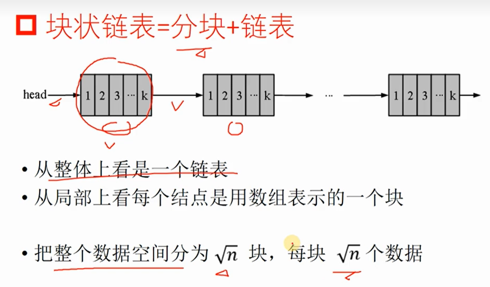
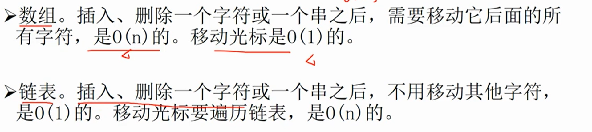

# 块状链表

分块思想应用：块状链表



效率对比



## 基本操作

### 第一种块状链表：

强制维护每个块的大小一定为 $\sqrt{n}$


查找和定位。it Find(int＆pos)，查找并返回文本的第pos个字符所在的块，并把pos更新为在这个块的位置。
分割一个块。Split(itx，int pos)，把第x个块在它的pos位置分割为两个块。
合并两个块。Merge(it x)，合并第x和第x+l个块。
维护。把每个块重新维护成长度$\sqrt{n}$。在插入和删除后进行维护，维护时用到分割和合并。


### 第二种块状链表：

仅维护每个块的大小$<\sqrt{2\times n}$，让每个块的大小保持在$\sqrt{n}$附近

**操作类型**

分裂、插入、查找。 

**什么是分裂？**

分裂就是分裂一个 node，变成两个小的 node，以保证每个 node 的大小都接近 $\sqrt{n}$（否则可能退化成普通数组）。当一个 node 的大小超过 $2\times \sqrt{n}$ 时执行分裂操作。

分裂操作怎么做呢？先新建一个节点，再把被分裂的节点的后 $\sqrt{n}$ 个值 copy 到新节点，然后把被分裂的节点的后 $\sqrt{n} $个值删掉（size--），最后把新节点插入到被分裂节点的后面即可。

**插入**

还有一个要说的。 随着元素的插入（或删除），$n$ 会变，$\sqrt{n}$ 也会变。这样块的大小就会变化，我们难道还要每次维护块的大小？

其实不然，把 $\sqrt{n} $ 设置为一个定值即可。比如题目给的范围是 $10^6$，那么 $\sqrt{n}$ 就设置为大小为 $10^3 $ 的常量，不用更改它。

**查找**

从前往后找每个块即可，直接访问块中存储的当前块的大小。

### **具体实现**

**存储**

我们考察结构体写法的普通链表

```C++
struct node {
    int pre, nxt;
    int v;
}a[N];
```

块状链表实际上和在普通链表里每个节点存一个值差不多，只不过是每个节点里存一个大小约为$\sqrt{n}$的数组

```C++
struct node {
    int sz, nxt;		//节点对应的数组长度,链表中下一个节点
    char s[MAXB*4];		//节点对应的数组实际值(以例题2为例:本题要求为字符)
}a[N];
```

**查询**

```C++
//返回原数组中下标为p的元素所在的块的编号，并将传入的引用(原数组下标)改为块内的下标。
int pos(int &p) {
    int x = 0;
    while(x != -1 && a[x].sz < p) {	//为方便下面的split操作，定义下标在[1,sz]内,但实际数组下标从0开始。
        p -= a[x].sz, x = a[x].nxt;		//一次跳整个节点
    }
    return x;
}

```

**插入（注意这里只是块之间的操作，是底层的，不是表层操作）**

```C++
//在编号为x的节点后插入一个编号为y,长度为len,对应数组为s的节点
void add(int x, int y, int len, char *s) {
    if(y != -1) {		//特判x指向-1(即链表的末尾)
        a[y].sz = len;		//对编号为y的节点赋值
        a[y].nxt = a[x].nxt;
        memcpy(a[y].s, s, len);		//memcpy的第三个参数是复制的字节数,所以这里的len本来应该乘上相应元素类型的size,但本题由于sizeof(char)=1，所以可以不乘。
    }
    a[x].nxt = y;		//x指向y
}

```

 （批注：代码中的y应该传入的是++idx）

**合并**

```C++
//把编号为x和y的两个节点合并
//我们选择把y暴力接在x的后面,然后把y删除
void merge(int x, int y) {
    memcpy(a[x].s+a[x].sz, a[y].s, a[y].sz);	//把y对应的数组接到x后面
    a[x].sz += a[y].sz, a[x].nxt = a[y].nxt;	//用y的信息更新x
    del(y);		//删除y
}

```

（批注：这里使用了memcpy的用法：以下代码可以一步将b插入到a的后面，当然你手写也行，只不过效率低下，更多请参考[网络流](https://flowus.cn/db56502e-9cbd-4978-a11c-91bfeee6b4b6)内有关memcpy的解说）

```C++
memcpy(a+len_a, b, len_b);//a,b为数组,len_a,len_b为变量，存的是a,b数组的大小
```

上述代码中的`del()`解说：

```C++
void del(int x) {       //回收节点
    pool[++tot] = x;
}
```

其中pool[]中存到是没有使用的节点。因为在删除中我们会删除某些节点，这些节点就会空出来。如果每次我们在插入时都把新的分块往后分配一个新的节点，那么前面就会有一些空余的节点被浪费了，所以我们所以pool[]来记录空余的节点（或者说是已回收可再次利用的节点）

**分裂**

```C++
//把第x个节点从pos位置分裂成两个节点(即前pos个和后sz-pos个分离)
void split(int x, int pos) {
    if(x == -1 || pos == a[x].sz) return;		//如果节点为空或者根本不需要分裂(分裂位置在块的末尾)
    int t = new_node();		//分裂后多出一个节点
    add(x, t, a[x].sz-pos, a[x].s+pos);		//把分离出来的后半部分接在原节点的后面
    a[x].sz = pos;		//把sz赋值为pos,相当于只保留了前半部分的元素,pos之后的元素还存在,只不过我们把它当成不存在(就像机械硬盘的删除数据的方式)
}

```

其中的`new_node()`操作

```C++
int new_node() {        //从pool中分配一个空余的节点，返回的是节点的下标
    return pool[tot--];
}
```

## 相关操作（视频内摘录）


插入


插入。Insert(int pos,const vector<char>& ch)，把字符串ch插入到文本的pos位置。分三步：查找、分割、维护。
- 在pos位置把第1块分割成两个块；
- 在第2块前插入ch，插入之后前2块的大小不再是$\sqrt{n} $，需要维护。


删除

图中文字是：删除.Delete（int L，int R），删除文本[L，R]区间的字符。
分4步：查找、分割、删除、维护。
- 把L所在的块从L处分割成2块
- 把R所在的块从R处分割成2块
- 把L和R中间的块删除，删除之后进行维护。


## 扩展：STL中的块状链表

[块状链表 - OI Wiki](https://oi-wiki.org/ds/block-list/#stl-中的-rope)

可以使用如下方法来引入：

```C++
#include <ext/rope>
using namespace __gnu_cxx;
```

`rope` 目前可以在 OI 中正常使用。

### 基本操作

|操作|作用|
|-|-|
|`rope <int > a`|初始化 `rope`（与 `vector` 等容器很相似）|
|`a.push_back(x)`|在 `a` 的末尾添加元素 `x`|
|`a.insert(pos, x)`|在 `a` 的 `pos` 个位置添加元素 `x`|
|`a.erase(pos, x)`|在 `a` 的 `pos` 个位置删除 `x` 个元素|
|`a.at(x)` 或 `a[x]`|访问 `a` 的第 `x` 个元素|
|`a.length()` 或 `a.size()`|获取 `a` 的大小|

## 例题 #1

[专题 | 南外20230715-树状数组&线段树&bitset](https://flowus.cn/6c5fad6f-d48d-4678-aa57-593a12c9281c)

见第H题


[算法竞赛4.6-块状链表_哔哩哔哩_bilibili](https://www.bilibili.com/video/BV1QM4y1C7H3/?spm_id_from=333.337.search-card.all.click)

## 例题 #2 [NOI2003] 文本编辑器

题目描述

很久很久以前，$DOS3.x$ 的程序员们开始对 $EDLIN$ 感到厌倦。于是，人们开始纷纷改用自己写的文本编辑器⋯⋯

多年之后，出于偶然的机会，小明找到了当时的一个编辑软件。进行了一些简单的测试后，小明惊奇地发现：那个软件每秒能够进行上万次编辑操作（当然，你不能手工进行这样的测试） ！于是，小明废寝忘食地想做一个同样的东西出来。你能帮助他吗？

为了明确目标，小明对“文本编辑器”做了一个抽象的定义:

文本：由 $0$ 个或多个 ASCII 码在闭区间 [$32$, $126$] 内的字符构成的序列。

光标：在一段文本中用于指示位置的标记，可以位于文本首部，文本尾部或文本的某两个字符之间。

文本编辑器：由一段文本和该文本中的一个光标组成的，支持如下操作的数据结构。如果这段文本为空，我们就说这个文本编辑器是空的。

|操作名称|输入文件中的格式|功能|
|-|-|-|
|$\text{Move}(k)$|Move k|将光标移动到第 $k$ 个字符之后，如果 $k=0$，将光标移到文本开头|
|$\text{Insert}(n,s)$|Insert n s|在光标处插入长度为 $n$ 的字符串 $s$，光标位置不变$n\geq1$|
|$\text{Delete}(n)$|Delete n|删除光标后的 $n$ 个字符，光标位置不变，$n \geq 1$|
|$\text{Get}(n)$|Get n|输出光标后的 $n$ 个字符，光标位置不变，$n \geq 1$|
|$\text{Prev}()$|Prev|光标前移一个字符|
|$\text{Next}()$|Next|光标后移一个字符|

你的任务是：

- 建立一个空的文本编辑器。

- 从输入文件中读入一些操作并执行。

- 对所有执行过的 `GET` 操作，将指定的内容写入输出文件。

输入格式

输入文件 `editor.in` 的第一行是指令条数 $t$，以下是需要执行的 $t$ 个操作。其中：

为了使输入文件便于阅读， `Insert` 操作的字符串中可能会插入一些回车符， 请忽略掉它们（如果难以理解这句话，可以参照样例） 。

除了回车符之外，输入文件的所有字符的 ASCII 码都在闭区间 [$32$, $126$] 内。且

行尾没有空格。

这里我们有如下假定：

- `MOVE` 操作不超过 $50000$ 个， `INSERT` 和 `DELETE` 操作的总个数不超过 $4000$，`PREV` 和 `NEXT` 操作的总个数不超过 $200000$。

- 所有 `INSERT` 插入的字符数之和不超过 $2M$（$1M=1024\times 1024$ 字节） ，正确的输出文件长度不超过 $3M$ 字节。

- `DELETE` 操作和 `GET` 操作执行时光标后必然有足够的字符。 `MOVE` 、 `PREV` 、 `NEXT` 操作必然不会试图把光标移动到非法位置。

- 输入文件没有错误。

对 C++ 选手的提示：经测试，最大的测试数据使用 `fstream` 进行输入有可能会比使用 `stdio` 慢约 $1$ 秒。

输出格式

输出文件 editor.out 的每行依次对应输入文件中每条 `Get` 指令的输出。

