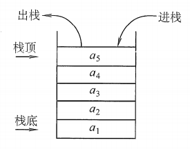

# 栈

## 栈的基本概念

栈（Stack）：是只允许在一端进行插入或删除的线性表。首先栈是一种线性表，但限定这种线性表只能在某一端进行插入和删除操作。



栈顶（Top）：线性表允许进行插入删除的那一端。

栈底（Bottom）：固定的，不允许进行插入和删除的另一端。

空栈：不含任何元素的空表。

栈又称为后进先出（Last In First Out）的线性表，简称LIFO结构

## 例题 #1 [CSP-S 2021] 回文

给定正整数 $n$ 和整数序列 $a_1, a_2, \ldots, a_{2 n}$，在这 $2 n$ 个数中，$1, 2, \ldots, n$ 分别各出现恰好 $2$ 次。现在进行 $2 n$ 次操作，目标是创建一个长度同样为 $2 n$ 的序列 $b_1, b_2, \ldots, b_{2 n}$，初始时 $b$ 为空序列，每次可以进行以下两种操作之一：

1. 将序列 $a$ 的开头元素加到 $b$ 的末尾，并从 $a$ 中移除。

2. 将序列 $a$ 的末尾元素加到 $b$ 的末尾，并从 $a$ 中移除。

我们的目的是让 $b$ 成为一个**回文数列**，即令其满足对所有 $1 \le i \le n$，有 $b_i = b_{2 n + 1 - i}$。请你判断该目的是否能达成，如果可以，请输出字典序最小的操作方案，具体在【**输出格式**】中说明。

### 思路

怎么样的情况是不合法的呢？

cabacb 这种情况很明显不合法吧

那么，找出与 $a_1$ 的唯一一个位置，记作 $p$。则序列被划分为两段，$a[2\cdots p-1]$ 和 $a[p+1\cdots2n]$。可以将这两段分别看成两个栈：栈 $T\_1$：$a[2\cdots p-1]$ 的栈顶为 $2$，栈底为 $p-1$；栈 $T\_2$：$a[p+1\cdots 2n]$ 的栈顶为 $2n$，栈底为 $p+1$。

则问题转化为每次可以取走这两个栈之一的栈顶，令最终得到的串是回文串。

自然，只有存在某个数 $x$，既在栈顶，又在栈底才能取走。否则无解。可以分类讨论一下：

-  如果数 $x$ 在栈 $T_1$ 的栈顶和栈 $T_2$ 的栈底，可以先取走 $T_1$ 栈顶，当栈取空后，再取空 $T_2$，这样的方案显然是合法的。

- 如果数 $x$ 在栈 $T_2$ 栈顶和栈 $T_1$ 的栈底，可以先取走 $T_2$ 栈顶，当 $T_2$ 被取空后，再取空 $T_1$，显然也是合法的。

这样就可以从两个栈中直接消除掉数 $x$ 的影响，归纳构造方案。由于要求字典序最小，所以可以每次优先取 $T\_1$ 的栈顶。如果过程中找不到可以取的栈顶，则无解。

```C++
/*////////ACACACACACACAC///////////
       . Code  by  Ntsc .
       . Earn knowledge .
/*////////ACACACACACACAC///////////

#include<bits/stdc++.h>
#define int long long
#define db double
#define rtn return
using namespace std;

const int N=2e6+5;
const int M=1e5;
const int Mod=1e5;
const int INF=1e5;

int n,m,p,q,T,ans;
int a[N],b,s,x,p1,p2;

char res[N];

bool work(int l1,int r1,int l2,int r2,int i){
	if(i==n)return 1;

	if(l1<=r1&&((l2<=r2&&a[l1]==a[l2])||(l1<r1&&a[l1]==a[r1]))){
		if(l1<r1&&a[l1]==a[r1]){
			res[i]='L'; res[2*(n-1)-i+1]='L';
			return work(l1+1,r1-1,l2,r2,i+1);
		}else{
			res[i]='L'; res[2*(n-1)-i+1]='R';
			return work(l1+1,r1,1+l2,r2,i+1);
		}
	}else if(l2<=r2&&((l1<=r1&&a[r2]==a[r1])||(l2<r2&&a[l2]==a[r2]))) {
        if(l2<r2&&a[l2]==a[r2]) {
            res[i]='R'; res[2*(n-1)-i+1]='R';
            return work(l1,r1,l2+1,r2-1,i+1);
        }
        else {
            res[i]='R'; res[2*(n-1)-i+1]='L';
			return work(l1,r1-1,l2,r2-1,i+1);
        }
    }
	else return 0;

}
signed main(){
	cin>>T;
	while(T--){
		
		for(int i=0;i<=n*2;i++)res[i]=0;
		cin>>n;
//		n<<=1;
		for(int i=1;i<=n*2;i++){
			cin>>a[i];
		}
		for(int i=1;i<=n<<1;i++){
			if(i==1)continue;
			if(a[i]==a[1]){
				p1=i;break;
			}
		}
		
		for(int i=1;i<=n<<1;i++){
			if(i==n<<1)continue;
			if(a[i]==a[n<<1]){
				p2=i;break;
			}
		}
		
		if(work(2,p1-1,p1+1,2*n,1))printf("L%sL\n",res+1);
		else if(work(1,p2-1,p2+1,2*n-1,1))printf("R%sL\n",res+1);
		else cout<<-1<<endl;
		
		
	}
}

```

