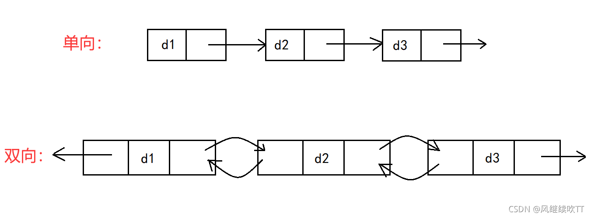

链表通过指针指示当前元素的上一个/下一个元素的位置，不支持随机访问，但在当前指针位置插入/删除一个元素的复杂度是O(1)的。

链表分为单向链表和双向链表，区别在于一个元素是否具有pre指针和nxt指针中的几个。




## 例题 #1 移动盒子

#### 题目描述

你有n个盒子在桌子上的一条线上从左到右编号为1……n。你的任务是模拟四种操作

1 X Y 移动盒子编号X到盒子编号Y的左边（如果X已经在Y的左边了就忽略）

2 X Y 移动盒子编号X到盒子编号Y的右边（如果X已经在Y的右边了就忽略）

3 X Y 交换盒子编号X与盒子编号Y的位置

4 将整条线反转

操作保证合法，X不等于Y

举一个例子，如果n=6，操作 1 1 4然后就变成了2 3 1 4 5 6；再操作 2 3 5就变成了 2 1 4 5 3 6；再操作 3 1 6 就变成 2 6 4 5 3 1；最后操作4，就变成了 1 3 5 4 6 2

#### 输入格式

包含两个整数n,m（1≤n,m<100,000）, 接下来是m行数据，表示操作。

#### 输出格式

输出他们奇数位置的编号的和

#### 样例

### 输入

```C++
6 4
1 1 4
2 3 5
3 1 6
4


6 3
1 1 4
2 3 5
3 1 6


100000 1
4
```

### 输出

```C++
12
9
2500050000
```

#### 数据范围与提示

50%的数据，n,m≤1000

100%的数据，n,m≤100000

---

链表

·

```C++
/*                                                                                
                      Keyblinds Guide
     				###################
      @Ntsc 2024

      - Ctrl+Alt+G then P : Enter luogu problem details
      - Ctrl+Alt+B : Run all cases in CPH
      - ctrl+D : choose this and dump to the next
      - ctrl+Shift+L : choose all like this
      - ctrl+K then ctrl+W: close all
      - Alt+la/ra : move mouse to pre/nxt pos'
	  
*/
#include <bits/stdc++.h>
#include <queue>
using namespace std;

#define rep(i, l, r) for (int i = l, END##i = r; i <= END##i; ++i)
#define per(i, r, l) for (int i = r, END##i = l; i >= END##i; --i)
#define pb push_back
#define mp make_pair
#define int long long
#define pii pair<int, int>
#define ps second
#define pf first

// #define innt int
// #define inr int
// #define mian main
// #define iont int

#define rd read()
int read(){
    int xx = 0, ff = 1;
    char ch = getchar();
    while (ch < '0' || ch > '9') {
		if (ch == '-')
			ff = -1;
		ch = getchar();
    }
    while (ch >= '0' && ch <= '9')
      xx = xx * 10 + (ch - '0'), ch = getchar();
    return xx * ff;
}
void write(int out) {
	if (out < 0)
		putchar('-'), out = -out;
	if (out > 9)
		write(out / 10);
	putchar(out % 10 + '0');
}

#define ell dbg('\n')
const char el='\n';
const bool enable_dbg = 1;
template <typename T,typename... Args>
void dbg(T s,Args... args) {
	if constexpr (enable_dbg){
    cerr << s;
    if(1)cerr<<' ';
		if constexpr (sizeof...(Args))
			dbg(args...);
	}
}

#define zerol = 1
#ifdef zerol
#define cdbg(x...) do { cerr << #x << " -> "; err(x); } while (0)
void err() { cerr << endl; }
template<template<typename...> class T, typename t, typename... A>
void err(T<t> a, A... x) { for (auto v: a) cerr << v << ' '; err(x...); }
template<typename T, typename... A>
void err(T a, A... x) { cerr << a << ' '; err(x...); }
#else
#define dbg(...)
#endif


const int N = 3e5 + 5;
const int INF = 1e18;
const int M = 1e7;
const int MOD = 1e9 + 7;

int nxt[N],pre[N];


// 链表

void solve(){
    int n=rd,m=rd;
    for(int i=1;i<=n;i++){
        pre[i]=i-1;
        nxt[i]=i+1;
    }

    int flg=0;
    int h=1,t=n;
    for(int i=1;i<=m;i++){
        // cdbg(i,h,t);
        int op=rd;
        if((op==1||op==2)&&flg){
            op=(op==1)?2:1;
        }
        if(op==1){
            int x=rd,y=rd; 
            if(pre[y]==x)continue;
            if(h==x)h=nxt[x];
            if(t==x)t=pre[x];
            if(h==y)h=x;
            // del
            nxt[pre[x]]=nxt[x];
            pre[nxt[x]]=pre[x];
            // add
            pre[x]=pre[y];
            nxt[pre[y]]=x;
            nxt[x]=y;
            pre[y]=x;
        }if(op==2){
            int x=rd,y=rd;
            if(nxt[y]==x)continue;
            if(h==x)h=nxt[x];
            if(t==x)t=pre[x];
            if(t==y)t=x;
            // del
            nxt[pre[x]]=nxt[x];
            pre[nxt[x]]=pre[x];
            // add
            pre[x]=y;
            pre[nxt[y]]=x;
            nxt[x]=nxt[y];
            nxt[y]=x;

        }if(op==3){
            int x=rd,y=rd;
            if(x==h)h=y;
            if(x==t)t=y;
            if(y==h)h=x;
            if(y==t)t=x;

            nxt[pre[x]]=y;
            pre[nxt[x]]=y;

            nxt[pre[y]]=x;
            pre[nxt[y]]=x;

            swap(pre[x],pre[y]);
            swap(nxt[x],nxt[y]);


        }if(op==4){
            // swap(h,t);
            flg^=1;
        }
    }
    int ans=0;

    // cdbg(h,t);

    if(flg){
        int cur=t;
        for(int i=1;i<=n;i++){
            // cdbg(cur);
            if(i&1){
                ans+=cur;
            }
            cur=pre[cur];
        }
    }else{
        int cur=h;
        for(int i=1;i<=n;i++){
        // cdbg(cur);
            if(i&1){
                ans+=cur;
            }
            cur=nxt[cur];
        }
    }


    cout<<ans<<endl;
}

signed main() {
    // freopen(".in","r",stdin);
    // freopen(".in","w",stdout);

    int T=1;
    while(T--){
    	solve();
    }
    return 0;
}
```

