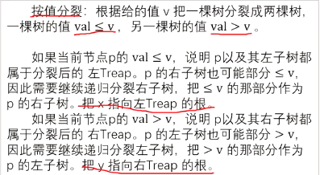

# FHQ Treap

[163 普通平衡树 FHQ Treap_哔哩哔哩_bilibili](https://www.bilibili.com/video/BV1kY4y1j7LC/?spm_id_from=333.337.search-card.all.click&vd_source=f45ea4e1e4b3b73d5f07c57b46c43aba)


## 重要操作 split



```C++
//分裂 根据v将树划分为2个子树 
void split(int i,int v,int &x,int &y){//i当前节点，v划分数值， 返回时x会指向左treap的根，y指向右treap的根
 	if(!i){//到达树叶 
 		x=y=0;return ;
	 }
	 if(tr[i].val<=v){//如果这个点的val<=v,那么它的左子树一定都<=v,但是右子树的root虽然>v,但我们不知道它的儿子们是否都>v,所以需要递归右子树 
	 	x=i;
	 	split(tr[i].r,v,tr[i].r,y);//递归实现 
	 }else{
	 	y=i;
	 	split(tr[i].l,v,x,tr[i].l);
	 }
	pushup(i);
}
```

## 重要操作 merge


```C++
//合并 分裂的逆过程.递归缝合2个分裂的treap 
int merge(int x,int y){// x,y分别是左右treap的根 
	if(!x||!y){
		return x+y;
	} 
	if(tr[x].key<=tr[y].key){//如果x的key<=y的key,那么y就作为x的子树,且是右子树,递归合并x原来的右子树和y
		tr[x].r=merge(tr[x].r,y);
		pushup(x);return x;
	}else{
		tr[y].l=merge(x,tr[y].l);
		pushup(y);return y;
	}
}
```


## 其他操作

### 插入

```C++
int addnode(int v){
	tr[++idx].val=v;
	tr[idx].key=rand();
	tr[idx].size=1;
	return idx;//返回这个点在数组里的序号 
} 
```

注意！上方代码仅仅是加点，没有插入！

```C++
void insert(int v){
	int x,y,z;
	split(root,v,x,y);
	z=addnode(v);
	root=merge(merge(x,z),y);//相当于z是一个1个节点的树,把它先和x合并(因为x的val均<=v,保证了它的大小顺序,至于它会被放在x的根或者其他地方,凭借key来确定),再和y合并 
}
```

插入

### 查询

```C++
int getk(int i,int k){//获取中序排序第k个值的编号 
	if(k<=tr[tr[i].l].size)return getk(tr[i].l,k);//说明要找到点在左子树,那么去左子树找第k个 
	if(k==tr[tr[i].l].size/找到了 
	return getk(tr[i].r,k-tr[tr[i].l].size-1);//否则 说明要找到点在右子树,那么去左子树找第(k-size左子树)个(左子树已经有size个了,那么要找整个的第k个,只要找右子树的第(k-size左子树)个即可) 
}
```

上方代码为插入代码的base

```C++
int getval(int k){//查询排名为k的节点的值
	int p=getk(root,k);
	return tr[p].val;
}
```

查询排名为k的节点的值

```C++
void getpre(int v){//找到v的前驱 (即<v的最大的那个点)
	int x,y;//x,y只是暂时存放一下劈开的2个子树的根,后面还要合并 
	split(root,v-1,x,y);//劈开,变成<v(x)和>=v(y) 2个树 
	int p=getk(x,tr[x].size);//在子树x里面找到最后一个就是 <v(x)的最大的那个点
	cout<<tr[p].val<<endl;
	root=merge(x,y);//别忘了合并 
}	
```

找到v的前驱

```C++
void getsuc(int v){//找到v的后驱 (即>v的最小的那个点)
	int x,y;
	split(root,v,x,y);//劈开,变成<=v(x)和>v(y) 2个树 
	int p=getk(y,1);//在子树y里面找到第一个就是 >v(x)的最小的那个点
	cout<<tr[p].val<<endl;//cout<<"OK";
	root=merge(x,y);//别忘了合并 
}	
```

找到v的后驱

```C++
void getrank(int v){//查询val=v的点的排名(从小到大) 如果有重复的val=v的节点只计第一个,排序不去重 
	int x,y;
	split(root,v-1,x,y);//劈开,变成<v(x)和>=v(y) 2个树 
	cout<<tr[x].size/子树x的大小就是val=v的点前面有几个点 
	root=merge(x,y);
}
```

查询val=v的点的排名(从小到大)

### 删除

```C++
void del(int v){
	int x,y,z;//将来会分别指向3棵树,他们的节点val分别是<v,=v,>v 
	split(root,v,x,z);//此时分成了2棵树,x指向的树是<=v的,y则是>v的 
	split(x,v-1,x,y);//再把x分成2棵树,把<v(x)的和=v(y)的拎出来 
	y=merge(tr[y].l,tr[y].r);//把y变成y的左右子树合并,相当于把根抛弃了 
	root=merge(merge(x,y),z);//重新合并  
} 
```

## 例题 #2【模板】普通平衡树

题目描述

您需要写一种数据结构（可参考题目标题），来维护一些数，其中需要提供以下操作：

1. 插入 $x$ 数

2. 删除 $x$ 数(若有多个相同的数，应只删除一个)

3. 查询 $x$ 数的排名(排名定义为比当前数小的数的个数 $+1$ )

4. 查询排名为 $x$ 的数

5. 求 $x$ 的前驱(前驱定义为小于 $x$，且最大的数)

6. 求 $x$ 的后继(后继定义为大于 $x$，且最小的数)

输入格式

第一行为 $n$，表示操作的个数,下面 $n$ 行每行有两个数 $\text{opt}$ 和 $x$，$\text{opt}$ 表示操作的序号( $1 \leq \text{opt} \leq 6$ )

输出格式

对于操作 $3,4,5,6$ 每行输出一个数，表示对应答案

【数据范围】
对于 $100\%$ 的数据，$1\le n \le 10^5$，$|x| \le 10^7$

### 完整代码&注释


    - 注意没有`return`的函数一定要写`void`类型

```C++
/*////////ACACACACACACAC///////////
Code By Ntsc
/*////////ACACACACACACAC///////////
#include<bits/stdc++.h>
using namespace std;
#define ll long long
const int N=1e5+5;

struct node{
	int l,r,val,key,size;
}tr[N];
int n,root,idx;  //root记录根的编号 ，idx是对新的节点进行编号的变量 

int addnode(int v){
	tr[++idx].val=v;
	tr[idx].key=rand();
	tr[idx].size=1;
	return idx;//返回这个点在数组里的序号 
} 
void pushup(int i){//向上更新子树大小 
	tr[i].size=tr[tr[i].l].size+tr[tr[i].r].size+1; 
}
//分裂 根据v将树划分为2个子树 
void split(int i,int v,int &x,int &y){//i当前节点，v划分数值， 返回时x会指向左treap的根，y指向右treap的根
 	if(!i){//到达树叶 
 		x=y=0;return ;
	 }
	 if(tr[i].val<=v){//如果这个点的val<=v,那么它的左子树一定都<=v,但是右子树的root虽然>v,但我们不知道它的儿子们是否都>v,所以需要递归右子树 
	 	x=i;
	 	split(tr[i].r,v,tr[i].r,y);//递归实现 
	 }else{
	 	y=i;
	 	split(tr[i].l,v,x,tr[i].l);
	 }
	pushup(i);
}
//合并 分裂的逆过程.递归缝合2个分裂的treap 
int merge(int x,int y){// x,y分别是左右treap的根 
	if(!x||!y){
		return x+y;
	} 
	if(tr[x].key<=tr[y].key){//如果x的key<=y的key,那么y就作为x的子树,且是右子树,递归合并x原来的右子树和y
		tr[x].r=merge(tr[x].r,y);
		pushup(x);return x;
	}else{
		tr[y].l=merge(x,tr[y].l);
		pushup(y);return y;
	}
}
void insert(int v){
	int x,y,z;
	split(root,v,x,y);
	z=addnode(v);
	root=merge(merge(x,z),y);//相当于z是一个1个节点的树,把它先和x合并(因为x的val均<=v,保证了它的大小顺序,至于它会被放在x的根或者其他地方,凭借key来确定),再和y合并 
}
void del(int v){
	int x,y,z;//将来会分别指向3棵树,他们的节点val分别是<v,=v,>v 
	split(root,v,x,z);//此时分成了2棵树,x指向的树是<=v的,y则是>v的 
	split(x,v-1,x,y);//再把x分成2棵树,把<v(x)的和=v(y)的拎出来 
	y=merge(tr[y].l,tr[y].r);//把y变成y的左右子树合并,相当于把根抛弃了 
	root=merge(merge(x,y),z);//重新合并  
} 
int getk(int i,int k){//获取中序排序第k个值的编号 
	if(k<=tr[tr[i].l].size)return getk(tr[i].l,k);//说明要找到点在左子树,那么去左子树找第k个 
	if(k==tr[tr[i].l].size/找到了 
	return getk(tr[i].r,k-tr[tr[i].l].size-1);//否则 说明要找到点在右子树,那么去左子树找第(k-size左子树)个(左子树已经有size个了,那么要找整个的第k个,只要找右子树的第(k-size左子树)个即可) 
} 
int getpre(int v){//找到v的前驱 (即<v的最大的那个点)
	int x,y;//x,y只是暂时存放一下劈开的2个子树的根,后面还要合并 
	split(root,v-1,x,y);//劈开,变成<v(x)和>=v(y) 2个树 
	int p=getk(x,tr[x].size);//在子树x里面找到最后一个就是 <v(x)的最大的那个点
	cout<<tr[p].val<<endl;
	root=merge(x,y);//别忘了合并 
}	
int getsuc(int v){//找到v的后驱 (即>v的最小的那个点)
	int x,y;
	split(root,v,x,y);//劈开,变成<=v(x)和>v(y) 2个树 
	int p=getk(y,1);//在子树y里面找到第一个就是 >v(x)的最小的那个点
	cout<<tr[p].val<<endl;//cout<<"OK";
	root=merge(x,y);//别忘了合并 
}	
void getrank(int v){//查询val=v的点的排名(从小到大) 如果有重复的val=v的节点只计第一个,排序不去重 
	int x,y;
	split(root,v-1,x,y);//劈开,变成<v(x)和>=v(y) 2个树 
	cout<<tr[x].size/子树x的大小就是val=v的点前面有几个点 
	root=merge(x,y);
}
void getval(int k){//查询排名为k的节点的值
	int p=getk(root,k);
	cout<<tr[p].val<<endl;
	
}


signed main(){
	cin>>n;
	for(int i=1;i<=n;i++){
		int opt,x;
		cin>>opt>>x;
		if(opt==1){
			insert(x);
		}if(opt==2){
			del(x);
		}if(opt==3){
			getrank(x);
		}if(opt==4){
			getval(x);
		}if(opt==5){
			getpre(x);
		}if(opt==6){
			getsuc(x);
		}
	}
	return 0;
}

```

