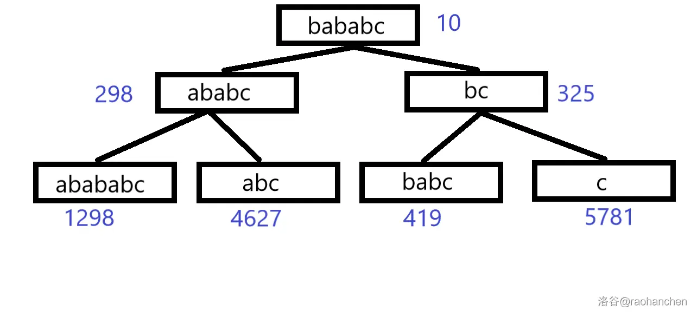

# 后缀平衡树

## 题目

"后缀平衡树"这个名字正确性存疑，由于 clj 给的"重量平衡树"定义有歧义。

给你一个字符串 `init`，要求你支持三个操作：

1. 在当前字符串的后面插入若干个字符。

2. 在当前字符串的后面删除若干个字符。

3. 询问字符串 $s$ 在当前字符串中出现了几次（作为连续子串）？

你必须在线支持这些操作。

数据字符串变化长度以及初始长度和 $ \le 8 \times 10^5$，询问次数 $\le 10^5$，询问总长度 $\le 3 \times 10^6$。

字符集为大写字母，注意 `ADD` 和 `QUERY` 操作的字符串都需要解压。

## 后缀平衡树

> 这个知识点不看题解不太容易想到做法，但是实际上很容易理解。

平衡树制作的一件事是比较树上节点的值的大小。那么后缀平衡树就是把树上的节点替换为文本串的所有后缀来比较。

如 abababc

操作还是和平衡树一样，它可以维护的是对文本串的**前面**增减字符，在线查询子串个数的问题。

