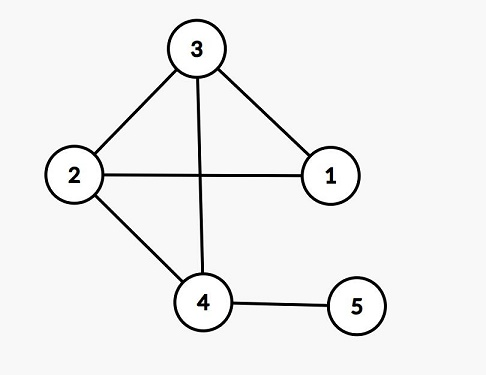

# [JRKSJ R8] +1-1

题目描述

给你 $n$ 个点 $m$ 条边的无向图，每个结点上有一个字符 `(` 或者 `)`。

有 $q$ 次查询，每次查询给出 $x,y$，你需要判断是否存在一条从 $x$ 到 $y$ 的路径（不需要保证是简单路径）满足将路径上的点上的字符顺次写下来得到的字符串是合法括号串。

输入格式

第一行三个整数 $n,m,q$。

第二行一个只包含 `(` 和 `)` 的长度为 $n$ 的字符串表示结点 $1\dots n$ 上的字符。

下面 $m$ 行，每行两个整数 $u,v$ 表示图上的一条边。

下面 $q$ 行，每行两个整数 $x,y$。

输出格式

一个长度为 $q$ 的 01 串，第 $i$ 个字符表示第 $i$ 次询问的答案，1 表示存在这样的路径，0 表示不存在这样的路径。

- 若 $A$ 是合法括号串，则 $(A)$ 是合法括号串

- 除此之外的其他字符串均不是合法括号串

如 `()`、`(()())` 是合法括号串，`(()`、`())(` 不是合法括号串。

### 样例解释

**为了方便观察，输入的边和询问之间有一个换行。但数据中并不存在这个换行。**



其中 $1,2,3$ 号点的字符是 `(`，$4,5$ 号点的字符是 `)`。

$1\to 2$：显然，合法括号串不可能以 `(` 结尾。
$3\to 4$：路径 $3\to 4$ 表示的字符串是 `()`。
$1\to 4$：路径 $1\to 3\to 2\to 4\to 5\to 4$ 表示的字符串是 `((()))`。
$1\to 5$：路径 $1\to 2\to 4\to 5$ 表示的字符串是 `(())`。
$2\to 5$：路径 $2\to 3\to 4\to 5$ 表示的字符串是 `(())`。

### 数据规模与约定

本题采用捆绑测试。

- Subtask 1（20 pts）：$n,q\leq 500$，$m \leq 800$；

- Subtask 2（30 pts）：图是森林；

- Subtask 3（20 pts）：$q\le 10$；

- Subtask 4（30 pts）：无特殊限制。

对于所有数据，满足 $1\le n,q\le 5\times 10^5$，$0\le m\le \min(\frac{n\times(n-1)}{2},5\times 10^5)$，$1\le u,v,x,y\le n$，保证给出的图无重边、无自环。

---

发现只要哟一条边两端的括号相同，那么就可以无限循环。我们称这种边为括号边，分为(括号边和)括号边。

先不考虑存在括号边的情况，那么自然就是()()..的序列了。假设答案路径不存在括号边，那么怎么做呢？

我们只需要对每一条()或者)(的两端点并入同一个集合D，最后查询询问的a,b是否在同一个集合内即可。这里的一个集合是除去了括号边后的图的联通块。

那么存在括号边呢？发现只要我们可以从a安全地到一条(括号边A，从这条边可以到一条)括号边B，并且从这一条)括号边可以安全地到b即可。安全指的是不经过其它括号边。我们发现只要a所属的集合D中有(括号边的一个节点，那么就可以满足第一个条件。第三个类似。第二个呢？


要判定A,B联通，只要判定a,b是否联通即可。注意这里的联通是在原图上的联通。


还有一个强条件，就是路径长度（边）为奇数。将一个点拆为奇数点和偶数点，看起点（奇数）是否可达终点（偶数）即可。

```C++
// Problem: P10572 [JRKSJ R8] +1-1
// Contest: Luogu
// URL: https://www.luogu.com.cn/problem/P10572
// Memory Limit: 512 MB
// Time Limit: 1000 ms
// Challenger: Erica N
// ----
#include<bits/stdc++.h>

using namespace std;
#define rd read()
#define ull unsigned long long
// #define int long long 
#define itn int
#define ps second 
#define pf first


#define rd read()
int read()
{
  int xx = 0, ff = 1;
  char ch = getchar();
  while (ch < '0' || ch > '9')
  {
    if (ch == '-')
      ff = -1;
    ch = getchar();
  }
  while (ch >= '0' && ch <= '9')
    xx = xx * 10 + (ch - '0'), ch = getchar();
  return xx * ff;
}
#define zerol = 1
#ifdef zerol
#define cdbg(x...) do { cerr << #x << " -> "; err(x); } while (0)
void err() {
	cerr << endl;
}
template<template<typename...> class T, typename t, typename... A>
void err(T<t> a, A... x) {
	for (auto v: a) cerr << v << ' ';
	err(x...);
}
template<typename T, typename... A>
void err(T a, A... x) {
	cerr << a << ' ';
	err(x...);
}
#else
#define dbg(...)
#endif
const int N=1e6+5;
const ull P=137;
const int INF=1e9+7;
/*

策略


*/
int fa[N],pa[N];

int find(int x){
	if(fa[x]==x)return x;
	return fa[x]=find(fa[x]);
}

int pind(int x){
	if(pa[x]==x)return x;
	return pa[x]=pind(pa[x]);
}


vector<int> e[N];
bool spe[N],c[N],d[N];
string s;

void add(int a,itn b){
	e[a].push_back(b);
	if(s[a]==s[b])spe[a]=spe[b]=1;
	else fa[find(a)]=find(b); //()()..联通块
	
	pa[pind(a)]=pind(b); //边联通块
}

signed main(){
	int n=rd,m=rd,q=rd;
	
	cin>>s;
	s=" "+s+s;
	for(int i=1;i<=n*2;i++){
		pa[i]=fa[i]=i;
	}
	
	
	for(int i=1;i<=m;i++){
		int a=rd,b=rd;
		add(a,b+n); //奇偶点。因为要求路径长度为奇数
		add(a+n,b);
		add(b+n,a);
		add(b,a+n);
	}
	
	
	for(int i=1;i<=n*2;i++){
		int faa=find(i);
		for(auto v:e[i]){
			c[faa]|=(s[v]=='('&&spe[v]);
			d[faa]|=(s[v]==')'&&spe[v]);
		}
	}
	
	
	
	while(q--){
		int a=rd,b=rd;
		if(s[a]==')'||s[b]=='('){
			putchar('0');
		}else if(pind(a)!=pind(b+n)){
			putchar('0');
		}else if(c[find(a)]&&d[find(b+n)]){
			putchar('1');
		}else if(find(a)==find(b+n)){
			putchar('1');
		}else putchar('0');
	}
}


```

# tree and path

给定一个带权的 n 个节点的树和 q 次询问，每次询问一个整数 d，求树上有多少路径满足所有边都被 d 整除。

对于 100% 的数据 1≤n,q≤105,1≤w,d≤105​

---

发现一条边的边权最多\sqrt w个因数。因此考虑维护集合g，g_i中的边满足其边权被i整除。

对于询问d，我们按g_i中的边作为合并并查集的纽带，最后从并查集中得到答案。并查集维护的是一个联通块，满足边权都可以被d整除。一个大小为sz的联通块，可以产生sz\times (sz-1)\div 2的合法路径。

