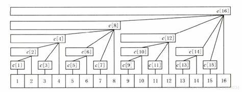

[https://blog.csdn.net/weixin_43914593/article/details/107842628](https://blog.csdn.net/weixin_43914593/article/details/107842628)

[https://ntsc-yrx.github.io/2022/07/09/CPP%E8%BF%9B%E9%98%B6-%E6%A0%91%E7%8A%B6%E6%95%B0%E7%BB%84/](https://ntsc-yrx.github.io/2022/07/09/CPP%E8%BF%9B%E9%98%B6-%E6%A0%91%E7%8A%B6%E6%95%B0%E7%BB%84/)

# 树状数组

树状数组（Binary Indexed Tree，BIT，也称为Fenwick Tree）是一种用于高效处理累计和查询和更新的数据结构。它可以在对数时间内完成单点更新和前缀和查询操作。以下是树状数组的实现原理：

### 基本概念

- **前缀和**：数组的前缀和是指从数组的第一个元素到第i个元素的总和。

- **单点更新**：改变数组中某个元素的值。

- **树状数组**：通过一个数组来模拟树形结构，实现对数时间的更新和查询操作。

### 树状数组的构建

树状数组通常用一个一维数组`tree`来表示，其中`tree[i]`存储了一部分原数组的元素和。

#### 初始化

初始化时，所有的`tree[i]`都设为0。

```C++
vector<int> tree(n + 1, 0);
```

#### Lowbit函数

树状数组中一个重要的概念是`lowbit`，它用于找到当前节点直接管辖的区间。

```C++
int lowbit(int x) {
    return x & (-x);
}
```

`lowbit`函数返回`x`在二进制表示下最低位的1所对应的值。

### 更新操作

更新操作用于改变原数组中某个元素的值，并更新树状数组。

1. 首先计算该元素的`lowbit`，找到需要更新的直接子节点。

2. 然后沿着树向上更新所有相关的节点。

    以下是更新操作的伪代码：

```C++
void update(int i, int delta) {
    while (i <= n) {
        tree[i] += delta;
        i += lowbit(i);
    }
}
```

### 查询操作

查询操作用于计算原数组的前缀和。

1. 从给定的索引开始，计算所有包含该索引的父节点的和。

2. 每次查询时，通过`lowbit`找到下一个需要查询的父节点。
以下是查询操作的伪代码：

```C++
int query(int i) {
    int sum = 0;
    while (i > 0) {
        sum += tree[i];
        i -= lowbit(i);
    }
    return sum;
}
```

### 完整示例

假设原数组为`arr = [0, 1, 2, 3, 4, 5, 6, 7]`，以下是构建树状数组并进行更新和查询的示例：

#### 初始化

```C++
tree = [0, 0, 0, 0, 0, 0, 0, 0, 0]
```

#### 更新操作

更新`arr[3]`增加2，即`arr[3] = 3 + 2 = 5`。

```C++
update(3, 2)  // tree变为[0, 0, 0, 1, 1, 1, 2, 2, 2]
```

#### 查询操作

查询前缀和，即`arr[1] + arr[2] + arr[3]`。

```C++
query(3)  // 返回 1 + 2 + 5 = 8
```

### 总结

树状数组通过使用一个一维数组来模拟树形结构，使得单点更新和前缀和查询都可以在对数时间内完成。它的优点是代码实现简单，空间复杂度低，适用于频繁的更新和查询操作。树状数组不支持区间更新操作，但可以通过一些技巧来扩展这一功能。

再次强调，树状数组的change是**单点加**！！

## 例题 #1

如题，已知一个数列，你需要进行下面两种操作：

- 将某一个数加上 $x$

- 求出某区间每一个数的和

对于 $30\%$ 的数据，$1 \le n \le 8$，$1\le m \le 10$；
对于 $70\%$ 的数据，$1\le n,m \le 10^4$；
对于 $100\%$ 的数据，$1\le n,m \le 5\times 10^5$。

## 讲解

### 实现方法



### 关键函数 `lowbit(x)`

```C++
lowbit(x){return x&-x}
```

**作用：** 返回最后一位1的位置

**e.g.** 对`(11010)2`执行`lowbit`返回值为`(10)2`.
`x-lowbit(x)`操作可快速消去最后一位1

### `change(x,v)`

在树状数组意义下对x位置进行单点加v。

### `query(x)`

返回[1,x]的权值和。

### 应用

维护区间加，单点修改

这时我们应该使用change来维护差分数组并且使用query快速求出前缀和。

不可使用change来区间加而query(x)-query(x-1)，因为它根本没这功能！！

### 代码

```C++
#include<bits/stdc++.h>
using namespace std;


const int N=5e5+5;
//typedef long long ll;
int n,m,x,y;
int c[N];
int a;


int lowbit(int x) {
	return x&-x;
}


void add(int i,int x) {//在位置i加上x
	while(i<=N) {
		c[i]+=x;
		i+=lowbit(i);
	}
}


int sum(int x) {
	int res=0;
	while(x) {
		res+=c[x];
		x-=lowbit(x);
	}
	return res;
}
int main() {
	cin>>n>>m;
	for(int i=1; i<=n; i++){
		cin>>a;
		add(i,a);
	}
		//scanf("%d",&a[i]);
	while(m--) {
		int op;
		scanf("%d%d%d",&op,&x,&y);
		if(op==2)
			printf("%d\n",sum(y)-sum(x-1));	//sum(i)求的是a[i]~a[1]的和！！
		else {
			add(x,y);
		}
	}
	return 0;
}
```

