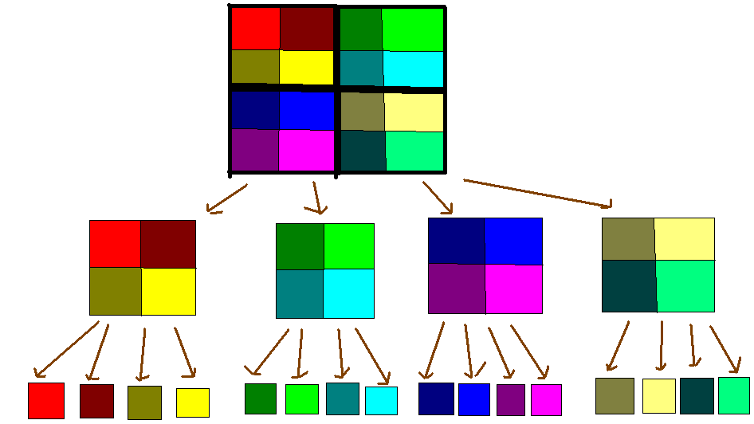

摘抄[学习笔记 | 二维线段树&树状数组](https://flowus.cn/e2ee7577-b0cf-49bc-91f2-0f497a91e5c4)

---

[01线段树](https://flowus.cn/e6bba820-32e4-4b67-900b-728465fbe751)

# 二维信息维护

## 二维线段树

这是一个维护多维度学习的数据结构。如果没有轻质在线的要求，那么我们可以使用CDQ分治来代替。或者外面也可以使用K-D树来维护。

二维线段树——我们在主线段树的每一个节点上都建立一个子线段树。我们考虑下面的问题

给定一个 n×m 的矩阵，初始时元素均为 0，你需要维护一下操作：

    1. `1 x y k`，将矩阵中 (x,y) 位置的元素加上 k。

    2. `2 x1 y1 x2 y2`，查询左上角为 (x1,y1)，右下角为 (x2,y2) 的矩阵中的元素和。

那么如果使用二维线段树——第一维维护行，第二维维护列，对于修改操作，我们找到对应行的节点，然后在其子线段树上找到对应列即可。对应查询，我们挑选出可以拼凑出询问行的节点，然后在这些节点中分别查询对应列的和信息。时间复杂度$O(n\log^2 n)$

如果是区间修改，我们则需要维护些许tag了。在主线段树中每次下传标记时，都要对某个子线段树进行修改。这种修改会修改子线段树中的所有点，因此时间复杂度最差为$O(n\log n)$无法接受。所以我们考虑**标记永久化**。

大概来说，就是标记不下传，不删除。我们在查询时，遇到了一个标记就直接修改$res$的值。但是标记永久化会有很多限制，局限性很大，不推荐使用。

## 二维树状数组

树状数组本是用来单点修改，区间求和的。这里我们让它支持区间修改，区间查询。

- `L a b c d delta` —— 代表将 $(a,b),(c,d)$ 为顶点的矩形区域内的所有数字加上 $delta$。

- `k a b c d`     —— 代表求 $(a,b),(c,d)$ 为顶点的矩形区域内所有数字的和。

### 一维树状数组的区间修改&区间查询

首先我们考虑树状数组怎样实现一维的区间修改和区间查询。对应一维的区间修改，因为树状数组本身只支持单点修改但是会自动维护前缀和，所以我们的区间修改就使用差分的形式。

如果我们要把[l,r]都+k，那么我们修改树状数组$c_l$加上$k,c_{r+1}$减去k。此时树状数组上正是原数组。

那么现在如果我们要求[l,r]之和，那么我们可以把$query(l)\sim query(r)$都加起来。

位置p的值$=\sum_{j = 1}^{p} c[j]$

位置p的前缀和 $\sum_{i = 1}^{p} a[i] = \sum_{i = 1}^{p} \sum_{j = 1}^{i} c[j] $

在等式最右侧的式子$(\sum_{i = 1}^{p} \sum_{j = 1}^{i} c[j])$中，($c[1]$) 被用了($p$)次，($c[2]$)被用了(p - 1)次……那么我们可以写出：

位置p的前缀和 =

$\sum_{i = 1}^{p} \sum_{j = 1}^{i} d[j] = \sum_{i = 1}^{p} d[i] * (p - i + 1) = (p + 1) \times \sum_{i = 1}^{p}c[i] - \sum_{i = 1}^{p}c[i]\times i $

那么我们可以维护两个数组的前缀和：
一个数组是 ($sum1[i] = c[i]$)，
另一个数组是 ($sum2[i] = c[i] \times i$)。

**查询**

位置p的前缀和即： (p + 1) * sum1数组中p的前缀和 - sum2数组中p的前缀和。

区间[l, r]的和即：位置r的前缀和 - 位置l的前缀和。

**修改**

对于sum1数组的修改同问题2中对d数组的修改。

对于sum2数组的修改也类似，我们给 sum2[l] 加上 l * x，给 sum2[r + 1] 减去 (r + 1) * x。

### 扩展到二维情况

在一维树状数组中，我们用`c[x]`记录右端点为x，长度为`lowbit(x)`的区间的区间和。我们同样可以类似地定义`c[x][y]`为右下端点为$(x,y)$，高为`lowbit(x)`，宽为`lowbit(y)`的区间的区间和。

**区间修改**

我们回忆一下我们是如何对一维树状数组进行区间修改的。我们对其进行差分操作，是为了使得到的差分数组前缀和就等于对应位置元素的值。那么我们可以运用类比思想，设计一个二维的差分呢？

我们来看一下二维的前缀和。

$sum[i][j]=sum[i-1][j]+sum[i][j-1]-sum[i-1][j-1]+a[i][j]$

查询左上角点$(x1,y1)$，右下角点$(x2,y2)$的区间和则是：$sum[x2][y2]-sum[x1-1][y2]-sum[x2][y1-1]+sum[x1-1][y1-1]$

那么我们可以使差分数组$d[i][j]$等于$a[i][j]$和$a[i-1][j]+a[i][j-1]-a[i-1][j-1]$的差。

这些都是差分基本操作了。

**区间查询**

根据差分数组的定义，我们不难发现，对于点(x,y)，它的二维前缀和就是:

$\sum_{i=1}^x\sum_{j=1}^y\sum_{h=1}^i\sum_{k=1}^j d[h][k]$

但我们类比一下一维树状数组的区间求和，我们亦可以统计每个$d[h][k]$出现的次数，我们就可以发现$d[1][1]$出现了$(x\times y)$次，$d[1][2]$出现了$x\times(y-1)$次……$d[h][k]$出现了$(x-h+1)\times (y-k+1)$次。

则原式整理得：

$\sum_{i=1}^x\sum_{j=1}^y d[i][j]\times (x-i+1)\times (y-j+1)$

分解得：

$\sum_{i=1}^x\sum_{j=1}^y d[i][j]\times [(xy-xj+x)+(-yi+ij-i)+(y-j+1)]$

最后得：

$\sum_{i=1}^x\sum_{j=1}^y d[i][j]\times (xy+x+y+1)-d[i][j]\times i(y+1)-d[i][j]\times j(x+1)+d[i][j]\times i\times j$

根据我们最后分解出来的公式，我们需要维护四个数组$d[i][j],d[i][j]\times i,d[i][j]\times j,d[i][j]\times ij$，从而实现区间查询。

## 例题 #1

题目描述

输入数据的第一行为 `X n m`，代表矩阵大小为 $n\times m$。
从输入数据的第二行开始到文件尾的每一行会出现以下两种操作：

- `L a b c d delta` —— 代表将 $(a,b),(c,d)$ 为顶点的矩形区域内的所有数字加上 $delta$。

- `k a b c d`     —— 代表求 $(a,b),(c,d)$ 为顶点的矩形区域内所有数字的和。

请注意，$k$ 为小写。

### 思路

二维树状数组模板。

```C++
/*
CB Ntsc
*/

#include<bits/stdc++.h>
using namespace std;
// #define int long long
#define ull unsigned long long
#define pii pair<int, int>
#define pf first
#define ps second

#define rd read()
// #define nl putc('\n')
#define ot write
#define nl putchar('\n')
inline int rd
{
	int xx=0,ff=1;
	char ch=getchar();
	while(ch<'0'||ch>'9') {if(ch=='-') ff=-1;ch=getchar();}
	while(ch>='0'&&ch<='9') xx=xx*10+(ch-'0'),ch=getchar();
	return xx*ff;
}
inline void write(int out)
{
	if(out<0) putchar('-'),out=-out;
	if(out>9) write(out/10);
	putchar(out%10+'0');
}

bool f1;
const int INF = 1e9;
const int N = 2e3+50;
const int M = 10;
int MOD = 10;

int n,m;
int ans = INF;

struct BIT{
    int c[N][N];
    void change(int x,int y,int v) {
        if(!x||!y)  return ;
        for(int i=x;i<=n;i+=i&-i)    
            for(int j=y;j<=m;j+=j&-j)    
                c[i][j]+=v;
    }
    int query(int x,int y) {
        int res=0,i,j;
        for(i=x;i;i-=i&-i) 
            for(j=y;j;j-=j&-j)  
                res+=c[i][j];
        return res;
    }
}c1,c2,c3,c4;
char str[2];
void change(int x,int y,int v){
    c1.change(x,y,v*x*y);
    c2.change(x,y,v*x);
    c3.change(x,y,v*y);
    c4.change(x,y,v);
}
int query(int x,int y){
    int res=c1.query(x,y);
    res+=y*(c2.query(x,m)-c2.query(x,y));
    res+=x*(c3.query(n,y)-c3.query(x,y));
    res+=x*y*(c4.query(n,m)-c4.query(x,m)-c4.query(n,y)+c4.query(x,y));
    return res;
}
signed main(){
    scanf("X %d %d",&n,&m);
    int i,a,b,c,d,e;
    while(scanf("%s%d%d%d%d",str,&a,&b,&c,&d)!=EOF){
        if(str[0]=='L') {
        // cerr<<"OK";
            scanf("%d",&e);
            change(a-1,b-1,e),change(a-1,d,-e),change(c,b-1,-e),change(c,d,e);
        }
        else printf("%d\n",query(a-1,b-1)-query(a-1,d)-query(c,b-1)+query(c,d));
    }
    return 0;
}
/*
2 5
0 1 1 1 1
0 1 1 2 4
0 2 1 2 1
0 2 1 1 4
*/
```

对于 $100\%$ 的数据，$1 \le n \le 2048$，$1 \le m \le 2048$，$-500 \le delta \le 500$，操作不超过 $2\times 10^5$ 个，保证运算过程中及最终结果均不超过 $32$ 位带符号整数类型的表示范围。

## 例题 #2 [NOI2012] 魔幻棋盘

题目描述

将要读二年级的小 Q 买了一款新型益智玩具——魔幻棋盘，它是一个 $N$ 行 $M$ 列的网格棋盘，每个格子中均有一个正整数。棋盘守护者在棋盘的第 $X$ 行第 $Y$ 列（行与列均从 $1$ 开始编号）并且始终不会移动。棋盘守护者会进行两种操作：

- （a）询问：他会以自己所在位置为基础，向四周随机扩展出一块大小不定的矩形区域，向你询问这一区域内所有数的最大公约数是多少。

- （b）修改：他会随意挑选棋盘上的一块矩形区域，将这一区域内的所有数同时加上一个给定的整数。

游戏说明书上附有这样一句话“聪明的小朋友，当你连续答对 $19930324$ 次询问后会得到一个惊喜噢！”。小 Q 十分想得到这个惊喜，于是每天都在玩这个玩具。但由于他粗心大意，经常算错数，难以达到这个目标。于是他来向你寻求帮助，希望你帮他写一个程序来回答棋盘守护者的询问，并保证 $100\%$ 的正确率。

为了简化问题，你的程序只需要完成棋盘守护者的 $T$ 次操作，并且问题保证任何时刻棋盘上的数字均为不超过 $2^{62} - 1$ 的正整数。

### 思路

简洁明了一道黑题。

- 询问：询问一个矩形内的gcd

- 修改：把一个矩形内的数+k

#### 一维情况

二维问题，首先考虑一维的情况。如果是一维，那么我们想一想区间修改和区间gcd查询，很不好做。这里直接给出对策——我们发现gcd满足gcd(a,b)=gcd(a-b,b)，同样的，对于一个区间$a_i,i\in[l,r]$，我们有$\gcd(a_l,\dots,a_r)=\gcd(a_i,a_{i+1}-a_i,a_{i+2}-a_{i+1},\dots)$，这说明一个区间的gcd=这个区间的差分数组的gcd。

所以我们维护差分数组即可。现在就是单点、修改查询区间gcd了，是可行的。

但是要注意，如果是在原数组中截取的区间[l,r]，那么其差分数组的第一项是$a_l-a_{l-1}$，但是我们是不允许出现$a_{l-1}$的，所以对于$a_l$这一项，我们要单独维护其值。这个可以使用一个一维线段树（单点查询区间修改）完成。

好了，一维的情况解决了，现在我们考虑二维。

#### 二维情况

我们设平面直角坐标系xOy中矩形左上角坐标为(x,y)，长为a，宽为b。那么一种方法是建立N个线段树，对每个线段树的[x,x+b]区间求gcd后统计答案。计算得知复杂度$O(TN\log M)$无法通过极限数据。

所以我们抛弃取巧做法，老老实实的写我们的二维线段树吧。即我们把原图转化为二维差分，依旧按照之前一维的情况下的单点修改，区间查询来做。

别忘了，在一维中我们要特殊处理区间的第一个数即a_l，那么在二维情况下，我们需要特殊处理哪些呢？

$\begin{aligned} &a_{x,y}\qquad\qquad\qquad\quad a_{x,2}-a_{x,1}\qquad\qquad\qquad\quad a_{x,3}-a_{x,2}\qquad\qquad\quad~~~ \dots \\\\ &a_{2,y}-a_{1,y}\qquad a_{2,2}-a_{2,1}-a_{1,2}+a_{1,1}\qquad a_{2,3}-a_{2,2}-a_{1,3}+a_{1,2}\qquad \dots \\\\ &a_{3,y}-a_{2,y}\qquad a_{3,2}-a_{3,1}-a_{2,2}+a_{2,1}\qquad a_{3,3}-a_{3,2}-a_{2,3}+a_{2,2}\qquad \dots \end{aligned}$

很明显可以看出我们要特殊维护第1行和第1列。

这时要注意，在一维中，我们区间[l,r]的gcd是由差分线段树的[l+1,r]区间的答案（gcd）和a_l取gcd得到的，对于二维，我们的答案应该是以下四个数据取gcd得到的。

- 二维差分线段树[(x+1,y+1)(x+b,y+a)]

- 一维差分线段树（维护行差分，即形如$a_{x,i}-a_{x,i-1}$的数据）[y+1,y+a]

- 一维差分线段树（维护列差分，即形如$a_{x,i}-a_{x-1,i}$的数据）[x+1,x+b]

- 维护单点的线段树（维护$a_{x,y}$）求出的$a_{x,y}$

### 二维线段树

这里再提一提二维线段树。因为本题线段树较多且树套树方法需要写内存分配，但是四分树本质是一维线段树，容易被卡（虽然本题不卡），我们写树套树。

四分树（下）



四分树写法可参考：

[www.luogu.com.cn](https://www.luogu.com.cn/blog/lhm126/solution-p2086)

## 线段树套线段树

动态开点线段树套动态开点线段树

### 例题 #1 雪豹、将军与叛乱

给定一棵 n 个点的树，你需要维护一个路径可重集 S，S 中的每个元素可以用 (a,b) 描述，表示在树上从 a 到 b 的简单路径。初始时，S 中有 m 个元素。

再给定 q 次操作，操作分两种，第一种是给定两个点 x,y，查询集合 S 中有多少条路径 (a,b) 满足，x 到 y 的路径包含 a 到 b 的路径，第二种是向路径集合中插入 (x,y) 代表的简单路径。

Input Format

第一行包括三个以空格分隔正整数 n,m,q，分别代表燕国地图的点数、初始叛军数与任务数。

接下来 n−1 行，每行两个以空格分隔的正整数 ui​,vi​，表示有一条连接 ui​ 和 vi​ 的道路。

接下来 m 行，每行两个以空格分隔正整数 ai​,bi​，表示初始时每队叛军的活动范围。

接下来 q 行，每行三个以空格分隔正整数 ti​,xi​,yi​：

- 若 ti​=1，表示一组询问，xi​ 和 yi​ 的含义如上所述。

- 若 ti​=2，则表示新增了一组活动范围为 xi​ 到 yi​ 的叛军。

Output Format

对于每组询问输出答案。

对于 100% 的数据，满足 1≤n,m,q≤10^5，ti​∈{1,2}，1≤ai​,bi​,xi​,yi​≤n。保证 ai​≠bi​，xi​≠yi​。

---

将询问离线，考虑边E的加入对哪些询问有贡献。

先假设E(a,b)有拐点（即lca(a,b)≠a或者b），那么就相当于对于询问Q(x,y)，如果x,y分别在子树a,b或者b,a中，那么这个询问的答案就+1.

我们把一个询问看成二维平面上的一个点，于是就是二维平面上的矩形加（因为子树的dfn连续），可以考虑线段树套线段树。


正解是cdq，因为线段树常数较大，但是时间复杂度是正确的。

