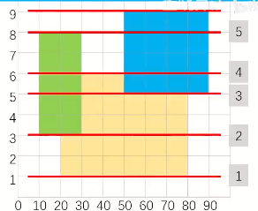

# 扫描线

## 例题 #1 

[www.bilibili.com](https://www.bilibili.com/video/BV1MX4y1Z7N5/?spm_id_from=333.337.search-card.all.click&vd_source=f45ea4e1e4b3b73d5f07c57b46c43aba)


求 $n$ 个四边平行于坐标轴的矩形的面积并。

对于 $100\%$ 的数据，$1 \le n \le {10}^5$，$0 \le x_1 < x_2 \le {10}^9$，$0 \le y_1 < y_2 \le {10}^9$。

## 扫描线



我们用线段树来维护这个结构。线段树节点划分如图。

然后我们每个节点维护的是当前节点的**目前被覆盖的区间**的长度len以及**是否被覆盖**flg。为了维护是否被覆盖，我们还要维护**被覆盖的次数**cnt。

然后我们从下往上开始枚举扫描线（红色的线）

当我们遇到矩形下界线（如1,2,3）时，我们把当前矩形（即对应下界的矩形）覆盖了的区间+1，维护每个节点是否被覆盖。然后我们进行一次query()，当访问到一个节点，如果flg=1，则res加上len。（注意这里的len是要pushup维护的，而不是当前节点代表是哪些节点的祖先就把区间相加）。求出res后，我们把答案加上$res\times h$，这里的h是当前扫描线与上面相邻的扫描线的高度差。

当我们遇到矩形上界线（如4,5,6）时，我们把当前矩形（即对应下界的矩形）覆盖了的区间-1，维护每个节点是否被覆盖。然后我们进行一次query()，同理。

当一个节点的cnt被减成0时，我们将其flg=0。反之当我们把一个cnt=0的节点cnt+1时，我们要将其flg=1。（其实可以不需要flg）

最后的ans即为答案

## pushup

在pushup中，我们要维护三个信息。

```C++
if(tr[x].cnt)tr[x].len=X[tr[x].r+1]-X[tr[x].l];
	else tr[x].len=tr[x<<1].len+tr[x<<1|1].len;
```

设当前节点为x，儿子为s1,s2。

- x.cnt>0，则说明当前节点被完全覆盖，我们不管这么多，直接把len修改为当前节点代表的区间的长度即可。

- x.cnt=0，则合并s1,s2的len即可。

虽然是区间修改，因为我们只需要查询全局值（即tr[1]）所以不需要pushdown。

## 代码

```C++
/*////////ACACACACACACAC///////////
       . Code  by  Ntsc .
       . Earn knowledge .
/*////////ACACACACACACAC///////////

#include<bits/stdc++.h>
#define int long long
#define db double
#define rtn return
#define lb lower_bound
using namespace std;

const int N=2e5+5;
const int M=1e5;
const int Mod=1e5;
const int INF=1e5;

int n,m,p,q,T,X[N<<1],ans;

struct line{
	int x1,x2,y;
	int tag;
}lne[N<<1];//注意4倍的线 

struct node{
	int l,r,cnt,len;
}tr[N<<3];//注意16倍空间线段树 

void pushup(int x){
	if(tr[x].cnt)tr[x].len=X[tr[x].r+1]-X[tr[x].l];
	else tr[x].len=tr[x<<1].len+tr[x<<1|1].len;
}

void change(int x,int pl,int pr,int tag){
	if(tr[x].l>pr||tr[x].r<pl)return ;
	if(tr[x].l>=pl&&tr[x].r<=pr){
		tr[x].cnt+=tag;
		pushup(x);
		return ;
		
	}
	change(x<<1,pl,pr,tag);
	change(x<<1|1,pl,pr,tag);
	pushup(x);
} 


void build(int x,int l,int r){
	tr[x]={l,r,0,0};
//	tr[x].r=r;
	if(l==r){
		
		return ;
	}
	int mid=l+r>>1;
	build(x<<1,l,mid);
	build(x<<1|1,mid+1,r);
//	pushup();
}

bool cmp(line a,line b){
	return a.y<b.y;
}

signed main(){
	cin>>n;
	for(int i=1;i<=n;i++){
		int x,y,a,b;
		cin>>x>>y>>a>>b;
		lne[i]={x,a,y,1};//下边界 
		lne[i+n]={x,a,b,-1};//上边界
		X[i]=x,X[i+n]=a; 
	}
	n<<=1;
	sort(lne+1,lne+n+1,cmp);
	sort(X+1,X+n+1); 
	int sz=unique(X+1,X+n+1)-(X+1);
	build(1,1,sz-1);
	
	for(int i=1;i<n;i++){
		//i!=n因为当前是计算i~i+1 的 
		int l=lb(X+1,X+sz+1,lne[i].x1)-X;
		int r=lb(X+1,X+sz+1,lne[i].x2)-X;
		change(1,l,r-1,lne[i].tag);//注意偏移映射传参
		ans+=tr[1].len*(lne[i+1].y-lne[i].y); 
	}
	
	cout<<ans<<endl;
	return 0;
}


```


