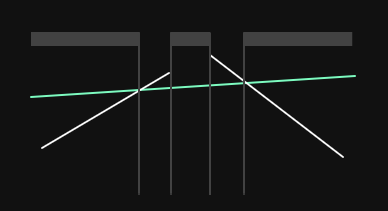
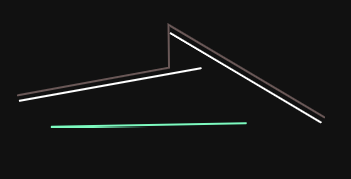
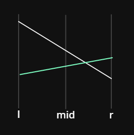
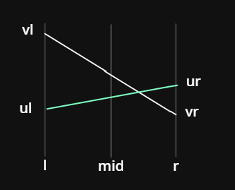

# 李超线段树


要求在平面直角坐标系下维护两个操作：

1. 在平面上加入一条线段。记第 $i$ 条被插入的线段的标号为 $i$。

2. 给定一个数 $k$，询问与直线 $x = k$ 相交的线段中，交点纵坐标最大的线段的编号。

**本题输入强制在线**。

## 思路

先看看题目，我们要维护的是什么？是对于每个 $x$，其上方最高的线段是那一条。我们想到，当我们往图中加入一条新的线段时，假如这条线段在某个区间是最高的，那么我们就需要把这个区间的答案都修改为这个线段。所以很明显我们可以考虑用类似线段树的数据结构来维护。

但是首先要明确一点，每次加入一条线段可能要修改多个区间，也有可能一个区间都不修改。





我们从线段树的模板上来修改。

## 修改

首先是修改函数。这里我们要实现的功能是添加一条线段，然后修改对应的值。

```C++
void change(int x,int l,int r,int ql,int qr,int v){
	if(l>=ql&&r<=qr){
		pushup(x,l,r,v);return ;
	}
	int mid=(l+r)>>1;
	if(ql<=mid)change(x<<1,l,mid,ql,qr,v);
	if(qr>mid)change(x<<1|1,mid+1,r,ql,qr,v);
}
```

这里的代码还是比较简洁的。注意这里应该是拿区间修改的线段树模板来修改（注意最后两行）而不是单点修改的。

解释一下这里的 $v$，这里的 $v$ 是插入的线段是编号。我们开一个结构体 `line{k,b}` 来记录每一条线段的 $k,b$，然后我们使用数组 `lne[]` 来记录所有线段。

当我们访问到一个区间在要修改的区间 $[  ql,qr]$ 之内时，我们就需要修改这个区间内的信息了。我们使用  `pushup()` 函数来修改（实际上叫做 `update` 更好，但由于是线段树改的，我们姑且叫他 `pushup`）。

```C++
void pushup(int x,int l,int r,int u){//ok
	int &v=s[x];
	int mid=(l+r)>>1,bmid=cmp(cal(u,mid),cal(v,mid));
	if(bmid==1||(!bmid&&u<v))swap(u,v);
	
	int bl=cmp(cal(u,l),cal(v,l));
	int br=cmp(cal(u,r),cal(v,r));
	
	if(bl==1||(!bl&&u<v))pushup(x<<1,l,mid,u);
	if(br==1||(!br&&u<v))pushup(x<<1|1,mid+1,r,u);	
}
```

这里的 `s[]` 数组就相当于线段树中的每个节点，在我的线段树板子里就是 `tr[]` 数组。我们这颗线段树记录的是“区间最高的线段的编号”，所以 $s$ 中记录的信息是线段的编号。那么这里的 $x$ 就是线段树上的节点的编号，`s[x]` 就是原来这个节点上记录的线段的编号。我们要比较这个就线段 $v$ 和我们新加入的线段 $u$ 的高度关系，并且考虑更新 `s[x]`。

这里我们需要两个辅助函数。

```C++
int cmp(double x, double y) {
  if (x-y>eps) return 1;
  if (y-x>eps) return -1;
  return 0;
}

db cal(int id,int p){//
	return 1.00*lne[id].b+p*lne[id].k;//计算直线id在x=p处的y
}

```

第一个是比较大小的。这个不用说了，因为小数运算会出现精度问题。

第二个我来解释一下，其实也没什么，就是我们传入线段的编号和当前的 $x$，计算这条线段在 $x=p$ 时的 $y$ 值（即高度值）。

我们再回到 `pushup` 函数 。


第一步，我们先计算当 $x=mid$ 时两个线段的高度关系。假设线段 $u$（记住在该例子里 $u$ 是新加入的线段）在 $x =mid$ 时的高度大于 $v$ 的，那么我们就把 $u,v$ 交换一下，有利于减少讨论情况。注意这里不仅仅是简单交换值，而是把映射关系也交换了。



在交换之后，我们就默认 $u$ 在 $x=mid$ 处比 $v$ 低了。那么这时我们来分类讨论一下。我们记录 $4$ 个端点的高度值 $ul,ur,vl,vr$。



- 当 $vl≥ul$ 且 $vr≥ur$ 时，在 $[l,r]$ 中 $u$ 肯定不如 $v$。相反也如此。

- 当 $vl>ul$ 但是 $vr<ur$ 时，那么说明线段 $u,v$ 在 $[mid,r]$ 区间内肯定有交点。这时区间 $[l,mid]$ 的答案应该不变（但由于我们不知道 $u,v$ 有没有交换过，所以我们还是修改一下。修改也很简单，对应区间修改的线段树，我们把 $[l,mid]$ 打上 tag），区间 $[mid,r]$ 我们应该递归下去。（如上图）


- 当 $ul>vl$ 但是 $vr>ur$ 时，那么说明线段 $u,v$ 在 $[l,mid]$ 区间内肯定有交点。这时区间 $[mid,r]$ 的答案应该不变（但由于我们不知道 $u,v$ 有没有交换过，所以我们还是修改一下。修改也很简单，对应区间修改的线段树，我们把 $[mid,r]$ 打上 tag），区间 $[l,mid]$ 我们应该递归下去。（如上图）

注意在讨论时我们要注意到在 $x=mid$ 处 $v$ 比 $u$ 高这个大前提哈。

还有两种特殊情况，即有一个端点重合。那么我们就需要知道 $u,v$ 有没有交换过了。我们考察下面的代码。

```C++
	if(bl==1||(!bl&&u<v))pushup(x<<1,l,mid,u);
```

我们把 `!bl&&u<v` 这种情况和 `bl==1`（即 $ul>vl$）的情况放在一起，因为我们知道新加入的线段的编号一定是大于之前的线段的编号的，所以如果 $u<v$，那么就说明 $v$ 是新线段。如下。所以我们应该往左边的区间递归。


另外一种情况类似，请大家自己想一想吧！

那么现在 $6$ 种情况我们都讨论过了，请仔细理解鸭。

## 查询

现在我们来看查询的部分。

```C++
pr query(int x,int l,int r,int q){
	if(q<l||q>r){
		return {0,0};
	}
	db res=cal(s[x],q);
	if(l==r)return {res,s[x]};
	int mid=(l+r)>>1;
	
	return pmax({res,s[x]},pmax(query(x<<1|1,mid+1,r,q),query(x<<1,l,mid,q)));
}
```

可以发现，这里和普通的线段树还是有一点区别的。这里的返回值是一个 `pair<double,int>` 分别是在 $x=q$ 时的最高的线段的高度和线段的编号。

首先对于无解的情况，即询问的 $x$ 在范围之外，我们直接返回最小值 $-inf$ 或者 $0$（因为本题求最大值）即可，同时返回 $id=0$ 表示不存在这条线段。

然后我们就需要计算当前这个节点对应的线段在 $x=q$ 时的高度了，我们记为 $res$。假如 $l=r$，那么说明我们已经找到了叶子节点，直接返回 $res$ 即可。但是如果这个点不是叶子节点，我们为什么还需要考虑当前节点的线段呢？直接递归下去不就行了？

注意！这里我们可没有 `pushdown` 操作！所以也许当前节点存储了新加入的高度更高的线段，但是叶子节点并没有更新！所以我们还需要采纳非叶子节点但也属于区间内的节点信息。当然，既然这个节点 $[l,r]$ 记录了这个线段，就说明再某个时刻这个区间内的最高点都在这个线段上，也就是说这个线段一定覆盖了这个区间，那么对于 $x=q$ 也一定经过了这条线段。但是至于这条线段是否是最终答案我们暂时还不知道。总而言之，**这条线段一定有成为答案的可能。**

这里我们还需要引入一个辅助函数 `pmax()`。

```C++
pr pmax(pr a,pr b){//
	if(cmp(a.pf,b.pf)==-1)return b;
	if(cmp(a.pf,b.pf)==1)return a;
	if(a.ps<b.ps)return a;
	return b;
}
```

这个函数的功能是传入两个线段 $a,b$（注意这里传入的线段 $a,b$ 为 `pair<double,int>` 类型，即已经计算好了当 $x=q$ 时的高度值了，存放在 `pair` 的 `.first` 中），我们比较两个线段的 `.first`（代码中 `define` 为 `pf`），返回高的那个即可。请注意回顾 `cmp` 函数。

当然，题目要求“若有多条线段与查询直线的交点纵坐标都是最大的，则输出编号最小的线段”，所以就有了最后两行。

## 其他

现在线段树部分已经讲完了，我们最后考察加线段的函数（不是在线段树中，而是把线段加入 `lne[]` 数组中）。

```C++
void add(int x,int y,int a,int b){
	if(x==a){
		lne[++cnt].k=0,lne[cnt].b=max(y,b);
	}else{
		lne[++cnt].k=1.0*(b-y)/(a-x),lne[cnt].b=y-lne[cnt].k*x;
	}
}
```

这里线段的两个端点分别为 $(x,y)(a,b)$，注意 $x=a$ 的特殊情况。其他就是计算斜率和截距的常规操作了，初中知识即可。

## 代码

```C++
/*////////ACACACACACACAC///////////
       . Coding by Ntsc .
       . FancyKnowledge .
       . Prove Yourself .
/*////////ACACACACACACAC///////////

//头文件
#include<bits/stdc++.h>

//数据类型
#define int long long
#define ull unsigned long long
#define db double
#define endl '\n'
#define pr pair<double,int> 
#define pf first
#define ps second
//命名空间
using namespace std;
//常量
const int N=4e5+5;
const int M=1e3;
const int MOD=1e9+1;
const int INF=1e9;
const db eps=1e-9;
//变量
int n,m,a,b,c,s[N],y[N],lans,res,tmp,cnt,web[M][M];

struct line{
	db k,b;
}lne[N];

void add(int x,int y,int a,int b){
	if(x==a){
		lne[++cnt].k=0,lne[cnt].b=max(y,b);//why max?
		
	}else{
		lne[++cnt].k=1.0*(b-y)/(a-x),lne[cnt].b=y-lne[cnt].k*x;
	}
}

int cmp(double x, double y) {
  if (x-y>eps) return 1;
  if (y-x>eps) return -1;
  return 0;
}

db cal(int id,int p){//
	return 1.00*lne[id].b+p*lne[id].k;//计算直线id在x=p处的y
}

pr pmax(pr a,pr b){//
	if(cmp(a.pf,b.pf)==-1)return b;
	if(cmp(a.pf,b.pf)==1)return a;
	if(a.ps<b.ps)return a;
	return b;
	
}

void pushup(int x,int l,int r,int u){//ok
	int &v=s[x];
	int mid=(l+r)>>1,bmid=cmp(cal(u,mid),cal(v,mid));
	if(bmid==1||(!bmid&&u<v))swap(u,v);
	
	int bl=cmp(cal(u,l),cal(v,l));
	int br=cmp(cal(u,r),cal(v,r));
	
	if(bl==1||(!bl&&u<v))pushup(x<<1,l,mid,u);
	if(br==1||(!br&&u<v))pushup(x<<1|1,mid+1,r,u);
	
	
}


void change(int x,int l,int r,int ql,int qr,int v){//ok
	if(l>=ql&&r<=qr){
		pushup(x,l,r,v);return ;
	}
	int mid=(l+r)>>1;
	if(ql<=mid)change(x<<1,l,mid,ql,qr,v);
	if(qr>mid)change(x<<1|1,mid+1,r,ql,qr,v);
}


pr query(int x,int l,int r,int q){//ok
//	cerr<<"query l="<<l<<" r="<<r<<endl;
	if(q<l||q>r){
		return {0,0};
	}
	db res=cal(s[x],q);
	if(l==r)return {res,s[x]};
	int mid=(l+r)>>1;
	
	return pmax({res,s[x]},pmax(query(x<<1|1,mid+1,r,q),query(x<<1,l,mid,q)));
}


void solve(){
	scanf("%lld",&n);
	for(int i=1;i<=n;i++){
		int op,x,y,a,b,k;
      	cin>>op;
      	if(op){
      		cin>>x>>y>>a>>b;
      		x=(x+lans-1+39989)%39989+1;
      		y=(y+lans-1+MOD)%MOD+1;//注意加上一个MOD
      		a=(a+lans-1+39989)%39989+1;
      		b=(b+lans-1+MOD)%MOD+1;
      		if(x>a)swap(x,a),swap(y,b);
      		add(x,y,a,b);
      		change(1,1,39989,x,a,cnt);
		}else{
			cin>>k;
			
//			cerr<<"query k="<<(k+lans-1+39989)%39989+1<<endl;
			lans=query(1,1,39989,(k+lans-1+39989)%39989+1).ps;
			cout<<lans<<endl;
		}
	}
}

signed main(){
	int T;
	//	cin>>T;
	T=1;
	while(T--){
		solve();
	}
	
	return 0;
}

```

注意这是线段的情况，对于直线，我们把 `change(1,1,39989,x,a,cnt);` 中的 $x,a$ 修改为询问的 $x$ 的值域即可。原来的 $x,a$ 为线段的两个端点的 $x$ 值。

## 练习 #1 [JSOI2008] Blue Mary 开公司

第一行 ：一个整数 $N$，表示方案和询问的总数。

接下来 $N$ 行，每行开头一个单词 `Query` 或 `Project`。

若单词为 `Query`，则后接一个整数 $T$，表示 Blue Mary 询问第 $T$ 天的最大收益。

若单词为 `Project`，则后接两个实数 $S, P$，表示该种设计方案第一天的收益 $S$，以及以后每天比上一天多出的收益 $P$。

**分析**

本题即不断加入直线 $y=S+P\times(x-1)$，求对于某个 $x$ 在所有直线中最高的 $y$ 值为？

**代码**

```C++
/*////////ACACACACACACAC///////////
       . Coding by Ntsc .
       . FancyKnowledge .
       . Prove Yourself .
/*////////ACACACACACACAC///////////

//头文件
#include<bits/stdc++.h>

//数据类型
#define int long long
#define ull unsigned long long
#define db double
#define endl '\n'
#define pr pair<double,int> 
#define pf first
#define ps second
//命名空间
using namespace std;
//常量
const int N=4e5+5;
const int M=1e3;
const int MOD=1e9+1;
const int INF=1e9;
const int MT=5e4;
const db eps=1e-9;
//变量
int n,m,a,b,c,s[N],y[N],lans,res,tmp,cnt,web[M][M];

struct line{
	db k,b;
}lne[N];

void add(db s,db p){
	lne[++cnt].k=p,lne[cnt].b=s-p;
	
}

int cmp(double x, double y) {
  if (x-y>eps) return 1;
  if (y-x>eps) return -1;
  return 0;
}

db cal(int id,int p){//
	return 1.00*lne[id].b+p*lne[id].k;//计算直线id在x=p处的y
}

pr pmax(pr a,pr b){//
	if(cmp(a.pf,b.pf)==-1)return b;
	if(cmp(a.pf,b.pf)==1)return a;
	if(a.ps<b.ps)return a;
	return b;
	
}

void pushup(int x,int l,int r,int u){//ok
	int &v=s[x];
	int mid=(l+r)>>1,bmid=cmp(cal(u,mid),cal(v,mid));
	if(bmid==1||(!bmid&&u<v))swap(u,v);
	
	int bl=cmp(cal(u,l),cal(v,l));
	int br=cmp(cal(u,r),cal(v,r));
	
	if(bl==1||(!bl&&u<v))pushup(x<<1,l,mid,u);
	if(br==1||(!br&&u<v))pushup(x<<1|1,mid+1,r,u);
	
	
}


void change(int x,int l,int r,int ql,int qr,int v){//ok
	if(l>=ql&&r<=qr){
		pushup(x,l,r,v);return ;
	}
	int mid=(l+r)>>1;
	if(ql<=mid)change(x<<1,l,mid,ql,qr,v);
	if(qr>mid)change(x<<1|1,mid+1,r,ql,qr,v);
}


pr query(int x,int l,int r,int q){//ok
//	cerr<<"query l="<<l<<" r="<<r<<endl;
	if(q<l||q>r){
		return {0,0};
	}
	db res=cal(s[x],q);
	if(l==r)return {res,s[x]};
	int mid=(l+r)>>1;
	
	return pmax({res,s[x]},pmax(query(x<<1|1,mid+1,r,q),query(x<<1,l,mid,q)));
}


void solve(){
	scanf("%lld",&n);
	for(int i=1;i<=n;i++){
		string s;
		int T;
		db S,P;
      	cin>>s;
      	if(s=="Project"){
      		cin>>S>>P;

      		add(S,P);
      		change(1,1,MT,1,MT,cnt);
		}else{
			cin>>T;
			lans=query(1,1,MT,T).pf;
			cout<<lans/100<<endl;
		}
	}
}

signed main(){
	solve();
	return 0;
}

```


