# 目录

- 01线段树

- 扫描线算法

- 可持久化权值线段树（主席树）-？模板2

- 线段树套平衡树

- 李超线段树

- 可持久化线段树（数组）→#模板1

- 吉司机线段树

- 二维线段树

- 带修主席树（带修改的区间k大值）

# 01线段树

[练习 | 南外231024](https://flowus.cn/2f9e28ac-ef43-4fbd-9730-2a8285c137b5) T4

[www.luogu.com.cn](https://www.luogu.com.cn/problem/P3870)


# 扫描线

[www.bilibili.com](https://www.bilibili.com/video/BV1MX4y1Z7N5/?spm_id_from=333.337.search-card.all.click&vd_source=f45ea4e1e4b3b73d5f07c57b46c43aba)


求 $n$ 个四边平行于坐标轴的矩形的面积并。

对于 $100\%$ 的数据，$1 \le n \le {10}^5$，$0 \le x_1 < x_2 \le {10}^9$，$0 \le y_1 < y_2 \le {10}^9$。

## 扫描线


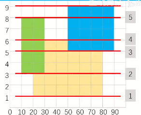


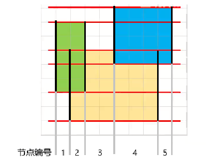

我们用线段树来维护这个结构。线段树节点划分如图。

然后我们每个节点维护的是当前节点的**目前被覆盖的区间**的长度len以及**是否被覆盖**flg。为了维护是否被覆盖，我们还要维护**被覆盖的次数**cnt。

然后我们从下往上开始枚举扫描线（红色的线）

当我们遇到矩形下界线（如1,2,3）时，我们把当前矩形（即对应下界的矩形）覆盖了的区间+1，维护每个节点是否被覆盖。然后我们进行一次query()，当访问到一个节点，如果flg=1，则res加上len。（注意这里的len是要pushup维护的，而不是当前节点代表是哪些节点的祖先就把区间相加）。求出res后，我们把答案加上res\times h，这里的h是当前扫描线与上面相邻的扫描线的高度差。

当我们遇到矩形上界线（如4,5,6）时，我们把当前矩形（即对应下界的矩形）覆盖了的区间-1，维护每个节点是否被覆盖。然后我们进行一次query()，同理。

当一个节点的cnt被减成0时，我们将其flg=0。反之当我们把一个cnt=0的节点cnt+1时，我们要将其flg=1。（其实可以不需要flg）

最后的ans即为答案

## pushup

在pushup中，我们要维护三个信息。

```C++
if(tr[x].cnt)tr[x].len=X[tr[x].r+1]-X[tr[x].l];
	else tr[x].len=tr[x<<1].len+tr[x<<1|1].len;
```

设当前节点为x，儿子为s1,s2。

- x.cnt>0，则说明当前节点被完全覆盖，我们不管这么多，直接把len修改为当前节点代表的区间的长度即可。

- x.cnt=0，则合并s1,s2的len即可。

虽然是区间修改，因为我们只需要查询全局值（即tr[1]）所以不需要pushdown。

## 代码

```C++
/*////////ACACACACACACAC///////////
       . Code  by  Ntsc .
       . Earn knowledge .
/*////////ACACACACACACAC///////////

#include<bits/stdc++.h>
#define int long long
#define db double
#define rtn return
#define lb lower_bound
using namespace std;

const int N=2e5+5;
const int M=1e5;
const int Mod=1e5;
const int INF=1e5;

int n,m,p,q,T,X[N<<1],ans;

struct line{
	int x1,x2,y;
	int tag;
}lne[N<<1];//注意4倍的线 

struct node{
	int l,r,cnt,len;
}tr[N<<3];//注意16倍空间线段树 

void pushup(int x){
	if(tr[x].cnt)tr[x].len=X[tr[x].r+1]-X[tr[x].l];
	else tr[x].len=tr[x<<1].len+tr[x<<1|1].len;
}

void change(int x,int pl,int pr,int tag){
	if(tr[x].l>pr||tr[x].r<pl)return ;
	if(tr[x].l>=pl&&tr[x].r<=pr){
		tr[x].cnt+=tag;
		pushup(x);
		return ;
		
	}
	change(x<<1,pl,pr,tag);
	change(x<<1|1,pl,pr,tag);
	pushup(x);
} 


void build(int x,int l,int r){
	tr[x]={l,r,0,0};
//	tr[x].r=r;
	if(l==r){
		
		return ;
	}
	int mid=l+r>>1;
	build(x<<1,l,mid);
	build(x<<1|1,mid+1,r);
//	pushup();
}

bool cmp(line a,line b){
	return a.y<b.y;
}

signed main(){
	cin>>n;
	for(int i=1;i<=n;i++){
		int x,y,a,b;
		cin>>x>>y>>a>>b;
		lne[i]={x,a,y,1};//下边界 
		lne[i+n]={x,a,b,-1};//上边界
		X[i]=x,X[i+n]=a; 
	}
	n<<=1;
	sort(lne+1,lne+n+1,cmp);
	sort(X+1,X+n+1); 
	int sz=unique(X+1,X+n+1)-(X+1);
	build(1,1,sz-1);
	
	for(int i=1;i<n;i++){
		//i!=n因为当前是计算i~i+1 的 
		int l=lb(X+1,X+sz+1,lne[i].x1)-X;
		int r=lb(X+1,X+sz+1,lne[i].x2)-X;
		change(1,l,r-1,lne[i].tag);//注意偏移映射传参
		ans+=tr[1].len*(lne[i+1].y-lne[i].y); 
	}
	
	cout<<ans<<endl;
	return 0;
}


```


# 主席树

[166 可持久化线段树（主席树）_哔哩哔哩_bilibili](https://www.bilibili.com/video/BV1PT411L7XQ/?spm_id_from=333.999.0.0&vd_source=f45ea4e1e4b3b73d5f07c57b46c43aba)

主席树全称是可持久化权值线段树

> 注意：在某些程度上，主席树≠可持久化线段树

**定义：权值线段树**

线段树维护的是区间l~r的最大值等，而值域线段树维护的是在区间1~n中大小在[l,r]范围内的数的个数


**定义：可持久化线段树**


简单做法：暴力地每次修改都开一棵新的线段树

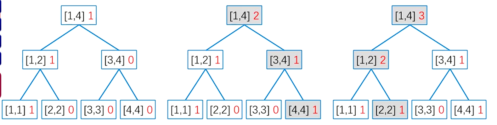

这是不可取的，因此我们有优化方法

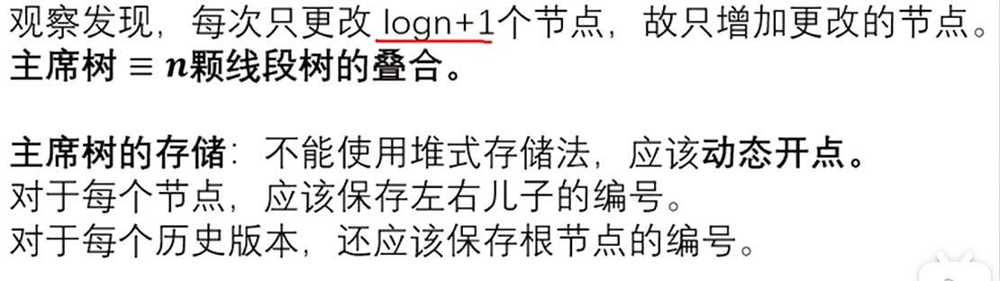

注释：堆式存储法即父节点为i，子节点为$2 \times i$ 和 $2\times i+1$的存储方法

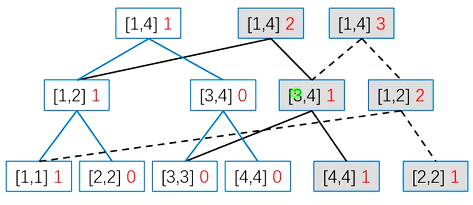

动态开点解说：对于每个节点应该保存左右儿子的编号，对于每个历史版本，还应该保存根节点的编号。

解说：每一次修改一定会改动根节点，因此每一个历史版本的根节点都不同。也就是说根节点是每一个历史版本的入口

### 动态开点线段树

结构

```C++
struct node{
	int lc,rc,v;
}tr[4*N];
```

**建树**

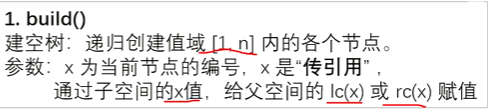

```C++
void build(int &x,int l,int r){
	x=++idx;
	if(l==r)return;
	build(tr[x].lc,l,l+r>>1);
	build(tr[x].rc,(l+r>>1)+1,r);
}
```

注意，如果最开始的状态就i是一棵空树，后面才慢慢把数字插入进来，那么就不需要写build

**插入**

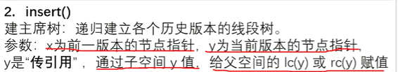

```C++
void insert(int pre,int &now,int l,int r,int v){
	now=++idx;//动态开点.新插入一个点 为了可以方便的用这个now更新上一个函数空间的tr[now].lc(或rc),我们就引用一下
	tr[now]=tr[pre];//复制旧点的信息
	tr[now].v++;//点权+1,因为插入的树在now的区间内
	if(l==r)return;
	int mid=l+r>>1;
	if(v<=mid)insert(tr[pre].lc,tr[now].lc,l,mid,v);
	else insert(tr[pre].rc,tr[now].rc,mid+1,r,v);
}
```

pre指的是上一个版本的点的编号，now指的是新的编号（会动态开点，传入的一个是空，然后在函数中会对其进行赋值）

如果要插入一个点，请写

```C++
insert(rt[i-1],rt[i],1,n,v);//rt记录第i个版本的根节点,v是要插入的值
```

**查询**

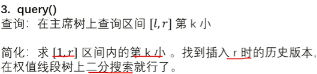

如图，假设我们在空树上插入了8个数，现在我要查询插入第6个数时的第5小的数。我们可以从rt[6]进入第6个版本的值域线段树，然后二分

二分方法：我们先到根节点，发现左子树在[1,2]有4个数，那么第5个数就在右子树。进入右子树，将目标5减去根节点左子树的大小4得1，然后看现在的左子树大小，为1，那么就进入左子树。继续二分下去直到l==r，此时l就是答案

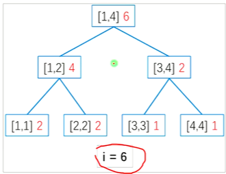

**扩展**

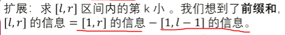

```C++
query(int pre,int now,int l,int r,int k){//查询区间l~r中第k大的数
	if(l==r)return l;
	int mid=l+r>>1;
	int s=tr[tr[now].lc].v-tr[tr[pre].lc].v;//note
	if(k<=s)return query(tr[pre].lc,tr[now].lc,l,mid,k);
	return query(tr[pre].rc,tr[now].rc,mid+1,r,k);
}
```

我们重点关注这一行代码

```C++
	int s=tr[tr[now].lc].v-tr[tr[pre].lc].s;//note
```

为什么要这样呢？我们结合一个例子（导师の伟大样例）

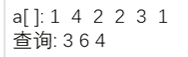

我们查询下标3~6之间第4大的数（很明显是3对吧）

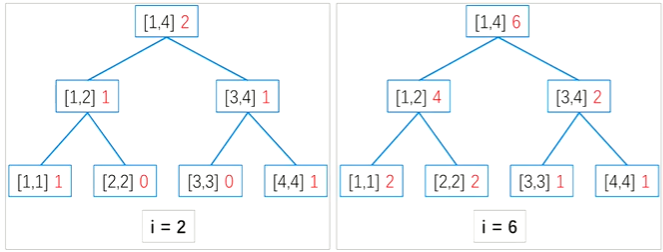

当我们函数走到根节点时，tr[tr[pre].lc].v代表了i=2时1~2值域内数字的个数，tr[tr[now].lc].v代表了i=6时1~2值域内的数字个数，将它们做差后，就得到了下标2+1=3~6范围内值域1~2的数的个数啦！（前缀和思想）

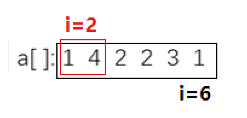

```C++
query(int pre,int now,int l,int r,int k){//查询区间l~r中第k大的数
	if(l==r)return l;
	int mid=l+r>>1;
	int s=tr[tr[now].lc].v-tr[tr[pre].lc].v;//note
	if(k<=s)return query(tr[pre].lc,tr[now].lc,l,mid,k);
	return query(tr[pre].rc,tr[now].rc,mid+1,r,k-s);//注意是k-s,因为左子树已经有s个了,所以只要在右子树找第k-s个即可
}
```

**注意**

在值域线段树中，节点的[l,r]指的是数字大小在l~r之间的数字的个数，除非使用主席树，否则维护的都是1~n的区间，不能求出特点子区间的问题。

还有就是，一般题目中的值域可能较大，而数字数量不多，所以需要离散化

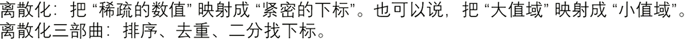

离散化的代码就不写了，~~贴贴~（想和Chargcy贴贴...）（bushi~~，贴图片

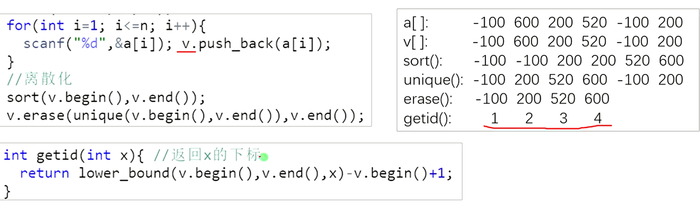

## 模板

[www.luogu.com.cn](https://www.luogu.com.cn/problem/P3919)

如题，你需要维护这样的一个长度为 N 的数组，支持如下几种操作

1. 在某个历史版本上修改某一个位置上的值

2. 访问某个历史版本上的某一位置的值

> 见下方：可持久化线段树（数组）

[www.luogu.com.cn](https://www.luogu.com.cn/problem/P3834)


这是个非常经典的可持久化权值线段树入门题——静态区间第 $k$ 小。

**数据已经过加强，请使用可持久化权值线段树。同时请注意常数优化**。

如题，给定 $n$ 个整数构成的序列 $a$，将对于指定的闭区间 $[l, r]$ 查询其区间内的第 $k$ 小值。

对于每次询问，输出一行一个整数表示答案。

- 对于 $100\%$ 的数据，满足 $1 \leq n,m \leq 2\times 10^5$，$|a_i| \leq 10^9$，$1 \leq l \leq r \leq n$，$1 \leq k \leq r - l + 1$。

```C++
/*
CB Ntsc
*/

#include <bits/stdc++.h>
using namespace std;
#define int long long
#define mp make_pair

const int N = 1e6 + 5;
const int INF = 1e9 + 5;
const int MOD = 1e9 + 7;
bool f1;
int top[N], fa[N], a[N], rt[N];
int q, n, m, ans, idx, T;
vector<int> b;
bool f2;


#define rd read()
inline int read() {
    int xx = 0, ff = 1;
    char ch = getchar();
    while (ch < '0' || ch > '9') {
        if (ch == '-')
            ff = -1;
        ch = getchar();
    }
    while (ch >= '0' && ch <= '9') xx = xx * 10 + (ch - '0'), ch = getchar();
    return xx * ff;
}
inline void write(int out) {
    if (out < 0)
        putchar('-'), out = -out;
    if (out > 9)
        write(out / 10);
    putchar(out % 10 + '0');
}

struct node{
	int lc,rc,v;
}tr[4*N];

void build(int &x,int l,int r){
	x=++idx;
	if(l==r)return;
	build(tr[x].lc,l,l+r>>1);
	build(tr[x].rc,(l+r>>1)+1,r);
}

void insert(int pre,int &now,int l,int r,int v){
	now=++idx;//动态开点.新插入一个点 为了可以方便的用这个now更新上一个函数空间的tr[now].lc(或rc),我们就引用一下
	tr[now]=tr[pre];//复制旧点的信息
	tr[now].v++;//点权+1,因为插入的树在now的区间内
	if(l==r)return;
	int mid=l+r>>1;
	if(v<=mid)insert(tr[pre].lc,tr[now].lc,l,mid,v);
	else insert(tr[pre].rc,tr[now].rc,mid+1,r,v);
}

int query(int pre,int now,int l,int r,int k){//查询区间l~r中第k大的数
	if(l==r)return l;
	int mid=l+r>>1;
	int s=tr[tr[now].lc].v-tr[tr[pre].lc].v;//note
	if(k<=s)return query(tr[pre].lc,tr[now].lc,l,mid,k);
	return query(tr[pre].rc,tr[now].rc,mid+1,r,k-s);//注意是k-s,因为左子树已经有s个了,所以只要在右子树找第k-s个即可
}

signed main() {
    // freopen("chfran.in", "r", stdin);
    // freopen("chfran.out", "w", stdout);
    n=rd;m=rd;
    for(int i=1;i<=n;i++){
        a[i]=rd;
        b.push_back(a[i]);
    }
    sort(b.begin(),b.end());
    b.erase(unique(b.begin(),b.end()),b.end());

    int len=b.size();

    build(rt[0],1,len);
    for(int i=1;i<=n;i++){
        int id=lower_bound(b.begin(),b.end(),a[i])-b.begin()+1;
        insert(rt[i-1],rt[i],1,len,id);
    }
    while(m--){
        int l=rd,r=rd,k=rd;
        int id=query(rt[l-1],rt[r],1,len,k)-1;
        printf("%lld\n",b[id]);
    }
    
    
}

/*
1
2 5 1 
0 0 1 
0 0 4 

*/
```

## NOIP真题

[www.luogu.com.cn](https://www.luogu.com.cn/problem/P1972)

题目描述

HH 有一串由贝壳组成的项链。

他提出了一个问题：某一段贝壳中，包含了多少种不同的贝壳？

输入格式

一行一个正整数 $n$，表示项链长度。
第二行 $n$ 个正整数 $a_i$，表示项链中第 $i$ 个贝壳的种类。

第三行一个整数 $m$，表示 HH 询问的个数。
接下来 $m$ 行，每行两个整数 $l,r$，表示询问的区间。

输出格式

输出 $m$ 行，每行一个整数，依次表示询问对应的答案。

【数据范围】

对于 $20\%$ 的数据，$1\le n,m\leq 5000$；
对于 $40\%$ 的数据，$1\le n,m\leq 10^5$；
对于 $60\%$ 的数据，$1\le n,m\leq 5\times 10^5$；
对于 $100\%$ 的数据，$1\le n,m,a_i \leq 10^6$，$1\le l \le r \le n$。

本题可能需要较快的读入方式，最大数据点读入数据约 20MB

## 区间二维信息统计 | 数颜色

从标准输入中读入数据。 输入第 1 行两个正整数 $n$,$m$。

输入第 2 行 $n$ 个正整数，第 $i$ 个数表示第 $i$ 只兔子的颜色 $a_i$。

输入接下来 $m$ 行，每行为以下两种中的一种：

- “$1\ l_j\ r_j\ c_j$” ：询问在区间 $[l_j,r_j]$ 里有多少只颜色为 $c_j$ 的兔子；

- “$2\ x_j$”： $x_j$ 和 $x_j+1$ 两只兔子交换了位置。

数据范围均为3e5

---

我们用vector+二分即可。vector[i]中记录颜色i的点的下标从小到大。每次在vector[$c_j$]中二分查找值在$[l_j,r_j]$范围内的上下界即可。修改时二分定位到vector[$col_{x}$]和vector[$col_{x+1}$]的位置修改。

## 带修主席树


# 树套树

[动态树（LCT）](https://flowus.cn/4077b622-00bd-4d7d-b2a6-0ca0e0d73b87)

# 李超线段树


要求在平面直角坐标系下维护两个操作：

1. 在平面上加入一条线段。记第 $i$ 条被插入的线段的标号为 $i$。

2. 给定一个数 $k$，询问与直线 $x = k$ 相交的线段中，交点纵坐标最大的线段的编号。

**本题输入强制在线**。

## 思路

先看看题目，我们要维护的是什么？是对于每个 $x$，其上方最高的线段是那一条。我们想到，当我们往图中加入一条新的线段时，假如这条线段在某个区间是最高的，那么我们就需要把这个区间的答案都修改为这个线段。所以很明显我们可以考虑用类似线段树的数据结构来维护。

但是首先要明确一点，每次加入一条线段可能要修改多个区间，也有可能一个区间都不修改。


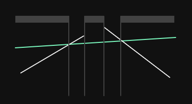


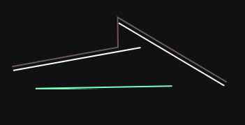

我们从线段树的模板上来修改。

## 修改

首先是修改函数。这里我们要实现的功能是添加一条线段，然后修改对应的值。

```C++
void change(int x,int l,int r,int ql,int qr,int v){
	if(l>=ql&&r<=qr){
		pushup(x,l,r,v);return ;
	}
	int mid=(l+r)>>1;
	if(ql<=mid)change(x<<1,l,mid,ql,qr,v);
	if(qr>mid)change(x<<1|1,mid+1,r,ql,qr,v);
}
```

这里的代码还是比较简洁的。注意这里应该是拿区间修改的线段树模板来修改（注意最后两行）而不是单点修改的。

解释一下这里的 $v$，这里的 $v$ 是插入的线段是编号。我们开一个结构体 `line{k,b}` 来记录每一条线段的 $k,b$，然后我们使用数组 `lne[]` 来记录所有线段。

当我们访问到一个区间在要修改的区间 $[  ql,qr]$ 之内时，我们就需要修改这个区间内的信息了。我们使用  `pushup()` 函数来修改（实际上叫做 `update` 更好，但由于是线段树改的，我们姑且叫他 `pushup`）。

```C++
void pushup(int x,int l,int r,int u){//ok
	int &v=s[x];
	int mid=(l+r)>>1,bmid=cmp(cal(u,mid),cal(v,mid));
	if(bmid==1||(!bmid&&u<v))swap(u,v);
	
	int bl=cmp(cal(u,l),cal(v,l));
	int br=cmp(cal(u,r),cal(v,r));
	
	if(bl==1||(!bl&&u<v))pushup(x<<1,l,mid,u);
	if(br==1||(!br&&u<v))pushup(x<<1|1,mid+1,r,u);	
}
```

这里的 `s[]` 数组就相当于线段树中的每个节点，在我的线段树板子里就是 `tr[]` 数组。我们这颗线段树记录的是“区间最高的线段的编号”，所以 $s$ 中记录的信息是线段的编号。那么这里的 $x$ 就是线段树上的节点的编号，`s[x]` 就是原来这个节点上记录的线段的编号。我们要比较这个就线段 $v$ 和我们新加入的线段 $u$ 的高度关系，并且考虑更新 `s[x]`。

这里我们需要两个辅助函数。

```C++
int cmp(double x, double y) {
  if (x-y>eps) return 1;
  if (y-x>eps) return -1;
  return 0;
}

db cal(int id,int p){//
	return 1.00*lne[id].b+p*lne[id].k;//计算直线id在x=p处的y
}

```

第一个是比较大小的。这个不用说了，因为小数运算会出现精度问题。

第二个我来解释一下，其实也没什么，就是我们传入线段的编号和当前的 $x$，计算这条线段在 $x=p$ 时的 $y$ 值（即高度值）。

我们再回到 `pushup` 函数 。


第一步，我们先计算当 $x=mid$ 时两个线段的高度关系。假设线段 $u$（记住在该例子里 $u$ 是新加入的线段）在 $x =mid$ 时的高度大于 $v$ 的，那么我们就把 $u,v$ 交换一下，有利于减少讨论情况。注意这里不仅仅是简单交换值，而是把映射关系也交换了。

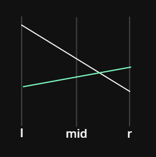

在交换之后，我们就默认 $u$ 在 $x=mid$ 处比 $v$ 低了。那么这时我们来分类讨论一下。我们记录 $4$ 个端点的高度值 $ul,ur,vl,vr$。

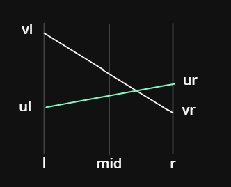

- 当 $vl≥ul$ 且 $vr≥ur$ 时，在 $[l,r]$ 中 $u$ 肯定不如 $v$。相反也如此。

- 当 $vl>ul$ 但是 $vr<ur$ 时，那么说明线段 $u,v$ 在 $[mid,r]$ 区间内肯定有交点。这时区间 $[l,mid]$ 的答案应该不变（但由于我们不知道 $u,v$ 有没有交换过，所以我们还是修改一下。修改也很简单，对应区间修改的线段树，我们把 $[l,mid]$ 打上 tag），区间 $[mid,r]$ 我们应该递归下去。（如上图）


- 当 $ul>vl$ 但是 $vr>ur$ 时，那么说明线段 $u,v$ 在 $[l,mid]$ 区间内肯定有交点。这时区间 $[mid,r]$ 的答案应该不变（但由于我们不知道 $u,v$ 有没有交换过，所以我们还是修改一下。修改也很简单，对应区间修改的线段树，我们把 $[mid,r]$ 打上 tag），区间 $[l,mid]$ 我们应该递归下去。（如上图）

注意在讨论时我们要注意到在 $x=mid$ 处 $v$ 比 $u$ 高这个大前提哈。

还有两种特殊情况，即有一个端点重合。那么我们就需要知道 $u,v$ 有没有交换过了。我们考察下面的代码。

```C++
	if(bl==1||(!bl&&u<v))pushup(x<<1,l,mid,u);
```

我们把 `!bl&&u<v` 这种情况和 `bl==1`（即 $ul>vl$）的情况放在一起，因为我们知道新加入的线段的编号一定是大于之前的线段的编号的，所以如果 $u<v$，那么就说明 $v$ 是新线段。如下。所以我们应该往左边的区间递归。

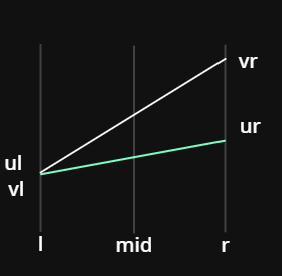

另外一种情况类似，请大家自己想一想吧！

那么现在 $6$ 种情况我们都讨论过了，请仔细理解鸭。

## 查询

现在我们来看查询的部分。

```C++
pr query(int x,int l,int r,int q){
	if(q<l||q>r){
		return {0,0};
	}
	db res=cal(s[x],q);
	if(l==r)return {res,s[x]};
	int mid=(l+r)>>1;
	
	return pmax({res,s[x]},pmax(query(x<<1|1,mid+1,r,q),query(x<<1,l,mid,q)));
}
```

可以发现，这里和普通的线段树还是有一点区别的。这里的返回值是一个 `pair<double,int>` 分别是在 $x=q$ 时的最高的线段的高度和线段的编号。

首先对于无解的情况，即询问的 $x$ 在范围之外，我们直接返回最小值 $-inf$ 或者 $0$（因为本题求最大值）即可，同时返回 $id=0$ 表示不存在这条线段。

然后我们就需要计算当前这个节点对应的线段在 $x=q$ 时的高度了，我们记为 $res$。假如 $l=r$，那么说明我们已经找到了叶子节点，直接返回 $res$ 即可。但是如果这个点不是叶子节点，我们为什么还需要考虑当前节点的线段呢？直接递归下去不就行了？

注意！这里我们可没有 `pushdown` 操作！所以也许当前节点存储了新加入的高度更高的线段，但是叶子节点并没有更新！所以我们还需要采纳非叶子节点但也属于区间内的节点信息。当然，既然这个节点 $[l,r]$ 记录了这个线段，就说明再某个时刻这个区间内的最高点都在这个线段上，也就是说这个线段一定覆盖了这个区间，那么对于 $x=q$ 也一定经过了这条线段。但是至于这条线段是否是最终答案我们暂时还不知道。总而言之，**这条线段一定有成为答案的可能。**

这里我们还需要引入一个辅助函数 `pmax()`。

```C++
pr pmax(pr a,pr b){//
	if(cmp(a.pf,b.pf)==-1)return b;
	if(cmp(a.pf,b.pf)==1)return a;
	if(a.ps<b.ps)return a;
	return b;
}
```

这个函数的功能是传入两个线段 $a,b$（注意这里传入的线段 $a,b$ 为 `pair<double,int>` 类型，即已经计算好了当 $x=q$ 时的高度值了，存放在 `pair` 的 `.first` 中），我们比较两个线段的 `.first`（代码中 `define` 为 `pf`），返回高的那个即可。请注意回顾 `cmp` 函数。

当然，题目要求“若有多条线段与查询直线的交点纵坐标都是最大的，则输出编号最小的线段”，所以就有了最后两行。

## 其他

现在线段树部分已经讲完了，我们最后考察加线段的函数（不是在线段树中，而是把线段加入 `lne[]` 数组中）。

```C++
void add(int x,int y,int a,int b){
	if(x==a){
		lne[++cnt].k=0,lne[cnt].b=max(y,b);
	}else{
		lne[++cnt].k=1.0*(b-y)/(a-x),lne[cnt].b=y-lne[cnt].k*x;
	}
}
```

这里线段的两个端点分别为 $(x,y)(a,b)$，注意 $x=a$ 的特殊情况。其他就是计算斜率和截距的常规操作了，初中知识即可。

## 代码

```C++
/*////////ACACACACACACAC///////////
       . Coding by Ntsc .
       . FancyKnowledge .
       . Prove Yourself .
/*////////ACACACACACACAC///////////

//头文件
#include<bits/stdc++.h>

//数据类型
#define int long long
#define ull unsigned long long
#define db double
#define endl '\n'
#define pr pair<double,int> 
#define pf first
#define ps second
//命名空间
using namespace std;
//常量
const int N=4e5+5;
const int M=1e3;
const int MOD=1e9+1;
const int INF=1e9;
const db eps=1e-9;
//变量
int n,m,a,b,c,s[N],y[N],lans,res,tmp,cnt,web[M][M];

struct line{
	db k,b;
}lne[N];

void add(int x,int y,int a,int b){
	if(x==a){
		lne[++cnt].k=0,lne[cnt].b=max(y,b);//why max?
		
	}else{
		lne[++cnt].k=1.0*(b-y)/(a-x),lne[cnt].b=y-lne[cnt].k*x;
	}
}

int cmp(double x, double y) {
  if (x-y>eps) return 1;
  if (y-x>eps) return -1;
  return 0;
}

db cal(int id,int p){//
	return 1.00*lne[id].b+p*lne[id].k;//计算直线id在x=p处的y
}

pr pmax(pr a,pr b){//
	if(cmp(a.pf,b.pf)==-1)return b;
	if(cmp(a.pf,b.pf)==1)return a;
	if(a.ps<b.ps)return a;
	return b;
	
}

void pushup(int x,int l,int r,int u){//ok
	int &v=s[x];
	int mid=(l+r)>>1,bmid=cmp(cal(u,mid),cal(v,mid));
	if(bmid==1||(!bmid&&u<v))swap(u,v);
	
	int bl=cmp(cal(u,l),cal(v,l));
	int br=cmp(cal(u,r),cal(v,r));
	
	if(bl==1||(!bl&&u<v))pushup(x<<1,l,mid,u);
	if(br==1||(!br&&u<v))pushup(x<<1|1,mid+1,r,u);
	
	
}


void change(int x,int l,int r,int ql,int qr,int v){//ok
	if(l>=ql&&r<=qr){
		pushup(x,l,r,v);return ;
	}
	int mid=(l+r)>>1;
	if(ql<=mid)change(x<<1,l,mid,ql,qr,v);
	if(qr>mid)change(x<<1|1,mid+1,r,ql,qr,v);
}


pr query(int x,int l,int r,int q){//ok
//	cerr<<"query l="<<l<<" r="<<r<<endl;
	if(q<l||q>r){
		return {0,0};
	}
	db res=cal(s[x],q);
	if(l==r)return {res,s[x]};
	int mid=(l+r)>>1;
	
	return pmax({res,s[x]},pmax(query(x<<1|1,mid+1,r,q),query(x<<1,l,mid,q)));
}


void solve(){
	scanf("%lld",&n);
	for(int i=1;i<=n;i++){
		int op,x,y,a,b,k;
      	cin>>op;
      	if(op){
      		cin>>x>>y>>a>>b;
      		x=(x+lans-1+39989)%39989+1;
      		y=(y+lans-1+MOD)%MOD+1;//注意加上一个MOD
      		a=(a+lans-1+39989)%39989+1;
      		b=(b+lans-1+MOD)%MOD+1;
      		if(x>a)swap(x,a),swap(y,b);
      		add(x,y,a,b);
      		change(1,1,39989,x,a,cnt);
		}else{
			cin>>k;
			
//			cerr<<"query k="<<(k+lans-1+39989)%39989+1<<endl;
			lans=query(1,1,39989,(k+lans-1+39989)%39989+1).ps;
			cout<<lans<<endl;
		}
	}
}

signed main(){
	int T;
	//	cin>>T;
	T=1;
	while(T--){
		solve();
	}
	
	return 0;
}

```

注意这是线段的情况，对于直线，我们把 `change(1,1,39989,x,a,cnt);` 中的 $x,a$ 修改为询问的 $x$ 的值域即可。原来的 $x,a$ 为线段的两个端点的 $x$ 值。

## 练习[JSOI2008] Blue Mary 开公司

第一行 ：一个整数 $N$，表示方案和询问的总数。

接下来 $N$ 行，每行开头一个单词 `Query` 或 `Project`。

若单词为 `Query`，则后接一个整数 $T$，表示 Blue Mary 询问第 $T$ 天的最大收益。

若单词为 `Project`，则后接两个实数 $S, P$，表示该种设计方案第一天的收益 $S$，以及以后每天比上一天多出的收益 $P$。

**分析**

本题即不断加入直线 $y=S+P\times(x-1)$，求对于某个 $x$ 在所有直线中最高的 $y$ 值为？

**代码**

```C++
/*////////ACACACACACACAC///////////
       . Coding by Ntsc .
       . FancyKnowledge .
       . Prove Yourself .
/*////////ACACACACACACAC///////////

//头文件
#include<bits/stdc++.h>

//数据类型
#define int long long
#define ull unsigned long long
#define db double
#define endl '\n'
#define pr pair<double,int> 
#define pf first
#define ps second
//命名空间
using namespace std;
//常量
const int N=4e5+5;
const int M=1e3;
const int MOD=1e9+1;
const int INF=1e9;
const int MT=5e4;
const db eps=1e-9;
//变量
int n,m,a,b,c,s[N],y[N],lans,res,tmp,cnt,web[M][M];

struct line{
	db k,b;
}lne[N];

void add(db s,db p){
	lne[++cnt].k=p,lne[cnt].b=s-p;
	
}

int cmp(double x, double y) {
  if (x-y>eps) return 1;
  if (y-x>eps) return -1;
  return 0;
}

db cal(int id,int p){//
	return 1.00*lne[id].b+p*lne[id].k;//计算直线id在x=p处的y
}

pr pmax(pr a,pr b){//
	if(cmp(a.pf,b.pf)==-1)return b;
	if(cmp(a.pf,b.pf)==1)return a;
	if(a.ps<b.ps)return a;
	return b;
	
}

void pushup(int x,int l,int r,int u){//ok
	int &v=s[x];
	int mid=(l+r)>>1,bmid=cmp(cal(u,mid),cal(v,mid));
	if(bmid==1||(!bmid&&u<v))swap(u,v);
	
	int bl=cmp(cal(u,l),cal(v,l));
	int br=cmp(cal(u,r),cal(v,r));
	
	if(bl==1||(!bl&&u<v))pushup(x<<1,l,mid,u);
	if(br==1||(!br&&u<v))pushup(x<<1|1,mid+1,r,u);
	
	
}


void change(int x,int l,int r,int ql,int qr,int v){//ok
	if(l>=ql&&r<=qr){
		pushup(x,l,r,v);return ;
	}
	int mid=(l+r)>>1;
	if(ql<=mid)change(x<<1,l,mid,ql,qr,v);
	if(qr>mid)change(x<<1|1,mid+1,r,ql,qr,v);
}


pr query(int x,int l,int r,int q){//ok
//	cerr<<"query l="<<l<<" r="<<r<<endl;
	if(q<l||q>r){
		return {0,0};
	}
	db res=cal(s[x],q);
	if(l==r)return {res,s[x]};
	int mid=(l+r)>>1;
	
	return pmax({res,s[x]},pmax(query(x<<1|1,mid+1,r,q),query(x<<1,l,mid,q)));
}


void solve(){
	scanf("%lld",&n);
	for(int i=1;i<=n;i++){
		string s;
		int T;
		db S,P;
      	cin>>s;
      	if(s=="Project"){
      		cin>>S>>P;

      		add(S,P);
      		change(1,1,MT,1,MT,cnt);
		}else{
			cin>>T;
			lans=query(1,1,MT,T).pf;
			cout<<lans/100<<endl;
		}
	}
}

signed main(){
	solve();
	return 0;
}

```


# 可持久化线段树（数组）→模板1

如题，你需要维护这样的一个长度为 $N$ 的数组，支持如下几种操作

1. 对于操作1，格式为$v_i \ 1 \ {loc}_i \ {value}_i$，即为在版本$v_i$的基础上，将 $a_{{loc}_i}$ 修改为 ${value}_i$。

2. 对于操作2，格式为$v_i \ 2 \ {loc}_i$，即访问版本$v_i$中的 $a_{{loc}_i}$的值，注意：**生成一样版本的对象应为 $v_i$**。

此外，每进行一次操作（**对于操作2，即为生成一个完全一样的版本，不作任何改动**），就会生成一个新的版本。版本编号即为当前操作的编号（从1开始编号，版本0表示初始状态数组）

## 代码

还是很简单的。

```C++
/*////////ACACACACACACAC///////////
       . Coding by Ntsc .
       . FancyKnowledge .
       . Prove Yourself .
/*////////ACACACACACACAC///////////

//
#include<bits/stdc++.h>

//
#define int long long
#define ull unsigned long long
#define db double
#define endl '\n'
#define err(fmt, ...) fprintf(stderr, "[%d] : " fmt "\n", __LINE__, ##__VA_ARGS__)
///*
#define pr pair<double,int>
#define pf first
#define ps second
#define pb push_back
//*/

//
using namespace std;
//
const int N=1e6+5;
const int M=1e3;
int MOD=1e9+7;
const int MMOD=903250223;
const int INF=1e9;
const int IINF=1e18;
const db eps=1e-9;
//
int n,m,a[N],b,q,sw,k,ans,res,tmp,cnt,mul[N];
int  rt[N];
int vcnt;//版本计数
int L;

struct node{
	int lc,rc,v;
}tr[N<<5];//16倍空间

void pushup(int x){
	//
}

void build(int &x,int l,int r){
	x=++cnt;
	if(l==r){
		tr[x].v=a[l];
		return ;
	}
	int mid=l+r>>1;
	build(tr[x].lc,l,mid);
	build(tr[x].rc,mid+1,r);
}

void insert(int pre,int &now,int l,int r,int p,int v){
	now=++cnt;//建立新节点
	if(l==r){
		tr[now].v=v;
		return ;
	}
	int mid=l+r>>1;
//	tr[now]=tr[pre];
//	tr[now].v=tr[pre].v;//更新,因为如下
	if(p<=mid){
		tr[now].rc=tr[pre].rc;//也可以在一开始复制旧的点的信息
		insert(tr[pre].lc,tr[now].lc,l,mid,p,v);
	}
	else {
		tr[now].lc=tr[pre].lc;
		insert(tr[pre].rc,tr[now].rc,mid+1,r,p,v);
	}
	
//	pushup(now);
}

int query(int x,int l,int r,int p){
	if(l==r)return tr[x].v;
	
	int mid=l+r>>1;
	if(p<=mid)return query(tr[x].lc,l,mid,p);
	return query(tr[x].rc,mid+1,r,p);
}

signed main(){

//	freopen(".in","r",stdin);
//	freopen(".out","w",stdout);
//	freopen(".txt","w",stderr);

	scanf("%lld%lld",&n,&m);
	for(int i=1;i<=n;i++){
//		cin>>a[i];
		scanf("%lld",&a[i]);
	}
	
	build(rt[0],1,n);
	
	while(m--){
		int v,op,loc,val;
//		cin>>v>>op>>loc;
		scanf("%lld%lld%lld",&v,&op,&loc);
		if(op==1){
			scanf("%lld",&val);
			insert(rt[v],rt[++vcnt],1,n,loc,val);
//			cerr<<"rt"<<vcnt<<"]="<<tr[rt[vcnt]].rc<<endl;
		}else{
			cout<<query(rt[v],1,n,loc)<<endl;
			rt[++vcnt]=rt[v];
		}
	}
	
	return 0;
}

//check your long long and the size of memery!!!

```

## 树上版可持久化线段树求k小（树上主席树）

[www.luogu.com.cn](https://www.luogu.com.cn/problem/P2633)


**模型**

求树上从x-y路径上的地k小值

**做法**

我们考虑进行树上差分。我们对每一个节点x维护一个权值线段树t_x，代表着从x到根节点的路径上的数值发布情况。

对于树的构建，我们这样：在x的父亲的版本基础上加入x，就形成了x版本的线段树。

对于查询，我们工具树上差分得出代表链x-y的树应该是$t_x+t_y-t_{lca}-t_{fa(lca)}$，于是我们4个指针分别指向即可。

时刻记住，主席树的功能是让你快速求出特定区间内某值域范围的数字个数，方便二分，而不是直接记录答案！


# 吉司机线段树

详解

[www.luogu.com.cn](https://www.luogu.com.cn/blog/Sqrtree/solution-p6242)


多个例题

[www.luogu.com.cn](https://www.luogu.com.cn/blog/trsins/post-xue-xi-bi-ji-segment-tree-beats-ji-si-ji-xian-duan-shu)


题型：区间最值笼统地指求区间的最值以及区间所有数对 x 取最值（即令 $a_i​=\max/\min(a_i​,x)$）这一类的查询与修改操作。

## HDU5306 Gorgeous Sequence 

维护一个序列 a： 

- 0 l r t $\forall l\le i\le r,\ a_i=\min(a_i,t)$。

- 1 l r 输出区间 [l,r] 中的最大值。 

- 2 l r 输出区间和。 

- 多组数据，$T\le 100,n\le 10^6,\sum m\le 10^6$。 

> 引用自 OI wiki

区间取 min，意味着只对那些大于 t 的数有更改。因此这个操作的对象不再是整个区间，而是「这个区间中大于 t 的数」。于是我们可以有这样的思路：

每个结点维护该区间的最大值 Mx1、次大值 Mx2、区间和 Sum 以及最大值的个数 Cnt。接下来我们考虑区间对 t 取 \min 的操作。 如果 $Mx1\le t$，显然这个 t 是没有意义的，直接返回； 如果 $Mx2<t\le Mx1$，那么这个 t 就能更新当前区间中的最大值。于是我们让区间和加上 Cnt(t-Mx1)，然后更新 Mx1 为 t，并打一个标记。 如果 $t\le Mx2$，那么这时你发现你不知道有多少个数涉及到更新的问题。于是我们的策略就是，暴力递归向下操作。然后上传信息。

## 线段树 3

给出一个长度为 $n$ 的数列 $A$，同时定义一个辅助数组 $B$，$B$ 开始与 $A$ 完全相同。接下来进行了 $m$ 次操作，操作有五种类型，按以下格式给出：

- `1 l r k`：对于所有的 $i\in[l,r]$，将 $A_i$ 加上 $k$（$k$ 可以为负数）。

- `2 l r v`：对于所有的 $i\in[l,r]$，将 $A_i$ 变成 $\min(A_i,v)$。

- `3 l r`：求 $\sum_{i=l}^{r}A_i$。

- `4 l r`：对于所有的 $i\in[l,r]$，求 $A_i$ 的最大值。

- `5 l r`：对于所有的 $i\in[l,r]$，求 $B_i$ 的最大值。

在每一次操作后，我们都进行一次更新，让 $B_i\gets\max(B_i,A_i)$。

- 对于全部测试数据，保证 $1\leq n,m\leq 5\times 10^5$，$-5\times10^8\leq A_i\leq 5\times10^8$，$op\in[1,5]$，$1 \leq l\leq r \leq n$，$-2000\leq k\leq 2000$，$-5\times10^8\leq v\leq 5\times10^8$。

#### 提示

本题输入量较大，请使用合理高效的读入方法。

## 代码分析

**数据**

```C++

struct node{
    int mx1a,cnt,mx2a,sum,mx1b;//a的最大值，a的最大值的个数，a的次大值，区间和，b的最大值
    int tg1,tg2,tg3,tg4;//4个tag分别是对应mx1a,mx2a,tg1的max,t2的max
}t[N<<2];
```

**难点：tag对值的更新**

```C++

void tagModify(int t1,int t2,int t3,int t4,int x,int l,int r){
    t[x].sum+=t1*t[x].cnt+t2*(r-l+1-t[x].cnt);
    t[x].mx1b=max(t[x].mx1b,t[x].mx1a+t3);
    t[x].mx1a+=t1;
    
    if(t[x].mx2a!=-INF)t[x].mx2a+=t2;

    
    t[x].tg3=max(t[x].tg1+t3,t[x].tg3);
    t[x].tg4=max(t[x].tg2+t4,t[x].tg4);
    t[x].tg1+=t1;t[x].tg2+=t2;
}
```

**难点：两种操作**

- 区间加操作

线段树框架就省略了，我们只看当找到了要修改的节点时对节点的修改

```C++

void tagAdd(int x,int v,int l,int r){
    t[x].sum+=v*t[x].cnt+v*(r-l+1-t[x].cnt);
    t[x].mx1a+=v;
    t[x].mx1b=max(t[x].mx1b,t[x].mx1a);
    if(t[x].mx2a!=-INF)t[x].mx2a+=v;

    t[x].tg1+=v;t[x].tg2+=v;
    t[x].tg3=max(t[x].tg1,t[x].tg3);
    t[x].tg4=max(t[x].tg2,t[x].tg4);
}
```

- 区间min修改操作

注意因为吉司机的特殊性，所以我们需要多一些约束条件。

```C++
void changeMin(int x,int l,int r,int pl,int pr,int v){
    if(pl>r||pr<l||v>=t[x].mx1a)return ;//注意多了条件！！！
    if(l>=pl&&r<=pr&&t[x].mx2a<v){//注意多了条件！！！
        tagMin(x,v);
        return ;
    }
    pushdown(x,l,r);
    int mid=(l+r)>>1;
    changeMin(x<<1,l,mid,pl,pr,v);
    changeMin(x<<1|1,mid+1,r,pl,pr,v);
    pushup(x);
}
```

**难度：pushdown标记下传操作**

```C++

void pushdown(int x,int l,int r){
    int mid=l+r>>1;

    int mx=max(t[x<<1].mx1a,t[x<<1|1].mx1a);
    if(t[x<<1].mx1a==mx)tagModify(t[x].tg1,t[x].tg2,t[x].tg3,t[x].tg4,x<<1,l,mid);
    else tagModify(t[x].tg2,t[x].tg2,t[x].tg4,t[x].tg4,x<<1,l,mid);

    if(t[x<<1|1].mx1a==mx)tagModify(t[x].tg1,t[x].tg2,t[x].tg3,t[x].tg4,x<<1|1,mid+1,r);
    else tagModify(t[x].tg2,t[x].tg2,t[x].tg4,t[x].tg4,x<<1|1,mid+1,r);

    //清空tag
    t[x].tg1=t[x].tg2=t[x].tg3=t[x].tg4=0;
}
```

## Code `AC`

```C++
/*
CB Ntsc
*/

#include <bits/stdc++.h>
using namespace std;
#define int long long
#define mp make_pair

const int N = 1e6 + 5;
const int M = 16;
const int INF = 2e9 + 5;
const int MOD = 9999973;


#define rd read()
inline int read() {
    int xx = 0, ff = 1;
    char ch = getchar();
    while (ch < '0' || ch > '9') {
        if (ch == '-')
            ff = -1;
        ch = getchar();
    }
    while (ch >= '0' && ch <= '9') xx = xx * 10 + (ch - '0'), ch = getchar();
    return xx * ff;
}
inline void write(int out) {
    if (out < 0)
        putchar('-'), out = -out;
    if (out > 9)
        write(out / 10);
    putchar(out % 10 + '0');
}

bool f1;
int tr[N<<2],a[N],pos[N];
int q, n, m, ans, T;
bool f2;

struct node{
    int mx1a,cnt,mx2a,sum,mx1b;
    int tg1,tg2,tg3,tg4;//4个tag分别是对应mx1a,mx2a
}t[N<<2];


//标记传递

void pushup(int x){
    //维护最大值，区间和
    t[x].sum=t[x<<1].sum+t[x<<1|1].sum;
    t[x].mx1a=max(t[x<<1].mx1a,t[x<<1|1].mx1a);
    t[x].mx1b=max(t[x<<1].mx1b,t[x<<1|1].mx1b);
    //维护次大值及最大值的个数
    if(t[x<<1].mx1a==t[x<<1|1].mx1a){
        t[x].cnt=t[x<<1].cnt+t[x<<1|1].cnt;
        t[x].mx2a=max(t[x<<1].mx2a,t[x<<1|1].mx2a);
    }else if(t[x<<1].mx1a>t[x<<1|1].mx1a){
        t[x].cnt=t[x<<1].cnt;
        t[x].mx2a=max(t[x<<1].mx2a,t[x<<1|1].mx1a);
    }else{
        t[x].cnt=t[x<<1|1].cnt;
        t[x].mx2a=max(t[x<<1].mx1a,t[x<<1|1].mx2a);
    }
}

void tagModify(int t1,int t2,int t3,int t4,int x,int l,int r){
    t[x].sum+=t1*t[x].cnt+t2*(r-l+1-t[x].cnt);
    t[x].mx1b=max(t[x].mx1b,t[x].mx1a+t3);
    t[x].mx1a+=t1;
    
    if(t[x].mx2a!=-INF)t[x].mx2a+=t2;

    
    t[x].tg3=max(t[x].tg1+t3,t[x].tg3);
    t[x].tg4=max(t[x].tg2+t4,t[x].tg4);
    t[x].tg1+=t1;t[x].tg2+=t2;
}


void pushdown(int x,int l,int r){
    int mid=l+r>>1;

    int mx=max(t[x<<1].mx1a,t[x<<1|1].mx1a);
    if(t[x<<1].mx1a==mx)tagModify(t[x].tg1,t[x].tg2,t[x].tg3,t[x].tg4,x<<1,l,mid);
    else tagModify(t[x].tg2,t[x].tg2,t[x].tg4,t[x].tg4,x<<1,l,mid);

    if(t[x<<1|1].mx1a==mx)tagModify(t[x].tg1,t[x].tg2,t[x].tg3,t[x].tg4,x<<1|1,mid+1,r);
    else tagModify(t[x].tg2,t[x].tg2,t[x].tg4,t[x].tg4,x<<1|1,mid+1,r);

    //清空tag
    t[x].tg1=t[x].tg2=t[x].tg3=t[x].tg4=0;
}

//初始化

void build(int x,int l,int r){
    if(l==r){
        t[x].sum=t[x].mx1a=t[x].mx1b=a[l];
        t[x].cnt=1;
        t[x].mx2a=-INF;
        return ;
    }
    int mid=(l+r)>>1;
    build(x<<1,l,mid);
    build(x<<1|1,mid+1,r);

    pushup(x);
    
}

//修改部分

void tagAdd(int x,int v,int l,int r){
    t[x].sum+=v*t[x].cnt+v*(r-l+1-t[x].cnt);
    t[x].mx1a+=v;
    t[x].mx1b=max(t[x].mx1b,t[x].mx1a);
    if(t[x].mx2a!=-INF)t[x].mx2a+=v;

    t[x].tg1+=v;t[x].tg2+=v;
    t[x].tg3=max(t[x].tg1,t[x].tg3);
    t[x].tg4=max(t[x].tg2,t[x].tg4);
}

void changeAdd(int x,int l,int r,int pl,int pr,int v){
    if(pl>r||pr<l)return ;
    if(l>=pl&&r<=pr){
        tagAdd(x,v,l,r);
        return ;
    }
    pushdown(x,l,r);
    int mid=(l+r)>>1;
    changeAdd(x<<1,l,mid,pl,pr,v);
    changeAdd(x<<1|1,mid+1,r,pl,pr,v);
    pushup(x);
    
}

void tagMin(int x,int v){
    int tmp=t[x].mx1a-v;
    t[x].sum-=t[x].cnt*tmp;
    t[x].mx1a=v;
    t[x].tg1-=tmp;
}

void changeMin(int x,int l,int r,int pl,int pr,int v){
    if(pl>r||pr<l||v>=t[x].mx1a)return ;//注意多了条件！！！
    if(l>=pl&&r<=pr&&t[x].mx2a<v){//注意多了条件！！！
        tagMin(x,v);
        return ;
    }
    pushdown(x,l,r);
    int mid=(l+r)>>1;
    changeMin(x<<1,l,mid,pl,pr,v);
    changeMin(x<<1|1,mid+1,r,pl,pr,v);
    pushup(x);
}

//查询部分

int querySum(int x,int l,int r,int pl,int pr){
    if(pl>r||pr<l)return 0;
    if(l>=pl&&r<=pr)return t[x].sum;
    pushdown(x,l,r);
    int mid=(l+r)>>1;
    return querySum(x<<1,l,mid,pl,pr)+querySum(x<<1|1,mid+1,r,pl,pr);
}

int queryMaxA(int x,int l,int r,int pl,int pr){
    if(pl>r||pr<l)return -INF;
    if(l>=pl&&r<=pr)return t[x].mx1a;
    pushdown(x,l,r);
    int mid=(l+r)>>1;
    return max(queryMaxA(x<<1,l,mid,pl,pr),queryMaxA(x<<1|1,mid+1,r,pl,pr));
}


int queryMaxB(int x,int l,int r,int pl,int pr){
    if(pl>r||pr<l)return -INF;
    if(l>=pl&&r<=pr)return t[x].mx1b;
    pushdown(x,l,r);
    int mid=(l+r)>>1;
    return max(queryMaxB(x<<1,l,mid,pl,pr),queryMaxB(x<<1|1,mid+1,r,pl,pr));
}

// void updateB(int x,int l,int r){
//     if(l==r){
//         tb[x].v=max(tb[x].v,ta[x].v);
//         return ;
//     }

//     int mid=(l+r)>>1;
//     updateB(x<<1,l,mid);
//     updateB(x<<1|1,mid+1,r);
//     tb[x].mx=max(tb[x<<1].mx,tb[x<<1|1].mx);
// }


signed main() {
    // freopen("P6242_1.in", "r", stdin);
    // freopen("chfran.out", "w", stdout);
    // cerr<<1.00*(&f2-&f1)/1024/1024<<endl;
    n=rd;m=rd;
    for(int i=1;i<=n;i++)a[i]=rd;

    build(1,1,n);
    // int c=0;
    while(m--){
        // cerr<<"id="<<++c<<' ';
        int op=rd,l=rd,r=rd;
        if(op==1){
            int k=rd;
            changeAdd(1,1,n,l,r,k);
        }if(op==2){
            int v=rd;
            changeMin(1,1,n,l,r,v);
        }if(op==3){
            cout<<querySum(1,1,n,l,r)<<endl;

        }if(op==4){
            cout<<queryMaxA(1,1,n,l,r)<<endl;
        }if(op==5){
            cout<<queryMaxB(1,1,n,l,r)<<endl;

        }

    }
    return 0;
}

/*
1
2 5 1 
0 0 1 
0 0 4 

*/
```

# 二维信息维护

## 二维线段树

这是一个维护多维度学习的数据结构。如果没有轻质在线的要求，那么我们可以使用CDQ分治来代替。或者外面也可以使用K-D树来维护。

二维线段树——我们在主线段树的每一个节点上都建立一个子线段树。我们考虑下面的问题

给定一个 n×m 的矩阵，初始时元素均为 0，你需要维护一下操作：

    1. `1 x y k`，将矩阵中 (x,y) 位置的元素加上 k。

    2. `2 x1 y1 x2 y2`，查询左上角为 (x1,y1)，右下角为 (x2,y2) 的矩阵中的元素和。

那么如果使用二维线段树——第一维维护行，第二维维护列，对于修改操作，我们找到对应行的节点，然后在其子线段树上找到对应列即可。对应查询，我们挑选出可以拼凑出询问行的节点，然后在这些节点中分别查询对应列的和信息。时间复杂度$O(n\log^2 n)$

如果是区间修改，我们则需要维护些许tag了。在主线段树中每次下传标记时，都要对某个子线段树进行修改。这种修改会修改子线段树中的所有点，因此时间复杂度最差为$O(n\log n)$无法接受。所以我们考虑**标记永久化**。

大概来说，就是标记不下传，不删除。我们在查询时，遇到了一个标记就直接修改$res$的值。但是标记永久化会有很多限制，局限性很大，不推荐使用。

## 二维树状数组

树状数组本是用来单点修改，区间求和的。这里我们让它支持区间修改，区间查询。

- `L a b c d delta` —— 代表将 $(a,b),(c,d)$ 为顶点的矩形区域内的所有数字加上 $delta$。

- `k a b c d`     —— 代表求 $(a,b),(c,d)$ 为顶点的矩形区域内所有数字的和。

### 一维树状数组的区间修改&区间查询

首先我们考虑树状数组怎样实现一维的区间修改和区间查询。对应一维的区间修改，因为树状数组本身只支持单点修改但是会自动维护前缀和，所以我们的区间修改就使用差分的形式。

如果我们要把[l,r]都+k，那么我们修改树状数组c_l加上k,c_{r+1}减去k。此时树状数组上正是原数组。

那么现在如果我们要求[l,r]之和，那么我们可以把$query(l)\sim query(r)$都加起来。

位置p的值$=\sum_{j = 1}^{p} c[j]$

位置p的前缀和 $\sum_{i = 1}^{p} a[i] = \sum_{i = 1}^{p} \sum_{j = 1}^{i} c[j] $

在等式最右侧的式子$(\sum_{i = 1}^{p} \sum_{j = 1}^{i} c[j])$中，($c[1]$) 被用了($p$)次，($c[2]$)被用了(p - 1)次……那么我们可以写出：

位置p的前缀和 =

$\sum_{i = 1}^{p} \sum_{j = 1}^{i} d[j] = \sum_{i = 1}^{p} d[i] * (p - i + 1) = (p + 1) \times \sum_{i = 1}^{p}c[i] - \sum_{i = 1}^{p}c[i]\times i $

那么我们可以维护两个数组的前缀和：
一个数组是 ($sum1[i] = c[i]$)，
另一个数组是 ($sum2[i] = c[i] \times i$)。

**查询**

位置p的前缀和即： (p + 1) * sum1数组中p的前缀和 - sum2数组中p的前缀和。

区间[l, r]的和即：位置r的前缀和 - 位置l的前缀和。

**修改**

对于sum1数组的修改同问题2中对d数组的修改。

对于sum2数组的修改也类似，我们给 sum2[l] 加上 l * x，给 sum2[r + 1] 减去 (r + 1) * x。

### 扩展到二维情况

在一维树状数组中，我们用`c[x]`记录右端点为x，长度为`lowbit(x)`的区间的区间和。我们同样可以类似地定义`c[x][y]`为右下端点为$(x,y)$，高为`lowbit(x)`，宽为`lowbit(y)`的区间的区间和。

**区间修改**

我们回忆一下我们是如何对一维树状数组进行区间修改的。我们对其进行差分操作，是为了使得到的差分数组前缀和就等于对应位置元素的值。那么我们可以运用类比思想，设计一个二维的差分呢？

我们来看一下二维的前缀和。

$sum[i][j]=sum[i-1][j]+sum[i][j-1]-sum[i-1][j-1]+a[i][j]$

查询左上角点$(x1,y1)$，右下角点$(x2,y2)$的区间和则是：$sum[x2][y2]-sum[x1-1][y2]-sum[x2][y1-1]+sum[x1-1][y1-1]$

那么我们可以使差分数组$d[i][j]$等于$a[i][j]$和$a[i-1][j]+a[i][j-1]-a[i-1][j-1]$的差。

这些都是差分基本操作了。

**区间查询**

根据差分数组的定义，我们不难发现，对于点(x,y)，它的二维前缀和就是:

$\sum_{i=1}^x\sum_{j=1}^y\sum_{h=1}^i\sum_{k=1}^j d[h][k]$

但我们类比一下一维树状数组的区间求和，我们亦可以统计每个$d[h][k]$出现的次数，我们就可以发现$d[1][1]$出现了$(x\times y)$次，$d[1][2]$出现了$x\times(y-1)$次……$d[h][k]$出现了$(x-h+1)\times (y-k+1)$次。

则原式整理得：

$\sum_{i=1}^x\sum_{j=1}^y d[i][j]\times (x-i+1)\times (y-j+1)$

分解得：

$\sum_{i=1}^x\sum_{j=1}^y d[i][j]\times [(xy-xj+x)+(-yi+ij-i)+(y-j+1)]$

最后得：

$\sum_{i=1}^x\sum_{j=1}^y d[i][j]\times (xy+x+y+1)-d[i][j]\times i(y+1)-d[i][j]\times j(x+1)+d[i][j]\times i\times j$

根据我们最后分解出来的公式，我们需要维护四个数组$d[i][j],d[i][j]\times i,d[i][j]\times j,d[i][j]\times ij$，从而实现区间查询。

[学习笔记 | 二维线段树&树状数组](https://flowus.cn/e2ee7577-b0cf-49bc-91f2-0f497a91e5c4)

# 带修主席树（带修改的区间k大值）

Dynamic Rankings

## 题目描述

给定一个含有 $n$ 个数的序列 $a_1,a_2 \dots a_n$，需要支持两种操作：

- `Q l r k` 表示查询下标在区间 $[l,r]$ 中的第 $k$ 小的数

- `C x y` 表示将 $a_x$ 改为 $y$

对于 $10\%$ 的数据，$1\le n,m \le 100$；
对于 $20\%$ 的数据，$1\le n,m \le 1000$；
对于 $50\%$ 的数据，$1\le n,m \le 10^4$；
对于 $100\%$ 的数据，$1\le n,m \le 10^5$，$1 \le l \le r \le n$，$1 \le k \le r-l+1$，$1\le x \le n$，$0 \le a_i,y \le 10^9$。

请注意常数优化，但写法正常的整体二分和树套树都可以以大约 $1000\text{ms}$ 每个点的时间通过。

## 树状数组/线段树套线段树

我们发现，主席树（或者说主席树在求区间k大值时）是满足前缀和性质的，即为了求出[l,r]中在某个值域内的数字的个数，我们用r版本的线段树信息减去l-1版本的线段树信息得到的。

现在考虑修改，若我们要修改位置x上的值，那么我们暴力的写法是要修改在[x,r]上的所有点。实际上就是修改一整个后缀。

这就像极了暴力修改区间每一个数字。于是为了优化这个流程，首先我们认识到原来的主席树的rt[]是线性结构，为了快捷的区间修改，我们相比应该使用树状结构。所以我们把rt[]构建为一颗线段树/树状数组，即我们把rt[]中的每一个位置放到线段树/树状数组上去。

那么现在根据rt[]的数据结构的改变，rt[]记录的信息也要做出改变。以树状数组为例：

- rt_2记录的是加入了[1,2]的数字的权值线段树

- rt_3记录的是加入了[3,3]的数字的权值线段树

- rt_4记录的是加入了[1,4]的数字的权值线段树

- rt_5记录的是加入了[5,5]的数字的权值线段树

- ...

现在，我们要在位置x上做修改，前面也说了其实就是修改后缀。倒过来，其实就是修改前缀。那么修改前缀简单啊！不就是树状数组嘛！所以要在位置x上做修改，我们就在树状数组上修改\log级别的rt[]即可，也就是说我们只需要修改\log棵线段树的信息了。时间复杂度减少为O(n\log^2 n)

查询时，依旧是R位置减去L-1位置，这时候不再是两棵线段树作差，而是log棵线段树与log棵线段树作差；跳的时候，log个节点一起跳到左子树/右子树

## 模板

```C++
/*
CB Ntsc111
*/

#include <bits/stdc++.h>
using namespace std;

#define ull unsigned int
#define pii pair<int, int>
#define pf to
#define ps second
#define int long long

#define err cerr << "Error"
#define rd read()

#define ot write
#define nl putchar('\n')
int read() {
  int xx = 0, ff = 1;
  char ch = getchar();
  while (ch < '0' || ch > '9') {
    if (ch == '-')
      ff = -1;
    ch = getchar();
  }
  while (ch >= '0' && ch <= '9')
    xx = xx * 10 + (ch - '0'), ch = getchar();
  return xx * ff;
}
void write(int out) {
  if (out < 0)
    putchar('-'), out = -out;
  if (out > 9)
    write(out / 10);
  putchar(out % 10 + '0');
}

const int N = 10005;
struct segment_tree {
  int v;
  int ls, rs;
} t[N * 400]; // 线段树开n log n大小
struct operation {
  bool b;
  int l, r, k;
  int pos, t;
} q[N]; // 离线
int n, m, a[N], o[N << 1], rt[N], len, tot, temp[2][20], cnt[2];
char opt;
void change(int &now, int l, int r, int pos, int val) {
  if (!now)
    now = ++tot;
  t[now].v += val;
  if (l == r)
    return;
  int mid = (l + r) >> 1;
  if (pos <= mid)
    change(t[now].ls, l, mid, pos, val);
  else
    change(t[now].rs, mid + 1, r, pos, val);
}
void Modify(int x, int val) {
  int k = lower_bound(o + 1, o + len + 1, a[x]) - o;
  for (int i = x; i <= n; i += i & -i)
    change(rt[i], 1, len, k, val); // 处理出需要修改哪log棵主席树
}
int query(int l, int r, int k) {
  if (l == r)
    return l;
  int mid = (l + r) >> 1, sum = 0;
  for (int i = 1; i <= cnt[1]; i++)
    sum += t[t[temp[1][i]].ls].v;
  for (int i = 1; i <= cnt[0]; i++)
    sum -= t[t[temp[0][i]].ls].v;
  if (k <= sum) {
    for (int i = 1; i <= cnt[1]; i++)
      temp[1][i] = t[temp[1][i]].ls;
    for (int i = 1; i <= cnt[0]; i++)
      temp[0][i] = t[temp[0][i]].ls;
    return query(l, mid, k);
  } else {
    for (int i = 1; i <= cnt[1]; i++)
      temp[1][i] = t[temp[1][i]].rs;
    for (int i = 1; i <= cnt[0]; i++)
      temp[0][i] = t[temp[0][i]].rs;
    return query(mid + 1, r, k - sum);
  }
}
int Query(int l, int r, int k) {
  memset(temp, 0, sizeof(temp));
  cnt[0] = cnt[1] = 0;
  for (int i = r; i; i -= i & -i)
    temp[1][++cnt[1]] = rt[i];
  for (int i = l - 1; i; i -= i & -i)
    temp[0][++cnt[0]] = rt[i];
  return query(1, len, k);
}
signed main() {
  n = rd, m = rd;
  for (int i = 1; i <= n; i++)
    a[i] = rd, o[++len] = a[i];
  for (int i = 1; i <= m; i++) {
    cin >> opt;
    q[i].b = (opt == 'Q');
    if (q[i].b)
      q[i].l = rd, q[i].r = rd, q[i].k = rd;
    else
      q[i].pos = rd, q[i].t = rd, o[++len] = q[i].t;
  }
  sort(o + 1, o + len + 1);
  len = unique(o + 1, o + len + 1) - o - 1;
  for (int i = 1; i <= n; i++)
    Modify(i, 1);
  for (int i = 1; i <= m; i++) {
    if (q[i].b)
      printf("%lld\n", o[Query(q[i].l, q[i].r, q[i].k)]);
    else {
      Modify(q[i].pos, -1);
      a[q[i].pos] = q[i].t;
      Modify(q[i].pos, 1);
    }
  }
  return 0;
}

```

