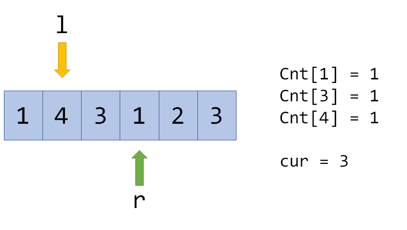
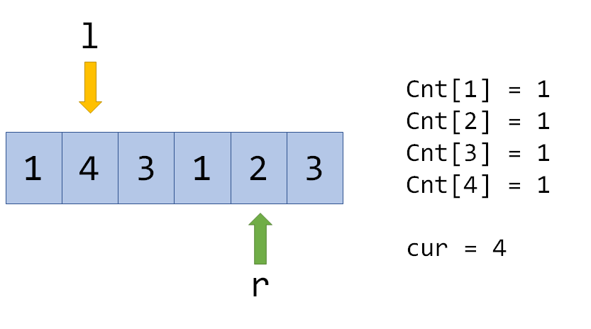

# 莫队

分块变形：莫队

## 例题 #1 引入

给出一个序列和若干查询l, r，问[l, r]中有多少个不同的数。

[算法学习笔记(24): 莫队](https://zhuanlan.zhihu.com/p/115243708)

这道题也可以用[树状数组](https://zhuanlan.zhihu.com/p/93795692)或[块状数组](https://zhuanlan.zhihu.com/p/114268236)来做，但用莫队的话思维难度会比较低。

## 讲解

我们用一个数组`Cnt[]`来记录每个数出现的次数，`cur` 表示当前区间的答案，例如：



现在转移到紧邻的区间就很简单了，例如转移到[l,r+1]：



Cnt[2]=0，说明添加了一个没出现过的数，所以cur变成4，但如果在这里再次向右转移：


这时Cnt[3]不为0，所以虽然Cnt[3]++，但是cur不再增长。

其他的转移都是类似的。容易发现，转移分为两种情况，往区间里**添**数，或者往区间里**删**数，所以可以写成两个函数：

```C++
void add(int p){//p为要添加的下标保证p与当前分块相邻
	if(!cnt[a[p]])cur++;
	cnt[a[p]]++;
}
void del(int p){
	if(cnt[a[p]]==1)cur--;
	cnt[a[p]]--;
}
```

对于区间的移动，若目标区间为[al,ar]，当前区间为[l,r]

```C++
while(l>al)add(--l);//al在l左边,l在当前分块中,l-1不在,所以先移动后添加
while(l<al)del(l++);//al在l右边,l在当前分块中但不在目标区间,所以先删除后移动
while(r>ar)del(r--);
while(r<ar)add(++r);
```

当然，如果知道al与l，ar与r的大小，可以删去一半。

初始化时，要先令l=1，r=0。

现在我们可以从一个区间的答案转移到另一个区间了，但是，如果直接在线查询，很有可能在序列两头“左右横跳”，到头来还不如朴素的$  O(n^2)$算法。但是，我们可以把查询离线下来（记录下来），然后，排个序……

问题来了，怎么排序？我们很容易想到以l为第一关键词，r为第二关键词排下序，但这样做效果并不是很好。莫涛大神给出的方法是，**分块**，然后按照`bel[l]` 为第一关键词，`bel[r]`为第二关键词排序。 这样，每两次询问间l和r指针移动的距离可以被有效地降低，整个算法的时间复杂度可以降到 $O(n \sqrt n)$ ！

（注释： `bel[i]`表示元素i归属哪个块）

莫队算法优化的核心是分块和排序。我们将大小为n的序列分为√n个块，从1到√n编号，然后根据这个对查询区间进行排序。一种方法是把查询区间按照**左端点所在块的序号从小到大**排个序，如果左端点所在块相同，再按**右端点从小到大**排序。排完序后我们再进行左右指针跳来跳去的操作

```C++
 bool operator<(const query &o) const // 重载<运算符，奇偶化排序
    {
        // 这里只需要知道每个元素归属哪个块，而块的大小都是sqrt(n)，所以可以直接用l/sq
        if (l / sq != o.l / sq) 
            return l < o.l;
        if (l / sq & 1)
            return r < o.r;
        return r > o.r;
    }
```

在$l / sq \& 1$中，`&`优先级低于`/`

如果$1/sq$为奇数,则上式为true

**与（&）**

规则：两个操作数对应二进制**位**同样为1 结果**位** 才为1，否则为0；

**分块前后时间复杂度解说**

分块前：

我们按照l进行排序，当l不变时，r可能会在l~n之间反复横跳，复杂度较高

分块后：

我们把所属的块相同的询问放在一起，按r从小到大排序

l可能会在块内反复横跳，但复杂度较小。而r是从小到大的，复杂度最高为$O(n-l)$也较小

较高>较小×较小，结果严谨证明得分块更优秀。


**奇偶性排序**

我们发现，当我们的l从一块跳到后面一块时，r要从偏右端跳回到最靠近l的那个r，然后又要再往右跳一边。这样就会重复走路。如果我们可以让r在“从偏右端跳回到最靠近l的那个r”过程中就把答案处理掉，就会优化一半的复杂度。

因此：如果`bel[l]` 是奇数，则将`r`顺序排序，否则将`r`逆序排序

## 例题 #2 小B的询问

小B 有一个长为 $n$ 的整数序列 $a$，值域为 $[1,k]$。
他一共有 $m$ 个询问，每个询问给定一个区间 $[l,r]$，求：
$\sum\limits_{i=1}^k c_i^2$

其中 $c_i$ 表示数字 $i$ 在 $[l,r]$ 中的出现次数。
小B请你帮助他回答询问。

【数据范围】
对于 $100\%$ 的数据，$1\le n,m,k \le 5\times 10^4$。

[zhuanlan.zhihu.com](https://zhuanlan.zhihu.com/p/115243708)

```C++
/*                                                                                
                      Keyblinds Guide
     				###################
      @Ntsc 2024

      - Ctrl+Alt+G then P : Enter luogu problem details
      - Ctrl+Alt+B : Run all cases in CPH
      - ctrl+D : choose this and dump to the next
      - ctrl+Shift+L : choose all like this
      - ctrl+B then ctrl+W: close all
      - Alt+la/ra : move mouse to pre/nxt pos'
	  
*/
#include <bits/stdc++.h>
#include <queue>
using namespace std;

#define rep(i, l, r) for (int i = l, END##i = r; i <= END##i; ++i)
#define per(i, r, l) for (int i = r, END##i = l; i >= END##i; --i)
#define pb push_back
#define mp make_pair
#define int long long
#define pii pair<int, int>
#define ps second
#define pf first

// #define innt int
// #define inr int
// #define mian main
// #define iont int

#define rd read()
int read(){
    int xx = 0, ff = 1;
    char ch = getchar();
    while (ch < '0' || ch > '9') {
		if (ch == '-')
			ff = -1;
		ch = getchar();
    }
    while (ch >= '0' && ch <= '9')
      xx = xx * 10 + (ch - '0'), ch = getchar();
    return xx * ff;
}
void write(int out) {
	if (out < 0)
		putchar('-'), out = -out;
	if (out > 9)
		write(out / 10);
	putchar(out % 10 + '0');
}

#define ell dbg('\n')
const char el='\n';
const bool enable_dbg = 1;
template <typename T,typename... Args>
void dbg(T s,Args... args) {
	if constexpr (enable_dbg){
    cerr << s << ' ';
		if constexpr (sizeof...(Args))
			dbg(args...);
	}
}

const int N = 3e5 + 5;
const int INF = 1e18;
const int M = 1e7;
const int MOD = 1e9 + 7;

struct node{
    int l,r,id;
}t[N];

int B;
int a[N];

int cnt[N],cnt2[N];


inline int getK(int x){
    return (x-1)/B+1;
}

bool cmp(node a, node b)
{
	if(getK(a.l) ^ getK(b.l)) return a.l < b.l;
	else if(getK(a.l) & 1) return a.r < b.r;
	else return a.r > b.r;
}


int ans;
int K;

void add(int x){
    if(a[x]>K)return ;
    ans-=cnt2[a[x]];
    cnt2[a[x]]+=2*cnt[a[x]]+1;
    cnt[a[x]]++;
    ans+=cnt2[a[x]];
}

void del(int x){
    if(a[x]>K)return ;
    ans-=cnt2[a[x]];
    cnt2[a[x]]+=-2*cnt[a[x]]+1;
    cnt[a[x]]--;
    ans+=cnt2[a[x]];

}

int anss[N];

void solve(){
    int n=rd,m=rd;
    K=rd;
    B=sqrt(n)+1;
    for(int i=1;i<=n;i++){
        a[i]=rd;
    }   
    for(int i=1;i<=m;i++){
        t[i].l=rd,t[i].r=rd;
        t[i].id=i;
    }

    // dbg("OK");
    sort(t+1,t+m+1,cmp);
    int cl=1,cr=0;
    for(int i=1;i<=m;i++){
        int l=t[i].l,r=t[i].r;

        // dbg("--",l,r,el);

        while(cl>l)add(--cl);
        while(cl<l)del(cl),cl++;
        while(cr>r)del(cr),cr--;        
        while(cr<r)cr++,add(cr);

        anss[t[i].id]=ans;
    }

    for(int i=1;i<=m;i++){
        cout<<anss[i]<<endl;
    }
}

signed main() {
    int T=1;
    while(T--){
    	solve();
    }
    return 0;
}
```

## 带修莫队

例题 #1【模板】莫队二次离线（第十四分块(前体)）

珂朵莉给了你一个序列 $a$，每次查询给一个区间 $[l,r]$，查询 $l \leq i< j \leq r$，且 $a_i \oplus a_j$ 的二进制表示下有 $k$ 个 $1$ 的二元组 $(i,j)$ 的个数。$\oplus$ 是指按位异或。

输入格式

第一行三个数表示 $n,m,k$。

第二行 $n$ 个数表示序列 $a$。

之后 $m$ 行，每行两个数 $l,r$ 表示一次查询。

对于100%的数据，$1 \leq n, m \leq 100000$，$0 \leq a_i, k < 16384$。

## 回滚莫队&不删除莫队

### 题目描述

给定一个序列，多次询问一段区间 $[l,r]$，求区间中**相同的数的最远间隔距离**。

序列中两个元素的**间隔距离**指的是**两个元素下标差的绝对值**。

### 应用

众所周知，我们在是实现莫队的时候要实现两个函数，一个是add，一个是del。但是如果我们遇到了难以实现快速del时，我们应该怎么办呢？我们可以试着使用回滚莫队。

回滚莫队就是通过双指针回到某一个历史版本，然后重新开始add操作来实现区间边界的del操作。

### 思路

根据莫队的性质，在一个询问块中，我们的r是单调的，但是l可能不是，所以我们现在只需要考虑一个l的问题就行了。那么为了减少删除，我们就可以让l一直指向L中的最大值（L是块中所有询问的l），并且让指针p,r去分别走到左右端点。并且在每一次需要左端点del时，就人p直接回到l后重新向左边扩散即可。

这个做法仅仅是在移动双指针时需要更多的代码，并不需要在排序上动手脚。

注意，回滚莫队并不代表着我们可以完全做到不删除，只是在减少删除的次数。还是回到上面的思路，我们在来到一个新块时，先设定cl为其中最大的l，此时我们注意到可能会有询问的r<cl，此时我们就需要删除[r+1,cl]之间的数据了。

这里我们发现，r无非只有两种情况——在当前块内和在当前块后面。那么对于第一种情况，我们直接暴力即可。第二种我们就可以使用上面的不删除策略了。

### 代码

注意每次pl回退时res也要回退。

我们的贡献可以分成三个部分

- 跨cl的

- 仅仅由cl左边产生的

- 仅仅由cl右边产生的

回退pl时，我们只能保留仅仅由cl右边产生的贡献，所以我们除了要维护全局贡献最大值res，还要维护仅仅由cl右边产生的贡献的最大值resr

```C++
/*                                                                                
                      Keyblinds Guide
     				###################
      @Ntsc 2024

      - Ctrl+Alt+G then P : Enter luogu problem details
      - Ctrl+Alt+B : Run all cases in CPH
      - ctrl+D : choose this and dump to the next
      - ctrl+Shift+L : choose all like this
      - ctrl+K then ctrl+W: close all
      - Alt+la/ra : move mouse to pre/nxt pos'
	  
*/
#include <bits/stdc++.h>
#include <queue>
using namespace std;

#define rep(i, l, r) for (int i = l, END##i = r; i <= END##i; ++i)
#define per(i, r, l) for (int i = r, END##i = l; i >= END##i; --i)
#define pb push_back
#define mp make_pair
#define int long long
#define pii pair<int, int>
#define ps second
#define pf first

// #define innt int
// #define inr int
// #define mian main
// #define iont int

#define rd read()
int read(){
    int xx = 0, ff = 1;
    char ch = getchar();
    while (ch < '0' || ch > '9') {
		if (ch == '-')
			ff = -1;
		ch = getchar();
    }
    while (ch >= '0' && ch <= '9')
      xx = xx * 10 + (ch - '0'), ch = getchar();
    return xx * ff;
}
void write(int out) {
	if (out < 0)
		putchar('-'), out = -out;
	if (out > 9)
		write(out / 10);
	putchar(out % 10 + '0');
}

#define ell dbg('\n')
const char el='\n';
const bool enable_dbg = 1;
template <typename T,typename... Args>
void dbg(T s,Args... args) {
	if constexpr (enable_dbg){
    cerr << s;
    if(1)cerr<<' ';
		if constexpr (sizeof...(Args))
			dbg(args...);
	}
}

const int N = 3e5 + 5;
const int INF = 1e18;
const int M = 1e7;
const int MOD = 1e9 + 7;
int B;

struct node{
    int l,r,id;
}t[N];
int a[N];
int ans[N];
int mxl[N];

inline int getK(int x){
    return (x-1)/B+1;
}

bool cmp(node a,node b){
    if(getK(a.l)==getK(b.l)){
        return a.r<b.r;
    }
    return getK(a.l)<getK(b.l);
}


int res=0;
int dislmn[N],disrmx[N];
int dislmx[N],disrmn[N];
int cl,cr;
int stk[N],top;
int stk2[N],top2;

int resr;

void update(int x){
    int v=a[x];
    res=max(res,dislmx[v]-dislmn[v]);
    res=max(res,disrmx[v]-disrmn[v]);
    res=max(res,disrmx[v]-dislmn[v]);
    resr=max(resr,disrmx[v]-disrmn[v]);
    
	// dbg(dislmx[v] - dislmn[v], disrmx[v] - disrmn[v], disrmx[v] - dislmn[v], el);

}

void addl(int x){
    dislmx[a[x]]=max(dislmx[a[x]],x);
    dislmn[a[x]]=min(dislmn[a[x]],x);
    stk[++top]=a[x];
    update(x);
}

void addr(int x){
    disrmx[a[x]]=max(disrmx[a[x]],x);
    disrmn[a[x]]=min(disrmn[a[x]],x);
    stk2[++top2]=a[x];
    update(x);
}

int b[N];
int f[N];


int loc[N],but[N],btop;

void solve(){
    for(int i=0;i<N;i++)dislmx[i]=-INF;
    for(int i=0;i<N;i++)disrmx[i]=-INF;
    for(int i=0;i<N;i++)disrmn[i]=INF;
    for(int i=0;i<N;i++)dislmn[i]=INF;
    for(int i=0;i<N;i++)loc[i]=-1;


    int n=rd;
    B=sqrt(n)+1;
    for(int i=1;i<=n;i++){
        b[i]=a[i]=rd;
    }   
    sort(b+1,b+n+1);
    int len=unique(b+1,b+n+1)-b;
    for(int i=1;i<=n;i++){
        a[i]=lower_bound(b+1,b+len+1,a[i])-b;
    }


    int m=rd;
    for(int i=1;i<=m;i++){
        t[i].l=rd,t[i].r=rd;
        mxl[getK(t[i].l)]=max(mxl[getK(t[i].l)],t[i].l);
        t[i].id=i;
    }

    sort(t+1,t+m+1,cmp);

    cl=0,cr=0;
    for(int i=1;i<=m;i++){
        int l=t[i].l,r=t[i].r;
        
        
        while(top){dislmn[stk[top]]=INF;dislmx[stk[top--]]=-INF;}
        
        if(cl!=mxl[getK(l)]){
            cr=cl=mxl[getK(l)];
            while(top2){disrmx[stk2[top2]]=-INF;disrmn[stk2[top2--]]=INF;}
            res=0;resr=0;
            addr(cl);
        }

        if(getK(l)==getK(r)){
            res=0;
            while(btop)loc[but[btop--]]=-1;
            for(int j=l;j<=r;j++){
                int v=a[j];
                if(loc[v]!=-1)res=max(res,j-loc[v]);
                else {loc[v]=j;but[++btop]=v;}
            }
            ans[t[i].id]=res;
            f[t[i].id]=1;

            continue;
        }
        
        int pl=cl;
        res=resr;

        while(pl>l)addl(--pl);
        while(cr<r)addr(++cr);
        ans[t[i].id]=res;
    }

    for(int i=1;i<=m;i++){
        cout<<ans[i]<<endl;
    }
}

signed main() {
    int T=1;
    while(T--){
    	solve();
    }
    return 0;
}
```

### 习题

[www.luogu.com.cn](https://www.luogu.com.cn/problem/AT_joisc2014_c)


