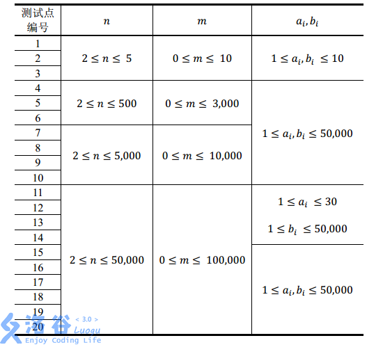
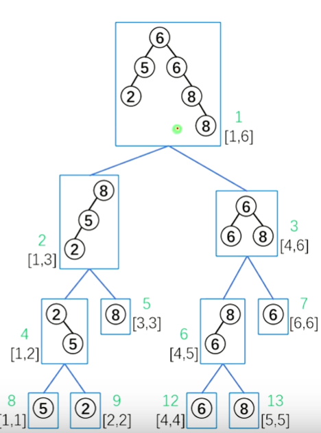
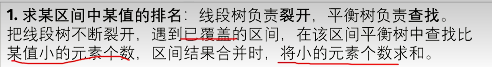
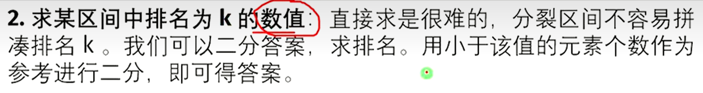
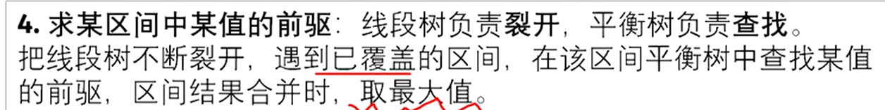
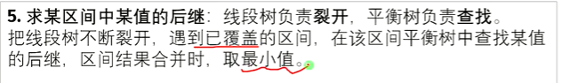

专题 | 高级の树上问题

# 目录

- 树链剖分

- 动态树（LCT）

- KD树

- 左偏树

- 二逼平衡树（树套树）

- 笛卡尔树	

- 虚树

# 规划

- P5829	【模板】失配树	

- P5180	【模板】支配树	

P3834	【模板】可持久化线段树 2	

提高+/省选-	

- P6329	【模板】点分树 | 震波	

提高+/省选-	

- P6177	Count on a tree II/【模板】树分块	

省选/NOI-	

- P6192	【模板】最小斯坦纳树	

省选/NOI-	

- P5043	【模板】树同构（[BJOI2015]树的同构）	

P5367	【模板】康托展开	

普及+/提高	

P6178	【模板】Matrix-Tree 定理	

省选/NOI-	

P6656	【模板】Runs	

NOI/NOI+/CTSC	

- P4897	【模板】最小割树（Gomory-Hu Tree）	

P3919	【模板】可持久化线段树 1（可持久化数组）	

- P4716	【模板】最小树形图	

P6091	【模板】原根

# 树链剖分

## 重链


注意，重儿子只能有**一个**

图中标绿的路径即为重链，注意，**每个叶子节点都是一条特殊的重链**

注意，只要子节点是重儿子，它就是重链，不对父节点有特殊要求


特殊性质：

- 所有重链所包含的节点相加，正好是所有的节点，不重不漏

- 注意标红的结论3：eg.对于路径5-2-1-4-8-12，就剖分为了4条重链

## 使用重链剖分解决LCA问题


未验证的代码

```C++
/*////////ACACACACACACAC///////////
       . Code by Ntsc .
       . WHY NOT????? .
/*////////ACACACACACACAC///////////

#include<bits/stdc++.h>
#define ll long long
#define db double
#define rtn return
using namespace std;

const int N=1e5;
const int M=1e5;
const int Mod=1e5;
const int INF=1e5;

int sz[N],fa[N],dep[N],son[N],top[N];
int n,Q;
vector<int> e[N];

void add(int a,int b){
	e[a].push_back(b);
}

void dfs1(int u,int faa){//初始值1,0 
	fa[u]=faa;dep[u]=dep[faa]+1;sz[u]=1;//更新fa,dep,设置sz初始值 
	for(int i=0;i<e[u].size();i++){
		int v=e[u][i];
		if(v==faa)continue;
		dfs1(v,u);//注意不是dfs1(v,faa) 
		sz[u]+=sz[v];//回溯,sz[u]原本为1 ,加上已经处理了v的子树大小
		if(sz[v]>sz[son[u]])son[u]=v;//更新重儿子,son[u]存到是之前已经扫描过的u的儿子中最重的那个,把它的sz与v的sz比对 
	}	
	return ;
} 

void dfs2(int u,int t){
	top[u]=t;
	if(!son[u])return;//没有重儿子,那么说明u为叶子节点. 
	dfs2(son[u],t);//先走重儿子,继承u的top(即t) 
	for(int i=0;i<e[i].size();i++){//扫描轻儿子 
		int v=e[u][i];
		if(v==fa[u]||v==son[u])continue;//筛选 
		dfs2(v,v);//轻儿子不能继承t,只能开一条新的重链 
	}
	return ;
}

int lca(int u,int v){
	while(top[u]!=top[v]){
		if(dep[top[u]]<dep[top[v]])swap(u,v);//交换,使得u所在的重链top恒比v的深 ,即保证是更深的在往上跳而不是浅的一直在往上跳 
		u=fa[top[u]];
	}
	if(dep[u]>dep[v])return v;
	else return u;//返回更浅的那个,就是原来u,v的LCA 
}
signed main(){
	cin>>n>>Q;
	for(int i=1;i<=n;i++){
		int a,b;
		cin>>a>>b;
		add(a,b);add(b,a);
	}
	//......
	return 0;
}

```

## 重链剖分+线段树实现树上修改与查询

**重链剖分部分**

[324 树上修改与查询 树链剖分_哔哩哔哩_bilibili](https://www.bilibili.com/video/BV18S4y1e7qb/?spm_id_from=333.999.0.0&vd_source=f45ea4e1e4b3b73d5f07c57b46c43aba)


在剖分之后我们将每个节点都一一映射一个新的编号。按照代码中dfs2的顺序，一条一条重链上的点深度由浅入深依次编号。

直观图，新的编号如图中的标红数字


代码

```C++

int sz[N],fa[N],dep[N],son[N],top[N];
int n,Q,cnt;
vector<int> e[N];

void add(int a,int b){
	e[a].push_back(b);
}

void dfs1(int u,int faa){//初始值1,0 
	fa[u]=faa;dep[u]=dep[faa]+1;sz[u]=1;//更新fa,dep,设置sz初始值 
	for(int i=0;i<e[u].size();i++){
		int v=e[u][i];
		if(v==faa)continue;
		dfs1(v,u);//注意不是dfs1(v,faa) 
		sz[u]+=sz[v];//回溯,sz[u]原本为1 ,加上已经处理了v的子树大小
		if(sz[v]>sz[son[u]])son[u]=v;//更新重儿子,son[u]存到是之前已经扫描过的u的儿子中最重的那个,把它的sz与v的sz比对 
	}	
	return ;
} 

void dfs2(int u,int t){
	top[u]=t;id[u]=++cnt;nw[cnt]=w[u];
	if(!son[u])return;//没有重儿子,那么说明u为叶子节点. 
	dfs2(son[u],t);//先走重儿子,继承u的top(即t) 
	for(int i=0;i<e[i].size();i++){//扫描轻儿子 
		int v=e[u][i];
		if(v==fa[u]||v==son[u])continue;//筛选 
		dfs2(v,v);//轻儿子不能继承t,只能开一条新的重链 
	}
	return ;
}
```

**线段树部分**

我们将原来的树映射为序列，然后使用线段树来维护这段序列

代码

```C++
struct tree{
	int l,r;//左右节点代表的区间
	ll add,sum;//标记与区间和
}tr[N<<2];

void pushup(int u){
	tr[u].sum=tr[u*2].sum+tr[u*2+1].sum;
}
void build(int u,int l,int r){
	tr[u]={l,r,0,nw[r]};
	if(l==r)return ;
	int mid=l+r;
	build(u*2,l,mid);
	build(u*2+1,mid+1,r);
	pushup(u);//回溯时更新
}
```

**查询**

目的：求树上从x到y最短路径上的节点和

举个例子


我们要查询树上节点10-12的路径权值和，首先使用类似LCA算法找到路径经过了那几条重链，分别是10-6-2，1-4-8，12

然后映射到线段树中，分别是区间[7,9][1,3][5]

我们使用线段树快速求出这些区间和即可，注意，其中的[7,9][5]都是一段完整的重链，我们在LCA时已经知道了其l,r，直接线段树即可，但[1,3]不是一段完整的重链。幸好，在LCA算法结束时，u=8，v=1，映射后就是3和1.因此在LCA结束后我们还需要把ans加上这一条不完整的链

```C++
int query_lca(int u,int v){
	ll res=0;
	while(top[u]!=top[v]){
		if(dep[top[u]]<dep[top[v]])swap(u,v);//交换,使得u所在的重链top恒比v的深 ,即保证是更深的在往上跳而不是浅的一直在往上跳 
		res+=query(id[top[u]],id[u]);//注意id[top[u]]<=id[u]
		u=fa[top[u]];
	}
	if(dep[u]>dep[v])swap(u,v);
	res+=query(id[u],id[v])
	return res;
}
```

**修改**

目的：将树上从x到y的最短路径上每个节点都加上k


代码和上方`query_lca`基本上一模一样。注意这里省略了**线段树**相关代码如：

- `update()`（`change()`）

- `query()`

- `pushdown()`懒标记

请自我回顾！

```C++
void updt_lca(int u,int v,int k){
	while(top[u]!=top[v]){
		if(dep[top[u]]<dep[top[v]])swap(u,v);//交换,使得u所在的重链top恒比v的深 ,即保证是更深的在往上跳而不是浅的一直在往上跳 
		update(1,id[top[u]],id[u],k);//注意id[top[u]]<=id[u]
		u=fa[top[u]];
	}
	if(dep[u]>dep[v])swap(u,v);
	update(1,id[u],id[v],k);
	return ;
}
```

例题

[www.luogu.com.cn](https://www.luogu.com.cn/problem/P3384)


如题，已知一棵包含 $N$ 个结点的树（连通且无环），每个节点上包含一个数值，需要支持以下操作：

- `1 x y z`，表示将树从 $x$ 到 $y$ 结点最短路径上所有节点的值都加上 $z$。

- `2 x y`，表示求树从 $x$ 到 $y$ 结点最短路径上所有节点的值之和。

- `3 x z`，表示将以 $x$ 为根节点的子树内所有节点值都加上 $z$。

- `4 x` 表示求以 $x$ 为根节点的子树内所有节点值之和

对于 $100\%$ 的数据： $1\le N \leq {10}^5$，$1\le M \leq {10}^5$，$1\le R\le N$，$1\le P \le 2^{31}-1$。

补充说明：观察可知，重链剖分后任意一棵子树的所有点会被映射到一个连续的区间中。这一点和dfs序颇有类似。

```C++
/*////////ACACACACACACAC///////////
       . Code  by  Ntsc .
       . Earn knowledge .
/*////////ACACACACACACAC///////////

#include<bits/stdc++.h>
#define int long long
#define db double
#define rtn return
using namespace std;

const int N=1e5+5;
const int M=1e5;
int MOD;
const int INF=1e5;

int n,m,p,q,r,T,s[N],ans;

int sz[N],fa[N],dep[N],son[N],top[N];
int w[N],nw[N],tail[N],id[N],Q,cnt;
int du[N],rt;
vector<int> e[N];

void add(int a,int b){
	e[a].push_back(b);
	e[b].push_back(a);//记得双向边 
	du[b]++;
}

void dfs1(int u,int faa){//初始值1,0 
	fa[u]=faa;dep[u]=dep[faa]+1;sz[u]=1;//更新fa,dep,设置sz初始值 
	for(int i=0;i<e[u].size();i++){
		int v=e[u][i];
		if(v==faa)continue;
		dfs1(v,u);//注意不是dfs1(v,faa) 
		sz[u]+=sz[v];//回溯,sz[u]原本为1 ,加上已经处理了v的子树大小
		if(sz[v]>sz[son[u]])son[u]=v;//更新重儿子,son[u]存到是之前已经扫描过的u的儿子中最重的那个,把它的sz与v的sz比对 
	}	
	return ;
} 

void dfs2(int u,int t){
	top[u]=t;id[u]=++cnt;nw[cnt]=w[u];
	tail[u]=id[u];
	if(!son[u])return;//没有重儿子,那么说明u为叶子节点. 
	dfs2(son[u],t);//先走重儿子,继承u的top(即t) 
	tail[u]=max(id[u],tail[son[u]]);
	for(int i=0;i<e[u].size();i++){//扫描轻儿子 
		int v=e[u][i];
		if(v==fa[u]||v==son[u])continue;//筛选 
		dfs2(v,v);//轻儿子不能继承t,只能开一条新的重链 
		tail[u]=max(id[u],tail[v]);//记录子树区间 
	}
	return ;
}

//SGT
struct tree{
	int l,r;//左右节点代表的区间
	int add,sum;//标记与区间和
}tr[N<<2];

void pushup(int u){
	tr[u].sum=(tr[u*2].sum+tr[u*2+1].sum)%MOD;
}

void addtag(int x,int tg){
	tr[x].add+=tg;
	tr[x].add%=MOD;
	tr[x].sum+=tg*(tr[x].r-tr[x].l+1);
	tr[x].sum%=MOD;
}

void pushdown(int x){
	if(tr[x].add){
		addtag(x<<1,tr[x].add);
		addtag(x<<1|1,tr[x].add);
		tr[x].add=0;
	}
}

void build(int u,int l,int r){
	tr[u]={l,r,0,0};
	if(l==r){
		tr[u]={l,r,0,nw[r]};return ;
	}
	int mid=l+r>>1;
	build(u*2,l,mid);
	build(u*2+1,mid+1,r);
	pushup(u);//回溯时更新
}


void update(int x,int pl,int pr,int k){
	if(tr[x].l>=pl&&tr[x].r<=pr){
		addtag(x,k);
		return ;
	}
	if(tr[x].l>pr||tr[x].r<pl)return ;
	
	pushdown(x);
	int mid=tr[x].l+tr[x].r>>1;
	if(pl<=mid)update(x<<1,pl,pr,k);
	if(pr>mid)update(x<<1|1,pl,pr,k);
	
	pushup(x);
}

int query(int x,int pl,int pr){
	if(tr[x].l>=pl&&tr[x].r<=pr){
		return tr[x].sum;
	}
	
	
	if(tr[x].l>pr||tr[x].r<pl)return 0;
	
	pushdown(x);
	int res=0;
	int mid=tr[x].l+tr[x].r>>1;
	if(pl<=mid)res+=query(x<<1,pl,pr);
	res%=MOD;
	if(pr>mid)res+=query(x<<1|1,pl,pr);
	res%=MOD;
	
	return res;
}

//spou
int query_road(int u,int v){
	int res=0;
	while(top[u]!=top[v]){
		if(dep[top[u]]<dep[top[v]])swap(u,v);//交换,使得u所在的重链top恒比v的深 ,即保证是更深的在往上跳而不是浅的一直在往上跳 
		res+=query(1,id[top[u]],id[u]);//注意id[top[u]]<=id[u]
		u=fa[top[u]];
	}
	if(dep[u]>dep[v])swap(u,v);
	res+=query(1,id[u],id[v]);
	res%=MOD;
	return res;
}

void updt_road(int u,int v,int k){
	while(top[u]!=top[v]){
		if(dep[top[u]]<dep[top[v]])swap(u,v);//交换,使得u所在的重链top恒比v的深 ,即保证是更深的在往上跳而不是浅的一直在往上跳 
		update(1,id[top[u]],id[u],k);//注意id[top[u]]<=id[u]
		u=fa[top[u]];
	}
	if(dep[u]>dep[v])swap(u,v);
	update(1,id[u],id[v],k);
	return ;
}

//debug

void debug(){
//	cerr<<"\ndebug = ";
//	for(int i=1;i<=n;i++){
//		cerr<<query(1,id[i],id[i])<<' ';
//	}
//	cerr<<"debug end\n";
//	
//	cerr<<"node v=";
//	for(int i=1;i<=n;i++)cerr<<nw[id[i]]<<' ';
//	cerr<<"node v end\n";
}


signed main(){
	cin>>n>>m>>rt>>MOD;
	for(int i=1;i<=n;i++){
		cin>>w[i];
	}
	
	for(int i=1;i<n;i++){
		int a,b;
		cin>>a>>b;
		add(a,b);
	}
	
//	for(int i=1;i<=n;i++){
//		if(!du[i]){
//			rt=i;break;//找根 
//		}
//	}
	
	dfs1(rt,0);
	dfs2(rt,rt);
	
//	cerr<<"sz[]=";
//	for(int i=1;i<=n;i++)cerr<<sz[i]<<' ';
//	cerr<<"sz[] endl\n"; 
	
//	cerr<<"rt= "<<rt<<endl;
	
//	for(int i=1;i<=n;i++)cerr<<"node "<<i<<" 's id = "<<id[i]<<" tail = "<<tail[i]<<endl;

	
//	cerr<<"start building...\n";
	
	build(1,1,n);
	
//	cerr<<"build finish\ninit ";
	debug();
	
	while(m--){
		int op,x,y,z;
		cin>>op>>x;
		if(op==1){
			cin>>y>>z;
			updt_road(x,y,z);
		}if(op==2){
			cin>>y;
			cout<<query_road(x,y)%MOD<<endl;
		}if(op==3){
			cin>>z;
			update(1,id[x],tail[x],z);
			
		}if(op==4){
			cout<<query(1,id[x],tail[x])%MOD<<endl;
		}
		
		debug();
	}
	
	return 0;
}


```

## 实链

见下方的LCT

---

**重链剖分**

把树拆分成若干条重链，用线段树这种静态数据结构来维护重链。通过对重链的拆分与组合，构造答案

**实链剖分**

把树拆分成若干条实链，用 splay 这种动态数据结构来维护实链。通过对实链的拆分与组合，构造答案

**构建**

一个节点只能选（任意）一个儿子做实儿子，其他都是虚儿子。

实边：父节点与实儿子之间的边，是双向边。

虚边：由虚儿子指向父节点的边，是单向边。（认父不认子，下面会说及是一个splay的根节点指向另外一颗splay中的某个节点）

实链：由实边构成的链。每条实链的节点深度是严格递增的。


# 动态树（LCT）

请先学习**Splay**  [专题 | 二叉查找树与平衡树](https://flowus.cn/9fdf7962-0706-4e16-9e5e-250e2f144e09)

[【详解】动态树 LCT_哔哩哔哩_bilibili](https://www.bilibili.com/video/BV18v4y1r7pd/?spm_id_from=333.337.search-card.all.click&vd_source=f45ea4e1e4b3b73d5f07c57b46c43aba)

[165 动态树 Link Cut Tree_哔哩哔哩_bilibili](https://www.bilibili.com/video/BV14S4y1x7rr/?spm_id_from=333.999.0.0)

给定 $n$ 个点以及每个点的权值，要你处理接下来的 $m$ 个操作。
操作有四种，操作从 $0$ 到 $3$ 编号。点从 $1$ 到 $n$ 编号。

- `0 x y` 代表询问从 $x$ 到 $y$ 的路径上的点的权值的 $\text{xor}$ 和。保证 $x$ 到 $y$ 是联通的。

- `1 x y` 代表连接 $x$ 到 $y$，若 $x$ 到 $y$ 已经联通则无需连接。

- `2 x y` 代表删除边 $(x,y)$，不保证边 $(x,y)$ 存在。

- `3 x y` 代表将点 $x$ 上的权值变成 $y$。

对于全部的测试点，保证：

- $1 \leq n \leq 10^5$，$1 \leq m \leq 3 \times 10^5$，$1 \leq a_i \leq 10^9$。

- 对于操作 $0, 1, 2$，保证 $1 \leq x, y \leq n$。

- 对于操作 $3$，保证 $1 \leq x \leq n$，$1 \leq y \leq 10^9$。

### XOR 异或运算

XOR 的运算真值表如下。

```C++
0 ^ 0 = 0
0 ^ 1 = 1
1 ^ 0 = 1
1 ^ 1 = 0
```

## 构建方法


辅助树：由若干 splay 构成，与原树是等价的，只需要维护辅助树

    性质：每条实链用一个 splay 维护中序遍历按深度严格递增

    注意

    - （ 1 ）区分树根（仅一个）和 splay 的根（多个）。

    - （ 2 ）虚边从下面 splay 的根指向上面 splay 中的父亲。（单向通道）

    - （ 3 ）实边和虚边是动态变化的。

一些辅助树构成了 Link cut Tree (LCT), 其维护的是整个森林


## 构造

### 预备函数

判断dianx是不是一个splay的树根，防止其向另外一颗splay连接实边

```C++
bool notrt(int x){
    return !(ls(fa(x))==x||rs(fa(x))==x);
}
```

### splay

先看旋转


原来的

```C++
void rotate(int x){
	int y=t[x].fa,z=t[y].fa;
	int k=(tr[y].s[1]==x);//这里很重要!如果true,说明x为y的左儿子,应该继续左旋
	//以下代码左右旋通用,我们以右旋为例
	tr[y].s[k]=tr[x].s[k^1];//将y的左儿子设置为x的右儿子(1)
	tr[tr[y].s[k]].fa=y;
	tr[x].s[k^1]=y;//将x的右儿子设置为y(2)
	tr[y].fa=x;
	tr[z].s[(tr[z].s[1]==y)]=x;//自动判断原来的y是z的左/右儿子
	tr[x].fa=z;//更新z的儿子,x的新父亲(3)
	pushup(x);pushup(y);//别忘了修改信息
}
```


新的

```C++
void rotate(int x){
	int y=t[x].fa,z=t[y].fa;
	int k=(tr[y].s[1]==x);//这里很重要!如果true,说明x为y的左儿子,应该继续左旋
	if(notrt(y)tr[z].s[(tr[z].s[1]==y)]=x;//自动判断原来的y是z的左/右儿子
	tr[x].fa=z;//更新z的儿子,x的新父亲(3)
	tr[y].s[k]=tr[x].s[k^1];//将y的左儿子设置为x的右儿子(1)
	tr[tr[y].s[k]].fa=y;
	tr[x].s[k^1]=y;//将x的右儿子设置为y(2)
	tr[y].fa=x;
	
	pushup(x);pushup(y);//别忘了修改信息
}
```

为什么要把第3部放到第一步并且还要判断呢？我们看这个例子


判断：假设不判根，那么我们就会将z向y连边，这样我们就把两颗splay错误合并了！

提前：如果我们不提前，那么我们就会在前面的旋转中把x←10,y←12，此时y的父亲变成了x，我们查看if发现是成立的，那么我们就会把z向x连边就又寄了。

看splay


原来的

```C++
void splay(int x,int k){//将x旋转到k下方
	while(tr[x].fa!=k){
		int y=tr[x].fa,z=tr[y].fa;
		//第一次旋转,要分情况
		if(z!=k)//若z=k,说明只需要做单旋了(说明目标点就为x的父亲)
			if((tr[y].s[0]==x)^(tr[z].s[0]==y)){//若y为z左,x为y左或者y为z右,x为y右,异或和均为0,表示是直线型
				rotate(x);
			}else rotate(y);
		//第二次旋转,都是旋转x 
		rotata(x);
	}
	if(k==0)rt=x;//如果k=0说明x被旋转到了根节点
}
```


新的

```C++
void pushall(int x){
    if(notrt(x))pushall(fa(X));
    pushdown(X);
}

void splay(int x){//将x旋转到k下方
    pushall(x);
	while(notrt(x)){
		int y=tr[x].fa,z=tr[y].fa;
		//第一次旋转,要分情况
		if(notrt(y))//若z=k,说明只需要做单旋了(说明目标点就为x的父亲)
			if((tr[y].s[0]==x)^(tr[z].s[0]==y)){//若y为z左,x为y左或者y为z右,x为y右,异或和均为0,表示是直线型
				rotate(x);
			}else rotate(y);
		//第二次旋转,都是旋转x 
		rotata(x);
	}
}
```

### access

打通从 x 到树根的路径，把路径变成一条实链。（为了维护性质，同时也伴随着一些实际边变成虚拟边）

从下到逐步更新 splay

1. 把当前点转到当前 splay 的根

2 ．把当前点的右儿子换成之前的节点

3 ，更新当前点的信息

4 ．把当前点换成当前点的父亲，继续操作

功能：完成实链的拆分与重组把不在路径上的点踢出去，把路径上的虚边变实际边。

```C++
void access(int x){
    for(int y=0;x;){
        splay(x);
        rs(x)=y;
        pushup(x);
        y=x,x=fa(x);
    }
}
```

### makert

换根．把指定点 x 变成树根。

把 x 提起来，让 x 成为深度最小的点

在辅助树上，换根=access+splay+翻转

步骤：

1. 使x到rt成为一条实际链，使x和rt在同一颗splay中

2. 将x旋转到rt的位置

3. 将整棵splay翻转（为什么？？）

```C++
void makert(x){
    access(x);
  splay(x);
  tr[x].tag^=1;//翻转标记
}
```

### split

把从×到 y 的路径分离出平，把路径变成一条实链，把 y 转到根

```C++
void split(int x,int y){
    makert(x);
    access(y);
    splay(y);
}
```

### findroot(x)

找根．把x在辅助树上的根找出来，并转到根（？？什么意思）

```C++
int findrt(int x){
    access(x);
    splay(x);
    while(ls(x))pushdown(x),x=ls(x);
    splay(x);
    return x;
}
```

### link

条件： y 与×不再同一颗splay中

原因：x是 splay 的根 ，y 不是 splay的根，故虚边应该从x指向 y

```C++
void link(int x,int y){
  makert(x);
  if(findrt(y)!=x)fa(x)=y;
 // makert(x);
  //if(finrt(y)==x&&fa(y)==x&&!ls(y))rs(x)=fa(y)=0,pushup(x);
}
```

### cut

状态：×必在 根的位置 

条件： y 与又在同一棵树中且 y 是x的后继

```C++
void link(int x,int y){
  makert(x);
  if(finrt(y)==x&&fa(y)==x&&!ls(y))rs(x)=fa(y)=0,pushup(x);
}
```

### change

修改点x的权值

```C++
void change(int x,int v){
  splay(x);//把x转到splay的根上（为何）
  tr[x].v=v;
  pushup(x);
}
```

## LCT搭建动态结构线段树

[国家集训队] Tree II

一棵 $n$ 个点的树，每个点的初始权值为 $1$。
对于这棵树有 $q$ 个操作，每个操作为以下四种操作之一：

- `+ u v c`：将 $u$ 到 $v$ 的路径上的点的权值都加上自然数 $c$；

- `- u1 v1 u2 v2`：将树中原有的边 $(u_1,v_1)$ 删除，加入一条新边 $(u_2,v_2)$，保证操作完之后仍然是一棵树；

- `* u v c`：将 $u$ 到 $v$ 的路径上的点的权值都乘上自然数 $c$；

- `/ u v`：询问 $u$ 到 $v$ 的路径上的点的权值和，将答案对 $51061$ 取模。

【数据范围】
对于 $100\%$ 的数据，$1\le n,q \le 10^5$，$0\le c \le 10^4$。

By (伍一鸣)

---

应该说是LCT板子了，在splay的某个节点上维护tag和区间信息，在pushup和pushdown上做一些修改。

```C++
// 动态线段树的LCT实现

#include <bits/stdc++.h>
#define rep(l, tagr, i) for (int i = l, END##i = tagr; i <= END##i; ++i)
#define per(tagr, l, i) for (int i = tagr, END##i = l; i >= END##i; --i)
using namespace std;
#define pb push_back
// #define mpy make_pair
#define int long long
#define pii pair<int, int>
#define ps b
#define pf a

#define X(j) i[j]
#define Y(j) (dp[j] + (i[j] + L) * (i[j] + L))
#define lc tr[x][0]
#define rc tr[x][1]
#define rd read()
int read() {
  int xx = 0, ff = 1;
  char ch = getchar();
  while (ch < '0' || ch > '9') {
    if (ch == '-')
      ff = -1;
    ch = getchar();
  }
  while (ch >= '0' && ch <= '9')
    xx = xx * 10 + (ch - '0'), ch = getchar();
  return xx * ff;
}
void write(int out) {
  if (out < 0)
    putchar('-'), out = -out;
  if (out > 9)
    write(out / 10);
  putchar(out % 10 + '0');
}

#define MOD 51061
const int N=100009;

#define mul(x) x*=tr;x%=MOD
#define add(x,tr) x+=tr;x%=MOD
unsigned int n,fa[N],tr[N][2],v[N],s[N],sz[N],tagm[N],taga[N],stk[N];
bool tagr[N];

namespace LCT{

    bool notrt(int x){
        return tr[fa[x]][0]==x||tr[fa[x]][1]==x;
    }
    void pushup(int x){
        s[x]=(s[lc]+s[rc]+v[x])%MOD;
        sz[x]=sz[lc]+sz[rc]+1;
    }
    void revtag(int x){//翻转
        int t=lc;lc=rc;rc=t;tagr[x]^=1;
    }
    void multag(int x,int tr){//乘
        mul(s[x]);mul(v[x]);mul(tagm[x]);mul(taga[x]);
    }
    void addtag(int x,int tr){//加
        add(s[x],tr*sz[x]);add(v[x],tr);add(taga[x],tr);
    }
    void pushdown(int x){
        if(tagm[x]!=1)multag(lc,tagm[x]),multag(rc,tagm[x]),tagm[x]=1;
        if(taga[x])   addtag(lc,taga[x]),addtag(rc,taga[x]),taga[x]=0;
        if(tagr[x])   {if(lc)revtag(lc);if(rc)revtag(rc);tagr[x]=0;}
    }
    void rotate(int x){
        int y=fa[x],z=fa[y],k=tr[y][1]==x,w=tr[x][!k];
        if(notrt(y))tr[z][tr[z][1]==y]=x;tr[x][!k]=y;tr[y][k]=w;
        if(w)fa[w]=y;fa[y]=x;fa[x]=z;
        pushup(y);
    }
    void splay(int x){
        int y=x,z=0;
        stk[++z]=y;
        while(notrt(y))stk[++z]=y=fa[y];
        while(z)pushdown(stk[z--]);
        while(notrt(x)){
            y=fa[x];z=fa[y];
            if(notrt(y))
                rotate((tr[y][0]==x)^(tr[z][0]==y)?x:y);
            rotate(x);
        }
        pushup(x);
    }
    void access(int x){
        for(int y=0;x;x=fa[y=x])
            splay(x),rc=y,pushup(x);
    }
    void makeroot(int x){
        access(x);
        splay(x);
        revtag(x);
    }
    void split(int x,int y){
        makeroot(x);
        access(y);
        splay(y);
    }
    void link(int x,int y){
        makeroot(x);fa[x]=y;
    }
    void cut(int x,int y){
        split(x,y);fa[x]=tr[y][0]=0;
    }
}

using namespace LCT;
signed main()
{
    char ch;
    n=rd;
    int q=rd,i,a,b,k;

    for(i=1;i<=n;++i)v[i]=sz[i]=tagm[i]=1;
    for(i=1;i<n;++i){
        a=rd,b=rd;
        link(a,b);
    }
    while(q--){
        cin>>ch;
        switch(ch){
        case '+':
            a=rd,b=rd,k=rd;
            split(a,b);addtag(b,k);
            break;
        case '-':
            a=rd,b=rd;cut(a,b);
            a=rd,b=rd;link(a,b);
            break;
        case '*':
            a=rd,b=rd,k=rd;
            split(a,b);multag(b,k);
            break;
        case '/':
            a=rd,b=rd;
            split(a,b);
            printf("%lld\n",s[b]);
        }
    }
    return 0;
}

```

## 动态维护连通性&双联通分量

可以说是并查集的升级，因为并查集只能连不能断

---


[SDOI2008] 洞穴勘测

辉辉热衷于洞穴勘测。

某天，他按照地图来到了一片被标记为JSZX的洞穴群地区。经过初步勘测，辉辉发现这片区域由n个洞穴（分别编号为1到n）以及若干通道组成，并且每条通道连接了恰好两个洞穴。假如两个洞穴可以通过一条或者多条通道按一定顺序连接起来，那么这两个洞穴就是连通的，按顺序连接在一起的这些通道则被称之为这两个洞穴之间的一条路径。 洞穴都十分坚固无法破坏，然而通道不太稳定，时常因为外界影响而发生改变，比如，根据有关仪器的监测结果，123号洞穴和127号洞穴之间有时会出现一条通道，有时这条通道又会因为某种稀奇古怪的原因被毁。

辉辉有一台监测仪器可以实时将通道的每一次改变状况在辉辉手边的终端机上显示：

如果监测到洞穴u和洞穴v之间出现了一条通道，终端机上会显示一条指令 `Connect u v`

如果监测到洞穴u和洞穴v之间的通道被毁，终端机上会显示一条指令 `Destroy u v`

经过长期的艰苦卓绝的手工推算，辉辉发现一个奇怪的现象：无论通道怎么改变，任意时刻任意两个洞穴之间至多只有一条路径。

因而，辉辉坚信这是由于某种本质规律的支配导致的。因而，辉辉更加夜以继日地坚守在终端机之前，试图通过通道的改变情况来研究这条本质规律。 然而，终于有一天，辉辉在堆积成山的演算纸中崩溃了……他把终端机往地面一砸（终端机也足够坚固无法破坏），转而求助于你，说道：“你老兄把这程序写写吧”。

辉辉希望能随时通过终端机发出指令 `Query u v`，向监测仪询问此时洞穴u和洞穴v是否连通。现在你要为他编写程序回答每一次询问。 已知在第一条指令显示之前，JSZX洞穴群中没有任何通道存在。

输入格式

第一行为两个正整数n和m，分别表示洞穴的个数和终端机上出现过的指令的个数。 以下m行，依次表示终端机上出现的各条指令。每行开头是一个表示指令种类的字符串s（"Connect”、”Destroy”或者”Query”，区分大小写），之后有两个整数u和v (1≤u, v≤n) 分别表示两个洞穴的编号。

输出格式

对每个Query指令，输出洞穴u和洞穴v是否互相连通：是输出”Yes”，否则输出”No”。（不含双引号）

100%的数据满足n≤10000, m≤200000

保证所有Destroy指令将摧毁的是一条存在的通道

本题输入、输出规模比较大，建议c\c++选手使用scanf和printf进行I\O操作以免超时

---

```C++
// 动态线段树的LCT实现

#include <bits/stdc++.h>
#define rep(l, tagr, i) for (int i = l, END##i = tagr; i <= END##i; ++i)
#define per(tagr, l, i) for (int i = tagr, END##i = l; i >= END##i; --i)
using namespace std;
#define pb push_back
// #define mpy make_pair
#define int long long
#define pii pair<int, int>
#define ps b
#define pf a

#define X(j) i[j]
#define Y(j) (dp[j] + (i[j] + L) * (i[j] + L))
#define lc tr[x][0]
#define rc tr[x][1]
#define rd read()
int read() {
  int xx = 0, ff = 1;
  char ch = getchar();
  while (ch < '0' || ch > '9') {
    if (ch == '-')
      ff = -1;
    ch = getchar();
  }
  while (ch >= '0' && ch <= '9')
    xx = xx * 10 + (ch - '0'), ch = getchar();
  return xx * ff;
}
void write(int out) {
  if (out < 0)
    putchar('-'), out = -out;
  if (out > 9)
    write(out / 10);
  putchar(out % 10 + '0');
}

#define MOD 51061
const int N = 300005;

int n, m;
int val[N];
namespace LCT {
  int fa[N];
  int sons[N][2];
  int rev[N];
  int q[N];
  int top;
  void pushdown(int id) {
    int l = sons[id][0], r = sons[id][1];
    if (rev[id]) {
      rev[l] ^= 1;
      rev[r] ^= 1;
      rev[id] ^= 1;
      swap(sons[id][0], sons[id][1]);
    }
  }
  bool notrt(int id) { return sons[fa[id]][0] == id || sons[fa[id]][1] == id; }
  void rotate(int id) {
    int f = fa[id], ff = fa[f], l, r;
    if (sons[f][0] == id)
      l = 0;
    else
      l = 1;
    r = l ^ 1;
    if (notrt(f)) {
      if (sons[ff][0] == f)
        sons[ff][0] = id;
      else
        sons[ff][1] = id;
    }
    fa[id] = ff;
    fa[f] = id;
    fa[sons[id][r]] = f;
    sons[f][l] = sons[id][r];
    sons[id][r] = f;
  }
  void splay(int id) {
    top = 1;
    q[top] = id;
    for (int i = id; notrt(i); i = fa[i])
      q[++top] = fa[i];
    for (int i = top; i; --i)
      pushdown(q[i]);
    int f, ff;
    while (notrt(id)) {
      f = fa[id];
      ff = fa[f];
      if (notrt(f)) {
        if ((sons[f][0] == id) ^ (sons[ff][0] == f))
          rotate(id);
        else
          rotate(f);
      }
      rotate(id);
    }
  }
  void access(int id) {
    for (int t = 0; id; t = id, id = fa[id])
      splay(id), sons[id][1] = t;
  }
  void makeroot(int id) {
    access(id);
    splay(id);
    rev[id] ^= 1;
  }
  int findroot(int id) {
    access(id);
    splay(id);
    while (sons[id][0])
      id = sons[id][0];
    return id;
  }
  void split(int x, int y) {
    makeroot(x);
    access(y);
    splay(y);
  }
  void cut(int x, int y) {
    split(x, y);
    if (sons[y][0] == x && sons[x][1] == 0)
      sons[y][0] = 0, fa[x] = 0;
  }
  void link(int x, int y) {
    makeroot(x);
    fa[x] = y;
  }
} // namespace LCT

using namespace LCT;
signed main() {
  scanf("%d%d", &n, &m);
  while (m--) {
    char op;
    cin >> op;
    int x = rd, y = rd;
    if (op == 'Q')
      puts((findroot(x) == findroot(y)) ? "Yes" : "No");
    if (op == 'D')
      cut(x, y);
    if (op == 'C')
      link(x, y);
  }
}

```

## 维护边权（常用于维护生成树）

[NOI2014] 魔法森林

[hack数据的提交link](https://www.luogu.com.cn/problem/U163126)

为了得到书法大家的真传，小 E 同学下定决心去拜访住在魔法森林中的隐士。魔法森林可以被看成一个包含 $n$ 个节点 $m$ 条边的无向图，节点标号为 $1,2,3,…,n$，边标号为 $1,2,3,…,m$。初始时小 E 同学在 $1$ 号节点，隐士则住在 $n$ 号节点。小 E 需要通过这一片魔法森林，才能够拜访到隐士。

魔法森林中居住了一些妖怪。每当有人经过一条边的时候，这条边上的妖怪 就会对其发起攻击。幸运的是，在 $1$ 号节点住着两种守护精灵：A 型守护精灵与 B 型守护精灵。小 E 可以借助它们的力量，达到自己的目的。

只要小 E 带上足够多的守护精灵，妖怪们就不会发起攻击了。具体来说，无向图中的每一条边 $e_i$ 包含两个权值 $a_i$ 与 $b_i$ 。若身上携带的 A 型守护精灵个数不少于 $a_i$ ，且 B 型守护精灵个数不少于 $b_i$ ，这条边上的妖怪就不会对通过这条边的人发起攻击。当且仅当通过这片魔法森林的过程中没有任意一条边的妖怪向 小 E 发起攻击，他才能成功找到隐士。

由于携带守护精灵是一件非常麻烦的事，小 E 想要知道，要能够成功拜访到 隐士，最少需要携带守护精灵的总个数。守护精灵的总个数为 A 型守护精灵的个数与 B 型守护精灵的个数之和。

输入格式

输入文件的第 $1$ 行包含两个整数 $n,m$，表示无向图共有 $n$ 个节点，$m$ 条边。 接下来 $m$ 行，第 $i+1$ 行包含 $4$ 个正整数 $X_i,Y_i,a_i,b_i$，描述第 $i$ 条无向边。 其中 $X_i$ 与 $Y_i$ 为该边两个端点的标号，$a_i$ 与 $b_i$ 的含义如题所述。 注意数据中可能包含重边与自环。

输出格式

输出一行一个整数：如果小 E 可以成功拜访到隐士，输出小 E 最少需要携 带的守护精灵的总个数；如果无论如何小 E 都无法拜访到隐士，输出 `-1`。



```C++
// 维护边权（维护生成树）的LCT实现

#include <bits/stdc++.h>
#define rep(l, tagr, i) for (int i = l, END##i = tagr; i <= END##i; ++i)
#define per(tagr, l, i) for (int i = tagr, END##i = l; i >= END##i; --i)
using namespace std;
#define pb push_back
// #define mpy make_pair
#define int long long
#define pii pair<int, int>
#define ps b
#define pf a

#define X(j) i[j]
#define Y(j) (dp[j] + (i[j] + L) * (i[j] + L))
#define lc tr[x][0]
#define rc tr[x][1]
#define rd read()
int read() {
  int xx = 0, ff = 1;
  char op = getchar();
  while (op < '0' || op > '9') {
    if (op == '-')
      ff = -1;
    op = getchar();
  }
  while (op >= '0' && op <= '9')
    xx = xx * 10 + (op - '0'), op = getchar();
  return xx * ff;
}
void write(int out) {
  if (out < 0)
    putchar('-'), out = -out;
  if (out > 9)
    write(out / 10);
  putchar(out % 10 + '0');
}

const int N = 200000;
const int MOD = 131072;
const int INF = 1e9;

int f[N], tr[N][2], mx[N];
bool r[N];

struct edge {
  int u, v, a, b;
  inline bool operator<(edge x) const { return a < x.a; }

} e[N]; 

namespace LCT{

  inline bool notrt(int x) { return tr[f[x]][0] == x || tr[f[x]][1] == x; }
  void pushup(int x) {
    mx[x] = x;
    if (e[mx[x]].b < e[mx[lc]].b)
      mx[x] = mx[lc];
    if (e[mx[x]].b < e[mx[rc]].b)
      mx[x] = mx[rc]; 
  }
  void pushdown(int x) {
    if (r[x]) {
      int t = lc;
      lc = rc;
      rc = t;
      r[lc] ^= 1;
      r[rc] ^= 1;
      r[x] = 0;
    }
  }
  void pushall(int x) {
    if (notrt(x))
      pushall(f[x]);
    pushdown(x);
  }
  void rotate(int x) {
    int y = f[x], z = f[y], k = tr[y][1] == x, w = tr[x][!k];
    if (notrt(y))
      tr[z][tr[z][1] == y] = x;
    tr[x][!k] = y;
    tr[y][k] = w;
    f[w] = y;
    f[y] = x;
    f[x] = z;
    pushup(y);
  }
  void splay(int x) {
    int y = x;
    pushall(x);
    while (notrt(x)) {
      if (notrt(y = f[x]))
        rotate((tr[y][0] == x) ^ (tr[f[y]][0] == y) ? x : y);
      rotate(x);
    }
    pushup(x);
  }
  void access(int x) {
    for (int y = 0; x; x = f[y = x])
      splay(x), rc = y, pushup(x);
  }
  void makert(int x) {
    access(x);
    splay(x);
    r[x] ^= 1;
  }
  inline int findrt(int x) {
    access(x);
    splay(x);
    while (lc)
      x = lc;
    return x;
  }
  void link(int x) {
    int y = e[x].u, z = e[x].v;
    makert(z);
    f[f[z] = x] = y;
  } 
  void cut(int x) {
    access(e[x].v);
    splay(x);
    lc = rc = f[lc] = f[rc] = 0;
    pushup(x);
  }
}

using namespace LCT;
signed main() {
  int n = rd, m = rd, i, y, z, ans = INF; 

  for (i = 1; i <= m; ++i)
    e[i].u = rd, e[i].v = rd, e[i].a = rd, e[i].b = rd, e[i].u |= MOD,
    e[i].v |= MOD; 
  sort(e + 1, e + m + 1);
  for (i = 1; i <= m; ++i) {
    if ((y = e[i].u) == (z = e[i].v))
      continue;
    makert(y);
    if (y != findrt(z))
      link(i);
    else if (e[i].b < e[mx[z]].b)
      cut(mx[z]), link(i);
    makert(1 | MOD);
    if ((1 | MOD) == findrt(n | MOD))
      ans=min(ans, e[i].a + e[mx[n | MOD]].b);
  }
  printf("%lld\n", ans == INF ? -1 : ans);
  return 0;
}

```

## 维护子树信息

[BJOI2014] 大融合

题目描述

小强要在 $N$ 个孤立的星球上建立起一套通信系统。这套通信系统就是连接 $N$ 个点的一个树。

这个树的边是一条一条添加上去的。

在某个时刻，一条边的负载就是它所在的当前能够联通的树上路过它的简单路径的数量。


例如，在上图中，现在一共有了 $5$ 条边。其中，$(3,8)$ 这条边的负载是 $6$，因为有六条简单路径 $2-3-8$,$2-3-8-7$,$3-8,3-8-7$,$4-3-8$,$4-3-8-7$ 路过了 $(3,8)$。

现在，你的任务就是随着边的添加，动态的回答小强对于某些边的负载的询问。

输入格式

第一行包含两个整数  $N, Q$,表示星球的数量和操作的数量。星球从 $1$ 开始编号。

接下来的 $Q$  行，每行是如下两种格式之一：

- `A x y` 表示在 $x$ 和 $y$ 之间连一条边。保证之前 $x$ 和 $y$ 是不联通的。

- `Q x y`表示询问 $(x,y)$ 这条边上的负载。保证 $x$ 和 $y$ 之间有一条边。

 输出格式

对每个查询操作，输出被查询的边的负载。

对于所有数据，$1≤N,Q≤10^5$

---

```C++
// 动态线段树的LCT实现

#include <bits/stdc++.h>
#define rep(l, tagr, i) for (int i = l, END##i = tagr; i <= END##i; ++i)
#define per(tagr, l, i) for (int i = tagr, END##i = l; i >= END##i; --i)
using namespace std;
#define pb push_back
// #define mpy make_pair
#define int long long
#define pii pair<int, int>
#define ps b
#define pf a

#define X(j) i[j]
#define Y(j) (dp[j] + (i[j] + L) * (i[j] + L))
#define lc tr[x][0]
#define rc tr[x][1]
#define rd read()
int read() {
  int xx = 0, ff = 1;
  char op = getchar();
  while (op < '0' || op > '9') {
    if (op == '-')
      ff = -1;
    op = getchar();
  }
  while (op >= '0' && op <= '9')
    xx = xx * 10 + (op - '0'), op = getchar();
  return xx * ff;
}
void write(int out) {
  if (out < 0)
    putchar('-'), out = -out;
  if (out > 9)
    write(out / 10);
  putchar(out % 10 + '0');
}


const int N=100009;
int fa[N],tr[N][2],sz[N],sum[N];
bool rtag[N];

namespace LCT{

  inline bool notrt(int x){return tr[fa[x]][0]==x||tr[fa[x]][1]==x;}
  void pushup(int x){
    sum[x]=sum[lc]+sum[rc]+sz[x]+1;
  }
  void pushdown(int x){
    if(rtag[x]){
      int t=lc;lc=rc;rc=t;
      rtag[lc]^=1;rtag[rc]^=1;rtag[x]=0;
    }
  }
  void pushall(int x){
    if(notrt(x))pushall(fa[x]);
    pushdown(x);
  }
  void rotate(int x){
    int y=fa[x],z=fa[y],k=tr[y][1]==x,w=tr[x][!k];
    if(notrt(y))tr[z][tr[z][1]==y]=x;tr[x][!k]=y;tr[y][k]=w;
    fa[w]=y;fa[y]=x;fa[x]=z;
    pushup(y);
  }
  void slope(int x){
    pushall(x);
    while(notrt(x))rotate(x);
    pushup(x);
  }
  void access(int x){
    for(int y=0;x;x=fa[y=x]){
      slope(x);
      sz[x]+=sum[rc];
      sz[x]-=sum[rc=y];
    }
  }
  void makeroot(int x){
    access(x);slope(x);
    rtag[x]^=1;
  }
  void split(int x,int y){
    makeroot(x);
      access(y);slope(y);
  }
  void link(int x,int y){
    split(x,y);
    fa[x]=y;
    sz[y]+=sum[x];
    pushup(y);
  }
}

using namespace LCT;

signed main(){
	int n=rd,q=rd,u,v;
	for(int i=1;i<=n;++i)sum[i]=1;
	while(q--){
    char op;
    cin>>op;
    u=rd,v=rd;
		if(op=='A')link(u,v);
		else{
			split(u,v);
			printf("%lld\n",(long long)(sz[u]+1)*(sz[v]+1));
		}
	}
	return 0;
}

```

## 练习

[LCT总结——应用篇（附题单）（LCT） - Flash_Hu - 博客园](https://www.cnblogs.com/flashhu/p/9498517.html)


# KD树

[【详解】KD树_哔哩哔哩_bilibili](https://www.bilibili.com/video/BV1E8411g7E2/?spm_id_from=333.337.search-card.all.click)

[www.bilibili.com](https://www.bilibili.com/video/BV1sz4y1x7v1/?spm_id_from=333.337.search-card.all.click&vd_source=f45ea4e1e4b3b73d5f07c57b46c43aba)


## **定义**


节点信息如下。

```C++

struct node{
	int l,r;//儿子 
	int loc[2];//坐标 
	int ul[2],ur[2];//子树区间(子树在二维平面中对应的区域) 
};
```

## 建树


在kd树的第一层，我们按照x值的大小来排序，选择x为中位数的那个点(x',y')作为当前节点，并且把树分为x<x',x>x'两个部分。在第2层，我们则按照y值大小来排序，选择y为中位数的那个点(x',y')作为当前节点，并且把树分为y<y',y>y'两个部分。如此递归下去直到区间不可划分为止。

**目的**

这样的话我们就可以把这个二维平面划分为一个个小块，而不是分成一个个长条。

**实现**

函数 `nth_element(t+l, t+m, t+r+l)`: 求区间t中第 m 小，并且把其放在m处，并且保证左边的值都小于t_m，右边都大于等于t_m。因为不需要完全排序，时间复杂度为O(n)会比sort更优。

```C++
int build(int l,int r,int k){
	if(l>r)return 0;
	int mid=l+r>>1;
	K=k;
	nth_element(tr+l,tr+mid,tr+r+1);
	tr[mid].l=build(l,mid-1,k^1);
	tr[mid].r=build(mid+1,r,k^1);
	pushup(mid);
	return mid;
}

```

注意kd树的节点编号方式一样的不一样。可以看成是一个特别的三叉树。


更新节点的区间信息

```C++
void mnn(int &a,int b){
	a=min(a,b);
}
void mxx(int &a,int b){
	a=max(a,b);
}
void pushup(int x){
	for(int i=0;i<2;i++){
		tr[x].ul[i]=tr[x].ur[i]=tr[x].loc[i];
		if(tr[x].l){
		mnn(tr[x].ul[i],tr[tr[x].l].ul[i]);
		mxx(tr[x].ur[i],tr[tr[x].l].ur[i]);
		
		}if(tr[x].r){
		mnn(tr[x].ul[i],tr[tr[x].r].ul[i]);
		mxx(tr[x].ur[i],tr[tr[x].r].ur[i]);
		
		}
		
	}
}
```

## 查询

问题：给定平面上任意一个坐标(x,y)，求平面上的点到这个坐标的最小距离。

我们考虑以下流程：


对于给定点cur=(3,4)，我们先从根节点进入。计算处(3,4)到两个节点的子树代表的区间的距离。这个样例里很明显，到左边区间的距离为0，到右边区间的距离为4（垂线），这个消息我们可以通过左右子树的ul,ur来计算。

但是如果到左右两边都有一定的距离，那么我们是不能只访问一边的。可是如果我们两边都访问的话，我们的效率不如暴力枚举了。那么我们怎么样去优化它呢？

我们**贪心，**先走最小距离的子树，如果所得答案小于到另一子树的最小距离，那么就不用走另一子树（通过估价函数做最优性剪枝）。

```C++
void query(int p){
	if(!p)return ;
	if(p!=cur)ans=min(ans,dis(p));
	db dl=dis2(tr[p].l),dr=dis2(tr[p].r);
	if(dl<dr){
	//注意此处有先后顺序：先访问距离近的区间，然后判断是否需要访问另外一个区间
		if(dl<ans)query(tr[p].l);
		if(dr<ans)query(tr[p].r);
	}else{
		
		if(dr<ans)query(tr[p].r);
		if(dl<ans)query(tr[p].l);
	}
}
```

这里我们用到了两个计算距离的函数。

```C++

db dis(int x){
	db res=0;
	for(int i=0;i<2;i++){
		s+=(tr[cur].loc[i]-tr[x].loc[i])*(tr[cur].loc[i]-tr[x].loc[i]);
		//这里采用循环累加是为了方便修改为更高的维度
	}
	return res;//x,cur之间距离的平方
}

db dis2(int x){
	//区间到cur的距离的平方
	if(!x)return INF;
	db res=0;
	for(int i=0;i<2;i++){//简单数学计算
		int t1=max(tr[cur].loc[i]-tr[x].ul[i],0.00);
		int t2=max(-tr[cur].loc[i]+tr[x].ur[i],0.00);
		res+=t1*t1+t2*t2;
	}
	return res;
}
```

附录

[题解 | 平面最近点对](https://flowus.cn/cba00ceb-b309-4e66-9416-2405d85ac6e2)


## 插入

学习到这里，我们就进入了kd树学习的第2个台阶了。

首先因为有插入，和动态开点的线段树一样，我们要用类似动态开点的存储方法了。

插入时我们还是从根节点出发，按照交替建树的方法一直往下走。例如我们要插入点(x,y)，当访问到x层（即在交替建树中按照x划分）时，看x与当前节点的x'的关系。如果x<x'就往左走，否则往右走。当我们走到一个空节点时，我们就把要插入的那个点插入进来。代码形如 `tr[x].l=++tot`

```C++

void insert(int &x,int k){
	if(!x){
		x=cur;//要插入的点的编号为cur
		pushup(x);
		return ;
	}
	if(tr[cur].loc[k]<=tr[x].loc[k])insert(tr[x].l,k^1);
	else insert(tr[x].r,k^1);
	pushup(x);
	
	if(A*tr[x].sz<,max(tr[tr[x].l].sz,tr[tr[x].r].sz)){//检查是否需要重构
		cnt=0;
		dfs(x);
		x=rebuild(1,cnt,k);
	}
}
```

我们再考虑一下，如果我们按照某种规律不断插入一个点，这样我们就可能使得这棵树退化为一条链。所以我们要在这棵树的左右儿子不均衡时对这棵树继续重构。


如图，左边的树不均衡，我们将其重构后变成了右边的样子。

> 我们通过某棵子树与整棵树的大小的比值来确定树是否均衡。通常这个比值为$0.5\sim 1$。如果$\frac{r.sz}{x.sz-r.sz}>A$，那么说明右子树过大。通常A取0.7

我们在插入了点后的回溯过程中，我们时刻检查当前节点的子树是否均衡。如果不均衡，我们就重构。

由于重构仅仅在一棵子树内进行，并且不会影响节点的信息（节点之间的关系除外），所以我们的想法是把节点统一存储到一个数组g中，然后按照建树的方法进行重构。

注意建树时我们第1层是按照x来排序的，但是对当前子树进行重构时根节点的那一层可能不是按照x来排序的哦。

我们将需要重构的子树的所有点放入g中，然后通过不断在g中找中位数然后分治的方法重构当前子树，并且不会影响子树外的节点。

代码和build有一点类似

```C++
int K;//全局传参k

bool cmp(int a,int b){
	return tr[a].loc[K]<tr[b].loc[K];
}

int rebuild(int l,int r,int k){
	if(l>r)return 0;
	int mid=l+r>>1;
	K=k;
	nth_element(g+l,g+mid,g+r+1,cmp);//按照re[g[i]].loc[k]大小排序
	tr[g[mid]].l=build(l,mid-1,k^1);
	tr[g[mid]].r=build(mid+1,r,k^1);
	pushup(g[mid]);
	return g[mid];
}
```

补充知识


# 左偏树（可并堆）

实现目标

实现一个可以合并的小根堆（即支持合并两个小根堆为一个的小根堆，动态维护）


定义


（批注：二叉堆是完全二叉树，而左偏树不是）如下图，都是左偏树


性质


根据性质3，我们可以知道为什么空节点的dis为-1了


对于性质4，我们举例说明：


根的dis=2，说明至少有3层满二叉树。因为如果没有3层满二叉树，就比如上图中去掉点8或者点4，5，那么点3（或者点2）的dis就会是0，根的dis就是1.总结来说，就是对于有i层的满二叉树，才能保证在1~i-1层之内没有空节点


### 合并操作


在递推过程中，我们维护堆的性质。在回溯过程中，我们维护左偏性质（通过交换左右儿子）

```C++
int merge(int x,int y){//要合并的两个堆的根节点
	if(!x||!y)return x+y;//若一个堆为空,返回另外一个
	if(v[x]==v[y]?x>y:v[x]>v[y])swap(x,y);//让x的v小于y,若相同,则让x的编号小于y.第二关键字由题目确定
	rc[x]=merge(rc[x],y);//递归合并
	
	if(dis[lc[x]]<dis[rc[x]])swap(lc[x],rc[x])//维护左偏性质
	dis[x]=dis[rc[x]]+1;//更新dis
	return x;//返回新的根节点
	
}
```

维护左偏性质：图示


v[x]==v[y]?x>y:v[x]>v[y]：图示


递归合并：图示


复杂度分析


每次递归都会让其中一个堆的根节点dis-1：图示


## 题目描述

如题，一开始有 $n$ 个小根堆，每个堆包含且仅包含一个数。接下来需要支持两种操作：

1. `1 x y`：将第 $x$ 个数和第 $y$ 个数所在的小根堆合并（若第 $x$ 或第 $y$ 个数已经被删除或第 $x$ 和第 $y$ 个数在用一个堆内，则无视此操作）。

2. `2 x`：输出第 $x$ 个数所在的堆最小数，并将这个最小数删除（若有多个最小数，优先删除先输入的；若第 $x$ 个数已经被删除，则输出 $-1$ 并无视删除操作）。

## 提示

**【数据规模】**

对于 $30\%$ 的数据：$n\le 10$，$m\le 10$。
对于 $70\%$ 的数据：$n\le 10^3$，$m\le 10^3$。
对于 $100\%$ 的数据：$n\le 10^5$，$m\le 10^5$，初始时小根堆中的所有数都在 `int` 范围内。

## 实现方法

由于数字的编号被保存在节点信息内，而非节点下标，所以为了找到所谓的“第x个数”，我们要么就枚举每一个点。这显然是不行的。


步骤如下


性质与区别


如下图，这是并查集的图像。可能在左偏树中，x是堆顶，其左右儿子分别为y和z，但是在并查集中，下一定也为根（我们这样维护），但y和z的位置就不一定了。

所以在合并后，我们不仅仅要将x的左右儿子y，z的fa指向新的根（新的根会在y，z之间产生），我们也要将x的fa指向新的根，因为在并查集中，会有其他点直接与x相连。即并查集**不是二叉树，x虽可抛，x的儿子不可抛**。在x在左偏树中被删除后，我们不在并查集中删除它，而是将其作为一个中继点，好让原来的x在并查集中的儿子们找到新的fa，进行路径压缩。


## 模板代码

```C++
/*////////ACACACACACACAC///////////
       . Coding by Ntsc .
       . ToFind Chargcy .
       . Prove Yourself .
/*////////ACACACACACACAC///////////

#include<bits/stdc++.h>
#define ll long long
#define db double
#define rtn return
#define i1n int i=1;i<=n;i++
#define in1 int i=n;i>=1;i--
using namespace std;

const int N=2e5+5;
const int M=1e5;
const int Mod=1e5;
const int INF=1e5;

int v[N],rc[N],fa[N],lc[N],n,m,op,x,y,dis[N];

int merge(int x,int y){//要合并的两个堆的根节点
	if(!x||!y)return x+y;//若一个堆为空,返回另外一个
	if(v[x]==v[y]?x>y:v[x]>v[y])swap(x,y);//让x的v小于y,若相同,则让x的编号小于y.第二关键字由题目确定
	rc[x]=merge(rc[x],y);//递归合并
	
	if(dis[lc[x]]<dis[rc[x]])swap(lc[x],rc[x]);//维护左偏性质
	dis[x]=dis[rc[x]]+1;//更新dis
	return x;//返回新的根节点
	
}

int find(int x){//极简并查集
	return (x==fa[x])?x:fa[x]=find(fa[x]);
}

signed main(){
	scanf("%d%d",&n,&m);
	for(int i=1;i<=n;i++){
		scanf("%d",&v[i]);
		fa[i]=i;//并查集初始化
	}
	for(int i=1;i<=m;i++){
		scanf("%d%d",&op,&x);
		if(op==1){
			scanf("%d",&y);
			if(v[x]==-1||v[y]==-1)continue;//判断是否被删除
			x=find(x);y=find(y);//找到xy分别的并查集
			
			if(x!=y)fa[x]=fa[y]=merge(x,y);//判断是否在同一个堆中
		}else{
			if(v[x]==-1){
				printf("-1\n");
				continue;
			}x=find(x);
			printf("%d\n",v[x]);//x既是原x所在并查集的根，也是原来x所在的堆的根节点.既然是小根堆,那么根节点恰好是最小值.找到他即可
			v[x]=-1;//标记删除
			fa[lc[x]]=fa[rc[x]]=fa[x]=merge(lc[x],rc[x]);//合并x的两个儿子,抛弃x,并且返回新的根
		}
	}
	return 0;
}

```

# 二逼平衡树（树套树）

名称解说：线段树套平衡树

**要求**

您需要写一种数据结构（可参考题目标题），来维护一个有序数列，其中需要提供以下操作：

1. 查询 $k$ 在区间$[l,r]$内的排名

2. 查询**区间$[l,r]$内**排名为 $k$ 的值

3. 修改某一位值上的数值

4. 查询 $k$ 在**区间**$[l,r]$**内**的前驱（前驱定义为严格小于 $x$，且最大的数，**若不存在输出 `-2147483647`**）

5. 查询 $k$ 在**区间**$[l,r]$**内**的后继（后继定义为严格大于 $x$，且最小的数，**若不存在输出 `2147483647`**）

我们来对照以下它与普通平衡树的区别

---

普通平衡树需要提供以下操作：

1. 插入 $x$ 数

2. 删除 $x$ 数(若有多个相同的数，应只删除一个)

3. 查询 $x$ 数的排名(排名定义为比当前数小的数的个数 $+1$ )

4. 查询排名为 $x$ 的数

5. 求 $x$ 的前驱(前驱定义为小于 $x$，且最大的数)

6. 求 $x$ 的后继(后继定义为大于 $x$，且最小的数)

对于区间问题，我们可以想到的树形结构是**线段树**

## 定义

线段树套平衡树

线段树的每个节点对应一个区间，在每个节点上构建一棵平衡树，维护该区间内的序列。

首先回顾一下Splay重要函数

**Splay函数**

由于我们要在线段树上的每一个节点都开一个Splay，所以与模板Splay略有不同的是这里需要传入引用rt，作为当前Splay的标记

```C++
void splay(int &rt,int x,int k){//将x旋转到k下方
	while(tr[x].fa!=k){
		int y=tr[x].fa,z=tr[y].fa;
		//第一次旋转,要分情况
		if(z!=k)//若z=k,说明只需要做单旋了(说明目标点就为x的父亲)
			if(tr[y].s[0]==x)^(tr[z].s[0]==y){//若y为z左,x为y左或者y为z右,x为y右,异或和均为0,表示是直线型
				rotate(x);
			}else rotate(y);
		//第二次旋转,都是旋转x 
		rotata(x);
	}
	if(k==0)rt=x;//如果k=0说明x被旋转到了根节点
}
```

**旋转及pushup**

不做修改

```C++
void pushup(int x){//由左右儿子信息更新父亲的信息
	tr[x].size=tr[tr[x].s[0]].size+tr[tr[x].s[1]].size+tr[x].cnt;//儿子的size(子树和)加上自己的大小
	//size存的是以x为根节点的子树的信息
}

void rotate(int x){
	int y=t[x].fa,z=t[y].fa;
	int k=(tr[y].s[1]==x);//这里很重要!如果true,说明x为y的左儿子,应该继续左旋
	//以下代码左右旋通用,我们以右旋为例
	tr[y].s[k]=tr[x].s[k^1];//将y的左儿子设置为x的右儿子(1)
	tr[tr[y].s[k]].fa=y;
	tr[x].s[k^1]=y;//将x的右儿子设置为y(2)
	tr[y].fa=x;
	tr[z].s[(tr[z].s[1]==y)]=x;//自动判断原来的y是z的左/右儿子
	tr[x].fa=z;//更新z的儿子,x的新父亲(3)
	pushup(x);pushup(y);//别忘了修改信息
}
```


## 构建


如图



这里我们又要把线段树的板子拿出来了

```C++
void build(int x, int l, int r) {
    insert(rt[x],-INF);insert(rt[x],INF);//构建该节点上的平衡树
    for(int i=l;i<=r;i++)insert(rt[x],w[i]);
  
    if (l == r) {
        //tr[x] = a[l];
      //这里不需要再记录线段树应该记录的东西了,这颗线段树现在记录一堆平衡树即可
        return;
    }
    int mid = (l + r) >> 1;
    build(x << 1, l, mid);
    build(x << 1 | 1, mid + 1, r);
    pushup(x);
}
```

注意,平衡树内维护的是权值，所以要insert的是w[i]而不是i

```C++
void insert(int rt,int v){
	 int x=rt,p=0;
	 while(x&tr[x].v!=v){
	 	p=x;x=tr[x].s[v>tr[x].v];//走到最靠近v的位置，如果v存在那么x停在v上，否则x走到满足v插入的位置的空节点
	 }
	 if(x)tr[x].cnt++;//x原来就存在了
	 else{//添加一个节点
	 	x=++idx;
	 	tr[p].s[v>tr[p].v]=x;//p是x的父节点1
	 	tr[x].init(p,v);//初始化这个点，父亲为p，权值为v
	 }
	 splay(rt,x,0);//splay防止退化成链
}
```

我们观察空间复杂度：每一层的平衡树恰好$n$个点，因此空间复杂度为 $(n\log n)$

时间复杂度：每次插入一个数的复杂度为$O(\log n)$，一共有$n\log n$个点，因此复杂度为$O(n\log^2 n)$

## 操作



实际代码和线段树的查询差不多，只不过当走到一个节点时，普通线段树只是简单的返回对应数组里存的那个值，而树套树要返回该节点的平衡树中小于goal的数的个数，现场查询，即返回一个`getrank(goal)-1`函数

```C++
void find(int rt,int v){
	int x=rt;
	while(tr[x].s[v>tr[x].v]&&v!=tr[x].v){//如果:找到的点没有符合要求的儿子(即走到了最靠近v的点,但v是不存在的)或者找到了v
		x=tr[x].s[v>tr[x].v];//如果v>tr[x].v,那么就走右儿子
	}
	splay(rt,x,0);//将v或者最靠近v的那个点旋转到根节点
}
int getrank(int rt,int v){
	find(rt,v);
	return tr[tr[v].s[0]].size+1;//加上1的原因是树上那个一个无穷小的节点会在函数外(即getrank(goal)-1)减去
}
```

另外一种写法。由于我们仅仅只需要查询排名，不需要对平衡树进行更新（即进行splay操作），所以我们简单利用平衡树性质做一个统计即可。上下代码结果等效，但下面的复杂度低

```C++
int getrank(int rt,int v){
	
	int u=rt,res=0;
	while(u){
		if(tr[u].v<v)res+=tr[tr[u].s[0]].size+1,u=tr[u].s[1];;
		else u=tr[u].s[0];
	}
	return res;
}

```

查询主代码则由线段树的查询修改而来

```C++
int queryrank(int p, int l, int r, int x, int y,int v) {
    int res = 0;
    if (l >= x && r <= y) {
        return getrank(rt[p],v)-1;//注意传入rt
    }
    //pushdown(p, l, r);  //不需要 pushdown,因为线段树只不过是个壳,没有维护具体数据
    int mid = (l + r) >> 1;
    if (x <= mid)
        res += queryrank(p << 1, l, mid, x, y,v);
    if (y > mid)
        res += queryrank(p << 1 | 1, mid + 1, r, x, y,v);
    return res;
}
```

图示：查询序列中下标[2,5]中


**注意：**主函数返回的是小于v的数的个数。排名还需要+1 。



二分即可

```C++
int queryval(int p,int x,int y,int k){
	int l=0,r=1e8,ans;
	while(l<=r){
		int mid=l+r>>1;
		if(queryrank(1,1,n,x,y,mid)+1<=k)l=mid+1,ans=mid;
		else r=mid-1;
	}
	return ans;
}
```


我们找到线段树单点修改的板子，只不过这里是每走到一个点就修改，而不是像线段树模板一样先走到叶子节点，再回溯修改。

```C++
void change(int p, int l, int r, int old,int neww) {
    del(rt[p],old);insert(rt[p],neww);
    int mid = (l + r) >> 1;
    if (old <= mid)
        change(p << 1, l, mid, old,neww);
    else
        change(p << 1 | 1, mid + 1, r, old,neww);  // no else
}
```

将old改为neww，就在每一个区间内的节点上的平衡树中找到old并且删除，然后插入neww

```C++
void del(int &rt,int v){
	int pre=getlower(v),nxt=getbigger(v);
	splay(rt,pre,0);splay(rt,nxt,pre);//将pre旋转到根节点,将nxt旋转到pre的下方,只要就构造出了如图所示的图像
	int del=tr[nxt].s[0];
	if(tr[del].cnt>1)tr[del].cnt--,splay(rt,del,0);//这里进行splay主要是为了pushup
	else tr[nxt].s[0]=0,splay(rt,nxt,0);//直接清空nxt的左儿子,并且更新它
}
```

另一种写法

```C++
void del(int &rt,int v){
	int u=rt;
	while(u){
		if(tr[u].v==v)break;
		if(tr[u].v<v)u=tr[u].s[1];
		if(tr[u].v>v)u=tr[u].s[0];
	}
	splay(rt,u,0);
	int l=tr[u].s[0],r=tr[u].s[1];
	while(tr[l].s[1])l=tr[l].s[1];
	while(tr[r].s[0])r=tr[r].s[0];
	splay(rt,l,0);
	splay(rt,r,1);
	tr[r].s[0]=0;
	splay(rt,r,0);
}
```


图示：将l旋转到根节点，r旋转到l的右儿子，这样根据平衡树性质，要删除的点v只能是r的左儿子，那么将其清零即可。



这里的代码直接由`queryrank()`修改，因为真的很像。

```C++
int querypre(int p, int l, int r, int x, int y,int v) {
    int res = -INF;
    if (l >= x && r <= y) {
        return getpre(rt[p],v);//注意传入rt
    }
    int mid = (l + r) >> 1;
    if (x <= mid)//求最大值,这里与queryrank不同,那个是求和.所以res初始值也不同
        res=max(res,querypre(p << 1, l, mid, x, y,v));
    if (y > mid)
        res=max(res,querypre(p << 1 | 1, mid + 1, r, x, y,v));
    return res;
}
```

由于我们访问的每个节点的查询到的结果不是单调的，所以我们要对每个节点查询到的结果取max

对应平衡树模板

```C++
int getpre(int rt,int v){
	find(rt,v);
	int x=rt;//rt即v
	if(tr[x].v<v)return x;//若true,说明在find中就没有找到v,而是找到了最靠近v的点,若这个点的v<v,那么它就是v的前驱
	x=tr[x].s[0];//先走到v的左子树
	while(tr[x].s[1])x=tr[x].s[1];//然后不断走右儿子
	return x;
}
```



```C++
int querynxt(int p, int l, int r, int x, int y,int v) {
    int res = INF;
    if (l >= x && r <= y) {
        return getbigger(rt[p],v);//注意传入rt
    }
    int mid = (l + r) >> 1;
    if (x <= mid)//求最小值,这里与queryrank不同,那个是求和.所以res初始值也不同
        res=min(res,querypre(p << 1, l, mid, x, y,v));
    if (y > mid)
        res=min(res,querypre(p << 1 | 1, mid + 1, r, x, y,v));
    return res;
}
```

由于我们访问的每个节点的查询到的结果不是单调的，所以我们要对每个节点查询到的结果取min

对应平衡树模板

```C++
int getbigger(int rt,int v){
	find(rt,v);
	int x=rt;//rt即v
	if(tr[x].v>v)return x;//若true,说明在find中就没有找到v,而是找到了最靠近v的点,若这个点的v>v,那么它就是v的后继
	x=tr[x].s[1];//先走到v的右子树
	while(tr[x].s[0])x=tr[x].s[0];//然后不断走左儿子
	return x;
}
```

（备注：这里我们的getbigger和getpre与视频链接中的代码不同。）

---

## 完整代码

函数开头标记`//ok`的是上面的代码。否则则说明上面的代码有问题！！

调了2h TT

```C++
/*
Edit by Ntsc.
*/

#include<bits/stdc++.h>
using namespace std;
#define int long long
#define ull unsigned long long
#define pii pair<int, int>
#define pf first
#define ps second
#define ls(x) tr[x].s[0]
#define rs(x) tr[x].s[1]

#define lc u<<1
#define rc u<<1|1

#define rd read()
#define ot write
#define nl putchar('\n')
inline int rd{
	int xx=0,ff=1;
	char ch=getchar();
	while(ch<'0'||ch>'9') {if(ch=='-') ff=-1;ch=getchar();}
	while(ch>='0'&&ch<='9') xx=xx*10+(ch-'0'),ch=getchar();
	return xx*ff;
}
inline void write(int out){
	if(out<0) putchar('-'),out=-out;
	if(out>9) write(out/10);
	putchar(out%10+'0');
}

const int N=1e7+5;
const int M=5e4+5;
const int INF=2147483647;
const int MOD=998244353;
const int BASE=17737;
bool f1;
int m;
int n,k,x[N],y[N],w[N];
int ans,idx;
int rt[N];

struct node{
	int fa;
	int s[2];
	int size;
	int cnt;
	int v;
	void init(int a,int b){
		fa=a,v=b;
		size=1;
		cnt=1;
	}
}tr[N];

bool f2;

//ok2
void pushup(int x){//由左右儿子信息更新父亲的信息
	tr[x].size=tr[tr[x].s[0]].size+tr[tr[x].s[1]].size+tr[x].cnt;//儿子的size(子树和)加上自己的大小
	//size存的是以x为根节点的子树的信息
}

//ok2
void rotate(int x){
	int y=tr[x].fa,z=tr[y].fa;
	int k=(tr[y].s[1]==x);//这里很重要!如果true,说明x为y的左儿子,应该继续左旋
	//以下代码左右旋通用,我们以右旋为例
	tr[y].s[k]=tr[x].s[k^1];//将y的左儿子设置为x的右儿子(1)
	tr[tr[y].s[k]].fa=y;
	tr[x].s[k^1]=y;//将x的右儿子设置为y(2)
	tr[y].fa=x;
	tr[z].s[(tr[z].s[1]==y)]=x;//自动判断原来的y是z的左/右儿子
	tr[x].fa=z;//更新z的儿子,x的新父亲(3)
	pushup(x);pushup(y);//别忘了修改信息
}

//ok2
void splay(int &rt,int x,int k){//将x旋转到k下方
	while(tr[x].fa!=k){
		int y=tr[x].fa,z=tr[y].fa;
		//第一次旋转,要分情况
		if(z!=k)//若z=k,说明只需要做单旋了(说明目标点就为x的父亲)
			if((tr[y].s[0]==x)^(tr[z].s[0]==y)){//若y为z左,x为y左或者y为z右,x为y右,异或和均为0,表示是直线型
				rotate(x);
			}else rotate(y);
		//第二次旋转,都是旋转x 
		rotate(x);
	}
	if(k==0)rt=x;//如果k=0说明x被旋转到了根节点
}


//inline void pushup(int x){
//  tr[x].size=tr[ls(x)].size+tr[rs(x)].size+1;
//}
//inline void rotate(int x){
//  int y=tr[x].fa,z=tr[y].fa;
//  int k=tr[y].s[1]==x;
//  tr[z].s[tr[z].s[1]==y]=x, tr[x].fa=z;
//  tr[y].s[k]=tr[x].s[k^1], tr[tr[x].s[k^1]].fa=y;
//  tr[x].s[k^1]=y, tr[y].fa=x;
//  pushup(y), pushup(x);
//}
//inline void splay(int &root,int x,int k){
//  while(tr[x].fa != k){
//    int y=tr[x].fa,z=tr[y].fa;
//    if(z != k)
//      if((rs(y)==x)^(rs(z)==y)) rotate(x);
//      else rotate(y);
//    rotate(x);
//  }
//  if(!k) root=x;
//}
//ok1

//ok2
//void insert(int &rt,int v){
//	 int x=rt,p=0;
//	 while(x&tr[x].v!=v){
//	 	p=x;x=tr[x].s[v>tr[x].v];//走到最靠近v的位置，如果v存在那么x停在v上，否则x走到满足v插入的位置的空节点
//	 }
//	 if(tr[x].cnt)tr[x].cnt++;//x原来就存在了
//	 else{//添加一个节点
//	 	x=++idx;
//	 	tr[p].s[v>tr[p].v]=x;//p是x的父节点1
//	 	tr[x].init(p,v);//初始化这个点，父亲为p，权值为v
//	 }
//	 splay(rt,x,0);//splay防止退化成链
//}
inline void insert(int &root,int v){
  int u=root,p=0;
  while(u) p=u,u=tr[u].s[v>tr[u].v];
  u = ++idx;
  tr[p].s[v>tr[p].v]=u;
  tr[u].init(p,v);
  splay(root,u,0);
}


/*
线段树部分
*/


//dr hr
//void build(int u,int l,int r){
//  insert(rt[u],-INF), insert(rt[u],INF);
//  for(int i=l;i<=r;i++)insert(rt[u],w[i]);
//  if(l==r) return;
//  int mid=l+r>>1;
//  build(lc,l,mid);
//  build(rc,mid+1,r);
//}
//ok
void build(int x, int l, int r) {
    insert(rt[x],-INF);insert(rt[x],INF);//构建该节点上的平衡树
    for(int i=l;i<=r;i++)insert(rt[x],w[i]);
  
    if (l == r) {
        //tr[x] = a[l];
      //这里不需要再记录线段树应该记录的东西了,这颗线段树现在记录一堆平衡树即可
        return;
    }
    int mid = (l + r) >> 1;
    build(x << 1, l, mid);
    build(x << 1 | 1, mid + 1, r);
//    pushup(x);
}

//
//void find(int rt,int v){
//	int x=rt;
//	while(tr[x].s[v>tr[x].v]&&v!=tr[x].v){//如果:找到的点没有符合要求的儿子(即走到了最靠近v的点,但v是不存在的)或者找到了v
//		x=tr[x].s[v>tr[x].v];//如果v>tr[x].v,那么就走右儿子
//	}
//	splay(rt,x,0);//将v或者最靠近v的那个点旋转到根节点
//}
//int getrank(int rt,int v){
//	find(rt,v);
//	return tr[tr[v].s[0]].size+1;//加上1的原因是树上那个一个无穷小的节点会在函数外(即getrank(goal)-1)减去
//}

//inline int getrank(int root,int v){
//  int u=root,res=0;
//  while(u){
//    if(tr[u].v<v) 
//      res+=tr[ls(u)].size+1,u=rs(u);
//    else u=ls(u);
//  }
//  return res;
//}
//ok
int getrank(int rt,int v){
	
	int u=rt,res=0;
	while(u){
		if(tr[u].v<v)res+=tr[tr[u].s[0]].size+1,u=tr[u].s[1];
		else u=tr[u].s[0];
	}
	return res;
}


//int queryrank(int u,int l,int r,int x,int y,int v){
//  if(x<=l && r<=y) return getrank(rt[u],v)-1;
//  int mid=l+r>>1, res=0;
//  if(x<=mid) res += queryrank(lc,l,mid,x,y,v);
//  if(y>mid) res += queryrank(rc,mid+1,r,x,y,v);
//  return res;
//}
//ok
int queryrank(int p, int l, int r, int x, int y,int v) {
    int res = 0;
    if (l >= x && r <= y) {
        return getrank(rt[p],v)-1;//注意传入rt
    }
    //pushdown(p, l, r);  //不需要 pushdown,因为线段树只不过是个壳,没有维护具体数据
    int mid = (l + r) >> 1;
    if (x <= mid)
        res += queryrank(p << 1, l, mid, x, y,v);
    if (y > mid)
        res += queryrank(p << 1 | 1, mid + 1, r, x, y,v);
    return res;
}


//int getbigger(int rt,int v){
//	find(rt,v);
//	int x=rt;//rt即v
//	if(tr[x].v>v)return x;//若true,说明在find中就没有找到v,而是找到了最靠近v的点,若这个点的v>v,那么它就是v的后继
//	x=tr[x].s[1];//先走到v的右子树
//	while(tr[x].s[0])x=tr[x].s[0];//然后不断走左儿子
//	return x;
//}

//rok
int getbigger(int rt,int v){
	int u=rt,res=INF;
	while(u){
		if(tr[u].v>v)res=tr[u].v,u=tr[u].s[0];
		else u=tr[u].s[1];
	}
	return res;
}

//int getlower(int rt,int v){
//	find(rt,v);
//	int x=rt;//rt即v
//	if(tr[x].v<v)return x;//若true,说明在find中就没有找到v,而是找到了最靠近v的点,若这个点的v>v,那么它就是v的后继
//	x=tr[x].s[0];//先走到v的右子树
//	while(tr[x].s[1])x=tr[x].s[1];//然后不断走左儿子
//	return x;
//}

//rok
int getlower(int rt,int v){
	int u=rt,res=-INF;
	while(u){
		if(tr[u].v<v)res=tr[u].v,u=tr[u].s[1];
		else u=tr[u].s[0];
	}
	return res;
}

//void del(int &rt,int v){
//	int pre=getlower(rt,v),nxt=getbigger(rt,v);
//	splay(rt,pre,0);splay(rt,nxt,pre);//将pre旋转到根节点,将nxt旋转到pre的下方,只要就构造出了如图所示的图像
//	int del=tr[nxt].s[0];
//	if(tr[del].cnt>1)tr[del].cnt--,splay(rt,del,0);//这里进行splay主要是为了pushup
//	else tr[nxt].s[0]=0,splay(rt,nxt,0);//直接清空nxt的左儿子,并且更新它
//}

//inline void del(int &root,int v){
//  int u=root;
//  while(u){
//    if(tr[u].v==v) break;
//    if(tr[u].v<v) u=rs(u);
//    else u=ls(u);
//  }
//  splay(root,u,0);
//  int l=ls(u),r=rs(u);
//  while(rs(l)) l=rs(l);
//  while(ls(r)) r=ls(r);
//  splay(root,l,0);
//  splay(root,r,l);
//  ls(r)=0;
//  splay(root,r,0);
//}
//ok
void del(int &rt,int v){
	int u=rt;
	while(u){
		if(tr[u].v==v)break;
		if(tr[u].v<v)u=tr[u].s[1];
		if(tr[u].v>v)u=tr[u].s[0];
	}
	splay(rt,u,0);
	int l=tr[u].s[0],r=tr[u].s[1];
	while(tr[l].s[1])l=tr[l].s[1];
	while(tr[r].s[0])r=tr[r].s[0];
	splay(rt,l,0);
	splay(rt,r,l);//不是splay(rt,r,1)！
	tr[r].s[0]=0;
	splay(rt,r,0);
}

//ok
int queryval(int p,int x,int y,int k){
	int l=0,r=1e8,ans;
	while(l<=r){
		int mid=l+r>>1;
		if(queryrank(1,1,n,x,y,mid)+1<=k)l=mid+1,ans=mid;
		else r=mid-1;
	}
	return ans;
}

//void change(int u,int l,int r,int pos,int v){
//  del(rt[u],w[pos]);
//  insert(rt[u],v);
//  if(l==r) return;
//  int mid=l+r>>1;
//  if(pos<=mid) change(lc,l,mid,pos,v);
//  else change(rc,mid+1,r,pos,v);
//}
//ok
void change(int p, int l, int r, int old,int neww) {
    del(rt[p],w[old]);insert(rt[p],neww);
    if(l==r)return ;//记得return！！
    int mid = (l + r) >> 1;
    if (old <= mid)
        change(p << 1, l, mid, old,neww);
    else
        change(p << 1 | 1, mid + 1, r, old,neww);  // no else
}

////
//int getpre(int rt,int v){
//	find(rt,v);
//	int x=rt;//rt即v
//	if(tr[x].v<v)return x;//若true,说明在find中就没有找到v,而是找到了最靠近v的点,若这个点的v<v,那么它就是v的前驱
//	x=tr[x].s[0];//先走到v的左子树
//	while(tr[x].s[1])x=tr[x].s[1];//然后不断走右儿子
//	return x;
//}

//ok
int querypre(int p, int l, int r, int x, int y,int v) {
    int res = -INF;
    if (l >= x && r <= y) {
        return getlower(rt[p],v);//注意传入rt
    }
    int mid = (l + r) >> 1;
    if (x <= mid)//求最大值,这里与queryrank不同,那个是求和.所以res初始值也不同
        res=max(res,querypre(p << 1, l, mid, x, y,v));
    if (y > mid)
        res=max(res,querypre(p << 1 | 1, mid + 1, r, x, y,v));
    return res;
}

//int querynxt(int u,int l,int r,int x,int y,int v){
//  if(x<=l && r<=y) return getbigger(rt[u],v);
//  int mid=l+r>>1, res=INF;
//  if(x<=mid) res=min(res,querynxt(lc,l,mid,x,y,v));
//  if(y>mid) res=min(res,querynxt(rc,mid+1,r,x,y,v));
//  return res;
//}
//ok
int querynxt(int p, int l, int r, int x, int y,int v) {
    int res = INF;
    if (l >= x && r <= y) {
        return getbigger(rt[p],v);//注意传入rt
    }
    int mid = (l + r) >> 1;
    if (x <= mid)//求最小值,这里与queryrank不同,那个是求和.所以res初始值也不同
        res=min(res,querynxt(p << 1, l, mid, x, y,v));
    if (y > mid)
        res=min(res,querynxt(p << 1 | 1, mid + 1, r, x, y,v));
    return res;
}


signed main(){
	//注意计算空间
	//freopen("P3380_1.in","r",stdin);
	//freopen("out.txt","w",stdout);
	n=rd,m=rd;
	for(int i=1;i<=n;i++){
		w[i]=rd;
	}
//cerr<<"oko"<<endl;
	build(1,1,n);
	
//	cerr<<"oko"<<endl;
	
	while(m--){
		int op=rd;
		if(op==1){
			int l=rd,r=rd,k=rd;
			cout<<queryrank(1,1,n,l,r,k)+1<<endl;
		}if(op==2){
			int l=rd,r=rd,k=rd;
			cout<<queryval(1,l,r,k)<<endl;
		}if(op==3){
			int pos=rd,k=rd;
			change(1,1,n,pos,k),w[pos]=k;
		}if(op==4){
			int l=rd,r=rd,k=rd;
			cout<<querypre(1,1,n,l,r,k)<<endl;
		}if(op==5){
			int l=rd,r=rd,k=rd;
			cout<<querynxt(1,1,n,l,r,k)<<endl;
		}
	}
}
```

# 笛卡尔树

给定一个 $1 \sim n$ 的排列 $p$，构建其笛卡尔树。

即构建一棵二叉树，满足：

1. 每个节点的编号满足二叉搜索树的性质。

2. 节点 $i$ 的权值为 $p_i$，每个节点的权值满足小根堆的性质。

> 小根堆的性质：对于该堆的任意一个部分，都满足其根节点的权值小于其子节点的权值。

**建树**

设 $l_i,r_i$ 分别表示节点 $i$ 的左右儿子的编号（若不存在则为 $0$）。

一行两个整数，分别表示 $\operatorname{xor}_{i = 1}^n i \times (l_i + 1)$ 和 $\operatorname{xor}_{i = 1}^n i \times (r_i + 1)$。

$1 \le n \le 10^7$。

我们可以O(n)构建笛卡尔树。

给定一个序列 $A$ （默认其没有重复元素），下面建树的过程以小根堆为例，定义序列中第 $i$ 个元素的键值为 $(i,A_i)$，也就是 $i$ 对应 $k$ ， $A_i$ 对应 $w$。

定义一棵树的**右链**为从根出发一直往右儿子方向能够到达的所有点按照深度从浅到深排序后而形成的一条链。


因为我们的键值 $k$ 是数组下标，所以我们不需要排序，直接从数组的左边往右边插入可以。

假设我们现在插入的是节点 $u$，我们为了维护下标满足二叉搜索树的性质，肯定每次都是往树的**右链**的末端插入，但是我们此时要维护堆的性质。

- 如果恰好 $w_u$ 大于当前右链末端端点的 $w$ 即直接将 $u$ 插入到 右链的末端。

- 如果 $w_u$ 小于当前右链的末端端点的 $w$，那么意味着 $u$ 应当在树上是 **当前右链** 末端端点的祖先，于是我们继续往上找，直到遇到满足第一种情况的点。

假如我们在右链上找到了一个点 $j$ 使得 $w_j < w_u$ ，那么就把 $j$ 的右儿子作为 $u$ 的左儿子，$j$ 的右儿子变为 $u$，然后我们就完成了插入这个 $u$。


如果没有找到任何一个点可以小于 $w_u$，那么 $w_u$ 就会成为新的右链的根节点。


**代码**

```C++
/*////////ACACACACACACAC///////////
       . Code  by  Ntsc .
       . Earn knowledge .
/*////////ACACACACACACAC///////////
#include<bits/stdc++.h>
#define int long long
#define db double
#define rtn return
using namespace std;

const int N=1e7+5;
const int M=1e5;
const int Mod=1e5;
const int INF=1e5;

int n,m,q,T,p[N];
int top,tp;
int ans1,ans2;
int st[N];

struct node{
	int l,r;
}tr[N];

inline int read() {}

signed main(){
	n=read();
	for(int i=1;i<=n;i++){
		p[i]=read();
	}
	st[++top]=1;
	for(int i=2;i<=n;i++){
		while(top&&p[st[top]]>p[i])top--;
		if(!top){
			tr[i].l=st[top+1];
		}else{
			int u=st[top];
			tr[i].l=tr[u].r;tr[u].r=i;
			
		}st[++top]=i;
	}

	for(int i=1;i<=n;i++){
		ans1^=i*(tr[i].l+1);
		ans2^=i*(tr[i].r+1);
	}

	printf("%lld %lld",ans1,ans2);
	return 0;
}
```

# 虚树

[www.bilibili.com](https://www.bilibili.com/video/BV1Mp4y1V7Ve/?spm_id_from=333.337.search-card.all.click&vd_source=f45ea4e1e4b3b73d5f07c57b46c43aba)


虚树 Virtual Tree，指的是在树上，对于一道有稀疏的点需要查询信息（我们称之为查询点），并且对于非查询点的信息不重要的情况下使用。

虚树即把原树上的查询点，查询点的LCA和根节点保留下来的新树，其规模会比原树小很多。


它重要用来优化树形dp或者树上搜索的复杂度。

## 建树流程

```C++
const int N=100005,M=N*2;
int h[N],to[M],ne[M],tot;
void add(int x,int y){ //连边
to[++tot]=y;ne[tot]=h[x];h[x]=tot;
}
int dep[N],fa[N][20],siz[N];
int dfn[N],cnt; //dfs序
int s[N],top;   //栈
int n,k,q,a[N],ans;

void dfs(int x, int f){ //树上倍增
	dfn[x]=++cnt;
	dep[x]=dep[f]+1; fa[x][0]=f; siz[x]=1; 
	for(int i=1; i<=19; i++) 
		fa[x][i]=fa[fa[x][i-1]][i-1];
		
	for(int i=h[x]; i; i=ne[i]){
		int y=to[i];
		if(y==f) continue;
		dfs(y,x);
		siz[x]+=siz[y];
	}
}
int lca(int x, int y){ //求lca
	if(dep[x]<dep[y])swap(x, y);
	for(int i=19; ~i; i--)
		if(dep[fa[x][i]]>=dep[y])
		x=fa[x][i];
	if(x==y) return y;
	
	for(int i=19; ~i; i--)
		if(fa[x][i]!=fa[y][i])
		x=fa[x][i], y=fa[y][i];
	return fa[x][0];
}
int cmp(int a,int b){ 
	return dfn[a]<dfn[b];
}
void build(){ //建虚树
	sort(a+1,a+k+1,cmp); //按dfs序排序
	tot=0; //清空
	s[top=1]=1; //根节点入栈
	if(a[1]!=1) s[++top]=a[1];
	for(int i=2; i<=k; i++){ //枚举查询点
		int l=lca(s[top],a[i]);
		// 对当前链连边,top出栈
		while(top>1 && dep[s[top-1]]>=dep[l]) 
		add(s[top-1],s[top]), top--;
		// 对lca和top连边,top出栈,lca入栈
		if(l!=s[top]) add(l,s[top]), s[top]=l;
		// 查询点入栈
		s[++top]=a[i];
	}
	while(top) //对最后一条链连边,top出栈
		add(s[top-1],s[top]), top--;
}
```

---

## Kingdom and its Cities

一个王国有n座城市，城市之间由n-1条道路相连，形成一个树结构，国王决定将一些城市设为重要城市。

这个国家有的时候会遭受外敌入侵，重要城市由于加强了防护，一定不会被占领。而非重要城市一旦被占领，这座城市就不能通行。

国王定了若干选择重要城市的计划，他想知道，对于每个计划，外敌至少要占领多少个非重要城市，才会导致重要城市之间两两不连通。如果外敌无论如何都不可能导致这种局面，输出-1

感谢@litble  提供的翻译

The first line of the input contains integer $n$ ( $1<=n<=100000$ ) — the number of cities in the kingdom.

Each of the next $n-1$ lines contains two distinct integers $u_{i}$ , $v_{i}$ ( $1<=u_{i},v_{i}<=n$ ) — the indices of the cities connected by the $i$ -th road. It is guaranteed that you can get from any city to any other one moving only along the existing roads.

The next line contains a single integer $q$ ( $1<=q<=100000$ ) — the number of King's plans.

Each of the next $q$ lines looks as follows: first goes number $k_{i}$ — the number of important cities in the King's plan, ( $1<=k_{i}<=n$ ), then follow exactly $k_{i}$ space-separated pairwise distinct numbers from 1 to $n$ — the numbers of important cities in this plan.

The sum of all $k_{i}$ 's does't exceed $100000$ .

---

我们可以先将树变成虚树，然后进行dfs：

首先我们赋值$sz_u=[u是一个关键点?1:0]$

若dfs到一个查询点u（以下我们称其为关键点，即重要城市），我们先dfs下去。在每次dfs其一个儿子v_i后，若sz_{v_i}>0，则说明其下方链接了一个关键点，并且由于dfs性质，这个关键点没有和u断开。那么此次我们就需要断开链接。

注意断开链接其实是删除u和其下方关键点路径上的任意一个非关键点。所以如果两个关键点之间没有如何非关键点，则必然无解。

当dfs到一个非关键点u，那么u必然是某两个关键点的lca。dfs下去，且在递归完其所有儿子后求和sum=sz_{v_i,v_i\in son(u)}。若sum≥2，则说明有至少两个关键点通过u相连。此时就需要删除u。否则不需要。

---

```C++
// 树上倍增+虚树+树形DP 150ms
#include <iostream>
#include <cstring>
#include <algorithm>
using namespace std;

```

## [SDOI2011] 消耗战

题目描述

在一场战争中，战场由 $n$ 个岛屿和 $n-1$ 个桥梁组成，保证每两个岛屿间有且仅有一条路径可达。现在，我军已经侦查到敌军的总部在编号为 $1$ 的岛屿，而且他们已经没有足够多的能源维系战斗，我军胜利在望。已知在其他 $k$ 个岛屿上有丰富能源，为了防止敌军获取能源，我军的任务是炸毁一些桥梁，使得敌军不能到达任何能源丰富的岛屿。由于不同桥梁的材质和结构不同，所以炸毁不同的桥梁有不同的代价，我军希望在满足目标的同时使得总代价最小。

侦查部门还发现，敌军有一台神秘机器。即使我军切断所有能源之后，他们也可以用那台机器。机器产生的效果不仅仅会修复所有我军炸毁的桥梁，而且会重新随机资源分布（但可以保证的是，资源不会分布到 $1$ 号岛屿上）。不过侦查部门还发现了这台机器只能够使用 $m$ 次，所以我们只需要把每次任务完成即可。

输入格式

第一行一个整数 $n$，表示岛屿数量。

接下来 $n-1$ 行，每行三个整数 $u,v,w$ ，表示 $u$ 号岛屿和 $v$ 号岛屿由一条代价为 $w$ 的桥梁直接相连。

第 $n+1$ 行，一个整数 $m$ ，代表敌方机器能使用的次数。

接下来 $m$ 行，第 $i$ 行一个整数 $k_i$ ，代表第 $i$ 次后，有 $k_i$ 个岛屿资源丰富。接下来 $k_i$ 个整数 $h_1,h_2,..., h_{k_i}$ ，表示资源丰富岛屿的编号。

输出格式

输出共 $m$ 行，表示每次任务的最小代价。

- 对于 $100\%$ 的数据，$2\leq n \leq 2.5\times 10^5, 1\leq m\leq 5\times 10^5, \sum k_i \leq 5\times 10^5, 1\leq k_i< n, h_i\neq 1, 1\leq u,v\leq n, 1\leq w\leq 10^5$ 。

---

解决虚数问题要考虑到两点

- 最基础的树形dp模型和方法

- 可以使用虚数来去除无用数据和降低复杂度

那么我们先考虑第一条。那么就是树形dp。我们知道倍增可以处理区间最小值，那么我们就可以使用倍增维护树上任意路径上的最小值。我们在树形dp时设f_i为使得i节点的父亲不能到达i节点中的任意一个关键点的最小费用即可。

那么在构建虚树时，我们用树上倍增快速处理出两个关键点u,v（或者关键点u与LCA v）之间的路径上的最小边权w，将虚树u-v的权值设置为w，跑树上dp即可。

这要求我们构建虚树的复杂度必须与n无关而与k有关。而建虚树恰好满足。

---

```C++
/*
CB Ntsc
*/

#include <bits/stdc++.h>
using namespace std;
#define int long long
#define ull unsigned long long
#define pii pair<int, int>
#define pf first
#define ps second

#define err cerr << "Error"
#define rd read()
// #define nl putc('\n')
#define ot write
#define nl putchar('\n')
int rd {
  int xx = 0, ff = 1;
  char ch = getchar();
  while (ch < '0' || ch > '9') {
    if (ch == '-')
      ff = -1;
    ch = getchar();
  }
  while (ch >= '0' && ch <= '9')
    xx = xx * 10 + (ch - '0'), ch = getchar();
  return xx * ff;
}
void write(int out) {
  if (out < 0)
    putchar('-'), out = -out;
  if (out > 9)
    write(out / 10);
  putchar(out % 10 + '0');
}

const int INF = 1e13;
const int N = 2e5 + 5;
const int M = 1e6 + 5;
const int S = 1e6 + 5;
const int maxlog = 10;
struct data {
  int v, nxt, val;
} edge[2 * N];
int alist[N];
int cnt;
int n;
void add(int u, int v, int val) {
  edge[++cnt].v = v;
  edge[cnt].nxt = alist[u];
  alist[u] = cnt;
  edge[cnt].val = val;
}
int dfu,dfin[N],dfou[N],fa[22][N],mi[N],dep[N];
void dfs(int x) 
{
  dfin[x] = ++dfu;
  for (int i = 1; fa[i - 1][x]; i++) {
    fa[i][x] = fa[i - 1][fa[i - 1][x]];
  }
  int nxt = alist[x];
  while (nxt) {
    int v = edge[nxt].v;
    int val = edge[nxt].val;
    if (dfin[v] == 0) {
      dep[v] = dep[x] + 1;
      mi[v] = min(mi[x], val);
      fa[0][v] = x;
      dfs(v);
    }
    nxt = edge[nxt].nxt;
  }
  dfou[x] = ++dfu;
  return;
}
int lca(int u, int v) 
{
  if (dep[u] < dep[v])
    swap(u, v);
  int del = dep[u] - dep[v];
  for (int i = 0; del; del >>= 1, i++) {
    if (del & 1) {
      u = fa[i][u];
    }
  }
  if (u == v) {
    return u;
  }
  for (int i = 20; i >= 0; i--) {
    if (fa[i][u] != fa[i][v]) {
      u = fa[i][u];
      v = fa[i][v];
    }
  }
  return fa[0][v];
}
int tr[4 * N];
stack<int> s;
int m;
bool book[N];
int sum[N];       
bool cmp(int x, int y)
{
  int k1 = (x > 0) ? dfin[x] : dfou[-x];
  int k2 = (y > 0) ? dfin[y] : dfou[-y];
  return k1 < k2;
}
signed main() {
  scanf("%lld", &n);
  for (int i = 1; i < n; i++) {
    int u, v, val;
    scanf("%lld%lld%lld", &u, &v, &val);
    add(u, v, val);
    add(v, u, val);
  }
  mi[1] = 0x7f7f7f7f;
  dfs(1);
  scanf("%lld", &m);
  for (int i = 1; i <= m; i++) {
    int cot;
    scanf("%lld", &cot);
    for (int j = 1; j <= cot; j++) {
      scanf("%lld", &tr[j]);
      book[tr[j]] = true;
      sum[tr[j]] = mi[tr[j]];
    }                                
    sort(tr + 1, tr + cot + 1, cmp); 
    for (int j = 1; j < cot; j++)    
    {
      int lc = lca(tr[j], tr[j + 1]);
      if (!book[lc]) {
        tr[++cot] = lc;
        book[lc] = true;
      }
    }
    int nc = cot;
    for (int j = 1; j <= nc; j++) {
      tr[++cot] = -tr[j];
    } 
    if (!book[1]) {
      tr[++cot] = 1;
      tr[++cot] = -1;
    }
    sort(tr + 1, tr + cot + 1, cmp); 
    for (int j = 1; j <= cot; j++) {
      if (tr[j] > 0) {
        s.push(tr[j]);
      } 
      else {
        int now = s.top();
        s.pop(); 
        if (now != 1) {
          int fa = s.top();
          sum[fa] += min(sum[now], mi[now]);
        } else {
          printf("%lld\n", sum[1]);
        } 
        sum[now] = 0;
        book[now] = false; 
      }
    }
  }
}

/*
2 5
0 1 1 1 1
0 1 1 2 4
0 2 1 2 1
0 2 1 1 4
*/
```

