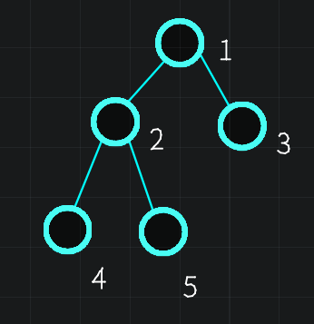
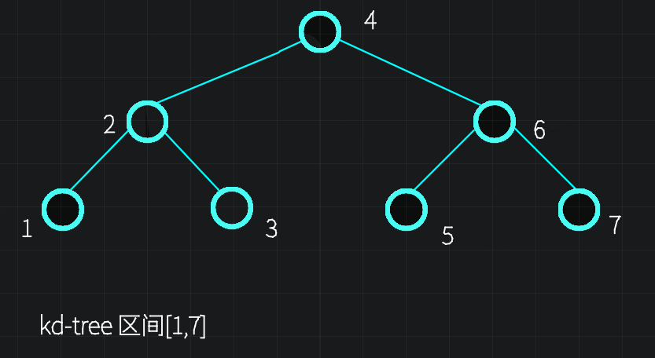

# KD树

[【详解】KD树_哔哩哔哩_bilibili](https://www.bilibili.com/video/BV1E8411g7E2/?spm_id_from=333.337.search-card.all.click)

[www.bilibili.com](https://www.bilibili.com/video/BV1sz4y1x7v1/?spm_id_from=333.337.search-card.all.click&vd_source=f45ea4e1e4b3b73d5f07c57b46c43aba)


## **定义**


节点信息如下。

```C++

struct node{
	int l,r;//儿子 
	int loc[2];//坐标 
	int ul[2],ur[2];//子树区间(子树在二维平面中对应的区域) 
};
```

## 建树



在kd树的第一层，我们按照x值的大小来排序，选择x为中位数的那个点(x',y')作为当前节点，并且把树分为x<x',x>x'两个部分。在第2层，我们则按照y值大小来排序，选择y为中位数的那个点(x',y')作为当前节点，并且把树分为y<y',y>y'两个部分。如此递归下去直到区间不可划分为止。

**目的**

这样的话我们就可以把这个二维平面划分为一个个小块，而不是分成一个个长条。

**实现**

函数 `nth_element(t+l, t+m, t+r+l)`: 求区间t中第 m 小，并且把其放在m处，并且保证左边的值都小于t_m，右边都大于等于t_m。因为不需要完全排序，时间复杂度为O(n)会比sort更优。

```C++
int build(int l,int r,int k){
	if(l>r)return 0;
	int mid=l+r>>1;
	K=k;
	nth_element(tr+l,tr+mid,tr+r+1);
	tr[mid].l=build(l,mid-1,k^1);
	tr[mid].r=build(mid+1,r,k^1);
	pushup(mid);
	return mid;
}

```

注意kd树的节点编号方式一样的不一样。可以看成是一个特别的三叉树。





更新节点的区间信息

```C++
void mnn(int &a,int b){
	a=min(a,b);
}
void mxx(int &a,int b){
	a=max(a,b);
}
void pushup(int x){
	for(int i=0;i<2;i++){
		tr[x].ul[i]=tr[x].ur[i]=tr[x].loc[i];
		if(tr[x].l){
		mnn(tr[x].ul[i],tr[tr[x].l].ul[i]);
		mxx(tr[x].ur[i],tr[tr[x].l].ur[i]);
		
		}if(tr[x].r){
		mnn(tr[x].ul[i],tr[tr[x].r].ul[i]);
		mxx(tr[x].ur[i],tr[tr[x].r].ur[i]);
		
		}
		
	}
}
```

## 查询

问题：给定平面上任意一个坐标(x,y)，求平面上的点到这个坐标的最小距离。

我们考虑以下流程：


对于给定点cur=(3,4)，我们先从根节点进入。计算处(3,4)到两个节点的子树代表的区间的距离。这个样例里很明显，到左边区间的距离为0，到右边区间的距离为4（垂线），这个消息我们可以通过左右子树的ul,ur来计算。

但是如果到左右两边都有一定的距离，那么我们是不能只访问一边的。可是如果我们两边都访问的话，我们的效率不如暴力枚举了。那么我们怎么样去优化它呢？

我们**贪心，**先走最小距离的子树，如果所得答案小于到另一子树的最小距离，那么就不用走另一子树（通过估价函数做最优性剪枝）。

```C++
void query(int p){
	if(!p)return ;
	if(p!=cur)ans=min(ans,dis(p));
	db dl=dis2(tr[p].l),dr=dis2(tr[p].r);
	if(dl<dr){
	//注意此处有先后顺序：先访问距离近的区间，然后判断是否需要访问另外一个区间
		if(dl<ans)query(tr[p].l);
		if(dr<ans)query(tr[p].r);
	}else{
		
		if(dr<ans)query(tr[p].r);
		if(dl<ans)query(tr[p].l);
	}
}
```

这里我们用到了两个计算距离的函数。

```C++

db dis(int x){
	db res=0;
	for(int i=0;i<2;i++){
		s+=(tr[cur].loc[i]-tr[x].loc[i])*(tr[cur].loc[i]-tr[x].loc[i]);
		//这里采用循环累加是为了方便修改为更高的维度
	}
	return res;//x,cur之间距离的平方
}

db dis2(int x){
	//区间到cur的距离的平方
	if(!x)return INF;
	db res=0;
	for(int i=0;i<2;i++){//简单数学计算
		int t1=max(tr[cur].loc[i]-tr[x].ul[i],0.00);
		int t2=max(-tr[cur].loc[i]+tr[x].ur[i],0.00);
		res+=t1*t1+t2*t2;
	}
	return res;
}
```

附录

[题解 | 平面最近点对](https://flowus.cn/cba00ceb-b309-4e66-9416-2405d85ac6e2)


## 插入

学习到这里，我们就进入了kd树学习的第2个台阶了。

首先因为有插入，和动态开点的线段树一样，我们要用类似动态开点的存储方法了。

插入时我们还是从根节点出发，按照交替建树的方法一直往下走。例如我们要插入点(x,y)，当访问到x层（即在交替建树中按照x划分）时，看x与当前节点的x'的关系。如果x<x'就往左走，否则往右走。当我们走到一个空节点时，我们就把要插入的那个点插入进来。代码形如 `tr[x].l=++tot`

```C++

void insert(int &x,int k){
	if(!x){
		x=cur;//要插入的点的编号为cur
		pushup(x);
		return ;
	}
	if(tr[cur].loc[k]<=tr[x].loc[k])insert(tr[x].l,k^1);
	else insert(tr[x].r,k^1);
	pushup(x);
	
	if(A*tr[x].sz<,max(tr[tr[x].l].sz,tr[tr[x].r].sz)){//检查是否需要重构
		cnt=0;
		dfs(x);
		x=rebuild(1,cnt,k);
	}
}
```

我们再考虑一下，如果我们按照某种规律不断插入一个点，这样我们就可能使得这棵树退化为一条链。所以我们要在这棵树的左右儿子不均衡时对这棵树继续重构。


如图，左边的树不均衡，我们将其重构后变成了右边的样子。

> 我们通过某棵子树与整棵树的大小的比值来确定树是否均衡。通常这个比值为$0.5\sim 1$。如果$\frac{r.sz}{x.sz-r.sz}>A$，那么说明右子树过大。通常A取0.7

我们在插入了点后的回溯过程中，我们时刻检查当前节点的子树是否均衡。如果不均衡，我们就重构。

由于重构仅仅在一棵子树内进行，并且不会影响节点的信息（节点之间的关系除外），所以我们的想法是把节点统一存储到一个数组g中，然后按照建树的方法进行重构。

注意建树时我们第1层是按照x来排序的，但是对当前子树进行重构时根节点的那一层可能不是按照x来排序的哦。

我们将需要重构的子树的所有点放入g中，然后通过不断在g中找中位数然后分治的方法重构当前子树，并且不会影响子树外的节点。

代码和build有一点类似

```C++
int K;//全局传参k

bool cmp(int a,int b){
	return tr[a].loc[K]<tr[b].loc[K];
}

int rebuild(int l,int r,int k){
	if(l>r)return 0;
	int mid=l+r>>1;
	K=k;
	nth_element(g+l,g+mid,g+r+1,cmp);//按照re[g[i]].loc[k]大小排序
	tr[g[mid]].l=build(l,mid-1,k^1);
	tr[g[mid]].r=build(mid+1,r,k^1);
	pushup(g[mid]);
	return g[mid];
}
```

补充知识


