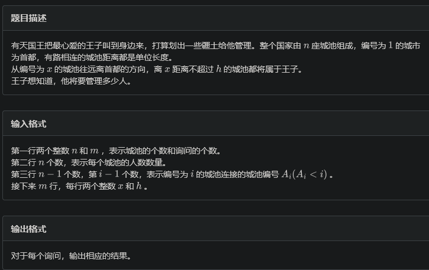
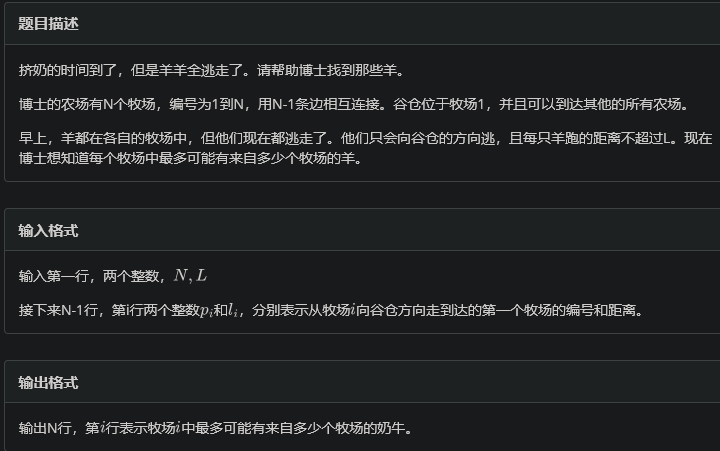
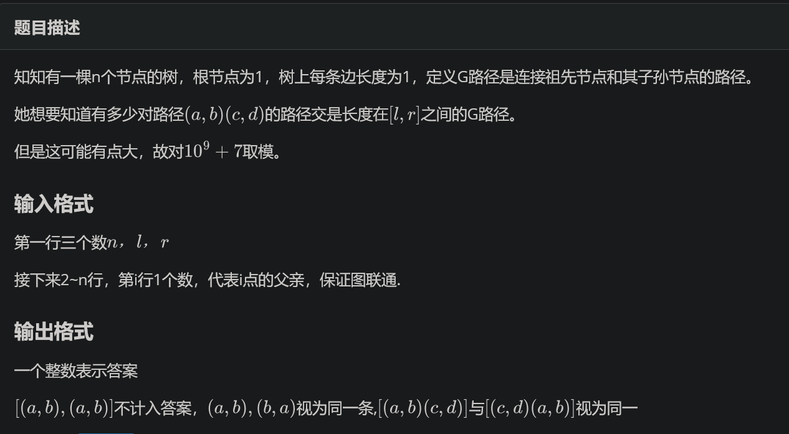
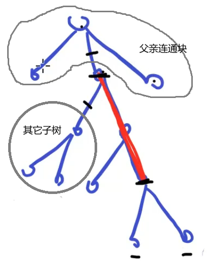

# dfs过程维护信息

本次收集了一些dfs常见的trick。因为篇幅不足以独立开页，因此就集合找这里。

## 子树差分

### 例题 #1 王子



---

我们可以轻易求出一个子树的人口总和。如果我们可以求出这个子树中离根节点距离>h的点的人口和sum，那么做差就可以得到答案了。

那么怎么样求得sum呢？记录sum_i为当前遍历过的所有dep≥i的点的人口和，在进入子树x时，先将x处的询问的答案都加上dep_i，递归后来后再减去dep_i，此时就相当于只减去了子树x中的sum_i了。

sum_{dep_x} 每次累加上sz_x即可。

```C++
// Problem: B. 王子
// Contest: LibreOJ - CSP2024专题复习1
// URL: http://www.nfls.com.cn:20035/contest/2072/problem/2#
// Memory Limit: 128 MB
// Time Limit: 300 ms
// Challenger: Erica N
// ----
#include<bits/stdc++.h>

using namespace std;
#define rd read()
#define ull unsigned long long
#define int long long 
#define itn int
#define ps second 
#define pf first


namespace fastOI{
	#define rd read()
	int read(){
	    int xx = 0, ff = 1;
	    char ch = getchar();
	    while (ch < '0' || ch > '9') {
			if (ch == '-')
				ff = -1;
			ch = getchar();
	    }
	    while (ch >= '0' && ch <= '9')
	      xx = xx * 10 + (ch - '0'), ch = getchar();
	    return xx * ff;
	}
	void write(int out) {
		if (out < 0)
			putchar('-'), out = -out;
		if (out > 9)
			write(out / 10);
		putchar(out % 10 + '0');
	}

}using namespace fastOI;


#define zerol = 1
#ifdef zerol
#define cdbg(x...) do { cerr << #x << " -> "; err(x); } while (0)
void err() {
	cerr << endl;
}
template<template<typename...> class T, typename t, typename... A>
void err(T<t> a, A... x) {
	for (auto v: a) cerr << v << ' ';
	err(x...);
}
template<typename T, typename... A>
void err(T a, A... x) {
	cerr << a << ' ';
	err(x...);
}
#else
#define dbg(...)
#endif
const int N=3e5+5;
const ull P=137;
const int INF=1e9+7;
/*

策略


*/


vector<int> e[N];

void add(int a,int b){
	e[a].push_back(b);
	e[b].push_back(a);
}
int dep[N];
int ans[N];
int sz[N];
vector<pair<int,int> > q[N];
int sum[N];

void dfs(int x,int fa){
	dep[x]=dep[fa]+1;
	// sz[x]=1;
	for(auto Q:q[x]){
		ans[Q.ps]=sum[dep[x]+Q.pf+1];
	}
	for(auto v:e[x]){
		if(v==fa)continue;
		dfs(v,x);
		sz[x]+=sz[v];
	}
	
	sum[dep[x]]+=sz[x];
	for(auto Q:q[x]){
		ans[Q.ps]+=sz[x]-sum[dep[x]+Q.pf+1];
	}
	
}

signed main(){
	int n=rd,m=rd;
	for(int i=1;i<=n;i++){
		sz[i]=rd;
	}
	for(int i=1;i<n;i++){
		add(rd,i+1);
	}
	
	
	for(int i=1;i<=m;i++){
		q[rd].push_back(make_pair(rd,i));
	}
	
	
	dfs(1,0);
	
	
	for(int i=1;i<=m;i++){
		write(ans[i]);
		puts("");
	}
}


```

## dfn栈

### 例题 #1 逃跑



```C++
// Problem: C. 逃跑
// Contest: LibreOJ - CSP2024专题复习1
// URL: http://www.nfls.com.cn:20035/contest/2072/problem/3
// Memory Limit: 128 MB
// Time Limit: 1000 ms
// Challenger: Erica N
// ----
#include<bits/stdc++.h>

using namespace std;
#define rd read()
#define ull unsigned long long
#define int long long 
#define itn int
#define ps second 
#define pf first


namespace fastOI{
	#define rd read()
	int read(){
	    int xx = 0, ff = 1;
	    char ch = getchar();
	    while (ch < '0' || ch > '9') {
			if (ch == '-')
				ff = -1;
			ch = getchar();
	    }
	    while (ch >= '0' && ch <= '9')
	      xx = xx * 10 + (ch - '0'), ch = getchar();
	    return xx * ff;
	}
	void write(int out) {
		if (out < 0)
			putchar('-'), out = -out;
		if (out > 9)
			write(out / 10);
		putchar(out % 10 + '0');
	}

}using namespace fastOI;


#define zerol = 1
#ifdef zerol
#define cdbg(x...) do { cerr << #x << " -> "; err(x); } while (0)
void err() {
	cerr << endl;
}
template<template<typename...> class T, typename t, typename... A>
void err(T<t> a, A... x) {
	for (auto v: a) cerr << v << ' ';
	err(x...);
}
template<typename T, typename... A>
void err(T a, A... x) {
	cerr << a << ' ';
	err(x...);
}
#else
#define dbg(...)
#endif
const int N=3e5+5;
const ull P=137;
const int INF=1e9+7;
/*

策略
求每个点 深度为L的上体子树和
这里L很大

dfs栈上的双指针+树上差分
*/

struct Node{
	int v,w;
};
vector<Node> e[N];


void add(int a,int c,int b){
	e[a].push_back({b,c});
	e[b].push_back({a,c});
}

int n;
int dep[N];
int c[N];

int stk[N],top;
int l;
int L;

void dfs(itn x,int fa){
	stk[++top]=x;
	l=min(l,top);
	while(l&&dep[stk[l]]>=dep[x]-L)l--;
	while(dep[stk[l+1]]<dep[x]-L&&l<top	)l++;
	c[x]++;
	c[stk[l]]--;
	
	
	for(auto v:e[x]){
		if(v.v==fa)continue;
		dep[v.v]=dep[x]+v.w;
		dfs(v.v,x);
	}
	
	top--;
}

void dfs2(int x,int fa){
	for(auto v:e[x]){
		if(v.v==fa)continue;
		dfs2(v.v,x);
		c[x]+=c[v.v];
		
	}
}


signed main(){
	 n=rd,L=rd;
	for(int i=1;i<n;i++){
		add(i+1,rd,rd);
	}
	
	dfs(1,0);
	dfs2(1,0);
	
	for(int i=1;i<=n;i++){
		write(c[i]);
		puts("");
	}
}


```

### 例题 #2 树上路径交 

[CSP2024-S模拟赛6](https://flowus.cn/704535ec-be53-4374-b20f-4d88c79a4821)



---

因为要满足这个G路径的条件比较复杂，所以我们考虑直接枚举这个G路径。

那么现在假设我们枚举了一个G路径为x→y（dep_x<dep_y），那么我们怎么样计算出答案？乘法原理。

我们就是要在y的子树中选两个点（这两个点不能在同一颗子树中），在x的其它子树和父亲连通块中选择两个点，同样的也不能在同一个子树内。有两种特殊情况，就是有1或2个点选择了G路径的端点，这个我们另外计算。



那么现在的做法是O(n^2)的，我们如何优化为O(n)。

我们有一个dfs栈，它可以动态维护一条从当前节点到树根的栈，并且在栈上维护前缀和等数据。那么就可以做本题了。

### 练习 #1 Kay and Snowflake

题面翻译

输入一棵树,判断每一棵子树的重心是哪一个节点.

---

现有题解给出的都是基于重心位置的单调性的写法：我们已经处理出了 $x$ 的所有 $son$ 的子树的重心，那么只需要从这些重心往上跳，就可以找到 $x$ 的重心。因为都是往上跳且每个点最多被跳一次，所以复杂度 $O(n)$。

考虑每个点可以作为哪些点的重心。我们知道点 $v$ 的子树大小为 $sz_v$，记 $mx=\max_{u\in son(v)}(sz_u)$。于是 $v$ 作为 $x$ 的重心当且仅当：

- $x$ 在 $1$ 到 $v$ 的路径上。

- $sz_v\times2+1≥sz_{x}≥mx\times 2$。

于是我们可以在 dfs 栈上二分。进一步优化可以在栈上用用双指针。因为一棵树最多两个重心，所以赋值暴力赋即可。

```C++
// Problem: Kay and Snowflake
// Contest: Luogu
// URL: https://www.luogu.com.cn/problem/CF685B
// Memory Limit: 250 MB
// Time Limit: 3000 ms
// Challenger: Erica N
// ----
// 
#include<bits/stdc++.h>

using namespace std;
#define rd read()
#define ull unsigned long long
#define int long long 
#define pb push_back
#define itn int
#define ps second 
#define pf first


#define rd read()
int read()
{
  int xx = 0, ff = 1;
  char ch = getchar();
  while (ch < '0' || ch > '9')
  {
    if (ch == '-')
      ff = -1;
    ch = getchar();
  }
  while (ch >= '0' && ch <= '9')
    xx = xx * 10 + (ch - '0'), ch = getchar();
  return xx * ff;
}
#define zerol = 1
#ifdef zerol
#define cdbg(x...) do { cerr << #x << " -> "; err(x); } while (0)
void err() {
	cerr << endl;
}
template<template<typename...> class T, typename t, typename... A>
void err(T<t> a, A... x) {
	for (auto v: a) cerr << v << ' ';
	err(x...);
}
template<typename T, typename... A>
void err(T a, A... x) {
	cerr << a << ' ';
	err(x...);
}
#else
#define dbg(...)
#endif
const int N=2e5+5;
const ull P=137;
const int INF=1e18+7;
/*

策略


*/	

vector<int> e[N];
int ans[N],s[N],top;
int sz[N];


void add(int a,int b){
	e[a].pb(b);
}


void dfs(int x){
	sz[x]=1;
	for(auto v:e[x]){
		dfs(v);
		sz[x]+=sz[v];
	}
}

int get(int l,int r,int v){
	int res=top+1;
	while(l<=r){
		int mid=l+r>>1;
		if(sz[s[mid]]<=v)res=mid,r=mid-1;
		else l=mid+1;
	}
	return res;
}

int getu(int l,int r,int v){
	int res=0;
	while(l<=r){
		int mid=l+r>>1;
		if(sz[s[mid]]>=v)res=mid,l=mid+1;
		else r=mid-1;
	}
	return res;
}


void dfs2(int x){
	s[++top]=x;
	int mx=0;
	int sum=0;
	for(auto v:e[x]){
		dfs2(v);
		mx=max(mx,sz[v]);
		sum+=sz[v];
	}
	int mn=mx*2;
	mx=sum*2+1;
	int l=get(1,top,mx);
	int r=getu(1,top,mn);
	// cdbg(x,mx,mn,l,r);
	for(int i=l;i<=r;i++){
		ans[s[i]]=x;
	}
	top--;
}

signed main(){
	int n=rd,q=rd;
	
	
	for(int i=2;i<=n;i++){
		add(rd,i);
	}
	
	
	dfs(1);
	dfs2(1);
	
	while(q--){
		int x=rd;
		cout<<ans[x]<<endl;
	}	
}
```

