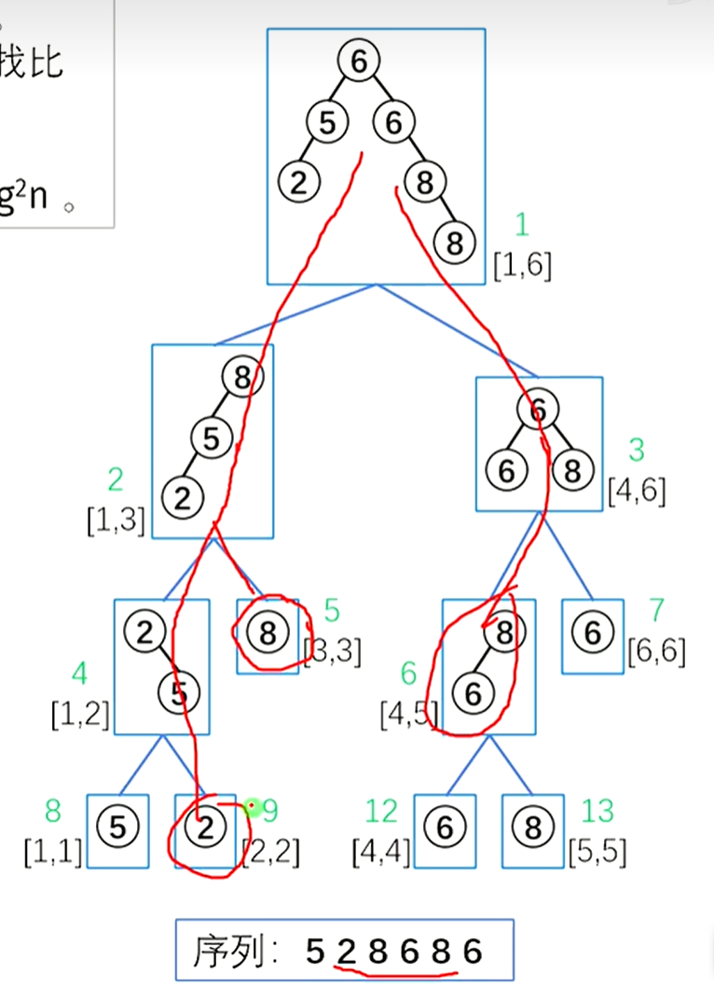
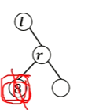

[C12【模板】树套树 线段树套平衡树 P3380 二逼平衡树_哔哩哔哩_bilibili](https://www.bilibili.com/video/BV1Q14y147XF/?spm_id_from=333.999.0.0)


# 二逼平衡树（树套树）

名称解说：线段树套平衡树

**要求**

您需要写一种数据结构（可参考题目标题），来维护一个有序数列，其中需要提供以下操作：

1. 查询 $k$ 在区间$[l,r]$内的排名

2. 查询**区间$[l,r]$内**排名为 $k$ 的值

3. 修改某一位值上的数值

4. 查询 $k$ 在**区间**$[l,r]$**内**的前驱（前驱定义为严格小于 $x$，且最大的数，**若不存在输出 `-2147483647`**）

5. 查询 $k$ 在**区间**$[l,r]$**内**的后继（后继定义为严格大于 $x$，且最小的数，**若不存在输出 `2147483647`**）

我们来对照以下它与普通平衡树的区别

---

普通平衡树需要提供以下操作：

1. 插入 $x$ 数

2. 删除 $x$ 数(若有多个相同的数，应只删除一个)

3. 查询 $x$ 数的排名(排名定义为比当前数小的数的个数 $+1$ )

4. 查询排名为 $x$ 的数

5. 求 $x$ 的前驱(前驱定义为小于 $x$，且最大的数)

6. 求 $x$ 的后继(后继定义为大于 $x$，且最小的数)

对于区间问题，我们可以想到的树形结构是**线段树**

## 定义

线段树套平衡树

线段树的每个节点对应一个区间，在每个节点上构建一棵平衡树，维护该区间内的序列。

首先回顾一下Splay重要函数

**Splay函数**

由于我们要在线段树上的每一个节点都开一个Splay，所以与模板Splay略有不同的是这里需要传入引用rt，作为当前Splay的标记

```C++
void splay(int &rt,int x,int k){//将x旋转到k下方
	while(tr[x].fa!=k){
		int y=tr[x].fa,z=tr[y].fa;
		//第一次旋转,要分情况
		if(z!=k)//若z=k,说明只需要做单旋了(说明目标点就为x的父亲)
			if(tr[y].s[0]==x)^(tr[z].s[0]==y){//若y为z左,x为y左或者y为z右,x为y右,异或和均为0,表示是直线型
				rotate(x);
			}else rotate(y);
		//第二次旋转,都是旋转x 
		rotata(x);
	}
	if(k==0)rt=x;//如果k=0说明x被旋转到了根节点
}
```

**旋转及pushup**

不做修改

```C++
void pushup(int x){//由左右儿子信息更新父亲的信息
	tr[x].size=tr[tr[x].s[0]].size/儿子的size(子树和)加上自己的大小
	//size存的是以x为根节点的子树的信息
}

void rotate(int x){
	int y=t[x].fa,z=t[y].fa;
	int k=(tr[y].s[1]==x);//这里很重要!如果true,说明x为y的左儿子,应该继续左旋
	//以下代码左右旋通用,我们以右旋为例
	tr[y].s[k]=tr[x].s[k^1];//将y的左儿子设置为x的右儿子(1)
	tr[tr[y].s[k]].fa=y;
	tr[x].s[k^1]=y;//将x的右儿子设置为y(2)
	tr[y].fa=x;
	tr[z].s[(tr[z].s[1]==y)]=x;//自动判断原来的y是z的左/右儿子
	tr[x].fa=z;//更新z的儿子,x的新父亲(3)
	pushup(x);pushup(y);//别忘了修改信息
}
```


## 构建


如图


这里我们又要把线段树的板子拿出来了

```C++
void build(int x, int l, int r) {
    insert(rt[x],-INF);insert(rt[x],INF);//构建该节点上的平衡树
    for(int i=l;i<=r;i++)insert(rt[x],w[i]);
  
    if (l == r) {
        //tr[x] = a[l];
      //这里不需要再记录线段树应该记录的东西了,这颗线段树现在记录一堆平衡树即可
        return;
    }
    int mid = (l + r) >> 1;
    build(x << 1, l, mid);
    build(x << 1 | 1, mid + 1, r);
    pushup(x);
}
```

注意,平衡树内维护的是权值，所以要insert的是w[i]而不是i

```C++
void insert(int rt,int v){
	 int x=rt,p=0;
	 while(x&tr[x].v!=v){
	 	p=x;x=tr[x].s[v>tr[x].v];//走到最靠近v的位置，如果v存在那么x停在v上，否则x走到满足v插入的位置的空节点
	 }
	 if(x)tr[x].cnt++;//x原来就存在了
	 else{//添加一个节点
	 	x=++idx;
	 	tr[p].s[v>tr[p].v]=x;//p是x的父节点1
	 	tr[x].init(p,v);//初始化这个点，父亲为p，权值为v
	 }
	 splay(rt,x,0);//splay防止退化成链
}
```

我们观察空间复杂度：每一层的平衡树恰好$n$个点，因此空间复杂度为 $(n\log n)$

时间复杂度：每次插入一个数的复杂度为$O(\log n)$，一共有$n\log n$个点，因此复杂度为$O(n\log^2 n)$

## 操作


实际代码和线段树的查询差不多，只不过当走到一个节点时，普通线段树只是简单的返回对应数组里存的那个值，而树套树要返回该节点的平衡树中小于goal的数的个数，现场查询，即返回一个`getrank(goal)-1`函数

```C++
void find(int rt,int v){
	int x=rt;
	while(tr[x].s[v>tr[x].v]&&v!=tr[x].v){//如果:找到的点没有符合要求的儿子(即走到了最靠近v的点,但v是不存在的)或者找到了v
		x=tr[x].s[v>tr[x].v];//如果v>tr[x].v,那么就走右儿子
	}
	splay(rt,x,0);//将v或者最靠近v的那个点旋转到根节点
}
int getrank(int rt,int v){
	find(rt,v);
	return tr[tr[v].s[0]].size/加上1的原因是树上那个一个无穷小的节点会在函数外(即getrank(goal)-1)减去
}
```

另外一种写法。由于我们仅仅只需要查询排名，不需要对平衡树进行更新（即进行splay操作），所以我们简单利用平衡树性质做一个统计即可。上下代码结果等效，但下面的复杂度低

```C++
int getrank(int rt,int v){
	
	int u=rt,res=0;
	while(u){
		if(tr[u].v<v)res+=tr[tr[u].s[0]].size+1,u=tr[u].s[1];;
		else u=tr[u].s[0];
	}
	return res;
}

```

查询主代码则由线段树的查询修改而来

```C++
int queryrank(int p, int l, int r, int x, int y,int v) {
    int res = 0;
    if (l >= x && r <= y) {
        return getrank(rt[p],v)-1;//注意传入rt
    }
    //pushdown(p, l, r);  //不需要 pushdown,因为线段树只不过是个壳,没有维护具体数据
    int mid = (l + r) >> 1;
    if (x <= mid)
        res += queryrank(p << 1, l, mid, x, y,v);
    if (y > mid)
        res += queryrank(p << 1 | 1, mid + 1, r, x, y,v);
    return res;
}
```

图示：查询序列中下标[2,5]中



**注意：**主函数返回的是小于v的数的个数。排名还需要+1 。


二分即可

```C++
int queryval(int p,int x,int y,int k){
	int l=0,r=1e8,ans;
	while(l<=r){
		int mid=l+r>>1;
		if(queryrank(1,1,n,x,y,mid)+1<=k)l=mid+1,ans=mid;
		else r=mid-1;
	}
	return ans;
}
```


我们找到线段树单点修改的板子，只不过这里是每走到一个点就修改，而不是像线段树模板一样先走到叶子节点，再回溯修改。

```C++
void change(int p, int l, int r, int old,int neww) {
    del(rt[p],old);insert(rt[p],neww);
    int mid = (l + r) >> 1;
    if (old <= mid)
        change(p << 1, l, mid, old,neww);
    else
        change(p << 1 | 1, mid + 1, r, old,neww);  // no else
}
```

将old改为neww，就在每一个区间内的节点上的平衡树中找到old并且删除，然后插入neww

```C++
void del(int &rt,int v){
	int pre=getlower(v),nxt=getbigger(v);
	splay(rt,pre,0);splay(rt,nxt,pre);//将pre旋转到根节点,将nxt旋转到pre的下方,只要就构造出了如图所示的图像
	int del=tr[nxt].s[0];
	if(tr[del].cnt>1)tr[del].cnt--,splay(rt,del,0);//这里进行splay主要是为了pushup
	else tr[nxt].s[0]=0,splay(rt,nxt,0);//直接清空nxt的左儿子,并且更新它
}
```

另一种写法

```C++
void del(int &rt,int v){
	int u=rt;
	while(u){
		if(tr[u].v==v)break;
		if(tr[u].v<v)u=tr[u].s[1];
		if(tr[u].v>v)u=tr[u].s[0];
	}
	splay(rt,u,0);
	int l=tr[u].s[0],r=tr[u].s[1];
	while(tr[l].s[1])l=tr[l].s[1];
	while(tr[r].s[0])r=tr[r].s[0];
	splay(rt,l,0);
	splay(rt,r,1);
	tr[r].s[0]=0;
	splay(rt,r,0);
}
```



图示：将l旋转到根节点，r旋转到l的右儿子，这样根据平衡树性质，要删除的点v只能是r的左儿子，那么将其清零即可。


这里的代码直接由`queryrank()`修改，因为真的很像。

```C++
int querypre(int p, int l, int r, int x, int y,int v) {
    int res = -INF;
    if (l >= x && r <= y) {
        return getpre(rt[p],v);//注意传入rt
    }
    int mid = (l + r) >> 1;
    if (x <= mid)//求最大值,这里与queryrank不同,那个是求和.所以res初始值也不同
        res=max(res,querypre(p << 1, l, mid, x, y,v));
    if (y > mid)
        res=max(res,querypre(p << 1 | 1, mid + 1, r, x, y,v));
    return res;
}
```

由于我们访问的每个节点的查询到的结果不是单调的，所以我们要对每个节点查询到的结果取max

对应平衡树模板

```C++
int getpre(int rt,int v){
	find(rt,v);
	int x=rt;//rt即v
	if(tr[x].v<v)return x;//若true,说明在find中就没有找到v,而是找到了最靠近v的点,若这个点的v<v,那么它就是v的前驱
	x=tr[x].s[0];//先走到v的左子树
	while(tr[x].s[1])x=tr[x].s[1];//然后不断走右儿子
	return x;
}
```


```C++
int querynxt(int p, int l, int r, int x, int y,int v) {
    int res = INF;
    if (l >= x && r <= y) {
        return getbigger(rt[p],v);//注意传入rt
    }
    int mid = (l + r) >> 1;
    if (x <= mid)//求最小值,这里与queryrank不同,那个是求和.所以res初始值也不同
        res=min(res,querypre(p << 1, l, mid, x, y,v));
    if (y > mid)
        res=min(res,querypre(p << 1 | 1, mid + 1, r, x, y,v));
    return res;
}
```

由于我们访问的每个节点的查询到的结果不是单调的，所以我们要对每个节点查询到的结果取min

对应平衡树模板

```C++
int getbigger(int rt,int v){
	find(rt,v);
	int x=rt;//rt即v
	if(tr[x].v>v)return x;//若true,说明在find中就没有找到v,而是找到了最靠近v的点,若这个点的v>v,那么它就是v的后继
	x=tr[x].s[1];//先走到v的右子树
	while(tr[x].s[0])x=tr[x].s[0];//然后不断走左儿子
	return x;
}
```

（备注：这里我们的getbigger和getpre与视频链接中的代码不同。）

---

## 完整代码

函数开头标记`//ok`的是上面的代码。否则则说明上面的代码有问题！！

调了2h TT

```C++
/*
Edit by Ntsc.
*/

#include<bits/stdc++.h>
using namespace std;
#define int long long
#define ull unsigned long long
#define pii pair<int, int>
#define pf first
#define ps second
#define ls(x) tr[x].s[0]
#define rs(x) tr[x].s[1]

#define lc u<<1
#define rc u<<1|1

#define rd read()
#define ot write
#define nl putchar('\n')
inline int rd{
	int xx=0,ff=1;
	char ch=getchar();
	while(ch<'0'||ch>'9') {if(ch=='-') ff=-1;ch=getchar();}
	while(ch>='0'&&ch<='9') xx=xx*10+(ch-'0'),ch=getchar();
	return xx*ff;
}
inline void write(int out){
	if(out<0) putchar('-'),out=-out;
	if(out>9) write(out/10);
	putchar(out%10+'0');
}

const int N=1e7+5;
const int M=5e4+5;
const int INF=2147483647;
const int MOD=998244353;
const int BASE=17737;
bool f1;
int m;
int n,k,x[N],y[N],w[N];
int ans,idx;
int rt[N];

struct node{
	int fa;
	int s[2];
	int size;
	int cnt;
	int v;
	void init(int a,int b){
		fa=a,v=b;
		size=1;
		cnt=1;
	}
}tr[N];

bool f2;

//ok2
void pushup(int x){//由左右儿子信息更新父亲的信息
	tr[x].size=tr[tr[x].s[0]].size/儿子的size(子树和)加上自己的大小
	//size存的是以x为根节点的子树的信息
}

//ok2
void rotate(int x){
	int y=tr[x].fa,z=tr[y].fa;
	int k=(tr[y].s[1]==x);//这里很重要!如果true,说明x为y的左儿子,应该继续左旋
	//以下代码左右旋通用,我们以右旋为例
	tr[y].s[k]=tr[x].s[k^1];//将y的左儿子设置为x的右儿子(1)
	tr[tr[y].s[k]].fa=y;
	tr[x].s[k^1]=y;//将x的右儿子设置为y(2)
	tr[y].fa=x;
	tr[z].s[(tr[z].s[1]==y)]=x;//自动判断原来的y是z的左/右儿子
	tr[x].fa=z;//更新z的儿子,x的新父亲(3)
	pushup(x);pushup(y);//别忘了修改信息
}

//ok2
void splay(int &rt,int x,int k){//将x旋转到k下方
	while(tr[x].fa!=k){
		int y=tr[x].fa,z=tr[y].fa;
		//第一次旋转,要分情况
		if(z!=k)//若z=k,说明只需要做单旋了(说明目标点就为x的父亲)
			if((tr[y].s[0]==x)^(tr[z].s[0]==y)){//若y为z左,x为y左或者y为z右,x为y右,异或和均为0,表示是直线型
				rotate(x);
			}else rotate(y);
		//第二次旋转,都是旋转x 
		rotate(x);
	}
	if(k==0)rt=x;//如果k=0说明x被旋转到了根节点
}


//inline void pushup(int x){
//  tr[x].size=tr[ls(x)].size+tr[rs(x)].size+1;
//}
//inline void rotate(int x){
//  int y=tr[x].fa,z=tr[y].fa;
//  int k=tr[y].s[1]==x;
//  tr[z].s[tr[z].s[1]==y]=x, tr[x].fa=z;
//  tr[y].s[k]=tr[x].s[k^1], tr[tr[x].s[k^1]].fa=y;
//  tr[x].s[k^1]=y, tr[y].fa=x;
//  pushup(y), pushup(x);
//}
//inline void splay(int &root,int x,int k){
//  while(tr[x].fa != k){
//    int y=tr[x].fa,z=tr[y].fa;
//    if(z != k)
//      if((rs(y)==x)^(rs(z)==y)) rotate(x);
//      else rotate(y);
//    rotate(x);
//  }
//  if(!k) root=x;
//}
//ok1

//ok2
//void insert(int &rt,int v){
//	 int x=rt,p=0;
//	 while(x&tr[x].v!=v){
//	 	p=x;x=tr[x].s[v>tr[x].v];//走到最靠近v的位置，如果v存在那么x停在v上，否则x走到满足v插入的位置的空节点
//	 }
//	 if(tr[x].cnt)tr[x].cnt++;//x原来就存在了
//	 else{//添加一个节点
//	 	x=++idx;
//	 	tr[p].s[v>tr[p].v]=x;//p是x的父节点1
//	 	tr[x].init(p,v);//初始化这个点，父亲为p，权值为v
//	 }
//	 splay(rt,x,0);//splay防止退化成链
//}
inline void insert(int &root,int v){
  int u=root,p=0;
  while(u) p=u,u=tr[u].s[v>tr[u].v];
  u = ++idx;
  tr[p].s[v>tr[p].v]=u;
  tr[u].init(p,v);
  splay(root,u,0);
}


/*
线段树部分
*/


//dr hr
//void build(int u,int l,int r){
//  insert(rt[u],-INF), insert(rt[u],INF);
//  for(int i=l;i<=r;i++)insert(rt[u],w[i]);
//  if(l==r) return;
//  int mid=l+r>>1;
//  build(lc,l,mid);
//  build(rc,mid+1,r);
//}
//ok
void build(int x, int l, int r) {
    insert(rt[x],-INF);insert(rt[x],INF);//构建该节点上的平衡树
    for(int i=l;i<=r;i++)insert(rt[x],w[i]);
  
    if (l == r) {
        //tr[x] = a[l];
      //这里不需要再记录线段树应该记录的东西了,这颗线段树现在记录一堆平衡树即可
        return;
    }
    int mid = (l + r) >> 1;
    build(x << 1, l, mid);
    build(x << 1 | 1, mid + 1, r);
//    pushup(x);
}

//
//void find(int rt,int v){
//	int x=rt;
//	while(tr[x].s[v>tr[x].v]&&v!=tr[x].v){//如果:找到的点没有符合要求的儿子(即走到了最靠近v的点,但v是不存在的)或者找到了v
//		x=tr[x].s[v>tr[x].v];//如果v>tr[x].v,那么就走右儿子
//	}
//	splay(rt,x,0);//将v或者最靠近v的那个点旋转到根节点
//}
//int getrank(int rt,int v){
//	find(rt,v);
//	return tr[tr[v].s[0]].size/加上1的原因是树上那个一个无穷小的节点会在函数外(即getrank(goal)-1)减去
//}

//inline int getrank(int root,int v){
//  int u=root,res=0;
//  while(u){
//    if(tr[u].v<v) 
//      res+=tr[ls(u)].size+1,u=rs(u);
//    else u=ls(u);
//  }
//  return res;
//}
//ok
int getrank(int rt,int v){
	
	int u=rt,res=0;
	while(u){
		if(tr[u].v<v)res+=tr[tr[u].s[0]].size+1,u=tr[u].s[1];
		else u=tr[u].s[0];
	}
	return res;
}


//int queryrank(int u,int l,int r,int x,int y,int v){
//  if(x<=l && r<=y) return getrank(rt[u],v)-1;
//  int mid=l+r>>1, res=0;
//  if(x<=mid) res += queryrank(lc,l,mid,x,y,v);
//  if(y>mid) res += queryrank(rc,mid+1,r,x,y,v);
//  return res;
//}
//ok
int queryrank(int p, int l, int r, int x, int y,int v) {
    int res = 0;
    if (l >= x && r <= y) {
        return getrank(rt[p],v)-1;//注意传入rt
    }
    //pushdown(p, l, r);  //不需要 pushdown,因为线段树只不过是个壳,没有维护具体数据
    int mid = (l + r) >> 1;
    if (x <= mid)
        res += queryrank(p << 1, l, mid, x, y,v);
    if (y > mid)
        res += queryrank(p << 1 | 1, mid + 1, r, x, y,v);
    return res;
}


//int getbigger(int rt,int v){
//	find(rt,v);
//	int x=rt;//rt即v
//	if(tr[x].v>v)return x;//若true,说明在find中就没有找到v,而是找到了最靠近v的点,若这个点的v>v,那么它就是v的后继
//	x=tr[x].s[1];//先走到v的右子树
//	while(tr[x].s[0])x=tr[x].s[0];//然后不断走左儿子
//	return x;
//}

//rok
int getbigger(int rt,int v){
	int u=rt,res=INF;
	while(u){
		if(tr[u].v>v)res=tr[u].v,u=tr[u].s[0];
		else u=tr[u].s[1];
	}
	return res;
}

//int getlower(int rt,int v){
//	find(rt,v);
//	int x=rt;//rt即v
//	if(tr[x].v<v)return x;//若true,说明在find中就没有找到v,而是找到了最靠近v的点,若这个点的v>v,那么它就是v的后继
//	x=tr[x].s[0];//先走到v的右子树
//	while(tr[x].s[1])x=tr[x].s[1];//然后不断走左儿子
//	return x;
//}

//rok
int getlower(int rt,int v){
	int u=rt,res=-INF;
	while(u){
		if(tr[u].v<v)res=tr[u].v,u=tr[u].s[1];
		else u=tr[u].s[0];
	}
	return res;
}

//void del(int &rt,int v){
//	int pre=getlower(rt,v),nxt=getbigger(rt,v);
//	splay(rt,pre,0);splay(rt,nxt,pre);//将pre旋转到根节点,将nxt旋转到pre的下方,只要就构造出了如图所示的图像
//	int del=tr[nxt].s[0];
//	if(tr[del].cnt>1)tr[del].cnt--,splay(rt,del,0);//这里进行splay主要是为了pushup
//	else tr[nxt].s[0]=0,splay(rt,nxt,0);//直接清空nxt的左儿子,并且更新它
//}

//inline void del(int &root,int v){
//  int u=root;
//  while(u){
//    if(tr[u].v==v) break;
//    if(tr[u].v<v) u=rs(u);
//    else u=ls(u);
//  }
//  splay(root,u,0);
//  int l=ls(u),r=rs(u);
//  while(rs(l)) l=rs(l);
//  while(ls(r)) r=ls(r);
//  splay(root,l,0);
//  splay(root,r,l);
//  ls(r)=0;
//  splay(root,r,0);
//}
//ok
void del(int &rt,int v){
	int u=rt;
	while(u){
		if(tr[u].v==v)break;
		if(tr[u].v<v)u=tr[u].s[1];
		if(tr[u].v>v)u=tr[u].s[0];
	}
	splay(rt,u,0);
	int l=tr[u].s[0],r=tr[u].s[1];
	while(tr[l].s[1])l=tr[l].s[1];
	while(tr[r].s[0])r=tr[r].s[0];
	splay(rt,l,0);
	splay(rt,r,l);//不是splay(rt,r,1)！
	tr[r].s[0]=0;
	splay(rt,r,0);
}

//ok
int queryval(int p,int x,int y,int k){
	int l=0,r=1e8,ans;
	while(l<=r){
		int mid=l+r>>1;
		if(queryrank(1,1,n,x,y,mid)+1<=k)l=mid+1,ans=mid;
		else r=mid-1;
	}
	return ans;
}

//void change(int u,int l,int r,int pos,int v){
//  del(rt[u],w[pos]);
//  insert(rt[u],v);
//  if(l==r) return;
//  int mid=l+r>>1;
//  if(pos<=mid) change(lc,l,mid,pos,v);
//  else change(rc,mid+1,r,pos,v);
//}
//ok
void change(int p, int l, int r, int old,int neww) {
    del(rt[p],w[old]);insert(rt[p],neww);
    if(l==r)return ;//记得return！！
    int mid = (l + r) >> 1;
    if (old <= mid)
        change(p << 1, l, mid, old,neww);
    else
        change(p << 1 | 1, mid + 1, r, old,neww);  // no else
}

////
//int getpre(int rt,int v){
//	find(rt,v);
//	int x=rt;//rt即v
//	if(tr[x].v<v)return x;//若true,说明在find中就没有找到v,而是找到了最靠近v的点,若这个点的v<v,那么它就是v的前驱
//	x=tr[x].s[0];//先走到v的左子树
//	while(tr[x].s[1])x=tr[x].s[1];//然后不断走右儿子
//	return x;
//}

//ok
int querypre(int p, int l, int r, int x, int y,int v) {
    int res = -INF;
    if (l >= x && r <= y) {
        return getlower(rt[p],v);//注意传入rt
    }
    int mid = (l + r) >> 1;
    if (x <= mid)//求最大值,这里与queryrank不同,那个是求和.所以res初始值也不同
        res=max(res,querypre(p << 1, l, mid, x, y,v));
    if (y > mid)
        res=max(res,querypre(p << 1 | 1, mid + 1, r, x, y,v));
    return res;
}

//int querynxt(int u,int l,int r,int x,int y,int v){
//  if(x<=l && r<=y) return getbigger(rt[u],v);
//  int mid=l+r>>1, res=INF;
//  if(x<=mid) res=min(res,querynxt(lc,l,mid,x,y,v));
//  if(y>mid) res=min(res,querynxt(rc,mid+1,r,x,y,v));
//  return res;
//}
//ok
int querynxt(int p, int l, int r, int x, int y,int v) {
    int res = INF;
    if (l >= x && r <= y) {
        return getbigger(rt[p],v);//注意传入rt
    }
    int mid = (l + r) >> 1;
    if (x <= mid)//求最小值,这里与queryrank不同,那个是求和.所以res初始值也不同
        res=min(res,querynxt(p << 1, l, mid, x, y,v));
    if (y > mid)
        res=min(res,querynxt(p << 1 | 1, mid + 1, r, x, y,v));
    return res;
}


signed main(){
	//注意计算空间
	//freopen("P3380_1.in","r",stdin);
	//freopen("out.txt","w",stdout);
	n=rd,m=rd;
	for(int i=1;i<=n;i++){
		w[i]=rd;
	}
//cerr<<"oko"<<endl;
	build(1,1,n);
	
//	cerr<<"oko"<<endl;
	
	while(m--){
		int op=rd;
		if(op==1){
			int l=rd,r=rd,k=rd;
			cout<<queryrank(1,1,n,l,r,k)+1<<endl;
		}if(op==2){
			int l=rd,r=rd,k=rd;
			cout<<queryval(1,l,r,k)<<endl;
		}if(op==3){
			int pos=rd,k=rd;
			change(1,1,n,pos,k),w[pos]=k;
		}if(op==4){
			int l=rd,r=rd,k=rd;
			cout<<querypre(1,1,n,l,r,k)<<endl;
		}if(op==5){
			int l=rd,r=rd,k=rd;
			cout<<querynxt(1,1,n,l,r,k)<<endl;
		}
	}
}
```

