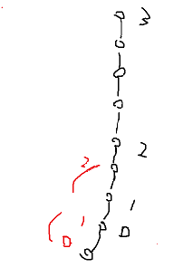
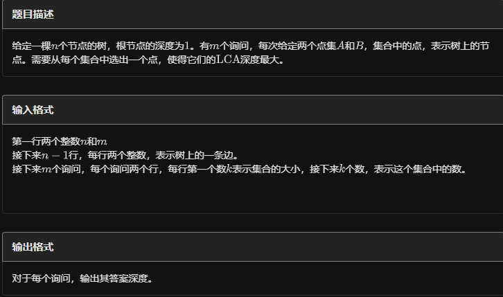

[D09 倍增算法 P3379【模板】最近公共祖先（LCA）_哔哩哔哩_bilibili](https://www.bilibili.com/video/BV1vg41197Xh/?spm_id_from=333.999.0.0)


# 最近公共祖先（LCA）

方法

- 倍增

- 重链剖分

节点LCA（黑）和区间LCA（红）：



## 例题 #1

如题，给定一棵有根多叉树，请求出指定两个点直接最近的公共祖先。

对于 $100\%$ 的数据，$1 \leq N,M\leq 500000$，$1 \leq x, y,a ,b \leq N$，**不保证** $a \neq b$。

样例说明：

该树结构如下：


第一次询问：$2, 4$ 的最近公共祖先，故为 $4$。

第二次询问：$3, 2$ 的最近公共祖先，故为 $4$。

第三次询问：$3, 5$ 的最近公共祖先，故为 $1$。

第四次询问：$1, 2$ 的最近公共祖先，故为 $4$。

第五次询问：$4, 5$ 的最近公共祖先，故为 $4$。

故输出依次为 $4, 4, 1, 4, 4$。

2021/10/4 数据更新 @fstqwq：应要求加了两组数据卡掉了暴力跳。

```C++

int dep[N],fa[N][21];
vector<int> e[N];
void add(int u,int v){
    e[u].pb(v);
}               //加边函数
void dfs(int x,int f){
    dep[x]=dep[f]+1;

    for(auto v:e[x]){//扫描出边
        if(v==f)continue;
        fa[v][0]=x;
        for(int i=1;i<=20;i++){
            fa[v][i]=fa[fa[v][i-1]][i-1];
        }
        dfs(v,x);
    }
}                              
int lca(int a,int b){
    if(dep[a]<dep[b])//统一切换为b比a深
        swap(a,b);          
    for(int i=20;i>=0;i--)//b向上走到与a同层
        if(dep[fa[a][i]]>=dep[b])
            a=fa[a][i];          
    if(a==b)return a;                 
    for(int i=20;i>=0;i--){
        if(fa[a][i]!=fa[b][i]){
            a=fa[a][i],b=fa[b][i];          

        }
    }
    return fa[a][0];//最后a停在了lca的更深一层       
}


int getDis(int a,int b){
    int anc=lca(a,b);
    return dep[a]+dep[b]-2*dep[anc];
}
```

## 倍增求LCA

记录数组:

`dep[]`指每个点的深度

`p[u][i]`记录第 $u$ 个点向上 $2^i$ 层的祖先

偏倍增思想

（vector写法在后面）

```C++
#include<bits/stdc++.h>
using namespace std;
const int MAXN=500000+2;
int n,m,s;
int k=0;
int h[MAXN],dep[MAXN],p[MAXN][21];
struct node{
    int v,next;
}e[MAXN*2];//存树
void add(int u,int v){
    e[k].v=v;
    e[k].next=h[u];
    h[u]=k++;
}               //加边函数
void dfs(int u,int fa){
    dep[u]=dep[fa]+1;
    p[u][0]=fa;
    for(int i=1;(1<<i)<=dep[u];i++)//二叉树，点i的深度即i/2
        p[u][i]=p[p[u][i-1]][i-1];//第u个点向上2^i层的祖先就是第u个点的fa的上2^(i-1)层祖先
    for(int i=h[u];i!=-1;i=e[i].next){//扫描出边
        int v=e[i].v;
        if(v!=fa)//排除fa
            dfs(v,u);
    }
}                              
int lca(int a,int b){
    if(dep[a]>dep[b])//统一切换为b比a深
        swap(a,b);          
    for(int i=20;i>=0;i--)//b向上走到与a同层
        if(dep[a]<=dep[b]-(1<<i))
            b=p[b][i];             
    if(a==b)return a;                 
    for(int i=20;i>=0;i--){
        if(p[a][i]==p[b][i])//过头了
            continue;
        else a=p[a][i],b=p[b][i];          
    }
    return p[a][0];//最后a停在了lca的更深一层       
}
int main()
{	
    memset(h,-1,sizeof(h));
    int a,b;
    scanf("%d%d%d",&n,&m,&rt);
    for(int i=1;i<n;i++)
    {
        scanf("%d%d",&a,&b);
        add(a,b);
        add(b,a);                     
    }
    dfs(rt,0);
    for(int i=1;i<=m;i++)
    {
        scanf("%d%d",&a,&b);
        printf("%d\n",lca(a,b));
    }
    return 0;
}
```

本地写法，能过：vector存图写法

```C++
/*////////ACACACACACACAC///////////
       . Coding by Ntsc .
       . ToFind Chargcy .
       . Prove Yourself .
/*////////ACACACACACACAC///////////

#include <bits/stdc++.h>
#define ll long long
#define db double
#define rtn return
#define i1n    \
    int i = 1; \
    i <= n;    \
    i++
#define in1    \
    int i = n; \
    i >= 1;    \
    i--
using namespace std;

const int N = 2e6 + 5;
const int M = 1e5;
const int Mod = 1e5;
const int INF = 1e5;
vector<int> e[N];
int n, m, sum, ans1, dep[N], fa[N][20], k, tmp, ans2;
void add(int a, int b) { e[a].push_back(b); }
void dfs1(int u, int faa) {  //求深度

    dep[u] = dep[faa] + 1;
    for (int i = 1; i < 19; i++) fa[u][i] = fa[fa[u][i - 1]][i - 1];  // att!
    for (int i = 0; i < e[u].size(); i++) {
        int v = e[u][i];
        if (v == faa)
            continue;
        fa[v][0] = u;

        dfs1(v, u);
    }
}
int lca(int u, int v) {
    if (dep[u] < dep[v])
        swap(u, v);                  //让u更深
    for (int i = 18; i >= 0; i--) {  //倍增往上跳 ，不要暴力跳
        if (dep[u] - (1 << i) >= dep[v])
            u = fa[u][i];
    }
    if (u == v)
        return u;
    for (int i = 18; i >= 0; i--) {  //倍增一起往上跳
        if (fa[u][i] != fa[v][i])
            u = fa[u][i], v = fa[v][i];
    }
    return fa[u][0];  //注意返回值
}
signed main() {
    scanf("%d%d", &n, &m);  // use scanf pls,or u'll TLE
    for (int i = 1; i < n; i++) {
        int a, b;
        scanf("%d%d", &a, &b);
        add(a, b);
        add(b, a);
    }
    dfs1(1, 0);
    for (int i = 1; i <= m; i++) {
        int a, b;
        scanf("%d%d", &a, &b);
        printf("%d\n", lca(a, b));
    }
    return 0;
}
```


本地写法，过不了：链式前向星写法

```C++
#include<bits/stdc++.h>
#define ll long long
using namespace std;
const int N = 1e6 + 5;
ll h[N], cnt, nxt[N], to[N], f[N][22], dep[N], rt, n, m;

void add(ll a, ll b) {
	to[++cnt] = b, nxt[cnt] = h[a], h[a] = cnt;
}

void dfs(ll u, ll fa) {
	dep[u] = dep[fa] + 1;
	f[u][0] = fa;
	for (ll i = 1; i < 17; i++)
		f[u][i] = f[f[u][i - 1]][i - 1];
	for (ll i = h[u]; i; i = nxt[i]) {
		ll v = to[i];
		if (v == fa)
			continue;
		dfs(v, u);
	}
}

ll lca(ll a, ll b) {
	if (dep[b] > dep[a])//统一将a变成更深的
		swap(a, b);
	for (ll i = 20; i >= 0; i--)//先让a,b在统一高度,再同时向上走
		if (dep[f[a][i]] >= dep[b])
			a = f[a][i];
	if (a == b)
		return a;
	for (ll i = 20; i >= 0; i--)
		if (f[a][i] != f[b][i])
			a = f[a][i], b = f[b][i];
	return f[a][0];
}
signed main() {
//	freopen("P3379_1.in","r",stdin); 
	cin >> n >> m >> rt;
	n--;
//	cout<<"OK"<<endl;
	while (n--) {
		ll a, b;
		scanf("%lld%lld", &a, &b);
		add(a, b);
		add(b, a);
	}
	dfs(rt, 0);
	
	while (m--) {
		ll a, b;
		scanf("%lld%lld", &a, &b);
	//	cout<<a<<' '<<b;
		ll l;
		if(a==b) l=a;
		else
		l = lca(a, b);
		
		printf("%lld\n",l);

	}
	return 0;
}
```

## 使用重链剖分解决LCA问题

此外，我们还可以使用重链剖分来求LCA

[动态树](https://flowus.cn/4077b622-00bd-4d7d-b2a6-0ca0e0d73b87)

## ST表优化大量的LCA查询

模板

```C++

int dfn[N << 1], pos[N], tim, st[30][(N << 1) + 2], rev[30][(N << 1) + 2],
    depth[N];  // rev表示最小深度对应的节点编号
int lg[N];
void dfs(int cur, int dep) {
    dfn[++tim] = cur;
    depth[tim] = dep;
    pos[cur] = tim;
    for (auto v : e[cur]) {
        if (!pos[v]) {
            dfs(v, dep + 1);
            dfn[++tim] = cur, depth[tim] = dep;
        }
    }
}

void init() {
    for (int i = 2; i <= tim + 1; ++i) lg[i] = lg[i >> 1] + 1;
    for (int i = 1; i <= tim; i++) st[0][i] = depth[i], rev[0][i] = dfn[i];
    for (int i = 1; i <= lg[tim]; i++)
        for (int j = 1; j + (1 << i) - 1 <= tim; j++)
            if (st[i - 1][j] < st[i - 1][j + (1 << i - 1)])
                st[i][j] = st[i - 1][j], rev[i][j] = rev[i - 1][j];
            else
                st[i][j] = st[i - 1][j + (1 << i - 1)], rev[i][j] = rev[i - 1][j + (1 << i - 1)];
}

int lca(int l, int r) {
    int k = lg[r - l + 1];
    return st[k][l] < st[k][r + 1 - (1 << k)] ? rev[k][l] : rev[k][r + 1 - (1 << k)];
}
```

[练习 | 南外230830](https://flowus.cn/0e07dd05-2912-41fb-b8d6-963fa8b69a94)C题

## 例题 #2 [蓝桥杯 2022 国 B] 机房

这天，小明在机房学习。

他发现机房里一共有 $n$ 台电脑，编号为 1 到 $n$，电脑和电脑之间有网线连接，一共有 $n-1$ 根网线将 $n$ 台电脑连接起来使得任意两台电脑都直接或者间接地相连。

小明发现每台电脑转发、发送或者接受信息需要的时间取决于这台电脑和多少台电脑直接相连，而信息在网线中的传播时间可以忽略。比如如果某台电脑用网线直接连接了另外 $d$ 台电脑, 那么任何经过这台电脑的信息都会延迟 $d$ 单位时间 (发送方和接收方也会产生这样的延迟，当然如果发送方和接收方都是 同一台电脑就只会产生一次延迟)。

小明一共产生了 $m$ 个疑问：如果电脑 $u_{i}$ 向电脑 $v_{i}$ 发送信息，那么信息从 $u_{i}$ 传到 $v_{i}$ 的最短时间是多少?

蓝桥杯 2022 国赛 B 组 H 题。

---

树上前缀和，懂吧？

```C++
/*
Code by Ntsc
*/

#include<bits/stdc++.h>
using namespace std;
#define int long long
#define mp make_pair

#define rd read()
inline int rd
{
    int xx=0,ff=1;
    char ch=getchar();
    while(ch<'0'||ch>'9') {if(ch=='-') ff=-1;ch=getchar();}
    while(ch>='0'&&ch<='9') xx=xx*10+(ch-'0'),ch=getchar();
    return xx*ff;
}
inline void write(int out)
{
    if(out<0) putchar('-'),out=-out;
    if(out>9) write(out/10);
    putchar(out%10+'0');
}

const int N = 1e5+5;
const int M = 505;


    
vector<int> e[N];
int n, m, sum, ans1, dep[N], fa[N][20], k, tmp, ans2;
int qzh[N],in[N];
void add(int a, int b) { 
    e[a].push_back(b); 
    e[b].push_back(a); 
    in[a]++,in[b]++;
}
void dfs1(int u, int faa) {  //求深度

    qzh[u]=qzh[faa]+in[u];

    dep[u] = dep[faa] + 1;
    for (int i = 1; i < 19; i++) fa[u][i] = fa[fa[u][i - 1]][i - 1];  // att!
    for (int i = 0; i < e[u].size(); i++) {
        int v = e[u][i];
        if (v == faa)
            continue;
        fa[v][0] = u;

        dfs1(v, u);
    }
}
int lca(int u, int v) {
    if (dep[u] < dep[v])
        swap(u, v);                  //让u更深
    for (int i = 18; i >= 0; i--) {  //倍增往上跳 ，不要暴力跳
        if (dep[u] - (1 << i) >= dep[v])
            u = fa[u][i];
    }
    if (u == v)
        return u;
    for (int i = 18; i >= 0; i--) {  //倍增一起往上跳
        if (fa[u][i] != fa[v][i])
            u = fa[u][i], v = fa[v][i];
    }
    return fa[u][0];  //注意返回值
}

signed main(){
    n=rd,m=rd;
    for(int i=1;i<n;i++){
        add(rd,rd);
    }
    dfs1(1, 0);
    while(m--){
        int a=rd,b=rd;
        int p=lca(a,b);
        cout<<qzh[a]+qzh[b]-qzh[p]*2+in[p]<<endl;
    }
}

```

## 前缀和&LCA的组合

### 例题 #1 [USACO15DEC] Max Flow P

FJ 给他的牛棚的 $N$ 个隔间之间安装了 $N-1$ 根管道，隔间编号从 $1$ 到 $N$。所有隔间都被管道连通了。

FJ 有 $K$ 条运输牛奶的路线，第 $i$ 条路线从隔间 $s_i$ 运输到隔间 $t_i$。一条运输路线会给它的两个端点处的隔间以及中间途径的所有隔间带来一个单位的运输压力，你需要计算压力最大的隔间的压力是多少。

$2 \le N \le 5 \times 10^4,1 \le K \le 10^5$

**思路**

这里注意利用前缀和快速把一条链加上一个权值

把a,b加上v，lca减去v，注意，在fa(v)减去**一个**v而不是两个！因为我们在lca处已经减去了一个了！

这里注意lca预处理的写法

```C++
void dfs(int x,int f){
    dep[x]=dep[f]+1;
    fa[x][0]=f;
    for (int i = 1; i <= 19; i++) fa[x][i] = fa[fa[x][i - 1]][i - 1];  // att!
    for(auto v:e[x]){
        if(v==f)continue;
        // for(int i=1;i<20;i++){
        //     fa[v][i]=fa[fa[v][i-1]][i-1];
        // }
        // fa[v][0]=x;
        dfs(v,x);
    }
}

```

上面是正确写法。注释是错误写法

或者下面也可以

```C++
void dfs(int x,int f){
    dep[x]=dep[f]+1;
    for(auto v:e[x]){
        if(v==f)continue;
        fa[v][0]=x;
        for(int i=1;i<20;i++){
            fa[v][i]=fa[fa[v][i-1]][i-1];
        }
        dfs(v,x);
    }
}
```

完整代码

```C++

#include <bits/stdc++.h>
#include <queue>
#define rep(l, r, i) for (int i = l, END##i = r; i <= END##i; ++i)
#define per(r, l, i) for (int i = r, END##i = l; i >= END##i; --i)
using namespace std;
#define pb push_back
#define mp make_pair
#define int long long
#define pii pair<int, int>
#define ps second
#define pf first

#define X(j) i[j]
#define Y(j) (dp[j] + (i[j] + L) * (i[j] + L))

#define rd read()
int read() {
  int xx = 0, ff = 1;
  char ch = getchar();
  while (ch < '0' || ch > '9') {
    if (ch == '-')
      ff = -1;
    ch = getchar();
  }
  while (ch >= '0' && ch <= '9')
    xx = xx * 10 + (ch - '0'), ch = getchar();
  return xx * ff;
}
void write(int out) {
  if (out < 0)
    putchar('-'), out = -out;
  if (out > 9)
    write(out / 10);
  putchar(out % 10 + '0');
}

const int N = 3e5 + 5;
const int INF = 1e18;

int n,m;
int fa[N][22],ans=1,dep[N];
vector<int> e[N];
int q[N];

void add(int a,int b){
    e[a].push_back(b);
    e[b].push_back(a);
}

void dfs(int x,int f){
    dep[x]=dep[f]+1;
    // fa[x][0]=f;
    for (int i = 1; i <= 19; i++) fa[x][i] = fa[fa[x][i - 1]][i - 1];  // att!
    for(auto v:e[x]){
        if(v==f)continue;
        fa[v][0]=x;
        dfs(v,x);
    }
}

int lca(int a,int b){
    if(dep[a]<dep[b])swap(a,b);//让a更深
    for(int i=19;~i;i--){//到0！
        if(dep[fa[a][i]]>=dep[b])a=fa[a][i];
    }
    if(a==b)return a;
    for(int i=19;~i;i--){
        int u=fa[a][i],v=fa[b][i];
        if(u==v)continue;
        a=u,b=v;
    }
    return fa[a][0];
}

int dfs2(int x,int f){

    for(auto v:e[x]){
        if(v==f)continue;
        q[x]+=dfs2(v,x);

    }
    if(q[x]>q[ans])ans=x;
    return q[x];
}

void solve(){
    n=rd,m=rd;
    int rt=1;
    for(int i=1;i<n;i++){
        int a=rd,b=rd;
        add(a,b);
    }

    dfs(rt,0);
    for(int i=1;i<=m;i++){
    // cerr<<"OK";
        int s=rd,t=rd;
        int anc=lca(s,t);
        // cout<<anc<<endl;
        q[s]++,q[t]++,q[anc]--,q[fa[anc][0]]--;

        
    }

    dfs2(rt,0);
    cout<<q[ans]<<endl;

}

signed main() {
  int T=1;
  while(T--){
    solve();
  }
  return 0;
}
```

## LCA匹配（倍增的底层运用）

### 例题 #1 LCA查询



---

先二分一个答案深度，然后让a中的所有点都跳到这个深度上，打标记，最后让b中的点也跳到这个深度，看有没有标记。

```C++
/*
                      Keyblinds Guide
                                ###################
      @Ntsc 2024

      - Ctrl+Alt+G then P : Enter luogu problem details
      - Ctrl+Alt+B : Run all cases in CPH
      - ctrl+D : choose this and dump to the next
      - ctrl+Shift+L : choose all like this
      - ctrl+K then ctrl+W: close all
      - Alt+la/ra : move mouse to pre/nxt pos'

*/
#include <bits/stdc++.h>
#include <queue>
using namespace std;

#define rep(i, l, r) for (int i = l, END##i = r; i <= END##i; ++i)
#define per(i, r, l) for (int i = r, END##i = l; i >= END##i; --i)
#define pb push_back
#define mp make_pair
#define int long long
#define pii pair<int, int>
#define ps second
#define pf first
#define ull unsigned long long

#define itn int
// #define inr int
// #define mian main
// #define iont int

#define rd read()
int read() {
    int xx = 0, ff = 1;
    char ch = getchar();
    while (ch < '0' || ch > '9') {
        if (ch == '-')
            ff = -1;
        ch = getchar();
    }
    while (ch >= '0' && ch <= '9') xx = xx * 10 + (ch - '0'), ch = getchar();
    return xx * ff;
}
void write(int out) {
    if (out < 0)
        putchar('-'), out = -out;
    if (out > 9)
        write(out / 10);
    putchar(out % 10 + '0');
}

#define ell dbg('\n')
const char el = '\n';
const bool enable_dbg = 1;
template <typename T, typename... Args>
void dbg(T s, Args... args) {
    if constexpr (enable_dbg) {
        if (1)
            cerr << ' ';
        cerr << s;
        if constexpr (sizeof...(Args))
            dbg(args...);
    }
}

#define zerol = 1
#ifdef zerol
#define cdbg(x...)            \
    do {                      \
        cerr << #x << " -> "; \
        err(x);               \
    } while (0)
void err() { cerr << endl; }
template <template <typename...> class T, typename t, typename... A>
void err(T<t> a, A... x) {
    for (auto v : a) cerr << v << ' ';
    err(x...);
}
template <typename T, typename... A>
void err(T a, A... x) {
    cerr << a << ' ';
    err(x...);
}
#else
#define dbg(...)
#endif

const int N = 1e5 + 5;
const int INF = 1e18;
const int M = 1e7;
const int MOD = 1e9 + 7;

// itn a[N],dfn[N],_dfn[N],rdfn[N];

int tim;
vector<int> e[N];

namespace LCA {

bool flg[N] = { 0 };
int dep[N], fa[N][22];

void dfs(int x, int f) {
    dep[x] = dep[f] + 1;
    for (auto v : e[x]) {
        if (v == f)
            continue;
        fa[v][0] = x;
        for (int i = 1; i <= 20; i++) {
            fa[v][i] = fa[fa[v][i - 1]][i - 1];
        }
        dfs(v, x);
    }
}

int stk[N], top;

void jump(itn x, int d) {
    for (int i = 20; ~i; i--) {
        if (dep[fa[x][i]] >= d)
            x = fa[x][i];
    }
    if (dep[x] != d)
        return;
    //		if(flg[x])return 1;
    flg[x] = 1;
    stk[++top] = x;
    return;
}

bool checkJump(itn x, int d) {
    for (int i = 20; ~i; i--) {
        if (dep[fa[x][i]] >= d)
            x = fa[x][i];
    }
    if (dep[x] != d)
        return 0;
    if (flg[x])
        return 1;
    return 0;
}

}  // namespace LCA
using namespace LCA;

void add(int a, int b) {
    e[a].pb(b);
    e[b].pb(a);
}

int a[N], b[N], k, k2;

bool check(int x) {
    //	memset(flg,0,sizeof flg);
    while (top) flg[stk[top--]] = 0;
    for (int i = 1; i <= k; i++) {
        jump(a[i], x);
    }

    for (int i = 1; i <= k2; i++) {
        if (checkJump(b[i], x))
            return 1;
    }
    return 0;
}

void solve() {
    itn n = rd;
    int m = rd;

    for (int i = 1; i < n; i++) {
        add(rd, rd);
    }

    dfs(1, 0);
    //	cdbg(dep[7]);

    while (m--) {
        int mx = -INF, mx2 = -INF;
        k = rd;
        for (int i = 1; i <= k; i++) {
            a[i] = rd;
            mx = max(mx, dep[a[i]]);
        }

        k2 = rd;
        for (int i = 1; i <= k2; i++) {
            b[i] = rd;
            mx2 = max(mx2, dep[b[i]]);
        }

        //		cdbg("OK");
        int l = 1, r = min(mx, mx2);
        int res = 0;
        while (l <= r) {
            int mid = l + r >> 1;
            if (check(mid))
                res = mid, l = mid + 1;
            else
                r = mid - 1;
        }

        //		while(check(res+1))res++;

        //		cdbg(check(5));
        write(res);
        puts("");
        //		cout<<res<<endl;
        //		188.88 20172 -1
    }
}

signed main() {
    // freopen(".in","r",stdin);
    // freopen(".in","w",stdout);

    int T = 1;
    while (T--) {
        solve();
    }
    return 0;
}
```

## LCA和路径交的关系

### 例题 #1 路径交

内存限制：129 MiB 时间限制：6000 ms 标准输入输出

题目描述

给定一棵n个点的树，以及m条路径，每次询问第L条到第R条路径的交集部分的长度（如果一条边同时出现在2条路径上，那么它属于路径的交集）。

输入格式

第一行一个数n（n<=500,000）

接下来n-1行，每行三个数x，y，z，表示一条从x到y并且长度为z的边
第n+1行一个数m（m<=500,000）

接下来m行，每行两个数u，v，表示一条从u到v的路径

接下来一行一个数Q，表示询问次数（Q<=500,000）

接下来Q行，每行两个数L和R

输出格式

Q行，每行一个数表示答案。

---

首先我们考虑两条路径相交的情况, A - B, C - D, 很明显这两条相交路径为LCA(A, C), LCA(A, D), LCA(B, C), LCA(B, D), 其中最深的两个点之间的路径。

所以路径之间就具有合并性, 询问又是问区间, 很明显就要用线段树, 每个叶子结点代表一条路径, 然后pushup的时候就像上面所说的这样做。

```C++
// Problem: G. 路径交
// Contest: LibreOJ - CSP2024专题复习1
// URL: http://www.nfls.com.cn:20035/contest/2072/problem/7#
// Memory Limit: 129 MB
// Time Limit: 6000 ms
// Challenger: Erica N
// ----
#include<bits/stdc++.h>

using namespace std;
#define rd read()
#define ull unsigned long long
// #define int long long 
#define itn int
#define ps second 
#define pf first

namespace fastOI{
	#define rd read()
	int read(){
	    int xx = 0, ff = 1;
	    char ch = getchar();
	    while (ch < '0' || ch > '9') {
			if (ch == '-')
				ff = -1;
			ch = getchar();
	    }
	    while (ch >= '0' && ch <= '9')
	      xx = xx * 10 + (ch - '0'), ch = getchar();
	    return xx * ff;
	}
	void write(int out) {
		if (out < 0)
			putchar('-'), out = -out;
		if (out > 9)
			write(out / 10);
		putchar(out % 10 + '0');
	}

}using namespace fastOI;


#define zerol = 1
#ifdef zerol
#define cdbg(x...) do { cerr << #x << " -> "; err(x); } while (0)
void err() {
	cerr << endl;
}
template<template<typename...> class T, typename t, typename... A>
void err(T<t> a, A... x) {
	for (auto v: a) cerr << v << ' ';
	err(x...);
}
template<typename T, typename... A>
void err(T a, A... x) {
	cerr << a << ' ';
	err(x...);
}
#else
#define dbg(...)
#endif
const int N=5e5+5;
const ull P=137;
const int INF=1e9+7;
/*

策略


*/

#define pb push_back

struct Edge{
	int v,w;
};

vector<Edge> e[N];

void add(int c,int b,itn a){
	e[a].pb({b,c});
	e[b].pb({a,c});
}


namespace LCA{
	int dep[N];
	int fa[N][22];
	int d[N];
	
	void dfs(int x,int f){
		dep[x]=dep[f]+1;
		for(auto v:e[x]){
			if(v.v==f)continue;
			fa[v.v][0]=x;
			for(int i=1;i<=20;i++){
				fa[v.v][i]=fa[fa[v.v][i-1]][i-1];
			}
			d[v.v]=d[x]+v.w;
			dfs(v.v,x);
		}
	}
	
	int lca(int a,int b){
		if(dep[a]<dep[b])swap(a,b);
		for(int i=20;i != -1;i--){
			if(dep[fa[a][i]]>=dep[b])a=fa[a][i];
		}
		if(a==b)return a;
		
		for(int i=20;-1!=i;i--){
			if(fa[a][i]!=fa[b][i]){
				a=fa[a][i];
				b=fa[b][i];
			}
		}
		return fa[a][0];
	}
	
	int getDis(itn a,int b ){
		int anc=lca(a,b);
		return d[a]+d[b]-d[anc]*2;
	}
	
}using namespace LCA;


namespace SGT{
	struct Node{
		int a,b;
	}t[N<<2],p[N];
	int g[7];	
	
	bool cmp(int a,int b){
		return dep[a]>dep[b];
	}
	
	Node merge(Node a,Node b){
		g[1]=lca(a.b,b.b);
		g[2]=lca(a.a,b.a);
		g[3]=lca(a.a,b.b);
		g[4]=lca(a.b,b.a);
		sort(g+1,g+5,cmp);
		Node r={g[1],g[2]};
		return r;
	}
	
	void pushup(int x){
		t[x]=merge(t[x<<1],t[x<<1|1]);
	}
	
	
	void build(int x,int l,int r){
		if(l==r){
			t[x]=p[l];
			return ;
		}
		int mid=l+r>>1;
		build(x<<1,l,mid);
		build(x<<1|1,mid+1,r);
		pushup(x);
	}
	
	Node query(int x,int l,int r,int pl,int pr){
		if(pl<=l&&pr>=r)return t[x];
		int mid=l+r>>1;
		Node nl,nr;
		int fl=0,fr=0;
		if(pl<=mid)fl=1,nl=query(x<<1,l,mid,pl,pr);
		if(pr>mid)fr=1,nr=query(x<<1|1,mid+1,r,pl,pr);
		if(fl+fr==1){
			if(fl)return nl;
			return nr;
		}
		return merge(nl,nr);
	}
	
	
	
} using namespace SGT;

signed main(){
	int n=rd;
	for(int i=1;i<n;i++){
		add(rd,rd,rd);
	}	
	
	dfs(1,0);
	
	int m=rd;
	for(int i=1;i<=m;i++){
		p[i]={rd,rd};
	}
	
	build(1,1,m);
	
	
	int q=rd;
	while(q--){
		int l=rd,r=rd;
		auto p=query(1,1,m,l,r);


		write(getDis(p.a,p.b));
		puts("");
	}
}

```

