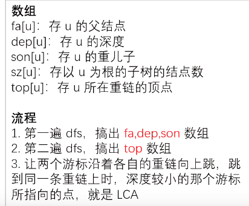

# 树链剖分

## 重链


注意，重儿子只能有**一个**

图中标绿的路径即为重链，注意，**每个叶子节点都是一条特殊的重链**

注意，只要子节点是重儿子，它就是重链，不对父节点有特殊要求


特殊性质：

- 所有重链所包含的节点相加，正好是所有的节点，不重不漏

- 注意标红的结论3：eg.对于路径5-2-1-4-8-12，就剖分为了4条重链

## 使用重链剖分解决LCA问题



未验证的代码

```C++
/*////////ACACACACACACAC///////////
       . Code by Ntsc .
       . WHY NOT????? .
/*////////ACACACACACACAC///////////

#include<bits/stdc++.h>
#define ll long long
#define db double
#define rtn return
using namespace std;

const int N=1e5;
const int M=1e5;
const int Mod=1e5;
const int INF=1e5;

int sz[N],fa[N],dep[N],son[N],top[N];
int n,Q;
vector<int> e[N];

void add(int a,int b){
	e[a].push_back(b);
}

void dfs1(int u,int faa){//初始值1,0 
	fa[u]=faa;dep[u]=dep[faa]+1;sz[u]=1;//更新fa,dep,设置sz初始值 
	for(int i=0;i<e[u].size();i++){
		int v=e[u][i];
		if(v==faa)continue;
		dfs1(v,u);//注意不是dfs1(v,faa) 
		sz[u]+=sz[v];//回溯,sz[u]原本为1 ,加上已经处理了v的子树大小
		if(sz[v]>sz[son[u]])son[u]=v;//更新重儿子,son[u]存到是之前已经扫描过的u的儿子中最重的那个,把它的sz与v的sz比对 
	}	
	return ;
} 

void dfs2(int u,int t){
	top[u]=t;
	if(!son[u])return;//没有重儿子,那么说明u为叶子节点. 
	dfs2(son[u],t);//先走重儿子,继承u的top(即t) 
	for(int i=0;i<e[i].size();i++){//扫描轻儿子 
		int v=e[u][i];
		if(v==fa[u]||v==son[u])continue;//筛选 
		dfs2(v,v);//轻儿子不能继承t,只能开一条新的重链 
	}
	return ;
}

int lca(int u,int v){
	while(top[u]!=top[v]){
		if(dep[top[u]]<dep[top[v]])swap(u,v);//交换,使得u所在的重链top恒比v的深 ,即保证是更深的在往上跳而不是浅的一直在往上跳 
		u=fa[top[u]];
	}
	if(dep[u]>dep[v])return v;
	else return u;//返回更浅的那个,就是原来u,v的LCA 
}
signed main(){
	cin>>n>>Q;
	for(int i=1;i<=n;i++){
		int a,b;
		cin>>a>>b;
		add(a,b);add(b,a);
	}
	//......
	return 0;
}

```

## 重链剖分+线段树实现树上修改与查询

**重链剖分部分**

[324 树上修改与查询 树链剖分_哔哩哔哩_bilibili](https://www.bilibili.com/video/BV18S4y1e7qb/?spm_id_from=333.999.0.0&vd_source=f45ea4e1e4b3b73d5f07c57b46c43aba)


在剖分之后我们将每个节点都一一映射一个新的编号。按照代码中dfs2的顺序，一条一条重链上的点深度由浅入深依次编号。

直观图，新的编号如图中的标红数字


代码

```C++

int sz[N],fa[N],dep[N],son[N],top[N];
int n,Q,cnt;
vector<int> e[N];

void add(int a,int b){
	e[a].push_back(b);
}

void dfs1(int u,int faa){//初始值1,0 
	fa[u]=faa;dep[u]=dep[faa]+1;sz[u]=1;//更新fa,dep,设置sz初始值 
	for(int i=0;i<e[u].size();i++){
		int v=e[u][i];
		if(v==faa)continue;
		dfs1(v,u);//注意不是dfs1(v,faa) 
		sz[u]+=sz[v];//回溯,sz[u]原本为1 ,加上已经处理了v的子树大小
		if(sz[v]>sz[son[u]])son[u]=v;//更新重儿子,son[u]存到是之前已经扫描过的u的儿子中最重的那个,把它的sz与v的sz比对 
	}	
	return ;
} 

void dfs2(int u,int t){
	top[u]=t;id[u]=++cnt;nw[cnt]=w[u];
	if(!son[u])return;//没有重儿子,那么说明u为叶子节点. 
	dfs2(son[u],t);//先走重儿子,继承u的top(即t) 
	for(int i=0;i<e[i].size();i++){//扫描轻儿子 
		int v=e[u][i];
		if(v==fa[u]||v==son[u])continue;//筛选 
		dfs2(v,v);//轻儿子不能继承t,只能开一条新的重链 
	}
	return ;
}
```

**线段树部分**

我们将原来的树映射为序列，然后使用线段树来维护这段序列

代码

```C++
struct tree{
	int l,r;//左右节点代表的区间
	ll add,sum;//标记与区间和
}tr[N<<2];

void pushup(int u){
	tr[u].sum=tr[u*2].sum+tr[u*2+1].sum;
}
void build(int u,int l,int r){
	tr[u]={l,r,0,nw[r]};
	if(l==r)return ;
	int mid=l+r;
	build(u*2,l,mid);
	build(u*2+1,mid+1,r);
	pushup(u);//回溯时更新
}
```

**查询**

目的：求树上从x到y最短路径上的节点和

举个例子


我们要查询树上节点10-12的路径权值和，首先使用类似LCA算法找到路径经过了那几条重链，分别是10-6-2，1-4-8，12

然后映射到线段树中，分别是区间[7,9][1,3][5]

我们使用线段树快速求出这些区间和即可，注意，其中的[7,9][5]都是一段完整的重链，我们在LCA时已经知道了其l,r，直接线段树即可，但[1,3]不是一段完整的重链。幸好，在LCA算法结束时，u=8，v=1，映射后就是3和1.因此在LCA结束后我们还需要把ans加上这一条不完整的链

```C++
int query_lca(int u,int v){
	ll res=0;
	while(top[u]!=top[v]){
		if(dep[top[u]]<dep[top[v]])swap(u,v);//交换,使得u所在的重链top恒比v的深 ,即保证是更深的在往上跳而不是浅的一直在往上跳 
		res+=query(id[top[u]],id[u]);//注意id[top[u]]<=id[u]
		u=fa[top[u]];
	}
	if(dep[u]>dep[v])swap(u,v);
	res+=query(id[u],id[v])
	return res;
}
```

**修改**

目的：将树上从x到y的最短路径上每个节点都加上k


代码和上方`query_lca`基本上一模一样。注意这里省略了**线段树**相关代码如：

- `update()`（`change()`）

- `query()`

- `pushdown()`懒标记

请自我回顾！

```C++
void updt_lca(int u,int v,int k){
	while(top[u]!=top[v]){
		if(dep[top[u]]<dep[top[v]])swap(u,v);//交换,使得u所在的重链top恒比v的深 ,即保证是更深的在往上跳而不是浅的一直在往上跳 
		update(1,id[top[u]],id[u],k);//注意id[top[u]]<=id[u]
		u=fa[top[u]];
	}
	if(dep[u]>dep[v])swap(u,v);
	update(1,id[u],id[v],k);
	return ;
}
```

例题

[www.luogu.com.cn](https://www.luogu.com.cn/problem/P3384)


如题，已知一棵包含 $N$ 个结点的树（连通且无环），每个节点上包含一个数值，需要支持以下操作：

- `1 x y z`，表示将树从 $x$ 到 $y$ 结点最短路径上所有节点的值都加上 $z$。

- `2 x y`，表示求树从 $x$ 到 $y$ 结点最短路径上所有节点的值之和。

- `3 x z`，表示将以 $x$ 为根节点的子树内所有节点值都加上 $z$。

- `4 x` 表示求以 $x$ 为根节点的子树内所有节点值之和

对于 $100\%$ 的数据： $1\le N \leq {10}^5$，$1\le M \leq {10}^5$，$1\le R\le N$，$1\le P \le 2^{31}-1$。

补充说明：观察可知，重链剖分后任意一棵子树的所有点会被映射到一个连续的区间中。这一点和dfs序颇有类似。

```C++
/*////////ACACACACACACAC///////////
       . Code  by  Ntsc .
       . Earn knowledge .
/*////////ACACACACACACAC///////////

#include<bits/stdc++.h>
#define int long long
#define db double
#define rtn return
using namespace std;

const int N=1e5+5;
const int M=1e5;
int MOD;
const int INF=1e5;

int n,m,p,q,r,T,s[N],ans;

int sz[N],fa[N],dep[N],son[N],top[N];
int w[N],nw[N],tail[N],id[N],Q,cnt;
int du[N],rt;
vector<int> e[N];

void add(int a,int b){
	e[a].push_back(b);
	e[b].push_back(a);//记得双向边 
	du[b]++;
}

void dfs1(int u,int faa){//初始值1,0 
	fa[u]=faa;dep[u]=dep[faa]+1;sz[u]=1;//更新fa,dep,设置sz初始值 
	for(int i=0;i<e[u].size();i++){
		int v=e[u][i];
		if(v==faa)continue;
		dfs1(v,u);//注意不是dfs1(v,faa) 
		sz[u]+=sz[v];//回溯,sz[u]原本为1 ,加上已经处理了v的子树大小
		if(sz[v]>sz[son[u]])son[u]=v;//更新重儿子,son[u]存到是之前已经扫描过的u的儿子中最重的那个,把它的sz与v的sz比对 
	}	
	return ;
} 

void dfs2(int u,int t){
	top[u]=t;id[u]=++cnt;nw[cnt]=w[u];
	tail[u]=id[u];
	if(!son[u])return;//没有重儿子,那么说明u为叶子节点. 
	dfs2(son[u],t);//先走重儿子,继承u的top(即t) 
	tail[u]=max(id[u],tail[son[u]]);
	for(int i=0;i<e[u].size();i++){//扫描轻儿子 
		int v=e[u][i];
		if(v==fa[u]||v==son[u])continue;//筛选 
		dfs2(v,v);//轻儿子不能继承t,只能开一条新的重链 
		tail[u]=max(id[u],tail[v]);//记录子树区间 
	}
	return ;
}

//SGT
struct tree{
	int l,r;//左右节点代表的区间
	int add,sum;//标记与区间和
}tr[N<<2];

void pushup(int u){
	tr[u].sum=(tr[u*2].sum+tr[u*2+1].sum)%MOD;
}

void addtag(int x,int tg){
	tr[x].add+=tg;
	tr[x].add%=MOD;
	tr[x].sum+=tg*(tr[x].r-tr[x].l+1);
	tr[x].sum%=MOD;
}

void pushdown(int x){
	if(tr[x].add){
		addtag(x<<1,tr[x].add);
		addtag(x<<1|1,tr[x].add);
		tr[x].add=0;
	}
}

void build(int u,int l,int r){
	tr[u]={l,r,0,0};
	if(l==r){
		tr[u]={l,r,0,nw[r]};return ;
	}
	int mid=l+r>>1;
	build(u*2,l,mid);
	build(u*2+1,mid+1,r);
	pushup(u);//回溯时更新
}


void update(int x,int pl,int pr,int k){
	if(tr[x].l>=pl&&tr[x].r<=pr){
		addtag(x,k);
		return ;
	}
	if(tr[x].l>pr||tr[x].r<pl)return ;
	
	pushdown(x);
	int mid=tr[x].l+tr[x].r>>1;
	if(pl<=mid)update(x<<1,pl,pr,k);
	if(pr>mid)update(x<<1|1,pl,pr,k);
	
	pushup(x);
}

int query(int x,int pl,int pr){
	if(tr[x].l>=pl&&tr[x].r<=pr){
		return tr[x].sum;
	}
	
	
	if(tr[x].l>pr||tr[x].r<pl)return 0;
	
	pushdown(x);
	int res=0;
	int mid=tr[x].l+tr[x].r>>1;
	if(pl<=mid)res+=query(x<<1,pl,pr);
	res%=MOD;
	if(pr>mid)res+=query(x<<1|1,pl,pr);
	res%=MOD;
	
	return res;
}

//spou
int query_road(int u,int v){
	int res=0;
	while(top[u]!=top[v]){
		if(dep[top[u]]<dep[top[v]])swap(u,v);//交换,使得u所在的重链top恒比v的深 ,即保证是更深的在往上跳而不是浅的一直在往上跳 
		res+=query(1,id[top[u]],id[u]);//注意id[top[u]]<=id[u]
		u=fa[top[u]];
	}
	if(dep[u]>dep[v])swap(u,v);
	res+=query(1,id[u],id[v]);
	res%=MOD;
	return res;
}

void updt_road(int u,int v,int k){
	while(top[u]!=top[v]){
		if(dep[top[u]]<dep[top[v]])swap(u,v);//交换,使得u所在的重链top恒比v的深 ,即保证是更深的在往上跳而不是浅的一直在往上跳 
		update(1,id[top[u]],id[u],k);//注意id[top[u]]<=id[u]
		u=fa[top[u]];
	}
	if(dep[u]>dep[v])swap(u,v);
	update(1,id[u],id[v],k);
	return ;
}

//debug

void debug(){
//	cerr<<"\ndebug = ";
//	for(int i=1;i<=n;i++){
//		cerr<<query(1,id[i],id[i])<<' ';
//	}
//	cerr<<"debug end\n";
//	
//	cerr<<"node v=";
//	for(int i=1;i<=n;i++)cerr<<nw[id[i]]<<' ';
//	cerr<<"node v end\n";
}


signed main(){
	cin>>n>>m>>rt>>MOD;
	for(int i=1;i<=n;i++){
		cin>>w[i];
	}
	
	for(int i=1;i<n;i++){
		int a,b;
		cin>>a>>b;
		add(a,b);
	}
	
//	for(int i=1;i<=n;i++){
//		if(!du[i]){
//			rt=i;break;//找根 
//		}
//	}
	
	dfs1(rt,0);
	dfs2(rt,rt);
	
//	cerr<<"sz[]=";
//	for(int i=1;i<=n;i++)cerr<<sz[i]<<' ';
//	cerr<<"sz[] endl\n"; 
	
//	cerr<<"rt= "<<rt<<endl;
	
//	for(int i=1;i<=n;i++)cerr<<"node "<<i<<" 's id = "<<id[i]<<" tail = "<<tail[i]<<endl;

	
//	cerr<<"start building...\n";
	
	build(1,1,n);
	
//	cerr<<"build finish\ninit ";
	debug();
	
	while(m--){
		int op,x,y,z;
		cin>>op>>x;
		if(op==1){
			cin>>y>>z;
			updt_road(x,y,z);
		}if(op==2){
			cin>>y;
			cout<<query_road(x,y)%MOD<<endl;
		}if(op==3){
			cin>>z;
			update(1,id[x],tail[x],z);
			
		}if(op==4){
			cout<<query(1,id[x],tail[x])%MOD<<endl;
		}
		
		debug();
	}
	
	return 0;
}


```

## 实链

见 LCT

---

**重链剖分**

把树拆分成若干条重链，用线段树这种静态数据结构来维护重链。通过对重链的拆分与组合，构造答案

**实链剖分**

把树拆分成若干条实链，用 splay 这种动态数据结构来维护实链。通过对实链的拆分与组合，构造答案

**构建**

一个节点只能选（任意）一个儿子做实儿子，其他都是虚儿子。

实边：父节点与实儿子之间的边，是双向边。

虚边：由虚儿子指向父节点的边，是单向边。（认父不认子，下面会说及是一个splay的根节点指向另外一颗splay中的某个节点）

实链：由实边构成的链。每条实链的节点深度是严格递增的。


