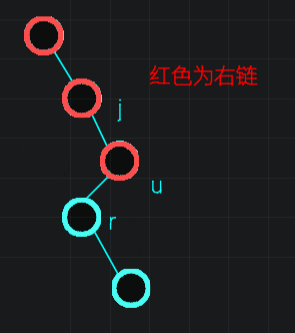
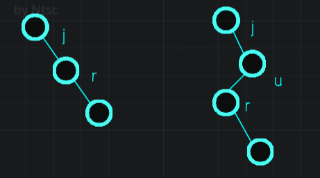

# 笛卡尔树

给定一个 $1 \sim n$ 的排列 $p$，构建其笛卡尔树。

即构建一棵二叉树，满足：

1. 每个节点的编号满足二叉搜索树的性质。

2. 节点 $i$ 的权值为 $p_i$，每个节点的权值满足小根堆的性质。

> 小根堆的性质：对于该堆的任意一个部分，都满足其根节点的权值小于其子节点的权值。

**建树**

设 $l_i,r_i$ 分别表示节点 $i$ 的左右儿子的编号（若不存在则为 $0$）。

一行两个整数，分别表示 $\operatorname{xor}_{i = 1}^n i \times (l_i + 1)$ 和 $\operatorname{xor}_{i = 1}^n i \times (r_i + 1)$。

$1 \le n \le 10^7$。

我们可以O(n)构建笛卡尔树。

给定一个序列 $A$ （默认其没有重复元素），下面建树的过程以小根堆为例，定义序列中第 $i$ 个元素的键值为 $(i,A_i)$，也就是 $i$ 对应 $k$ ， $A_i$ 对应 $w$。

定义一棵树的**右链**为从根出发一直往右儿子方向能够到达的所有点按照深度从浅到深排序后而形成的一条链。



因为我们的键值 $k$ 是数组下标，所以我们不需要排序，直接从数组的左边往右边插入可以。

假设我们现在插入的是节点 $u$，我们为了维护下标满足二叉搜索树的性质，肯定每次都是往树的**右链**的末端插入，但是我们此时要维护堆的性质。

- 如果恰好 $w_u$ 大于当前右链末端端点的 $w$ 即直接将 $u$ 插入到 右链的末端。

- 如果 $w_u$ 小于当前右链的末端端点的 $w$，那么意味着 $u$ 应当在树上是 **当前右链** 末端端点的祖先，于是我们继续往上找，直到遇到满足第一种情况的点。

假如我们在右链上找到了一个点 $j$ 使得 $w_j < w_u$ ，那么就把 $j$ 的右儿子作为 $u$ 的左儿子，$j$ 的右儿子变为 $u$，然后我们就完成了插入这个 $u$。



如果没有找到任何一个点可以小于 $w_u$，那么 $w_u$ 就会成为新的右链的根节点。


**代码**

```C++
/*////////ACACACACACACAC///////////
       . Code  by  Ntsc .
       . Earn knowledge .
/*////////ACACACACACACAC///////////
#include<bits/stdc++.h>
#define int long long
#define db double
#define rtn return
using namespace std;

const int N=1e7+5;
const int M=1e5;
const int Mod=1e5;
const int INF=1e5;

int n,m,q,T,p[N];
int top,tp;
int ans1,ans2;
int st[N];

struct node{
	int l,r;
}tr[N];

inline int read() {}

signed main(){
	n=read();
	for(int i=1;i<=n;i++){
		p[i]=read();
	}
	st[++top]=1;
	for(int i=2;i<=n;i++){
		while(top&&p[st[top]]>p[i])top--;
		if(!top){
			tr[i].l=st[top+1];
		}else{
			int u=st[top];
			tr[i].l=tr[u].r;tr[u].r=i;
			
		}st[++top]=i;
	}

	for(int i=1;i<=n;i++){
		ans1^=i*(tr[i].l+1);
		ans2^=i*(tr[i].r+1);
	}

	printf("%lld %lld",ans1,ans2);
	return 0;
}
```

