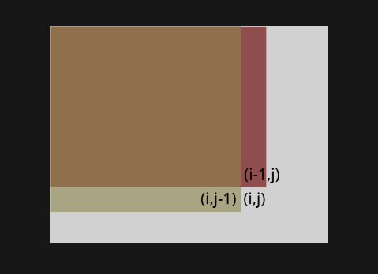

# 前缀和

前缀和是一种处理数组区间和查询问题的有效方法。它的基本思想是，通过一次遍历原始数组，计算出从数组开始到当前位置的所有元素的和，并将这些和存储在一个新的数组中。这样，当我们需要查询数组中某个区间的元素和时，就可以通过简单的减法操作快速得到结果，而不需要再次遍历整个区间。

具体步骤如下：

1. 初始化一个前缀和数组 `prefixSum`，其长度比原数组 `arr` 的长度多 1，`prefixSum[0]` 通常设置为 0。

2. 遍历原数组 `arr`，对于数组中的每个元素 `arr[i]`，计算 `prefixSum[i+1] = prefixSum[i] + arr[i]`。

3. 当需要查询从索引 `i` 到 `j` 的元素和时，可以直接通过 `prefixSum[j+1] - prefixSum[i]` 得到结果。
例如，给定数组 `arr = [1, 2, 3, 4, 5]`，其前缀和数组 `prefixSum` 将是 `[0, 1, 3, 6, 10, 15]`。
使用前缀和可以大大提高查询效率，特别是当数组不变而区间和查询非常频繁时。它的时间复杂度为 O(n) 用于构建前缀和数组，每次查询的时间复杂度为 O(1)。这使得前缀和成为处理这类问题的常用技巧。

## 例题 #1 高维前缀和 [SCOI2006] 数字立方体

有一个立方体被分成 $n\times n\times n$ 的单位，坐标用 $(X,Y,Z)$ 表示 $(1\le X,Y,Z\le n)$。每个单位立方体内有一个绝对值不超过 $10^9$ 的整数。统计有多少个子立方体的所有数之和是 $m$ 的倍数。子立方体即满足 $x_1\le X\le x_2$，$y_1\le Y\le y_2$，$z_1\le Z\le z_2$ 的所有单位立方体集合，其中 $1\le x_1,x_2,y_1,y_2,z_1,z_2\le n$。

- $100\%$ 的数据满足 $1\le n\le 40$。

对于所有的数据满足 $1\le m\le 10^6$。

---

思路

众所周知我们最多有 $n\times n\times n=40^3=64000$ 个单位。

**一维**

我们先来考虑一个简单的版本：有一个长度为 $n$ 的数组。统计有多少个区间的所有数之和是 $m$ 的倍数。

对于这个问题，我们很容易想到我们计算出数组的前缀和，然后我们 $O(n)$ 枚举区间的长度，然后 $O(n)$ 枚举区间的左端点。假设区间为 $[l,r]$，那么我们只需要考虑 $qzh_{r}-qzh_{l-1}$ 是否是 $m$ 的倍数即可。时间复杂度为 $O(n^2)$。

**二维**

我们先来考虑一个简单一点的版本：有一个平面被分成 $n\times n$ 的单位。每个单位内有一个绝对值不超过 $10^9$ 的整数。统计有多少个矩形的所有数之和是 $m$ 的倍数。

> 我们用 $[(a,b)(x,y)] $来表示一个矩形，其左上角坐标为 $(a,b)$，右下角坐标为 $(x,y)$。

对于这个问题，我们照葫芦画瓢，按照上面的思路。不难想到，对于矩形 $[(x,y)(a,b)]$ 我们 $O(n^2)$ 枚举矩形的长，即 $x,a$，然后再扫一遍，枚举 $y,b$，用二维前缀和进行判断。时间复杂度 $O(n^4)$。

我们考虑优化。（这里就那一维来讲）我们需要考虑 $qzh_{r}-qzh_{l-1}$ 是否是 $m$ 的倍数，这个条件可以变成 $qzh_{r}\equiv qzh_{l-1}\pmod m$。所以回到二维，当我们确定好 $x,a$ 时，在从前往后扫描 $y$ 时，我们记录前面有几个矩形 $[(x,1))(a,b)]$ 的和对 $m$ 取模的值为 $i$，我们开一个桶 $ton_i$ 来记录。

后面当我们枚举到一个矩形 $[(x,1))(a,b')]$ 的和对 $m$ 取模的值为 $i$，我们只要把答案加上 $ton_i$ 即可，然后更新 $ton_i$ 的值。

**解决问题**

选择我们来到了三维空间。还是和上面的一样，我们花 $O(n^4)$ 来枚举一下 $x,y$ 轴，对于 $z$ 轴，我们通过同余+桶来优化。时间复杂度为 $O(n^5)$，比暴力少一个 $n$。

本题还有一个知识点，即高维前缀和。我们现在从二维开始考虑。


二维前缀和如图。

$qzh_{i,j}=qzh_{i-1,j}+qzh_{i,j-1}-qzh_{i-1,j-1}+a_{i,j}$




三维前缀和也可以推导出来。

$q_{i,j,k}=q_{i-1,j,k}+q_{i,j-1,k}+q_{i,j,k-1}-q_{i-1,j-1,k}-q_{i-1,j,k-1}-q_{i,j-1,k-1}+q_{i-1,j-1,k-1}+a_{i,j,k}$

很容易发现这是容斥原理的应用。不过我们现在还用不到它，等我们要高维前缀和时我们再用容斥。

代码

注意多次 `memset()` 复杂度过高！

本题巨卡常，连 `long long` 也开不了（幸好我很快就反应过来了）。

```C++
/*////////ACACACACACACAC///////////
       . Code  by  Ntsc .
       . Earn knowledge .
/*////////ACACACACACACAC///////////

#include<bits/stdc++.h>
//#define int long long
#define db double
#define rtn return
using namespace std;

const int N=1e2+5;
const int M=1e6;
const int Mod=1e5;
const int INF=1e5;

int n,m,p,T,q[N][N][N],a[N][N][N],ton[M],ans;

signed main(){
//	cin>>n>>m;
	 scanf("%d%d",&n,&m); 
	for(int i=1;i<=n;i++){
		for(int j=1;j<=n;j++){
			for(int k=1;k<=n;k++){
//				cin>>a[i][j][k];
				scanf("%d",&a[i][j][k]); 
//				q[i][j][k]=a[i][j][k]+q[i-1][j][k]+q[i][j][k-1]+q[i][j-1][k]-q[i-1][j-1][k]-q[i-1][j][k-1]-q[i][j-1][k-1]+q[i-1][j-1][k-1];
//				q[i][j][k]%=m;
			}
		}
	}
	
	for(int i=1;i<=n;i++){
		for(int j=1;j<=n;j++){
			for(int k=1;k<=n;k++){
				q[i][j][k]=a[i][j][k]+q[i-1][j][k]+q[i][j][k-1]+q[i][j-1][k]-q[i-1][j-1][k]-q[i-1][j][k-1]-q[i][j-1][k-1]+q[i-1][j-1][k-1];
				((q[i][j][k]%=m)+=m)%=m;
			}
		}
	}
	queue<int> que;
	
	for(int x=1;x<=n;x++){
		for(int a=x;a<=n;a++){
			for(int y=1;y<=n;y++){
				for(int b=y;b<=n;b++){
//					memset(ton,0,sizeof ton);
					
					while(que.size()){
						ton[que.front()]=0;
						que.pop();
					}
					
					for(int i=1;i<=n;i++){
						int sum=q[a][b][i]-q[x-1][b][i]-q[a][y-1][i]+q[x-1][y-1][i];
						sum=(sum%m+m)%m;
//						cerr<<"sum="<<sum<<endl;
						if(!sum)ans++;//注意哦,如果当前立方体恰好是m的倍数,那么要加上不减去前面任何立方体这种情况哦! 
						
						if(!ton[sum])que.push(sum);
						
						ans+=ton[sum];ton[sum]++;
					}
				}
			}
		}
	}
	
//	cout<<ans<<endl;
	printf("%d",ans);
	return 0;
}


```

## 例题 #2 非常规前缀和 [ARC136D] Without Carry

给定一个长度为 $n$ 的数列 $S$，设 $A_{i,j}$ 代表 $S_i$ 十进制表示法中从右往左数第 $j$ 位的数，如果字符串长度 $<j$ 则 $A_{i,j} = 0$。

求满足 $\forall k \in [1, 6], A_{i, k} + A_{j, k} < 10$ 的二元数对 $(i, j)$ 的个数。

- $2\ \leq\ N\ \leq\ 10^6$

- $0\ \leq\ A_i\ \leq\ 10^6-1$

---

我们考虑，如果文明可以维护一个高维前缀和，那么我们就可以枚举i，然后计算与之配对的j的数量。最后去除(i,j)再除2就是答案了。

这个前缀和上是一个6维前缀和，原型是pre[][][][][][]，维度大小0~9。

我们将每一维压缩进一个字符，变为pre[]。

和正常前缀和类似，但是这里的pre[i]是pre[j]之和，满足j+i（不进位）的所有数位<10。

怎么样构建这个pre数组呢？首先将所有的pre_{a[]}赋值1，然后枚举数位i，枚举每一个j。如果$j/pw[i] \bmod 10≠0$，那么有pre[j]+=pre[j-pw[i]]。含义是我们将i中一个非0数位-1后，累加到i中。这样我们就可以处理出所有满足“j的每一位都小于等于i的这一位”的数字j的个数了。

最好询问与$a_i$配对的数的数量，我们就是求“j的每一位都小于等于$999999-a_i$的这一位”的数字j的个数

```C++
/*  Erica N  */
#include <bits/stdc++.h>
using namespace std;

#define pb push_back
#define mp make_pair
#define int long long
#define ull unsigned long long
#define pii pair<int, int>
#define ps second
#define pf first
#define itn int

#define rd read()
int read(){
    int xx = 0, ff = 1;char ch = getchar();
    while (ch < '0' || ch > '9') {if (ch == '-')ff = -1; ch = getchar();}
    while (ch >= '0' && ch <= '9')xx = xx * 10 + (ch - '0'), ch = getchar();
    return xx * ff;
}

#define cdbg(x...) do { cerr << #x << " -> "; err(x); } while (0)
void err() { cerr << endl; }
template<template<typename...> class T, typename t, typename... A>
void err(T<t> a, A... x) { for (auto v: a) cerr << v << ' '; err(x...); }
template<typename T, typename... A>
void err(T a, A... x) { cerr << a << ' '; err(x...); }


const int N = 3e6 + 5;
const int INF = 1e18;
const int M = 1e7;
const int MOD = 1e9 + 7;

int pw[N],pre[N];
int a[N];

void solve(){

    int n=rd;
    int ans=0;
    pw[0]=1;
    for(int i=1;i<=6;i++)pw[i]=pw[i-1]*10;
    for(int i=1;i<=n;i++){ //如果(i,i)合法，那么应该先减去
        a[i]=rd;
        pre[a[i]]++;
        int f=1;
        for(int j=0;j<6;j++){
            if(a[i]/pw[j]%10>=5)f=0;
        }
        if(f)ans--;
    }
    for(int i=0;i<6;i++){
        for(int j=0;j<1000000;j++){
            if(j/pw[i]%10)pre[j]+=pre[j-pw[i]];
        }
    }

    /*
    6维前缀和，原型是pre[][][][][][]，维度大小0~9
    将每一维压缩进一个字符，变为pre[]

    和正常前缀和类似，但是这里的pre[i]是pre[j]之和，满足j+i（不进位）的所有数位<10
    */


    for(int i=1;i<=n;i++){
        ans+=pre[1000000-a[i]-1];
    }


    cout<<(ans>>1)<<endl;

     
}

signed main() {
    // freopen(".in","r",stdin);
    // freopen(".out","w",stdout);

    int T=1;
    while(T--){
    	solve();
    }
    return 0;
}
```

