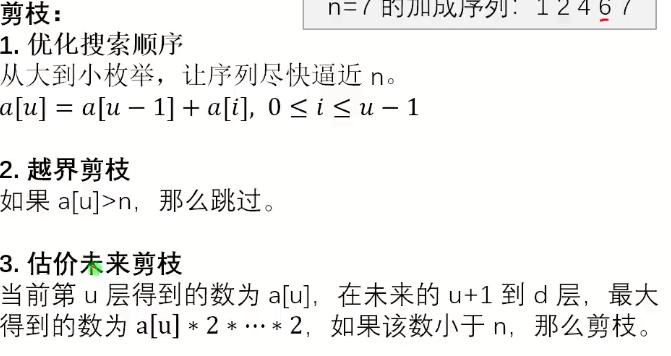

# 剪枝



想必不需要多说了，懂的都懂

## 最优化剪枝

最优化剪枝是一种在搜索算法或求解最优化问题过程中使用的技术。

其核心思想是在搜索过程中，通过一定的判断条件提前终止那些不可能产生最优解的分支，从而减少不必要的计算，提高算法的效率。

例如，在进行回溯算法或者树的遍历求解最优值时，如果根据当前已有的部分解和一些先验知识，能够确定沿着当前分支继续搜索下去无法得到比已知最优解更优的结果，就可以将这个分支剪掉，不再继续深入探索。

最优化剪枝通常需要结合具体问题的特性和一些巧妙的设计来确定合适的剪枝条件，以在不丢失最优解的前提下最大程度地减少搜索空间。

### 例题 #1 优秀子矩阵


---

最优化剪枝

我们还是按照$O(n^2m)$的套路去扫描。

加入当前扫描到了r，此时答案左边界为l。那么当r+1时，我们就让预期答案l+1，然后通过前缀最大值判断l是否可以-1.知道越界或不在符合要求。

因为此时我们答案区间的长度是递增的，所以时间复杂度为O(m)。

合计复杂度为$O(n^2m)$

```C++
/*
                      Keyblinds Guide
                                ###################
      @Ntsc 2024

      - Ctrl+Alt+G then P : Enter luogu problem details
      - Ctrl+Alt+B : Run all cases in CPH
      - ctrl+D : choose this and dump to the next
      - ctrl+Shift+L : choose all like this
      - ctrl+K then ctrl+W: close all
      - Alt+la/ra : move mouse to pre/nxt pos'

*/
#include <bits/stdc++.h>
#include <queue>
using namespace std;

#define rep(i, l, r) for (int i = l, END##i = r; i <= END##i; ++i)
#define per(i, r, l) for (int i = r, END##i = l; i >= END##i; --i)
#define pb push_back
#define mp make_pair
#define int long long
#define pii pair<int, int>
#define ps second
#define pf first
#define ull unsigned long long

#define itn int
// #define inr int
// #define mian main
// #define iont int

#define rd read()
int read() {
    int xx = 0, ff = 1;
    char ch = getchar();
    while (ch < '0' || ch > '9') {
        if (ch == '-')
            ff = -1;
        ch = getchar();
    }
    while (ch >= '0' && ch <= '9') xx = xx * 10 + (ch - '0'), ch = getchar();
    return xx * ff;
}
void write(int out) {
    if (out < 0)
        putchar('-'), out = -out;
    if (out > 9)
        write(out / 10);
    putchar(out % 10 + '0');
}

#define ell dbg('\n')
const char el = '\n';
const bool enable_dbg = 1;
template <typename T, typename... Args>
void dbg(T s, Args... args) {
    if constexpr (enable_dbg) {
        cerr << s;
        if (1)
            cerr << ' ';
        if constexpr (sizeof...(Args))
            dbg(args...);
    }
}

const int N = 3e3 + 5;
const int INF = 1e18;
const int M = 1e5;
const int MOD = 1e9 + 7;

int ans;
int a[N][N];
int p[N][N];

itn pre[N];

void solve() {
    itn n = rd, m = rd;

    for (int i = 1; i <= n; i++) {
        for (itn j = 1; j <= m; j++) {
            a[i][j] = rd;
        }
    }

    for (int i = 1; i <= n; i++) {
        for (itn j = 1; j <= m; j++) {
            p[i][j] = p[i - 1][j] + p[i][j - 1] + a[i][j] - p[i - 1][j - 1];
        }
    }

    pre[0] = 0;
    for (int i = 1; i <= n; i++) {
        for (int j = i; j <= n; j++) {
            int l = 0;
            for (itn k = 1; k <= m; k++) {
                while (l >= 1 && pre[l - 1] <= p[j][k] - p[i - 1][k]) l--;

                if (pre[l] <= p[j][k] - p[i - 1][k])
                    ans = max(ans, (j - i + 1) * (k - l));

                pre[k] = min(pre[k - 1], p[j][k] - p[i - 1][k]);
                l++;
            }
        }
    }

    cout << ans << endl;

    //前缀最小值单调
}

signed main() {
    freopen("rec.in", "r", stdin);
    freopen("rec.out", "w", stdout);

    int T = 1;
    while (T--) {
        solve();
    }
    return 0;
}
```

## 估价剪枝

