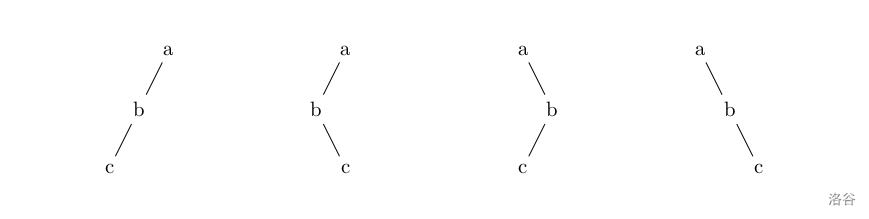

# 概念

## 优先级

- 优先级：任务处理的紧急程度或重要性排序。

## 哈夫曼编码

- 哈夫曼编码：一种基于频率的压缩算法，用于优化数据存储。

## 四元组运算

- 定心2中的四元组运算：在计算机图形学中，涉及四元数的一种运算，用于旋转处理。

## 取模

- 取模：a%b的正负取决于a，与b无关。

## 时间复杂度的递推计算

- 时间复杂度的递推计算：通过递推关系分析算法运行时间的增长趋势。

## 原码、反码、补码

- 正数三码相同：正数的原码、反码、补码相同；负数的补码是反码+1。

## 后缀表达式的规则

先从左到右依次入栈

当是数字的时候直接入栈

当是运算符号的时候

就将栈的最上面两个数拿出进行运算 后 再将结果进栈 记住（栈顶元素永远在运算符号的右边）

**中缀表达式**就是四则运算表达式

## topu排序

拓扑排序常用来确定一个依赖关系集中，事物发生的顺序。例如，在日常工作中，可能会将项目拆分成A、B、C、D四个子部分来完成，但A依赖于B和D，C依赖于D。为了计算这个项目进行的顺序，可对这个关系集进行拓扑排序，得出一个线性的序列，则排在前面的任务就是需要先完成的任务。
注意：这里得到的排序并不是唯一的！就好像你早上穿衣服可以先穿上衣也可以先穿裤子，只要里面的衣服在外面的衣服之前穿就行。

## X序遍历

- 前序(根左右)（即点在第一次访问到时记录，【输出|左|右】）

- 中序(左根右)（即点在左子树回溯后记录，【左|输出|右】）

- 后序(左右根)（即点在回溯时记录，【左|右|输出】）

前序就是dfs序。

### 遍历问题

我们都很熟悉二叉树的前序、中序、后序遍历，在数据结构中常提出这样的问题：已知一棵二叉树的前序和中序遍历，求它的后序遍历，相应的，已知一棵二叉树的后序遍历和中序遍历序列你也能求出它的前序遍历。然而给定一棵二叉树的前序和后序遍历，你却不能确定其中序遍历序列，考虑如下图中的几棵二叉树：

所有这些二叉树都有着相同的前序遍历和后序遍历，但中序遍历却不相同。

共两行，第一行表示该二叉树的前序遍历结果 $s_1$，第二行表示该二叉树的后序遍历结果 $s_2$。

保证至少存在一棵二叉树满足给出的信息，$s _ 1, s _ 2$ 中只含小写字母，且在某个字符串中不存在相同的字母。

输出可能的中序遍历序列的总数，结果不超过 $2^{63}-1$。

---

我们发现只有一个儿子 的节点 才会在知道 前序后序 的情况下有不同的中序遍历，所以将题目转化成找 只有一个儿子的节点个数。

可以很容易的找出这类节点在前序后序中出现的规律。（前序中出现AB，后序中出现BA，则这个节点只有一个儿子）

每个这类节点有两种中序遍历（及儿子在左，儿子在右）根据乘法原理中序遍历数为 2^节点个数 种

## 对象与类

int这些是类，第定义的变量是对象（应该是

