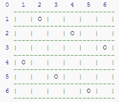

深搜

# 八皇后

## 题目描述

一个如下的 $6 \times 6$ 的跳棋棋盘，有六个棋子被放置在棋盘上，使得每行、每列有且只有一个，每条对角线（包括两条主对角线的所有平行线）上至多有一个棋子。



上面的布局可以用序列 $2\ 4\ 6\ 1\ 3\ 5$ 来描述，第 $i$ 个数字表示在第 $i$ 行的相应位置有一个棋子，如下：

行号 $1\ 2\ 3\ 4\ 5\ 6$

列号 $2\ 4\ 6\ 1\ 3\ 5$

这只是棋子放置的一个解。请编一个程序找出所有棋子放置的解。
并把它们以上面的序列方法输出，解按字典顺序排列。
请输出前 $3$ 个解。最后一行是解的总个数。

## 输入格式

一行一个正整数 $n$，表示棋盘是 $n \times n$ 大小的。

## 输出格式

前三行为前三个解，每个解的两个数字之间用一个空格隔开。第四行只有一个数字，表示解的总数。

## 样例 #1

### 样例输入 #1

```Plain Text
6
```

### 样例输出 #1

```Plain Text
2 4 6 1 3 5
3 6 2 5 1 4
4 1 5 2 6 3
4
```

## 提示

【数据范围】
对于 $100\%$ 的数据，$6 \le n \le 13$。

题目翻译来自NOCOW。

USACO Training Section 1.5

## 思路

**深搜递归**

对于一条从右上到左下的对角线，其上的棋子坐标应满足`x+y`为一**定值**；

对于一条从左上到右下的对角线，其上的棋子坐标应满足`x-y`为一**定值**，为了避免**负数**的产生，代码中用`x-y+n`来储存数字，具体效果读者可以自行研究。

因此,我们就可以做到使用数组快速存储与判定`对角线/行/列`是否存在别的皇后
因为我们是**逐行搜索递归**的,不需要存储该行是否有别的皇后

`chk[0]`储存了棋子的列数，每一次进行`ans[l]=i`，使`chk[0][i]`标记为已使用；

`chk[1]`和`chk[2]`储存对角线上的棋子分布情况：

## 代码

```C++
#include<bits/stdc++.h>

using namespace std;
int ans[14],chk[3][28],cnt,n;
void go(int l){
	if(l>n){	//找到了一种满足条件的八皇后排列!
		cnt++;
		if(cnt<=3){	//特判是第几个,输出
			for(int i=1;i<=n;i++)cout<<ans[i]<<' ';
			cout<<endl;
		}
		return;
	}
	for(int i=1;i<=n;i++){
		if(!(chk[0][i])&&!(chk[1][l+i])&&!(chk[2][l-i+n])){	//在该行找到了一个可以放置皇后的地方,向下递归
			chk[0][i]=1;chk[1][l+i]=1;chk[2][l-i+n]=1;
			ans[l]=i;
			go(l+1);
			chk[0][i]=chk[1][l+i]=chk[2][l-i+n]=0;
		}
		//如果该行没有找到任何一个可以放到地方,则无功而返!
	}
	
}
int main() {
	cin>>n;
	go(1);
	cout<<cnt;
	return 0;
}
```

摆脱传统思想!接受递归思想!

