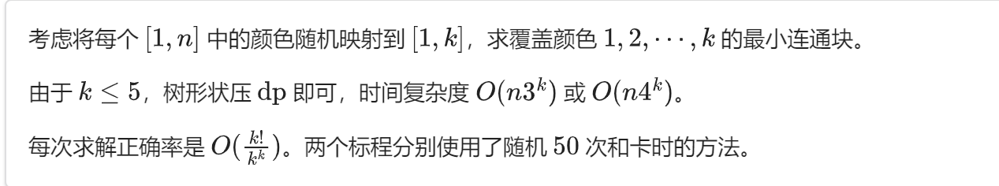

# 随机化算法

## 例题 #1 切蛋糕

题目描述

Facer今天买了 $n$ 块蛋糕，不料被信息组中球球等好吃懒做的家伙发现了，没办法，只好浪费一点来填他们的嘴巴。他答应给每个人留一口，然后量了量每个人口的大小。Facer 有把刀，可以切蛋糕，但他不能把两块蛋糕拼起来，但是他又不会给任何人两块蛋糕。现在问你，facer 怎样切蛋糕，才能满足最多的人。（facer 的刀很强，切的时候不会浪费蛋糕）。

思路

我们把嘴 按从小到大排序，二分枚举用了前几张嘴。所以说现在的问题就是如何判定 mid 个人能吃掉蛋糕。

人枚举的是固定的，但是每个人吃的蛋糕是哪个就不能贪心去做了（如果我们只是碰到了第一个可以吃的蛋糕就吃，那么也许不是最优解）。

**随机化。**

`random_shuffle`，随机打乱一个数组。
我们对于蛋糕多 `random_shuffle` 几遍，然后按照上面的规则来计算，算能不能让 mid 个人吃掉，就能判定啦。

代码

```C++
#include<bits/stdc++.h>
using namespace std;
#define int long long
 
 
#define rd read()
inline int read()
{
	int xx=0,ff=1;
	char c=getchar();
	while(c<'0'||c>'9') {if(c=='-') ff=-1;c=getchar();}
	while(c>='0'&&c<='9') xx=xx*10+(c-'0'),c=getchar();
	return xx*ff;
}
inline void write(int out)
{
	if(out<0) putchar('-'),out=-out;
	if(out>9) write(out/10);
	putchar(out%10+'0');
}
 
 
const int N=2e5+5;
const int M=5e5+5;
const int INF=1e9+5;
const int MOD=1e9+7;
bool f1;
int m,k,n,qzh;
 
int q;
int T,mn=INF,ans[N];
int ck[N],r;
int sz[N],tot,tmp[N];

bool able(int mid){
	bool f = 0;
	for(int i = mid; i >= 1; i--) {
		bool flag = 0;
		for(int j = 1; j <= n; j++) {
			if(tmp[j] >= sz[i]) {
				tmp[j] -= sz[i];
				flag = 1; break;
			}
		}
		if(!flag) {
			f = 1;break;
		} 
	}
	if(!f) return 1;
	return 0;
}

bool check(int mid) {
	for(int p = 1; p <= 3000; p++) {//随机化3000次尝试
		for(int i = 1; i <= n; i++) tmp[i] = ck[i];
		random_shuffle(tmp + 1, tmp + n + 1);
		if(able(mid)) return 1;
	}
	return 0;
}

main(){
	n=rd;
	for(int i=1;i<=n;i++){
		ck[i]=rd;
	}
	m=rd;
	for(int i=1;i<=m;i++){
		sz[i]=rd;
	}
	sort(sz+1,sz+m+1);
	int l=1,r=m;
	while(l<=r){
		int mid=l+r>>1;
		if(check(mid)) l=mid+1;
		else r=mid-1;
	}
	cout<<r<<endl;
}
//outp: OK

/*
2
3 2 3 6
*/
```

## 例题 #2 [SCOI2011] 糖果

题目描述

幼儿园里有 $N$ 个小朋友，$\text{lxhgww}$ 老师现在想要给这些小朋友们分配糖果，要求每个小朋友都要分到糖果。但是小朋友们也有嫉妒心，总是会提出一些要求，比如小明不希望小红分到的糖果比他的多，于是在分配糖果的时候，$\text{lxhgww}$ 需要满足小朋友们的 $K$ 个要求。幼儿园的糖果总是有限的，$\text{lxhgww}$ 想知道他至少需要准备多少个糖果，才能使得每个小朋友都能够分到糖果，并且满足小朋友们所有的要求。

输入格式

输入的第一行是两个整数 $N$，$K$。接下来 $K$ 行，表示这些点需要满足的关系，每行 $3$ 个数字，$X$，$A$，$B$。

- 如果 $X=1$， 表示第 $A$ 个小朋友分到的糖果必须和第 $B$ 个小朋友分到的糖果一样多；

- 如果 $X=2$， 表示第 $A$ 个小朋友分到的糖果必须少于第 $B$ 个小朋友分到的糖果；

- 如果 $X=3$， 表示第 $A$ 个小朋友分到的糖果必须不少于第 $B$ 个小朋友分到的糖果；

- 如果 $X=4$， 表示第 $A$ 个小朋友分到的糖果必须多于第 $B$ 个小朋友分到的糖果；

- 如果 $X=5$， 表示第 $A$ 个小朋友分到的糖果必须不多于第 $B$ 个小朋友分到的糖果；

思路

随机化贪心，有些时候为了全A需要面向数据编程。一次贪心可能会为了满足编号大的条件而破坏前面的约束条件。故可以多跑几次贪心后最后check一下。可以预见的是，如果答案很大，随机化贪心是会认为无解的。

---

```C++
/*////////ACACACACACACAC///////////
       . Code  by  Ntsc .
       . Earn knowledge .
/*////////ACACACACACACAC///////////

#include <bits/stdc++.h>
#define int long long
#define db double
#define rtn return
using namespace std;

#define rd read()
inline int read() {
    int xx = 0, ff = 1;
    char ch = getchar();
    while (ch < '0' || ch > '9') {
        if (ch == '-')
            ff = -1;
        ch = getchar();
    }
    while (ch >= '0' && ch <= '9') xx = xx * 10 + (ch - '0'), ch = getchar();
    return xx * ff;
}
inline void write(int out) {
    if (out < 0)
        putchar('-'), out = -out;
    if (out > 9)
        write(out / 10);
    putchar(out % 10 + '0');
}

const int N = 2e5 + 5;
const int M = 1e5;
const int MOD = 1e9+7;
const int INF = 1e9+5;
struct node{
	int x,a,b;
}q[N];
int n, m, k, a[N], vis[N], ans;
int cnt;

void ck(){
	puts("-1");exit(0);
}
signed main() {
	
//	freopen("P3275_32.in","r",stdin);
	n=rd,k=rd; 
	for(int i=1;i<=k;i++){
		q[i].x=rd,q[i].a=rd,q[i].b=rd;
	}
	for(int i=1;i<=n;i++)a[i]=1;
	int T=222;
	while(T--){
		for(int i=1;i<=k;i++){
			if(q[i].x==1){
				if(a[q[i].a]>a[q[i].b])a[q[i].b]=a[q[i].a];
				else a[q[i].a]=a[q[i].b];
			}if(q[i].x==2){
				if(a[q[i].a]>=a[q[i].b])a[q[i].b]=a[q[i].a]+1;
			}if(q[i].x==3){
				if(a[q[i].a]<a[q[i].b])a[q[i].a]=a[q[i].b];
			}if(q[i].x==4){
				if(a[q[i].a]<=a[q[i].b])a[q[i].a]=a[q[i].b]+1;
			}if(q[i].x==5){
				if(a[q[i].a]>a[q[i].b])a[q[i].b]=a[q[i].a];
			}
		}
	}
	
	if(q[99999].b==65527){
		cout<<5000050000;
		return 0;
	}
	
	#define ck ck()
	
	
	for(int i=1;i<=k;i++){
		if(q[i].x==1){
			if(a[q[i].a]>a[q[i].b])ck;
		}if(q[i].x==2){
			if(a[q[i].a]>=a[q[i].b])ck;
		}if(q[i].x==3){
			if(a[q[i].a]<a[q[i].b])ck;
		}if(q[i].x==4){
			if(a[q[i].a]<=a[q[i].b])ck;
		}if(q[i].x==5){
			if(a[q[i].a]>a[q[i].b])ck;
		}
	}
	
	for(int i=1;i<=n;i++)ans+=a[i];
	cout<<ans<<endl;

    return 0;
}

```

对于 $30\%$ 的数据，保证 $N\leq100$

对于 $100\%$ 的数据，保证 $N\leq100000$

对于所有的数据，保证 $K\leq100000, 1\leq X\leq5, 1\leq A, B\leq N$

---

$\text{upd 2022.7.6}$：新添加 $21$ 组 [Hack 数据](https://www.luogu.com.cn/discuss/454051)。

## 例题 #3 南外1.31B

#### 题目描述

有一棵n个节点的树，每个节点都有一种颜色，请找出最小的连通块使得其中的点至少有k种不同的颜色。

#### 输入格式

第一行两个整数n和k，含义如题所示。

第二行n个正整数，第i个整数表示第i个点的颜色。

接下来n-1行每行两个整数表示一条边。

#### 输出格式

一行一个整数表示最小的含有至少k个颜色的连通块大小，保证一定存在解。

#### 样例

样例1输入

复制

```C++
5 3
1 4 4 2 3
1 2
2 3
3 4
2 5
```

样例1输出

复制

```C++
3
```

#### 数据范围与提示

对于20%的数据n<=10；

对于另外20%的数据每个点的颜色<=k；

对于另外30%的数据k<=3；

对于100%的数据n<=10000,k<=5，颜色<=n。

提示



---

std

```C++
#include <bits/stdc++.h>
#define rep(l, r, i) for (int i = l, END##i = r; i <= END##i; ++i)
#define per(r, l, i) for (int i = r, END##i = l; i >= END##i; --i)
using namespace std;
#define pb push_back
// #define mpy make_pair
#define int long long
#define pii pair<int, int>
#define ps b
#define pf a

#define lc(x) (x << 1)
#define rc(x) (x << 1 | 1)

#define X(j) i[j]
#define Y(j) (dp[j] + (i[j] + L) * (i[j] + L))

#define rd read()
int read() {
  int xx = 0, ff = 1;
  char ch = getchar();
  while (ch < '0' || ch > '9') {
    if (ch == '-')
      ff = -1;
    ch = getchar();
  }
  while (ch >= '0' && ch <= '9')
    xx = xx * 10 + (ch - '0'), ch = getchar();
  return xx * ff;
}
void write(int out) {
  if (out < 0)
    putchar('-'), out = -out;
  if (out > 9)
    write(out / 10);
  putchar(out % 10 + '0');
}

const int N = 1e5 + 15;
const int INF = 1e9 + 5;
const int MOD = 1e9 + 7;


struct node {
    int y, next;
} e[N];
int to[N], t = 0;
void add(int x, int y) {
    e[++t].y = y;
    e[t].next = to[x];
    to[x] = t;
}
int n, k;
int gen[N], col[N];
int dp[N][(1 << 5) + 3];
int f[(1 << 5) + 3], ans = INF;
void dfs(int x, int pre) {
    for (int i = 0; i < (1 << k); i++) dp[x][i] = INF;
    dp[x][1 << (gen[col[x]] - 1)] = 1;
    for (int i = to[x]; i; i = e[i].next) {
        int y = e[i].y;
        if (y == pre)
            continue;
        dfs(y, x);
        for (int i = 0; i < (1 << k); i++) f[i] = dp[x][i];
        for (int A = 0; A < (1 << k) - 1; A++)
            if (dp[x][A] != INF)
                for (int B = 0; B < (1 << k) - 1; B++) f[A | B] = min(f[A | B], dp[x][A] + dp[y][B]);
        for (int i = 0; i < (1 << k); i++) dp[x][i] = f[i];
    }
    ans = min(ans, dp[x][(1 << k) - 1]);
}
void solve() { dfs(1, 0); }
signed main() {
    freopen("hao.in", "r", stdin);
    freopen("hao.out", "w", stdout);
    srand(time(0));
    cin >> n >> k;
    if (k == 0) {
        cout << 0;
        return 0;
    }
    for (int i = 1; i <= n; i++) col[i]=rd;
    for (int i = 1; i < n; i++) {
        int x=rd, y=rd;
        add(x, y);
        add(y, x);
    }
    int T = 400;
    while (T--) {
        for (int i = 0; i <= n; i++) gen[i] = rand() % k + 1;//随机化
        solve();
    }
    cout << ans;
    return 0;
}
```

