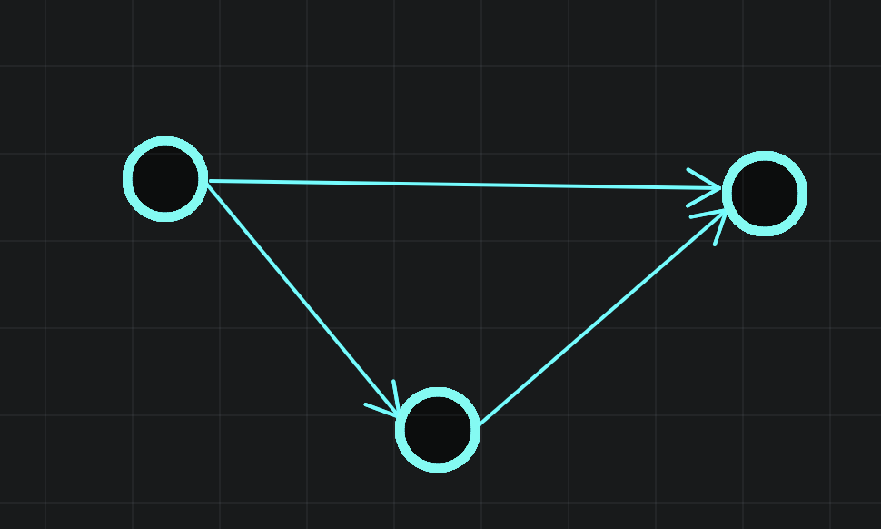
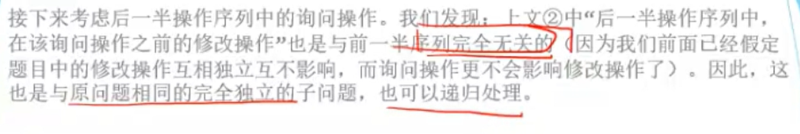

专题 | 分治&排序&偏序

# 目录

- 排序（快速/归并）

- 二分

    - wqs 二分

- 点分治

- 动态点分治

- FFT高精度算法

- cdq分治

## 分治

例题

[题解 | 平面最近点对](https://flowus.cn/cba00ceb-b309-4e66-9416-2405d85ac6e2)

# 排序

## 简单排序

**堆排序**

全部入优先队列，然后全部出。

**sort**

不用多说了。 

## 计数排序

先统计一遍~~塔姬娅~~桶，然后将桶前缀和，最后从桶中得到排序。

```C++
for(int i=1;i<=n;i++)cnt[a[i]]++;
for(int i=1;i<M;i++)cnt[i]+=cnt{i-1};
for(int i=1;i<=n;i++)rk[i]=cnt[a[i]],b[cnt[a[i]]--]=a[i];
```

## 基数排序

基数排序通过若干个关键字排序。假设对int数字进行排序，那么我们可以把每个数字n的二进制小16位作为第二关键字，大16位作为第一关键字。然后先对第二关键字进行计数排序，然后对第一关键字进行计数排序。这样的排序是稳定的，因为计数排序的从前往后，对于值相同的数相对顺序不会改变的。

代码可以参考[学习笔记 | SA](https://flowus.cn/cdc2f36a-560c-4abe-aed9-a36439b488d5)后缀数组计算函数


## 归并排序

```C++
#include<bits/stdc++.h>
using namespace std;
#define N 100010
#define int long long
int a[N], tmp[N];
int cnt;

void merge(int left, int mid, int right) {
	int i, j, k;
	i = left;
	j = mid + 1;
	k = left;
	while (i <= mid && j <= right) {
		if (a[i] > a[j]) {
			cnt += j - k;//或者cnt += mid-i+1;
			tmp[k++] = a[j++];
		} else {
			tmp[k++] = a[i++];
		}
	}
	while (i <= mid)
		tmp[k++] = a[i++];
	while (j <= right)
		tmp[k++] = a[j++];

	for (i = left; i <= right; i++)
		a[i] = tmp[i];
}

void merge_sort(int left, int right) {
	int mid;
	if (left == right)
		return;
	mid = (left + right) / 2;
	merge_sort(left, mid);
	merge_sort(mid + 1, right);
	merge(left, mid, right);
}

signed main() {
	int i, n;

	scanf("%lld", &n);
	for (i = 1; i <= n; i++)
		scanf("%lld", &a[i]);

	merge_sort(1, n);
	
	printf("%lld\n", cnt);
	
	for(int i=1;i<=n;i++){
		cout<<a[i]<<' ';
	}
	return 0;
}
```

# 自定义规则排序 | [NOIP1998 提高组] 拼数

## 题目描述

设有 $n$ 个正整数 $a_1 \dots a_n$，将它们联接成一排，相邻数字首尾相接，组成一个最大的整数。

---

按a+b>b+a排序！不要按a>b排序（hack：）


```C++
6
321 32 407 135 13 217
 
```


```C++
4073232121713513

```


WA ans：

4073213221713513

```C++
string s[N];

bool cmp(string a,string b){
	return a+b>b+a;
}
signed main() {
//    freopen("tree.in", "r", stdin);
//    freopen("tree.out", "w", stdout);
	cin>>n;
	for(int i=1;i<=n;i++)cin>>s[i];
	sort(s+1,s+n+1,cmp);
	for(int i=1;i<=n;i++)cout<<s[i];
    return 0;
}
```

# 拓扑排序


## 排序

一个不同的值的升序排序数列指的是一个从左到右元素依次增大的序列，例如，一个有序的数列 $A,B,C,D$ 表示 $A<B,B<C,C<D$。在这道题中，我们将给你一系列形如 $A<B$ 的关系，并要求你判断是否能够根据这些关系确定这个数列的顺序。

输入格式

第一行有两个正整数 $n,m$，$n$ 表示需要排序的元素数量，$2\leq n\leq 26$，第 $1$ 到 $n$ 个元素将用大写的 $A,B,C,D,\dots$ 表示。$m$ 表示将给出的形如 $A<B$ 的关系的数量。

接下来有 $m$ 行，每行有 $3$ 个字符，分别为一个大写字母，一个 `<` 符号，一个大写字母，表示两个元素之间的关系。

输出格式

若根据前 $x$ 个关系即可确定这 $n$ 个元素的顺序 `yyy..y`（如 `ABC`），输出

`Sorted sequence determined after xxx relations: yyy...y.`

若根据前 $x$ 个关系即发现存在矛盾（如 $A<B,B<C,C<A$），输出

`Inconsistency found after x relations.`

若根据这 $m$ 个关系无法确定这 $n$ 个元素的顺序，输出

`Sorted sequence cannot be determined.`

（提示：确定 $n$ 个元素的顺序后即可结束程序，可以不用考虑确定顺序之后出现矛盾的情况）

$2 \leq n \leq 26,1 \leq m \leq 600$。

---

这题你可能会想到链表+搜索，但这样复杂度不太稳定，要剪枝。

其实这道题是拓扑排序。我们每次给出一个关系A>B就按连边A→B，然后跑一次拓扑排序。

对应每次拓扑排序，可能有以下的情况

- 拓扑不成立：提出

- 单链：可以继续

- 多条链：可能会有多种情况，可以继续。

到最后，可能会有以下情况

- 单链：根据前 $x$ 个关系即可确定这 $n$ 个元素的顺序

- 多条链：可能会有多种情况，若根据这 $m$ 个关系无法确定这 $n$ 个元素的顺序，输出`Sorted sequence cannot be determined.`


无非是可以出现这种情况，拓扑排序可以处理。





```C++
#include <bits/stdc++.h>
#define rep(l, r, i) for (int i = l, END##i = r; i <= END##i; ++i)
#define per(r, l, i) for (int i = r, END##i = l; i >= END##i; --i)
using namespace std;
#define pb push_back
#define mp make_pair
#define int long long
#define pii pair<int, int>
#define ps second
#define pf first

#define lc(x) (x << 1)
#define rc(x) (x << 1 | 1)

#define X(j) S[j]
#define Y(j) (dp[j] + (S[j] + L) * (S[j] + L))

#define rd read()
int read() {
  int xx = 0, ff = 1;
  char ch = getchar();
  while (ch < '0' || ch > '9') {
    if (ch == '-')
      ff = -1;
    ch = getchar();
  }
  while (ch >= '0' && ch <= '9')
    xx = xx * 10 + (ch - '0'), ch = getchar();
  return xx * ff;
}
void write(int out) {
  if (out < 0)
    putchar('-'), out = -out;
  if (out > 9)
    write(out / 10);
  putchar(out % 10 + '0');
}

const int N = 6e2 + 15;
const int INF = 1e9 + 5;
const int MOD = 1 << 30;

int n, m;
vector<int> e[N];
int ind[N];
int a[N];
stack<int> s;
bool vis[N];
int f;

bool topo(int r) {
  int sz = 0;
  bool finished = 1;
  int t[N];
  for (int i = 0; i < n; i++) {
    t[i] = ind[i];
    if (!ind[i])
      s.push(i), vis[i] = 1;
  }
  while (!s.empty()) {
    if (s.size() > 1)
      finished = 0;
    int k = s.top();
    a[sz++] = k;
    s.pop();
    for (int i = 0; i < e[k].size(); i++)
      t[e[k][i]]--;
    for (int i = 0; i < n; i++)
      if (!t[i] && !vis[i])
        s.push(i), vis[i] = 1;
    ;
  }
  if (sz < n)
    return 0;
  if (finished && !f)
    f = r;
  return 1;
}

signed main() {
  n = rd, m = rd;
  for (int i = 1; i <= m; i++) {
    char c[3];
    scanf("%s", c);
    int x = c[0] - 'A', y = c[2] - 'A';
    e[x].push_back(y);
    ind[y]++;
    if (!topo(i)) {
      cout << "Inconsistency found after " << i << " relations.";
      return 0;
    }else if(f)break;
    memset(vis, 0, sizeof(vis));
  }
  if (f) {
    cout << "Sorted sequence determined after " << f << " relations: ";
    for (int i = 0; i < n; i++)
      cout << char(a[i] + 'A');
    cout << ".";
  } else
    cout << "Sorted sequence cannot be determined.";
  return 0;
}

```

## 练习

使用拓扑排序来解决统计从DAG中所有最长路径的数量。这适用于当我们在dp时需要知道来点的信息来更新到点的信息时。

[www.luogu.com.cn](https://www.luogu.com.cn/problem/P4017)


拓扑排序的基本流程：

- 使用队列q动态维护图中所有入度为0的点的编号

- 先找到所有入度=0的点，加入q

- 知道q为空：从q中拿出一个点，删除该点的所有出边，并时刻维护q。

# Timsort排序

$O(n)$的极其优秀排序！

[timsort的c++实现_timsort c语言_熊掌鱼儿的博客-CSDN博客](https://blog.csdn.net/az1112/article/details/127787971)

# 二分

二分模板，可用。

```C++
int l=0,r=mxd;
	while(l<=r){
		int mid=l+r>>1;
		if(judge(mid))l=mid+1;
		else r=mid-1;
	}
	cout<<r<<endl;
```

略

# wqs 二分


# 整体二分 | [国家集训队] 矩阵乘法

## 题目描述

给你一个 $n \times n$ 的矩阵，不用算矩阵乘法，但是每次询问一个子矩形的第 $k$ 小数。

输入格式

第一行有两个整数，分别表示矩阵大小 $n$ 和询问组数 $q$。

第 $2$ 到第 $(n + 1)$ 行，每行 $n$ 个整数，表示这个矩阵。第 $(i + 1)$ 行的第 $j$ 个数表示矩阵第 $i$ 行第 $j$ 列的数 $a_{i, j}$。

接下来 $q$ 行，每行五个整数 $x_1, y_1, x_2, y_2, k$，表示一组询问，要求找到以 $(x_1, y_1)$ 为左上角，$(x_2, y_2)$ 为右下角的子矩形中的第 $k$ 小数。

#### 数据规模与约定

- 对于 $20\%$ 的数据，保证 $n \leq 100$，$q \leq 10^3$。

- 对于 $40\%$ 的数据，保证 $n \leq 300$，$q \leq 10^4$。

- 对于 $60\%$ 的数据，保证 $n \leq 400$，$q \leq 3 \times 10^4$。

- 对于 $100\%$ 的数据，保证 $1 \leq n \leq 500$，$1 \leq q \leq 6 \times 10^4$，$0 \leq a_{i, j} \leq 10^9$。

## 思路

看起来好像是使用主席树实现的，但是二维的我们有怎么实现呢？这里可以使用可持久化二维值域线段树吗？

这里我们引入一个新离线算法，叫做**整体二分**。

## 整体二分


## Code

```C++
/*                                                                                
                      Keyblinds Guide
     				###################
      @Ntsc 2024

      - Ctrl+Alt+G then P : Enter luogu problem details
      - Ctrl+Alt+B : Run all cases in CPH
      - ctrl+D : choose this and dump to the next
      - ctrl+Shift+L : choose all like this
      - ctrl+K then ctrl+W: close all
	  
*/
#include <bits/stdc++.h>
#include <queue>
using namespace std;

#define rep(i, l, r) for (int i = l, END##i = r; i <= END##i; ++i)
#define per(i, r, l) for (int i = r, END##i = l; i >= END##i; --i)
#define pb push_back
#define mp make_pair
#define int long long
#define pii pair<int, int>
#define ps second
#define pf first

// #define innt int
// #define inr int
// #define mian main
// #define iont int

#define rd read()
int read(){
    int xx = 0, ff = 1;
    char ch = getchar();
    while (ch < '0' || ch > '9') {
		if (ch == '-')
			ff = -1;
		ch = getchar();
    }
    while (ch >= '0' && ch <= '9')
      xx = xx * 10 + (ch - '0'), ch = getchar();
    return xx * ff;
}
void write(int out) {
	if (out < 0)
		putchar('-'), out = -out;
	if (out > 9)
		write(out / 10);
	putchar(out % 10 + '0');
}

const char el='\n';
const bool enable_dbg = 0;
template <typename T,typename... Args>
void dbg(T s,Args... args) {
	if constexpr (enable_dbg){
    cerr << s << ' ';
		if constexpr (sizeof...(Args))
			dbg(args...);
	}
}

const int N = 3e3 + 5;
const int INF = 1e18;
const int M = 1e6;
const int MOD = 1e9 + 7;

struct node{
    int x,y,u,v;
    int k,id;
}q[M],q1[M],q2[M];

int tot,ans[M];
int n,m,t[N][N];


namespace ctree{

    inline int lowbit(int x){
        return x&-x;
    }

    void add(int x,int y,int v){
        for(int i=x;i<=n;i+=lowbit(i)){
            for(int j=y;j<=n;j+=lowbit(j)){
                t[i][j]+=v;
            }
        }
    }

    int query(int x,int y){
        int res=0;
        for(int i=x;i;i-=lowbit(i)){
            for(int j=y;j;j-=lowbit(j)){
                res+=t[i][j];
            }
        }
        return res;
    }
}using namespace ctree;

void solve(int l,int r,int x,int y){
    dbg(l,r,x,y,el);
    if(l>r)return ;
    if(x==y){//已经走到了一个数字上，且该数对当前区间内的操作都有贡献，那么贡献答案
        for(int i=l;i<=r;i++){
            if(q[i].id)ans[q[i].id]=x;
        }
        return ;
    }

    int len1=0,len2=0,mid=x+y>>1;
    for(int i=l;i<=r;i++){
        if(!q[i].id){
            if(q[i].k<=mid)add(q[i].x,q[i].y,1),q1[++len1]=q[i];
            else q2[++len2]=q[i];
        }else{
            int t=query(q[i].u,q[i].v)-query(q[i].x-1,q[i].v)-query(q[i].u,q[i].y-1)+query(q[i].x-1,q[i].y-1);//二维树状数组，雷雨二维前缀和，提取子矩阵
            if(t>=q[i].k)q1[++len1]=q[i];
            else q[i].k-=t,q2[++len2]=q[i];//更新后丢到右边
        }
    }

    for(int i=1;i<=len1;i++)q[l+i-1]=q1[i];
    for(int i=1;i<=len2;i++)q[l+len1+i-1]=q2[i];//重新分配所有操作
    for(int i=l;i<=l+len1-1;i++){
        if(!q[i].id&&q[i].k<=mid)add(q[i].x,q[i].y,-1);
    }

    solve(l,l+len1-1,x,mid);//注意区间下标
    solve(l+len1,r,mid+1,y);
}

void solve(){
    n=rd,m=rd;
    for(int i=1;i<=n;i++){
        for(int j=1;j<=n;j++){
            int a=rd;
            q[++tot]=(node){i,j,0,0,a,0};
        }
    }
    dbg("ok");
    for(int i=1;i<=m;i++){
        int x=rd,y=rd,a=rd,b=rd,k=rd;
        q[++tot]=(node){x,y,a,b,k,i};
    }

    dbg("ok");
    solve(1,tot,-INF,INF);
    dbg("ok");
    for(int i=1;i<=m;i++){
        cout<<ans[i]<<endl;
    }
}

signed main() {
    int T=1;
    while(T--){
    	solve();
    }
    return 0;
}
```


# 点分治


树分治有点分治和边分治两种，适合处理大规模树上路径信息问题。

树上的路径可以分为两种．

1 ，经过根节点的路径

2 ．不经过根节点的路径


对于不经过根节点的路径，可以对子树不断分治，转化为经过根节点的路径。


## 重心

在一棵树中存在若干个点 $G$，在删去这个点 $G$ 后这棵树被分成了若干个连通块，并且这些连通块里所包含的点数的最大值最小。


**求法**，求得的重心存在`rt`里

```C++
void gtrt(int u,int fa){
	siz[u]=1;//siz记录以点i为根的子树大小,首先要把自己加上去 
	int s=0;
	for(int i=0;i<e[u].size();i++){
		int v=e[i];
		if(v==fa||del[u])continue;
		gtrt(v,u);//向下递归扫描子树，获取子树的大小 
		siz[u]+=siz[v];//将自己的大小与子树累加(因为之前可能计算了左子树的,现在要将右子树的加上去) 
		s=max(s,siz[v]);//记录自己最大(包含节点最多)的儿子 
	}
	s=max(s,sum-siz[u]);//sum是整棵树的大小,这里就对应了定义里的"这些连通块里所包含的点数的最大值" 
	if(s<mxs)mxs=s,rt=u;//如果找到更小的,则更新最小值和重心(待定的) 这里就对应了定义里的"...最大值最小" 
}
```

**举例**


当走到u=2时，当走到最后的if时，sizu存的是以2为根的树（2,5,6,9,10）的大小，sum-siz[u]就是另一个部分（右部分 1,3,4,7,8）的大小。

**为什么要从重心处分治？**


而把重心作为根，得到的树最均衡，复杂度最低，如图


## 点分治

点分治的四步操作：

1 ．找出树的重心做根， getroot()（优化时间复杂度）

2 ．求出子树中的各点到根的距离，getdis()

3 ．对当前树统计答案， calc()

4 ，分治各个子树，重复以上操作，divide()

## 题目描述

给定一棵有 $n$ 个点的树，询问树上距离为 $k$ 的点对是否存在。

## 输入格式

第一行两个数 $n,m$。

第 $2$ 到第 $n$ 行，每行三个整数 $u, v, w$，代表树上存在一条连接 $u$ 和 $v$ 边权为 $w$ 的路径。

接下来 $m$ 行，每行一个整数 $k$，代表一次询问。

## 输出格式

对于每次询问输出一行一个字符串代表答案，存在输出 `AYE`，否则输出 `NAY`。

## 样例 #1

### 样例输入 #1

```C++
2 1
1 2 2
2
```

### 样例输出 #1

```C++
AYE
```

## 提示

#### 数据规模与约定

- 对于 $30\%$ 的数据，保证 $n\leq 100$。

- 对于 $60\%$ 的数据，保证 $n\leq 1000$，$m\leq 50$ 。

- 对于 $100\%$ 的数据，保证 $1 \leq n\leq 10^4$，$1 \leq m\leq 100$，$1 \leq k \leq 10^7$，$1 \leq u, v \leq n$，$1 \leq w \leq 10^4$。

## 有误的code

```C++
/*////////ACACACACACACAC///////////
Code By Ntsc
/*////////ACACACACACACAC///////////
#include<bits/stdc++.h>
using namespace std;
#define ll long long
const int N=1e4+5;
const int INF=1e7+5;


vector <int> e[N*2],w[N*2];
int del[N],siz[N],mxs,sum,rt;//del标记，记录在扫描子树时把根删掉，阻止往根上走 siz记录以点i为根的子树大小 
int dis[N],d[N],cnt;//dis记录点i到根的距离 cnt记录已经处理了多少 
int ans[N],q[INF],judge[INF];//judge记录长度为i的路径是否存在
int ask[N],m,n; 

void calc(int u);
void add(int x,int y,int z){
	e[x].push_back(y);
	w[x].push_back(z);
}
void gtrt(int u,int fa){
	siz[u]=1;//siz记录以点i为根的子树大小,首先要把自己加上去 
	int s=0;
	for(int i=0;i<e[u].size();i++){
		int v=e[u][i];
		if(v==fa||del[v])continue;
		gtrt(v,u);//向下递归扫描子树，获取子树的大小 
		siz[u]+=siz[v];//将自己的大小与子树累加(因为之前可能计算了左子树的,现在要将右子树的加上去) 
		s=max(s,siz[v]);//记录自己最大(包含节点最多)的儿子 
	}
	s=max(s,sum-siz[u]);//sum是整棵树的大小,这里就对应了定义里的"这些连通块里所包含的点数的最大值" 
	if(s<mxs)mxs=s,rt=u;//如果找到更小的,则更新最小值和重心(待定的) 这里就对应了定义里的"...最大值最小" 
}
void gtdis(int u,int fa){
	dis[++cnt]=d[u];
	for(int i=0;i<e[u].size();i++){
		int v=e[u][i];
		if(v==fa||del[v])continue;
		d[v]=d[u]+w[u][i];//用fa到根的距离加上fa到u的距离 
		gtdis(v,u);
	}
}
void divide(int u){//分治 
	
	calc(u);
	del[u]=1;
	for(int i=0;i<e[u].size();i++){
		int v=e[u][i];
		if(del[v])continue;
		mxs=sum=siz[v];
		gtrt(v,0);
		divide(rt);//从树的重心开始分治 
	}
}
void calc(int u){
    judge[0]=1;
    int p=0;//记录多少个judge被更新了,后面要清空,这样就不用memset了 
    
    for(int i=0;i<e[u].size();i++){
		int v=e[u][i];
		if(del[v])continue;
		cnt=0;
		d[v]=w[u][i];
		gtdis(v,u);
		
		for(int j=1;j<=cnt;j++){
			for(int k=1;k<=m;k++){//扫描所有询问,判定答案. 当然,如果要把所有长度是否存在处理出来也可以 
				if(ask[k]>=dis[j])ans[k]|=judge[ask[k]-dis[j]];//目前已经有一条长度为dis[j]的路线了,当扫描到询问是否有长度为ask[k]的路线时,只要判定是否存在长度为ask[k]-dis[j]的路线(在之前扫描过的)就可以
				//当然,只有ask[k]>=dis[j]才有可能 
			}
		}
		
		for(int j=1;j<=cnt;j++){
			if(dis[j]<INF){//询问的长度最长为INF,超过它就没有必要计算了 
				q[++p]=dis[j];judge[dis[j]]=1;//走完这个子树,将要到下一个子树时,才更新judge数组,因为在上方的判定时"是否存在长度为ask[k]-dis[j]的路线"的路线必须与当前正在扫描的路线没有重叠部分 
//				q[++p]=dis[j], judge[q[p]]=1;
			}
		}
		//清空数据 ,复杂度小 
		for(int i=1;i<=p;i++)judge[q[i]]=0;
	}
}
signed main(){
	cin>>n>>m;
	for(int i=1;i<n;i++){
		int u,v,ww;
		cin>>u>>v>>ww;
		add(u,v,ww);add(v,u,ww);
	}
	for(int i=1;i<=m;i++){
		cin>>ask[i];
	}
	
	mxs=sum=n;
	gtrt(1,0);
	gtrt(rt,0);
	divide(rt);//离线算法 
	
	for(int i=1;i<=m;i++){
		if(ans[i])cout<<"AYE"<<endl;
		else cout<<"NAY"<<endl;
	}
	return 0;
}

```

## Std

```C++
#include<iostream>
#include<algorithm>
using namespace std;

const int N=10005;
const int INF=10000005;
struct node{int v,w,ne;}e[N<<1];
int h[N],idx; //加边
int del[N],siz[N],mxs,sum,root;//求根
int dis[N],d[N],cnt; //求距离
int ans[N],q[INF],judge[INF];//求路径
int n,m,ask[N];

void add(int u,int v,int w){
  e[++idx].v=v; e[idx].w=w;  
  e[idx].ne=h[u]; h[u]=idx;
}
void getroot(int u,int fa){
  siz[u]=1; 
  int s=0;
  for(int i=h[u];i;i=e[i].ne){
    int v=e[i].v;
    if(v==fa||del[v])continue;
    getroot(v,u);
    siz[u]+=siz[v];
    s=max(s,siz[v]);
  }
  s=max(s,sum-siz[u]);
  if(s<mxs) mxs=s, root=u;
}
void getdis(int u,int fa){
  dis[++cnt]=d[u];
  for(int i=h[u];i;i=e[i].ne){
    int v=e[i].v;
    if(v==fa||del[v])continue;
    d[v]=d[u]+e[i].w;
    getdis(v,u);
  }
}
void calc(int u){
  judge[0]=1;
  int p=0;
  // 计算经过根u的路径
  for(int i=h[u];i;i=e[i].ne){
    int v=e[i].v;
    if(del[v])continue;
    // 求出子树v的各点到u的距离
    cnt=0; 
    d[v]=e[i].w;
    getdis(v,u); 
    // 枚举距离和询问，判定答案
    for(int j=1;j<=cnt;++j)
      for(int k=1;k<=m;++k)
        if(ask[k]>=dis[j])
          ans[k]|=judge[ask[k]-dis[j]];
    // 记录合法距离      
    for(int j=1;j<=cnt;++j)
      if(dis[j]<INF)
        q[++p]=dis[j], judge[q[p]]=1;
  }
  // 清空距离数组
  for(int i=1;i<=p;++i) judge[q[i]]=0;  
}
void divide(int u){
  // 计算经过根u的路径
  calc(u); 
  // 对u的子树进行分治
  del[u]=1;
  for(int i=h[u];i;i=e[i].ne){
    int v=e[i].v;
    if(del[v])continue;
    mxs=sum=siz[v];
    getroot(v,0); //求根
    divide(root); //分治
  }
}
int main(){
  scanf("%d%d",&n,&m);
  for(int i=1;i<n;++i){
    int u,v,w;
    scanf("%d%d%d",&u,&v,&w);
    add(u,v,w);add(v,u,w);
  }
  for(int i=1;i<=m;++i)
    scanf("%d",&ask[i]);
  mxs=sum=n;
  getroot(1,0); 
  getroot(root,0); //重构siz[] 
  divide(root);
  for(int i=1;i<=m;++i)
    ans[i]?puts("AYE"):puts("NAY");
  return 0;
}
```

# 动态点分治（empty）


# FFT高精度（empty）


代码

```C++
#include<bits/stdc++.h>
using namespace std;
#define int long long
#define cp complex <double>
const int N=10000005;
const double PI=acos(-1);
int n=1,la,lb,res[N*2];
cp a[N],b[N],omg[N],inv[N];
char sa[N],sb[N];

void init(){
	for(int i=0;i<n;i++){
		omg[i]=cp(cos(2*PI*i/n),sin(2*PI*i/n));
		inv[i]=conj(omg[i]);
	}
}

void fft(cp *a,cp *omg){
	int lim =0;
	while((1<<lim)<n)lim++;
	for(int i=0;i<n;i++){
		int t=0;
		for(int j=0;j<lim;j++)if((i>>j)&1)t|=(1<<(lim-j-1));
		if(i<t)swap(a[i],a[t]);
	}
	for(int l=2;l<=n;l*=2){
		int m=l/2;
		for(cp *p=a;p!=a+n;p+=l)for(int i=0;i<m;i++){
			cp t=omg[n/l*i]*p[i+m];
			p[i+m]=p[i]-t;
			p[i]+=t;
		}
	}
}
signed main(){
	//freopen("P1919_1.in","r",stdin);
	scanf("%s%s",&sa,&sb);
	la=strlen(sa),lb=strlen(sb);
	
	while(n<la+lb)n*=2;
	for(int i=0;i<la;i++)a[i].real(sa[la-1-i]-'0');
	for(int i=0;i<lb;i++)b[i].real(sb[lb-1-i]-'0');
	
	init();
	
	fft(a,omg);
	fft(b,omg);
	
	for(int i=0;i<n;i++){
		a[i]*=b[i];
	}
	
	fft(a,inv);
	
	for(int i=0;i<n;i++){
		res[i]+=floor(a[i].real()/n+0.5);
		res[i+1]+=res[i]/10;
		res[i]%=10;
	}
	int l=la+lb-1;
	if(!res[la+lb-1])l--;
	for(int i=l;i>=0;i--)putchar('0'+res[i]);
	
	return 0;
}
```

# CDQ分治（偏序问题）

【模板】三维偏序（陌上花开）

这是一道模板题，可以使用 bitset，CDQ 分治，KD-Tree 等方式解决。本题我们使用CDQ分治。

有 $n$ 个元素，第 $i$ 个元素有 $a_i,b_i,c_i$ 三个属性，设 $f(i)$ 表示满足 $a_j \leq a_i$ 且 $b_j \leq b_i$ 且 $c_j \leq c_i$ 且 $j \ne i$ 的 $j$ 的数量。

对于 $d \in [0, n)$，求 $f(i) = d$ 的数量。

输出 $n$ 行，第 $d + 1$ 行表示 $f(i) = d$ 的 $i$ 的数量。

$ 1 \leq n \leq 10^5$，$1 \leq a_i, b_i, c_i \le k \leq 2 \times 10^5 $。


## CDQ分治

[https://oi-wiki.org/misc/cdq-divide/](https://oi-wiki.org/misc/cdq-divide/)

我们先从二维偏序来引入。

## **二维偏序**


****给你一个长度为$n$的序列，每个序列都有$a,b$两种属性，让你求具有某些关系的点对$(i,j)$个数。一般思路是先确定一维的顺序，在此基础上用树状数组维护第二维。

逆序对的树状数组做法其实就是应用了二维偏序的思想。

**逆序对**

对于给定的一段正整数序列，逆序对就是序列中 $a_i>a_j$ 且 $i<j$ 的有序对。请算出给定的一段正整数序列中逆序对的数目。注意序列中可能有重复数字。

```C++
#include<bits/stdc++.h>
using namespace std;
#define N 100010
#define int long long
int a[N], tmp[N];
int cnt;

void merge(int left, int mid, int right) {
	int i, j, k;
	i = left;
	j = mid + 1;
	k = left;
	while (i <= mid && j <= right) {
		if (a[i] > a[j]) {
			cnt += j - k;//或者cnt += mid-i+1;
			tmp[k++] = a[j++];
		} else {
			tmp[k++] = a[i++];
		}
	}
	while (i <= mid)
		tmp[k++] = a[i++];
	while (j <= right)
		tmp[k++] = a[j++];

	for (i = left; i <= right; i++)
		a[i] = tmp[i];
}

void merge_sort(int left, int right) {
	int mid;
	if (left == right)
		return;
	mid = (left + right) / 2;
	merge_sort(left, mid);
	merge_sort(mid + 1, right);
	merge(left, mid, right);
}

signed main() {
	int i, n;

	scanf("%lld", &n);
	for (i = 1; i <= n; i++)
		scanf("%lld", &a[i]);

	merge_sort(1, n);
	
	printf("%lld\n", cnt);
	
	for(int i=1;i<=n;i++){
		cout<<a[i]<<' ';
	}
	return 0;
}
```

对于所有数据，$n \leq 5 \times 10^5$

**思路**

我们维护值域树状数组，从左往右逐渐加入$a_i$，并且求出树状数组中值域在$1\sim a_i$的前缀和$q_i$即可（树状数组维护前缀和），然后用$i-q_i$就求出了下标在i之前且值比a_i大的数的个数。

为了优化空间，我们离散化一下即可。

先将数据排序，再用 $1 \sim n$ 分别对应 $n$ 个数表示它们的相对大小，对新的序列建树状数组空间就够了。对于相等的值，我们让越靠近左边的相对大小越小即可。

**练习**

[www.luogu.com.cn](https://www.luogu.com.cn/problem/CF1311F)


在数轴 $OX$ 上有 $n$ 个点。第 $i$ 个点最初在坐标 $x_i$， 并且有一个速度 $v_i$，$x_i$ 互不相同。第 $i$ 个点在 $t$ 时刻的坐标为 $x_i + t \cdot v_i$ （$t$ 可能不是整数）。

对于两个点 $i$ 和 $j$，设 $d(i,j)$ 为 $i$ 和 $j$ 在任意时刻下的可能的最小距离（时刻可能不是整数）。如果 $i$ 和 $j$ 在某一时刻重合，那么 $d(i,j)=0$。

你的任务是计算出下面这个式子的值（对于任意两个点的最小距离之和）：

$\sum_{1\leq i < j \leq n}d(i,j)$

本题要求任意两点中间的最小距离之和，并且没有说要在同一时间取到。所以我们可以想到，这两个点的最小距离要么是 $0$，要么是初始距离。

那么什么时候是 $0$ 呢？很容易可以知道，设这两个点为 $i,j$，如果 $x_i<x_j$ 且 $v_i>v_j$，那么 $d(i,j)=0$。就是常说的追及问题。

那么什么时候是初始距离呢？当然就是追不上的情况，即 $x_i<x_j$ 且 $v_i<v_j$。

所以本题就变成了：求所有 $i,j$ 使得 $x_i<x_j$ 且 $v_i≤v_j$，求 $x_j-x_i$。

乍一看前面的条件，那不就是二维偏序嘛（类似逆序对，只不过是顺序对）。那么我们就往二维偏序上去想。

二维偏序最常用的是什么？树状数组。回顾一下逆序对的树状数组做法是怎么样的。我们维护值域树状数组，从左往右逐渐加入 $a_i$（即在 $a_i$ 处 $+1$），并且求出树状数组中值域在 $1\sim a_i$ 的前缀和 $q_i$ 即可（树状数组维护前缀和），然后用 $i-q_i$ 就求出了下标在 $i$ 之前且值比 $a_i$ 大的数的个数。

那么本题要求的是值，而不是个数，我们就可以考虑维护两个树状数组，一个记录 $x_i$ 的大小关系，为权值树状数组，我们称之为 $A$；一个记录 $x_i$ 的值，我们称之为 $B$。

按照 $v_i$ 从小到大排序，我们遍历 $i$。当我们遍历到一个 $x_i$，我们就在 $A$ 中查询满足 $x_j<x_i$ 的 $x_j$ 的个数，记为 $cnt_i$，然后在 $B$ 中求出这些 $x_j$ 的和，我们记为 $sum_i$。那么很显然，答案应该加上 $x_i\times cnt_i-sum_i$。

最后我们将 $x_i$ 分别插入 $A,B$ 中。注意，$x_i$ 在 $B$ 中插入的相对位置应该和 $A$ 中的一样。

```C++
/*////////ACACACACACACAC///////////
       . Coding by Ntsc .
       . FancyKnowledge .
       . Prove Yourself .
/*////////ACACACACACACAC///////////

//
#include<bits/stdc++.h>

//
#define int long long
#define ull unsigned long long
#define db double
#define endl '\n'
#define err(fmt, ...) fprintf(stderr, "[%d] : " fmt "\n", __LINE__, ##__VA_ARGS__)
///*
#define pr pair<double,int>
#define pf first
#define ps second
#define pb push_back
//*/

//
using namespace std;
//
const int N=2e5+5;
const int M=1e3;
const int MOD=1e9+7;
const int MMOD=903250223;
const int INF=1e9;
const int IINF=1e18;
const db eps=1e-9;
//
int n,m,x,y;

int to[N],ans;
int c[2][N<<2];//两棵树状数组

struct node{
	int x,v;
}a[N];


int lowbit(int x) {
	return x&-x;
}


void add(int f,int i,int x) {//在位置i加上x
	while(i<=n) {
		c[f][i]+=x;
		i+=lowbit(i);
	}
}


int query(int f,int x) {
	int res=0;
	while(x) {
		res+=c[f][x];
		x-=lowbit(x);
	}
	return res;
}

bool cmp(node a,node b){
	if(a.v==b.v)return a.x<b.x;//v相同时也追不上
	return a.v<b.v;
}

signed main() {
	cin>>n;
	for(int i=1;i<=n;i++){
		cin>>a[i].x;
		to[i]=a[i].x;
	}
	for(int i=1;i<=n;i++){
		cin>>a[i].v;
	}
	sort(to+1,to+n+1);
	for(int i=1;i<=n;i++){
		a[i].x=lower_bound(to+1,to+n+1,a[i].x)-to;//离散化，将值a_i离散为第x大
	}
	
	sort(a+1,a+n+1,cmp);
	
	for(int i=1;i<=n;i++){
		int sum=query(1,a[i].x-1);
		add(1,a[i].x,to[a[i].x]);
		int cnt=query(0,a[i].x-1);
		add(0,a[i].x,1);
		ans+=cnt*to[a[i].x]-sum;
		
		
	}
	
	cout<<ans<<endl;
	return 0;
}
```

注意本题需要离散化。

||||||
|-|-|-|-|-|
|a.x|2|5|13|9|
|to排序后|2|5|9|13|
|a.x离散化后|1|2|4|3|

$a_i.x$ 离散化后的值即 $a_i.x$ 在所有 $x$ 中按从小到大排序后的排名。这样即可把值域映射到 $n$。

注意树状数组空间大小不能只开 $n$。

## **三维偏序**

CDQ 分治是一种特殊的分治方法，通常用来解决一类“存在修改，但修改独立、允许离线”的数据结构题。实际上它的本质是按时间分治，若要处理时间$[l,r]$上的修改与询问操作，就先处理$[l,mid]$上的修改对$[mid+1,r]$上的询问的影响，之后再递归处理$[l,mid][mid+1,r]$，根据问题的不同，这几个步骤的顺序有时也会不一样。

CDQ 分治适用于满足以下两个条件的数据结构题：

（ 1 ）修改操作对询问的贡献独立，修改操作之问互不影响效果。

（ 2 ）题目允许使用离线算法。




**总结**

三维偏序就是在二维偏序的基础上加上一维。
给你一个长度为n的序列，每个序列都有a，b，c三种属性，让你求具有某些关系的点对（i，j）个数。一般思路是先确定一维的顺序，分治维护第二维，再结合上边的二维偏序中的树状数组维护第三维。

- 找到这个序列的中点 mid

- 将所有点对（i,j）划分为 3 类
第一类是$[l,i,j,mid,r]$
第二类是$[l,i,mid,j,r]$
第三类是$[l,mid,i,j,r]$


- 将 这个序列拆成两个序列（1，mid）和 (mid+1,n) 会发现第一类点对和第三类点对都在这两个序列之中，递归的去解决这两类点对


通过分治来解决第二类点对


**本题思路**

先按$x$排序。

分治时每次将前半边、后半边分别按$y$排序。虽然现在$x$的顺序被打乱了，但是前半边还是都小于后半边的，所以要是只计算前半边对后半边的偏序关系，是不会受到$x$的影响的。

维护后一半的指针$i$，前一半的指针$j$，每次将i后移一位时，若$y_j≤y_i$则不断后移$j$，并不断将$z_j$加入树状数组。然后再查询树状数组中有多少数小于等于$z_i$（树状数组求前缀和）。 

最后要清空树状数组。

**代码**

暴力

```C++
/*////////ACACACACACACAC///////////
       . Coding by Ntsc .
       . FancyKnowledge .
       . Prove Yourself .
/*////////ACACACACACACAC///////////

//
#include<bits/stdc++.h>

//
#define int long long
#define ull unsigned long long
#define db double
#define endl '\n'
#define err(fmt, ...) fprintf(stderr, "[%d] : " fmt "\n", __LINE__, ##__VA_ARGS__)
///*
#define pr pair<double,int>
#define pf first
#define ps second
#define pb push_back
//*/

//
using namespace std;
//
const int N=2e5+5;
const int M=1e3;
const int MOD=1e9+7;
const int MMOD=903250223;
const int INF=1e9;
const int IINF=1e18;
const db eps=1e-9;
//
int n,m,a[N],b[N],c[N],q,s[N],k,idx,len[N],ans,res,tmp,cnt[N],id[N];

int d(int x){
	int res=0;
	for(int i=1;i<=n;i++){
		if(i==x)continue;
		if(a[i]<=a[x]&&b[i]<=b[x]&&c[i]<=c[x])res++;
	}
	return res;
}

signed main(){

//	freopen(".in","r",stdin);
//	freopen(".out","w",stdout);
//	freopen(".txt","w",stderr);

	cin>>n>>k;
	for(int i=1;i<=n;i++){
		cin>>a[i]>>b[i]>>c[i];
		
	}
	
	for(int i=1;i<=n;i++){
		cnt[d(i)]++;
	}
	
	for(int i=0;i<n;i++){
		cout<<cnt[i]<<endl;
	}
	return 0;
}

//check your long long and the size of memery!!!

```

CDQ 分治嵌套

```C++
/*////////ACACACACACACAC///////////
       . Coding by Ntsc .
       . FancyKnowledge .
       . Prove Yourself .
/*////////ACACACACACACAC///////////

//
#include<bits/stdc++.h>

//
#define int long long
#define ull unsigned long long
#define db double
#define endl '\n'
#define err(fmt, ...) fprintf(stderr, "[%d] : " fmt "\n", __LINE__, ##__VA_ARGS__)
///*
#define pr pair<double,int>
#define pf first
#define ps second
#define pb push_back
//*/

//
using namespace std;


#define rd read()
inline int read() {
    int xx = 0, ff = 1;
    char ch = getchar();
    while (ch < '0' || ch > '9') {
        if (ch == '-')
            ff = -1;
        ch = getchar();
    }
    while (ch >= '0' && ch <= '9') xx = xx * 10 + (ch - '0'), ch = getchar();
    return xx * ff;
}
inline void write(int out) {
    if (out < 0)
        putchar('-'), out = -out;
    if (out > 9)
        write(out / 10);
    putchar(out % 10 + '0');
}
//
const int N=2e5+5;
const int M=1e3;
const int MOD=1e9+7;
const int MMOD=903250223;
const int INF=1e9;
const int IINF=1e18;
const db eps=1e-9;
//
int n,m,ans[N],q,d[N],k,idx,len[N],res,tmp,cnt[N],id[N];

struct node{
    int a,b,c,f;
    int *ans;
}a[N],b[N],c[N];

bool cmp(node x,node y){
    if(x.a == y.a&&x.b==y.b)return x.c<y.c;
    if(x.a==y.a)return x.b<y.b;
    return x.a<y.a;
}

void cdq2(int l,int r){
    if(l==r)return;
    int mid = (l+r)/2;
    cdq2(l,mid);
    cdq2(mid+1,r);
    int i=l,k=mid+1,j=l,cnt=0;
    for(;i<=r;i++){
        if((k>r||b[j].c<=b[k].c)&&j<=mid)c[i]=b[j++],cnt+=c[i].f;
        else{
            c[i]=b[k++];
            if(!c[i].f)*c[i].ans+=cnt;
        }
    }
    for(i=l;i<=r;i++)b[i]=c[i];

}

void cdq1(int l,int r){
    if(l==r)return;
    int mid = (l+r)/2;
    cdq1(l,mid);
    cdq1(mid+1,r);
    
    int i=l,k=mid+1,j=l;
    for(;i<=r;i++){
        if((k>r||a[j].b<=a[k].b)&&j<=mid)b[i]=a[j++],b[i].f=1;
        else b[i]=a[k++],b[i].f=0;
    }
    for(int i=l;i<=r;i++)a[i]=b[i];

    cdq2(l,r);
}
signed main(){

//	freopen(".in","r",stdin);
//	freopen(".out","w",stdout);
//	freopen(".txt","w",stderr);

	cin>>n>>k;
	for(int i=1;i<=n;i++){
		a[i].a=rd;a[i].b=rd;a[i].c=rd;
		a[i].ans=&ans[i];
        
	}sort(a+1,a+n+1,cmp);

    for(int i=n-1;i;i--){
        if(a[i].a==a[i+1].a&&a[i].b==a[i+1].b&&a[i].c==a[i+1].c)*a[i].ans=*a[i+1].ans+1;
    }

    cdq1(1,n);

    for(int i=1;i<=n;i++)d[ans[i]]++;
    for(int i=0;i<n;i++)cout<<d[i]<<endl;
	return 0;
}

//check your long long and the size of memery!!!

```

树状数组cdq分治

[www.luogu.com.cn](https://www.luogu.com.cn/blog/hbxblog/solution-p3810)


```C++
/*
CB Ntsc111
*/

#include <bits/stdc++.h> m
using namespace std;

#define ull unsigned int
#define pii pair<int, int>
#define pf to
#define ps second
#define pb push_back
#define int long long

#define err cerr << "Error"
#define rd read()

#define ot write
#define nl putchar('\n')
int read() {
  int xx = 0, ff = 1;
  char ch = getchar();
  while (ch < '0' || ch > '9') {
    if (ch == '-')
      ff = -1;
    ch = getchar();
  }
  while (ch >= '0' && ch <= '9')
    xx = xx * 10 + (ch - '0'), ch = getchar();
  return xx * ff;
}
void write(int out) {
  if (out < 0)
    putchar('-'), out = -out;
  if (out > 9)
    write(out / 10);
  putchar(out % 10 + '0');
}

const int mxxlog = 10;
int INF = 1e18 + 7;
const int N = 5e5 + 5;

int n, k;
int ans[N], d[N];
int tr[N];
struct node {
  int a, b, c, *id;
} a[N], b[N], c[N], tmp[N];

int stk[N], top;

inline int lowbit(int x) { return x & -x; }

void add(int x, int v = 1) {
  while (x <= N) {
    // cerr << x << endl;
    tr[x] += v;
    x += lowbit(x);
  }
}

int query(int x) {
  int res = 0;
  while (x) {
    res += tr[x];
    x -= lowbit(x);
  }
  return res;
}

void cdq(int l, int r) {
  // cout << l << ' ' << r << endl;
  if (l == r)
    return;
  int mid = l + r >> 1;
  cdq(l, mid);
  cdq(mid + 1, r);

  int i = l, j = mid + 1, k = l - 1;

  while (i <= mid && j <= r) {
    if (a[i].b <= a[j].b) {
      // *a[i].id += query(a[i].c);
      add(a[i].c);
      stk[++top] = a[i].c;
      tmp[++k] = a[i];
      i++;
    } else {
      *a[j].id += query(a[j].c);
      // cerr<<a[j].id-ans<<':'<< query(a[j].c)<<endl;
      // add(a[j].c);
      // stk[++top] = a[j].c;
      tmp[++k] = a[j];
      j++;
    }
  }

  while (i <= mid)
    tmp[++k] = a[i++];
  while (j <= r) {
    tmp[++k] = a[j];
      // cerr<<j<<'-'<< query(a[j].c)<<endl;
    *a[j].id += query(a[j].c);
    j++;
  }
  while (top) {
    add(stk[top--], -1);
  }
  memset(tr,0,sizeof tr);
  // cerr << "dbg:" << l << ' ' << r << endl;
  for (int i = l; i <= r; i++) {
    // cerr << tmp[i].a << ' ' << tmp[i].b << ' ' << tmp[i].c << endl;
    a[i] = tmp[i];
  }
}
bool cmp(node x, node y) {
  if (x.a == y.a && x.b == y.b)
    return x.c < y.c;
  if (x.a == y.a)
    return x.b < y.b;
  return x.a < y.a;
}
signed main() {
  n = rd, k = rd;
  for (int i = 1; i <= n; i++) {
    a[i].a = rd, a[i].b = rd, a[i].c = rd, a[i].id = &ans[i];
  }

  sort(a + 1, a + n + 1, cmp);
  
  for (int i = n - 1; i; i--) {
    if (a[i].a == a[i + 1].a && a[i].b == a[i + 1].b && a[i].c == a[i + 1].c)
      *a[i].id = *a[i + 1].id + 1;
  }

  // cerr << "OK";
  cdq(1, n);
  for (int i = 1; i <= n; i++)
    d[ans[i]]++;
  for (int i = 0; i < n; i++)
    printf("%lld\n",d[i]);
}
```

## **扩展：四维偏序**

维护四维偏序，我们恐怕不能按排序+分治+树状数组这三种不同的方法组合来解决了。

其实我们的CDQ分治是可以嵌套的，如下：

[www.luogu.com.cn](https://www.luogu.com.cn/blog/user39216/solution-p3810)


我们假设四维偏序的4个关键字为$x,y,z,k$。

我们按$x$从小到大（也有可能是别的顺序）排序，然后从中间分治。那么对于区间$[l,mid][mid+1,r]$中分别按照$y$从小到大排序。

这样我们能保证左边的$x$一定小于右边的x。那么对于左右区间，我们有可以继续分治，然后按$z$的从小到大排序。继续分治下去，按照$k$从小到大排序。这样我们就可以把区间分成8块，满足左边的块中的$x,y,z$都小于右边的块。

这就是CDQ的嵌套。对于处理4个关键字的偏序（四维偏序），我们就需要三层嵌套。对于高维偏序，我们也可以这样嵌套下去。

## 练习

[www.luogu.com.cn](https://www.luogu.com.cn/problem/P2365)


高维偏序特殊性质的求解

[题目详情 - 有根树上求八维偏序 - 云斗学院](https://yundouxueyuan.com/p/YDRG001F)


利用偏序值域非常小而实现偏序条件多的情况，此时应该直接使用桶来记录答案，并且考虑如何快速地统计答案。


