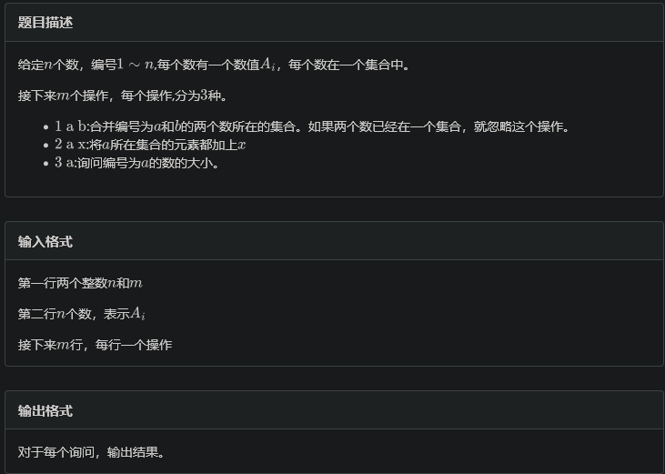

部分摘抄[学习笔记 | 启发式合并](https://flowus.cn/fbf16693-cdf8-429c-be57-1d798e1a5003)

---

# 启发式合并

启发式合并，一句话就是在合并集合的时候不按照指令方向合并，而是选择把小的集合合并入大集合中，并对集合性质通过重新映射的方式修改。

## 例题 #1 集合操作



---

每次将小的集合暴力并入大的集合中。

时间复杂度分析：

```C++

编号
	题目
	状态
	分数
	总时间
	内存
	代码 / 答案文件
	提交者
	提交时间
	重新评测
#1303118
	
#2455. 集合操作
	Accepted
	100
	1458 ms
	20560 K
	C++ 14 / 1.6 K
	ntsc
	2024-10-18 9:05:39
	

// Problem: B. 集合操作
// Contest: LibreOJ - CSP2024专题复习2
// URL: http://www.nfls.com.cn:20035/contest/2079/problem/2
// Memory Limit: 256 MB
// Time Limit: 500 ms
// Challenger: Erica N
// ----
#include<bits/stdc++.h>

using namespace std;
#define rd read()
#define ull unsigned long long
#define int long long 
#define itn int
#define ps second 
#define pf first

int  read(){
	int x;
	cin>>x;
	return x;
}
#define zerol = 1
#ifdef zerol
#define cdbg(x...) do { cerr << #x << " -> "; err(x); } while (0)
void err() {
	cerr << endl;
}
template<template<typename...> class T, typename t, typename... A>
void err(T<t> a, A... x) {
	for (auto v: a) cerr << v << ' ';
	err(x...);
}
template<typename T, typename... A>
void err(T a, A... x) {
	cerr << a << ' ';
	err(x...);
}
#else
#define dbg(...)
#endif
const int N=3e5+5;
const ull P=137;
const int INF=1e9+7;
/*

策略


*/
struct Node{
	int v,id;
};
vector<Node> s[N];

int fa[N];
int tag[N];
int val[N];


signed main(){
	int n=rd,m=rd;
	for(int i=1;i<=n;i++){
		s[i].push_back({rd,i});
		val[i]=s[i].back().v;
	}	
	
	
	for(itn i=1;i<=n;i++)fa[i]=i;
	
	while(m--){
		int op=rd,a=rd;
		if(op==1){
			int b=rd;
			a=fa[a],b=fa[b];
			if(a==b)continue;
			if(s[a].size()>s[b].size())swap(a,b);
			while(s[a].size()){
				auto v=s[a].back();
				v.v+=tag[a]-tag[b];
				fa[v.id]=b;
				val[v.id]=v.v;
				s[b].push_back(v);
				s[a].pop_back();			
			}
		}if(op==2){
			int b=rd;
			tag[fa[a]]+=b;
		}if(op==3){
			cout<<val[a]+tag[fa[a]]<<endl;
		}
	}
}
```

## 例题 #2 [HNOI2009] 梦幻布丁

题目描述

$n$ 个布丁摆成一行，进行 $m$ 次操作。每次将某个颜色的布丁全部变成另一种颜色的，然后再询问当前一共有多少段颜色。

例如，颜色分别为 $1,2,2,1$ 的四个布丁一共有 $3$ 段颜色.

---

思路

对于修改颜色后的维护答案，我们扫描一遍被修改的颜色。我们发现一个性质：对于第i个布丁，如果$col_i≠col_{i+1}$，那么就会对答案产生1的贡献。那么我们暴力扫描一遍被修改的颜色，看看每一个这种颜色的布丁的两旁的布丁的颜色是否和他不同。如果不同则进一步考虑修改后是否不同。如果修改后相同，则答案-1。

我们对每一种颜色拉一条链表来维护该颜色的布丁。然后在合并时先扫描（见上），然后启发式合并。

映射说明：如果$col_i$的数量为10，$col_j$的数量为6，那么如果要把$col_i$变成$col_j$，按启发式合并，我们就会把$col_j$的合并入$col_i$，那么这样颜色就不对了。所以这时我们把映射关系调整为$col'_i→col_j,col'_j→col_i$即可。即每一条链表的头部不是$col$，而是$col'$

```C++
/*
CB Ntsc
*/

#include<bits/stdc++.h>
using namespace std;
// #define int long long
#define ull unsigned long long
#define pii pair<int, int>
#define pf first
#define ps second

#define rd read()
// #define nl putc('\n')
#define ot write
#define nl putchar('\n')
inline int rd
{
	int xx=0,ff=1;
	char ch=getchar();
	while(ch<'0'||ch>'9') {if(ch=='-') ff=-1;ch=getchar();}
	while(ch>='0'&&ch<='9') xx=xx*10+(ch-'0'),ch=getchar();
	return xx*ff;
}
inline void write(int out)
{
	if(out<0) putchar('-'),out=-out;
	if(out>9) write(out/10);
	putchar(out%10+'0');
}

bool f1;
const int INF = 1e9;
const int N = 2e6+50;
const int M = 10;

int n,ans,m,idx;
int p[N];//映射
int to[N],h[N],sz[N],nxt[N],col[N];
void add(int a,int b){
    to[++idx]=b,nxt[idx]=h[a],h[a]=idx;
    sz[a]++;
}

void merge(int &x,int &y){
    if(x==y)return ;
    if(sz[x]>sz[y]){
        swap(x,y);
    }
    for(int i=h[x];i;i=nxt[i]){
        int v=to[i];
        ans-=(col[v-1]==y)+(col[v+1]==y);
    }
    for(int i=h[x];i;i=nxt[i]){
        int v=to[i];
        col[v]=y;
        if(!nxt[i]){
            nxt[i]=h[y],h[y]=h[x];break;
        }
    }
    h[x]=0;
    sz[y]+=sz[x];sz[x]=0;
}
signed main(){
    n=rd,m=rd;
    for(int i=1;i<=n;i++){
        col[i]=rd;
        
        if(col[i]!=col[i-1])ans++;
        add(col[i],i);
    }

    for(int i=0;i<N;i++)p[i]=i;

    while(m--){
        int op=rd;
        if(op==2){
            cout<<ans<<endl;
        }else{
            int x=rd,y=rd;
            merge(p[x],p[y]);
        }
    }
    return 0;
}
/*
2 5
0 1 1 1 1
0 1 1 2 4
0 2 1 2 1
0 2 1 1 4
*/
```

## dsu on tree 树上启发式合并

假设现在有一个问题，我们要询问每个子树中出现次数最多的点权，那么我们怎么样快速得到每一个节点的子树信息呢？

如果暴力做，那么时间复杂度明显是$O(n^2)$。但是我们发现我们要求出x的子树信息，那么我们其实把x的子树的子树的信息都求出来了。如果我们可以利用这一部分的信息，那么就可以节省我们的统计时间。

但是我们也不可能全部保留，因为我们的递归dfs**不是按子树来的**。我们的访问顺序是链，是一串dfs序，但是我们要的数据是子树，虽然也是dfs序的一个区间，但是我们再求出小子树时，再迁移时需要抛弃之前的数据。这样我们再求大子树时，只有最后一个小子树的信息没有被抛弃了。

最后一个子树的信息没有被抛弃？那么我们就可以让那个子树的size最大，这样我们就可以尽可能多地利用之前的信息了！

于是我们想到了重链剖分。我们每次让最后一个被搜索的子树是其重儿子，于是就有如下的代码框架：

- 向轻儿子递归，求出它们的答案，但是求一个清一个（即不保留数据）

- 向重儿子递归求解，但是保留数据。

- 统计轻儿子的数据。

- 求解当前节点的答案。

### 适用范围

适合一下问题：

对每颗子树的计数问题（例题 #1）

对每个节点的下K层的后代的信息统计（练习 #1）

### 例题 #1 Lomsat gelral

题面翻译

- 有一棵  $n$ 个结点的以  $1$ 号结点为根的**有根树**。

- 每个结点都有一个颜色，颜色是以编号表示的， $i$ 号结点的颜色编号为  $c_i$。

- 如果一种颜色在以  $x$ 为根的子树内出现次数最多，称其在以  $x$ 为根的子树中占**主导地位**。显然，同一子树中可能有多种颜色占主导地位。

- 你的任务是对于每一个  $i\in[1,n]$，求出以  $i$ 为根的子树中，占主导地位的颜色的编号和。

- $n\le 10^5,c_i\le n$

---

思路

暴力算法是对于每个节点都扫描一下其子树统计答案。$O(n^2)$

那么我们子树的信息是否可以被其父亲节点加以利用呢？答案是可以的。加上节点u的儿子有$v_1,v_2,v_3$，其中$v_1$是其重儿子（即子树大小最大），那么我们先解决$v_2,v_3$的问题（解决$v_2$，清空cnt，解决$v_3$，清空cnt），最后解决$v_1$，此时不清空cnt，即我们保留$v_1$的信息。这时我们再解决u的问题时就只需要遍历$u,v_2,v_3$即可了，$v_1$的信息我们可以继承过来。

这样的话复杂度可以降至$O(n \log n)$

计算复杂度的方法同树链剖分，即考虑每个点的贡献。这里简单说一下。一个点u会被重复遍历，当且仅当这个点位于轻子树中。那么这个点会在多少个轻子树中就意味着这个点会被重复遍历多少次。点u会在多少个轻子树中等价于u到根的路径中会有多少条轻边。可以证明轻边数量$<\log n$

```C++
/*
Edit by Ntsc.
*/

#include<bits/stdc++.h>
using namespace std;
#define int long long
#define ull unsigned long long
#define pii pair<int, int>
#define pf first
#define rep(i, a, b) for(int i = a; i <= b; ++i)
#define per(i, a, b) for(int i = a; i >= b; --i)

#define rd read()
#define ot write
#define nl putchar('\n')
inline int rd{
	int xx=0,ff=1;
	char ch=getchar();
	while(ch<'0'||ch>'9') {if(ch=='-') ff=-1;ch=getchar();}
	while(ch>='0'&&ch<='9') xx=xx*10+(ch-'0'),ch=getchar();
	return xx*ff;
}
inline void write(int out){
	if(out<0) putchar('-'),out=-out;
	if(out>9) write(out/10);
	putchar(out%10+'0');
}
const int N=1e5+3;
int sum,mx,n,m;
int sz[N],col[N],son[N],cnt[N],ans[N];
vector<int> e[N];

void add(int a,int b){
    e[a].push_back(b);
    e[b].push_back(a);
}

int dfs(int x,int fa){
    sz[x]=1;
    for(auto v:e[x]){
        if(v==fa)continue;
        sz[x]+=dfs(v,x);
        if(sz[v]>sz[son[x]])son[x]=v;
    }
    return sz[x];

}
void update(int x,int fa,int sg,int ps){// sg:加权值(+-1)  ps:应该跳过的点
    int c=col[x];
    cnt[c]+=sg;
    if(cnt[c]>mx)mx=cnt[c],sum=c;
    else if(cnt[c]==mx)sum+=c;

    for(auto v:e[x]){
        if(v==fa||v==ps)continue;
        update(v,x,sg,ps);
    }
    
}

void dfs(int x,int fa,int tp){//tp: 是否是重子树
    for(auto v:e[x]){
        if(v==fa||v==son[x])continue;
        dfs(v,x,0);
    }
    if(son[x])dfs(son[x],x,1);
    update(x,fa,1,son[x]);

    ans[x]=sum;

    if(!tp){
        //x是轻儿子
        update(x,fa,-1,0);
        sum=mx=0;
    }
}

signed main(){
	n=rd;
    for(int i=1;i<=n;i++)col[i]=rd;

    for(int i=1;i<n;i++){
        int a=rd,b=rd;
        add(a,b);
    }
    dfs(1,0);
    dfs(1,0,1);

    for(int i=1;i<=n;i++)cout<<ans[i]<<' ';
	return 0;
}
```

### 例题 #2 Dominant Indices

给定一棵以 $1$ 为根，$n$ 个节点的树。设 $d(u,x)$ 为 $u$ 子树中到 $u$ 距离为 $x$ 的节点数。

对于每个点，求一个最小的 $k$，使得 $d(u,k)$ 最大。

$1 \le n \le 10^6$  

---

我们发现如果我们用桶来记录子树中的点到根节点距离为i的点的数量，那么每次我们转移根节点时，就需要将桶中的元素+-1。因此，我们考虑直接记录子树中深度为i的点有多少个，这样就很方便转移了。

注意在清空时，因为本身就是轻子树，所以自己的重儿子也要清！（line:161）

```C++
/*
                      Keyblinds Guide
     				###################
      @Ntsc 2024

      - Ctrl+Alt+getId then P : Enter luogu problem details
      - Ctrl+Alt+B : Run all cases in CPH
      - ctrl+D : choose this and dump to the next
      - ctrl+Shift+L : choose all like this
      - ctrl+K then ctrl+W: close all
      - Alt+la/ra : move mouse to pre/nxt pos'

*/
#include <bits/stdc++.h>
#include <queue>
using namespace std;

#define rep(i, l, r) for (int i = l, END##i = r; i <= END##i; ++i)
#define per(i, r, l) for (int i = r, END##i = l; i >= END##i; --i)
#define pb push_back
#define int long long
#define ull unsigned long long
#define pii pair<int, int>
#define ps second
#define pf first
#define mp make_pair

// #define innt int
#define itn int
// #define inr intw
// #define mian main
// #define iont int

#define rd read()
int read() {
	int xx = 0, ff = 1;
	char ch = getchar();
	while (ch < '0' || ch > '9') {
		if (ch == '-')
			ff = -1;
		ch = getchar();
	}
	while (ch >= '0' && ch <= '9')
		xx = xx * 10 + (ch - '0'), ch = getchar();
	return xx * ff;
}
void write(int out) {
	if (out < 0)
		putchar('-'), out = -out;
	if (out > 9)
		write(out / 10);
	putchar(out % 10 + '0');
}

#define ell dbg('\n')
const char el='\n';
const bool enable_dbg = 1;
template <typename T,typename... Args>
void dbg(T s,Args... args) {
	if constexpr (enable_dbg) {
		cerr << s;
		if(1)cerr<<' ';
		if constexpr (sizeof...(Args))
			dbg(args...);
	}
}

#define zerol = 1
#ifdef zerol
#define cdbg(x...) do { cerr << #x << " -> "; err(x); } while (0)
void err() {
	cerr << endl;
}
template<template<typename...> class T, typename t, typename... A>
void err(T<t> a, A... x) {
	for (auto v: a) cerr << v << ' ';
	err(x...);
}
template<typename T, typename... A>
void err(T a, A... x) {
	cerr << a << ' ';
	err(x...);
}
#else
#define dbg(...)
#endif


const int N = 2e6 + 10;
const int INF = 2e17;
const int M = 1e3 + 10;


/*

*/


vector<int> e[N];
void add(int a,int b){
    e[a].pb(b);
    e[b].pb(a);
}


int dep[N];
int son[N];
int sz[N];
int res;
itn ans[N];
itn cnt[N];


void dfs(int x,int fa){
    dep[x]=dep[fa]+1;
    sz[x]=1;
    for(auto v:e[x]){
        if(v==fa)continue;
        dfs(v,x);
        sz[x]+=sz[v];
        if(!son[x]||sz[son[x]]<sz[v])son[x]=v;
    }
    
}


void update(int x,int fa,int op,int ban){
    cnt[dep[x]]+=op;
    if(cnt[dep[x]]>cnt[res])res=dep[x];
    else if(cnt[dep[x]]==cnt[res]&&dep[x]<res)res=dep[x];
    for(auto v:e[x]){
        if(v==fa||v==ban)continue;
        update(v,x,op,ban);
    }
}

void dfs2(int x,int fa,int tp){//tp:是否是重儿子（是否保留数据）

    for(auto v:e[x]){
        if(v==fa||v==son[x])continue;
        dfs2(v,x,0);
    }

    if(son[x]){
        dfs2(son[x],x,1);
    }

    update(x,fa,1,son[x]);
    // for(auto v:e[x]){
    //     if(v==fa||v==son[x])continue;
    // }
    

    ans[x]=max(0ll,res-dep[x]);

    if(!tp){
        update(x,fa,-1,0);
        // for(auto v:e[x]){
        //     if(v==fa||v==son[x])continue;
        // }
        res=0;
    }


}
void solve(){
    int n=rd;
    for(int i=1;i<n;i++){
        add(rd,rd);
    }

    dfs(1,0);
    dfs2(1,0,0);
    


    for(int i=1;i<=n;i++){
        cout<<ans[i]<<endl;
    }
}


signed main() {
    // freopen("kujou.in","r",stdin);
    // freopen("kujou.out","w",stdout);
    
    int T=1;
    while(T--){
    	solve();
    }

    return 0;
}
```

### 练习 #1 Tree Requests

简化版:

给定一个以 $1$ 为根的 $n$ 个结点的树，每个点上有一个字母（`a`-`z`），每个点的深度定义为该节点到 $1$ 号结点路径上的点数。每次询问 $a, b$ 查询以 $a$ 为根的子树内深度为 $b$ 的结点上的字母重新排列之后是否能构成回文串。

---

考虑回文串

- 每个字符出现偶数次，那么我们就可以使用异或和=0来判断

- 只有一个字符出现奇数次，
那么最后的答案一定是这个字符的异或值。

那么如何判断一个值是否是一个字符的异或值？

我们直接把字母A的异或值赋值为`1<<A-'a'`即可。

```C++
/*
                      Keyblinds Guide
     				###################
      @Ntsc 2024

      - Ctrl+Alt+getId then P : Enter luogu problem details
      - Ctrl+Alt+B : Run all cases in CPH
      - ctrl+D : choose this and dump to the next
      - ctrl+Shift+L : choose all like this
      - ctrl+K then ctrl+W: close all
      - Alt+la/ra : move mouse to pre/nxt pos'

*/
#include <bits/stdc++.h>
#include <queue>
using namespace std;

#define rep(i, l, r) for (int i = l, END##i = r; i <= END##i; ++i)
#define per(i, r, l) for (int i = r, END##i = l; i >= END##i; --i)
#define pb push_back
#define int long long
#define ull unsigned long long
#define pii pair<int, int>
#define ps second
#define pf first
#define mp make_pair

// #define innt int
#define itn int
// #define inr intw
// #define mian main
// #define iont int

#define rd read()
int read() {
	int xx = 0, ff = 1;
	char ch = getchar();
	while (ch < '0' || ch > '9') {
		if (ch == '-')
			ff = -1;
		ch = getchar();
	}
	while (ch >= '0' && ch <= '9')
		xx = xx * 10 + (ch - '0'), ch = getchar();
	return xx * ff;
}
void write(int out) {
	if (out < 0)
		putchar('-'), out = -out;
	if (out > 9)
		write(out / 10);
	putchar(out % 10 + '0');
}

#define ell dbg('\n')
const char el='\n';
const bool enable_dbg = 1;
template <typename T,typename... Args>
void dbg(T s,Args... args) {
	if constexpr (enable_dbg) {
		cerr << s;
		if(1)cerr<<' ';
		if constexpr (sizeof...(Args))
			dbg(args...);
	}
}

#define zerol = 1
#ifdef zerol
#define cdbg(x...) do { cerr << #x << " -> "; err(x); } while (0)
void err() {
	cerr << endl;
}
template<template<typename...> class T, typename t, typename... A>
void err(T<t> a, A... x) {
	for (auto v: a) cerr << v << ' ';
	err(x...);
}
template<typename T, typename... A>
void err(T a, A... x) {
	cerr << a << ' ';
	err(x...);
}
#else
#define dbg(...)
#endif


const int N = 2e6 + 10;
const int INF = 2e17;
const int M = 1e3 + 10;


/*

*/

struct Query{
    int dep,id;
};

vector<Query> q[N];//存储每个节点的询问
vector<int> e[N];

int cnt[N];
int sz[N];
int dep[N];
int son[N];
int ans[N];
string s;

void add(int a,int b){
    e[a].pb(b);
    e[b].pb(a);
}

void dfs(int x,int fa){
    dep[x]=dep[fa]+1;
    sz[x]=1;
    for(auto v:e[x]){
        if(v==fa)continue;
        dfs(v,x);
        sz[x]+=sz[v];
        if(!son[x]||sz[son[x]]<sz[v])son[x]=v;
    }
    
}

void update(int x,int fa,int op,int ban){
    cnt[dep[x]]^=(1ll<<(s[x]-'a'));
    for(auto v:e[x]){
        if(v==fa||v==ban)continue;
        update(v,x,op,ban);
    }
}

inline int popcnt(int x){
    int res=0;
    while(x){
        res+=x&1;
        x>>=1;
    }
    return res;
}

void dfs(int x,int fa,int tp){
    for(auto v:e[x]){
        if(v==fa||v==son[x])continue;
        dfs(v,x,0);
    }

    if(son[x])dfs(son[x],x,1);
    update(x,fa,1,son[x]);

    //  统计答案

    /*
    考虑回文串，每个字符出现偶数次，那么我们就可以使用异或和=0来判断
    问题在于还有一种情况是只有一个字符出现奇数次
    那么最后的答案一定是这个字符的异或值。
    那么如何判断一个值是否是一个字符的异或值？
    我们直接把字母A的异或值赋值为1<<A-'a'即可。
    */
    for(auto Q:q[x]){
        if(popcnt(cnt[Q.dep])<=1)ans[Q.id]=1;
    }

    if(!tp){
        update(x,fa,-1,0);
    }

}

void solve(){
    int n=rd;
    int m=rd;
    for(int i=2;i<=n;i++){
        add(i,rd);
    }


    cin>>s;
    s=" "+s;
    for(int i=1;i<=m;i++){
        int a=rd,b=rd;
        q[a].pb({b,i});
    }

    dfs(1,0);
    dfs(1,0,1);


    for(int i=1;i<=m;i++){
        if(ans[i])puts("Yes");
        else puts("No");
    }
}

signed main() {
    // freopen("kujou.in","r",stdin);
    // freopen("kujou.out","w",stdout);
    
    int T=1;
    while(T--){
    	solve();
    }

    return 0;
}
```

### 其他练习

[www.luogu.com.cn](https://www.luogu.com.cn/training/428147#information)


lct


