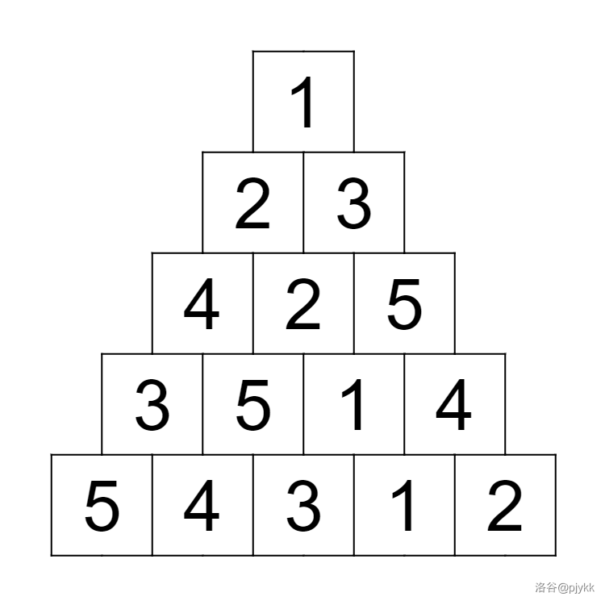
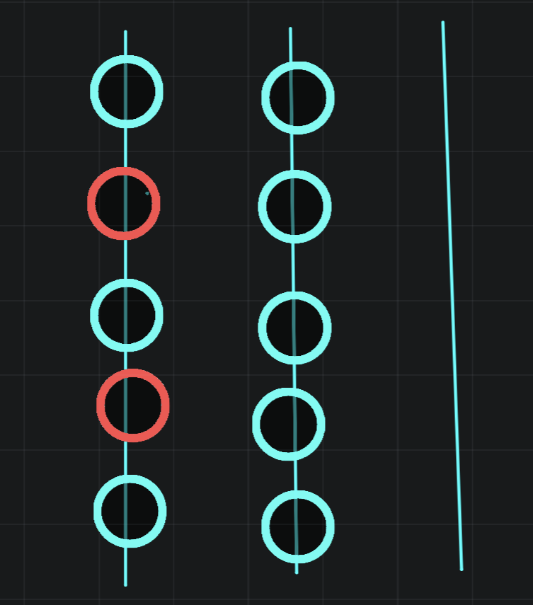
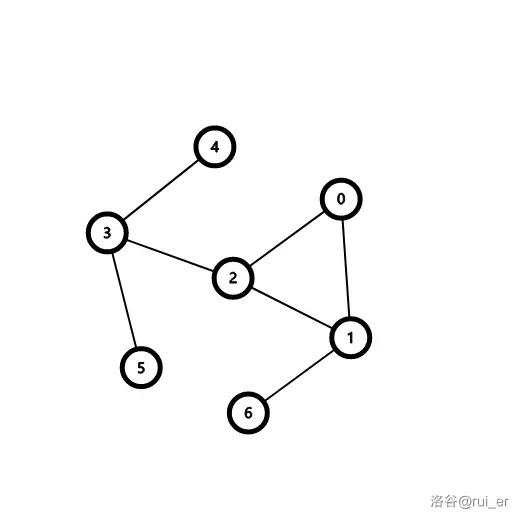
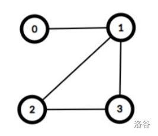

摘抄 [学习笔记 | 构造](https://flowus.cn/b4bd4f8e-4454-4b45-aacc-79b5956a184b)

---

# [ARC091E] LISDL

## 题面翻译

给定三个整数 $N$，$A$，$B$。

请你构造出一个长度为 $N$ 的**排列**，满足它的最长上升子序列长度为 $A$，最长下降子序列长度为 $B$。

如果不存在这样的**排列**，请输出 `-1`。

## 思路


---

std

由于题目同时限定了最长上升子序列与最长下降子序列的长度，先选择一个角度入手。

我选择从最长上升子序列入手。

如何使最长上升子序列的长度固定？

显然，当一大堆长度均为 l 的上升序列按照第一个元素**从大到小**排列，则组合起来的序列的最长上升子序列的长度为 l。

例如：l=3，则一个可能的序列为：

10,11,12,7,8,9,4,5,6,1,2,3

最长上升子序列长度为 3。

当然，一部分子序列长度小于 l 也能达到同样的效果：

10,11,12,7,8,9,5,6,3,4,1,2

那最长下降子序列怎么办呢？

我们构造的时候是按照第一个元素**从大到小**排列，只要我们构造 B 组长度不大于 A 的上升子序列，按照第一个元素从大到小排列，那么最长上升子序列的长度就为 A，最长下降子序列的长度就为 B。

同时推出无解情况：

- A+B−1>N，显然，在这种情况下，N 个根本不够用。

- A×B<N，就像上面所述，我们要构造 B 组长度不大于 A 的上升子序列，在这种情况下，要么增加最长上升子序列的长度，要么增加最长下降子序列的长度。

```C++
int n, a, b, j;
signed main() {
  n = rd;
  a = rd, b = rd;
  if (a + b - 1 > n || 1ll * a * b < n)
    return puts("-1"), 0;
  while (n) {
    j = min(a, n - b + 1);
    n -= j, b--;
    for (int i = n + 1; i <= n + j; i++)
      printf("%d ", i);
  }
}

```

## 输入格式

入力は以下の形式で標準入力から与えられる。

> $N$ $A$ $B$

## 输出格式

条件を満たす列が存在しない場合、`-1` を出力せよ。

そうでない場合、整数を $N$ 個出力せよ。 $i$ 個目には、構成した列の $i$ 番目の要素を出力せよ。

## 样例 #1

### 样例输入 #1

```C++
5 3 2
```

### 样例输出 #1

```C++
2 4 1 5 3
```

## 样例 #2

### 样例输入 #2

```C++
7 7 1
```

### 样例输出 #2

```C++
1 2 3 4 5 6 7
```

## 样例 #3

### 样例输入 #3

```C++
300000 300000 300000
```

### 样例输出 #3

```C++
-1
```

## 提示

### 注釈

列 $P$ の部分列とは $P$ の要素をいくつか抜き出して元の順に並べてできる列のことを指し、 また、列 $P$ の最長増加部分列とは、$P$ の単調増加な部分列の中で列の長さが最大のものを指します。

同様に、列 $P$ の最長減少部分列とは、$P$ の単調減少な部分列の中で列の長さが最大のものを指します。

### 制約

- $1\ \leq\ N,A,B\ \leq\ 3\times\ 10^5$

- 入力はすべて整数である

### Sample Explanation 1

${2,4,5}$ が最長増加部分列の一例、${4,3}$ が最長減少部分列の一例です。

# 约瑟夫问题 | faebdc玩扑克

## 题目背景

faebdc 和 zky 在玩一个小游戏

## 题目描述

zky 有 $n$ 个扑克牌，编号从 $1$ 到 $n$，zky 把它排成一个序列，每次把最上方的扑克牌放在牌堆底，然后把下一张扑克牌拿出来输出，最终输出的序列恰好是从 $1$ 到 $n$，faebdc 问你原序列是什么，因为 faebdc 神犇早已在 $\mathcal O (1)$ 的时间得出结果，如果你在 1 s 内答不出来，faebdc 会吃了你。

## 输入格式

一个整数 n，表示扑克数目。

## 输出格式

$n$ 个数，表示扑克序列。

## 样例 #1

### 样例输入 #1

```C++
13
```

### 样例输出 #1

```C++
7 1 12 2 8 3 11 4 9 5 13 6 10
```

## 提示

对于 $100\%$ 的数据，$1 \le n \le {10}^6$。

# Zig-Zag | 汪了个汪

## 题目描述

小 P 喜欢上了一款叫做《汪了个汪》的游戏。这个游戏有一个牌堆和一个金字塔形的棋盘，总共有 $3$ 关。具体地，如图所示，棋盘的边长为 $n$，第 $i$ 行有 $i$ 个格子，共 $\dfrac{n(n+1)}{2}$ 个格子。

牌堆中有 $1, 2 \dots n$ 的数字卡片 **各无穷多张**。你需要将这些数字卡片放到对应的棋盘格子中，每个格子恰好放一张数字卡片，要求满足棋盘的每一行的第一个元素 **互不相同**。

小 P 发现，这个游戏的难度会随着关卡编号而增加：

- 在第 $0$ 关中，你不必满足其他条件。

- 在第 $1$ 关中，你需要保证一行内相邻的两个数互不相同，且所有由任意一行内相邻两个数组成的 **无序二元组** 互不相同。

- 在第 $2$ 关中，你需要满足第 $1$ 关的限制，并且一行内的 **所有数** 必须互不相同。

例如，下面是 $n=5$ 时可以通过第 $2$ 关的摆放方式：



现在给定 $n$ 与关卡编号，请你帮小 P 找出一种合适的摆放方式来通过这一关。可以证明在游戏限制下一定存在一种过关方式。

## 思路

Zig-Zag pattern

---

```C++
/*
CB Ntsc
*/

#include<bits/stdc++.h>
using namespace std;
#define int long long


#define rd read()
inline int read()
{
	int xx=0,ff=1;
	char ch=getchar();
	while(ch<'0'||ch>'9') {if(ch=='-') ff=-1;ch=getchar();}
	while(ch>='0'&&ch<='9') xx=xx*10+(ch-'0'),ch=getchar();
	return xx*ff;
}
inline void write(int out)
{
	if(out<0) putchar('-'),out=-out;
	if(out>9) write(out/10);
	putchar(out%10+'0');
}


const int N=5e5+5;
const int INF=1e9+5;
const int MOD=1e9+7;
bool f1;
int m,k,n,qzh;

int q;
int t,ans,s,cnt,p;
int l,r;


bool f2;


signed main(){
	n=rd,t=rd;

	for(int i=1;i<=n;i++){
		if(i&1)s=(2*n-i+1)>>1;
		else s=i>>1;
		int len=0;
		for(int j=1;j<=i;j++){
			len++;
			cout<<s<<' ';
			if(j&1)s+=len;
			else s-=len;
		}
		cout<<endl;
	}
	return 0;
}

/*
2
3 2 3 6
*/
```

## 输入格式

从标准输入中读入数据。

仅一行，包含两个整数 $n, t$，其中 $t$ 表示关卡编号。

## 输出格式

输出到标准输出。

输出 $n$ 行，第 $i$ 行包含 $i$ 个正整数（以空格分隔），表示棋盘第 $i$ 行从左到右所有的数。

如果有多种合法的解，你可以输出任何一种。

## 样例 #1

### 样例输入 #1

```C++
2 1
```

### 样例输出 #1

```C++
1
2 1
```

## 样例 #2

### 样例输入 #2

```C++
5 2
```

### 样例输出 #2

```C++
1
2 3
4 2 5
3 5 1 4
5 4 3 1 2
```

## 提示

**【说明与提示】**

本题下发校验器（`checker.cpp`）。将 `checker.cpp` 编译成可执行文件 `checker` 后，在当前目录执行 `checker woof.in woof.out woof.ans` 即可校验你的答案是否符合规范。其中 `woof.in` 可以替换为对应输入文件名称，`woof.out` 可以替换为对应输出文件名称，也即构造结果。`woof.ans` 可以为任意文件。

返回结果说明：

- `The numbers are not in the valid range.`：说明你的输出不满足每个数字都在 $1\sim n$ 的范围内。

- `The first column does not satisfice.`：说明你的输出不满足每行开头的数互不相同。

- `The pairs of numbers are not distinct.`：说明你的输出不满足所有由任意一行内相邻两个数组成的无序二元组互不相同。

- `The adjacent numbers are not distinct.`：说明当前关卡编号 $\ge1$ 且你的输出不满足关卡 $1$ 的条件。

- `The numbers in a row are not distinct.`：说明当前关卡编号 $\ge2$ 且你的输出不满足关卡 $2$ 的条件。

- `Well done.`：说明你的构造满足要求。

---

#### 【数据范围】

|测试点编号|$n \leq$|$t =$|特殊性质|
|-|-|-|-|
|$1$|$6$|$0$|无|
|$2$|$6$|$2$|无|
|$3 \sim 4$|$4000$|$2$|A|
|$5 \sim 7$|$500$|$1$|无|
|$8 \sim 13$|$500$|$2$|无|
|$14 \sim 16$|$4000$|$1$|无|
|$17 \sim 20$|$4000$|$2$|无|

- 特殊性质 A：保证 $n + 1$ 或 $n + 2$ 为质数。

对于 $100 \%$ 的数据，保证 $1 \leq n \leq 4000$，$t \in \{0, 1, 2\}$。

# 贪心构造 | [ZJOI2007] 时态同步

## 题目描述

小 Q 在电子工艺实习课上学习焊接电路板。一块电路板由若干个元件组成，我们不妨称之为节点，并将其用数字 $1,2,3\cdots$ 进行标号。电路板的各个节点由若干不相交的导线相连接，且对于电路板的任何两个节点，都存在且仅存在一条通路（通路指连接两个元件的导线序列）。

在电路板上存在一个特殊的元件称为“激发器”。当激发器工作后，产生一个激励电流，通过导线传向每一个它所连接的节点。而中间节点接收到激励电流后，得到信息，并将该激励电流传向与它连接并且尚未接收到激励电流的节点。最终，激烈电流将到达一些“终止节点”――接收激励电流之后不再转发的节点。

激励电流在导线上的传播是需要花费时间的，对于每条边 $e$，激励电流通过它需要的时间为 $t_e$，而节点接收到激励电流后的转发可以认为是在瞬间完成的。现在这块电路板要求每一个“终止节点”同时得到激励电路――即保持时态同步。由于当前的构造并不符合时态同步的要求，故需要通过改变连接线的构造。目前小 Q 有一个道具，使用一次该道具，可以使得激励电流通过某条连接导线的时间增加一个单位。请问小 Q 最少使用多少次道具才可使得所有的“终止节点”时态同步？

## 思路

其实是贪心——对于每颗子树考虑，在dfs是维护每颗子树v中叶子节点到v的距离的最大值$mx_v$。对于u的子树，我们要让son(u)中的所有点到u的距离都相同，那么我们就修改u-son(u)边上的权值使得$mx_{son(u)}+v_{u-son(u)}$都等于原$mx_{son(u)}+v_{u-son(u)}$中的最大值。

可参考：[https://www.acwing.com/video/3341/](https://www.acwing.com/video/3341/) 6:30处

---

```C++
/*
Code by Ntsc_Hodaka
*/

#include <bits/stdc++.h>
using namespace std;
#define int long long
#define mp make_pair
#define pii pair<int,int>


///----///
#define rd read()
inline int read() {
    int xx = 0, ff = 1;
    char ch = getchar();
    while (ch < '0' || ch > '9') {
        if (ch == '-')
            ff = -1;
        ch = getchar();
    }
    while (ch >= '0' && ch <= '9') xx = xx * 10 + (ch - '0'), ch = getchar();
    return xx * ff;
}
inline void write(int out) {
    if (out < 0)
        putchar('-'), out = -out;
    if (out > 9)
        write(out / 10);
    putchar(out % 10 + '0');
}

///----///
const int N = 1e6 + 5;
const int M = 1e7 + 5;
const int INF = 1e9 + 5;
const double eps=1e-7;

int n,m,s,ans;

struct node{
    int v,w;
};
vector<node> e[N];
void add(int a,int b,int c){
    e[a].push_back({b,c});
    e[b].push_back({a,c});
}

int dfs(int x,int fa){
    int sum=0,mx=0,cnt=0;
    for(auto v:e[x]){
        if(v.v==fa)continue;
        int t=dfs(v.v,x)+v.w;
        sum+=t;
        cnt++;
        mx=max(mx,t);
    }

    ans+=cnt*mx-sum;
    return mx;
}

signed main(){
    n=rd;
    s=rd;
    for(int i=1;i<n;i++){
        int a=rd,b=rd,c=rd;
        add(a,b,c);
    }
    dfs(s,0);
    cout<<ans<<endl;
}
/*

*/
```

## 输入格式

第一行包含一个正整数 $N$，表示电路板中节点的个数。

第二行包含一个整数 $S$，为该电路板的激发器的编号。

接下来 $N-1$ 行，每行三个整数 $a,b,t$。表示该条导线连接节点 $a$ 与节点 $b$，且激励电流通过这条导线需要 $t$ 个单位时间。

## 输出格式

仅包含一个整数 $V$，为小 Q 最少使用的道具次数。

## 样例 #1

### 样例输入 #1

```C++
3
1
1 2 1
1 3 3
```

### 样例输出 #1

```C++
2
```

## 提示

- 对于 $40\%$ 的数据，$1\le N\le 1000$。

- 对于 $100\%$ 的数据，$1\le N\le 5\times 10^5$。

对于所有的数据，$1\le t_e\le 10^6$。

# 问题拆分 | [NOIP2020] 移球游戏

## 题目描述

小 C 正在玩一个移球游戏，他面前有 $n + 1$ 根柱子，柱子从 $1 \sim n + 1$ 编号，其中 $1$ 号柱子、$2$ 号柱子、……、$n$ 号柱子上各有 $m$ 个球，它们自底向上放置在柱子上，$n + 1$ 号柱子上初始时没有球。这 $n \times m$ 个球共有 $n$ 种颜色，每种颜色的球各 $m$ 个。

初始时一根柱子上的球可能是五颜六色的，而小 C 的任务是将所有同种颜色的球移到同一根柱子上，这是唯一的目标，而每种颜色的球最后放置在哪根柱子则没有限制。

小 C 可以通过若干次操作完成这个目标，一次操作能将一个球从一根柱子移到另一根柱子上。更具体地，将 $x$ 号柱子上的球移动到 $y$ 号柱子上的要求为：

1. $x$ 号柱子上至少有一个球；

2. $y$ 号柱子上至多有 $m - 1$ 个球；

3. 只能将 $x$ 号柱子最上方的球移到 $y$ 号柱子的最上方。

小 C 的目标并不难完成，因此他决定给自己加加难度：在完成目标的基础上，使用的操作次数不能超过 $820000$。换句话说，小 C 需要使用至多 $820000$ 次操作完成目标。

小 C 被难住了，但他相信难不倒你，请你给出一个操作方案完成小 C 的目标。合法的方案可能有多种，你只需要给出任意一种，题目保证一定存在一个合法方案。

## 思路

有n+1根柱子，前n根柱子上有m个各种颜色的球（共n种颜色）。时刻保证每根柱子上有≤m个球，求使得前n个柱子每个柱子上只有一种颜色的球的方案，不超过820000步。

先缩小问题规模：问如何操作可用把一种颜色全部移到空柱子上并且额外空出一根柱子。那么现在就只有两个颜色1和0了，1是我们要的那个颜色。现在考虑怎么操作。

如果我们可用找到一个全0的柱子，那么我们就可以把一个含1的柱子中的所有1放到最上面



假设含1柱子中有i个1，那么我们可以把全0柱子上的m-i个0拿到空柱子上，然后此时2号柱子上有m-i个空位，3号上有i个空位。我们在情况1号时把0放在2号，把1放在3号即可。


那么唯一的问题就是如何构造出全0柱子。考虑如下过程：设1柱有i个1，我们随机挑选另一个柱子2，从2柱中取出前i个放在e柱（即空柱子）上。然后把1柱取空，1放在2柱上，0放在e柱上。这样e柱前m-i个就都是0了，1柱为空。把那m-i个0放回1柱。

再随机挑选一个3柱，此时1柱有i个空位，e柱有m-i个空位，取空3柱时拿i个0填充1柱，其余放入e柱。

此时1柱全0，3柱变成新的e柱。大功告成。

---

```C++
/*
Code by Ntsc_Hodaka
*/

#include <bits/stdc++.h>
using namespace std;
#define int long long
#define mp make_pair
#define pii pair<int,int>


///----///
#define rd read()
inline int read() {
    int xx = 0, ff = 1;
    char ch = getchar();
    while (ch < '0' || ch > '9') {
        if (ch == '-')
            ff = -1;
        ch = getchar();
    }
    while (ch >= '0' && ch <= '9') xx = xx * 10 + (ch - '0'), ch = getchar();
    return xx * ff;
}
inline void write(int out) {
    if (out < 0)
        putchar('-'), out = -out;
    if (out > 9)
        write(out / 10);
    putchar(out % 10 + '0');
}

///----///
const int N = 1e6 + 5;
const int M = 1e3 + 5;
const int INF = 1e9 + 5;
const double eps=1e-7;

int n,m,s,ans;
int ansl[N],ansr[N];
int c[M][M];
int cnt[M],p[M];

void move(int a,int b){
    ans++;
    ansl[ans]=a,ansr[ans]=b;
    c[b][++cnt[b]]=c[a][cnt[a]--];
}
int count(int a,int col){
    int res=0;
    for(int i=1;i<=m;i++)if(c[a][i]==col)res++;
    return res;
}
int top(int a){
    return c[a][cnt[a]];
}

void solve(int cur){ //逐颜色解决

    //构造出全0的柱子
    int t=count(p[1],cur);
    for(int i=1;i<=t;i++)move(p[cur],p[cur+1]);
    for(int i=1;i<=m;i++){
        if(top(p[1])==cur)move(p[1],p[cur]);
        else move(p[1],p[cur+1]);
    }

    for(int i=1;i<=m-t;i++)move(p[cur+1],p[1]);
    for(int i=1;i<=m;i++){
        if(top(p[2])==cur||cnt[p[1]]==m)move(p[2],p[cur+1]);
        else move(p[2],p[1]);
    }
    //构造出全1的柱子
    swap(p[1],p[cur]);
    swap(p[cur+1],p[2]);
    for(int i=1;i<cur;i++){
        int t=count(p[i],cur);
        for(int j=1;j<=t;j++)move(p[cur],p[cur+1]);
        for(int j=1;j<=m;j++){
            if(top(p[i])==cur)move(p[i],p[cur]);
            else move(p[i],p[cur+1]);
        }
        swap(p[cur+1],p[i]);
        swap(p[i],p[cur]);
    }

    for(int i=1;i<cur;i++){
        while(top(p[i])==cur&&cnt[p[i]])move(p[i],p[cur+1]);
    }

    for(int i=1;i<cur;i++){
        while(cnt[p[i]]<m&&cnt[p[cur]])move(p[cur],p[i]);
    }
    
}
signed main(){
    // ios::sync_with_stdio(0);
    // cin.tie(0);cout.tie(0);
    n=rd,m=rd;
    for(int i=1;i<=n;i++){
        for(int j=1;j<=m;j++){
            c[i][++cnt[i]]=rd;
        }
    }
    for(int i=1;i<=n+1;i++)p[i]=i;

    for(int cur=n;cur>2;cur--){
        solve(cur);
    }
    
    int t=count(p[1],1);
    for(int i=1;i<=t;i++)move(p[2],p[3]);
    for(int i=1;i<=m;i++){
        if(top(p[1])==1)move(p[1],p[2]);
        else move(p[1],p[3]);
    }
    for(int i=1;i<=t;i++)move(p[2],p[1]);
    for(int i=1;i<=m-t;i++)move(p[3],p[1]);
    while(cnt[p[3]])move(p[3],p[2]);
    for(int i=1;i<=m-t;i++)move(p[1],p[3]);
    for(int i=1;i<=m;i++){
        if(top(p[2])==1)move(p[2],p[1]);
        else move(p[2],p[3]);
    }

    cout<<ans<<endl;
    for(int i=1;i<=ans;i++){
        cout<<ansl[i]<<' '<<ansr[i]<<endl;
    }
}
```

## 输入格式

第一行两个用空格分隔的整数 $n, m$。分别表示球的颜色数、每种颜色球的个数。
接下来 $n$ 行每行 $m$ 个用单个空格分隔的整数，第 $i$ 行的整数按自底向上的顺序依次给出了 $i$ 号柱子上的球的颜色。

## 输出格式

本题采用自定义校验器（special judge）评测。
你的输出的第一行应该仅包含单个整数 $k$，表示你的方案的操作次数。你应保证 $0 \le k \le 820000$。
接下来 $k$ 行每行你应输出两个用单个空格分隔的正整数 $x, y$，表示这次操作将 $x$ 号柱子最上方的球移动到 $y$ 号柱子最上方。你应保证 $1 \le x, y \le n + 1$ 且 $x \ne y$。

## 样例 #1

### 样例输入 #1

```C++
2 3
1 1 2
2 1 2
```

### 样例输出 #1

```C++
6
1 3
2 3
2 3
3 1
3 2
3 2
```

## 样例 #2

### 样例输入 #2

```C++
见附件中的 ball/ball2.in
```

### 样例输出 #2

```C++
见附件中的 ball/ball2.ans
```

## 样例 #3

### 样例输入 #3

```C++
见附件中的 ball/ball3.in
```

### 样例输出 #3

```C++
见附件中的 ball/ball3.ans
```

## 提示

**【样例 #1 解释】**

柱子中的内容为：按自底向上的顺序依次给出柱子上每个球的颜色。

|操作|$1$ 号柱子|$2$ 号柱子|$3$ 号柱子|
|-|-|-|-|
|初始|$1\ 1\ 2$|$2\ 1\ 2$||
|$1\ 3$|$1\ 1$|$2\ 1\ 2$|$2$|
|$2\ 3$|$1\ 1$|$2\ 1$|$2\ 2$|
|$2\ 3$|$1\ 1$|$2$|$2\ 2\ 1$|
|$3\ 1$|$1\ 1\ 1$|$2$|$2\ 2$|
|$3\ 2$|$1\ 1\ 1$|$2\ 2$|$2$|
|$3\ 2$|$1\ 1\ 1$|$2\ 2\ 2$||

**【数据范围】**

|测试点编号|$n \le$|$m \le$|
|-|-|-|
|$1 \sim 2$|$2$|$20$|
|$3 \sim 5$|$10$|$20$|
|$6 \sim 8$|$50$|$85$|
|$9 \sim 14$|$50$|$300$|
|$15 \sim 20$|$50$|$400$|

对于所有测试点，保证 $2 \le n \le 50$，$2 \le m \le 400$。

**【校验器】**

为了方便选手测试，在附件中的 `ball` 目录下我们下发了 `checker.cpp` 文件，选手可以编译该程序，并使用它校验自己的输出文件。但请注意它与最终评测时所使用的校验器并不完全一致。你也不需要关心其代码的具体内容。

编译命令为：`g++ checker.cpp −o checker -std=c++11`。

`checker` 的使用方式为：`checker <inputfile> <outputfile>`，参数依次表示输入文件与你的输出文件。

若你输出的数字大小范围不合法，则校验器会给出相应提示。若你的输出数字大小范围正确，但方案错误，则校验器会给出简要的错误信息：

1. `A x`，表示进行到第 $x$ 个操作时不合法。

2. `B x`，表示操作执行完毕后第 $x$ 个柱子上的球不合法。

若你的方案正确，校验器会给出 `OK`。

# 图结论构造 | [IOI2014] game 游戏

## 题目描述

健佳是一个喜欢做游戏的小男生。当有人问问题时，他更喜欢通过玩游戏的方式作答，而不是直接回答。健佳碰到了他的朋友梅玉，跟她讲了台湾的航空网。在台湾有 $n$ 个城市（编号为 $0,\cdots,n−1$），其中有些城市之间有航线。每个航线连接两个城市，并且是双向的。

梅玉问健佳，是否任意两个城市之间都可以坐飞机互达（直接或间接），健佳不想直接回答，而是要通过做游戏的方式来告诉她。梅玉可以问"城市 $u$ 和 $v$ 之间有直接航线吗？"，健佳会立刻直接回答该问题。梅玉会询问每对城市恰好一次，因此总计会有 $r = \frac{n (n−1)}{2}$ 个问题。如果由前 $i$（$i<r$）个问题的答案可以推断出整个航空网是否连通，也就是说，是否任意一对城市之间都可以坐飞机互达（直接或间接），梅玉就获胜。否则意味着她需要知道全部 $r$ 个回答，此时健佳获胜。

为了让游戏更好玩，他们俩同意，健佳可以不要管台湾的真实航空网，而是可以随着游戏的进展而编造航空网，也就是根据梅玉此前的提问来决定此后如何作答。你的任务是，通过决定健佳如何回答，来帮助他赢得游戏。

## 思路

即构造一个n个点的图，并且给出$r = \frac{n (n−1)}{2}$个询问，构造前$ \frac{n (n−1)}{2}-1$组询问的回答使得不能通过这些询问推出图。

那么很显然，我们要构造 $\frac{n (n−1)}{2}-1$个回答使得无论最后一个询问是1还是0，前面的询问都成立。

再转换一下——我们要知道最后一个询问才能得知这个图的联通情况。那么这好办，我们让这个图成为一棵树，这样的话前面r-1个询问中我们不能知道第r个询问询问的点u,v是否联通。

---

```C++
/*////////ACACACACACACAC///////////
       . Code  by  Ntsc .
       . Earn knowledge .
/*////////ACACACACACACAC///////////

#include <bits/stdc++.h>
#define int long long
#define db double
#define rtn return
using namespace std;

#define rd read()
#define ot write
#define nl putchar('\n')
inline int rd{
	int xx=0,ff=1;
	char ch=getchar();
	while(ch<'0'||ch>'9') {if(ch=='-') ff=-1;ch=getchar();}
	while(ch>='0'&&ch<='9') xx=xx*10+(ch-'0'),ch=getchar();
	return xx*ff;
}
inline void write(int out){
	if(out<0) putchar('-'),out=-out;
	if(out>9) write(out/10);
	putchar(out%10+'0');
}


const int N = 2e5 + 5;
const int M = 1e5;
const int MOD = 1e9+7;
const int INF = 1e9+5;

int n, m, in[N], fa[N], vis[N], ans;

signed main() {
//	ios::sync_with_stdio(0);
//	cin.tie(0);cout.tie(0);
    n=rd;
    int r=(n-1)*n/2;
    for(int i=1;i<=r;i++){
    	int a=rd,b=rd;
//    	cin>>a>>b;
    	if(a<b)swap(a,b);
    	if(++in[a]==a)puts("1");//cout<<1<<endl;
    	else puts("0");//cout<<0<<endl;
	}

    return 0;
}
```

## 输入格式

- 第 $1$ 行：一个正整数 $n$，代表城市数量。

- 余下 $r$ 行：每行包含两个整数 $u$ 和 $v$，表示对城市 $u$ 和 $v$ 的提问。

## 输出格式

- 共 $r$ 行，对于每次梅玉的提问，你必须回答在城市 $v$ 和 $u$ 之间是否有直接航线。具体而言，返回值 $1$ 表示有，$0$ 表示没有。

## 样例 #1

### 样例输入 #1

```C++
4
0 3
1 0
0 2
3 1
1 2
2 3
```

### 样例输出 #1

```C++
0
1
0
1
0
1
```

## 提示

**子任务及数据规模**

|子任务|分值|$n$|
|-|-|-|
|$1$|$15$|$n=4$|
|$2$|$27$|$4 \le n \le 80$|
|$3$|$58$| $4 \le n \le 1500$|

# 交互题 | [IOI2020] 连接擎天树

## 题目背景

**这是一道交互题。**

本题仅支持 C++ 系列语言，提交时**不需要**包含 `supertrees.h` 头文件，但**需要**在程序开头包含 `vector` 头文件以及声明函数 `void build(std::vector<std::vector<int> > b);`

## 题目描述

滨海湾花园是新加坡的一个大型自然公园。公园内有 $n$ 个塔，称之为“擎天树”。这些塔的编号为 $0$ 到 $n-1$。我们希望建立一个桥的集合（桥的数目大于等于 $0$）。每⼀座桥连接两个不同的塔，而且可以双向通行。没有两座桥连接相同的一对塔。

一条从塔 $x$ 到塔 $y$ 的路径是一个满足以下条件的塔序列（塔的数目大于等于 $1$）：

- 序列的第一个元素是 $x$，

- 序列的最后一个元素是 $y$，

- 序列中所有元素互不相同，

序列中每两个相邻元素（塔）都是被某一座桥连接起来的。

注意根据定义，一个塔到它自己有且仅有一条路径，并且从塔 $i$ 到塔 $j$ 的不同路径的数目和从塔 $j$ 到塔 $i$ 的不同路径的数目是一样的。

负责该项设计的首席设计师希望待建造的桥梁要符合：任意给定 $0 \le i,j \le n-1$，恰好有 $p[i][j]$ 条从塔 $i$ 到塔 $j$ 的不同路径，其中 $0 \le p[i][j] \le 3$。

请构造一个桥的集合来满足设计师的要求，或判定这样的桥梁集合不可能存在。

#### 实现细节

你需要实现下面的这个函数：

```C++
int construct(std::vector<std::vector<int> > p)
```

- $p$：⼀个表示设计师要求的 $n \times n$ 数组。

- 如果这个建设方案是存在的，该函数应该恰好调用一次 `build`（见下文）来给出建设方案，然后应返回 $1$。

- 否则，该函数应该返回 $0$，并且不要调用 `build`。

- 该函数将被调用恰好一次。

函数 `build` 定义如下：

```C++
void build(std::vector<std::vector<int> > b)
```

- $b$：一个 $n \times n$ 的数组，$b[i][j]=1$ 表示有一座桥连接塔 $i$ 和塔 $j$，否则 $b[i][j]=0$。

- 注意该数组必须满足：对所有 $0 \le i,j \le n-1$，$b[i][j]=b[j][i]$；并且对所有 $0 \le i \le n-1$，$b[i][i]=0$。

## 思路

题意：

构造一幅图，使得对应给定数组p_{i,j}，对于每一组点(i,j)(i≠j)都恰好只有p_{i,j}条简单路径连接。如果i=j则忽略。求出图的邻接矩阵或者给出无解。

看看条件：

$0 \le p[i][j] \le 3$很明显十分特别——我们可以得出一个结论，即这个图中的每个连通块中都不能存在≥2个环。想一想，如果有2个环在同一个连通块中，那么从一个环上的点u到另一个环上的点v就会有4条路（乘法原理）

还可以发现，如果p_{i,j}=3，那么我们无法构造出满足要求的图。因此如果存在p_{i,j}=3时无解。

所以图是一个树和基环树构建起的森林。

反向思考一下，假设我们已经得到了答案图G，那么把G中的属于环的边删掉，此时如果i,j仍然在同一个连通块内，则p_{i,j}=1。

那么在构造时，我们可以先把p_{i,j}=1的所有点对拎出来，按p数组建边，这样我们会得到若干连通块。在这些连通块上我们在G中分别建立菊花图即可。

对于p_{i,j}=2的点对，我们在每一个菊花图中各选择一个点，顺次连接成一个环即可。


引用 rui_er

---

为了方便调试，我们应该在调试时写main函数保证我们可以动态调试。但提交时注意注释。

为防止出错，避免define

注意提交的C++版本

```C++
/*
Edit by Ntsc.
*/

#include<bits/stdc++.h>
using namespace std;

const int N = 2e4 + 5;
const int M = 1e3 + 5;
const int MOD = 998244353;
const int INF = 1e9+5;

int n, m,mx,vis[N];
vector<int> block,edge,cir;
vector<vector<int> > g,res;
int aans;
bool able;


void build(vector<vector<int> >b);

void add(int a,int b){
    res[a][b]=res[b][a]=1;
}

void dfs(int x){
    vis[x]=1;
    block.push_back(x);
    for(int v=0;v<n;v++){
        mx=max(mx,g[x][v]);
        if(!vis[v]&&g[x][v])dfs(v);
    }
}

void dfs2(int x){
    vis[x]=2;
    edge.push_back(x);
    for(int v=0;v<n;v++){
        
        if(1==vis[v]&&1==g[x][v])dfs2(v);
    }
}


int buildcir(int i,int sz){
    //建基环树
    cir.clear();
    for(int ii=0;ii<sz;ii++){
        int j=block[ii];
        if(vis[j]!=1)continue;
        edge.clear();
        dfs2(j);

        int esz=edge.size();
        for(int k=1;k<esz;k++){
            for(int l=0;l<k;l++){
                if(g[edge[k]][edge[l]]!=1)return 0;
            }
            add(edge[0],edge[k]);
        }
        cir.push_back(edge[0]);
    }
    if(cir.size()<=2)return 0;//无法连成环，即无法满足p[][]=2要求
    int csz=cir.size();
    for(int j=0;j<csz;j++){
        add(cir[j],cir[(j+1)%csz]);
    }

    return 1;
}

int construct(vector<vector<int> >p){
    g=p;n=g.size();res.resize(n);
    for(int i=0;i<n;i++)res[i].resize(n);
    for(int i=0;i<n;i++){
        if(vis[i])continue;

        mx=1;
        block.clear();

        dfs(i);

        if(mx==3)return 0;

        int sz=block.size();

        for(int j=1;j<sz;j++){
            for(int k=0;k<j;k++){
                if(!g[block[j]][block[k]])return 0;
            }
        }
        if(mx==1){
            for(int j=1;j<sz;j++)add(block[0],block[j]);// 建菊花图
        }else{
            if(!buildcir(i,sz))return 0;
        }

    }
    build(res);
    return 1;
}


// void build(vector<vector<int> > b) {
// 	puts("BUILD");
// 	for(int i=0;i<b.size();i++) {
// 		for(int j=0;j<b[i].size();j++) printf("%d ", b[i][j]);
// 		puts("");
// 	}
// }
// int main() {
// 	vector<vector<int> > a = vector<vector<int> >
// 							({vector<int>({1, 1, 2, 2}), vector<int>({1, 1, 2, 2})
// 							, vector<int>({2, 2, 1, 2}), vector<int>({2, 2, 2, 1})});
// 	build(a);
// 	printf("return %d\n", construct(a));
// 	return 0;
// }
```

## 提示

#### 样例说明

#### 例 1

考虑以下调用：

```C++
construct([[1, 1, 2, 2], [1, 1, 2, 2], [2, 2, 1, 2], [2, 2, 2, 1]])
```

这表明从塔 $0$ 到塔 $1$ 恰好有一条路径。对于所有其他的塔对 $(x,y)(0 \le x<y \le 3)$, 恰好有两条不同的路径连接塔 $x$ 和塔 $y$。这可以通过建设 $4$ 座桥来实现：连接塔对 $(0, 1), (1, 2), (1, 3)$ 和 $(2,3)$。

为了给出这个解决方案，函数 `construct` 应该做以下调用：

```C++
build([[0, 1, 0, 0], [1, 0, 1, 1], [0, 1, 0, 1], [0, 1, 1, 0]])
```



函数应该返回 $1$。

对于这个例子，存在多种不同的建设方案来满足要求，所有这些方案都被认为是正确的。

#### 例 2

考虑以下调用：

```C++
construct([[1, 0], [0, 1]])
```

这表明无法在两个塔之间进行旅行。这只能通过不建设桥梁来满足。

因此，函数 `construct` 应该做以下调用：

```C++
build([[0, 0], [0, 0]])
```

然后，函数 `construct` 应该返回 $1$。

#### 例 3

考虑以下调用：

```C++
construct([[1, 3], [3, 1]])
```

这表明从塔 $0$ 到塔 $1$ 恰好有 $3$ 条路径。这些要求无法满足。因此，函数 `construct` 应该返回 $0$ 并且不要调用 `build`。

#### 约束条件

- $1\le n\le 1000$

- $p[i][i]=1$（对所有 $0 \le i \le n-1$）

- $p[i][j]=p[j][i]$（对所有 $0 \le i,j \le n-1$）

- $0 \le p[i][j] \le 3$（对所有 $0 \le i,j \le n-1$）

#### 子任务

1. （11 分）$p[i][j]=1$（对所有 $0 \le i,j \le n-1$）

2. （10 分）$p[i][j] \in \{0,1\}$（对所有 $0 \le i,j \le n-1$）

3. （19 分）$p[i][j] \in \{0,2\}$（对所有 $i \ne j,0 \le i,j \le n-1$）

4. （35 分）$0 \le p[i][j]\le 2$（对所有 $0 \le i,j \le n-1$）并且至少有一种建设方案满足要求

5. （21 分）$0 \le p[i][j] \le 2$（对所有 $0 \le i,j \le n-1$）

6. （4 分）没有额外约束条件

#### 评测程序示例

评测程序示例以如下格式读取输入数据：

第 $1$ 行：$n
$第 $2+i$ 行（$0 \le i \le n+1$）：$p[i][0]\ p[i][1]\ \ldots\ p[i][n]$

评测程序示例的输出格式如下：

第 $1$ 行: `construct` 的返回值。

如果 `construct` 的返回值为 $1$，评测程序示例会额外打印：

第 $2+i$ 行（$0 \le i \le n+1$）：$b[i][0]\ b[i][1]\ \ldots\ b[i][n]$

