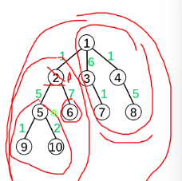

# 点分治


树分治有点分治和边分治两种，适合处理大规模树上路径信息问题。

树上的路径可以分为两种．

1 ，经过根节点的路径

2 ．不经过根节点的路径


对于不经过根节点的路径，可以对子树不断分治，转化为经过根节点的路径。


## 重心

在一棵树中存在若干个点 $G$，在删去这个点 $G$ 后这棵树被分成了若干个连通块，并且这些连通块里所包含的点数的最大值最小。


**求法**，求得的重心存在`rt`里

```C++
void gtrt(int u,int fa){
	siz[u]=1;//siz记录以点i为根的子树大小,首先要把自己加上去 
	int s=0;
	for(int i=0;i<e[u].size();i++){
		int v=e[i];
		if(v==fa||del[u])continue;
		gtrt(v,u);//向下递归扫描子树，获取子树的大小 
		siz[u]+=siz[v];//将自己的大小与子树累加(因为之前可能计算了左子树的,现在要将右子树的加上去) 
		s=max(s,siz[v]);//记录自己最大(包含节点最多)的儿子 
	}
	s=max(s,sum-siz[u]);//sum是整棵树的大小,这里就对应了定义里的"这些连通块里所包含的点数的最大值" 
	if(s<mxs)mxs=s,rt=u;//如果找到更小的,则更新最小值和重心(待定的) 这里就对应了定义里的"...最大值最小" 
}
```

**举例**



当走到u=2时，当走到最后的if时，sizu存的是以2为根的树（2,5,6,9,10）的大小，sum-siz[u]就是另一个部分（右部分 1,3,4,7,8）的大小。

**为什么要从重心处分治？**


而把重心作为根，得到的树最均衡，复杂度最低，如图


## 点分治

点分治的四步操作：

1 ．找出树的重心做根， getroot()（优化时间复杂度）

2 ．求出子树中的各点到根的距离，getdis()

3 ．对当前树统计答案， calc()

4 ，分治各个子树，重复以上操作，divide()

## 题目描述

给定一棵有 $n$ 个点的树，询问树上距离为 $k$ 的点对是否存在。

## 输入格式

第一行两个数 $n,m$。

第 $2$ 到第 $n$ 行，每行三个整数 $u, v, w$，代表树上存在一条连接 $u$ 和 $v$ 边权为 $w$ 的路径。

接下来 $m$ 行，每行一个整数 $k$，代表一次询问。

## 输出格式

对于每次询问输出一行一个字符串代表答案，存在输出 `AYE`，否则输出 `NAY`。

## 样例 #1

### 样例输入 #1

```C++
2 1
1 2 2
2
```

### 样例输出 #1

```C++
AYE
```

## 提示

#### 数据规模与约定

- 对于 $30\%$ 的数据，保证 $n\leq 100$。

- 对于 $60\%$ 的数据，保证 $n\leq 1000$，$m\leq 50$ 。

- 对于 $100\%$ 的数据，保证 $1 \leq n\leq 10^4$，$1 \leq m\leq 100$，$1 \leq k \leq 10^7$，$1 \leq u, v \leq n$，$1 \leq w \leq 10^4$。

## 有误的code

```C++
/*////////ACACACACACACAC///////////
Code By Ntsc
/*////////ACACACACACACAC///////////
#include<bits/stdc++.h>
using namespace std;
#define ll long long
const int N=1e4+5;
const int INF=1e7+5;


vector <int> e[N*2],w[N*2];
int del[N],siz[N],mxs,sum,rt;//del标记，记录在扫描子树时把根删掉，阻止往根上走 siz记录以点i为根的子树大小 
int dis[N],d[N],cnt;//dis记录点i到根的距离 cnt记录已经处理了多少 
int ans[N],q[INF],judge[INF];//judge记录长度为i的路径是否存在
int ask[N],m,n; 

void calc(int u);
void add(int x,int y,int z){
	e[x].push_back(y);
	w[x].push_back(z);
}
void gtrt(int u,int fa){
	siz[u]=1;//siz记录以点i为根的子树大小,首先要把自己加上去 
	int s=0;
	for(int i=0;i<e[u].size();i++){
		int v=e[u][i];
		if(v==fa||del[v])continue;
		gtrt(v,u);//向下递归扫描子树，获取子树的大小 
		siz[u]+=siz[v];//将自己的大小与子树累加(因为之前可能计算了左子树的,现在要将右子树的加上去) 
		s=max(s,siz[v]);//记录自己最大(包含节点最多)的儿子 
	}
	s=max(s,sum-siz[u]);//sum是整棵树的大小,这里就对应了定义里的"这些连通块里所包含的点数的最大值" 
	if(s<mxs)mxs=s,rt=u;//如果找到更小的,则更新最小值和重心(待定的) 这里就对应了定义里的"...最大值最小" 
}
void gtdis(int u,int fa){
	dis[++cnt]=d[u];
	for(int i=0;i<e[u].size();i++){
		int v=e[u][i];
		if(v==fa||del[v])continue;
		d[v]=d[u]+w[u][i];//用fa到根的距离加上fa到u的距离 
		gtdis(v,u);
	}
}
void divide(int u){//分治 
	
	calc(u);
	del[u]=1;
	for(int i=0;i<e[u].size();i++){
		int v=e[u][i];
		if(del[v])continue;
		mxs=sum=siz[v];
		gtrt(v,0);
		divide(rt);//从树的重心开始分治 
	}
}
void calc(int u){
    judge[0]=1;
    int p=0;//记录多少个judge被更新了,后面要清空,这样就不用memset了 
    
    for(int i=0;i<e[u].size();i++){
		int v=e[u][i];
		if(del[v])continue;
		cnt=0;
		d[v]=w[u][i];
		gtdis(v,u);
		
		for(int j=1;j<=cnt;j++){
			for(int k=1;k<=m;k++){//扫描所有询问,判定答案. 当然,如果要把所有长度是否存在处理出来也可以 
				if(ask[k]>=dis[j])ans[k]|=judge[ask[k]-dis[j]];//目前已经有一条长度为dis[j]的路线了,当扫描到询问是否有长度为ask[k]的路线时,只要判定是否存在长度为ask[k]-dis[j]的路线(在之前扫描过的)就可以
				//当然,只有ask[k]>=dis[j]才有可能 
			}
		}
		
		for(int j=1;j<=cnt;j++){
			if(dis[j]<INF){//询问的长度最长为INF,超过它就没有必要计算了 
				q[++p]=dis[j];judge[dis[j]]=1;//走完这个子树,将要到下一个子树时,才更新judge数组,因为在上方的判定时"是否存在长度为ask[k]-dis[j]的路线"的路线必须与当前正在扫描的路线没有重叠部分 
//				q[++p]=dis[j], judge[q[p]]=1;
			}
		}
		//清空数据 ,复杂度小 
		for(int i=1;i<=p;i++)judge[q[i]]=0;
	}
}
signed main(){
	cin>>n>>m;
	for(int i=1;i<n;i++){
		int u,v,ww;
		cin>>u>>v>>ww;
		add(u,v,ww);add(v,u,ww);
	}
	for(int i=1;i<=m;i++){
		cin>>ask[i];
	}
	
	mxs=sum=n;
	gtrt(1,0);
	gtrt(rt,0);
	divide(rt);//离线算法 
	
	for(int i=1;i<=m;i++){
		if(ans[i])cout<<"AYE"<<endl;
		else cout<<"NAY"<<endl;
	}
	return 0;
}

```

## Std

```C++
#include<iostream>
#include<algorithm>
using namespace std;

const int N=10005;
const int INF=10000005;
struct node{int v,w,ne;}e[N<<1];
int h[N],idx; //加边
int del[N],siz[N],mxs,sum,root;//求根
int dis[N],d[N],cnt; //求距离
int ans[N],q[INF],judge[INF];//求路径
int n,m,ask[N];

void add(int u,int v,int w){
  e[++idx].v=v; e[idx].w=w;  
  e[idx].ne=h[u]; h[u]=idx;
}
void getroot(int u,int fa){
  siz[u]=1; 
  int s=0;
  for(int i=h[u];i;i=e[i].ne){
    int v=e[i].v;
    if(v==fa||del[v])continue;
    getroot(v,u);
    siz[u]+=siz[v];
    s=max(s,siz[v]);
  }
  s=max(s,sum-siz[u]);
  if(s<mxs) mxs=s, root=u;
}
void getdis(int u,int fa){
  dis[++cnt]=d[u];
  for(int i=h[u];i;i=e[i].ne){
    int v=e[i].v;
    if(v==fa||del[v])continue;
    d[v]=d[u]+e[i].w;
    getdis(v,u);
  }
}
void calc(int u){
  judge[0]=1;
  int p=0;
  // 计算经过根u的路径
  for(int i=h[u];i;i=e[i].ne){
    int v=e[i].v;
    if(del[v])continue;
    // 求出子树v的各点到u的距离
    cnt=0; 
    d[v]=e[i].w;
    getdis(v,u); 
    // 枚举距离和询问，判定答案
    for(int j=1;j<=cnt;++j)
      for(int k=1;k<=m;++k)
        if(ask[k]>=dis[j])
          ans[k]|=judge[ask[k]-dis[j]];
    // 记录合法距离      
    for(int j=1;j<=cnt;++j)
      if(dis[j]<INF)
        q[++p]=dis[j], judge[q[p]]=1;
  }
  // 清空距离数组
  for(int i=1;i<=p;++i) judge[q[i]]=0;  
}
void divide(int u){
  // 计算经过根u的路径
  calc(u); 
  // 对u的子树进行分治
  del[u]=1;
  for(int i=h[u];i;i=e[i].ne){
    int v=e[i].v;
    if(del[v])continue;
    mxs=sum=siz[v];
    getroot(v,0); //求根
    divide(root); //分治
  }
}
int main(){
  scanf("%d%d",&n,&m);
  for(int i=1;i<n;++i){
    int u,v,w;
    scanf("%d%d%d",&u,&v,&w);
    add(u,v,w);add(v,u,w);
  }
  for(int i=1;i<=m;++i)
    scanf("%d",&ask[i]);
  mxs=sum=n;
  getroot(1,0); 
  getroot(root,0); //重构siz[] 
  divide(root);
  for(int i=1;i<=m;++i)
    ans[i]?puts("AYE"):puts("NAY");
  return 0;
}
```

