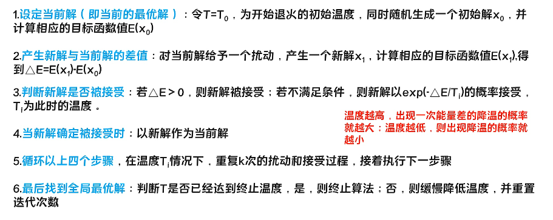
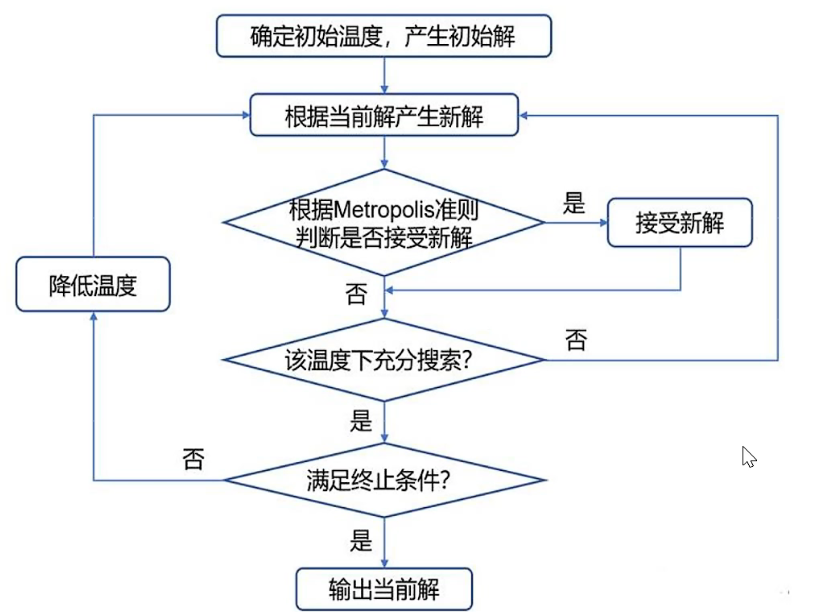
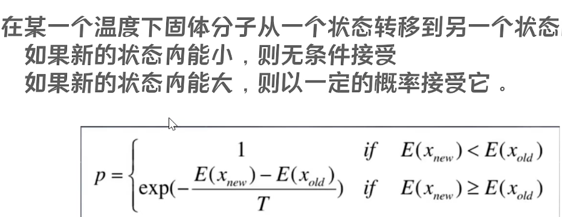
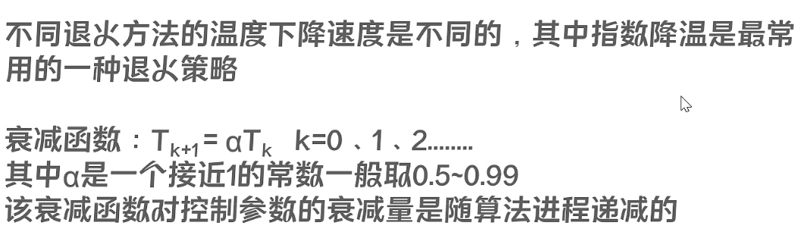

# 爬山算法与模拟退火

爬山算法，模拟退火


核心 ： SA 算法的 Metropolis 准则允许接一定的恶化解



即我们在温度大时，我们可以考虑冒险地寻求较差的解。当我们的温度比较低时，就不去冒险了。

是一个玄学算法，不用深究。

[www.luogu.com.cn](https://www.luogu.com.cn/problem/P1337)




## T_0


## Metropolis 准则



对于函数exp，我们这样写


## 温度下降



## 算法结束


## 模拟退火学习笔记

## 1.关于模拟退火

应该有不少小伙伴们还不知道什么是模拟退火吧，那我今天就来给大家科普科普。

### 定义

模拟退火算法（Simulate Anneal，SA）是一种通用概率演算法，用来在一个大的搜寻空间内找寻命题的最优解。模拟退火是由S.Kirkpatrick, C.D.Gelatt和M.P.Vecchi在1983年所发明的。V.Černý在1985年也独立发明此演算法。模拟退火算法是解决TSP问题的有效方法之一。

模拟退火的出发点是基于物理中固体物质的退火过程与一般组合优化问题之间的相似性。模拟退火算法是一种通用的优化算法，其物理退火过程由加温过程、等温过程、冷却过程这三部分组成。

                     --------来自百度百科

### 说明

实际上模拟退火是一个很好理解的东西。简单地说，就是将热力学的理论套用到统计学上，将搜寻空间内每一点想像成空气内的分子；分子的能量，就是它本身的动能；而搜寻空间内的每一点，也像空气分子一样带有“能量”，以表示该点对命题的合适程度。演算法先以搜寻空间内一个任意点作起始：每一步先选择一个“邻居”，然后再计算从现有位置到达“邻居”的概率。

## 2.模拟退火的基本要素

### 状态空间与状态产生函数

(1).搜索空间（又叫状态空间）。一般范围比较大，事我们自定义的可行解的集合。

(2).状态函数。状态函数将决定你是否要选用当前的解，对于一个好的退火来说，状态函数的搜索空间应该足够大。

(3).候选解。一般采用随机数来在一定密度内随机选取。

(4).概率分布。大多采取均匀分布或指数分布。

### 状态转移概率

(1).状态转移概率是指从一个状态向另一个状态的转移概率。

(2).通俗的理解是接受一个新解为当前解的概率。

(3).它与当前的温度参数T有关，随温度下降而减小。

(4).一般采用Metropolis准则。

## 3.模拟退火模型

第一步是由一个产生函数从当前解产生一个位于解空间的新解；为便于后续的计算和接受，减少算法耗时，通常选择由当前新解经过简单地变换即可产生新解的方法，如对构成新解的全部或部分元素进行置换、互换等，注意到产生新解的变换方法决定了当前新解的邻域结构，因而对冷却进度表的选取有一定的影响。

第二步是计算与新解所对应的目标函数差。因为目标函数差仅由变换部分产生，所以目标函数差的计算最好按增量计算。事实表明，对大多数应用而言，这是计算目标函数差的最快方法。

第三步是判断新解是否被接受，判断的依据是一个接受准则，最常用的接受准则是Metropolis准则: 若Δt′<0则接受S′作为新的当前解S，否则以概率exp(-Δt′/T)接受S′作为新的当前解S。

第四步是当新解被确定接受时，用新解代替当前解，这只需将当前解中对应于产生新解时的变换部分予以实现，同时修正目标函数值即可。此时，当前解实现了一次迭代。可在此基础上开始下一轮试验。而当新解被判定为舍弃时，则在原当前解的基础上继续下一轮试验。

模拟退火算法与初始值无关，算法求得的解与初始解状态S(是算法迭代的起点)无关；模拟退火算法具有渐近收敛性，已在理论上被证明是一种以概率收敛于全局最优解的全局优化算法；模拟退火算法具有并行性。

## 4.参数控制

模拟退火算法的应用很广泛，可以求解NP完全问题，但其参数难以控制，其主要问题有以下三点：

(1) 温度T的初始值设置问题。 温度T的初始值设置是影响模拟退火算法全局搜索性能的重要因素之一、初始温度高，则搜索到全局最优解的可能性大，但因此要花费大量的计算时间；反之，则可节约计算时间，但全局搜索性能可能受到影响。实际应用过程中，初始温度一般需要依据实验结果进行若干次调整。

(2) 退火速度问题。 模拟退火算法的全局搜索性能也与退火速度密切相关。一般来说，同一温度下的“充分”搜索(退火)是相当必要的，但这需要计算时间。实际应用中，要针对具体问题的性质和特征设置合理的退火平衡条件。

(3) 温度管理问题。 温度管理问题也是模拟退火算法难以处理的问题之一。实际应用中，由于必须考虑计算复杂度的切实可行性等问题，常采用如下所示的降温方式：式中k为正的略小于1.00的常数，t为降温的次数。 !

[模拟退火流程图](https://baike.baidu.com/pic/%E6%A8%A1%E6%8B%9F%E9%80%80%E7%81%AB/8664695/0/7aec54e736d12f2e13f34c9b4ec2d56284356853?fr=lemma&ct=single)

## 5.算法改进

（1）设计合适的状态产生函数，使其根据搜索进程的需要表现出状态的全空间分散性或局部区域性；

（2）设计高效的退火策略；

（3）避免状态的迂回搜索；

（4）采用并行搜索结构；

（5）为避免陷入局部极小，改进对温度的控制方式；

（6）选择合适的初始状态；

（7）设计合适的算法终止准则。

## 6.实战演练

[P1337 [JSOI2004]平衡点 / 吊打XXX](https://www.luogu.org/problemnew/show/P1337)

```C++
#include <bits/stdc++.h>
#define down 0.996//徐徐降温 

using namespace std;

int n;
struct node{
int x;
int y;
int w;
}object[2005];//存下物体的坐标 
double ansx,ansy,answ;//最终答案 
double energy(double x,double y)//根据物理学知识,能量总和越小越稳定 
{
   double r=0,dx,dy;
   for (int a=1;a<=n;a++)
   {
      dx=x-object[a].x;
      dy=y-object[a].y;
      r+=sqrt(dx*dx+dy*dy)*object[a].w;
   }
      return r;
}
void sa()//模拟退火 
{
   double t=3000;//温度要足够高 
   while (t>1e-15)//略大于0 
   {
      double ex=ansx+(rand()*2-RAND_MAX)*t;//随机产生新的答案 
      double ey=ansy+(rand()*2-RAND_MAX)*t;
      double ew=energy(ex,ey);
      double de=ew-answ;
      if (de<0)//如果此答案更优，就接受 
      {
         ansx=ex;
         ansy=ey;
         answ=ew;
      }
      else if(exp(-de/t)*RAND_MAX>rand())//否则根据多项式概率接受 
      {
         ansx=ex;
         ansy=ey;
      }
      t*=down;
   }
}
void solve()//多跑几遍退火,增加得到最优解的概率 
{
   sa();
   sa();
   sa();
   sa();
}
int main() {
cin>>n;
for (int a=1;a<=n;a++)
{
   scanf("%d%d%d",&object[a].x,&object[a].y,&object[a].w);
   ansx+=object[a].x;
   ansy+=object[a].y;
}
ansx/=n;//以平均数作为初始答案 
ansy/=n;
answ=energy(ansx,ansy);
solve();
printf("%.3lf %.3lf\n",ansx,ansy);//华丽的输出 
    return 0;
}
```

[www.luogu.com.cn](https://www.luogu.com.cn/problem/P3354)


```C++
/*
SA学习笔记
*/

#include <bits/stdc++.h>
using namespace std;

#define ull unsigned int
#define pii pair<int, int>
#define pf to
#define ps second
#define int long long

#define err cerr << "Error"
#define rd read()

#define ot write
#define nl putchar('\n')
int read() {
  int xx = 0, ff = 1;
  char ch = getchar();
  while (ch < '0' || ch > '9') {
    if (ch == '-')
      ff = -1;
    ch = getchar();
  }
  while (ch >= '0' && ch <= '9')
    xx = xx * 10 + (ch - '0'), ch = getchar();
  return xx * ff;
}
void write(int out) {
  if (out < 0)
    putchar('-'), out = -out;
  if (out > 9)
    write(out / 10);
  putchar(out % 10 + '0');
}

const int M = 800;
const int mxxlog = 10;
int MOD = 1e9 + 57;
const int N=102;
int INF=0x7fffffff;
const double eps = 1e-10;
mt19937 gen(1919810);
uniform_int_distribution<>dist(1,100000);
struct chainstar{
	int next,to,weight;
}e[N<<1];int h[N],cnt;
inline void addline(int u,int v,int w){
	e[++cnt].to=v;
	e[cnt].next=h[u];
	h[u]=cnt;
	e[cnt].weight=w;
}
int a[N],n,k,w[N],ans=INF,now,p1,p2;
bool isk[N];
void dfs(int u,int s){
	if(isk[u])s=0;
	now+=w[u]*s;
	for(int i=h[u];i;i=e[i].next)
		dfs(e[i].to,s+e[i].weight);
}
inline void solve(){
	now=0;
	for(int i=1;i<=k;++i)isk[a[i]]=1;
	for(int i=k+1;i<=n;++i)isk[a[i]]=0;
	dfs(0,0);
}
inline void SA(){
	for(double T=1000;T>=1e-9;T*=0.999){
		random_shuffle(a+1,a+1+k);
		random_shuffle(a+1+k,a+1+n);
		swap(a[k],a[k+1]);
		solve();
		int der=now-ans;
		if(der<0)ans=now;
		else if(exp(-der/T)*100000<=dist(gen))swap(a[k],a[k+1]);
	}
}
void getlis(int u,int d){
	if(u!=0){
		if(d&1)a[++p1]=u;
		else a[p2--]=u;
	}
	for(int i=h[u];i;i=e[i].next)
		getlis(e[i].to,d+1);
}
signed main(){
	srand(1919810);
	p2=n=read(),k=read();
	for(int i=1;i<=n;++i){
		w[i]=read();
		int f=read(),d=read();
		addline(f,i,d);
	}
	getlis(0,1);
	while((double)clock()/CLOCKS_PER_SEC<=0.89)SA();
	printf("%lld\n",ans);
	return 0;
}
```

