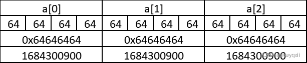

# 基础知识


## 运算符优先级

优先级值越大，表示优先级越高。

|优先级|分类|运算符|结合性|
|-|-|-|-|
|1|逗号运算符|,|从左到右|
|2|赋值运算符|=、+=、-=、*=、/=、 %=、 >=、 <<=、&=、^=、|=|从右到左|
|3|逻辑或||||从左到右|
|4|逻辑与|&&|从左到右|
|5|按位或|||从左到右|
|6|按位异或|^|从左到右|
|7|按位与|&|从左到右|
|8|相等/不等|==、!=|从左到右|
|9|关系运算符|<、<=、>、>=|从左到右|
|10|位移运算符|<<、>>|从左到右|
|11|加法/减法|+、-|从左到右|
|12|乘法/除法/取余|*（乘号）、/、%|从左到右|
|13|单目运算符|!、*（指针）、& 、++、–、+（正号）、-（负号）|从右到左|
|14|后缀运算符|( )、[ ]、->|从左到右|

## 类的概念及简单应用

定义类

类使用关键字 `class` 或者 `struct` 定义，下文以 `class` 举例。

```C++
class myclass{
  public:
    
}a;

// 等效于

struct mystruct{
  
}a;
```

与使用 `struct` 大同小异。该例定义了一个名为 `Object` 的类。该类拥有两个成员元素，分别为 `weight,value`；并在 `}` 后使用该类型定义了一个数组 `e`。

定义类的指针形同 `[struct](https://oi-wiki.org/lang/struct/)`。

访问说明符

不同于 `[struct](https://oi-wiki.org/lang/struct/)` 中的举例，本例中出现了 `public`，这属于访问说明符。

- `public`：该访问说明符之后的各个成员都可以被公开访问，简单来说就是无论 **类内** 还是 **类外** 都可以访问。

- `protected`：该访问说明符之后的各个成员可以被 **类内**、派生类或者友元的成员访问，但类外 **不能访问**。

- `private`：该访问说明符之后的各个成员 **只能** 被 **类内** 成员或者友元的成员访问，**不能** 被从类外或者派生类中访问。

对于 `struct`，它的所有成员都是默认 `public`。对于 `class`，它的所有成员都是默认 `private`。

## 成员函数和运算符重载

```C++
int operator*(const node& other)const{
    return x * other.x + y * other.y; 
}//对乘法进行重载运算符
bool operator <(const node& b)const{
    return x>b.x;
}//对小于号进行重载运算符，默认的sort和优先队列之类的结构都是使用<进行比较的
```

下面是一个两数取min的代码

```C++
#include<bits/stdc++.h>
using namespace std;

struct node{
	int x;
	bool operator <(const node& b)const{
		return x>b.x;
	}
}a,b;

int main(){
	cin>>a.x>>b.x;
	cout<<max(a,b).x;
	return 0;
} 
```

## 字符串与数字转换


## `printf` 的规定符

- **%d** 十进制有符号整数

- **%u** 十进制无符号整数

- **%f** 浮点数

- **%s** 字符串

- **%c** 单个字符

- **%p** 指针的值

- **%e** 指数形式的浮点数

- **%x, %X** 无符号以十六进制表示的整数

- **%o** 无符号以八进制表示的整数

- **%g** 把输出的值按照 %e 或者 %f 类型中输出长度较小的方式输出

- **%p** 输出地址符

- **%lu** 32位无符号整数

- **%llu** 64位无符号整数

- **%%** 输出百分号字符本身。

除了格式化说明符之外，printf() 函数还支持一些标志和选项，用于控制输出的精度、宽度、填充字符和对齐方式等。例如：

- %-10s：左对齐并占用宽度为 10 的字符串；

- %5.2f：右对齐并占用宽度为 5，保留两位小数的浮点数；

- %#x：输出带有 0x 前缀的十六进制数。

## define 用法

最基本的字符替换功能这里就不再介绍了。


```C++
//第一种写法,建议用于写函数,必须写成函数类型
#define add(x,y) (x+y)
#define rp(1,a,b) for(int i=1;i<=(a),i+=(b))
//第2种写法,"#n"可以将n转换为字符串嵌入
#define PXN(n) printf(" x"#n" \n")
//第3,##n可以将n与前面的部分联合起来
#define PXN(n) printf("%d\n",b##n)
```

注意，以下写法不可取

```C++
#define PXN(n) printf("##n\n",b2)//期望PXN(abc)>>输出字符串abc
#define PXN(n) printf("%d \n",b"#n")//期望PXN(2)>>输出b2的值
```

---

- `#n`可以将n转换为字符串嵌入

- `##n`可以将n与前面的部分联合起来

通过了解define的基本用法，我们可以很简单的写出升级版的cerr

```C++
#define dbg(x) cerr<<#x<<" : "<<x<<endl;
```

## memset 函数

memset函数是基于字节来清空的。

- `char`是一种字符类型，用来表示单个字符。每个字符占用一个字节的内存空间。

- `int`是一种整数类型，用来表示整数。每个整数占用四个字节的内存空间。

因此我们再使用memset批量赋值char[]时是不会有任何问题的

但是以为我们的int是4个字节，于是赋值就会出现问题

例如：对于int型数组a，我们尝试使用memset将数组中的元素都赋值为100，即：

```C++
memset(a,100,sizeof a);
```

输出结果为1684300900，这与我们希望得到的结果截然不同。接下来我们将分析该结果产生的原因：

100表示：内存中每个字节都赋予ASCII码为100的字符。我们将十进制数100转化为十六进制，得到0x64（0x为十六进制前缀）。则 memset(a,100,sizeof a) 表示：将目标内存中的每个字节都赋为0x64。



如上图所示，由于a为int型数组，每个元素占四个字节的内存空间。由于每个字节都被赋值为0x64，因此每个int型元素的值都为0x64646464。将其转化为十进制，得到输出结果1684300900。

但是以为0，-1所有码位都一样，所以我们可以正确赋值。

这样可以解释为什么写0x3f3f和0x3f是一样的了。因为实际上只能够存下0x3f。

但是注意，在对double[]进行赋值时，规则不一样！0x3f非常小。建议赋值时输出看看。

