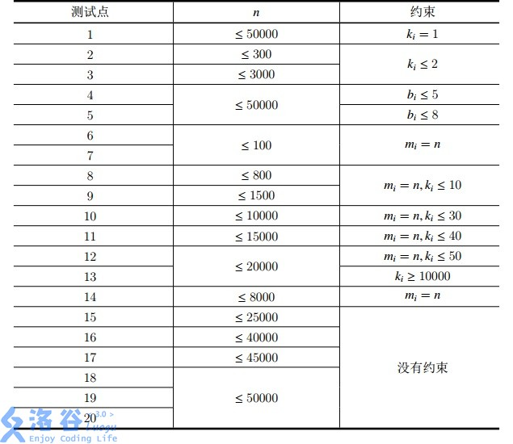

# 三元上升子序列

## 题目描述

Erwin 最近对一种叫 `thair` 的东西巨感兴趣。。。

在含有 $n$ 个整数的序列 $a_1,a_2,\ldots,a_n$ 中，三个数被称作`thair`当且仅当 $i<j<k$ 且 $a_i<a_j<a_k$。

求一个序列中 `thair` 的个数。

## 思路

有没有感觉有一点像二维偏序，实际上也正是如此，我们可以用分治的做法来实现这道题。

那么分治怎么分呢？我们以考虑在分治的时候分成3部分而不是通常情况下的两部分。那么此时我们每一次合并就应该使用3指针了。好吧，这个想法有待验证。

我们回到这道题，其实就是求长度为M的单调递增序列的个数。那么我们就可以使用最简单的dp法。

定义f_{i,j}为以i为结尾，长度为j的单调递增序列的个数

转移有$f_{i,j}=\sum\limits_{k=1}^{i-1}[a_k<a_i]f_{k,j-1}$

那么我们怎么样优化呢？使用树状数组即可，对于每一个j都建立一颗树状数组，所以需要M棵树状数组。时间复杂度是O(NM\log N)的，优秀。

## 代码

```C++
·
#include <bits/stdc++.h>
#include <queue>
#define rep(l, r, i) for (int i = l, END##i = r; i <= END##i; ++i)
#define per(r, l, i) for (int i = r, END##i = l; i >= END##i; --i)
using namespace std;
#define pb push_back
#define mp make_pair
#define int long long
#define pii pair<int, int>
#define ps second
#define pf first

#define X(j) i[j]
#define Y(j) (dp[j] + (i[j] + L) * (i[j] + L))

// const bool OPEN_DEBUG = true;

// template <typename T,typename... Args>
// void DEBUG(bool flg,T s,Args... args) {
// 	if constexpr (OPEN_DEBUG){
// 		cout << s;
// 		if constexpr (sizeof...(Args))
// 			DEBUG(flg,args...);
// 	}
// }


#define rd read()
int read() {
    int xx = 0, ff = 1;
    char ch = getchar();
    while (ch < '0' || ch > '9') {
		if (ch == '-')
			ff = -1;
		ch = getchar();
    }
    while (ch >= '0' && ch <= '9')
      xx = xx * 10 + (ch - '0'), ch = getchar();
    return xx * ff;
}
void write(int out) {
	if (out < 0)
		putchar('-'), out = -out;
	if (out > 9)
		write(out / 10);
	putchar(out % 10 + '0');
}

const int N = 3e5 + 5;
const int INF = 1e18;

struct ctree{
    int c[N];

    inline int lowbit(int x){
        return x&-x;
    }
    void change(int x,int v){
        while(x<N){
            c[x]+=v;
            x+=lowbit(x);
        }
    }
    int query(int x){
        int res=0;
        while(x){
            res+=c[x];
            x-=lowbit(x);
        }
        return res;
    }
}c[5];

int n;
int a[N];
int f[N][5];

void solve(){
    n=rd;
    for(int i=1;i<=n;i++){
        a[i]=rd;
    }
    for(int i=1;i<=n;i++){
        for(int j=1;j<=3;j++){
            if(j==1)f[i][j]=1;
            else f[i][j]=c[j-1].query(a[i]-1);
            c[j].change(a[i],f[i][j]);
        }
    }
    int ans=0;
    // for(int j=1;j<=3;j++){
    //     for(int i=1;i<=n;i++){cerr<<f[i][j]<<' ';
    //     }
    //     cerr<<endl;
    // }
    for(int i=1;i<=n;i++)ans+=f[i][3];
    cout<<ans<<endl;
}

signed main() {
    int T=1;
    while(T--){
    	solve();
    }
    return 0;
}
```


## 输入格式

开始一行一个正整数 $n$,

以后一行 $n$ 个整数 $a_1,a_2,\ldots,a_n$。

## 输出格式

一行一个整数表示 `thair` 的个数。

## 样例 #1

### 样例输入 #1

```C++
4
2 1 3 4
```

### 样例输出 #1

```C++
2
```

## 样例 #2

### 样例输入 #2

```C++
5
1 2 2 3 4
```

### 样例输出 #2

```C++
7
```

## 提示

#### 样例2 解释

$7$ 个 `thair` 分别是：

- 1 2 3

- 1 2 4

- 1 2 3

- 1 2 4

- 1 3 4

- 2 3 4

- 2 3 4

#### 数据规模与约定

- 对于 $30\%$ 的数据 保证 $n\le100$；

- 对于 $60\%$ 的数据 保证 $n\le2000$；

- 对于 $100\%$ 的数据 保证 $1 \leq n\le3\times10^4$，$1\le a_i\leq 10^5$。

# [HAOI2007] 上升序列

## 题目描述

对于一个给定的 $S=\{a_1,a_2,a_3,…,a_n\}$ , 若有 $P=\{a_{x_1},a_{x_2},a_{x_3},…,a_{x_m}\}$ , 满足 $(x_1<x_2<…<x_m)$  且 $(a_{x_1}<a_{x_2}<…<a_{x_m})$ 。那么就称 $P$ 为 $S$ 的一个上升序列。如果有多个 $P$ 满足条件，那么我们想求字典序最小的那个。

任务：

给出 $S$ 序列，给出若干询问。对于第 $i$ 个询问，求出长度为 $L_i$ 的上升序列，如有多个，求出字典序最小的那个（即首先 $x_1$ 最小，如果不唯一，再看 $x_2$ 最小……），如果不存在长度为 $L_i$ 的上升序列，则打印 `Impossible`。

## 思路

注意到这里的最小的字典序指的是选择的数字的**下标**的字典序！

那么就简单许多了。我们正着就是要让第一个元素的下标最小，这个不太好解决，那么我们就把整个a倒序。

那么就简单许多了。我们正着就是要让第一个元素的下标最小，这个不太好解决，那么我们就把整个a倒序。

于是我们就只要求结尾字典序最大的了。暴力做法就是我们枚举每一个f_i，满足f_i≥L的最大的i即可。

优化就是优化查询的过程，这个很经典了。

注意还有记录方案。在记录方案的时候，因为我们dp是倒着进行的，所以我们应该在有多个转移选择的时候选择靠后的那个

## 代码

```C++

#include <bits/stdc++.h>
#include <queue>
#define rep(l, r, i) for (int i = l, END##i = r; i <= END##i; ++i)
#define per(r, l, i) for (int i = r, END##i = l; i >= END##i; --i)
using namespace std;
#define pb push_back
#define mp make_pair
#define int long long
#define pii pair<int, int>
#define ps second
#define pf first

#define X(j) i[j]
#define Y(j) (dp[j] + (i[j] + L) * (i[j] + L))

// const bool OPEN_DEBUG = true;

// template <typename T,typename... Args>
// void DEBUG(bool flg,T s,Args... args) {
// 	if constexpr (OPEN_DEBUG){
// 		cout << s;
// 		if constexpr (sizeof...(Args))
// 			DEBUG(flg,args...);
// 	}
// }


#define rd read()
int read() {
    int xx = 0, ff = 1;
    char ch = getchar();
    while (ch < '0' || ch > '9') {
		if (ch == '-')
			ff = -1;
		ch = getchar();
    }
    while (ch >= '0' && ch <= '9')
      xx = xx * 10 + (ch - '0'), ch = getchar();
    return xx * ff;
}
void write(int out) {
	if (out < 0)
		putchar('-'), out = -out;
	if (out > 9)
		write(out / 10);
	putchar(out % 10 + '0');
}

const int N = 1e5 + 5;
const int INF = 1e18;
int ints[N];
int dp[N];

void solve(){
    int n=rd;
    for(int i=1;i<=n;i++){
        ints[i]=rd;
        dp[i]=1;
    }
    int imax=1;
    for(int i=n-1;i>=1;i--){
        int maxn=1;
        for(int j=i+1;j<=n;j++){
            if(ints[j]>ints[i]){
                if(dp[j]+1>maxn){
                    maxn=dp[j]+1;
                }
            }
        }
        dp[i]=maxn;
        if(maxn>imax)imax=maxn;
    }
    int m=rd;
    for(int i=0;i<m;i++){
        int l=rd;
        if(l>imax||l<=0){
            printf("Impossible\n");
        }
        else{
            int tmp=l;
            int last=-1;
            for(int j=1;j<=n;j++){
                if(dp[j]>=tmp&&ints[j]>last){
                    printf("%d ",ints[j]);
                    last=ints[j];
                    tmp--;
                    if(tmp==0)break;
                }
            }
            cout<<endl;
        }
    }
}


signed main() {
    int T=1;
    while(T--){
    	solve();
    }
    return 0;
}
```

## 输入格式

第一行一个 $N$，表示序列一共有 $N$ 个元素。

第二行 $N$ 个数，为 $a_1, a_2 , \cdots , a_n$。

第三行一个 $M$，表示询问次数。下面接 $M$ 行每行一个数 $L$，表示要询问长度为 $L$ 的上升序列。

## 输出格式

对于每个询问，如果对应的序列存在，则输出，否则打印 `Impossible`。

## 样例 #1

### 样例输入 #1

```C++
6
3 4 1 2 3 6
3
6
4
5
```

### 样例输出 #1

```C++
Impossible
1 2 3 6
Impossible
```

## 样例 #2

### 样例输入 #2

```C++
6
6 7 1 2 3 4
1
2
```

### 样例输出 #2

```C++
6 7
```

## 提示

$N \le 10000$，$M \le 1000$，保证数据随机。

# [HAOI2010] 最长公共子序列

## 题目描述

字符序列的子序列是指从给定字符序列中随意地（不一定连续）去掉若干个字符（可能一个也不去掉）后所形成的字符序列。令给定的字符序列$X=\{x_0,x_1,\cdots ,x_{m-1}\}$，序列$Y=\{y_0,y_1,\cdots ,y_{k-1}\}$ 是 $X$ 的子序列，存在 $X$ 的一个严格递增下标序列 $\{i_0,i_1,\cdots,i_{k-1}\}$ ，使得对所有的$j=0,1,\cdots,k-1$ ，有 $x_{ij}=y_j$ 。例如，$X=\verb!"ABCBDAB"!$ ，$Y=\verb!"BCDB"!$ 是 $X$ 的一个子序列。对给定的两个字符序列，求出他们最长的公共子序列长度，以及最长公共子序列个数。

## 代码

```C++

#include <bits/stdc++.h>
#include <queue>
#define rep(l, r, i) for (int i = l, END##i = r; i <= END##i; ++i)
#define per(r, l, i) for (int i = r, END##i = l; i >= END##i; --i)
using namespace std;
#define pb push_back
#define mp make_pair
// #define int long long
#define pii pair<int, int>
#define ps second
#define pf first

#define X(j) i[j]
#define Y(j) (dp[j] + (i[j] + L) * (i[j] + L))

#define rd read()
int read() {
    int xx = 0, ff = 1;
    char ch = getchar();
    while (ch < '0' || ch > '9') {
		if (ch == '-')
			ff = -1;
		ch = getchar();
    }
    while (ch >= '0' && ch <= '9')
      xx = xx * 10 + (ch - '0'), ch = getchar();
    return xx * ff;
}
void write(int out) {
	if (out < 0)
		putchar('-'), out = -out;
	if (out > 9)
		write(out / 10);
	putchar(out % 10 + '0');
}

const int N = 5e3 + 5;
const int YL=1e8;
const int INF = 1e18;


char x[N],y[N];
int ff[N],gg[N],mff[N],mgg[N];
void solve(){
    scanf("%s%s",x+1,y+1);
    int n=strlen(x+1)-1,m=strlen(y+1)-1,i,j,*f=ff,*g=gg,*mf=mff,*mg=mgg;
    g[0]=1;for(j=0;j<=m;++j)f[j]=1;
    for(i=1;i<=n;++i,swap(f,g),swap(mf,mg)){//滚动数组
        memset(g +1,0,m<<2);//注意清空
        memset(mg+1,0,m<<2);
        for(j=1;j<=m;++j){//三方向转移
            if(x[i]==y[j])mg[j]=mf[j-1]+1,g[j]=f[j-1];
            if(mf[j]>mg[j])mg[j]=mf[j],g[j]=f[j];//覆盖
            else if(mf[j]==mg[j])(g[j]+=f[j])%=YL;//相加
            if(mg[j-1]>mg[j])mg[j]=mg[j-1],g[j]=g[j-1];
            else if(mg[j-1]==mg[j])(g[j]+=g[j-1])%=YL;
            if(mf[j-1]==mg[j])(g[j]+=YL-f[j-1])%=YL;//减掉重复的部分
        }
    }
    printf("%d\n%d\n",mf[m],f[m]);
}

signed main() {
    int T=1;
    while(T--){
    	solve();
    }
    return 0;
}
```

## 输入格式

第一行为第一个字符序列，都是大写字母组成，以 . 结束，大写字母个数不超过 $5000$。

第二行为第二个字符序列，都是大写字母组成，以 . 结束，大写字母个数不超过 $5000$。

## 输出格式

第一行输出上述两个最长公共子序列的长度。

第二行输出所有可能出现的最长公共子序列个数，答案可能很大，只要将答案对 $10^{8}$ 求余即可。

## 样例 #1

### 样例输入 #1

```C++
ABCBDAB.
BACBBD.
```

### 样例输出 #1

```C++
4
7
```

# [TJOI2014] 上升子序列

## 题目描述

给定一个只包含整数的序列(序列元素的绝对值大小不超过10^9),你需要计算上升子序列的个数,满足如下条件的称之为一个上升子序列:

1. 是原序列的一个子序列

2. 长度至少为2

3. 所有元素都严格递增

如果两个上升子序列相同,那么只需要计算一次。例如:序列{1,2,3,3}有4个上升子序列,分别为{1,2}{1,3},{1,2,3},{2,3}

## 思路

如果不需要去重就很简单了，dp求出以位置i为结尾的上升子序列个数，然后加起来即可。可以使用树状数组解决。

那么怎么样去重呢？我们发现需要去重的仅当结尾的数字相同。设$i<j,a_i=a_j$，那么我们在枚举到j时会把i的答案计算一遍。为了消除这一部分i的答案，我们只需要记录一下$lastans_i$然后在j处减去即可。

## 代码

```C++

#include <bits/stdc++.h>
#include <queue>
#define rep(l, r, i) for (int i = l, END##i = r; i <= END##i; ++i)
#define per(r, l, i) for (int i = r, END##i = l; i >= END##i; --i)
using namespace std;
#define pb push_back
#define mp make_pair
#define int long long
#define pii pair<int, int>
#define ps second
#define pf first

#define X(j) i[j]
#define Y(j) (dp[j] + (i[j] + L) * (i[j] + L))

#define rd read()
int read() {
    int xx = 0, ff = 1;
    char ch = getchar();
    while (ch < '0' || ch > '9') {
		if (ch == '-')
			ff = -1;
		ch = getchar();
    }
    while (ch >= '0' && ch <= '9')
      xx = xx * 10 + (ch - '0'), ch = getchar();
    return xx * ff;
}
void write(int out) {
	if (out < 0)
		putchar('-'), out = -out;
	if (out > 9)
		write(out / 10);
	putchar(out % 10 + '0');
}

const int N = 3e5 + 5;
const int INF = 1e18;
const int MOD=1e9+7;

map<int,int> ma;
int c[N],n;
int a[N],b[N];
int lstans[N];
int f[N];

inline int lowbit(int x){return ((x)&(-(x)));}
inline void change(int x,int v)
{
	for(int i=x;i<=n;i+=lowbit(i))
		c[i]=(c[i]+v)%MOD;
}
inline int query(int x)
{
	int ans=0;
	for(int i=x;i;i-=lowbit(i))
		ans=(ans+c[i])%MOD;
	return ans;
}
void solve()
{
	n=rd;
	for(int i=1;i<=n;i++) a[i]=b[i]=rd;
	sort(b+1,b+n+1);
	int tot=unique(b+1,b+1+n)-b-1;
	for(int i=1;i<=tot;i++)
		ma[b[i]]=i;
	int cnt=0;
	for(int i=1;i<=n;i++)
	{
		int j=ma[a[i]];
		if(!f[j])
		{
			int v=query(j-1);
			cnt=(cnt+v)%MOD;
			change(j,v+1);
			lstans[j]=v;
			f[j]=1;
			continue;
		}
		int v=query(j-1);
		cnt=(cnt+v-lstans[j]+MOD)%MOD;
		change(j,(v-lstans[j]+2*MOD)%MOD);
		lstans[j]=v;
	}
	cout<<cnt;
}

signed main() {
    int T=1;
    while(T--){
    	solve();
    }
    return 0;
}
```

## 输入格式

输入的第一行是一个整数n,表示序列长度。接下来一行是n个整数,表示序列。

## 输出格式

输出仅包含一行,即原序列有多少个上升子序列。由于答案可能非常大,你只需要输出答案模10^9+7的余数。

## 样例 #1

### 样例输入 #1

```C++
4
1 2 3 3
```

### 样例输出 #1

```C++
4
```

## 提示

### 数据范围

对于 30% 的数据，N ≤ 5000

对于 100% 的数据，N ≤ 10^5

# [CTSC2017] 最长上升子序列

## 题目描述

猪小侠最近学习了最长上升子序列的相关知识。对于一个整数序列 $A =(a_1, a_2,\ldots , a_k)$，定义 $A$ 的子序列为：从 $A$ 中删除若干个元素后（允许不删，也允许将所有 $k$ 个元素都删除），剩下的元素按照原来的顺序所组成的序列。如果这个子序列的元素从左到右严格递增，则称它为 $A$ 的一个上升子序列。其中包含元素数量最多的上升子序列称为 $A$ 的最长上升子序列。例如，$(2, 4, 5, 6)$ 和 $(1, 4, 5, 6)$ 都是 $(2, 1, 1, 4, 7, 5, 6)$ 的最长上升子序列，长度都为 $4$。

现在猪小侠遇到了这样一个问题：给定一个序列 $B_m = (b_1, b_2, \ldots, b_m)$，设 $C$ 是 $B_m$ 的子序列，且 $C$ 的最长上升子序列的长度不超过 $k$，则 $C$ 的长度最大能是多少？

猪小侠觉得这个问题太简单了，缺乏挑战，他决定提出一个更难的问题。于是他给了你这样一个序列 $B = (b_1, b_2,\ldots , b_n)$，以及若干次询问。每次询问会给定两个整数 $m$ 和 $k$，你需要对于 $B$ 序列的前 $m$ 个元素构成的序列 $B_m = (b_1, b_2, \ldots, b_m)$ 和 $k$ 回答上述问题。

## 输入格式

第一行两个整数 $n, q$，其中 $n$ 是序列 $B$ 的长度，$q$ 是询问次数。

第二行是空格隔开的 $n$ 个正整数 $b_1, b_2, \ldots, b_n$。

接下来 $q$ 行，其中第 $i$ 行包含两个整数 $m_i, k_i$，表示对 $m = m_i, k = k_i$ 进行询问。

## 输出格式

输出共 $q$ 行，按顺序每行一个整数作为回答。

## 样例 #1

### 样例输入 #1

```C++
11 6
9 6 3 1 5 12 8 4 2 2 2
5 1
7 2
9 1
9 2
11 1
11 11
```

### 样例输出 #1

```C++
4 
6 
5 
8 
7
11
```

## 提示

【样例解释】

询问 $1$：对于序列 $(9,6,3,1,5)$，可以选取子序列 $(9,6,3,1)$，它的最长上升子序列长度为 $1$。

询问 $2$：对于序列 $(9,6,3,1,5,12,8)$，可以选取子序列 $(9,6,3,1,12,8)$，它的最长上升子序列长度为 $2$。

询问 $3$：对于序列 $(9,6,3,1,5,12,8,4,2)$，可以选取子序列 $(9,6,5,4,2)$，它的最长上升子序列长度为 $1$。

询问 $4$：对于序列 $(9,6,3,1,5,12,8,4,2)$，可以选取子序列 $(9,6,3,1,12,8,4,2)$，它的最长上升子序列长度为 $2$。

询问 $5$：对于序列 $(9,6,3,1,5,12,8,4,2,2,2)$，可以选取子序列 $(9,6,5,4,2,2,2)$，它的最长上升子序列长度为 $1$。

询问 $6$：对于序列 $(9,6,3,1,5,12,8,4,2,2,2)$，可以选取子序列 $(9,6,3,1,5,12,8,4,2,2,2)$，它的最长上升子序列长度为 $3$。



对于 $100\%$ 的数据， $1\leq n\leq 5\times 10^4$，$1\leq b_i\leq 5\times 10^4$，$1\leq q \leq 2\times 10^5$，$1\leq k_i \leq m_i \leq n$。

