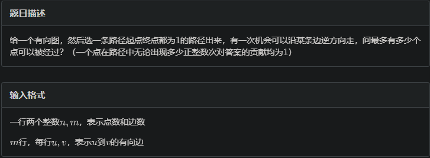

# 无向图上DP（Tarjan-DP）

在无向图上DP，我们比较多的是使用Tarjan进行缩点后转化为树形dp

## 例题 #1 逆向边



---

我们先缩点，然后处理出根节点到每个点的路径最长路，每个点到根节点的路径最长路（不含根节点），这里的路径长指的是结果的节点权值和。

然后美枚举每一个可以由根节点到达，且可以回到根节点的点对（枚举边即可），更新答案。

```C++
/*
                      Keyblinds Guide
                                ###################
      @Ntsc 2024

      - Ctrl+Alt+G then P : Enter luogu problem details
      - Ctrl+Alt+B : Run all cases in CPH
      - ctrl+D : choose this and dump to the next
      - ctrl+Shift+L : choose all like this
      - ctrl+K then ctrl+W: close all
      - Alt+la/ra : move mouse to pre/nxt pos'

*/
#include <bits/stdc++.h>
#include <queue>
using namespace std;

#define rep(i, l, r) for (int i = l, END##i = r; i <= END##i; ++i)
#define per(i, r, l) for (int i = r, END##i = l; i >= END##i; --i)
#define pb push_back
#define mp make_pair
#define int long long
#define pii pair<int, int>
#define ps second
#define pf first
#define ull unsigned long long

#define itn int
// #define inr int
// #define mian main
// #define iont int

#define rd read()
int read() {
    int xx = 0, ff = 1;
    char ch = getchar();
    while (ch < '0' || ch > '9') {
        if (ch == '-')
            ff = -1;
        ch = getchar();
    }
    while (ch >= '0' && ch <= '9') xx = xx * 10 + (ch - '0'), ch = getchar();
    return xx * ff;
}
void write(int out) {
    if (out < 0)
        putchar('-'), out = -out;
    if (out > 9)
        write(out / 10);
    putchar(out % 10 + '0');
}

#define ell dbg('\n')
const char el = '\n';
const bool enable_dbg = 1;
template <typename T, typename... Args>
void dbg(T s, Args... args) {
    if constexpr (enable_dbg) {
        cerr << s;
        if (1)
            cerr << ' ';
        if constexpr (sizeof...(Args))
            dbg(args...);
    }
}

#define zerol = 1
#ifdef zerol
#define cdbg(x...)            \
    do {                      \
        cerr << #x << " -> "; \
        err(x);               \
    } while (0)
void err() { cerr << endl; }
template <template <typename...> class T, typename t, typename... A>
void err(T<t> a, A... x) {
    for (auto v : a) cerr << v << ' ';
    err(x...);
}
template <typename T, typename... A>
void err(T a, A... x) {
    cerr << a << ' ';
    err(x...);
}
#else
#define dbg(...)
#endif

const int N = 5e5 + 5;
const int INF = 1e18;
const int M = 1e7;
const int MOD = 1e9 + 7;

vector<int> e[N];

void add(int a, int b) { e[a].push_back(b); }

int dfn[N], low[N], stk[N], top, instk[N];
int belong[N];
int tot;
int cnt;

vector<int> g[N];

void addg(int a, int b) { g[a].push_back(b); }

int gg[N], sz[N], f[N];

void tarjan(int x) {
    dfn[x] = low[x] = ++tot;
    stk[++top] = x;
    instk[x] = true;
    for (int i = 0; i < e[x].size(); i++) {
        int y = e[x][i];
        if (dfn[y] == 0) {
            tarjan(y);
            low[x] = min(low[x], low[y]);
        } else if (instk[y])
            low[x] = min(low[x], dfn[y]);
    }
    if (dfn[x] == low[x]) {
        cnt++;
        int y;
        do {
            y = stk[top--];
            instk[y] = false;
            belong[y] = cnt;
            sz[cnt]++;

        } while (y != x);
    }
}

void solve() {
    int n = rd, m = rd;
    for (int i = 1; i <= m; i++) {
        int a = rd, b = rd;
        add(a, b);
    }

    for (int i = 1; i <= n; i++) {
        if (!dfn[i])
            tarjan(i);
    }

    //
    for (int i = 1; i <= n; i++) {
        for (auto v : e[i]) {
            if (belong[i] != belong[v]) {
                addg(belong[i], belong[v]);
            }
        }
    }

    for (int i = 0; i < N; i++) {
        f[i] = -INF;
        gg[i] = -INF;
    }

    f[belong[1]] = sz[belong[1]];
    gg[belong[1]] = 0;

    for (int i = belong[1]; i; i--) {
        for (int x : g[i]) f[x] = max(f[x], f[i] + sz[x]);
    }

    for (int i = belong[1] + 1; i <= cnt; i++) {
        for (int x : g[i]) gg[i] = max(gg[i], gg[x] + sz[i]);
    }

    int ans = 0;
    for (int i = 1; i <= cnt; i++) {
        for (int v : g[i]) {
            if (i >= belong[1] && belong[1] >= v)
                ans = max(ans, f[v] + gg[i]);
        }
    }
    cout << ans << endl;
}

signed main() {
    // freopen(".in","r",stdin);
    // freopen(".in","w",stdout);

    int T = 1;
    while (T--) {
        solve();
    }
    return 0;
}
```

