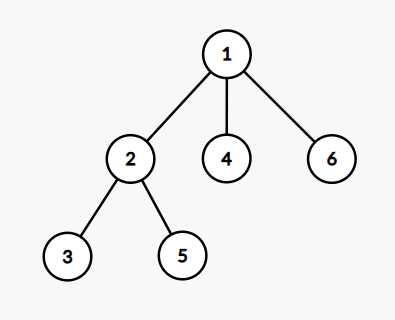
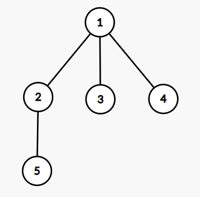

# Shaass and Lights

## 题面翻译

有 $n$ 盏灯，(0≤n≤1000),有 $m$盏已经点亮，每次只能点亮与已经点亮的灯相邻的灯，求点亮所有灯的总方案数，答案对1e9+7取模

第一行：两个整数 $n,m$ 表示灯的总数和已点亮的灯的数目 第二行m个数，表示已点亮的灯的编号

感谢@ztz11 提供的翻译

## 思路

首先我们可以把这 $n$ 盏灯拆分开来。我们以已经点亮了的灯为分界线，那么我们就可以把所有没有点亮的灯划分为若干个不相邻的区间，每个区间中都是没有被点亮的灯。

那么我们现在来考虑一个区间的情况：

### 单区间

下面我们用 $a_i$ 来表示每个灯的情况，$1$ 表示点亮了。

对于区间 $[l,r]$，我们知道 $a_l\sim a_r=0,a_{l-1}=a_{r+1}=1$，那么我们就只有两种点亮灯的方式：在左边扩展，或者在右边扩展。我们可以交替进行上面的两种操作，现在的问题是我们应该怎么样计算出使用上面两种操作填满这个区间的方案数。

我们把在左边扩展记为 `L`，在右边扩展记为 `R` 那么现在的问题就转化为了求**用字符 `L`,`R`** **填满长度为 $r-l+1$** **的字符串的方案数量**。那么每个位置我们有两种情况，所以方案数量就是 $2^{r-l+1}$。但是我们注意到，在原题（即点亮灯的问题）中当我们点亮了 $r-l$ 个灯后，最后一个没有点亮的灯的左右都是已经点亮的灯。此时无论我们选择在左边扩展，或者在右边扩展，都是点亮该盏灯，所以这其实是一种情况。所以方案数量应该为 $2^{r-l}$，即**用字符 `L`,`R`** **填满长度为 $r-l$** **的字符串的方案数量**

### 区间交错

为了方便，我们先只考虑两边都有点亮了的灯的区间，即不考虑两端的区间。

回到本题。本题是由多个上述区间组成的，每次操作我们都可以选择任意一个区间进行操作。那么我们怎么样来处理这个问题呢？

是不是不好想？

其实非常简单啦：

**思路 1**

我们把区间用 $1\sim k$ 编号，那么每个区间的操作就变成了 `iL` 和 `iR`，其中 $i$ 是区间编号。例如第 $3$ 个区间的操作就是 `3L`,`3R`。那么我们的方案数就是用 $1L,1R,\sim,kL,kR$ 这些字符填满长度为 $\sum\limits_{i=1}^k r_i-l_i $ 的字符串的情况数。特别地，对于每个 $i$，`iL`,`iR` 的个数和是固定的。

所以我们可以从前往后枚举每个区间，然后对于这个区间 $i$，我们枚举 `iL` 的个数（我们记为 $c_{iL}$ 好了），那么填 `iL` 的方案数就是 $C_{(\sum r_i-l_i)-cnt}^{c_{iL}}$，其中 $cnt$ 是以前已经填了的字符的个数。浅浅说一下，填 `iR` 的方案和填 `iR` 的方案是组合的，所以我们需要把他们相乘。枚举 `iL` 的个数时的方案是并列的，我们需要把他们相加。

**思路 2**

我们先不考虑 `L`,`R`，我们只保留 $i$，那么我们现在就是要用 $r_i-l_i$ 个 $i,i\in[1,k]$ 填满长度为 $\sum\limits_{i=1}^k r_i-l_i+1$ 的字符串的情况数（注意这里不是 $\sum\limits_{i=1}^k r_i-l_i$ 了！），就是 $\frac{(\sum\limits_{i=1}^k r_i-l_i+1)!}{\prod_{i=1}^{k}{(r_i-l_i+1)!}}$。把 `L`,`R` 加上，那么就是再乘上 $\prod_{i=1}^{k}2^{r_i-l_i}$（注意这里就是 $r_i-l_i$ 了）。

## 代码

```C++
/*
Code by Ntsc_Hodaka
*/

#include <bits/stdc++.h>
using namespace std;
#define int long long
#define mp make_pair
#define pii pair<int,int>

///----///
#define rd read()
inline int read() {
    int xx = 0, ff = 1;
    char ch = getchar();
    while (ch < '0' || ch > '9') {
        if (ch == '-')
            ff = -1;
        ch = getchar();
    }
    while (ch >= '0' && ch <= '9') xx = xx * 10 + (ch - '0'), ch = getchar();
    return xx * ff;
}
inline void write(int out) {
    if (out < 0)
        putchar('-'), out = -out;
    if (out > 9)
        write(out / 10);
    putchar(out % 10 + '0');
}

///----///
const int N = 1e3 + 5;
const int M = 1e7 + 5;
const int MOD = 1e9 + 7;
const double eps=1e-7;

int n, m, ans=1;
int pos[N],inv[N],fac[N],pow2[N]; 

void init(){
	inv[1] = 1;
    for(int i = 2; i <= n; ++i)inv[i] = ((MOD-MOD/i)*inv[MOD%i])%MOD;
    fac[1] = 1;
    for(int i = 2; i <= n; ++i) fac[i] = (fac[i-1]*inv[i])%MOD;
    pow2[0] = 1;
    for(int i = 1; i <= n; ++i) pow2[i] = (pow2[i-1]<<1)%MOD;
}

signed main() {
    n=rd;m=rd;
	init();
    for(int i = 1; i <= m; ++i)pos[i]=rd;
    sort(pos+1, pos+m+1);

    pos[m+1] = n+1;
    for(int i = 0; i <= m; ++i) {
        int l = pos[i+1]-pos[i]-1;
        if(l <= 0) continue;
        if(i > 0 && i < m) ans = (ans*pow2[l-1])%MOD;//中间区间的放法
        ans = (ans*fac[l])%MOD;
    }
	for(int i = 2; i <= n-m; ++i) ans = (ans*i)%MOD;//L,R的方案
	cout<<ans<<endl;
    return 0;
}
```


# A Random Code Problem

## 题面翻译

给你一个数组 $a$ 和一个整数 $k$ ，执行下面的代码：

```C++
long long ans = 0; //定义一个初始值为 0 的长整型变量
for(int i = 1; i <= k; i++) {
	int idx = rnd.next(0, n - 1); //生成一个介于0到n-1的随机数（含 0 和 n-1）
  								 //每个数被选中的概率是相同的
	ans += a[idx];
	a[idx] -= (a[idx] % i);
}
```

您需要在执行此代码后计算变量 $ans$ 的期望 $E$ 与 $n^k $ 相乘的结果。$1≤n≤10^7,1≤k≤17$

## 思路

**前提**

求的是 $E×n^k$，其实只要求每种情况 $ans$ 的和。

加上每一次 $idx$ 随机到的数都是 $i$，那么 $a_i$ 最终会变成 $a_i-a_i\mod  L~(L=\text{lcm}(1,\dots,k-1))$。所以可以得知，每个 $a_i$ 最后都不会小于 $\left\lfloor\dfrac{a_i}{L}\right\rfloor \times L$。同时，因为求的是所以情况之和，所以我们可以知道每个 $a_i$ 出现的次数（或者说是概率）为 $\frac{k}{n}$。我们可以先把这个部分加到答案中，即 $\frac{k}{n} \times {P \times \sum\limits_{i = 0}^{n - 1}\left\lfloor\dfrac{a_i}{P}\right\rfloor}$，乘上 $n^k$ 即 $n^{k-1} \times {P \times \sum\limits_{i = 0}^{n - 1}\left\lfloor\dfrac{a_i}{P}\right\rfloor}$。


将每个 $a_i$ 都去掉 $\left\lfloor\dfrac{a_i}{L}\right\rfloor \times L$ 部分后，剩下的就是 $a_i\mod L$ 了。那么我们可以计算出 $L=12,252,240$，所以现在的 $a_i$ 的值域已经减小到我们可以存下的范围了。

**dp 部分**

现在我们来考虑处理 $a_i\mod L$ 部分的贡献了。那么我们是怎么样想到 dp 的呢？

我们考虑 $a_i$​ 被修改（即变成 $a_i-a_i\mod t$），其实就变成另一个数，可以一起计算，从而节约计算时间。比如设 $a_i$$=5$，被 $t=2 $ 修改后就等于 $4$，那 $5 $ 先被 $2 $ 修改后，再被一串数 $t_1\sim t_s $ 依次修改，和 $4 $ 被一串数 $t_1\sim t_s$ 依次修改是可以一起计算的。即 $5$ 可以转移到 $4$，那么这很明显就是动态规划的转移了。因此我们可以使用动态规划。

定义状态：

定义 $dp_{i,j}$ 表示数 $i$ 在前 $j$ 次操作中，在所有情况中的出现次数。

初始值：

对于 $dp_{i,0}$，显然 $dp_{i,0}=$ $i$ 在原序列 $a$ 中的出现次数。

转移：

- 第 $j+1$ 次操作选到了 $i$，那么 $i$ 就变成了 $i-(i\bmod j+1)$。$dp_{i-(i\bmod j+1),j+1}\gets dp_{i-(i\bmod j+1),j+1}+dp_{i,j}$。

- 第 $j+1$ 次操作没有选到 $i$，则有另外的 $n-1$ 种选择（记住我们的 dp 定义为前 $j$ 次后的所有情况次数之和）。$dp_{i,j+1}\gets dp_{i,j+1}+(n-1)\times dp_{i,j}$。

统计答案：

在第 $j+1 $ 次操作中，我们选择 $i $ 的情况数量是 $dp_{i,j}$​，从这种情况出发，我们可以衍生出 $n^{k-j-1}$ 种情况。对于这 $n^{k-j-1}$ 种情况，在第 $j+1$ 次操作时 $i$ 都做出一次贡献，所以对于 $dp_{i,j}$​，它对答案的贡献是 $i×n^{k-j-1}×dp_{i,j}$​。

**答案**

最后的答案就是 $n^{k-1} \times {P \times \sum\limits_{i = 0}^{n - 1}\left\lfloor\dfrac{a_i}{P}\right\rfloor}+\sum\limits_{i=0}^{L-1}\sum\limits_{j=0}^{k-1}i×n^{k-j-1}×dp_{i,j}$。

**优化**

如果按照上面的来计算，那么我们都时间复杂度就是 $O(kL)$，很悬（$2\times 10^8$ 数量级），所以我们考虑优化。我们知道，当 $k=17$ 时一定是最后一次操作，后面不会再有转移了。所以我们没有必要把 $L$ 算上 $17$，所以我们让 $L=\text{lcm}(1,\dots,16)$ 即可。

## 代码

```C++
/*
Code by Ntsc_Hodaka
*/

#include <bits/stdc++.h>
using namespace std;
#define int long long
#define mp make_pair
#define pii pair<int,int>

///----///
#define rd read()
inline int read() {
    int xx = 0, ff = 1;
    char ch = getchar();
    while (ch < '0' || ch > '9') {
        if (ch == '-')
            ff = -1;
        ch = getchar();
    }
    while (ch >= '0' && ch <= '9') xx = xx * 10 + (ch - '0'), ch = getchar();
    return xx * ff;
}
inline void write(int out) {
    if (out < 0)
        putchar('-'), out = -out;
    if (out > 9)
        write(out / 10);
    putchar(out % 10 + '0');
}

///----///
const int N = 1e7 + 5;
const int M = 1e6 + 5;
const int MOD = 998244353;
const double eps=1e-7;


int dp[M][20];
int n,a[N],x,y,k,m,lcm=1,ans;


int ksm(int a,int b){
	int res=1;
	while(b){
		if(b&1)res=(res*a)%MOD;
		a=(a*a)%MOD;
		b>>=1;
	}
	return res;
}

int gcd(int a, int b) {
    if (b == 0)
        return a;
    return gcd(b, a % b);
}


signed main(){
	
	n=rd,a[1]=rd,x=rd,y=rd,k=rd,m=rd;

	//初始化
	for(int i=2;i<=n;i++)a[i]=(a[i-1]*x%m+y)%m;
	for(int i=1;i<k;i++)lcm=lcm/gcd(lcm,i)*i;

	//计算前部分，即固定的那部分
	int fac=ksm(n,k-1);
	for(int i=1;i<=n;i++){
		ans=(ans+k*fac%MOD*(a[i]/lcm)%MOD*lcm%MOD)%MOD;
		a[i]%=lcm;
		dp[a[i]][0]++;//dp初始状态设定
	}

	//计算后部分
	for(int j=0;j<k;j++){
		for(int i=0;i<lcm;i++){//dp细节很多
			dp[i-(i%(j+1))][j+1]=(dp[i-(i%(j+1))][j+1]+dp[i][j])%MOD;
			dp[i][j+1]=(dp[i][j+1]+dp[i][j]*(n-1)%MOD)%MOD;
		}
	}
	for(int j=0;j<k;j++){
		fac=ksm(n,k-j-1);
		for(int i=0;i<lcm;i++)ans=(ans+i*dp[i][j]%MOD*fac%MOD)%MOD;
	}
	cout<<ans<<endl;
	return 0;
}
```

# Wish I Knew How to Sort

## 题面翻译

给定一个长度为 $n$ 的 01 序列 $a$ 和一种操作，你需要用这种操作将序列从小到大排序。

操作如下：

- 等概率随机选取两个位置 $i,j\ (i<j)$，若 $a_i>a_j$，则交换 $a_i,a_j$。

**注意**：当 $a_i\le a_j$ 时，交换失败，也算作一次操作。

请你求出操作被执行的 **期望次数**。对 998244353 取模。$1\le n\le2\times 10^5,\ a_i\in \{0,1\}$。

## 思路

我们将串中数字 $0$ 个数记为 $\operatorname{cnt}$ 。

观察题意发现，我们只需要将前 $\operatorname{cnt}$ 个数字全部交换成 $0$ 即可，且前 $\operatorname{cnt}$ 个数字已经出现了 $\operatorname{w}$ 个 $0$ 时，无论如何交换，都不会使得情况更劣（即不会出现 $0$ 的个数变少的情况，原因见题意加粗部分）。

我们用 $f_i$ 表示前 $\operatorname{cnt}$ 个数字中有 $i$ 个数字为 $0$ 的期望。

那么，问题就转化成了使得前 $\operatorname{cnt}$ 个数字中多一个 $0$ (当前已有 $i-1$ 个 $0$ )，期望的选择次数是多少？

我们知道，所有可能的交换方案数为：$C_n^2$ ，而只有前 $\operatorname{cnt}$ 个数中的 $1$ 和后 $n-\operatorname{cnt}+1$ 个数中的 $0$ 交换有意义。所以答案是 $\frac{C_n^2}{(\operatorname{cnt}-i+1)^2}$。

那么 $f$ 数组的转移方程就是：

$f_i=f_{i-1}+\frac{C_n^2}{(\operatorname{cnt}-i+1)^2}$

```C++
/*
Code by Ntsc_Hodaka
*/

#include <bits/stdc++.h>
using namespace std;
#define int long long
#define mp make_pair
#define pii pair<int,int>

///----///
#define rd read()
inline int read() {
    int xx = 0, ff = 1;
    char ch = getchar();
    while (ch < '0' || ch > '9') {
        if (ch == '-')
            ff = -1;
        ch = getchar();
    }
    while (ch >= '0' && ch <= '9') xx = xx * 10 + (ch - '0'), ch = getchar();
    return xx * ff;
}
inline void write(int out) {
    if (out < 0)
        putchar('-'), out = -out;
    if (out > 9)
        write(out / 10);
    putchar(out % 10 + '0');
}

///----///
const int N = 2e5 + 5;
const int M = 1e6 + 5;
const int MOD = 998244353;
const double eps=1e-7;


int n,a[N],x,y,k,m,ans;
int T;
int t, z, cnt, fr;

int f[N];


int ksm(int a,int b){
	int res=1;
	while(b){
		if(b&1)res=(res*a)%MOD;
		a=(a*a)%MOD;
		b>>=1;
	}
	return res;
}

signed main() {
	T = read();
	while (T--) {
		cnt = 0, fr = 0;
		n = rd;
		for (int i = 1; i <= n; i++) {
			a[i] = read();
			if (!a[i])
				cnt++;
		}
		for (int i = 1; i <= cnt; i++) {
			if (!a[i])
				fr++;//记录初始状态有多少个0
		}
		f[fr] = 0;
		for (int i = fr + 1; i <= cnt; i++) {
			f[i] = f[i - 1] + ((n * (n - 1) / 2) % MOD) * ksm((cnt - i + 1) * (cnt - i + 1), MOD - 2) % MOD;
			f[i] %= MOD;
		}
		cout << f[cnt] << endl;
	}
	return 0;
}

```

# Different Subsets For All Tuples

## 题面翻译

有一个长度为$n$的数列，每个位置上数字的值在$[1,m]$范围内，则共有$m^n$种可能的数列。分别求出每个数列中本质不同的子序列个数（包含空序列），然后求和，答案对$10^9+7$取模。（$1\le n,m\le10^6$）

## 知识点

然后我们继续化简，发现右边的组合数求和实际上是在求杨辉三角一条斜边的和：

```TypeScript
1
1 1
1 2 1
1 3 3 1
1 4 6 4 1
1 5 10 10 5 1
1 6 15 20 15 6 1
     ....
```

我们找规律发现一条斜边上的数字的和等于这条斜边最右下角的正下方的数字的值，比如 1+3+6+10=20

```C++
/*
Code by Ntsc_Hodaka
*/

#include <bits/stdc++.h>
using namespace std;
#define int long long
#define mp make_pair
#define pii pair<int,int>

///----///
#define rd read()
inline int read() {
    int xx = 0, ff = 1;
    char ch = getchar();
    while (ch < '0' || ch > '9') {
        if (ch == '-')
            ff = -1;
        ch = getchar();
    }
    while (ch >= '0' && ch <= '9') xx = xx*10 + (ch - '0'), ch = getchar();
    return xx*ff;
}
inline void write(int out) {
    if (out < 0)
        putchar('-'), out = -out;
    if (out > 9)
        write(out / 10);
    putchar(out% 10 + '0');
}

///----///
const int N = 1e6 + 5;
const int M = 1e6 + 5;
const int MOD = 1e9+7;
const double eps=1e-7;


int n,fac[N],x,y,k,m,ans;
int T;
int t, z, cnt, fr;

int f[N];


int ksm(int a,int b){
	int res=1;
	while(b){
		if(b&1)res=(res*a)%MOD;
		a=(a*a)%MOD;
		b>>=1;
	}
	return res;
}//快速幂


inline int inv(int x){return ksm(x,MOD-2); }
inline int C(int x,int y){return fac[x]*inv(fac[y])%MOD *inv(fac[x-y])%MOD; } 

void init(){
	fac[0]=1;
    for(int i=1;i<=n;i++) fac[i] = fac[i-1]*i%MOD;
}

signed main(){
    n=rd;m=rd;
	init();
    for(int s=1;s<=n;s++){
        ans = (ans + ksm(m,s)*ksm(m-1,n-s)%MOD*C(n,s-1)%MOD)%MOD;
	}
    cout<<(ans + ksm(m,n))%MOD<<endl;
    
    return 0;
}
```

# Star MST

## 题面翻译

有一个 $n$ 个点的**无向完全图**，边权 $ e∈[1,k]$ ，已知该图的最小生成树的权值与所有与 $1$ 号点相连的边的边权和相同，求有多少种构图方式，答案对 $998244353$ 取模，$2\leq n \leq 250 , 1 \leq k \leq 250$ 。

## 思路

考虑一棵以 1 号点为根的菊花图（ 1 号点度数为 n−1 ），根据题意，显然这是其中一棵最小生成树，设它的权值为 t 。那么如果要满足**不存在更小的生成树**，有什么条件呢？

考虑两个点 u ，v（ u,v≠1 ），设 u 到 v 的无向边权值为 x ，而 1 到 u 的边权值为 y 。那么在以 1 号点为根的菊花图中，如果去掉 1 到 u 的边，并加上 u 到 v 的边，也可以得到一棵生成树，而这颗生成树的权值为 t−y+x 。根据题意 t−y+x≥t ，得出：y≤x 。**也就是说，除 1 号点外任意点 u 连出去的边的权值都必须 ≥ 边 (u,1) 的权值，换句话说，离 u 最近（可以是之一）的点必须是 1 号点，容易发现这是充要条件。**


# Anton and School - 2

## 题面翻译

给定一个长度为 $n$ 的括号序列，求该括号序列满足如下条件的子序列个数：

1. 长度为正偶数

2. 假设该子序列长度为 $2m$，则该子序列前 $m$ 个均为 `(`，后 $m$ 个均为 `)`。

对 $10^9+7$ 取模。

$n \le 2 \times 10^5$。

## 思路

因为要保证求出的子序列不重不漏，想到枚举最后一个 `(` 并考虑在选择这个`(`时的方案数。

假设这个 `(` 左边（包括自己）有 $a$ 个 `(`，右边有 $b$ 个 `)`，则对答案的贡献为 $\sum_{i=0}^{\min(a-1,b-1)}C_{a-1}^{i}\cdot C_b^{i+1}$

预处理我们是可以做到O(n)的，但是为了统计这个答案，我们却要O(n^2)。所以本题难度不在思维，而在一个数学知识。

## **范德蒙德卷积**

$\sum_{i=0}^kC_n^i\cdot C_m^{k-i}=C_{n+m}^k$

证明略。

所以我们修改一下上面的贡献式子

$\sum_{i=0}^{\min(a-1,b-1)}C_{a-1}^{i}\cdot C_b^{i+1}=\sum_{i=0}^{\min(a-1,b-1)}C_{a-1}^{a-1-i}\cdot C_b^{i+1}=C_{a+b-1}^{a}$

所以我们就可以O(n)解决这个问题啦！记得使用逆元线性递推哦！

```C++
/*
Code bnxt Ntsc_Hodaka
*/

#include <bits/stdc++.h>
using namespace std;
#define int unsigned long long
#define mp make_pair
#define pii pair<int,int>

///----///
#define rd read()
inline int read() {
    int xx = 0, ff = 1;
    char ch = getchar();
    while (ch < '0' || ch > '9') {
        if (ch == '-')
            ff = -1;
        ch = getchar();
    }
    while (ch >= '0' && ch <= '9') xx = xx * 10 + (ch - '0'), ch = getchar();
    return xx * ff;
}
inline void write(int out) {
    if (out < 0)
        putchar('-'), out = -out;
    if (out > 9)
        write(out / 10);
    putchar(out % 10 + '0');
}

///----///
const int N = 2e5 + 5;
const int M = 1e7 + 5;
const int INF = 1e9 + 5;
const int MOD=1e9+7;
const double eps=1e-7;

bool f1;
///----///
int n,rt,idx,m;

int pre[N], nxt[N], fac[N],inv[N], g;
int ret, ans;
char s[N];
bool f2;

int ksm(int a,int b,int p){
	int ret=1;
    while(b){
        if(b&1) ret=(ret*a)%p;
        a=(a*a)%p;
        b>>=1;
    }
    return ret;
}


void comb_init(){
	fac[0]=1;
	for (int i=1;i<=n;++i) fac[i]=fac[i-1]*i%MOD;
	inv[n]=ksm(fac[n],MOD-2,MOD);
    for(int i=n;i>=1;i--)inv[i-1]=inv[i]*i%MOD;//i!的inv 
}

int C(int n,int m){
  if(n<0||m<0)return 0;
    if(n<m)return 0;
    return fac[n]*inv[m]%MOD*inv[n-m]%MOD;
}

int A(int n,int m){
    return fac[n]*inv[fac[n-m]]%MOD;
}


signed main(){
	scanf("%s",s+1);
	n=strlen(s+1);
	comb_init();

	for(int i=1;i<=n;i++){
		pre[i]=pre[i-1];
		if(s[i]=='(')pre[i]++;
	}
	for(int i=n;i>=1;i--){
		nxt[i]=nxt[i+1];
		if(s[i]==')')nxt[i]++;
	}

	for(int i=1;i<=n;i++){
		if(s[i]=='(')ans=(ans+C(pre[i]+nxt[i]-1,pre[i]))%MOD;
	}
	printf("%lld\n",ans);
	return 0;
}


/*

*/
```

# Tree Array

## 题面翻译

给定一棵 $n$ 个节点的树。
对于这棵树，我们通过下列方法来生成一个序列：

1. 等概率选择这 $n$ 个节点中的一个节点，并对这个节点打上标记（初始时没有节点被打上标记）；

2. 在所有没被打上标记且与至少一个打上标记的节点相连的节点中等概率选择一个节点并对这个节点打上标记；

3. 重复步骤 2 直到所有节点都被打上标记，此时生成的序列就是所有节点编号按照节点被打上标记的时间排序后的形成的序列。

求生成序列的期望逆序对数对 $10^9+7$ 取模后的值。
$2\leq n\leq200;$ 给出的是棵树。

$166666669 \cdot 6 = 7 \pmod {10^9 + 7}$ , so the answer is $166666669$ .

This is the tree from the second sample:





