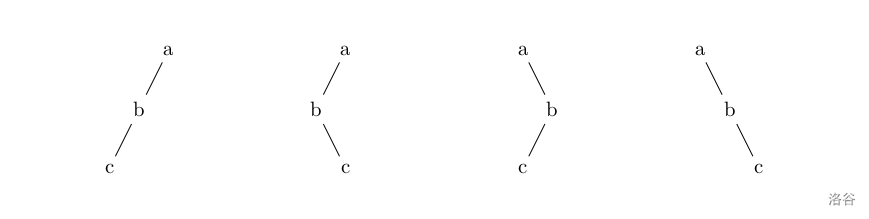

# 初赛知识点选讲

主定理，x序遍历，哈夫曼树

## 哈夫曼编码

前缀编码：要设计长度不等的编码，则必须使任一字符的编码都不是另一个字符的编码的前缀

哈夫曼编码的要求就是它必须符合**前缀编码**的条件。那么我们怎么样来对给定的字符集和概率求出其哈夫曼编码呢？我们可以模拟一下流程：

我们将字符作为节点，并且将概率视为权值。那么我们需要先构建一颗哈夫曼树。


1. 初始化：由给定的n个权值构造m棵只有一个根节点的二叉树，得到一个二叉树集合F。

2. 选取与合并：从二叉树集合$F$ 中选取根节点权值最小的两棵 二叉树分别作为左右子树（通常让更小的在左）构造一棵新的二叉树，这颗新二叉树的根节点的权值为其左、右子树根结点的权值和。

3. 重复2，当集合中只剩下一棵二叉树时，这棵二叉树就是霍夫曼树。

构建完哈夫曼树后，我们将每个节点的左儿子边设为0，右儿子边设为1，然后一个字符的编码就是根节点到它路径上的01串了。

## 取模

取模：a%b的正负取决于a，与b无关。

余数的绝对值在4种情况下是一致的。

```C++
(-11)%5 -> -1 
11%5 -> 1 
11%(-5) -> 1 
(-11)%(-5) -> -1 
```

同样，除法运算的结果的绝对值也是一致的。

```C++
(-11)/5 -> -2 
11/5 -> 2 
11/(-5) -> -2 
(-11)/(-5) -> 2 
```

但是注意，右移均为向下取整，除法均为向0取整

```C++
(-11)>>1 -> -6 
-11>>1 -> -6  //  +-*/的优先级高于位运算
(-11)/2 -> -5 
```

## 时间复杂度

时间复杂度的递推计算：通过递推关系分析算法运行时间的增长趋势。

### 主定理

- 二分查找
$T(n)= T(\frac{n}{2})+ \Theta(1)$
分析：$a = 1, b = 2, f(n) = \Theta(1), $基准函数$\Theta\left(n^{log_{b}a}\right)=\Theta(1)$，所以$T(n)=\Theta(logn); $


- 归并排序
$T(n)= 2T(\frac{n}{2})+ \Theta(n)$
分析：$a = b = 2, f(n) = \Theta(n),$基准函数$\Theta\left(n^{log_{b}2}\right)=\Theta(n)$,所以$T(n)=\Theta(nlogn)$


- 二叉树遍历
$T(n)= 2T(\frac{n}{2})+ O(1)$
分析：$a = b = 2, f(n) = O(1),$基准函数$\Theta\left(n^{log_{b}2}\right)=\Theta(n)$ ,所以$T(n)=\Theta(n^{log_{b}a})=\Theta(n)$


方法：我们看常数项（$\Theta(k)$）执行几次即可。

## 原码 反码 补码

正数三码相同：正数的原码、反码、补码相同；

负数的补码是反码+1。

负数的反码：除符号位以外的所有位取反。

## X缀表达式

### 前缀表达式

前缀表达式又称**波兰式**，前缀表达式的运算符位于操作数之前

对前缀表达式进行**从右至左**依次扫描

- 当遇到数字时，将数字压入堆栈

- 遇到运算符时，弹出栈顶的两个数，用运算符对它们做相应的计算（**栈顶**元素 op **次顶**元素），并将结果入栈

重复上述过程直到表达式最左端，最后运算得出的值即为表达式的结果

- / a b→a/b

- 对前缀表达式进行**从右至左**依次扫描

    - 当遇到数字时，将数字压入堆栈

    - 遇到运算符时，弹出栈顶的两个数，用运算符对它们做相应的计算（**栈顶**元素 op **次顶**元素），并将结果入栈

- 重复上述过程直到表达式最左端，最后运算得出的值即为表达式的结果

### 后缀表达式

后缀表达式又称**逆波兰表达式，**与前缀表达式相似，只是运算符位于操作数之后。注意后缀表达式**不是前缀表达式的翻转**！

先从左到右依次入栈

- 当是数字的时候直接入栈

- 当是运算符号的时候，就将栈的最上面两个数拿出进行运算 后 再将结果进栈 记住（栈顶元素永远在运算符号的右边）

- a b / → a/b

### **中缀表达式**

就是四则运算表达式。

### 中缀表达式转前缀表达式

1. 初始化两个栈:运算符栈s1，储存中间结果的栈s2

2. 从右至左扫描中缀表达式

3. 遇到操作数时，将其压入s2

4. 遇到运算符时，比较其与s1栈顶运算符的优先级

    5. 如果s1为空，或栈顶运算符为右括号“)”，则直接将此运算符入栈

    6. 否则，若优先级比栈顶运算符的较高或相等，也将运算符压入s1

    7. 否则，将s1栈顶的运算符弹出并压入到s2中，再次转到(4-1)与s1中新的栈顶运算符相比较

8. 遇到括号时

    9. 如果是右括号“)”，则直接压入s1

    10. 如果是左括号“(”，则依次弹出S1栈顶的运算符，并压入S2，直到遇到右括号为止，此时将这一对括号丢弃

11. 重复步骤2至5，直到表达式的最左边

12. 将s1中剩余的运算符依次弹出并压入s2

13. 依次弹出s2中的元素并输出，结果即为中缀表达式对应的前缀表达式

## X序遍历

记忆方法：有三个元素，根，左，右。前中后代表根在三者中的位置。

- 前序(根左右)（即点在第一次访问到时记录，【输出|左|右】）

- 中序(左根右)（即点在左子树回溯后记录，【左|输出|右】）

- 后序(左右根)（即点在回溯时记录，【左|右|输出】）

前序就是dfs序。

### 遍历问题

我们都很熟悉二叉树的前序、中序、后序遍历，在数据结构中常提出这样的问题：已知一棵二叉树的前序和中序遍历，求它的后序遍历，相应的，已知一棵二叉树的后序遍历和中序遍历序列你也能求出它的前序遍历。然而给定一棵二叉树的前序和后序遍历，你却不能确定其中序遍历序列，考虑如下图中的几棵二叉树：



所有这些二叉树都有着相同的前序遍历和后序遍历，但中序遍历却不相同。

共两行，第一行表示该二叉树的前序遍历结果 $s_1$，第二行表示该二叉树的后序遍历结果 $s_2$。

保证至少存在一棵二叉树满足给出的信息，$s _ 1, s _ 2$ 中只含小写字母，且在某个字符串中不存在相同的字母。

输出可能的中序遍历序列的总数，结果不超过 $2^{63}-1$。

---

我们发现只有一个儿子 的节点 才会在知道 前序后序 的情况下有不同的中序遍历，所以将题目转化成找 只有一个儿子的节点个数。

可以很容易的找出这类节点在前序后序中出现的规律。（前序中出现AB，后序中出现BA，则这个节点只有一个儿子）

每个这类节点有两种中序遍历（及儿子在左，儿子在右）根据乘法原理中序遍历数为 2^节点个数 种

## 对象与类

int这些是类，被定义的变量是对象。

在编程语言中，**类（Class）** 是一种用于创建对象的模板，其中**对象（Object）** 就是根据这个模板创建的实例。

1. **类（Class）**：指的是像 `int` 这样的内置类型，它们可以作为创建特定类型对象的蓝图。例如，`int` 是整数类型的类。

2. **对象（Object）**：指的是类的具体实例。当您使用 `int` 定义一个变量时，比如 `num = 10`，这里的 `num` 就是一个整数类型的对象，它是 `int` 类的一个实例。
所以，您的说法是正确的。"int这些是类"意味着 `int` 是一个类或者类型，而"被定义的变量是对象"则表示任何定义为整型的变量都是 `int` 类的对象。

## Linux常见命令

1. ls：列出当前目录中的**文件和子目录**

2. pwd：显示当前工作目录的**路径**（和ls区分）

3. cd：切换工作目录

    cd /path/to/directory

1. mkdir：创建新目录

    mkdir directory_name

1. rm：删除文件或目录

    rm file_name

    rm -r directory_name  # 递归删除目录及其内容

1. 编译

    在命令行下输入 `g++ a.cpp` 就可以编译 `a.cpp` 这个文件了

    编译过程中可以加入一些编译选项：

    - `-o <文件名>`：指定编译器输出可执行文件的文件名。

    ```C++
    g++ a.cpp -o a
    ```

    可以理解为 `-o <name>` 是一整个选项，这个放在g++后的任何位置都可以。


