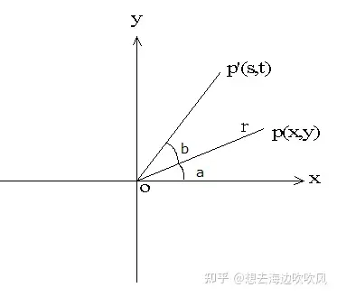
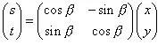
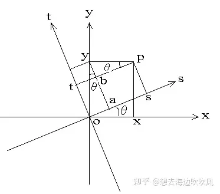
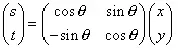

# 坐标旋转变换公式的推导

目录

收起

1．围绕原点的旋转

2．坐标系的旋转

坐标旋转分为两种情况，一种是同一坐标系中，点p经过旋转一定角度到p'，另一种是坐标系旋转一定角度，在xoy坐标系中点p在旋转后在x'oy'坐标系中。

## 1．围绕原点的旋转

如下图， 在2维坐标上，有一点p(x, y) , 直线opの长度为r, 直线op和x轴的正向的夹角为a。 直线op围绕原点做逆时针方向b度的旋转，到达p’ (s,t)

点p旋转到p&#39;

s = r*cos(a + b) = r*cos(a)cos(b) – r*sin(a)sin(b) (1.1)
t = r *sin(a + b) = r*sin(a)cos(b) + r*cos(a) sin(b) (1.2)
其中 x = r*cos(a) , y = r*sin(a)
代入(1.1), (1.2) ,
s = x*cos(b) – y*sin(b) (1.3)
t = x*sin(b) + y*cos(b) (1.4)

用[行列式](https://zhida.zhihu.com/search?q=%E8%A1%8C%E5%88%97%E5%BC%8F&zhida_source=entity&is_preview=1)表达如下：

## 2．坐标系的旋转

在原坐标系xoy中, 绕原点沿逆时针方向旋转theta度， 变成座标系 sot。

设有某点p，在原坐标系中的坐标为 (x, y), 旋转后的新坐标为(s, t)。

xoy坐标系旋转θ到sot坐标系

oa = y*sin(theta) (2.1)
as = x*cos(theta) (2.2)
综合(2.1)，(2.2) 2式
s = os = oa + as = x*cos(theta) + y*sin(theta)
t = ot = ay – by = y*cos(theta) – x*sin(theta)

用行列式表达如下：

参考资料：

