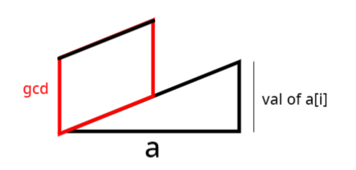

# 数学定理

## 费马小定理

假如 a 是一个整数， p 是一个质数，那么 $a^ {p}-a$ 是 p 的倍数，也可以表示为 $a^ {p} \equiv a (\mod p)$ 。

如果 a 不是 p 的倍数的话，则 $a^ {p-1} \equiv 1 (\mod p)$ 。

## Lucas定理

卢卡斯（Lucas）定理
$ C_{ n }^{ m }\equiv C_{ n/p }^{ m/p }.C_{ n\mod p }^{ m\mod p }( mod\  p)$, 其中p为质数。

## 威尔逊定理

$(p-1)! \equiv -1\pmod  p$ 是 p 为素数 的 充分必要条件。

### 例题 #1 YAPTCHA

求出下列式子的答案


其中[x]为对x向下取整

100%的数据：T≤10^3，1≤n≤10^6

对于每一组询问，输出答案。

---

对威尔逊定理进行变形，得到若p为质数，则$(p-1)!+1==0\pmod p$，此时求和式的第一项整除，否则不能整除。如果可以整除，那么第二项就比第一项小1.否则在整数部分两部分相同，又因为最外层有一个向下取整，所以此时值为0.

因此就是要我们求 1\sim n中又多少个k满足3k+7为质数。

## 欧拉定理


### 欧拉定理

若 $\gcd(a, m) = 1$，则 $a^{\varphi(m)} \equiv 1 \pmod{m}$。

是不是看着非常抽象？

### 例题 #1 The Luckiest Number

**【题目描述】**

中国人认为“8”是幸运数字。Bob 也喜欢数字“8”。此外，Bob 有自己的幸运数字 $L$。现在，他想构造出自己的最幸运的数字，即所有仅由数字“8”组成且是 $L$ 的倍数的正整数中的最小值。

**【输入格式】**

多个测试用例组成。每个测试用例包含一行，其中包含 $L$（$1 ≤ L ≤ 2,000,000,000$）。

最后一个测试用例后跟着一行，其中包含零。

**【输出格式】**

对于每个测试用例，输出一行，包含测试用例编号（从 $1$ 开始），后跟一个整数，该整数是 Bob 最幸运的数字的长度。如果 Bob 无法构造他最幸运的数字，则输出零。翻译来自于：[ChatGPT](https://chatgpt.com/)

---

我们发现我们要直到长度最短的连续的8，使得这个数n是m的倍数。

那么如果n是某个数字的次幂-1，那么我们就想到了一个定理：欧拉定理。

欧拉定理就联系起了一个数的次幂和它是哪个数的倍数的关系。

那么我们可以写作$n=k^\varphi(m)-1\equiv 0\pmod m$。

但是事实上我们发现n大多数情况下都不是摸个数的次幂-1，但是我们可以吧n分成含有某个数字的次幂的形式。

我们定义n(i)为i个8连接起来的数字，那么有$n(i)=\frac{10^i-1}{9}\times 8$。因此我们有

$n(i)+1=\frac{10^i-1}{9}\times 8+1\equiv 1\pmod m\\{10^i-1}\equiv 0\pmod m$

因此i显然等于\varphi(m)。注意要判断无解。


其实上面的有一点问题，比如说n(1)就不会出现在答案中。这是因为我们要求乘了8后是m的倍数，所以分数部分只需要是m/\gcd(m,8)即可。

那么那个\div 9就不用管了吗？事实上是要的！也许有人会在这里有疑惑，那么我们就这样来想：如果不考虑这个9，那么我们最后得出来的答案不是9的倍数怎么办？

因此最后我们的模数变为了$\frac{9m}{\gcd(8,m)}$


但是注意，我们通过欧拉定理求出来的只不过是一个可行解。要得到最小的解，我们有如下引理

若 a,n 互质，则满足 $a^x≡1 \pmod n$ 的最小正整数解为 φ(n) 的约数。

枚举即可。

```C++
/*                                                                                
                      Keyblinds Guide
     				###################
      @Ntsc 2024

      - Ctrl+Alt+G then P : Enter luogu problem details
      - Ctrl+Alt+B : Run all cases in CPH
      - ctrl+D : choose this and dump to the next
      - ctrl+Shift+L : choose all like this
      - ctrl+K then ctrl+W: close all
      - Alt+la/ra : move mouse to pre/nxt pos'
	  
*/
#include <bits/stdc++.h>
#include <queue>
using namespace std;

#define rep(i, l, r) for (int i = l, END##i = r; i <= END##i; ++i)
#define per(i, r, l) for (int i = r, END##i = l; i >= END##i; --i)
#define pb push_back
#define mp make_pair
#define int long long
#define ull unsigned long long
#define pii pair<int, int>
#define ps second
#define pf first

// #define innt int
#define itn int
// #define inr intw
// #define mian main
// #define iont int

#define rd read()
int read(){
    int xx = 0, ff = 1;
    char ch = getchar();
    while (ch < '0' || ch > '9') {
		if (ch == '-')
			ff = -1;
		ch = getchar();
    }
    while (ch >= '0' && ch <= '9')
      xx = xx * 10 + (ch - '0'), ch = getchar();
    return xx * ff;
}
void write(int out) {
	if (out < 0)
		putchar('-'), out = -out;
	if (out > 9)
		write(out / 10);
	putchar(out % 10 + '0');
}

#define ell dbg('\n')
const char el='\n';
const bool enable_dbg = 1;
template <typename T,typename... Args>
void dbg(T s,Args... args) {
	if constexpr (enable_dbg){
    cerr << s;
    if(1)cerr<<' ';
		if constexpr (sizeof...(Args))
			dbg(args...);
	}
}

#define zerol = 1
#ifdef zerol
#define cdbg(x...) do { cerr << #x << " -> "; err(x); } while (0)
void err() { cerr << endl; }
template<template<typename...> class T, typename t, typename... A>
void err(T<t> a, A... x) { for (auto v: a) cerr << v << ' '; err(x...); }
template<typename T, typename... A>
void err(T a, A... x) { cerr << a << ' '; err(x...); }
#else
#define dbg(...)
#endif


const int N = 5e5 + 5;
const int INF = 1e9;
const int M = 1e7;
const int MOD = 1e9 + 7;


int getPhi(int x){
    int res=x;
    for(int i=2;i*i<=x;i++){
        if(x%i==0){
            res=res/i*(i-1);
            while(x%i==0)x/=i;
        }
    }
    if(x>1)res=res/x*(x-1);
    return res;
}


int TT=0;


inline int ksm(itn a,itn b,int MOD){
	int res=1;
	while(b){
		if(b&1)res=res*a%MOD;
		b>>=1;
		a=a*a%MOD;
	}
	return res;
}

void solve(){
	int n=rd;
	if(n==0)exit(0);
	n=n/__gcd(8ll,n)*9;


	int phi=getPhi(n);
	// cdbg(n,getPhi(n));
	itn ans=INF;

	if(__gcd(10ll,n)!=1){
		printf("Case %lld: %lld\n",++TT,0ll);
		// cdbg("fake");
		return ;
	}


	for(int i=1;i*i<=phi;i++){
		if(phi%i)continue;
		if(ksm(10,i,n)==1%n)ans=min(ans,i);
		if(ksm(10,phi/i,n)==1%n)ans=min(ans,phi/i);
	}
	printf("Case %lld: %lld\n",++TT,ans);
}
signed main() {
    //  freopen("P2619_3.in","r",stdin);
    // freopen("center.out","w",stdout);

    int T=1;
    while(T){
    	solve();
    }
    return 0;
}
```


## 扩展欧拉定理

定义 $a^b \equiv \begin{cases} a^{b \bmod \varphi(m)},                &\gcd(a,m) =  1,                   \\ a^b,                                   &\gcd(a,m)\ne 1, b <   \varphi(m), \\ a^{(b \bmod \varphi(m)) + \varphi(m)}, &\gcd(a,m)\ne 1, b \ge \varphi(m). \end{cases} \pmod m$

欧拉定理：若 $\gcd(a, m) = 1$，则 $a^{\varphi(m)} \equiv 1 \pmod{m}$。

我们把ex欧拉的第一个性质拿出来，即$a^b \equiv a^{b \bmod \varphi(m)}   \pmod m,   \gcd(a,m) =  1$，那么我们知道，我们$a^b \pmod m$的循环节就应该是$\varphi(m)$。所以一个方法就是我们暴力枚举$b=0\sim \varphi(m)$即可。复杂度为 O(m)。

证明

考虑第一条，因为我们有 若$\gcd(a, m) = 1$，则 $a^{\varphi(m)} \equiv 1 \pmod{m}$，所以就有$ a^{b \bmod \varphi(m)}\times (a^{\varphi(m)})^k \equiv a^{b \bmod \varphi(m)},  \gcd(a,m) =  1$，当k取特定值时，a$^{b \bmod \varphi(m)}\times (a^{\varphi(m)})^k$就是$a^b$。

第二条代表幂已经$<\varphi(m)$了，不可以继续降幂。

第三条是什么呢？我们这里感性理解一下

若p_i^{b \bmod \varphi(m)}\equiv p_i^b，那么$(\prod p_i)^{b \bmod \varphi(m)}\equiv\prod p_i^{b \bmod \varphi(m)}\equiv\prod p_i^b\equiv(\prod p_i)^b$。但是这里要求p_i和m互质。

如果a和m不互质呢？那么我们就可以写成$a=\prod p_i$。这里的p_i都是质数，p_i可重复。注意，因为a,m不互质，所以有一些p_i 是m的因数。把与m互质的p_i 提出来就看哟i套用上面的式子，那么怎么样处理因数呢？

请参考下文。

[欧拉定理及扩展（附超易懂证明） - 樱花赞 - 博客园](https://www.cnblogs.com/1024th/p/11349355.html)


### 扩展欧拉定理的应用

给你三个正整数，$a,m,b$，你需要求：$a^b \bmod m$

【数据范围】
对于 $100\%$ 的数据，$1\le a \le 10^9$，$1\le b \le 10^{20000000}，1\le m \le 10^8$。

---

我们首先求出 $\varphi (m)$。对于求一个数字的phi值，我们可以直接根据定义来求解。

然后我们就可以在输入b时顺便对b取模了。注意次数在对phi取模后还要加上一个phi。不是对$2\times \varphi$取模！！

```C++
int getphi(int x)
{
	int ans=1,num=1;
	for(int i=2;i*i<=x;i++)
	{
		if(!(x%i))
		{
			num=i-1,x/=i;
			while(!(x%i)) num=num*i,x/=i;
			ans=num*ans;
		}
	}
	if(x!=1) ans=ans*(x-1);
	return ans;
}

int cal(string s,int MOD){
    int res=0,f=0;
    for(auto c:s){
        // dbg(c);
        res=(res*10+c-'0');
        if(res>=MOD)res%=MOD,f=1;
    }
    if(!f)return res;
    return res+MOD;
}
string s;
void solve(){
    a=rd,MOD=rd;
    cin>>s;
    int b=cal(s,getphi(MOD));

    cout<<ksm(a,b)<<endl;
}


signed main() {
    int T=1;
    while(T--){
    	solve();
    }
    return 0;
}
```

## 裴蜀定理

对于不定方程 $ ax+by=m$, 其有解的充要条件为$\gcd(a,b)|m$

## 中国剩余定理



## 向量的运算

以下是向量运算的一些基本概念：

1. **向量的加法和减法**：

    - **加法**：两个向量相加，就是将它们对应的坐标相加。如果向量a和向量b都是n维向量，那么它们的和向量c的第i个分量是a的第i个分量加上b的第i个分量。

    - **减法**：向量减法可以看作是向量加法的逆运算，即向量a减去向量b等于向量a加上向量b的相反向量。

1. **向量的数乘**：

    - **标量乘法**：一个标量与一个向量相乘，就是将这个标量乘以向量的每个分量。

    - **向量数乘**：一个向量与一个标量相乘，得到的结果是一个新向量，新向量的每个分量都是原向量对应分量的标量乘积。

1. **向量的点乘**：

    - **点乘**：两个向量a和b的点乘，其结果是一个标量，等于这两个向量的对应分量相乘

## 综合练习

[SDOI2010] 古代猪文

iPig 在大肥猪学校图书馆中查阅资料，得知远古时期猪文文字总个数为 $n$。当然，一种语言如果字数很多，字典也相应会很大。当时的猪王国国王考虑到如果修一本字典，规模有可能远远超过康熙字典，花费的猪力、物力将难以估量。故考虑再三没有进行这一项劳猪伤财之举。当然，猪王国的文字后来随着历史变迁逐渐进行了简化，去掉了一些不常用的字。

iPig 打算研究古时某个朝代的猪文文字。根据相关文献记载，那个朝代流传的猪文文字恰好为远古时期的 $1/k$，其中 $k$ 是 $n$ 的一个正约数（可以是 $1$ 或 $n$）。不过具体是哪 $1/k$，以及 $k$ 是多少，由于历史过于久远，已经无从考证了。

iPig 觉得只要符合文献，每一种 $k|n$ 都是有可能的。他打算考虑到所有可能的 $k$。显然当 $k$ 等于某个定值时，该朝的猪文文字个数为 $n/k$。然而从 $n$ 个文字中保留下 $n/k$ 个的情况也是相当多的。iPig 预计，如果所有可能的 $k$ 的所有情况数加起来为 $p$ 的话，那么他研究古代文字的代价将会是 $g^p$。

现在他想知道猪王国研究古代文字的代价是多少。由于 iPig 觉得这个数字可能是天文数字，所以你只需要告诉他答案除以 $999911659$ 的余数就可以了。

输入格式

一行两个正整数 $n,g$。

输出格式

输出一行一个整数表示答案。

- 对于 $100\%$ 的数据，$1\le n,g \le 10^9$。

---

首先用形式化的语言表述处我们要求的是什么

$g^{\sum_{k|n}C(n,n/k)}\bmod {999911659}$

如果我们直接求p，我们发现无论用什么方法都难以解决C(n,m)，n,m都在10^9的世界范围且模数也很大的问题。所以我们考虑从整体入手。

我们注意到p本身也很大，所以我们考虑将p缩小一下。考虑扩展欧拉定理，因为模数和g互质，所以$g^{\sum_{k|n}C(n,n/k)}\bmod {999911659}=g^{\sum_{k|n}C(n,n/k)\bmod {999911658}}\bmod {999911659}$

欧拉定理：
a,m互质时，$a^b\equiv a^{b\bmod m-1}\pmod {m}$

现在我们再来求p，发现还是横棘手，所以我们考虑将模数缩小

那么怎么样缩小呢？我们999911658=2×3×4679×35617，然后再这4给模数下分别求出C。于是问题变成了：我们知道x在4个两两互质的模数下的余数，求最小的x（即求x在将4个模数的积作为模数的意义下的唯一解。）

很明显可以使用crt来写。

CRT
给定模数两两互质的同余方程组x\equiv a_i\pmod b_i，答案为$\sum a_i\times B/b_i\times (B/b_i)^{-1}$在\bmod b_i意义下。$B=\prod b_i$

其中，为了求$(B/b_i)^{-1}$在$\bmod b_i$意义下，我们注意到$b_i$不一定是质数，所以我们有可以列出同余方程

$(B/b_i)^{-1}\times (B/b_i)+b_iy= 1$

形式同xa+by=1。又因为这里的gcd(a,b)=1（即$\gcd(B/b_i,b_i)$），所以恰好是$xa+by=\gcd(a,b)$的形式。

我们可以直接使用exgcd求解

exGCD
$ax+by=\gcd(a,b)=\gcd(b,a\bmod b)=bx'+(a-b[a/b])y'=ay'+b(x'-[a/b]y')$
得到回溯式$x=y',y=(x'-[a/b]y')$


至于在那4个模数意义下求C，我们用Lucas定理

卢卡斯（Lucas）定理
$ C_{ n }^{ m }\equiv C_{ n/p }^{ m/p }C_{ n\mod p }^{ m\mod p }( mod\  p)$, 其中p为质数。
其中C_{ n/p }^{ m/p }可以递归计算，另外一个直接计算即可。

注意在计算$C_n^m$时，inv不可以预处理。因为模数<预处理数的最大值，所以预处理的inv的某个前缀会全变成0，是错误的。应该实时用快速幂（费马小定理）计算。

费马小定理
$i^{p-1}\equiv 1\pmod p$，两边同时除去一个i得到i的逆元，为$i^{p-2}$

因此我们就可以计算了。

```C++
/*                                                                                
                      Keyblinds Guide
     				###################
      @Ntsc 2024

      - Ctrl+Alt+G then P : Enter luogu problem details
      - Ctrl+Alt+B : Run all cases in CPH
      - ctrl+D : choose this and dump to the next
      - ctrl+Shift+L : choose all like this
      - ctrl+K then ctrl+W: close all
      - Alt+la/ra : move mouse to pre/nxt pos'
	  
*/
#include <bits/stdc++.h>
#include <queue>
using namespace std;

#define rep(i, l, r) for (int i = l, END##i = r; i <= END##i; ++i)
#define per(i, r, l) for (int i = r, END##i = l; i >= END##i; --i)
#define pb push_back
#define mp make_pair
#define int long long
#define ull unsigned long long
#define pii pair<int, int>
#define ps second
#define pf first

// #define innt int
#define itn int
// #define inr intw
// #define mian main
// #define iont int

#define rd read()
int read(){
    int xx = 0, ff = 1;
    char ch = getchar();
    while (ch < '0' || ch > '9') {
		if (ch == '-')
			ff = -1;
		ch = getchar();
    }
    while (ch >= '0' && ch <= '9')
      xx = xx * 10 + (ch - '0'), ch = getchar();
    return xx * ff;
}
void write(int out) {
	if (out < 0)
		putchar('-'), out = -out;
	if (out > 9)
		write(out / 10);
	putchar(out % 10 + '0');
}

#define ell dbg('\n')
const char el='\n';
const bool enable_dbg = 1;
template <typename T,typename... Args>
void dbg(T s,Args... args) {
	if constexpr (enable_dbg){
    cerr << s;
    if(1)cerr<<' ';
		if constexpr (sizeof...(Args))
			dbg(args...);
	}
}

#define zerol = 1
#ifdef zerol
#define cdbg(x...) do { cerr << #x << " -> "; err(x); } while (0)
void err() { cerr << endl; }
template<template<typename...> class T, typename t, typename... A>
void err(T<t> a, A... x) { for (auto v: a) cerr << v << ' '; err(x...); }
template<typename T, typename... A>
void err(T a, A... x) { cerr << a << ' '; err(x...); }
#else
#define dbg(...)
#endif


const int N = 3e5 + 5;
const int INF = 1e18;
const int M = 1e7;
const int MOD =999911659;

int b[5]={0,2,3,4679,35617};
int a[5];

int fac[6][N],inv[6][N];

int ksm(int a,int b,int p){
    int res=1;
    while(b){
        if(b&1)res=res*a%p;
        b>>=1;
        a=a*a%p;
    }
    return res;
}


void init(){


    for(int k=1;k<=4;k++){
        fac[k][0]=1;
        for(int i=1;i<N;i++){
            fac[k][i]=fac[k][i-1]*i%b[k];
        }
        //  inv[k][N-1]=ksm(fac[k][N-1],b[k]-2,b[k]);
        // for(int i=N-1;i;i--){
        //     inv[k][i-1]=inv[k][i]*i%b[k];
        // }

    }
}


int C(int a,int b,int P,int i){
    if(a<b)return 0;
    int s=fac[i][a]*ksm(fac[i][b],P-2,P)%P*ksm(fac[i][a-b],P-2,P)%P;
    // cdbg(a,b,P,s,fac[i][a],inv[i][b],inv[i][a-b]);
    return s;
}

itn lucas(int n,int m,int P, int i){
    // cdbg("lc",n,m,P);
    if(m==0)return 1;
    return lucas(n/P,m/P,P,i)*C(n%P,m%P,P,i)%P;
}


itn x,y;

int exgcd(int a,int b,int &x,int &y){
    if(b==0){
        x=1,y=0;
        return a;
    }
    int t=exgcd(b,a%b,x,y);
    int tx=x,ty=y;
    x=ty;
    y=tx-(a/b)*ty;
    return t;
}


int c[6],d[6];

int calC(int n,int m){
    // cdbg("calC",n,m);
    for(int i=1;i<=4;i++){
        a[i]=lucas(n,m,b[i],i);
        // cdbg(a[i]);
    }

    for(int i=1;i<=4;i++){

        d[i]=(MOD-1)/b[i];

        exgcd(d[i],b[i],x,y);
        c[i]=d[i]*x;
    }

    int res=0;
    for(int i=1;i<=4;i++){
        res+=c[i]*a[i]%(MOD-1);
        res=(res%(MOD-1)+(MOD-1))%(MOD-1);
    }

    // cdbg("C",n,m,res);

    return res;
}

void solve(){

    init();
    int p=0;

    int n=rd,g=rd;
    if(g%MOD==0){
        cout<<0<<endl;
        return ;
    }

    for(itn i=1;i*i<=n;i++){
        // cdbg(i);
        if(n%i)continue;
        p+=calC(n,n/i);
        p%=MOD-1;
        if(i*i==n)continue;
        p+=calC(n,i);
        p%=MOD-1;
        p=(p%(MOD-1)+(MOD-1))%(MOD-1);
    }

    // cdbg("OK",g,p);


    cout<<ksm(g,p,MOD)<<endl;
}

signed main() {
    // freopen(".in","r",stdin);
    // freopen(".in","w",stdout);

    int T=1;
    while(T--){
    	solve();
    }
    return 0;
}
```

