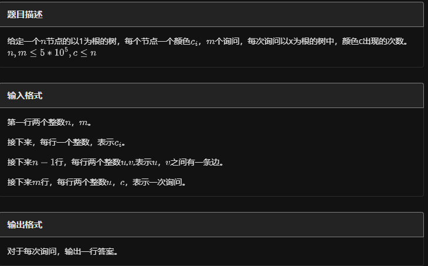

# 树上dsu（树上启发式合并）

## 定义

树上DSU（Disjoint Set Union）是一种数据结构，它是在并查集（DSU）的基础上，结合了树的结构特点而形成的一种高级数据结构。它主要用于处理一些与树结构相关的动态连通性问题，例如网络流中的最小割、最大流问题，以及处理一些图论中的动态问题。

在普通的并查集（DSU）中，我们通常使用一个数组来维护元素之间的连通性，并提供以下基本操作：

1. **查找（Find）**：确定某个元素所在的集合。

2. **合并（Union）**：将两个元素所在的集合合并成一个。
而在树上DSU中，除了上述操作外，还可以维护一些与树结构相关的信息，如：

- **树的父亲**：每个节点在树中的父亲节点。

- **树的大小**：以某个节点为根的子树的大小。

- **重儿子**：每个节点重儿子（即具有最大子树大小的儿子）。
树上DSU通常可以处理以下问题：

- 求解动态树中的最近公共祖先（LCA）。

- 维护树链剖分的信息。

- 动态维护树的结构变化，如链接和切割操作。

    树上DSU的优势在于它能够高效地处理树结构的动态变化，是解决某些复杂树相关问题的有力工具。在一些高级算法竞赛或者数据结构的深入研究领域，树上DSU是一种非常受欢迎和有效的数据结构。

## 算法流程

我们用$cnt_i$表示颜色$i$的出现次数，$ans_u$表示结点$u$的答案。
遍历一个节点$u$，我们按以下的步骤进行遍历：
1.先遍历$u$的轻（非重）儿子，并计算答案，但不保留遍历后它对$cnt$数组的影响；（我们在dfs传入参数时传入一个bool:save，如果save=0，则在要退出当前函数空间时遍历子树x，删除所有节点的cnt计数）
2.遍历它的重儿子，保留它对$cnt$数组的影响；
3.再次遍历$u$的轻儿子的子树结点，加入这些结点的贡献，以得到$u$的答案。

## 例题 #1 Tree and Queries

题面翻译

- 给定一棵 $n$ 个节点的树，根节点为 $1$。每个节点上有一个颜色 $c_i$。$m$ 次操作。操作有一种：

    1. `u k`：询问在以 $u$ 为根的子树中，出现次数 $\ge k$ 的颜色有多少种。

- $2\le n\le 10^5$，$1\le m\le 10^5$，$1\le c_i,k\le 10^5$。

## 例题 #2



---

```C++


/*
                      Keyblinds Guide
     				###################
      @Ntsc 2024

      - Ctrl+Alt+G then P : Enter luogu problem details
      - Ctrl+Alt+B : Run all cases in CPH
      - ctrl+D : choose this and dump to the next
      - ctrl+Shift+L : choose all like this
      - ctrl+K then ctrl+W: close all
      - Alt+la/ra : move mouse to pre/nxt pos'

*/
#include <bits/stdc++.h>
#include <queue>
using namespace std;

#define rep(i, l, r) for (int i = l, END##i = r; i <= END##i; ++i)
#define per(i, r, l) for (int i = r, END##i = l; i >= END##i; --i)
#define pb push_back
#define mp make_pair
//#define int long long
#define pii pair<int, int>
#define ps second
#define pf first
#define ull unsigned long long

#define itn int
// #define inr int
// #define mian main
// #define iont int

#define rd read()
int read(){
    int xx = 0, ff = 1;
    char ch = getchar();
    while (ch < '0' || ch > '9') {
		if (ch == '-')
			ff = -1;
		ch = getchar();
    }
    while (ch >= '0' && ch <= '9')
      xx = xx * 10 + (ch - '0'), ch = getchar();
    return xx * ff;
}
void write(int out) {
	if (out < 0)
		putchar('-'), out = -out;
	if (out > 9)
		write(out / 10);
	putchar(out % 10 + '0');
}

#define ell dbg('\n')
const char el='\n';
const bool enable_dbg = 1;
template <typename T,typename... Args>
void dbg(T s,Args... args) {
	if constexpr (enable_dbg){
    if(1)cerr<<' ';
    cerr << s;
		if constexpr (sizeof...(Args))
			dbg(args...);
	}
}

#define zerol = 1
#ifdef zerol
#define cdbg(x...) do { cerr << #x << " -> "; err(x); } while (0)
void err() { cerr << endl; }
template<template<typename...> class T, typename t, typename... A>
void err(T<t> a, A... x) { for (auto v: a) cerr << v << ' '; err(x...); }
template<typename T, typename... A>
void err(T a, A... x) { cerr << a << ' '; err(x...); }
#else
#define dbg(...)
#endif


const int N = 5e5 + 5;
const int INF = 1e18;
const int M = 1e7;
const int MOD = 1e9 + 7;

struct _query{
	int c,id;
};

vector<_query> q[N];
vector<int> e[N];

void add(int x,int y){
	e[x].pb(y);
	e[y].pb(x);
}


int dfn[N],_dfn[N],rdfn[N],sz[N],son[N];
int tim;
int cnt[N];
int c[N];
int cntq[N];
int ans[N];


void dfs(int x,int fa){
	sz[x]=1;
	dfn[x]=++tim;
	
	_dfn[tim]=x;
	for(auto v:e[x]){
		if(v==fa)continue;
		dfs(v,x);
		if(!son[x]||sz[son[x]]<sz[v])son[x]=v;
		sz[x]+=sz[v];
	}
	
	
	rdfn[x]=tim;
}

void addval(itn x){
	cnt[c[x]]++;
}

void delval(int x){
	cnt[c[x]]--;
}

void dfs2(int x,int fa,int save){
	
	for(auto v:e[x]){
		if(v==fa)continue;
		if(v==son[x])continue;
		
		dfs2(v,x,0);
	}
//	memset(cnt,0,sizeof cnt);
	if(son[x])
		dfs2(son[x],x,1);
		
	for(auto v:e[x]){
		if(v==fa||v==son[x])continue;
		for(int i=dfn[v];i<=rdfn[v];i++){
			addval(_dfn[i]);
		}
	}
	
	addval(x);//!!!
	
	for(auto qq:q[x]){
		ans[qq.id]=cnt[qq.c];
	}
	
	if(!save){
		
		for(int i=dfn[x];i<=rdfn[x];i++){//!!
			delval(_dfn[i]);
		}
		
	}
	
	
}


void solve(){
	int n=rd,m=rd;
	for(int i=1;i<=n;i++){
		c[i]=rd;
	}
	for(int i=1;i<n;i++){
		add(rd,rd);
	}
	
	for(int i=1;i<=m;i++){
		int u=rd;
		int c=rd;
		q[u].pb({c,i});
	}
	
	
	dfs(1,0);
	dfs2(1,0,0);
	
	for(int i=1;i<=m;i++){
		cout<<ans[i]<<endl;
	}
	
}

signed main() {
    // freopen(".in","r",stdin);
    // freopen(".in","w",stdout);

    int T=1;
    while(T--){
    	
    	solve();
    }
    return 0;
}
```

