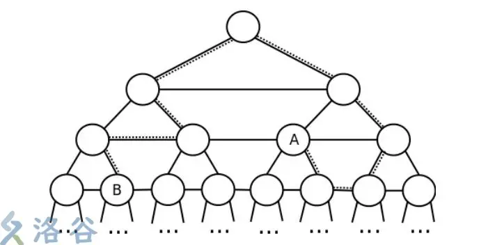

# 树的相关性质


## 树的直径


给定一棵 $n$ 个结点的树，树没有边权。请求出树的直径是多少，即树上的最长路径长度是多少。

数据保证，$1 \leq n \leq 10^5$。

---

定理：在一棵树上，从任意节点 $y$ 开始进行一次DFS，到达的距离其最远的节点$z$必为直径的一端。

于是我们只需要两次dfs即可解决问题。

该做法不适合有负权边的树。

```C++

vector<int > e[N];

void add(itn a,itn b){
    e[a].pb(b);
    e[b].pb(a);
}
itn d[N];

itn ansl=0;
int ansr=0;

void dfs(int x,int f){
    d[x]=d[f]+1;
    if(d[x]>d[ansl])ansl=x;
    for(auto v:e[x]){
        if(v==f)continue;
        dfs(v,x);
    }
}


void dfs2(int x,int f){
    d[x]=d[f]+1;
    if(d[x]>d[ansr])ansr=x;
    for(auto v:e[x]){
        if(v==f)continue;
        dfs2(v,x);
    }
}

void solve(){
    itn n=rd;
    for(itn i=1;i<n;i++){
        add(rd,rd);
    }
    dfs(1,0);
    memset(d,0,sizeof d);
    dfs2(ansl,0);

    cout<<d[ansr]-1<<endl;
}
```

## 树的重心

如果在树中选择某个节点并删除，这棵树将分为若干棵子树，统计子树节点数并记录最大值。取遍树上所有节点，使此最大值取到最小的节点被称为整个树的重心。

求法：

根据定义，我们一次dfs，逐个点判断是否当选为重心即可。考虑$sz_v$和 $n-sz_x$。

### 例题 #1 [NOI2003] 逃学的小孩

题目描述

Chris 家的电话铃响起了，里面传出了 Chris 的老师焦急的声音：“喂，是 Chris 的家长吗？你们的孩子又没来上课，不想参加考试了吗？”一听说要考试，Chris 的父母就心急如焚，他们决定在尽量短的时间内找到 Chris。他们告诉 Chris 的老师：“根据以往的经验，Chris 现在必然躲在朋友 Shermie 或 Yashiro 家里偷玩《拳皇》游戏。现在，我们就从家出发去找 Chris，一旦找到，我们立刻给您打电话。”说完砰的一声把电话挂了。

Chris 居住的城市由 $N$ 个居住点和若干条连接居住点的双向街道组成，经过街道 $x$ 需花费 $T_{x}$ 分钟。可以保证，任意两个居住点间有且仅有一条通路。Chris 家在点 $C$，Shermie 和 Yashiro 分别住在点 $A$ 和点 $B$。Chris 的老师和 Chris 的父母都有城市地图，但 Chris 的父母知道点 $A$、$B$、$C$ 的具体位置而 Chris 的老师不知。

为了尽快找到 Chris，Chris 的父母会遵守以下两条规则：

1. 如果 $A$ 距离 $C$ 比 $B$ 距离 $C$ 近，那么 Chris 的父母先去 Shermie 家寻找 Chris，如果找不到，Chris 的父母再去 Yashiro 家；反之亦然。

2. Chris 的父母总沿着两点间唯一的通路行走。

显然，Chris 的老师知道 Chris 的父母在寻找 Chris 的过程中会遵守以上两条规则，但由于他并不知道 $A$、$B$、$C$ 的具体位置，所以现在他希望你告诉他，最坏情况下 Chris的父母要耗费多长时间才能找到 Chris？

输入格式

输入文件第一行是两个整数 $N$ 和 $M$，分别表示居住点总数和街道总数。

以下 $M$ 行，每行给出一条街道的信息。第 $i+1$ 行包含整数 $U_{i}$、$V_{i}$、$T_{i}$，表示街道 $i$ 连接居住点 $U_{i}$ 和 $V_{i}$，并且经过街道 $i$ 需花费 $T_{i}$ 分钟。街道信息不会重复给出。

输出格式

输出文件仅包含整数 $T$，即最坏情况下 Chris 的父母需要花费 $T$ 分钟才能找到 Chris。

对于 $100\%$ 的数据，$3 \le N \le 2\times 10^5$，$1 \le U_{i},V_{i} \le N$，$1 \le T_{i} \le 10^{9}$。

---

贪心的思路：找直径，直径端点为A,B,枚举C点则答案为max(min(dis[A][k],dis[B][k])+dis[A][B])

```C++
/*                                                                                
                      Keyblinds Guide
     				###################
      @Ntsc 2024

      - Ctrl+Alt+G then P : Enter luogu problem details
      - Ctrl+Alt+B : Run all cases in CPH
      - ctrl+D : choose this and dump to the next
      - ctrl+Shift+L : choose all like this
      - ctrl+K then ctrl+W: close all
      - Alt+la/ra : move mouse to pre/nxt pos'
	  
*/
#include <bits/stdc++.h>
#include <queue>
using namespace std;

#define rep(i, l, r) for (int i = l, END##i = r; i <= END##i; ++i)
#define per(i, r, l) for (int i = r, END##i = l; i >= END##i; --i)
#define pb push_back
#define mp make_pair
#define int long long
#define ull unsigned long long
#define pii pair<int, int>
#define ps second
#define pf first

// #define innt int
#define itn int
// #define inr intw
// #define mian main
// #define iont int

#define rd read()
int read(){
    int xx = 0, ff = 1;
    char ch = getchar();
    while (ch < '0' || ch > '9') {
		if (ch == '-')
			ff = -1;
		ch = getchar();
    }
    while (ch >= '0' && ch <= '9')
      xx = xx * 10 + (ch - '0'), ch = getchar();
    return xx * ff;
}
void write(int out) {
	if (out < 0)
		putchar('-'), out = -out;
	if (out > 9)
		write(out / 10);
	putchar(out % 10 + '0');
}

#define ell dbg('\n')
const char el='\n';
const bool enable_dbg = 1;
template <typename T,typename... Args>
void dbg(T s,Args... args) {
	if constexpr (enable_dbg){
    cerr << s;
    if(1)cerr<<' ';
		if constexpr (sizeof...(Args))
			dbg(args...);
	}
}

#define zerol = 1
#ifdef zerol
#define cdbg(x...) do { cerr << #x << " -> "; err(x); } while (0)
void err() { cerr << endl; }
template<template<typename...> class T, typename t, typename... A>
void err(T<t> a, A... x) { for (auto v: a) cerr << v << ' '; err(x...); }
template<typename T, typename... A>
void err(T a, A... x) { cerr << a << ' '; err(x...); }
#else
#define dbg(...)
#endif


const int N = 3e5 + 5;
const int INF = 1e18;
const int M = 1e7;
const int MOD = 1e9 + 7;

int d[N];
int da[N],db[N];
int A,B;


struct node{
    int v,w;
};

vector<node> e[N];
void add(int a,int b,int c){
    e[a].pb({b,c});
    e[b].pb({a,c});
}


void dfs(int x,int fa){

    if(d[x]>d[A])A=x;
    for(auto v:e[x]){
        if(v.v==fa)continue;
        d[v.v]=d[x]+v.w;
        dfs(v.v,x);
    }
}

void dfs2(int x,int fa){
    if(da[x]>da[B])B=x;
    for(auto v:e[x]){
        if(v.v==fa)continue;
        da[v.v]=da[x]+v.w;
        dfs2(v.v,x);
    }
}


void dfs3(int x,int fa){
    for(auto v:e[x]){
        if(v.v==fa)continue;
        db[v.v]=db[x]+v.w;
        dfs3(v.v,x);
    }
}

inline int getDis(int a,int b){
    if(a==A)return da[b];
    else return db[b];
}

void solve(){
    itn n=rd, m=rd;
    for(int i=1;i<=m;i++){
        int a=rd,b=rd,c=rd;
        add(a,b,c);
    }

    dfs(1,0);
    dfs2(A,0);
    dfs3(B,0);

    int ans=0;
    int disAB=getDis(A,B);
    // cdbg(disAB);
    for(int i=1;i<=n;i++){
        if(i==A||i==B)continue;
        ans=max(ans,min(getDis(A,i),getDis(B,i))+disAB);
    }

    cout<<ans<<endl;
    
}

signed main() {
    // freopen(".in","r",stdin);
    // freopen(".in","w",stdout);

    int T=1;
    while(T--){
    	solve();
    }
    return 0;
}
```

## 树的遍历

树的遍历（Tree Traversal）是树的一种基本操作，它按照某种顺序访问树中的所有节点，每个节点都被访问一次。对于二叉树而言，常见的遍历方式有三种：

1. **先序遍历（Pre-order Traversal）**：

    - 访问根节点。

    - 先序遍历左子树。

    - 先序遍历右子树。

        在先序遍历中，根节点首先被访问，然后递归地遍历左子树，最后递归地遍历右子树。

1. **中序遍历（In-order Traversal）**：

    - 中序遍历左子树。

    - 访问根节点。

    - 中序遍历右子树。

        在中序遍历中，左子树首先被遍历，然后访问根节点，最后遍历右子树。

1. **后序遍历（Post-order Traversal）**：

    - 后序遍历左子树。

    - 后序遍历右子树。

    - 访问根节点。

        在后序遍历中，左右子树首先按照后序遍历的方式被访问，最后访问根节点。

        下面以一个具体的二叉树为例，来展示这三种遍历的结果：

```C++
    A
   / \
  B   C
 / \
D   E
```

- **先序遍历**的结果是：A B D E C

- **中序遍历**的结果是：D B E A C

- **后序遍历**的结果是：D E B C A
每种遍历方式都有其特定的应用场景。例如，先序遍历常用于创建树的副本或者在显示树的结构时使用；中序遍历常用于排序操作，因为中序遍历二叉搜索树的结果是按照节点键值的升序排列的；后序遍历常用于删除树的操作，因为在删除节点之前，需要先删除其子节点。


---

### 树、森林与其对应的二叉树的遍历方法的对应关系

> 版权声明：本文为CSDN博主「Zoey_Yeah」的原创文章，遵循CC 4.0 by-sa版权协议，转载请附上原文出处链接及本声明。
原文链接：https://blog.csdn.net/Zoey_Yeah/article/details/80199554

输入一棵二叉树的先序和中序遍历序列，输出其后序遍历序列。

给定一棵树，可以找到唯一一棵二叉树与之对应，同样，森林也与一棵树存在一一对应关系。树与二叉树，森林与二叉树的转化如下图所示，（a）（b）（c）为三棵树，并构成一个森林，（d）（e）（f）分别为（a）（b）（c）对应的二叉树，（g）为森林对应的二叉树。这里不再详细介绍转化方法。

下面首先说一说树的遍历方法，及与其对应二叉树的遍历方法的关系。
树结构有两种次序遍历树的方法：
1.先根遍历：先访问树的根节点，再依次先根遍历子树；

2.后根遍历：先依次后根遍历子树，再访问树的根节点。
不曾看到过树的‘中根遍历’的概念，因为树并不一定是二叉树，‘中’的概念不好定义，比如对于一个拥有3个子树的根节点来说，根节点除了先根和后根两种遍历方式之外还有另外两种次序，如一种次序是先遍历根节点的第一棵子树，再访问根节点，之后再依次遍历剩余子树，另一种次序是，先遍历根节点的前两棵子树，再访问根节点，最后访问第三棵子树。对于拥有更多子树的根节点来说，依次遍历的方法更多。

树的先根遍历和后根遍历可分别借用对应二叉树的先序遍历和中序遍历实现。以上图（a）中的树和其对应的（d）中的二叉树为例：

对树进行先根遍历：A B C D
对树进行后根遍历：B C D A

对二叉树进行先序遍历：A B C D（与树的先根遍历一致）

对二叉树进行中序遍历：B C D A（同树的后根遍历）

接下来说一说森林的遍历方法，及与其对应的二叉树的遍历方法的关系。
森林的两种遍历方法：
1.先序遍历森林：

（1）访问森林中第一棵树的根节点；

（2）先序遍历第一棵树中根节点的子树森林；
（3）先序遍历除去第一棵树之后剩余的树构成的森林。

2.中序遍历森林

（1）中序遍历森林中第一棵树的根节点的子树森林；

（2）访问第一棵树的根节点；

（3）中序遍历除去第一棵树之后剩余的树构成的森林。

在森林的中序遍历方法中需要注意，森林的中序遍历与二叉树的中序遍历方法的定义不同，二叉树的中序遍历是按照LDR的顺序进行遍历，而森林的中序遍历是要先中序遍历第一棵树的所有子树，再访问这棵树的根节点，对于这棵树来说，根节点的访问次序其实是整棵树遍历的最后（类似于二叉树的后序），这里经常与二叉树的中序遍历混淆，傻傻分不清楚~

下面，看看森林遍历方法和其对应的二叉树遍历方法的对应关系。当森林转换成二叉树时，其第一棵树的子树森林转换成左子树，剩余树的森林转换成右子树，则森林的先序和中序遍历即对应二叉树的先序和中序遍历。以上图中（a）（b）（c）构成的森林和对应的二叉树（g）为例：

对森林进行先序遍历：A B C D E F G H I J

对森林进行中序遍历：B C D A F E H J I G

对二叉树进行先序遍历：A B C D E F G H I J（与森林先序遍历一致）
对二叉树进行中序遍历：B C D A F E H J I G(同森林中序遍历)


## 二叉树

### 例题 #1 [CEOI2013] Board

给出这样一棵“二叉树”:

- 每个节点有左右两个儿子，并如下定义每个节点的高度：假设父亲节点的高度为 $h$，那么他的两个儿子的节点的高度都是 $h+1$，相同高度的所有节点称作一层。

- 每个节点的左儿子的子树都在右儿子的子树的左边，每一层相邻的两个节点之间有一条边。 下面是一个例子：



每一条图上的路径用一个字符串表示，字符串中的每一个字符表示一 个移动。字符仅包含如下五种：

- $\tt 1$：表示移动到当前节点的左儿子

- $\tt 2$：表示移动到当前节点的右儿子

- $\tt U$：表示移动到当前节点的父亲节点

- $\tt L$：表示移动到当前节点同层的左边的节点（保证当前节点在这一层中不是最左边的节点）

- $\tt R$：表示移动到当前节点同层的右边的节点（保证当前节点在这一层中不是最右边的节点）

用一条路径来表示这条路径的终点，例如路径：$\tt  221LU$ 就表示上图中的节点 $A$。 给出两条路径，你的任务是求出着两条路径的终点之间的最短路。

输入格式

输入两行，每行一个字符串，分别表示两条路径。

输出格式

输出一行，表示两个节点之间的最短路长度。

- 对于 $100\%$ 的数据，$D \leq 10^5, S \leq 10^5$。

---

本题考查二叉树的相关技巧。

首先发现我们可以模拟得到两个点的编号，但是需要高精度，并且十进制的编号对我们来说其实并没有什么用。

我们发现从一个节点x到其一个子节点，相当于x的编号左移一位后或上0/1，那么如果我们知道了两个节点的二进制编号，那么我们也就知道很多信息了。尤其，**两个编号的LCP就是两个点的LCA**。

于是我们求出两个节点的二进制编号。接下来考虑最短路。

首先肯定要到同一个深度来。接下来考虑是继续往上还是水平。枚举每一个深度，距离可以直接计算。这里的水平距离d需要递推得到。d_i=2\times d_{i-1}+a_i-b_i，i表示深度，a_i表示二进制编号a的第i位（从高位开始）。


那么本题的流程就是：

- 跳到同一个高度（水平面）

- 求出lca的高度

- 如果lca就在水平面上方一个高度，那么直接输出答案

- 跳到lca，再往下（往回）跳，不断更新答案，直水平距离过大，剪枝。

```C++
/*  Erica N  */
#include <bits/stdc++.h>
using namespace std;

#define pb push_back
#define mp make_pair
#define int long long
#define ull unsigned long long
#define pii pair<int, int>
#define ps second
#define pf first
#define itn int

#define rd read()
int read(){
    int xx = 0, ff = 1;char ch = getchar();
    while (ch < '0' || ch > '9') {if (ch == '-')ff = -1; ch = getchar();}
    while (ch >= '0' && ch <= '9')xx = xx * 10 + (ch - '0'), ch = getchar();
    return xx * ff;
}

#define cdbg(x...) do { cerr << #x << " -> "; err(x); } while (0)
void err() { cerr << endl; }
template<template<typename...> class T, typename t, typename... A>
void err(T<t> a, A... x) { for (auto v: a) cerr << v << ' '; err(x...); }
template<typename T, typename... A>
void err(T a, A... x) { cerr << a << ' '; err(x...); }


const int N = 5e5 + 5;
const int INF = 1e18;
const int M = 1e6;
const int MOD = 1e9 + 7;

/*

- 思考
- 模拟正确性
- code
- debug


最大点编号：2^100000
表示方法：无法表示
路径：左边点向右上，右边向左上
答案：相距奇数条边：一直往上直到同一个点的答案-1
        相距偶数条边：一直往上直到相距2条边的答案+2


*/

string s1,s2;
int d1,d2;

int id1[N],id2[N];
int *top1=id1,*top2=id2;


void solve(){
	*top1=*top2=1;

    char c=getchar();
    { //获取第一个
        while(c==' '||c=='\n') c=getchar();
        for(;c!=' '&&c!='\n'&&c!=EOF;c=getchar())
            if(c=='U'){
                if(*(top1--)>=0) *top1+=*(top1+1)>>1;
                else *top1-=(-*(top1+1)+1)>>1;
            }
            else if(c=='L') --*top1;
            else if(c=='R') ++*top1;
            else if(c=='1') *(++top1)=0;
            else if(c=='2') *(++top1)=1;
        
        for(int* i=top1;i!=id1;--i)
            if(*i>=0) *(i-1)+=*i>>1,*i&=1;
            else *(i-1)-=(-*i+1)>>1,*i=(-*i)&1;
    }

    { //获取第二个。因为用了指针，就不要打包进函数了，防止传参出锅
        while(c==' '||c=='\n') c=getchar();
        for(;c!=' '&&c!='\n'&&c!=EOF;c=getchar())
            if(c=='U'){
                if(*(top2--)>=0) *top2+=*(top2+1)>>1;
                else *top2-=(-*(top2+1)+1)>>1;
            }
            else if(c=='L') --*top2;
            else if(c=='R') ++*top2;
            else if(c=='1') *(++top2)=0;
            else if(c=='2') *(++top2)=1;
        for(int* i=top2;i!=id2;--i)
            if(*i>=0) *(i-1)+=*i>>1,*i&=1;
            else *(i-1)-=(-*i+1)>>1,*i=(-*i)&1;
    }
	


    //跳到统一高度。只需要沿着id向上即可。一因为从一个点向上走到一个特点深度只有一个终点
    //不会出现决策。
	int ans=0;
	while(top1-id1>top2-id2) ++ans,--top1;
	while(top2-id2>top1-id1) ++ans,--top2;
    
	int lca=0;
	for(c=0;lca<=top1-id1;++lca){
        //走到第一个差异点就是lca下1了
		if(id1[lca]>id2[lca]){c=1;break;}//标记id1在右边
		if(id1[lca]<id2[lca]){c=0;break;}//标记id1在左边
	}//求两点的LCA(即编号的LCP)，并比较两个点编号的大小 
	if(--lca==top1-id1) printf("%llu",ans);
	else{
    //先跳到lca再向下走
		int min=ans+=(top1-id1-lca)<<1,get=0;
		for(++lca;lca<=top1-id1;++lca){
			ans-=2,get=(get<<1)+(c? id1[lca]-id2[lca]:id2[lca]-id1[lca]);
			if(min>ans+get) min=ans+get;//统计答案 
			else if(get>(1<<20))break;//如果水平距离大于某一个值，退出 
		}
		printf("%lld",min);
	}

}

signed main() {
    // freopen(".in","r",stdin);
    // freopen(".out","w",stdout);

    int T=1;
    while(T--){
    	solve();
    }
    return 0;
}
```

```C++
// std 很优秀的做法

#include <bits/stdc++.h>
#define int long long
using namespace std;
const int N=1e7+10;
int la,a[N],lb,b[N];
char sa[N],sb[N];
void push(int* a,int p)
{
	a[p-1]+=a[p]>>1;
	a[p]&=1;
	return;
}
signed main()
{
	ios::sync_with_stdio(0);
	cin.tie(0);
	cout.tie(0);
	cin>>sa>>sb;
	for(int i=0;sa[i];i++)
	{
		switch(sa[i])
		{
			case 'U':push(a,la--);break;
			case '1':a[++la]=0;break;
			case '2':a[++la]=1;break;
			case 'L':--a[la];break;
			case 'R':++a[la];break;
		}
	}
	for(int i=la;i;i--)push(a,i);
	
	for(int i=0;sb[i];i++)
	{
		switch(sb[i])
		{
			case 'U':push(b,lb--);break;
			case '1':b[++lb]=0;break;
			case '2':b[++lb]=1;break;
			case 'L':--b[lb];break;
			case 'R':++b[lb];break;
		}
	}
	for(int i=lb;i;i--)push(b,i);
  
  
  
	int res=1e15,del=0;
	for(int i=0;i<=min(la,lb)&&abs(del)<1<<20;i++)
	{
		del=(del<<1)+a[i]-b[i];
		res=min(res,abs(del)+(min(la,lb)-i<<1));
	}
	cout<<res+abs(la-lb)<<flush;
	return 0;
}
```

