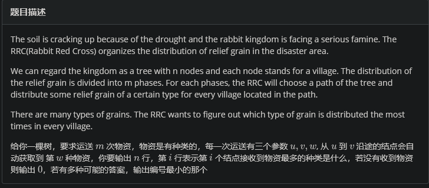
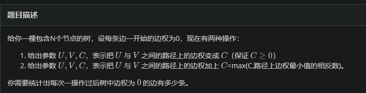

# 树剖题单

## [HDU5029](https://vjudge.net/problem/HDU-5029/origin) Relief grain



---

考虑如果只是要求一种颜色，每个节点的个数，那么我们可以用树上差分。那么这里要求多个节点，如果只是维护节点数据，我们还是可以用树上差分（对数组差分）。但是因为要维护最大值，所以要用线段树来维护。但是我们要合并多个子树的信息，因此不能用dfs过程中维护线段树，怎么办呢？用树剖将一条链分成多个串即可。

```C++
// Problem: F. Relief grain
// Contest: LibreOJ - CSP2024专题复习2
// URL: http://www.nfls.com.cn:20035/contest/2079/problem/6
// Memory Limit: 97 MB
// Time Limit: 10000 ms
// Challenger: Erica N
// ----
#include<bits/stdc++.h>

using namespace std;
#define rd read()
#define ull unsigned long long
// #define int long long 
#define itn int
#define ps second 
#define pf first

namespace fastOI{
	#define rd read()
	int read(){
	    int xx = 0, ff = 1;
	    char ch = getchar();
	    while (ch < '0' || ch > '9') {
			if (ch == '-')
				ff = -1;
			ch = getchar();
	    }
	    while (ch >= '0' && ch <= '9')
	      xx = xx * 10 + (ch - '0'), ch = getchar();
	    return xx * ff;
	}
	void write(int out) {
		if (out < 0)
			putchar('-'), out = -out;
		if (out > 9)
			write(out / 10);
		putchar(out % 10 + '0');
	}

}using namespace fastOI;


#define zerol = 1
#ifdef zerol
#define cdbg(x...) do { cerr << #x << " -> "; err(x); } while (0)
void err() {
	cerr << endl;
}
template<template<typename...> class T, typename t, typename... A>
void err(T<t> a, A... x) {
	for (auto v: a) cerr << v << ' ';
	err(x...);
}
template<typename T, typename... A>
void err(T a, A... x) {
	cerr << a << ' ';
	err(x...);
}
#else
#define dbg(...)
#endif
const int N=3e5+5;
const ull P=137;
const int INF=1e9+7;
/*

策略


*/

vector<int> e[N];

void add(int a,int b){
	e[a].push_back(b);
	e[b].push_back(a);
}
#define pii pair<int,int> 


int dep[N],	sz[N],fa[N][22];
int son[N];
int top[N];
int dfn[N],_dfn[N],tim;
int ans[N];
vector<pii> cg[N];

void dfs(int x,int f){
	dep[x]=dep[f]+1;
	sz[x]=1;
	son[x]=0;
	for(auto v:e[x]){
		if(v==f)continue;
		fa[v][0]=x;
		for(int i=1;i<=20;i++){
			fa[v][i]=fa[fa[v][i-1]][i-1];
		}
		dfs(v,x);
		sz[x]+=sz[v];
		if(sz[son[x]]<sz[v])son[x]=v;
	}
}

int lca(int a,int b){
	if(dep[a]<dep[b])swap(a,b);
	for(int i=20;~i;i--){
		if(dep[fa[a][i]]>=dep[b])a=fa[a][i];
	}
	if(a==b)return a;
	for(int i=20;~i;i--){
		if(fa[a][i]!=fa[b][i])
		{
			a=fa[a][i];
			b=fa[b][i];
		}
	}
	return fa[a][0];
}

void dfs(int x,int fa,int tp){
	top[x]=tp;
	dfn[x]=++tim;
	_dfn[tim]=x;
	if(son[x])dfs(son[x],x,tp);
	for(auto v:e[x]){
		if(v==fa||v==son[x])continue;
		dfs(v,x,v);
	}
}

void solve(int a,int b,int c){
	int anc=lca(a,b);
	
	// cdbg(a,b,anc);
	while(1){
		if(dep[top[a]]<=dep[anc]){
			cg[dfn[anc]].push_back({c,1});
			cg[dfn[a]+1].push_back({c,-1});
			break;
		}
		cg[dfn[top[a]]].push_back({c,1});
		cg[dfn[a]+1].push_back({c,-1});
		a=fa[top[a]][0];		
	}
	
	
	while(1){
		if(dep[top[b]]<=dep[anc]){
			cg[dfn[anc]+1].push_back({c,1});
			cg[dfn[b]+1].push_back({c,-1});
			break;
		}
		cg[dfn[top[b]]].push_back({c,1});
		cg[dfn[b]+1].push_back({c,-1});
		b=fa[top[b]][0];		
	}
	
}


namespace SGT{
	pii t[N<<2];
	
	pii merge(pii a,pii b){
		// cdbg(a.ps,b.ps);
		if(a.pf==b.pf)return a;
		return a.pf>b.pf?a:b;
	}
	
	void pushup(int x){
		t[x]=merge(t[x<<1],t[x<<1|1]);
	}
	
	void change(int x,int l,int r,int p,int v){
		if(l==r){
			// cdbg(l);
			t[x].pf+=v;
			return ;
		}
		int mid=l+r>>1;
		if(p<=mid)change(x<<1,l,mid,p,v);
		else change(x<<1|1,mid+1,r,p,v);
		pushup(x);
	}
	
	int query(){
		if(t[1].pf==0)return 0;
		// cdbg(t[1].pf);
		return t[1].ps;
	}
	
	
	void build(int x,int l,int r){
		if(l==r){
			t[x]={0,l};
			return ;
		}
		
		int mid=l+r>>1;
		build(x<<1,l,mid);
		build(x<<1|1,mid+1,r);
		pushup(x);
	}
}using namespace SGT;

void solve(){
	
	// memset(fa,0,sizeof fa);
		// memset(top,0,sizeof top);
			// memset(dep,0,sizeof dep);
				// memset(sz,0,sizeof sz);
					// memset(dfn,0,sizeof dfn);
						// memset(_dfn,0,sizeof _dfn);
							// memset(ans,0,sizeof ans);
							
	
	int n=rd,m=rd;
	tim=0;
	if(!n)exit(0);
	for(int i=1;i<n;i++){
		add(rd,rd);
	}
	
	build(1,1,100000);
	
	
	
	dfs(1,0);
	dfs(1,0,1);
	// cdbg(top[2]);
	
	while(m--){
		int a=rd,b=rd,c=rd;
		solve(a,b,c);
	}
	
	
	for(itn i=1;i<=n;i++){
		while(cg[i].size()){
			auto v=cg[i].back();
		// cdbg(i,v.pf,v.ps);
			change(1,1,100000,v.pf,v.ps);
			cg[i].pop_back();
		}
		// cdbg(_dfn[i],query());
		ans[_dfn[i]]=query();
	}
	
	while(cg[n+1].size())cg[n+1].pop_back();
	
	for(int i=1;i<=n;i++){
		cout<<ans[i]<<endl;
	}
	
	for(int i=1;i<=n;i++){
		while(e[i].size()){
			e[i].pop_back();
		}
	}
	
	
}

signed main(){
	while(1){
		solve();
	}	
}


```

## Play with tree



---

发现操作实际上是：

- 将路径上边权变为c

- 设路径上边权最小值为mn，将路径上边权减去min(-c,mn)

那么就是树剖板子。

```C++
// Problem: G. Play with tree
// Contest: LibreOJ - CSP2024专题复习2
// URL: http://www.nfls.com.cn:20035/contest/2079/problem/7%E3%80%81
// Memory Limit: 256 MB
// Time Limit: 1000 ms
// Challenger: Erica N
// ----


#pragma GCC optimize("O2")
#pragma GCC optimize("O3")
#pragma GCC optimize("Ofast")
#pragma GCC optimize("inline")
#pragma GCC optimize("-fgcse")
#pragma GCC optimize("-fgcse-lm")
#pragma GCC optimize("-fipa-sra")
#pragma GCC optimize("-ftree-pre")
#pragma GCC optimize("-ftree-vrp")
#pragma GCC optimize("-fpeephole2")
#pragma GCC optimize("-ffast-math")
#pragma GCC optimize("-fsched-spec")
#pragma GCC optimize("unroll-loops")
#pragma GCC optimize("-falign-jumps")
#pragma GCC optimize("-falign-loops")
#pragma GCC optimize("-falign-labels")
#pragma GCC optimize("-fdevirtualize")
#pragma GCC optimize("-fcaller-saves")
#pragma GCC optimize("-fcrossjumping")
#pragma GCC optimize("-fthread-jumps")
#pragma GCC optimize("-funroll-loops")
#pragma GCC optimize("-fwhole-program")
#pragma GCC optimize("-freorder-blocks")
#pragma GCC optimize("-fschedule-insns")
#pragma GCC optimize("inline-functions")
#pragma GCC optimize("-ftree-tail-merge")
#pragma GCC optimize("-fschedule-insns2")
#pragma GCC optimize("-fstrict-aliasing")
#pragma GCC optimize("-fstrict-overflow")
#pragma GCC optimize("-falign-functions")
#pragma GCC optimize("-fcse-skip-blocks")
#pragma GCC optimize("-fcse-follow-jumps")
#pragma GCC optimize("-fsched-interblock")
#pragma GCC optimize("-fpartial-inlining")
#pragma GCC optimize("no-stack-protector")
#pragma GCC optimize("-freorder-functions")
#pragma GCC optimize("-findirect-inlining")
#pragma GCC optimize("-frerun-cse-after-loop")
#pragma GCC optimize("inline-small-functions")
#pragma GCC optimize("-finline-small-functions")
#pragma GCC optimize("-ftree-switch-conversion")
#pragma GCC optimize("-foptimize-sibling-calls")
#pragma GCC optimize("-fexpensive-optimizations")
#pragma GCC optimize("-funsafe-loop-optimizations")
#pragma GCC optimize("inline-functions-called-once")
#pragma GCC optimize("-fdelete-null-pointer-checks")


#include<bits/stdc++.h>

using namespace std;
#define rd read()
#define ull unsigned long long
// #define int long long 
#define itn int
#define ps second 
#define pf first

namespace fastOI{
	#define rd read()
	int read(){
	    int xx = 0, ff = 1;
	    char ch = getchar();
	    while (ch < '0' || ch > '9') {
			if (ch == '-')
				ff = -1;
			ch = getchar();
	    }
	    while (ch >= '0' && ch <= '9')
	      xx = xx * 10 + (ch - '0'), ch = getchar();
	    return xx * ff;
	}
	void write(int out) {
		if (out < 0)
			putchar('-'), out = -out;
		if (out > 9)
			write(out / 10);
		putchar(out % 10 + '0');
	}

}using namespace fastOI;


#define zerol = 1
#ifdef zerol
#define cdbg(x...) do { cerr << #x << " -> "; err(x); } while (0)
void err() {
	cerr << endl;
}
template<template<typename...> class T, typename t, typename... A>
void err(T<t> a, A... x) {
	for (auto v: a) cerr << v << ' ';
	err(x...);
}
template<typename T, typename... A>
void err(T a, A... x) {
	cerr << a << ' ';
	err(x...);
}
#else
#define dbg(...)
#endif
const int N=3e5+5;
const ull P=137;
const int INF=1e9+7;
/*

策略


*/
vector<int> e[N];

void add(int a,int b){
	e[a].push_back(b);
	e[b].push_back(a);
}
#define pii pair<int,int> 


int n,m;
int dep[N],	sz[N],fa[N];
int son[N];
int top[N];
int dfn[N],_dfn[N],tim;
int ans[N];
vector<pii> cg[N];


void dfs(int x,int f){
	dep[x]=dep[f]+1;
	sz[x]=1;
	son[x]=0;
	for(auto v:e[x]){
		if(v==f)continue;
		fa[v]=x;
		dfs(v,x);
		sz[x]+=sz[v];
		if(sz[son[x]]<sz[v])son[x]=v;
	}
}

// int lca(int a,int b){
	// if(dep[a]<dep[b])swap(a,b);
	// for(int i=20;~i;i--){
		// if(dep[fa[a][i]]>=dep[b])a=fa[a][i];
	// }
	// if(a==b)return a;
	// for(int i=20;~i;i--){
		// if(fa[a][i]!=fa[b][i])
		// {
			// a=fa[a][i];
			// b=fa[b][i];
		// }
	// }
	// return fa[a][0];
// }

void dfs(int x,int fa,int tp){
	top[x]=tp;
	dfn[x]=++tim;
	_dfn[tim]=x;
	if(son[x])dfs(son[x],x,tp);
	for(auto v:e[x]){
		if(v==fa||v==son[x])continue;
		dfs(v,x,v);
	}
}


namespace SGT{
	pii t[N<<2]; // val,cnt
	int tagAdd[N<<2],tagFill[N<<2];
	//fill覆盖add
	
	pii merge(pii a,pii b){
		pii r;
		if(a.pf==b.pf){r={a.pf,a.ps+b.ps};return r;}
		return a.pf<b.pf?a:b;
	}
	
	void pushup(int x){
		t[x]=merge(t[x<<1],t[x<<1|1]);
	}


	void addtagFill(int x,int v){
		tagFill[x]=v;
		tagAdd[x]=0;
		t[x]={v,1};
	}

	void addtagAdd(int x,int v){
		t[x].pf+=v;
		if(~tagFill[x])tagFill[x]+=v;
		else tagAdd[x]+=v;
	}

	void pushdown(int x){
		if(~tagFill[x]){
			addtagFill(x<<1,tagFill[x]);
			addtagFill(x<<1|1,tagFill[x]);
			tagFill[x]=-1;
		}
		if(tagAdd[x]){
			addtagFill(x<<1,tagAdd[x]);
			addtagFill(x<<1|1,tagAdd[x]);
			tagAdd[x]=0;
		}
		
	}
	
	void changeFill(int x,int l,int r,int pl,int pr,int v){
		if(pr<pl)return ;
		if(l==r){
			// cdbg(l);
			addtagFill(x,v);
			return ;
		}
		pushdown(x);
		int mid=l+r>>1;
		if(pl<=mid)changeFill(x<<1,l,mid,pl,pr,v);
		if(pr>mid)changeFill(x<<1|1,mid+1,r,pl,pr,v);
		pushup(x);
	}

	void changeAdd(int x,int l,int r,int pl,int pr,int v){
		if(pr<pl)return ;
		if(l==r){
			addtagAdd(x,v);
			return ;
		}
		pushdown(x);
		int mid=l+r>>1;
		if(pl<=mid)changeAdd(x<<1,l,mid,pl,pr,v);
		if(pr>mid)changeAdd(x<<1|1,mid+1,r,pl,pr,v);
		pushup(x);
	}
	
	pii queryMin(int x,int l,int r,int pl,int pr){
		// if(pl==1)pl=2;
		if(pr<pl)return make_pair(INF,0); //!!!
		if(pl<=l&&pr>=r)return t[x];
		pushdown(x);
		int mid=l+r>>1;
		int fl=0,fr=0;
		pii nl,nr;
		if(pl<=mid)fl=1,nl=queryMin(x<<1,l,mid,pl,pr);
		if(pr>mid)fr=1,nr=queryMin(x<<1|1,mid+1,r,pl,pr);
		if(fl+fr==1){
			if(fl)return nl;
			else return nr;
		}
		return merge(nl,nr);
	}
	
	
	void build(int x,int l,int r){
		tagFill[x]=-1;
		if(l==r){
			t[x]={0,1};
			return ;
		}
		
		int mid=l+r>>1;
		build(x<<1,l,mid);
		build(x<<1|1,mid+1,r);
		pushup(x);
	}
}using namespace SGT;


int queryRoadMin(int u,int v){
	int res=INF;
	while(top[u]!=top[v]){
		if(dep[top[u]]<dep[top[v]])swap(u,v);//交换,使得u所在的重链top恒比v的深 ,即保证是更深的在往上跳而不是浅的一直在往上跳 
		res=min(res,queryMin(1,1,n,dfn[top[u]],dfn[u]).pf);//注意id[top[u]]<=id[u]
		u=fa[top[u]];
	}
	if(dep[u]>dep[v])swap(u,v);
	res=min(res,queryMin(1,1,n,dfn[u]+1,dfn[v]).pf);
	return res;
}


void changeRoadAdd(int u,int v,int c){
	int res=0;
	while(top[u]!=top[v]){
		if(dep[top[u]]<dep[top[v]])swap(u,v);//交换,使得u所在的重链top恒比v的深 ,即保证是更深的在往上跳而不是浅的一直在往上跳 
		changeAdd(1,1,n,dfn[top[u]],dfn[u],c);//注意id[top[u]]<=id[u]
		u=fa[top[u]];
	}
	if(dep[u]>dep[v])swap(u,v);
	changeAdd(1,1,n,dfn[u]+1,dfn[v],c);
}


void changeRoadFill(int u,int v,int c){
	int res=0;
	while(top[u]!=top[v]){
		if(dep[top[u]]<dep[top[v]])swap(u,v);//交换,使得u所在的重链top恒比v的深 ,即保证是更深的在往上跳而不是浅的一直在往上跳 
		changeFill(1,1,n,dfn[top[u]],dfn[u],c);//注意id[top[u]]<=id[u]
		u=fa[top[u]];
	}
	if(dep[u]>dep[v])swap(u,v);
	changeFill(1,1,n,dfn[u]+1,dfn[v],c);
}


signed main(){
	n=rd,m=rd;
	for(int i=1;i<n;i++){
		add(rd,rd);
	}
	
	
	dfs(1,0);
	dfs(1,0,1);
	
	build(1,1,n);
	changeFill(1,1,n,1,1,INF);
	
	while(m--){
		int op=rd,a=rd,b=rd,c=rd;
		if(op==1){
			changeRoadFill(a,b,c);
		}else{
			itn mn=queryRoadMin(a,b);
			// c=-c;
			// cdbg(mn);
			changeRoadAdd(a,b,max(-mn,c));
		}
		
		// for(int i=1;i<=n;i++)cdbg(queryMin(1,1,n,dfn[i],dfn[i]).pf);
		// cdbg("");
		

		auto v=queryMin(1,1,n,2,n);
		int res=v.ps;
		if(v.pf!=0)res=0;
		write(res);
		puts("");
	}
}


```

```C++
// Problem: G. Play with tree
// Contest: LibreOJ - CSP2024专题复习2
// URL: http://www.nfls.com.cn:20035/contest/2079/problem/7%E3%80%81
// Memory Limit: 256 MB
// Time Limit: 1000 ms
// Challenger: Erica N
// ----


#pragma GCC optimize("O2")
#pragma GCC optimize("O3")
#pragma GCC optimize("Ofast")
#pragma GCC optimize("inline")
#pragma GCC optimize("-fgcse")
#pragma GCC optimize("-fgcse-lm")
#pragma GCC optimize("-fipa-sra")
#pragma GCC optimize("-ftree-pre")
#pragma GCC optimize("-ftree-vrp")
#pragma GCC optimize("-fpeephole2")
#pragma GCC optimize("-ffast-math")
#pragma GCC optimize("-fsched-spec")
#pragma GCC optimize("unroll-loops")
#pragma GCC optimize("-falign-jumps")
#pragma GCC optimize("-falign-loops")
#pragma GCC optimize("-falign-labels")
#pragma GCC optimize("-fdevirtualize")
#pragma GCC optimize("-fcaller-saves")
#pragma GCC optimize("-fcrossjumping")
#pragma GCC optimize("-fthread-jumps")
#pragma GCC optimize("-funroll-loops")
#pragma GCC optimize("-fwhole-program")
#pragma GCC optimize("-freorder-blocks")
#pragma GCC optimize("-fschedule-insns")
#pragma GCC optimize("inline-functions")
#pragma GCC optimize("-ftree-tail-merge")
#pragma GCC optimize("-fschedule-insns2")
#pragma GCC optimize("-fstrict-aliasing")
#pragma GCC optimize("-fstrict-overflow")
#pragma GCC optimize("-falign-functions")
#pragma GCC optimize("-fcse-skip-blocks")
#pragma GCC optimize("-fcse-follow-jumps")
#pragma GCC optimize("-fsched-interblock")
#pragma GCC optimize("-fpartial-inlining")
#pragma GCC optimize("no-stack-protector")
#pragma GCC optimize("-freorder-functions")
#pragma GCC optimize("-findirect-inlining")
#pragma GCC optimize("-frerun-cse-after-loop")
#pragma GCC optimize("inline-small-functions")
#pragma GCC optimize("-finline-small-functions")
#pragma GCC optimize("-ftree-switch-conversion")
#pragma GCC optimize("-foptimize-sibling-calls")
#pragma GCC optimize("-fexpensive-optimizations")
#pragma GCC optimize("-funsafe-loop-optimizations")
#pragma GCC optimize("inline-functions-called-once")
#pragma GCC optimize("-fdelete-null-pointer-checks")


#include<bits/stdc++.h>

using namespace std;
#define rd read()
#define ull unsigned long long
// #define int long long 
#define itn int
#define ps second 
#define pf first

namespace fastOI{
	#define rd read()
	int read(){
	    int xx = 0, ff = 1;
	    char ch = getchar();
	    while (ch < '0' || ch > '9') {
			if (ch == '-')
				ff = -1;
			ch = getchar();
	    }
	    while (ch >= '0' && ch <= '9')
	      xx = xx * 10 + (ch - '0'), ch = getchar();
	    return xx * ff;
	}
	void write(int out) {
		if (out < 0)
			putchar('-'), out = -out;
		if (out > 9)
			write(out / 10);
		putchar(out % 10 + '0');
	}

}using namespace fastOI;


#define zerol = 1
#ifdef zerol
#define cdbg(x...) do { cerr << #x << " -> "; err(x); } while (0)
void err() {
	cerr << endl;
}
template<template<typename...> class T, typename t, typename... A>
void err(T<t> a, A... x) {
	for (auto v: a) cerr << v << ' ';
	err(x...);
}
template<typename T, typename... A>
void err(T a, A... x) {
	cerr << a << ' ';
	err(x...);
}
#else
#define dbg(...)
#endif
const int N=3e5+5;
const ull P=137;
const int INF=1e9+7;
/*

策略


*/
vector<int> e[N];

void add(int a,int b){
	e[a].push_back(b);
	e[b].push_back(a);
}
#define pii pair<int,int> 


int n,m;
int dep[N],	sz[N],fa[N][22];
int son[N];
int top[N];
int dfn[N],_dfn[N],tim;
int ans[N];
vector<pii> cg[N];


void dfs(int x,int f){
	dep[x]=dep[f]+1;
	sz[x]=1;
	son[x]=0;
	for(auto v:e[x]){
		if(v==f)continue;
		fa[v][0]=x;
		for(int i=1;i<=20;i++){
			fa[v][i]=fa[fa[v][i-1]][i-1];
		}
		dfs(v,x);
		sz[x]+=sz[v];
		if(sz[son[x]]<sz[v])son[x]=v;
	}
}

int lca(int a,int b){
	if(dep[a]<dep[b])swap(a,b);
	for(int i=20;~i;i--){
		if(dep[fa[a][i]]>=dep[b])a=fa[a][i];
	}
	if(a==b)return a;
	for(int i=20;~i;i--){
		if(fa[a][i]!=fa[b][i])
		{
			a=fa[a][i];
			b=fa[b][i];
		}
	}
	return fa[a][0];
}

void dfs(int x,int fa,int tp){
	top[x]=tp;
	dfn[x]=++tim;
	_dfn[tim]=x;
	if(son[x])dfs(son[x],x,tp);
	for(auto v:e[x]){
		if(v==fa||v==son[x])continue;
		dfs(v,x,v);
	}
}


namespace SGT{
	pii t[N<<2]; // val,cnt
	int tagAdd[N<<2],tagFill[N<<2];
	//fill覆盖add
	
	pii merge(pii a,pii b){
		pii r;
		if(a.pf==b.pf){r={a.pf,a.ps+b.ps};return r;}
		return a.pf<b.pf?a:b;
	}
	
	void pushup(int x){
		t[x]=merge(t[x<<1],t[x<<1|1]);
	}


	void addtagFill(int x,int v){
		tagFill[x]=v;
		tagAdd[x]=0;
		t[x]={v,1};
	}

	void addtagAdd(int x,int v){
		t[x].pf+=v;
		if(~tagFill[x])tagFill[x]+=v;
		else tagAdd[x]+=v;
	}

	void pushdown(int x){
		if(~tagFill[x]){
			addtagFill(x<<1,tagFill[x]);
			addtagFill(x<<1|1,tagFill[x]);
			tagFill[x]=-1;
		}
		if(tagAdd[x]){
			addtagFill(x<<1,tagAdd[x]);
			addtagFill(x<<1|1,tagAdd[x]);
			tagAdd[x]=0;
		}
		
	}
	
	void changeFill(int x,int l,int r,int pl,int pr,int v){
		if(pr<pl)return ;
		if(l==r){
			// cdbg(l);
			addtagFill(x,v);
			return ;
		}
		pushdown(x);
		int mid=l+r>>1;
		if(pl<=mid)changeFill(x<<1,l,mid,pl,pr,v);
		if(pr>mid)changeFill(x<<1|1,mid+1,r,pl,pr,v);
		pushup(x);
	}

	void changeAdd(int x,int l,int r,int pl,int pr,int v){
		if(pr<pl)return ;
		if(l==r){
			addtagAdd(x,v);
			return ;
		}
		pushdown(x);
		int mid=l+r>>1;
		if(pl<=mid)changeAdd(x<<1,l,mid,pl,pr,v);
		if(pr>mid)changeAdd(x<<1|1,mid+1,r,pl,pr,v);
		pushup(x);
	}
	
	pii queryMin(int x,int l,int r,int pl,int pr){
		// if(pl==1)pl=2;
		if(pr<pl)return make_pair(INF,0); //!!!
		if(pl<=l&&pr>=r)return t[x];
		pushdown(x);
		int mid=l+r>>1;
		int fl=0,fr=0;
		pii nl,nr;
		if(pl<=mid)fl=1,nl=queryMin(x<<1,l,mid,pl,pr);
		if(pr>mid)fr=1,nr=queryMin(x<<1|1,mid+1,r,pl,pr);
		if(fl+fr==1){
			if(fl)return nl;
			else return nr;
		}
		return merge(nl,nr);
	}
	
	
	void build(int x,int l,int r){
		tagFill[x]=-1;
		if(l==r){
			t[x]={0,1};
			return ;
		}
		
		int mid=l+r>>1;
		build(x<<1,l,mid);
		build(x<<1|1,mid+1,r);
		pushup(x);
	}
}using namespace SGT;

int queryRoadMin(int a,int b){
	int res=INF;
	int anc=lca(a,b);
	
	// cdbg(a,b,anc);
	while(1){
		if(dep[top[a]]<=dep[anc]){
			res=min(res,queryMin(1,1,n,dfn[anc]+1,dfn[a]).pf);
			// cdbg(anc,a,res);
			break;
		}
		res=min(res,queryMin(1,1,n,dfn[top[a]],dfn[a]).pf);
		// cdbg(top[a],a,res);
		a=fa[top[a]][0];		
	}
	
	while(1){
		if(dep[top[b]]<=dep[anc]){
			res=min(res,queryMin(1,1,n,dfn[anc]+1,dfn[b]).pf);
			// cdbg(anc,b,res);
			break;
		}
		res=min(res,queryMin(1,1,n,dfn[top[b]],dfn[b]).pf);
		// cdbg(top[b],b);
		b=fa[top[b]][0];		
	}
	// cdbg(res);
	
	return res;
	
}

void changeRoadAdd(int a,int b,int c){
	int anc=lca(a,b);
	
	// cdbg(a,b,anc);
	while(1){
		if(dep[top[a]]<=dep[anc]){
			changeAdd(1,1,n,dfn[anc]+1,dfn[a],c);
			break;
		}
		changeAdd(1,1,n,dfn[top[a]],dfn[a],c);
		a=fa[top[a]][0];		
	}
	
	while(1){
		if(dep[top[b]]<=dep[anc]){
			changeAdd(1,1,n,dfn[anc]+1,dfn[b],c);
			break;
		}
		changeAdd(1,1,n,dfn[top[b]],dfn[b],c);
		b=fa[top[b]][0];		
	}
}


void changeRoadFill(int a,int b,int c){
	int anc=lca(a,b);
	
	// cdbg(a,b,anc);
	while(1){
		if(dep[top[a]]<=dep[anc]){
			changeFill(1,1,n,dfn[anc]+1,dfn[a],c);
			break;
		}
		changeFill(1,1,n,dfn[top[a]],dfn[a],c);
		a=fa[top[a]][0];		
	}
	
	while(1){
		if(dep[top[b]]<=dep[anc]){
			changeFill(1,1,n,dfn[anc]+1,dfn[b],c);
			break;
		}
		changeFill(1,1,n,dfn[top[b]],dfn[b],c);
		b=fa[top[b]][0];		
	}
}


signed main(){
	n=rd,m=rd;
	for(int i=1;i<n;i++){
		add(rd,rd);
	}
	
	
	dfs(1,0);
	dfs(1,0,1);
	
	build(1,1,n);
	
	while(m--){
		int op=rd,a=rd,b=rd,c=rd;
		if(op==1){
			changeRoadFill(a,b,c);
		}else{
			itn mn=queryRoadMin(a,b);
			// c=-c;
			// cdbg(mn);
			changeRoadAdd(a,b,max(-mn,c));
		}
		
		// for(int i=1;i<=n;i++)cdbg(queryMin(1,1,n,dfn[i],dfn[i]).pf);
		// cdbg("");
		

		auto v=queryMin(1,1,n,2,n);
		int res=v.ps;
		if(v.pf!=0)res=0;
		write(res);
		puts("");
	}
}


```

## [SDOI2011] 染色

题目描述

给定一棵 $n$ 个节点的无根树，共有 $m$  个操作，操作分为两种：

1. 将节点 $a$ 到节点 $b$ 的路径上的所有点（包括 $a$ 和 $b$）都染成颜色 $c$。

2. 询问节点 $a$ 到节点 $b$ 的路径上的颜色段数量。

颜色段的定义是极长的连续相同颜色被认为是一段。例如 `112221` 由三段组成：`11`、`222`、`1`。

输入格式

输入的第一行是用空格隔开的两个整数，分别代表树的节点个数 $n$ 和操作个数 $m$。

第二行有 $n$ 个用空格隔开的整数，第 $i$ 个整数 $w_i$ 代表结点 $i$ 的初始颜色。

第 $3$ 到第 $(n + 1)$ 行，每行两个用空格隔开的整数 $u, v$，代表树上存在一条连结节点 $u$ 和节点 $v$ 的边。

第 $(n + 2)$ 到第 $(n + m + 1)$ 行，每行描述一个操作，其格式为：

每行首先有一个字符 $op$，代表本次操作的类型。

- 若 $op$ 为 `C`，则代表本次操作是一次染色操作，在一个空格后有三个用空格隔开的整数 $a, b, c$，代表将 $a$ 到 $b$ 的路径上所有点都染成颜色 $c$。

- 若 $op$ 为 `Q`，则代表本次操作是一次查询操作，在一个空格后有两个用空格隔开的整数 $a, b$，表示查询 $a$ 到 $b$ 路径上的颜色段数量。

输出格式

对于每次查询操作，输出一行一个整数代表答案。

数据规模与约定

对于 $100\%$ 的数据，$1 \leq n, m \leq 10^5$，$1 \leq w_i, c \leq 10^9$，$1 \leq a, b, u, v \leq n$，$op$ 一定为 `C` 或 `Q`，保证给出的图是一棵树。

除原数据外，还存在一组不计分的 hack 数据。

---

非倍增LCA的树剖写法：

每次从top更深的点往上跳，直到top相同。

此时两点在同一个链上，判断那个深浅即可。

```C++
// Problem: P2486 [SDOI2011] 染色
// Contest: Luogu
// URL: https://www.luogu.com.cn/problem/P2486
// Memory Limit: 125 MB
// Time Limit: 1000 ms
// Challenger: Erica N
// ----
#include<bits/stdc++.h>

using namespace std;
#define rd read()
#define ull unsigned long long
#define int long long 
#define itn int
#define ps second 
#define pf first

int  read(){
	int x;
	cin>>x;
	return x;
}
#define zerol = 1
#ifdef zerol
#define cdbg(x...) do { cerr << #x << " -> "; err(x); } while (0)
void err() {
	cerr << endl;
}
template<template<typename...> class T, typename t, typename... A>
void err(T<t> a, A... x) {
	for (auto v: a) cerr << v << ' ';
	err(x...);
}
template<typename T, typename... A>
void err(T a, A... x) {
	cerr << a << ' ';
	err(x...);
}
#else
#define dbg(...)
#endif
const int N=3e5+5;
const ull P=137;
const int INF=1e9+7;
/*

策略


*/

int sz[N],dep[N],son[N],dfn[N],tim,top[N],a[N];
int fa[N];
int _dfn[N];
int n,m;
vector<int> e[N];
void add(itn a,int b){
	e[a].push_back(b);
	e[b].push_back(a);
}

void dfs(int x,int f){
	dep[x]=dep[f]+1;
	sz[x]=1;
	for(auto v:e[x]){
		if(v==f)continue;
		fa[v]=x;
		dfs(v,x);
		sz[x]+=sz[v];
		if(sz[son[x]]<sz[v])son[x]=v;
	}
}


void dfs(int x,int f,int tp){
	dfn[x]=++tim;
	_dfn[tim]=x;
	top[x]=tp;
	if(son[x])dfs(son[x],x,tp);
	for(auto v:e[x]){
		if(v==f||v==son[x])continue;
		dfs(v,x,v);
	}
	
}

namespace SGT{
	struct Node{
		itn lc,rc,cnt;
	}t[N<<2];
	int tag[N<<2];
	
	Node merge(Node a,Node b){
		// cdbg(a.cnt,b.cnt);
		if(a.lc+a.rc==0)return b;
		if(b.lc+b.rc==0)return a;
		Node r={a.lc,b.rc,a.cnt+b.cnt};
		if(a.rc==b.lc)r.cnt--;
		return r;
	}
	
	void pushup(int x){
		t[x]=merge(t[x<<1],t[x<<1|1]);
	}
	
	void addtag(int x,itn c){
		t[x]={c,c,1};
		tag[x]=c;
	}
	
	void pushdown(int x){
		if(tag[x]){
			addtag(x<<1,tag[x]);
			addtag(x<<1|1,tag[x]);
			tag[x]=0;
		}
	}
	
	void change(int x,int l,int r,int pl,int pr,int v){
		if(pl<=l&&pr>=r){
			addtag(x,v);
			return ;
		}
		pushdown(x);
		int mid=l+r>>1;
		if(pl<=mid)change(x<<1,l,mid,pl,pr,v);
		if(pr>mid)change(x<<1|1,mid+1,r,pl,pr,v);
		pushup(x);
		
	}
	
	
	Node query(itn x,int l,int r,int pl,itn pr){
		if(pl<=l&&pr>=r){
			return t[x];
		}
		pushdown(x);
		int fl=0,fr=0;
		Node nl,nr;
		int mid=l+r>>1;
		if(pl<=mid)fl=1,nl=query(x<<1,l,mid,pl,pr);
		if(pr>mid)fr=1,nr=query(x<<1|1,mid+1,r,pl,pr);
		if(fl+fr==1){
			if(fl)return nl;
			return nr;
		}
		return merge(nl,nr);
	}
	
	
	void build(itn x,int l,int r){
		if(l==r){
			t[x]={a[_dfn[l]],a[_dfn[l]],1}; //!!!
			return ;
		}
		int mid=l+r>>1;
		build(x<<1,l,mid);
		build(x<<1|1,mid+1,r);
		pushup(x);
	}
}using namespace SGT;


void changeRoad(int a,itn b,int c){
	while(top[a]!=top[b]){
		if(dep[top[a]]<dep[top[b]])swap(a,b);
		change(1,1,n,dfn[top[a]],dfn[a],c);
		a=fa[top[a]];
	}
	if(dep[a]<dep[b])swap(a,b);
	change(1,1,n,dfn[b],dfn[a],c);
}


int queryRoad(int a,itn b){
	Node l={0,0,0},r={0,0,0};
	int op=1;
	while(top[a]!=top[b]){
		if(dep[top[a]]<dep[top[b]])swap(a,b),op^=1;
		Node cur=query(1,1,n,dfn[top[a]],dfn[a]);
		// cdbg(top[a],a,cur.cnt,op,cur.lc,cur.rc);
		if(op)r=merge(cur,r);
		else swap(cur.lc,cur.rc),l=merge(l,cur);
		a=fa[top[a]];
	}
	if(dep[a]<dep[b])swap(a,b),op^=1;
	Node cur=query(1,1,n,dfn[b],dfn[a]);
	// cdbg(b,a,cur.cnt,op);
	// cdbg(l.lc,l.rc,r.lc,r.rc,cur.lc,cur.rc);
	if(op){
		r=merge(cur,r);
		// swap(l.lc,l.rc);
		l=merge(l,r);
	}else{
		swap(cur.lc,cur.rc),l=merge(l,cur);
		// swap(l.lc,l.rc);
		l=merge(l,r);
	}
	
	return l.cnt;
}

signed main(){
	 n=rd,m=rd;
	for(int i=1;i<=n;i++){
		a[i]=rd;
	}
	for(int i=1;i<n;i++){
		add(rd,rd);
	}
	
	
	dfs(1,0);
	dfs(1,0,1);
	build(1,1,n);
	
	while(m--){
		// cdbg(m);
		char op;
		cin>>op;
		if(op=='C'){
			itn a=rd,b=rd,c=rd;
			changeRoad(a,b,c);
		}else{
			int a=rd,b=rd;
			cout<<queryRoad(a,b)<<endl;
		}
	}
}


```

