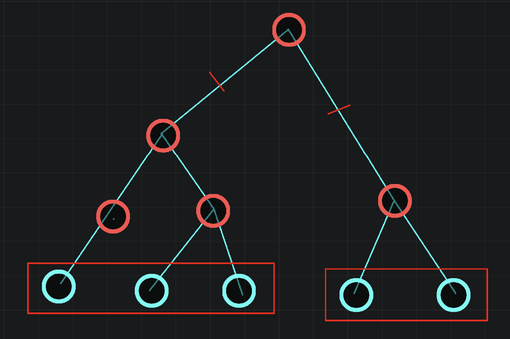
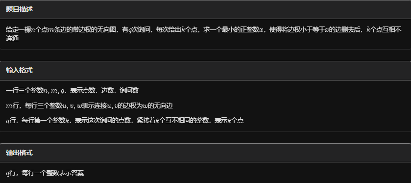

# 重构树

在信息学竞赛中，重构树是一种通过对原数据结构或问题进行重新构建而得到的新的数据结构。

一般来说，重构树常用于解决一些涉及动态修改、查询以及复杂关系处理的问题。其构建过程通常基于某种特定的规则或算法，将原有的元素或节点重新组织成一棵新的树。

重构树的主要优点在于能够将原本复杂的问题转化为在新树结构上的相对简单和高效的操作。通过巧妙地设计重构规则，可以利用树的性质（如深度、父子关系、遍历顺序等）来加速问题的解决。

例如，在一些动态规划问题中，通过构建重构树，可以将不同阶段的状态之间的复杂关系清晰地表示出来，从而更方便地进行状态转移和计算最优解。

在具体的应用中，重构树的形式和构建方式会因问题的不同而有所差异，需要根据具体的题目条件和要求进行灵活的设计和实现。

## 构造

```C++

inline void kruskal() {
    sort(g + 1, g + m + 1, cmp);
    tot = n;
    for (int i = 1; i <= m; ++i) {
        int u = find(g[i].u), v = find(g[i].v);
        if (u == v)
            continue;
        ++tot;
        val[tot] = g[i].w;
        add(tot, u);
        add(tot, v);

        // son[tot][0]=u,son[tot][1]=v;
        pa[u] = pa[v] = pa[tot] = tot;
    }
}
```

## 性质

因为是最小生成树，所以在重构树上的两个节点u,v的lca的权值就是原最小生成树中u-v路径上的最大边权。

## 例题 #1 Graph and Queries

题面翻译

给定一个 $n$ 个点 $m$ 条边的无向图，第  $i$ 个点的点权初始值为  $p_i$,所有 $p_i$ 互不相同。

接下来进行 $q$ 次操作，分为两类：

- $\tt 1\ v$ 查询与  $v$ 连通的点中， $p_u$ 最大的点  $u$ 并输出  $p_u$，然后让  $p_u=0$。

- $\tt 2\ i$ 将第 $i$ 条边删掉。

翻译者：一只书虫仔


### kruscal 重构树

我们将操作倒过来，并且把删边改为加边。并且我们的加边应该按照kruscal重构树的方法来加边。

那么什么是kruscal重构树呢？

假设我们从一个无边图开始，连接u,v，我们称重构树的图为R，那我们就应该在R中新建一个节点x，然后连接u-x,v-x。接下来，我们在一个节点a连接到u（或者v），那么我们再新建一个节点y，连接x-y,a-y，以此类推。

最后我们发现原图中某一时刻各联通的点集一定是R中的一些子树。



并且联通的点的dfs序也是在一个区间内的（这里的dfs序不计算红点，即只计算$1\sim n$的）。所以我们现在要知道点u在某一个时刻的联通块，只需要在R中找到那个祖先即可。那么这样找呢？我们每一个红点都有一个时间戳作为它加入的时间，并且祖先的时间戳一定晚于儿子的（这里的时间指倒序的状态下），所以我们发现单调性就可以倍增了。

区间维护用线段树。

### 代码

注意图可能不联通。这里我们建立一个超级源点0.

注意可能有环。

注意线段树中叶子节点对应的是原来$1\sim n$节点的对应的dfs序。

```C++

#include <bits/stdc++.h>
#include <queue>
using namespace std;

#define rep(i, l, r) for (int i = l, END##i = r; i <= END##i; ++i)
#define per(i, r, l) for (int i = r, END##i = l; i >= END##i; --i)
#define pb push_back
#define mp make_pair
#define int long long
#define pii pair<int, int>
#define ps second
#define pf first

// #define innt int
// #define inr int
// #define mian main
// #define iont int

#define rd read()
int read(){
    int xx = 0, ff = 1;
    char ch = getchar();
    while (ch < '0' || ch > '9') {
		if (ch == '-')
			ff = -1;
		ch = getchar();
    }
    while (ch >= '0' && ch <= '9')
      xx = xx * 10 + (ch - '0'), ch = getchar();
    return xx * ff;
}
void write(int out) {
	if (out < 0)
		putchar('-'), out = -out;
	if (out > 9)
		write(out / 10);
	putchar(out % 10 + '0');
}

// const bool enable_dbg = false;
// template <typename T,typename... Args>
// void dbg(bool flg,T s,Args... args) {
// 	if constexpr (enable_dbg){
// 		cout << s;
// 		if constexpr (sizeof...(Args))
// 			dbg(flg,args...);
// 	}
// }

const int N = 3e5 + 5;
const int INF = 1e18;
const int M = 1e7;
const int MOD = 1e9 + 7;

int p[N];
int dfn[N],cdfn=0;

namespace SGT{//线段树
    int t[N<<2];

    void pushup(int x){//维护区间最大值
        t[x]=max(t[x<<1],t[x<<1|1]);
    }
    void build(int x,int l,int r){//按dfs序建树
        if(l==r){
            t[x]=p[dfn[l]];
            return ;
        }
        int mid=l+r>>1;
        build(x<<1,l,mid);
        build(x<<1|1,mid+1,r);
        pushup(x);
    }
    void change(int x,int l,int r,int p,int v){//单点修改点的权值
        if(l==r){
            t[x]=v;
            return ;
        }
        int mid=l+r>>1;
        if(p<=mid)change(x<<1,l,mid,p,v);
        else change(x<<1|1,mid+1,r,p,v);
        pushup(x);
    }
    int query(int x,int l,int r,int pl,int pr){//找区间内最大值所在的叶子节点
        if(l==r){
            return l;
        }
        int mid=l+r>>1;
        int res1=0,res2=0;
        if(pl<=mid)res1=query(x<<1,l,mid,pl,pr);
        if(pr>mid)res2=query(x<<1|1,mid+1,r,pl,pr);
        if(res1&&res2){
            if(p[res1]>p[res2])return res1;
            return res2;
        }
        return res1+res2;
    }
}

struct edge{
    int a,b;
}b[N];

struct query{
    int op,v;
}o[N];

struct node{
    int l,r;
}tr[N];

int tot;
int fa[N][22];
vector<int> e[N];
int delt[N],del[N];
int n,m,q;

//并查集
int bel[N];
int find(int x){
    if(bel[x]==x)return x;
    return  bel[x]=find(bel[x]);
}

void add(int a,int b){
    e[a].push_back(b);
    e[b].push_back(a);

    // cerr<<a<<' '<<b<<endl;
}
void addedge(int x,int t){
    int u=find(b[x].a);
    int v=find(b[x].b);
    if(u==v){return ;}
    
    add(u,++tot);
    add(v,tot);
    delt[tot]=t;
    bel[u]=tot,bel[v]=tot;
}

int _dfn[N];

void dfs0(int x,int f){
    if(x>0&&x<=n)dfn[x]=++cdfn,_dfn[cdfn]=x;
    for(auto v:e[x]){
        if(v==f)continue;
        dfs0(v,x);
    }  
    return ;
}

void dfs(int x,int f){
    if(x&&x<=n){
        tr[x].l=dfn[x],tr[x].r=dfn[x];
        return ;
    }
    int l=INF,r=0;
    for(auto v:e[x]){
        if(v==f)continue;
        fa[v][0]=x;//预处理倍增
        for(int i=1;i<=19;i++){
            fa[v][i]=fa[fa[v][i-1]][i-1];
        }
        dfs(v,x);
        l=min(l,tr[v].l);
        r=max(r,tr[v].r);
    }
    tr[x].l=l,tr[x].r=r;
    // cerr<<"build range:"<<x<<' '<<l<<' '<<r<<endl;
}

void query(int x,int t){
    for(int i=19;~i;i--){
        if(delt[fa[x][i]]>t)x=fa[x][i];//走到x为恰好没有被删除的那个.
    }
    // cerr<<"findanc:"<<x<<' '<<tr[x].l<<' '<<tr[x].r<<endl;
    int res=SGT::query(1,1,n,tr[x].l,tr[x].r);
    cout<<p[_dfn[res]]<<endl;
    p[res]=0;
    SGT::change(1,1,n,res,0);

}

void solve(){
    n=rd,m=rd,q=rd;
    for(int i=1;i<=n<<1;i++){
        bel[i]=i;//并查集
    }
    tot=n;
    for(int i=1;i<=n;i++){
        p[i]=rd;
    }
    for(int i=1;i<=m;i++){
        b[i].a=rd;b[i].b=rd;
    }

    for(int i=1;i<=q;i++){
        o[i].op=rd;
        o[i].v=rd;
        if(o[i].op==2)del[o[i].v]=1;
    }
    // cerr<<"Re-kruscal:"<<endl;
    for(int i=1;i<=m;i++){
        if(!del[i])addedge(i,q+1);//看成是最后删除的
        
    }
    for(int i=q;i;i--){
        if(o[i].op==2){
            addedge(o[i].v,i);
        }
    }
    // cerr<<"delt[]:"<<endl;
    // for(int i=1;i<=tot;i++)cerr<<delt[i]<<' ';
    // cerr<<endl;

    for(int i=1;i<=tot;i++){
        if(find(i)){
            int anc=find(i);
            add(anc,0);bel[anc]=0;
        }
    }

    
    dfs0(0,0);
    SGT::build(1,1,n);

    // cerr<<"_dfn[]:"<<endl;
    // for(int i=1;i<=n;i++){
    //     cerr<<_dfn[i]<<' ';
    // }
    // cerr<<endl;
    dfs(0,0);
    for(int i=1;i<=q;i++){
        if(o[i].op==1){
            // cerr<<i<<endl;
            query(o[i].v,i);
        }
    }
}

signed main() {
    int T=1;
    while(T--){
    	solve();
    }
    return 0;
}
```

## 例题 #2 删边



---

```C++
/*
                      Keyblinds Guide
                                ###################
      @Ntsc 2024

      - Ctrl+Alt+G then P : Enter luogu problem details
      - Ctrl+Alt+B : Run all cases in CPH
      - ctrl+D : choose this and dump to the next
      - ctrl+Shift+L : choose all like this
      - ctrl+K then ctrl+W: close all
      - Alt+la/ra : move mouse to pre/nxt pos'

*/
#include <bits/stdc++.h>
#include <queue>
using namespace std;

#define rep(i, l, r) for (int i = l, END##i = r; i <= END##i; ++i)
#define per(i, r, l) for (int i = r, END##i = l; i >= END##i; --i)
#define pb push_back
#define mp make_pair
//#define int long long
#define pii pair<int, int>
#define ps second
#define pf first
#define ull unsigned long long

#define itn int
// #define inr int
// #define mian main
// #define iont int

#define rd read()
int read() {
    int xx = 0, ff = 1;
    char ch = getchar();
    while (ch < '0' || ch > '9') {
        if (ch == '-')
            ff = -1;
        ch = getchar();
    }
    while (ch >= '0' && ch <= '9') xx = xx * 10 + (ch - '0'), ch = getchar();
    return xx * ff;
}
void write(int out) {
    if (out < 0)
        putchar('-'), out = -out;
    if (out > 9)
        write(out / 10);
    putchar(out % 10 + '0');
}

#define ell dbg('\n')
const char el = '\n';
const bool enable_dbg = 1;
template <typename T, typename... Args>
void dbg(T s, Args... args) {
    if constexpr (enable_dbg) {
        if (1)
            cerr << ' ';
        cerr << s;
        if constexpr (sizeof...(Args))
            dbg(args...);
    }
}

#define zerol = 1
#ifdef zerol
#define cdbg(x...)            \
    do {                      \
        cerr << #x << " -> "; \
        err(x);               \
    } while (0)
void err() { cerr << endl; }
template <template <typename...> class T, typename t, typename... A>
void err(T<t> a, A... x) {
    for (auto v : a) cerr << v << ' ';
    err(x...);
}
template <typename T, typename... A>
void err(T a, A... x) {
    cerr << a << ' ';
    err(x...);
}
#else
#define dbg(...)
#endif

const int N = 2e6 + 5;
const int INF = 1e18;
const int M = 1e7;
const int MOD = 1e9 + 7;

itn n, m, q;

struct edge {
    int u, v, w;
} g[N];

inline bool cmp(edge a, edge b) { return a.w > b.w; }

int pa[N];

int find(int x) {
    if (pa[x] == x)
        return x;
    return pa[x] = find(pa[x]);
}

vector<int> e[N];

inline void add(itn a, itn b) {
    //	cdbg(a,b);
    e[a].pb(b);
    e[b].pb(a);
}

namespace LCA {
  
int dfn[N << 1], pos[N], tim, st[30][(N << 1) + 2], rev[30][(N << 1) + 2],
    depth[N];  // rev表示最小深度对应的节点编号
int lg[N];
void dfs(int cur, int dep) {
    dfn[++tim] = cur;
    depth[tim] = dep;
    pos[cur] = tim;
    for (auto v : e[cur]) {
        if (!pos[v]) {
            dfs(v, dep + 1);
            dfn[++tim] = cur, depth[tim] = dep;
        }
    }
}

void init() {
    for (int i = 2; i <= tim + 1; ++i) lg[i] = lg[i >> 1] + 1;
    for (int i = 1; i <= tim; i++) st[0][i] = depth[i], rev[0][i] = dfn[i];
    for (int i = 1; i <= lg[tim]; i++)
        for (int j = 1; j + (1 << i) - 1 <= tim; j++)
            if (st[i - 1][j] < st[i - 1][j + (1 << i - 1)])
                st[i][j] = st[i - 1][j], rev[i][j] = rev[i - 1][j];
            else
                st[i][j] = st[i - 1][j + (1 << i - 1)], rev[i][j] = rev[i - 1][j + (1 << i - 1)];
}

int lca(int l, int r) {
    int k = lg[r - l + 1];
    return st[k][l] < st[k][r + 1 - (1 << k)] ? rev[k][l] : rev[k][r + 1 - (1 << k)];
}
}  // namespace LCA
using namespace LCA;

int tot;
itn val[N];

inline void kruskal() {
    sort(g + 1, g + m + 1, cmp);
    tot = n;
    for (int i = 1; i <= m; ++i) {
        int u = find(g[i].u), v = find(g[i].v);
        if (u == v)
            continue;
        ++tot;
        val[tot] = g[i].w;
        add(tot, u);
        add(tot, v);

        // son[tot][0]=u,son[tot][1]=v;
        pa[u] = pa[v] = pa[tot] = tot;
    }
}

inline bool cmp2(int a, int b) { return pos[a] < pos[b]; }

int a[N];

void solve() {
    n = rd, m = rd, q = rd;

    for (int i = 1; i <= m; ++i) g[i].u = rd, g[i].v = rd, g[i].w = rd;
    for (int i = 1; i <= n; i++) pa[i] = i;

    kruskal();

    dfs(tot, 0);
    init();

    while (q--) {
        int k = rd;
        for (int i = 1; i <= k; i++) {
            a[i] = rd;
        }

        int ans = 0;
        sort(a + 1, a + k + 1, cmp2);
        for (int i = 1; i < k; i++) {
            itn anc = lca(min(pos[a[i]], pos[a[i + 1]]), max(pos[a[i]], pos[a[i + 1]]));
            //			cdbg(a[i],a[i+1],anc);
            ans = max(ans, val[anc]);
        }

        write(ans);
        puts("");
    }
}

signed main() {
    // freopen(".in","r",stdin);
    // freopen(".in","w",stdout);

    int T = 1;
    while (T--) {
        solve();
    }
    return 0;
}
```

