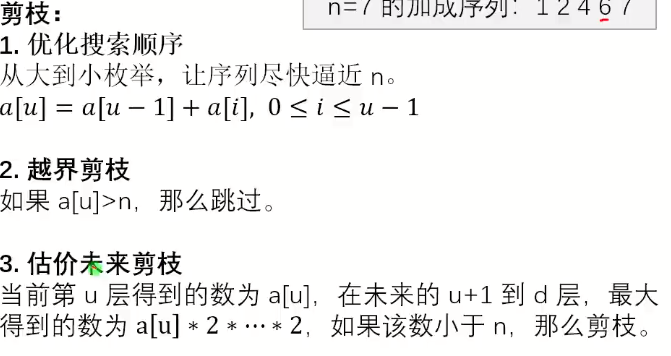
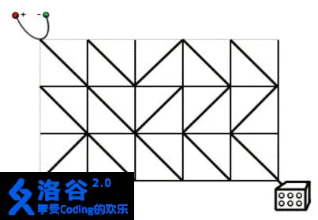
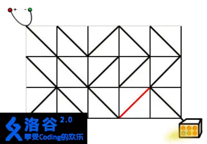
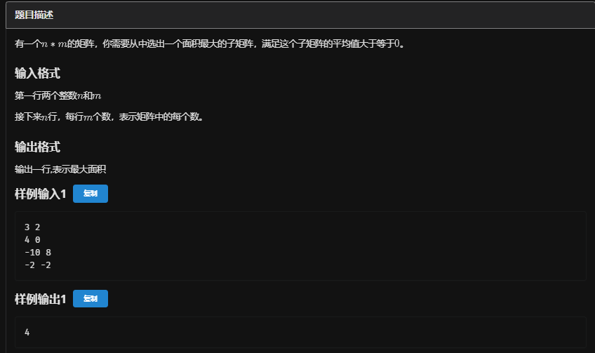

# 剪枝




想必不需要多说了，懂的都懂

## 优化搜索顺序

### 例题 #1 [BalticOI 2011 Day1] Switch the Lamp On 电路维修

题面翻译题目描述

Casper 正在设计电路。有一种正方形的电路元件，在它的两组相对顶点中，有一组会用导线连接起来，另一组则不会。有 $N\times M$ 个这样的元件，你想将其排列成 $N$ 行，每行 $M$ 个。 电源连接到板的左上角。灯连接到板的右下角。只有在电源和灯之间有一条电线连接的情况下，灯才会亮着。为了打开灯，任何数量的电路元件都可以转动 90°（两个方向）。





在上面的图片中，灯是关着的。如果右边的第二列的任何一个电路元件被旋转 90°，电源和灯都会连接，灯被打开。现在请你编写一个程序，求出最小需要多少旋转多少电路元件。

输入出格式

输入格式

输入的第一行包含两个整数 $N$ 和 $M$，表示盘子的尺寸。 在以下 $N$ 行中，每一行有 $M$ 个符号 `\` 或 `/`，表示连接对应电路元件对角线的导线的方向。

输出格式：

如果可以打开灯，那么输出只包含一个整数，表示最少转动电路元件的数量。

如果不可能打开灯，输出 `NO SOLUTION`。

对于 $40\%$ 的数据，$1 \le N \le 4$，$1 \le M \le 5$。

对于所有数据，$1 \le N,M \le 500$。

---

为了快速逼近答案，我们发现我们应该尽量多使用一些原有的线路，也就是说优先选择不选择。

于是我们就可以把bfs过程中的队列修改为双端队列，将优先级高的往队头插入，优先级低的往队尾插入。

在本题中，这样可以保证队列的单调性，因为插入队头的元素的距离和原来的是一样的，左右插入队尾的在原来的基础上+1了。

```C++
const int N = 3e3 + 5;
const int INF = 1e18;
const int M = 1e7;
const int MOD = 1e9 + 7;

int dx[] = {1, -1, -1, 1}; 
int dy[] = {1, 1, -1, -1};
int dxx[] = {0, -1, -1, 0};
int dyy[] = {0, 0, -1, -1};

char op[] = "\\/\\/";

list <int> qx; 
list <int> qy;
char a[N][N]; 
int d[N][N]; 
int n, m;        


void bfs()
{                                   
    memset(d, 0x3f, sizeof(d)); 
    qx.push_back(0);                 
    qy.push_back(0);
    d[0][0] = 0;
    while (qx.size())
    {                       
        int x = qx.front(); 
        int y = qy.front();
        qx.pop_front(); 
        qy.pop_front();
        for (int i = 0; i < 4; i++)
        {                         
            int xx = x + dx[i]; 
            int yy = y + dy[i];
            int xxx = x + dxx[i]; //xxx为点坐标，xx为格坐标
            int yyy = y + dyy[i];
            if (xx >= 0 && xx <= n && yy >= 0 && yy <= m)
            { 
                if (op[i] != a[xxx][yyy])
                {                            
                    int t = d[x][y] + 1; 
                    if (t < d[xx][yy])
                    {                     
                        qx.push_back(xx); //把要旋转的丢在后面，优先走不旋转的，更快逼近答案
                        qy.push_back(yy);
                        d[xx][yy] = t;
                    }
                }
                else
                {                        
                    int t = d[x][y]; 
                    if (t < d[xx][yy])
                    {                      
                        qx.push_front(xx); //优先走不旋转的，更快逼近答案
                        qy.push_front(yy);
                        d[xx][yy] = t;
                    }
                }
            }
        }
    }
        cout << d[n][m] << endl; 
}

void solve()
{
    n=rd,m=rd;

    for (int i = 0; i < n; i++)cin>>a[i];


    if ((n + m) % 2)             
        cout << "NO SOLUTION\n"; 
    else
        bfs(); 
}

signed main()
{
    int T = 1;
    while (T--)
    {
        solve();
    }
    return 0;
}
```

## 最优化剪枝

最优化剪枝是一种在搜索算法或求解最优化问题过程中使用的技术。

其核心思想是在搜索过程中，通过一定的判断条件提前终止那些不可能产生最优解的分支，从而减少不必要的计算，提高算法的效率。

例如，在进行回溯算法或者树的遍历求解最优值时，如果根据当前已有的部分解和一些先验知识，能够确定沿着当前分支继续搜索下去无法得到比已知最优解更优的结果，就可以将这个分支剪掉，不再继续深入探索。

最优化剪枝通常需要结合具体问题的特性和一些巧妙的设计来确定合适的剪枝条件，以在不丢失最优解的前提下最大程度地减少搜索空间。

### 例题 #1 优秀子矩阵



---

最优化剪枝

我们还是按照$O(n^2m)$的套路去扫描。

加入当前扫描到了r，此时答案左边界为l。那么当r+1时，我们就让预期答案l+1，然后通过前缀最大值判断l是否可以-1.知道越界或不在符合要求。

因为此时我们答案区间的长度是递增的，所以时间复杂度为O(m)。

合计复杂度为$O(n^2m)$

```C++
/*
                      Keyblinds Guide
                                ###################
      @Ntsc 2024

      - Ctrl+Alt+G then P : Enter luogu problem details
      - Ctrl+Alt+B : Run all cases in CPH
      - ctrl+D : choose this and dump to the next
      - ctrl+Shift+L : choose all like this
      - ctrl+K then ctrl+W: close all
      - Alt+la/ra : move mouse to pre/nxt pos'

*/
#include <bits/stdc++.h>
#include <queue>
using namespace std;

#define rep(i, l, r) for (int i = l, END##i = r; i <= END##i; ++i)
#define per(i, r, l) for (int i = r, END##i = l; i >= END##i; --i)
#define pb push_back
#define mp make_pair
#define int long long
#define pii pair<int, int>
#define ps second
#define pf first
#define ull unsigned long long

#define itn int
// #define inr int
// #define mian main
// #define iont int

#define rd read()
int read() {
    int xx = 0, ff = 1;
    char ch = getchar();
    while (ch < '0' || ch > '9') {
        if (ch == '-')
            ff = -1;
        ch = getchar();
    }
    while (ch >= '0' && ch <= '9') xx = xx * 10 + (ch - '0'), ch = getchar();
    return xx * ff;
}
void write(int out) {
    if (out < 0)
        putchar('-'), out = -out;
    if (out > 9)
        write(out / 10);
    putchar(out % 10 + '0');
}

#define ell dbg('\n')
const char el = '\n';
const bool enable_dbg = 1;
template <typename T, typename... Args>
void dbg(T s, Args... args) {
    if constexpr (enable_dbg) {
        cerr << s;
        if (1)
            cerr << ' ';
        if constexpr (sizeof...(Args))
            dbg(args...);
    }
}

const int N = 3e3 + 5;
const int INF = 1e18;
const int M = 1e5;
const int MOD = 1e9 + 7;

int ans;
int a[N][N];
int p[N][N];

itn pre[N];

void solve() {
    itn n = rd, m = rd;

    for (int i = 1; i <= n; i++) {
        for (itn j = 1; j <= m; j++) {
            a[i][j] = rd;
        }
    }

    for (int i = 1; i <= n; i++) {
        for (itn j = 1; j <= m; j++) {
            p[i][j] = p[i - 1][j] + p[i][j - 1] + a[i][j] - p[i - 1][j - 1];
        }
    }

    pre[0] = 0;
    for (int i = 1; i <= n; i++) {
        for (int j = i; j <= n; j++) {
            int l = 0;
            for (itn k = 1; k <= m; k++) {
                while (l >= 1 && pre[l - 1] <= p[j][k] - p[i - 1][k]) l--;

                if (pre[l] <= p[j][k] - p[i - 1][k])
                    ans = max(ans, (j - i + 1) * (k - l));

                pre[k] = min(pre[k - 1], p[j][k] - p[i - 1][k]);
                l++;
            }
        }
    }

    cout << ans << endl;

    //前缀最小值单调
}

signed main() {
    freopen("rec.in", "r", stdin);
    freopen("rec.out", "w", stdout);

    int T = 1;
    while (T--) {
        solve();
    }
    return 0;
}
```

## 估价函数剪枝

基于**估价函数的剪枝**常用于一些复杂的问题，如棋类游戏，例如围棋和国际象棋等。 在这些问题中，**估价函数**可以评估当前局面的好坏，从而帮助搜索算法更加精准地判断哪些分支需要被搜索，哪些分支可以被剪掉。

如果在迭代加深的基础上设计出一个乐观**估价函数**，预测从当前结点至少还需要扩展几层结点才有可能得到解，则迭代加深搜索变成了 IDA * 算法。

